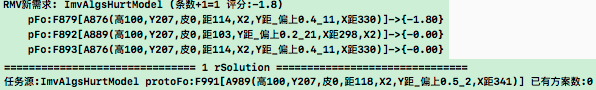
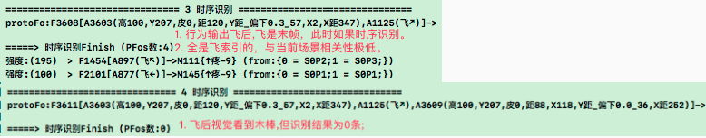
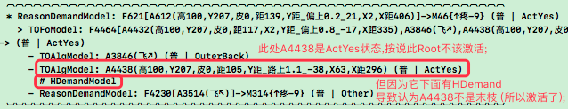

# 螺旋调教 & TCSolution前段条件满足迭代

***

<!-- TOC -->

- [螺旋调教 & TCSolution前段条件满足迭代](#螺旋调教--tcsolution前段条件满足迭代)
  - [n28p01 回测](#n28p01-回测)
  - [n28p02 迭代Canset前段条件满足](#n28p02-迭代canset前段条件满足)
  - [n28p03 回测条件满足代码](#n28p03-回测条件满足代码)
  - [n28p04 回测识别越来越准问题](#n28p04-回测识别越来越准问题)
  - [n28p05 解决条件满足不完全问题](#n28p05-解决条件满足不完全问题)
  - [n28p06 回测条件满足功能 & 修复S没后段问题](#n28p06-回测条件满足功能--修复s没后段问题)
  - [n28p06B 回测大整理: 旧有拉下的测试项整理](#n28p06b-回测大整理-旧有拉下的测试项整理)
  - [n28p07 测canset再类比很少 & S准确度很低](#n28p07-测canset再类比很少--s准确度很低)
  - [n28p08 使S竞争越来越准:`整体分析 + 前段部分`](#n28p08-使s竞争越来越准整体分析--前段部分)
  - [n28p09 使S竞争越来越准:`中段部分 + 后段部分`](#n28p09-使s竞争越来越准中段部分--后段部分)
  - [n28p10 使S竞争越来越准:`测试`](#n28p10-使s竞争越来越准测试)
  - [n28p11 过滤器+排名器=竞争机制迭代](#n28p11-过滤器排名器竞争机制迭代)
  - [n28p12 回测S竞争越来越准问题 & 测连续飞躲](#n28p12-回测s竞争越来越准问题--测连续飞躲)
  - [n28p13 回测决策循环: 实现连续飞躲](#n28p13-回测决策循环-实现连续飞躲)
  - [n28p14 继续测试连续飞躲,修复其间BUG](#n28p14-继续测试连续飞躲修复其间bug)
  - [n28p15 回测连续飞躲 & 准备觅食训练](#n28p15-回测连续飞躲--准备觅食训练)
  - [n28p16 解决飞错方向BUG](#n28p16-解决飞错方向bug)
  - [n28p17 觅食训练](#n28p17-觅食训练)

<!-- /TOC -->

## n28p01 回测
`CreateTime 2022.12.29`

在n27末，做了概念与时序的综合竞争,本节从其测试入手,看是否实现了概念和时序的优中择优;

| 28011 | 回测前分析 |
| --- | --- |
| 回顾 | 在2722f中,概念时序识别后,立马进行了refStrong和contentStrong增强 |
| 问题 | 在后续持续激活(有用)时,是否应该续杯(再增强strong)? |
|  | 比如: 时序跟进顺利了,然后引发了思考,解决了问题,等等; |
| 先测 | 或者先测下,如果跑着没实现优者更优,再来做这个; |

| 28012 | 回测训练 |
| --- | --- |
| 说明 | 回测下概念和时序的自然竞争,并训练下危险/安全地带; |
| 训练 | 依2722c步骤训练得FZ67; |

| 28013 | 触发器时间为0导致无效方案P值高的BUG |
| --- | --- |
| 复现 | `FZ67,危险地带,直投`,发现执行方案的末帧deltaTime=0,导致反省为P; |
| 示图 |  |
| 调试 | 经调试,canset本来就没Mv指向,所以=0; |
| 方案 | 应继承任务的mvDeltaTime,等pFo自然无解时,此处再触发即是准确的; |
| 结果 | 改为pFo.mvDeltaTime后,回测重训FZ68后ok,不再有此BUG `T`; |

| 28014 | 取得无效解决方案且未有效执行BUG |
| --- | --- |
| 问题 | `FZ68,危险地带,扔木棒`,测得下图问题,取得方案无效,且未有效执行; |
| 说明 | 本表重点关注取得`解决方案`的有效性,并能够有效执行后解决实际问题; |
| 示图 |  |
| 如图 | 偏上0.2的危险地带,取得解决方案为`偏下0.6`,且为末帧,无行为输出; |
| 分析1 | 找个实例,是解决方案的过去帧导致其有效,如果没有过去帧,则致其无效; |
|  | 实例: 张三做饭,小红就开心,如果张三买饭,小红不一定开心; |
| 分析2 | 能不能使`有行为输出的解决方案`更有优先级? |
|  | 分析: 即更全时序条件满足,比如前段全匹配且已发生; |
| 分析3 | 现代码用indexDic判断截点,indexDic即mIsC容易不太匹配时也有关联; |
|  | 说明: 学习后期`危险地带`很明确时,是否改为contains判断匹配; |
| 方案 | 综上三条分析,即前段必须全contains满足,才做为解决方案并行为化后段; |
| 结果 | 即本问题其实是`solutionFo前段条件满足`问题,`代码实践转n28p02`; |

***

## n28p02 迭代Canset前段条件满足
`CreateTime 2023.01.04`

在上节测试中,发现`无效解决方案`的问题,后经28014的三条分析,解决方案的前段应由瞬时序列判断contains成立,然后行为化后段,本节重点对其代码实践;

| 28021 | 迭代Canset前段条件满足-实践前回顾现有相关代码 |
| --- | --- |
| 回顾 | 在27224中: `canset前段如果有遗漏,则当前canset为无效方案` |
| 例如 | [准备好枪,老虎出现,开枪吓跑],还没准备枪老虎就出现,则方案无效; |
| 分析 | 在27224中,是判断canset包含pFo已发生部分; |
| 问题1 | 27224好像并没有正面解决此问题,因为indexDic的缘故,它似乎必然满足; |
|  | > 原因: canset与pFo有indexDic所以肯定关联,但关联过度广泛(泛而不准) |
|  | > 分析: 所以现在需要改为contains判断,不能依赖indexDic; |
| 问题2 | `准备枪`肯定不在瞬时记忆中,那么我们不能通过瞬时序列判断contains; |
|  | 分析: 那么它就在工作记忆树中,比如路径如下: |
|  | 目标: 顺着pFo,找出它当时识别的matchAlgs,进而判断contains; |
|  | 因为: protoFo/regroupFo本来就是protoAlg或feedbackProtoAlg组成; |
|  | 结果: 所以protoAlg的抽象即matchAlgs `转28022-todo1`; |
| 结果 | 综上,现有代码27224压根没起到作用,本次条件满足代码改动`转28022`; |

| 28022 | 迭代Canset前段条件满足-R任务-代码实践 |
| --- | --- |
| todo1 | 顺着工作记忆找出每帧的概念识别结果matchAlgs `T`; |
| todo2 | 判断每帧的matchAlgs是否包含对应的cansetAlg `T`; |
| todo3 | TCSolution的cansets写前段条件满足代码 (一帧不包含则过虑掉) `T`; |
| todo4 | 所有已发生帧,都要判断一下条件满足 (<ptAleardayCount部分) `T`; |
| todo5 | 将前段条件满足功能写到`canset候选集过滤器`中 `T`; |
| todo6 | matchFo是抽象的,所以它缺帧时的满足也需要判断 `转28023`; |

| 28023 | 分析一下canset的前段在match中不具备的帧 |
| --- | --- |
| 比如 | matchFo是[遇老虎],cansetFo是[拿枪,遇老虎] |
| 说明 | 此时,即使canset的遇老虎条件满足,但拿枪未必满足; |
| 思路 | 所以要从protoFo中,看有没有(拿枪),而这一判断不能依赖matchFo; |
| 结果 | 本节具体方案和代码实践: `转28051 & 28052`; |

| 28024 | 迭代Canset前段条件满足-H任务 |
| --- | --- |
| 说明 | 在28022中,仅对R任务做了做了代码实践,H任务放在本表进行 |
| 示图 |  |
| 问题1 | 怎么取H任务时的综合indexDic? |
| 回答1 | 从工作记忆树的末枝向头枝递归找R任务下的protoFo; |
|  | 每一次递归,都将执行过的indexDic累计为sumIndexDic `代码转28025-2`; |
| 问题2 | 问题1中的sumIndexDic累计方式是什么? |
|  | 设: 将已累计的讲为sumIndexDic,新一条计为itemIndexDic; |
| 回答2 | sum是具象,item是抽象,故sum中的抽象等于item的具象时,综合记为新的; |
|  | 比如: sum<抽2,具1>,item<抽3,具2>,因为sum的抽(2)=item的具(2); |
|  | > 所以最终得出的结果就是newSumIndexDic<抽3,具1> `代码转28025-3`; |
| 结果 | 如上H任务的indexDic综合计算方式代码实践转28025; |

| 28025 | 迭代Canset前段条件满足-H任务-代码实践 |
| --- | --- |
| todo1 | 将basePFoOrTargetFo在短时记忆树R下层的每层H中一直传递 `T`; |
| todo2 | 写H向工作记忆树根方向找R.protoFo的递归方法 `T`; |
| todo3 | 递归方法中,计算28024回答2中sumIndexDic的方式 `T`; |
| todo4 | 找到R.protoFo后,退出递归,算法可复用28022中R任务时的代码 `T`; |
| todo5 | 前段条件满足的代码,也复用28022中R任务时的代码 `T`; |
| todo6 | 将H任务递归算法写成最终返回cansetMatchIndexDic `T`; |
| todo7 | H任务取cansetMatchIndexDic与R任务取它复用一个算法 `T`; |
| todo8 | H任务向root方向找pFo (R任务也封装复用一个算法) `T`; |

结果: R和H任务的前段条件满足代码全写了,但28023空帧的问题还未写,后面再写;

***

## n28p03 回测条件满足代码
`CreateTime 2023.01.13`

| 28031 | 回测条件满足代码 |
| --- | --- |
| 第一轮测试 | 经`FZ6802,再跑第二步训练`测试,发现R任务跑条件满足代码大致ok; |

| 28032 | 识别不够准的问题 |
| --- | --- |
| proto | A6059(高100,Y207,皮0,X2,Y距_偏下0.4_59,距129,X距374) |
| match | A1765(高100,Y207,皮0,X2,距80,Y距_路下1.4_123,X距213) |
| 问题 | A6059偏上0.4,却识别到A1765路下1.4,可见不够准; |
| 方案 | 可以边训练边观察一下识别结果,是否变的越来越准,如果是那就加训解决; |

| 28033 | 以往训练步骤 `训练无果,但经分析制定了修改方案` |
| --- | --- |
| 步骤1 | 随机出生位置:`随机位置扔木棒,重启`x200轮 & `左棒,重启`x100轮x3次 |
| 说明 | 训练完后,观察日志,看有没有越来越明确的识别结果; |
| 问题 | 经训练,概念识别准确度提升不明显,到最后偏上0.4还是会识别有路下1.5; |
| 关键 | 识别无法越来越准会导致很多问题; |
|  | 比如: 这次在决策时判断前置条件满足时就出现因为这里而不准的情况; |
| 分析1 | 识别竞争里也有sp竞争,所以重新调整下训练步骤试试 `转28034` |
|  | > 识别竞争是相似度和强度,没有sp,所以28034无意义; |
| 分析2 | 也有可能这识别结果很正常,但要分析下,能不能辨别它的危险性很低; |
|  | > 即在安全位置时,危险可能性不是90%左右,而是接近0%; |
|  | > 而这种安全性,在识别中,也只能通过相似度来辨别 (识别时只有相似度); |
|  | > 即,可能需要辨别出哪些细节是重要的,哪些不重要,更理性的判断相似度; |
| 方案 | 根据`分析2`,目前的相似度是求和`sumNear/sumCount`,应改为求乘; |
|  | 比如: `求和: 1+1+0.7/3=0.9`,`求乘: 1*1*0.7=0.7`; |
| 结果 | 本表确定了识别时相似度改为求乘的方案,代码实践转28035; |

| 28034 | 调整训练步骤 `废弃` |
| --- | --- |
| 规划 | 识别的综合竞争中含sp竞争,所以学撞学躲都要训练(交替执行&增加步数) |
| 步骤 | 按以下步骤在随机出生位置训练300轮; |
|  | 单步: `随机位置扔木棒,重启,左棒,重启,随机飞或左棒x5,重启`; |
| 目标 | 训练完后,观察日志,看有没有越来越明确的识别结果; |
| 问题 | 经训练,概念识别准确度提升不明显,到最后偏上0.7还是会识别有路下1.6; |
| 结果 | 识别竞争依据是相似度和强度,没有sp,所以本表无用 `废弃`; |

| 28035 | 识别时相似度改为求乘-TODOLIST |
| --- | --- |
| todo1 | 概念识别计算sumNear用相乘 `T`; |
| todo2 | 时序识别计算sumNear用相乘 `T`; |
| todo3 | 在compareCansetFo()中前段匹配度也改为相乘(参考26128-1-4)`T` |
| todo4 | 检查以上三个初始相似度由0改为1 `T`; |

***

## n28p04 回测识别越来越准问题
`CreateTime 2023.01.20`

在上节中，修复了识别没能越来越准问题，本节：
1. `回测下训练时能越来越准`
2. 然后再`回测条件满足的功能`
3. 解决`28023空帧的问题`

| 28041 | 回测 (参考2722c步骤) |
| --- | --- |
| 步骤1 | 随机出生位置: `随机位置扔木棒,重启`x200轮 & `左棒,重启`x100轮 |
| 步骤2 | 随机偏中出生位置: `随机飞/扔木棒,重启` x 100轮 |
| 目标 | 观察下步骤1的训练能不能越来越准 (可考虑加训步骤1); |
| BUG1 | **步骤1训练后,发现识别结果多数仅有1条,且还是protoAlg自身;** |
| 思路1 | 看起来,有时识别不到protoAlg; |
|  | 分析: 应该是纯新的protoAlg时识别不到(经实证识别的就是纯新protoA); |
|  | 反方: 旧的即使一模一样也应被识别到,所以不用改吧? |
|  | 修复: 识别到的就是纯新protoAlg,所以将其改为不应期,不被识别到`T` |
| 思路2 | 多数只有一条,可以降低一下相似度,毕竟改成相乘后,相似度值低; |
|  | 分析: 改成综合排序后,相似度低的也排不到前面,无非是自由竞争; |
| 修复 | 根据思路2,先将相似度阈值降到0.6,经改后重测还ok `T`; |
| BUG2 | **BUG1修复后ok,但准确度仍需提高下;** |
| 说明 | 如概念识别常有`偏上0.4识别为偏下0.2` (其相似度为0.6左右); |
| 思路 | 加训步骤1,使它准确度更高: 步骤1训练3次; |
| 结果 | BUG2的思路训练,转28042; |

| 28042 | 继续回测训练 |
| --- | --- |
| 步骤1 | 随机出生位置:`随机位置扔木棒,重启`x200轮 & `左棒,重启`x100轮x3次 |
| 步骤2 | 随机偏中出生位置: `随机飞/扔木棒,重启` x 100轮 |
| BUG | 训练得到FZ69,但有些强度太强,以致相似度低也被识别到,如下图: |
| 示图 |  |
| 思路1 | 可以查下知识结构,应该是场景太单一不够丰富所致; |
|  | 否决: 经查,知识结构并不单一,有丰富多样的抽具象 `否掉`; |
| 思路2 | 图中A692强度太高,导致相似度低也识别到; |
|  | 分析: 继续查下强者愈强的竞争是否顺畅; |
|  | **1. v索引加个20%的激活率 (相似度低的没资格激活)。** |
|  | > 可加 `已实践,返回20%且至少10条 T`; |
|  | **2. alg.rank的两项，看用不用加个权重？(项外权重是个百分值)** |
|  | > 可先不加,因为这个权重值很难定,或者需要更明确时,再来加; |
|  | **3. 单项的权重也可以前面更强，后面更弱(牛顿冷却曲线？)** |
|  | > 可加,现在是线性的,加上曲线对越准确的越有优势 `已根据28原则实践 T`; |
|  | **4. 取消概念识别结果相似度阈值,使其训练中自然越来越准即可 `T`** |
| 结果 | 修改思路2后,重训FZ70,准确度提升ok,第1步首次100轮就有成效 `T`; |

| 28043 | 28042-思路2代码实践-todo |
| --- | --- |
| 1 | v加20%激活,且不小于10条 `T`; |
| 2 | AIRank里概念与时序识别的排名,套用牛顿冷却 `T`; |
| 3 | AIRank里`S综合排名`,套用牛顿冷却+各项相乘 `未做,待需求明确时再做` |
| 4 | 取消概念识别结果过滤器中的"相似度阈值过滤" `T`; |
| 5 | 测下时序识别有没有越来越准 `需求未明确,先不测`; |

结果: 本节修改后:概念识别越来越准ok了,剩下两个需求未明确的后面再做:
1. `AIRank.S综合排名`改冷却+相乘未改;
2. 时序识别的越来越准确未测;

***

## n28p05 解决条件满足不完全问题
`CreateTime 2023.02.02`

在上节中，修复并回测了识别没能越来越准问题，本节：
1. `回测条件满足的功能`
2. 解决`28023空帧的问题: 条件满足不完全问题`
3. `回测Solution取得有效解决方案的问题 (参考条件满足之前的手稿)`

| 28051 | 回测条件满足-又测得28023的空帧问题 |
| --- | --- |
| 问题 | 本表主要描述了canset前段条件满足判断不完全问题 `前因场景不同`; |
| 示图 |  |
| 说明 | 如图,此处仅对canset的第3帧判断了条件满足,但前两帧却都未曾满足; |
| 分析 | 前因和后果,可能前面的每一帧都很重要,少一帧场景条件也不一样; |
| 示例 | 参考canset=[拿枪,遇老虎]示图,此时遇到老虎,但可能没拿过枪; |
|  | 可能matchFo中压根不要求枪,并且有可能protoFo中也没满足枪条件; |
| 思路 | 即:cansetFo的前段条件必须全满足 (protoFo中有mIsC指向它); |
| 方案 | canset前段部分从前向后逐帧判断,必须全被protoFo满足,实践`转28052` |

| 28052 | Canset前段条件满足不完全问题-代码实践TODOLIST |
| --- | --- |
| 1 | 根据pFoOrTargetFo.ptAleardayCount取得对应canset的中段截点 `T` |
|  | 提示: ptAleardayCount = cutIndex+1或actionIndex; |
| 2 | 在CansetFosFilter()遍历cansetFo前段,判断protoFo条件满足 `T`; |
| 3 | 单条cansetAlg判断满足: `用protoAlg有mIsC指向cansetAlg为准` `T`; |
| 4 | 在CansetFosFilter()过滤掉canset后段没元素的(行为化有可做的) `T`; |

***

## n28p06 回测条件满足功能 & 修复S没后段问题
`CreateTime 2023.02.04`

在上节中，修复条件满足不完全问题,本节:
1. `回测条件满足的功能`
2. `回测Solution取得有效解决方案的问题 (参考条件满足之前的手稿)`

| 28061 | 经测所有解决方案都没后段BUG |
| --- | --- |
| 复现 | `FZ7002,位置路偏上,直投` |
| 分析 | FZ70的训练,应该在投出后,没有紧跟着躲的经验; |
| 方案 | 可以手动训练一下,在投出木棒后,紧跟着手动躲下,经历几次躲成功经验; |

| 28062 | 规划训练步骤 |
| --- | --- |
| 步骤1 | 随机出生位置:`随机位置扔木棒,重启`x200轮 & `左棒,重启`x100轮x1次 |
| 步骤2 | `路偏上位置,直投,上飞躲开,重启`x5 |
| 训练 | 经以上两步训练,得FZ71; |
| BUG1 | 刚开始训练第一步时AITest14中断,后查下原因; |
| BUG2 | `7102,路偏上位置,直投`,日志中Solution没有解决方案 `转28063`; |

| 28063 | BUG2: 解决方案候选集全没后段-> pFo实际经历新增不相关帧 |
| --- | --- |
| 说明 | 1. 在第2步训练时,识别和形成R任务的pFo都是`F879,F892,F893` |
|  | 2. 最后测试时,也是这三个,但就是rSolution取到0条方案; |
| 示图 |  |
| 调试1 | 经调试,F879取得7条解决方案,但七条全没后段被过滤了`参考28052-4`; |
|  | 思路: 进一步调试第2步训练时,为何未生成有后段的候选方案? `转调试2`; |
| 调试2 | 经查代码,具象canset是由pFo.realMaskFo生成的; |
|  | 构成: 而realMaskFo是由反馈成功时的一帧帧proto拼起来的; |
|  | 线索: 因为上飞不算反馈,没法加入realMaskFo,故无法生成到canset中; |
| 思路 | 参考调试2,pFo.realMaskFo实际经历中,缺了不相关却有用的帧; |
| 方案 | 需要将不算反馈的`上飞`,也加入到生成canset中,此问题即解; |
| todo1 | 新写pFo.feedbackOtherFrame(){反馈不匹配时也记录实际发生帧}`T` |
| todo2 | feedbackTIR中只要wait且未匹配到,即调用feedbackOtherFrame`T` |
| 结果 | 经代码实践方案后,此BUG已修复,可以生成有后段的S候选集了 `T`; |
| 惊喜 | 本表realMaskFo借助工作记忆,实现了更长的时序时间跨度 `参考27114`; |

***

## n28p06B 回测大整理: 旧有拉下的测试项整理
`CreateTime 2023.02.09`

| 28064 | 回测大整理: 递归手稿中测试项 (从近到远) |
| --- | --- |
| 1 | 测条件满足功能 `T`; |
| 2 | 测Solution取得有效解决方案; |
| 3 | 测训练得到危险/安全地带; |
| 4 | 测训练`可躲避防撞` `参考28065-训练 T`; |
| 5 | 测触发canset再抽象 `T 转28071&28077`; |
| 6 | 测有没有matchValue为0的BUG |
| 7 | 测下反思识别能够顺利工作(有反思不通过的情况) |
| 8 | 测下`安全地带不躲` (反思评价: 危险小而懒得动) `参考28065-训练 T`; |
| 9 | 测下飞错方向问题 `实现各向飞躲` `参考n26p06` `参考28065-训练 T`; |
| 10 | 删除快思考和effectDic相关代码 `暂不做,随后再删 T`; |
| 11 | 测下任务失效机制 `参考n27p10`; |
| 12 | 考虑实现紧急状态 `参考26241`; |
| 13 | 考虑决策时的综合竞争Rank改成相乘 `参考n26p21` `T`; |
| 14 | 测连续飞躲:飞躲->H反馈->重组->反思->子任务->继续飞躲`参考n26p18` |
| 15 | 回测觅食训练; |

| 28065 | 重训防撞: 结果顺利 |
| --- | --- |
| 第1步 | 随机出生位置:`随机位置扔木棒,重启`x200轮 & `左棒,重启`x100轮x1次 |
| 第2步 | 手动偏上上躲5次,偏下下躲5次,上下各加训3次; |
| 训练 | 训练得到FZ72,并在它上面测单向躲成功,多向躲成功,安全地带不躲成功; |

| 28066 | 改强训工具学躲代码,使之实现手动躲效果 |
| --- | --- |
| 说明 | 在28065中,第2步是人工训练的,本表实现强训工具自动训练; |
| todo1 | 在训练页,扔出木棒,然后5次随机方向飞 `T`; |
| todo2 | 实现在反射飞kFlySEL执行时,不必等待TC空载即执行 `T`; |
| todo3 | 写queue强训项支持传递参数 (以支持指定方向飞行) `T`; |
| 结果 | 以上代码实现后,重新规划飞躲强训步骤 `转28067`; |

| 28067 | 在28066学飞躲强训代码改好后,重新规划训练步骤 |
| --- | --- |
| 第1步 | 随机出生位置:`随机位置扔木棒,重启`x200轮 & `左棒,重启`x100轮x1次 |
| 第2步 | 随机偏中出生:`扔木棒,即刻随机同向飞连飞x3次` x 100轮; |
| 结果 | 以上述步骤,训练得到FZ73; |

| 28068 | 触发canset再类比的proto总是只有`飞`; |
| --- | --- |
| 示图 |  |
| 问题 | proto只有飞,导致抽象出的absCanset就只有飞; |
| 分析 | 导致抽象出的absCanset压根没有场景满足的可能; |
| 思路 | 尝试把cutIndex前段也拼接到proto中,这样就ok了; |
| 方案1 | 从solutionFo取前段+有反馈的feedbackAlg,生成protoFo; |
|  | 分析: 前段其实是pFo,所以从solutionFo取前段其实是不够真实的; |
|  | 结果: 但因为`不允许抽具象跨层`,所以solutionFo就是它的实际发生`95%` |
| 方案2 | 直接取pFo.realMaskFo,生成protoFo; |
|  | 分析: 此方案全是实际发生,但H任务的base是targetFo,而不是pFo; |
|  | 且pFo太抽象,如果pFo中取proto前段,那么类比后最终会在absCanset中 |
|  | 那么今后,这条absCanset,在判断条件满足很难成功,因为它的元素太抽象 |
|  | > 所以,原则上,尽量不要让跨抽具象层级的事发生 (迪米特法则); |
|  | 结果: 所以pFo虽然是绝对的实际发生部分,但不允许这么跨层使用它 `5%`; |
| 原则 | 方案中提到原则: 禁止跨层使用抽具象 (类似迪迷特法则); |
|  | 因为关系是就近的,跨层即使真实却没就近关系,其真实没法用 (没法判断); |
| todo | 选定方案1,在取proto的order方法中,加入前段部分 `T`; |
| 结果 | 已实现方案1,回测ok; |

总结: 本节改了测试步骤(支持模拟手动即时输出行为来训练),改了canset再类比proto只有飞的问题,并重新训练了FZ73,FZ73上再回测转n28p07;

***

## n28p07 测canset再类比很少 & S准确度很低
`CreateTime 2023.02.13`

| 28071 | canset再类比触发极少,查下原因 |
| --- | --- |
| 思路 | 经查代码,主要查下`test17:核实下,R和H任务...;` |
| 调试 | 经查原代码为S.status=actYes才执行canset再类比; |
| 修复 | 而实测中它是runing状态而不是actYes,所以兼容在runing时也执行 `T`; |

| 28072 | S的AIRank老是返回`左躲`方案 |
| --- | --- |
| 复现 | `FZ73,路偏上出生,左投木棒`; |
| 问题 | 左躲是不可能躲成功的,因为木棒就是从左到右扔出的; |
| 调试 | 经查,S的后段匹配度都很低(0.2最高); |
| 思路 | 可以尝试用S的有效性,S未必要执行完时才有效,有可能执行一步就有效; |
|  | 比如: [棒,飞,棒]可能执行飞一下,就躲成功了,而不是非要第3帧有反馈; |
| 反例 | 比如,左飞时,如果正好有别的上飞行为起到了作用,左飞S就能成为Canset; |
|  | 即使左飞S后段很稳定,也并非它有效,而它的`有效性`才能说明它没用; |
| 示例 | 参考28074,F1456的P是15,稳定性极高,但它是错误的,只是执行了飞而已; |
| 所以 | 中段有效性需做成单独竞争器,不能单纯用到前中后的相乘中 `转28081`; |

```c
//28074代码段: 以下为SolutionRanking执行后,从前13条中抽选 (顺序不变);
> F1456[A1414(高100,Y207,皮0,X2,Y距_偏上0.4_7,距122,X距352),A965(飞←),A1420(高100,Y207,皮0,Y距_偏上0.4_7,距69,X130,X距195)]
 综合排名:0 (前0.99 中0.19 后1.00) eff:{} sp:{1 = S0P15;}

> F1458[A1414(高100,Y207,皮0,X2,Y距_偏上0.4_7,距122,X距352),A965(飞←),A1420(高100,Y207,皮0,Y距_偏上0.4_7,距69,X130,X距195)]
 综合排名:1 (前0.99 中0.20 后1.00) eff:{} sp:{1 = S0P14;}

> F3223[A3193(高100,Y207,皮0,距113,X2,Y距_偏上0.2_24,X距326),A965(飞←),A3199(高100,Y207,皮0,距0,Y距_偏上0.2_24,X324,X距-25)]
 综合排名:2 (前0.95 中0.18 后1.00) eff:{} sp:{1 = S0P1;}

> F3385[A3360(高100,Y207,皮0,距129,X2,Y距_偏上0.2_24,X距376),A965(飞←),A3366(高100,Y207,皮0,X374,距0,Y距_偏上0.2_24,X距-25)]
 综合排名:3 (前0.89 中0.12 后1.00) eff:{} sp:{}

> F982[A943(高100,Y207,皮0,X2,距122,Y距_偏上0.8_-17,X距351),A946(飞↗),A949(高100,Y207,皮0,Y距_路上1.1_-38,距113,X55,X距319)...
 综合排名:13 (前0.91 中0.00 后1.00) eff:{} sp:{1 = S0P1;}
```

| 28075 | BUG_canset所在的pFo.effDic全是空 |
| --- | --- |
| 问题 | 参考28074代码段,发现所有pFo下的effectDic全是{}; |
| 结果 | 在修复28076后,发现此处BUG也没了,看来此BUG不存在 `T`; |

| 28076 | BUG_TCEffect()中,对demand下所有pFo都统计有效性 |
| --- | --- |
| 问题 | 比如怕光虫,我们用灯能是退它,但它对别的虫子咬人是无效的; |
|  | 如果我们把光虫的canset记录到咬人虫下面,是无效的; |
| 结果 | 把TCEffect.rEffect下改为仅对取得canset的pFo有效 `T`; |

| 28077 | BUG_撞到后也触发了构建canset及canset外类比; |
| --- | --- |
| 现代码 | 1. 在pFo的预测forecast_Single(),触发了pushFrameFinish; |
|  | 2. 在pushFrameFinish中未判断pFo的状态,就直接构建了canset及再类比; |
| 调试 | 经调试,撞到和未躲成功时,pFo的状态不同,如下: |
|  | 状态1: pFo的下帧(或mv末帧)未发生时,状态为TIStatus_OutBackNone |
|  | 状态2: pFo的mv末帧发生时,状态为TIStatus_OutBackSameDelta; |
| 修复 | 在pushFrameFinish中判断:只有情况1时才生成canset及外类比 `T` |
| 另外 | 本表BUG仅针对R任务,H任务需要等执行到时再看有没类似BUG; |

本节做了2.5件事如下 (其中第3条有半件未完成):
1. TCEffect改为仅对basePFo统计有效,而不是所有rDemand下的所有pFo;
2. 28072测得S未能越来越准,并制定28081`S越来越准`的迭代计划;
3. Canset再类比的触发时机和条件判断;
  * R任务已完成 (参考28077);
  * 对H任务的支持待test17触发时再继续 (未完成);

***

## n28p08 使S竞争越来越准:`整体分析 + 前段部分`
`CreateTime 2023.02.13`

在28072的S不准确的问题分析,最终得出S未能越来越准的问题,所以本节对S的自由竞争,细化拆分,并回测下S可以实现越来越准;

| 28080 | 通过向性分析本节基础支撑 |
| --- | --- |
| 认知 | 认知的向性是:右为主,上为辅; |
| 决策 | 决策的向性是:下为主,左为辅; |
| 分析 | 而本节主要针对`决策的向性`,下主,左辅; |
| 结论1 | 所以认知阶段的三次竞争是右向的,即: 主微宏:V->A->F三段,辅抽象; |
| 结论2 | 而决策阶段的三次竞争是下向的,即: 主具象Canset,辅:后->中->前三段; |
| 结果 | 关于认知和决策阶段的三次竞争: `转28082`; |

| 28081 | cansetRank竞争器细化迭代-方案制定; |
| --- | --- |
| 方案 | 取canset时,canset间竞争机制彻底拆分迭代下: |
|  | 1. 前段每帧都要做概念抽具象间`强度与匹配度`综合竞争; |
|  | 2. 后段要做`匹配度与稳定性`综合竞争; |
|  | 3. 中段要做有效性竞争; |
| 结果 | 本表是比较初级的想法,不够成熟,继续深入分析: `转28082`; |

| 28082 | 入阶段竞争因子总结 & 出阶段竞争因子分析 |
| --- | --- |
| **入阶段** | **在认知阶段,尤其是识别Recognition阶段,有多次竞争如下:** |
| V | 相近度排序 (前20%条); |
| A | 衰减后匹配度*衰减后引用强度 (前content长度x2条); |
| F | 衰减后匹配度*衰减后引用强度 (前10条); |
| **出阶段** | **在决策阶段,尤其是求解Solution阶段,也需要多次竞争如下:** |
| 前 | 用每帧在其对应的matchAlgs中的排名竞争 (取前20%); |
| 中 | 用衰减后稳定性*衰减后有效率 (取前20%); |
| 后 | R都一样(同是避免R任务的mv带来的价值),H任务的目标却不一样,如下: |
|  | 对targetAlg.conAlgs做衰减后匹配度*衰减后强度竞争 (取前20%); |
| 原则1 | **前段每帧的alg在对应的matchAlgs中的排名,来做竞争(废)** |
|  | > 后面实践中,实际上用了抽具象强度,而不是复用matchAlgs的排名; |
| 原则2 | **中后段还未发生,是无法判断匹配度的 (废);** |
|  | > 后面实践中,实际上后段用了匹配度 (未发生也有match与canset的匹配度); |

| 28083 | 制定前段竞争方案 |
| --- | --- |
| 方案1 | **用每帧在其对应matchAlgs的包含排名来竞争 (参考28082-前)** |
| 分析 | 需要从proto取得matchAlgs再判断包含cansetAlg; |
|  | > 其实就是判断proto抽象指向canset呗 `转方案2`; |
| 方案2 | **参考条件满足代码:用protoAlg到cansetAlg的强度和匹配度来竞争;** |
| 分析 | "条件满足"决定了此处protoAlg到cansetAlg绝对有关联; |
|  | > 所以,protoAlg到canset的指向强度,和匹配度都可以复用; |
|  | 结果: 用protoAlg到cansetAlg的衰减强度*衰减匹配度来竞争; |
|  | 问题: protoAlg和cansetAlg的抽具象强度永远是1,因为proto很难重复; |
|  | 修改: 所以此处强度改为与以往一样的,refStrong被引用强度吧; |
| 方案3 | **用pFoOrRegroupFo.conAlgs的强度和匹配度来竞争;** |
| 优点 | 这么做肯定会留有方案结果,因为只要有cansets,就会有竞争靠前的; |
| 缺点 | canset未必是pFo的具象,还是方案2更直接可靠且可复用"条件满足"代码; |
| 结果 | **根据上述分析,选定方案2,实践转28084** |

| 28084 | 前段竞争-代码实践-TODOLIST |
| --- | --- |
| 1 | compareCansetFo更名为getSolutionModel并移至TCSolutionUtil `T` |
| 2 | 将cansetFilterV2废弃,过滤器整合到getSolutionModel()中 `T` |
| 3 | 在getSolutionModel()中计算前段时,过滤掉条件不满足 `T`; |
| 4 | 写getMatchAndStrongByFrontIndexDic,计算竞争值(匹配度,强度) `T`; |
| 5 | 写AIRank.solutionFrontRank`衰减强度值*衰减匹配度`新排名器 `T`; |
| 6 | 写前段竞争后,过滤仅保留前20% `T`; |

| 28085 | BUG_测得前段refStrong总是1 |
| --- | --- |
| 原因 | 因为cansetFo在S最终胜利激活后,也没更新它的强度,所以一直是0; |
| 修复 | 在Solution最终激活canset后,将其前段引用强度更新+1 `T`; |

| 28086 | 问题_前段强度竞争值依据不该用refStrong问题 |
| --- | --- |
| 说明 | S竞争明明是在搞canset竞争,但却用refStrong这不合理; |
| 原因 | 1. 说白了,这里是想知道哪个canset更适合搞定matchFo的问题; |
|  | 2. 而不是从微观应该识别哪个宏观,所以不该用refStrong; |
| 原则 | 认知阶段强度竞争用refStrong,决策阶段强度竞争用conStrong`不确定`; |
| todo1 | 改为用matchFo和cansetFo的前段,取其抽具象强度值 `T`; |
| todo2 | 在最终激活canset后,将其conPorts强度和absPorts强度全更新+1 `T` |

本节整体分析了S竞争越来越准的问题,并且写了前段部分:
1. 强度竞争值用matchAlg和cansetAlg的抽具象强度为依据;
2. 匹配度竞争值用protoAlg和cansetAlg的抽具象匹配度为依据;
3. 新写AIRank.solutionFrontRank()做排名器;

***

## n28p09 使S竞争越来越准:`中段部分 + 后段部分`
`CreateTime 2023.02.18`

上节做了整体分析和前段部分,本节做中断和后段部分;

| 28091 | 中段-方案规划 |
| --- | --- |
| 参考 | 28082-中段未发生不能用匹配度,要用衰减后稳定性*衰减后有效率 |
| todo1 | 参考原本计算稳定性和有效率的代码 `T`; |
| todo2 | 写中段竞争器,并应用 `T`; |

| 28092 | 后段-方案规划 & 代码实践 |
| --- | --- |
| 分析 | 仅H有后段,后段即targetAlg,targetAlg就是最直接的需求; |
| 问题1 | 而它的具象conPorts的algs很繁杂,需要择优; |
| 思路 | 即根据targetAlg.conPorts的强度和匹配度来做为竞争力值计算依据; |
| 问题2 | 为保证cansets中找出更优的,所以必须根据竞争值来做cansets排名; |
| 思路 | 还是放到solutionBackRank()排名器来做,根据竞争值衰减综合算出; |
| 方案 | > 根据问题1&2: 以targetAlg的具象强度与匹配度为竞争值依据; |
|  | > 然后写solutionBackRank()来计算排名,最后保留20%的cansets; |
| 优点 | 即保证`后段的强度匹配度有用`,又保证`绝对找出cansets中更好部分`; |
| 实践 | 以上方案可选用,实践在本表下方继续: |
| todo1 | 计算后段匹配度竞争值到SolutionModel模型下 `T`; |
| todo2 | 计算后段强度竞争值到SolutionModel模型下 `T`; |
| todo3 | 写solutionBackRank()竞争器 `T`; |
| todo4 | 写最终激活canset后,使后段抽具象强度+1 `T`; |

***

## n28p10 使S竞争越来越准:`测试`
`CreateTime 2023.02.19`

| 28101 | 回测项 |
| --- | --- |
| 1 | 回测分析下,有效率是不是应该是后段的事儿? |

| 28102 | 训练步骤 (28067) |
| --- | --- |
| 备忘 | 如果训后躲的经验不足,可以加下`试错训练`,即强训:扔后让它自己躲; |
| 第1步 | 随机出生位置:`随机位置扔木棒,重启`x200轮 & `左棒,重启`x100轮x1次 |
| 第2步 | 随机偏中出生:`扔木棒,即刻随机同向飞连飞x3次` x 100轮 x 3次; |
| BUG1 | **R任务的Cansets为0条,经查日志,有生成Canset,但取时却是0条;** |
|  | 修复: 经查为读候选集代码,刚刚改出问题(int最大值越界),改后好了 `T`; |
| BUG2 | **测得在getSolutionModel()中取frontIndexDic全是nil问题;** |
| 示图 |  |
| 说明 | 如图,即测得90%以上的条件满足判断是明明都是木棒却mIsC失败; |
| 分析 | 经查条件满足判断mIsC失败,即此问题实则是`条件满足失败问题`; |
| 方案1 | 可以试下增加概念识别的结果数(改为20%),这样mIsC可成功; |
|  | 问题: 如果改为20%,后期可能上千条,用以索引进行时序识别,其性能极差; |
|  | 解决: 改为20%不变,可以在当索引时只取前10条索引时序; |
| 缺陷 | 20%时mIsC大几率能成功,但也可能全失败,可配合方案2解决此缺陷; |
| 方案2 | 可加入二者共同推进科目: 最终激活S时增加其alg的引用强度 |
|  | 优点: 本方案,更多的使用了自然竞争,让最终有用的概念更可能被识别到; |
|  | 总结: 方案2强者愈强,单方案2即可解决问题,不过配合方案1更锦上添花; |
| 结果 | 方案1配合方案2,二者一起实现,应该可解决此问题,实践 `转28103`; |
| 回测1 | 方案1在实践后,经回测作用不大,因为现状没那么多条,20%和原条数接近; |

| 28103 | 条件满足mIsC经常失败问题-TODOLIST |
| --- | --- |
| 1 | 概念识别取20%结果 `T`; |
| 2 | 时序识别的索引仅取其中前10条 `T`; |
| 2.1 | rInput调用的时序识别传入概念识别的matchAlgs `T`; |
| 2.2 | regroupFo调用时序识别时,将触发调用的反馈帧的matchAlgs传入 `T`; |
| 3 | 最终激活S时,对canset的alg引用value强度也增强+1 `T`; |
| 4另 | 时序识别中不用protoFo.lastAlg做索引,因为它只指向protoFo,没用`T` |
| 回测 | 经28105回测,此BUG已修复 `条件满足的有了,但不多`; |

| 28104 | 训练步骤规划-改进设想 |
| --- | --- |
| 设想1 | 如果训后躲的经验不足,可以加下`试错训练`,即强训:扔后让它自己躲; |
|  | 可加,可以触进Cansets之间的effDic竞争 (类似学步婴儿尝试走路) `95%`; |
| 设想2 | 先训练正确躲几下,即:判断躲避方向按正确方向躲 (可写成强训代码); |
|  | 最好还是保持自然环境自学原则,不要介入人训练狗的方式 `5%` |
| 结果 | 设想1加到了28105-第3步 (其实和学撞步骤一致,就是丢它让它试下躲开); |

| 28105 | 训练步骤 |
| --- | --- |
| 说明 | 其中第1步学撞,第2步学躲,第3步试错; |
| 第1步 | 随机出生位置:`随机位置扔木棒,重启`x200轮 & `左棒,重启`x100轮x1次 |
| 第2步 | 随机偏中出生:`扔木棒,即刻随机同向飞连飞x3次` x 100轮 x 1次; |
| 第3步 | 随机出生位置:`随机位置扔木棒,重启`x200轮 & `左棒,重启`x100轮x1次 |
| 训练 | 第3步训练100轮,撞到了86次,时序识别276次(214次为0条),S激活4次; |
| BUG1 | S最终激活仅4次,试错训练压根没起到作用,才激活4次,不够塞牙缝的; |
| BUG2 | 时序识别0条占78%,看来时序识别算法可靠性很差; |
| 结果 | 先解决BUG2,因为时序识别可靠性高了,自然有更多的可激活的S `28106`; |

| 28106 | BUG_时序识别无法满足"连续飞躲"的要求 |
| --- | --- |
| 简介 | 在看到木棒躲避飞一下后,需要继续识别到新位置继续飞躲; |
| 问题 | 但如下图,`飞`触发的时序识别,全与当前场景无关; |
|  | 而`飞后视觉木棒`触发的时序识别,又为0条 (很难顺利识别到结果); |
| 示图 |  |
| 分析 | 因为时序识别的索引太单一,然后又限制ref激活条数,导致此BUG; |
| 方案 | 提升时序识别率: 将索引改成protoFo所有帧的absAlg做索引取ref; |
| 结果 | 本表针对时序识别率低和不够准的问题做了方案,实践`转28107`; |

| 28107 | 扩大时序识别索引范围,以提升时序识别率-TODOLIST |
| --- | --- |
| todo1 | 迭代为时序识别:rInput时用各帧matchAlgs做refPorts `T`; |
| todo2 | regroupFo调用时序识别时,也用absAlgs做refPorts `T`; |
| todo3 | 原时序全含判断方法不变 `T`; |
| todo4 | 最终时序识别结果保留前20% `T`; |
| 总结 | 最终其实就是索引从`变动帧`改成了`proto所有帧`抽象再ref,别的没变; |
| 失败 | 28105步骤,回测发现问题仍存在 `转28108继续`; |
| 后续 | 可考虑将时序识别的索引改回: lastInputAlg,或lastAlg `待分析`; |

| 28108 | BUG继续: 识别成功率低,识别数少BUG |
| --- | --- |
| 线索 | 在28043-1中,v激活率调整成20%了,导致识别数变少 `经调试确实如此`; |
| 分析 | V的激活率其实并不是v的输出,也是A的输入,输入要广入,不能仅取20%; |
| 方案 | 将任何激活分为输出和输入两个部分,输出者20%,输入者80%; |
| todo1 | 将a输入v改为80% `T`; |
| todo2 | 将a的输出保持20%,同时f输入a改为80% `先不做,随后需求明确再改`; |

| 28109 | 识别概念匹配度低BUG `参考28042-BUG` |
| --- | --- |
| 说明 | 上表将v改为80%后,a的匹配度低的BUG又出现了,本表解决此问题; |
| 分析 | 可以将a匹配度和强度各自去除尾部80%,然后再执行综合排序; |
| 方案 | 即: A排名器,应先对匹配度过滤前20%,后综合排名; |
|  | 说明: 为了给新节点一些机会,先不针对强度做过滤器; |
| todo1 | 写AIFilter,在排名器执行前,先进行过滤 `T`; |
| todo2 | 概念识别先执行匹配度过滤器,保留20% `T`; |

1. 本节本来是测试:S竞争机制的,但并不顺利; 2. 遇到了识别率低条数少问题,后修复后; 3. 又遇到了识别概念的匹配度低的问题,后又修复; 4. 下节先规划下竞争机制用不用继续深入大改下,再然后再继续回测S竞争机制;

***

## n28p11 过滤器+排名器=竞争机制迭代
`CreateTime 2023.02.25`

上节末新增了过滤器解决了概念识别匹配度低的问题,本节继续深挖,看用不用全面使用下过滤器 (应用到时序),然后也深入的分析下过滤器的模型和使用指导,然后继续回测S竞争机制;

| 28111 | 过滤器的整体分析 |
| --- | --- |
| 猜想 | 一般过滤器的过滤标准为微观一级的排名项 (因为广入窄出); |
| 比如 | v级依匹配度排名,a级就以匹配度过滤 (因为v到a的广入窄出); |
|  | 反向证据:`同时a级需要给强度低的新概念一些机会,所以不能用强度过滤` |
|  | 证例: 强度低匹配度高的概念,被激活是正常的 (比如刚看过的某怪状石头); |
| 再如 | a级依强度排名,f级就以强度过滤 (因为a到f的广入窄出); |
|  | 反向证据:`同时f级需要给匹配度低的抽象时序一些机会,所以不能用匹配度过滤` |
|  | 证例: 强度低的时序,即未形成习惯的新经验,不被激活是正常的; |
| todo1 | 写时序识别过滤器,仅保留强度最强的20% `T`; |
| todo2 | 概念识别排名器之后的20%取消掉,不然加上过滤器的20%成了4%了; |

| 28112 | 第1步加训调整: 识别准确度训练次数要求 |
| --- | --- |
| 说明 | 是从条数变多开始的,毕竟只有广入了,才能竞争并窄出,得到更准结果; |
| 训练 | 以下进行三轮28105-第1步训练,下附件是三次训练尾部识别的效果; |
| 日志 | 根据附件可见,训练第1步第3轮后,准确度变高,过滤器也全面生效; |
| 结果 | 将第1步训练改为训练三轮,在强训工具直接改成三轮 `T`; |

```
//28112附件: 第1轮末日志:
//说明: 可见并未超过10条,并且准确度也不够 (毕竟未超过10条,说明过滤器未生效)
概念识别结果 (4条) protoAlg:A1056(高100,Y207,皮0,距78,X2,Y距_偏下0.1_44,X距223)
概念识别结果 (7条) protoAlg:A1061(高100,Y207,皮0,距118,Y距_偏下0.1_40,X2,X距344)
概念识别结果 (8条) protoAlg:A1065(高100,Y207,皮0,距138,Y距_偏下0.5_67,X2,X距403)

时序识别结果 (2条) protoFo:F1049[A1047(高100,Y207,皮0,距34,X2,Y距_路上1.6_-66,X距3)]
时序识别结果 (10条) protoFo:F1054[A1052(高100,Y207,皮0,距188,Y距_偏上0.6_-2,X2,X距553)]
时序识别结果 (8条) protoFo:F1058[A1056(高100,Y207,皮0,距78,X2,Y距_偏下0.1_44,X距223)]

//28112附件: 第2轮末日志:
//说明: 可见有些超过10条,而准确度中等 (毕竟刚超10条)
概念识别结果 (12条) protoAlg:A2210(Y距_偏下0.7_82,...) 得到:Y距下1,0.5,0.8,0.1,1.4,0.4,0.3,1.7,0.1,0.1,0.6,1.8;匹配度0.69-0.92
概念识别结果 (15条) protoAlg:A2246(Y距_路下1.3_121,...) 得到匹配度0.58-0.89的匹配度
概念识别结果 (7条) protoAlg:A2217(Y距_路上1.9_-90,...) 得到匹配度0.61到0.74

时序识别结果 (10条) protoFo:F2212[A2210(高100,Y207,皮0,Y距_偏下0.7_82,X2,距90,X距254)] 强度(40,39,25,24,22,20,10,8,8,7)
时序识别结果 (4条) protoFo:F2219[A2217(高100,Y207,皮0,距52,X距82,X2,Y距_路上1.9_-90)] 强度(23,22,8,7)
时序识别结果 (8条) protoFo:F2230[A2228(高100,Y207,皮0,Y距_路下2.3_184,距203,X距581,X2)] 强度(38,34,33,28,6,6,5,5)

//28112附件: 第3轮末日志:
//说明: 全面超10条,准确度合格
概念识别结果 (15条) protoAlg:A3582(Y距_路下2.2_181,...) 匹配度(0.65-0.95) Y距(偏下0.9-路下2.3)
概念识别结果 (24条) protoAlg:A3579(Y距_路下1.8_152,..) 匹配度(0.66-0.91) Y距(偏下0.4-路下2.4)
概念识别结果 (14条) protoAlg:A3567(Y距_偏上0.6_-1,...) 匹配度(0.7-0.95) Y距(偏下0.1-路上1.1)

时序识别结果 (1条) protoFo:F3584[A3582(高100,Y207,皮0,距108,X2,Y距_路下2.2_181,X距277)] 强度(2)
时序识别结果 (9条) protoFo:F3581[A3579(高100,Y207,皮0,距176,X2,Y距_路下1.8_152,X距504)] 强度(66,63,59,58,14,13,12,5,1)
时序识别结果 (10条) protoFo:F3569[A3567(高100,Y207,皮0,距75,X2,Y距_偏上0.6_-1,X距211)] 强度(58,57,48,47,47,46,44,44,21,20)
```

本节主要做了过滤器整体分析与支持,下节继续回归S竞争机制测试;

***

## n28p12 回测S竞争越来越准问题 & 测连续飞躲
`CreateTime 2023.02.26`

本节继续回归S越来越准测试,以及测下连续飞躲;

| 28121 | 回归训练 |
| --- | --- |
| 第1步 | 随机出生位置:`随机位置扔木棒,重启`x200轮 & `左棒,重启`x100轮x3次 |
| 第2步 | 随机偏中出生:`扔木棒,即刻随机同向飞连飞x3次` x 100轮 x 1次; |
| 第3步 | 随机出生位置:`随机位置扔木棒,重启`x200轮 & `左棒,重启`x100轮x1次 |
| 训练 | 训练得到FZ74 |

```
28122-回测S竞争越来越准问题;
//复现: `FZ74,路偏上,扔木棒`
//S竞争机制: 如下最终激活S日志,eff为H12N4,sp为S2P3,所以已经体现出竞争,看起来没啥问题;
F4027[A3999(高100,Y207,皮0,距135,Y距_路上1.0_-33,X2,X距387),A3597(飞↖),A4004(高100,Y207,皮0,Y距_路上1.4_-54,距90,X123,X距245),A3770(飞↙),A4010(高100,Y207,皮0,距136,X距-412,Y距_路上1.4_-54,X738),A3597(飞↖),A4010(高100,Y207,皮0,距136,X距-412,Y距_路上1.4_-54,X738)]
(前0.78 中0.02 后1.00) fromPFo:F814 eff:F4027:H12N4 sp:{1 = S2P3;2 = S13P13;}

//测得问题: 但以上在连续飞躲的性能上不太好,转28123;
```

| 28123 | 连续飞躲-现问题及制定解决方案 |
| --- | --- |
| 本质 | 本质上是`反馈带来任务急剧变化`,任务的及时响应; |
| 现状 | 如28122的S,想执行完全是很困难的; |
| 问题 | 飞躲后,等待下帧`木棒`反馈是很难的,可能偏离了预测,导致反馈匹配不上; |
| 比如 | 做米饭,结果做稀了得到稀饭,可能并不会重新做米饭,而是端出稀饭来吃; |
| 思路 | 分析一条S的执行目标: 是走一步即可,还是必须走到底,方案如下: |
| 方案1 | 现代码是以S应完全执行结束为目标 (即必须得到米饭); |
| 方案2 | S执行完下一帧即可,再后面的,再预测再求解再执行一帧; |
| 反证 | 中循环快,而外循环慢,让中循环的推进强依赖外循环反馈不智; |
| 正解 | 而外循环下一轮,重新预测求解,则中循环更及时响应,还不强依赖外循环; |
| 抉择 | 因反证,所以方案1错误,因正解,所以方案2应该更合理; |
| 结果 | 见抉择,最终选择方案2,但这改动很大,改动细则 `转28124`; |

| 28124 | 行为化仅执行一帧TODOLIST |
| --- | --- |
| 1 | 另起一个`行为化仅执行一帧`的开发分支,来实践改动 `T`; |
| 2 | TCSolution取得S后,将targetIndex设为下一帧; |
| 3 | 所有R任务取pFo.count做targetIndex的地方,改成取targetIndex; |
| 4 | 思考下任务变化与与父子任务协同,即是否挂在同一demand下 `转28125`; |
| 结果 | 本表TODO2和3因被推翻不必实践了,参考28125-结果1&结果3; |

| 28125 | `父子任务`与`及时响应任务变化`之间->二者分析: |
| --- | --- |
| 猜想 | 父子任务仅在局部顺利时工作,时间跨度长或任务变化时它会瓦解; |
| (一) | **前者: 子任务完成需要继续推进父任务后面帧** |
| 说明 | 既然局部顺利时(S顺利时),还是需要父任务逐帧推进下去的; |
| 例1 | 比如我们找钥匙开门,好不容易找着,肯定会去开门; |
| 例2 | 做饭顺利的话,做完是要端上来吃掉的 (即使忘掉,也是因为评分低); |
| (二) | **后者: 父任务会销毁或接继续不上** |
| 说明 | 有些情况下,父任务会接续不上,如下几例; |
| 例1 | 做饭炒菜的过程,真的想着,炒菜是为了解决饥饿吗?还是仅仅在把菜做好 |
| 例2 | 修细节问题时,真的想着整个AGI系统任务吗?还是仅在做当前问题; |
| 例3 | 有时,拿了扫帚却忘了要干嘛,走回去原场景,才想起原计划是要扫一处脏角; |
| (三) | **综合以上五例进行分析:** |
| 结果1 | 无论是前二例,还是后三例,都指向任务不能仅推进一帧,而是需要全推进; |
| 结果2 | 有时忘记原任务,并不是忘记,而是事不紧急评分低,无法再在AIScore激活; |
| 结果3 | 经查当前代码,反馈急剧变化会构建子任务继续,父任务无需销毁; |
| 结果4 | 连续飞躲失败问题,应测下构建子任务后,为何没在子任务继续飞`转28126` |

| 28126 | BUG_查下子任务为何没继续飞躲 |
| --- | --- |
| 思路 | 调试构建子任务后,在AIScore是否最终执行了子任务,并实现继续飞躲; |
| BUG1 | **起初R任务S进行右上飞都正常,但飞后反思不合理导致连续飞躲失败** |
| 复现 | `FZ74,出生路偏上,左扔木棒`; |
| 示图 |  |
| 解读 | 上图说白了,就是有人砍我,我用刀格挡,但又反思怕自己的刀砍到自己; |
| 思路 | 用刀砍到自己是有可能的,只是需判断砍到自己的机率与父任务间pk评分; |
| PK | 经调试`父任务和反思子任务`的评分PK,子任务并不占优势,如下: |
|  | 1. 在调试中,父任务被木棒撞到的机率35%左右; |
|  |  |
|  | 2. 反思被撞机率也类似,即使反思结果中含右上飞的pFo,被撞率也没见好; |
|  |  |
| 分析1 | 反思导致别的任务是正常的; |
| 分析2 | 关键在于S可以随着解决慢慢积累SP和EFF,使其评分更高,S反思也会变好; |
| 分析3 | 围栏很结实,大象一直尝试却顶不开,后换成不结实围栏,它却再也不顶了; |
|  | 本例中,大象反思S发现SP很差,故不再尝试; |
| 分析4 | 幼儿扣扣子,50%会失败扣不上,自己扣扣子的S会反思不通过; |
|  | 其实是因为幼儿成功的少,等经验多了,S反思自然就通过了; |
| 综合 | 综上四条分析,反思是正常的,只是前期它SP有近半通不过; |
|  | 但只要有通过的就能慢慢积累经验,达到反思能通过的程度; |
| 结果 | 所以此BUG不成立,其实连续飞躲是在测`决策系统的循环` `转28131`; |

本节,测试S越来越准基本通过了,但测试连续飞躲却失败了,最终通过测试发现,其实连续飞躲并不是单纯的BUG,而是在回测决策系统的循环,转下节;

***

## n28p13 回测决策循环: 实现连续飞躲
`CreateTime 2023.02.28`

上节对连续飞躲测试半天,复习了一下决策系统的循环,但发现跑着还是挺乱的,本节整理调整,使其跑顺,并最终实现连续飞躲;

| 28131 | 测下新的反馈与反思子任务，能不能续上父任务 |
| --- | --- |
| 能续上 | 如果能续上，则子任务继续飞躲。 |
| 续不上 | 如果续不上，则另起任务继续飞躲; |
| 结果 | 续不续的上不重要,重要的是二者都可以继续飞躲; |

| 28132 | feedback时序识别未包含末帧 |
| --- | --- |
| 示图 |  |
| 结果 | 没毛病,不包含就不包含,但它全面的识别和预测帮助反思评分了就Ok |

**28133-发散思考:**
1. 输出是不是不必要再识别? (思考原则转28134-原则2 & 实践转28137-修复);
	* 但它应该可以触发反思;

2. 时序识别是否需要更全面的帧;
	* indexDic必须包含触发帧;
	* indexDic的长度更长,是否有优势?
	* 结果: 不必包含触发帧,也不必判断长度更长的优势,因为`28134-1原则`已制定了I反思仅做为复查评分,而评分的话,自然是别各种要求的全面pFos判断更准;

3. 如果仅识别到,下飞会危险,那么怎么解决?比如仅下飞一帧,并没有实质可判断场景满足的解决方案;
	* 它可以找方案,但有场景满足的方案,其SP和EFF要更优,能在Solution竞争中获胜;

4. feedback时序识别时,需要含后段吧,毕竟反思就是在预判后段会带来什么负价值;
	* 可是S决胜已经表明了,当前解决方案是最优的,那么我们反思的意义是什么呢?
	* 如果反思只是从价值上判断是否值当,那么在O反思中,就已经做了;
	* I反思,其实主要功能是输入反馈与原期望不一致时,是否价值有所变化,复查是否还值当?

5. I反思做为复查价值,
	* 如果不值当,直接pass;
	* 如果还值当,则可尝试让它在子任务解决中变的更好;

6. 而反思的子任务,不需要及时执行;
	* 如果它值当,并生成了子任务,子任务也不必执行 (仅需要子任务仅做为AIScore的评分计算支持);
	* 只需要继续完成主任务,以保证主任务的及时推进 (即使菜不新鲜,也先买菜回家再说);
	* 在子任务有机会变成主任务时,它自然会执行的 (比如买回家不新鲜的蔬菜,清洗时去除不新鲜的叶子);

**28134-思考结果总结:**
1. 原则: I反思仅做复查评分,不进行R子任务S解决 (参考28133-4&5&6);
2. 原则2: R任务源于现实世界外部输入,不能源于内部行为(因为会死循环) (参考28133);
   * 内部行为本就是为了解决任务不能再做为任务,否则不断行为又任务又行为成死循环 (此循环实测确有其事,见28137);

**反思子任务不求解**

| 28135 | 反思仅做评分 & R子任务不求解 => TODOLIST |
| --- | --- |
| 说明 | 子任务的解决应该等待它成为root的时候再求解; |
| 1 | I反思和生成subRDemands代码不变 `只是不求解,转2` `原本如此`; |
| 2 | TCPlan中不将subRDemands做为可选项 (即R子任务不求解) `T`; |
| 3 | `行为化飞&飞后视觉木棒`的再时序识别不变,允许新任务自由竞争`原本如此` |

**RootDemand排序排反的BUG**

| 28136 | 在FZ74上直接回测决策系统 |
| --- | --- |
| 说明 | 在`FZ74,出生路中偏上,扔木棒`,共有三次触发任务: |
| 调试 | 初始木棒识别(-5.2分),左上飞识别(-1.8分),飞后视觉木棒识别(-5.9分) |
| BUG | 第三次触发后,TCScore竟然是第二次任务获胜继续求解,而不是第三次; |
| 思路 | 查下DemandManager,为什么第二次明明才-1.8分,却可以战胜第三次; |
| 修复 | 经查,在DemandManager中roots更新排序算法排反了导致 `T`; |

**行为转任务: 导致死循环BUG**

| 28137 | BUG_卡顿循环: 如果输出再被时序识别,会触发各种行为 |
| --- | --- |
| 说明 | 因为目前的行为只有飞,所以此BUG导致出现卡顿循环不断飞,循环如下: |
| 循环 | 循环说明: 飞被时序识别话,又要触发任务,然后触发S,然后又行为,以此循环; |
| 线索 | 但飞是智能体内部行为与现实世界外部场景相关度很低; |
| 修复 | 输出行为不必再触发`时序识别&学习&任务&反省` (参考28133-1) `T`; |

本节通过:`1. 反思子任务仅评分不求解; 2. 行为不转为任务; 3. RootDemand竞争排反BUG`三条改动,然后训练后,大致跑通了连续飞躲,是可以实现连续飞躲的,但是还不完美:
`因为新位置生成的任务,其优先级应大于旧位置的任务`,这一机制现在并不支持 `转由28141继续支持`;

***

## n28p14 继续测试连续飞躲,修复其间BUG
`CreateTime 2023.03.02`

在上节三条调整后,重训跑FZ75,然后`FZ75,路中偏上出生,扔木棒`能顺利连续飞躲,但还不完美(新位置任务与旧位置任务的竞争机制问题),本节继续:

| 28141 | 连续飞躲中的rootDemand竞争机制 |
| --- | --- |
| 现状 | TCScore仅对最优先root竞争,继续飞未必是最优先root |
| 说明 | 飞前躲任务,和飞后躲任务,都是躲任务,只是位置更新了,哪个更优先呢? |
| 目标 | 最好能实现: 新位置的任务优先级能大于旧位置的任务 (待深入分析); |
| 例1 | 张三打站立的虎(任务A),然后耳光扇老虎(行为B),但老虎没倒下(反馈C) |
| 思路 | 此时,任务A其实已经过期了 (当我们看到老虎躺地上时); |
| 否定 | 并没有过期,假如老虎在等待反馈过程中又倒下,还是能继续推进S的; |
| 结果 | 本表并未得到有效结果 `转28143继续`; |

| 28142 | 在AINetIndex的getDataPointerWithData()中failure中报: |
| --- | --- |
| 错误 | [__NSArrayI insertObject:atIndex:]: unrecognized selector sent to instance 0x7f9653928000 libc++abi.dylib: terminate_handler unexpectedly threw an exception |
| 方案 | 经测是NSMutableArray格式结果返回了NSArray导致的; |
| 结果 | 将get方法改为非NSMutableArray格式时,转下格式; |

| 28143 | 任务解决过程中的变化,及时响应问题->方案规划 |
| --- | --- |
| 问题 | 本表解决: 旧位置任务执行飞后与飞后视觉mIsC不成立,致无反馈; |
|  | 然后,新旧任务优先级问题,即新旧任务要共同推进`连续飞躲`,又不能冲突; |
| 例1 | 做米饭,结果做稀了得到稀饭,今天只想吃米饭,所以倒掉重新做 |
| 例2 | 做米饭,结果做稀了得到稀饭,吃啥都能填饱肚子,端出稀饭来吃; |
| 分析 | 说白了,粥也是食物,但粥不是米饭,所以还是期望与反馈的mIsC匹配问题; |
| 问题 | 现在继续飞躲是: 飞后有视觉,但又与S中的期望对不上,即无反馈; |
|  | 即: 在原S未反馈时,原位置任务也未失效,又有了新位置产生的新任务; |
| 思路 | 旧位置任务未反馈即ActYes静默状态,即未反馈是指它还在等待反馈中... |
| 方案 | 静默等待任务不被继续决策即可,`每飞一步,这条任务就在等待反馈即可`; |
|  | 继续等直至任务无反馈失败,或到期后结算,已经有别的任务推进躲开了; |
| 实践 | 不用改,在`26184-原则&26185-TODO3`已做过ActYes时不响应Demand; |
| 回测 |  |
| 说明 | 如图,其中HDemand无解,其实A4438应该算做末枝; |
| 修复 | 判断模型为actYes且为末枝时(排除Demand影响) `T`; |
| 总结 | 本表`及时响应任务变化`,原本就支持,只是代码上有一些批漏(参考回测); |

| 28144 | BUG_过了两帧才触发OR反省时,两次反省的actionIndex会错用新的 |
| --- | --- |
| 说明 | 比如:F4467的第1帧和第2帧都有触发器,但触发时,都成了针对第2帧; |
| 原因 | 因为触发反省时,solutionModel的actionIndex已经变成第2帧了; |
| todo | 写触发器时将actionIndex保留下来,触发时传给反省器供其使用 `T`; |
| 另外 | 扩展查下IR反省器,应该也有这个问题,可以加上保留的cutIndex值 `T`; |

本节修复了三条BUG,分别为:`索引数组类型错误`,`静默等待任务不激活排除subDemand影响`,`多帧后反省的index错误`,修复后对训练过程影响还是挺大的,所以转下节重新训练下,再回测连续飞躲;

***

## n28p15 回测连续飞躲 & 准备觅食训练
`CreateTime 2023.03.04`

上节修复了连续飞躲测试中的三条BUG,本节回测下ok话,进行觅食训练;

| 28151 | 继续训练步骤参考28121 - A |
| --- | --- |
| 训练 | 根据28121训练得到FZ76; |
| BUG1 | 在S[棒,飞,棒,飞]的前三帧触发器到期失败后,又激活Root找新S了; |
| 复现 | `FZ76,中间偏上,扔木棒`,看到虽躲开了,但首条S在触发失败后又找新S了; |
| 思路 | 未失效的pFo继续找S倒是正常,只是失效有点慢,飞的有点远了 (出屏了); |
| 说明 | 这条Root早就飞了两次了,此时再找S应试条件不满足,或者任务失效了吧? |
| 调试 | 经调试,pFos的逐步失效逻辑正常,只是原来触发时间x2了,导致失效太慢 |
| 修复 | 把触发时间改成deltaTime*1.1+2s,这样任务及时失效了,不再飞出屏 `T` |

| 28152 | 继续训练步骤参考28121 - B |
| --- | --- |
| 训练 | 修好28151后,重训FZ76 (仅重新训练第2&3步); |
| BUG | 中间偏上ok,但中间偏下不ok (它向右上飞了); |
| 本质 | 此问题本质上,是时序识别不准的问题 (把偏下识别成了偏上); |
| 方案1 | **加训下第2步试了下,结果不行,问题依旧 `无效`;** |
| 调试 | 经查,原则为偏上识别到一条概念是`偏上0.4`,导致向上躲了; |
|  | 然后到时序识别时,它竟然还排到第1名了,最终因为它激活了向上飞的S; |
| 方案2 | **加训下第1步试试,再加训两轮,结果不行,问题依旧 `无效`;** |
| 调试 | 经查,偏上毕竟与偏下相似度不高,而时序中也有可能相似度更低; |
| 思路 | 可以从过滤器着手,原先alg是匹配度过滤,fo是强度过滤; |
| 方案3 | **AIFilter改fo支持下匹配度过滤,同理alg也支持强度过滤 `有效`** |
| todo1 | 支持后,alg和fo都是两个过滤器,封装一个filterTwice()方法 `T`; |
| todo2 | 一项过滤改成两项,结果数会减少,所以由前20%改成前35% `T`; |
| todo3 | 过滤器中,同时支持过滤器1的前35%和过滤器2的前35% `T`; |
| BUG2 | 方案3改后测试初步有效,但有时不准,结果还少; |
| 矛盾 | 统一过滤35%,有些松,导致识别不准,又有些紧,导致最后识别结果少; |
| 原则1 | **解决矛盾从相对入手: 要解决35%即松又紧的矛盾,从相对分析;** |
| 方案4 | **两项过滤,是有主次的,a准为主强为辅,f强为主准为辅;** |
| todo4 | a过滤器改为匹配度为主过滤20%,强度为辅过滤80% `T`; |
| todo5 | f过滤器改为强度为主过滤20%,匹配度为辅过滤80% `T`; |
| 方案5 | **现在识别的AIFilter已经替代了AIRank,可以关掉识别的排名器;** |
| 分析 | **识别主要是去尾功能,Filter有去尾,而AIRank后二者并没有去尾** |
|  | 正据: 并且它的排序成果也没用着,到demand立马就改成了迫切度排序; |
| todo6 | 所以识别的AIRank排了却没用着,关掉它 `T`; |
| 结果 | 方案3和4是递进式改进的,方案5则是附加发现的问题,三个方案都改了 `T`; |

| 28152b | 继续训练步骤参考28121 - C |
| --- | --- |
| 训练 | 修好28152后,重训第1步并观察效果; |
| BUG | 回测第1步,发现久久无法提升准确度 (本质是竞争机制触发太迟); |
| 原因 | 经查,过滤器久久无法生效 (因为条数达不到最低要求10条); |
| todo1 | 将剩余10调成3,使识别过滤器更早生效 `T`; |
| todo2 | 通过公式计算,即使条数很少,也让两个过滤器全能生效 `公式见代码 T` |
| 原因2 | 经查,原来主辅过滤器各自工作,然后还要求同时达到二者要求; |
|  | 可能男不会唱歌,女的不会搬砖,而这种各自过滤,再同时达标很可能全跪; |
| todo3 | 两个过滤器改成嵌套执行: 先主,后在主的结果中进行辅过滤 `T`; |
| 结果 | 本表测得并修复第1步测试竞争机制太迟问题 `回测转28152c`; |
| 追加 | 将结果调整为16%,主过滤80%,辅过滤再过滤剩下的20% `T`; |

**前两张表总结: 28152和28152b确实让识别竞争机制提前触发了,但时序识别不准确的问题依然存在,转28152c继续解决它;**

| 28152c | 继续训练步骤参考28121 - D |
| --- | --- |
| 训练 | 修好28152b后,重训第1步并观察效果; |
| BUG | 结果还是有`偏下0.4`识别为`偏上0.5`的时序结果 `参考28152-BUG`; |
| 方案 | 让pFos中更准确的更先取canset `转n28p16`; |

| 28153 | 觅食训练大致规划 |
| --- | --- |
| 方案1 | 打开P决策模式 (以前的P任务,从mv索引找出解决方案) `5%`; |
|  | 缺点: mv索引向性是左,而当前识别预测的向性是右,不符合螺旋方向; |
|  | 优点: 是符合原来的PerceptDemandModel工作方式,不用怎么改代码; |
| 方案2 | 饥饿mv信号改成持续性输入,时序中允许有mv帧 `95%`; |
|  | 优点: 符合螺旋的工作方式,且可将P任务直接迭代成R任务,达到架构简化; |
|  | 缺点: 代码改动很大,至少mv帧进时序中,这一点就改动超大; |
| 结果 | 综上分析,方案1有原则性错误,方案2虽然改动大,但这是迟早的; |
| todo1 | fo中将cmv指向改到fo的末位 `指向mv和末位没啥区别,先不动`; |
| todo2 | mv发生后,不清空瞬时记忆序列 (即mv出现在时序中); |
| 实践 | mv进时序会涉及到许多改动,具体细节展开并代码实践 `转28171`; |

| 28154 | 时序识别反向找出最准的概念 |
| --- | --- |
| 说明 | 时序识别是最后一层级识别,它反朔其中的概念才是识别最准的; |
| 结果 | 确实是准,但当前需求不明确,且改动大,涉及到打开rFos等 `先不做` |

1. 本节连续飞躲改进,识别准确度提升,但还不够,转n28p16继续;
2. 本节觅食训练规划了大概,但还没实践,转n28p17继续;

***

## n28p16 解决飞错方向BUG
`CreateTime 2023.03.07`

在28152c中,虽然调整识别竞争机制更及时触发,也调整了过滤器,优化匹配度,但仍然有时序识别不准确的问题,本节继续;

| 28161 | 时序识别不准->导致的躲错方向问题 |
| --- | --- |
| 加训 | 加训前偏下0.4有被识别成偏上0.5时,加训后识别成偏下0.2基本准确; |
| 日志 | 偏下0.2的S还是向右上飞,可见下飞的S未竞争取胜,或压根没经历过下飞S; |
| 问题 | 结果向右上飞,导致没躲开,被撞了 (本节继续修复此问题); |
| 方案1 | 时序识别的主过滤器也改成匹配度,强度做辅助过滤 |
|  | 不建议,时序的强度还是挺重要的,涉及到习惯性优先的问题 `5%`; |
| 方案2 | pFos对cansets综合判断,比如有S在多条pFos下,要做为综合竞争依据; |
|  | 不建议,徒增复杂度,有些得不偿失,单条pFo下的canset很准确 `5%`; |
| 方案3 | pFos按匹配度排列,靠前的先尝试cansets求解,没时后面的再试; |
|  | 否决,经测,我们认为不准的pFo对于HE来说准确,这个排序不成立 `5%`; |
| 方案4 | 缩小出生范围 (经测在路左偏下时可躲开,可见现在范围太大,有能有不能) |
|  | 分析: 它的活动范围太大了,导致即使训练一百次,可能某地域也没躲成功过; |
|  | 本质: 出生域变了,就无法复用,其实还是迁移性的问题 `转方案5`; |
|  | 所以: 此方案其实可以减少训练次数 `先不做,需要时再做` |
| 方案5 | 增加迁移性,在A域躲成过,在B域应也能 (去掉客观位置特征); |
|  | TODO1: 去掉特征X,Y,距 (仅保留高,X距,Y距) `T`; |
|  | TODO2: 回测下不同地域的迁移性; |
| 综合 | 先执行方案5修复此BUG,做完后看有没有必要再做方案4加快训练效率; |

**小结: 28161仅保留主观特征,即增加了迁移性,又增加了识别准确度 (准确度够了)**

| 28162 | 改方案5后训练 |
| --- | --- |
| 第1步 | 随机出生位置:`随机位置扔木棒,重启`x200轮 & `左棒,重启`x100轮x1次 |
| 第2步 | 随机偏中出生:`扔木棒,即刻随机同向飞连飞x3次` x 100轮 x 1次; |
| 第3步 | 随机出生位置:`随机位置扔木棒,重启`x200轮 & `左棒,重启`x100轮x1次 |
| 结果 | 训后,发现识别准确度完全没问题了,但偏下还是会右上飞躲 `转上28163`; |

| 28163 | BUG_识别准确后还是会躲错方向的问题 |
| --- | --- |
| 说明 | 偏下0.5识别成偏下0.6,但它的canset中还全是右上飞的经验; |
| 重训 | 重训第1,2步,发现又可以成功躲开,可见向上躲是真的以为向上能躲开; |
| 方案 | 可以把偏下以为向上也能躲开给卡死,不要往哪飞都能躲开; |
| TODO | 把飞的速度变慢 (从0.1s调整成0.15s) `T`; |
| 回测 | 回测12步两次(训练为FZ77),都可以成功的多向躲避,看来此方案有效 `T`; |

**小结: 28163让飞的更慢,解决了飞错方向问题 (飞的太快会导致HE认为往哪都能躲开)**

| 28164 | 时序识别结果数量太少问题: matchAlgs.absPorts参与时序索引; |
| --- | --- |
| 说明 | 当前的AlgFilter过滤剩16%,FoFilter再剩下16%的16%; |
| 问题 | 导致时序识别一般只有两条结果左右,且可能正好这全的canset全比较新; |
|  | > 即eff和SP没量,就会导致明明有许多习惯性的经验,却复用不到; |
| 方案 | matchAlgs可以取absPorts中(匹配度靠前的),也参与时序识别索引; |
| 结果 | 此方案确实可以增加时序结果,但目前不需要,等需要时再做 `暂停`; |

***

## n28p17 觅食训练
`CreateTime 2023.03.10`

在28153中,分析了觅食训练大致的规划,并制定了todolist,本节开始做实践,并跑下觅食训练看需要调整哪些代码;

| 28171 | 觅食训练前TODOLIST |
| --- | --- |
| todo1 | mv发生后,不清空瞬时记忆序列 `本就如此,参考n18p5-BUG9`; |
| todo2 | 把饥饿信号改成连续多发 (5s一条,留5s解决时间) `T`; |
|  | > 饥饿后,如果5s内吃不上会更饿,如果吃上了就不会5s后更饿 `T`; |
|  | > 吃上后,不会立马感觉饱,而是不再继续更饿 `T`; |
| todo3 | 把28172写成强训方法 `转28172`; |
| todo4 | 改完todo1后,要回测下防撞训练,看有没啥影响 `未影响 T`; |
| todo5 | 看下mv输入后调用概念识别,捋一下概念识别的路径需要改下什么 `T`; |
|  | > mv输入不调用识别(含概念和时序都不识别) `T`; |
| todo6 | mv也加入瞬时序列中,即mv出现在时序中间 `T`; |
| todo7 | mvNode也继承自概念节点 `T`; |
| todo8 | 时序识别兼容内含mv:同类型mv的mIsC就成立,不需要抽具象关联 `T`; |
| todo9 | 时序识别兼容内含mv:计算匹配度,直接mv稀疏码价值的值来计算 `T`; |
| todo10 | 决策时H任务目标为mv的情况; |
| todo11 | mv输入时,也要支持理性反馈,比如:揉一下没那么疼了的反馈 `先不做`; |

| 28172 | 觅食训练强训步骤规划 |
| --- | --- |
| 第1步 | 学饿: 饿,扔随机坚果,不吃,又饿; |
|  | > 习得识别坚果,并预测到会越来越饿; |
| 第2步 | 学吃: 饿,扔附近坚果,随机飞(飞中时吸吮反射吃); |
|  | > 飞对方向时,习得防止再饿的canset经验: [饿,坚果,飞吃]; |
| 第3步 | 试错: 饿,扔附近坚果; |
|  | > 习得预测会越来越饿,并尝试针对坚果方向飞过去吃掉,以防止再饿; |
| todo1 | 将第1步写成强训方法 `T`; |
| todo1.1 | 饿到等待又饿间,加个"暂停命令"功能避免退到主页和重启 `T`; |
| todo2 | 将第2步写成强训方法 `T`; |
| todo2.1 | 前期打开吸吮反射(碰撞检测),强训成熟后可关掉 `T`; |
| todo2.2 | 在鸟飞,和投食,只要有可能碰撞的都触发碰撞检测 `T`; |
| todo3 | 将第3步写成强训方法 `先不做`; |
|  | > 从防撞训练可见: 第2步自带试错作用,第3步先不做试下; |

| 28173 | 训练步骤 |
| --- | --- |
| 1学饿 | `饿,扔随机坚果,不吃,又饿` x 200轮; |
| 2学吃 | `饿,扔附近坚果,随机连飞3下(如飞中吸吮反射)` x 100轮; |
| BUG1 | 跑训练后发现时序识别率低; |
| 解决 | 经查饿后投食的几乎全识别了,只是别的各种飞没识别到,所以并不算低; |
| BUG2 | 时序识别结果中,有匹配度是0的情况,查下原因; |
| BUG3 | 第2步训练中,Solution有解率低; |
|  | 可以尝试再多跑跑第2步 |
|  | 或把第1步改成附近坚果,而不是全屏随机; |
|  | 或把视觉里加个方向 (最后考虑,但估计迟早会加,方向挺重要的,甚至可以用方向加距离,替代Y距和X距,因为方向加距离更加主观); |

<br><br><br><br><br>
