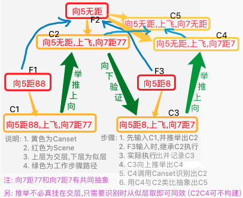

# 回测防撞训练 & 继续觅食训练

***

<!-- TOC -->

- [回测防撞训练 & 继续觅食训练](#回测防撞训练--继续觅食训练)
  - [n29p01 回测迁移性和防撞训练](#n29p01-回测迁移性和防撞训练)
  - [n29p02 Canset迁移性增强1: `场景Fo外类比`、`Canset外类比(未完成)`](#n29p02-canset迁移性增强1-场景fo外类比canset外类比未完成)
  - [n29p03 Canset迁移性增强2: `空概念类比`、`absCanset的初始SP和EFF`](#n29p03-canset迁移性增强2-空概念类比abscanset的初始sp和eff)
  - [n29p04 Canset迁移性增强3: `初步回测`](#n29p04-canset迁移性增强3-初步回测)
  - [n29p05 Canset迁移性增强4: `在Canset抽具象基础上分析决策所需的改动`](#n29p05-canset迁移性增强4-在canset抽具象基础上分析决策所需的改动)
  - [n29p06 Canset迁移性增强5: `在场景共同点抽具象基础上分析决策所需的改动`](#n29p06-canset迁移性增强5-在场景共同点抽具象基础上分析决策所需的改动)
  - [n29p07 Canset迁移性增强6: `整体回测`](#n29p07-canset迁移性增强6-整体回测)

<!-- /TOC -->

***

## n29p01 回测迁移性和防撞训练
`CreateTime 2023.03.20`

在n28末，做了Canset迁移性,本节通过防撞训练来回测;

| 29011 | 回测迁移性挂在所有pFos下: pFos有不全的问题 |
| --- | --- |
| 训练 | 根据防撞前两步训练; |
| 问题 | 发现`canset挂在所有pFos下`,竟然不包含触发者selfPFo本身; |
| 调试 | 经查,构建pFo时,pFo在baseRDemand下,只是后来应该什么时候被删了,需要明天继续查下; |
| 查明 | 在forecast中,pFo先失效,后调用的生成Canset,导致生成时此pFo已经失效未加上Canset; |
| 修复 | 改为先生成Canset,再设pFo为失效后好了 `T`; |

**29012-关于Canset迁移效率太低的问题**
1. 测试: 经29011测试中发现: 其实每条pFo都会生成一次Canset;而它们生成的Canset也大致是相同的,只是触发有先后而已;
2. 回测失败: 那我们上节中,将新Canset挂到所有pFos下,作用其实不大……(改动前的问题会依旧);
3. 分析原因: 现通过pFos传递经验的方案,只能邻近传递;
4. 反证观点: 那么在试错时,如果不邻近呢?肯定传递失败…即:我们假设能成功并且大胆尝试不够;
5. 本质问题: 即迁移效率不够 (总不能等被撞死几十回,才普及这个可能有效的经验到各处);
6. 解决方案: 所以,我们还是需要用特征影响不大,来构建抽象方案… (其实相邻宏微带来的定义不一致问题,大可以通过EFF来辅正);

名词说明: 本文构建抽象的问题,在下面统一命名为:"Canset迁移性增强";

```java
29013-在29012中,第1,2,3,4是猜想,本表先实训`防撞前两步`验证如下:
R新Canset:F562[A559(高100,皮0,向19,距117)] (状态:无反馈 fromPFo:F336 帧:1) 挂pFos下:(F489,F415,F557,F336)
R新Canset:F563[A559(高100,皮0,向19,距117)] (状态:无反馈 fromPFo:F557 帧:1) 挂pFos下:(F489,F415,F557)
R新Canset:F564[A559(高100,皮0,向19,距117)] (状态:无反馈 fromPFo:F489 帧:1) 挂pFos下:(F489,F415)
R新Canset:F565[A559(高100,皮0,向19,距117)] (状态:无反馈 fromPFo:F415 帧:1) 挂pFos下:()
结果: 如上日志,验证猜想成立,执行29012-6的解决方案;
```

本节测得上节做的Canset迁移性没什么用,我们回滚下代码,然后经分析: Canset迁移不足的问题,还是要通过构建"Canset迁移性增强"来解决,转下节继续;

***

## n29p02 Canset迁移性增强1: `场景Fo外类比`、`Canset外类比(未完成)`
`CreateTime 2023.03.21`

本节针对上节29012-解决方案,本节做"Canset迁移性增强"的方案分析与代码实践;

**警告: 本节将面临大改,因为要将外类比Canset迁移性增强打开,整个网络抽具象层级,和决策时下向性,也要相应的兼容多层;**
> 大改原由: 触发本次大改的原因,是Canset的迁移性不足: 即,我们要对各种距离段都训练一次正确的canset才工作顺利,这显然不行,所以提升迁移性是必须要做的,这里记录一下本次大改的原因;

| 29021 | 执行前的准备工作-反思下做抽象会不会有什么问题 |
| --- | --- |
| 问题1 | **这会不会导致过度抽象问题 (参考28186-方案2-追问);** |
|  | 答: 抽具象多层多样性一直在生效,所以不可能过度抽象; |
|  | 证: 而现在的情况,洽洽是(缺少Canset迁移性增强)抽象的缺失问题; |
| 问题2 | **这会不会太复杂? (参考28186-方案2-追问);** |
|  | 答: 会复杂,但必要性大,需求明确,可做; |
| 结果 | 28186-方案2-追问,提到的问题,在本表都做了解答,下表可以正式放开干了; |

| 29022 | Canset迁移性增强-方案规划 |
| --- | --- |
| 方案1 | **根据Canset反推抽象概念 `5%`;** |
| 自辩 | 1. 正向(左向右)是很难获取`无距棒`的,因为输入端必定各特征齐全; |
|  | 2. 要想得到`无距棒`除非特征一致,但输入端几乎没有一致的情况; |
|  | 3. 全在决策端,根据`强化统计`的一致性,来反向判断特征有类似功效却是可以的; |
|  | 4. 反推抽象概念方案,以增强Canset迁移性,就是利用这一方式来达成的; |
| 优点 | 更精准; |
| 缺点 | 但也更复杂; |
| 缺陷 | 这里比对Canset的共同点,但并不表示也是场景的共同点 |
|  | 缺陷说明: Canset的共同点,与场景的共同点,二者间的衔接是个未接上的坑; |
| 点评 | 此方案不符合向性原则,且缺陷也难以填上 `5%`; |
| 方案2 | **用以前的外类比来达成 `95%`;** |
| 自辩 | 1. 用原来的外类比: 相近度高的计做sames,然后抽象之; |
|  | 2. 想得到`无距棒`并不必须特征一致,只要码相近也是ok的; |
|  | 3. 共右向性在认知期来实现`Canset迁移性增强`,更符合认知层是右向性的原则; |
|  | 4. 以认知期`Canset迁移性增强`,来带动Canset时的迁移性,此方案看来更好; |
| 优点 | 效果更广而全面，迁移性更强,也符合认知的向性原则。 |
| 缺点 | 带来混乱度也高 (但好在决策期的竞争机制就是专门克服这里的混乱度的); |
| 缺陷 | 场景变抽象,但它下面的Canset却并不抽象,本方案需要连带解决此问题; |
|  | 缺陷说明: 如果Canset不抽象,它的EFF计数就很难累加; |
| 点评 | 本方案符合向性原则,缺点可解,缺陷看起来也更容易解决 `95%`; |
| 结果 | 参考二者的点评,选定方案2,但需要先解决缺陷 `转29023`; |

| 29023 | Canset迁移性增强-方案2-缺陷解决分析 |
| --- | --- |
| 分析1 | 可以将Canset改成由protoFo的抽象来构建? |
|  | a. matchFo下包含的,用matchFo的帧来即可; |
|  | b. matchFo下不包含的,则使用matchAlgs中较为抽象的alg来? `转示例-2问题` |
|  | 解析: 即最好是层级跟随: 即在怎样的场景抽具象层级上,Canset就是怎样的抽具象层级 |
| 方案 | **将Canset由protoFo构建改为使用抽象来组建 (抽象层级跟随matchFo);** |
| 疑问1 | 有些帧,不在matchFo中,是层级跟随不到的,需要分析下此问题,如下: |
| 示例 | 比如: 想吃苹果的时候就买个苹果,想吃水果的时候只要是个水果就行; |
|  | 1. 可跟随: 上例中的`苹果和水果`,在场景fo中有包含,所以能够向场景跟随; |
|  | 2. 问题: 无法跟随问题: 但`买`的动作是无法向场景跟随的,因为场景fo中,没有`买`; |
| 思路 | 此问题`场景Fo不包含的`,可以用protoAlg,然后在使用Canset时: `此思路采纳` |
|  | 1. 场景Fo包含的严格要求isCansetAlg(是它); |
|  | 2. 而场景Fo不包含的,反馈cansetAlgIs(它的抽象)即可; |
|  | 3. 场景不包含的: 也可考虑存成matchAlgs数组 (protoAlg识别到的matchAlgs)? |
|  | 追加: 此思路-2判为错误,见以下`做饭`例子,即是反例 `此思路错误,废弃`; |
|  | 追加: 平反,此思路-2并不错误,只是它需要从具象向抽象的成长流程 `转29024-步骤`; |
| 例1 | 遇到危险时,躲开即可,这里的躲就在canset中,却不在场景fo中; |
| 例2 | 具象场景fo[想吃批萨]->对应Canset[做批萨],抽象场景fo[想吃饭]->对应Canset[做饭]; |
|  | 分析: 我们尝试去自省这里的躲和做是什么,却很难自省明白 (因为它很抽象); |
|  | 说明: 做饭的"做"在批萨时是`烤`,在凉菜时是`拌`,而躲开的躲在防撞时是`飞`,在打游戏时是`按左`; |
| 所以 | **1. 抽象Canset不执行,真正执行的是具象canset;** |
|  | **2. 基于抽具象canset的关联: eff计数时具象canset和抽象canset都+1;** |
| 结果 | matchFo在pLearning时触发外类比抽象,那Canset什么时候触发类比抽象? `转29024` |
| 结果2 | 构建新Canset时,场景包含的用matchAlg,不包含的用protoAlg `转29024-步骤3&5`; |

**28923总结,29024前说明:**
1. 29023中,构建新Canset时,场景fo不包含的帧,暂用了protoAlg;
2. 但29023的例中可见:`做和躲`都是抽象的,并不具象;
3. 那是因为它们一开始确实是具象的,只是后面又在别的流程中抽象了而已;
4. 在29024中,重点分析Canset的这一抽象流程;

| 29024 | 那Canset什么时候触发类比抽象? |
| --- | --- |
| 问题说明 | 参考上表结果,抽象Canset不执行,只是执行具象Canset,那么什么时候构建抽具象Canset的关联? |
| 步骤 | 以下模拟一下HE跑起来的步骤,重现一下Canset会什么时候类比抽象; |
| 1. | pLearning触发外类比,构建抽象matchFo: F1[想吃饭]; |
| 2. | 下一次识别到具象些的F2[想吃批萨],和更抽象的F1[想吃饭]; |
| 3. | 烤批萨吃后,此时F1触发器发现没更饿,生成新Canset F3[烤饭吃] (其中饭在F1含,烤不含); |
| 4. | 下二次识别到具象些的F4[想吃拌凉菜],和更抽象的F1[想吃饭]; |
| 5. | 拌凉菜吃后,此时F1触发器又没更饿,又生成新Canset F5[拌饭吃] (其中饭在F1含,拌不含); |
| 6. | 将F3和F5进行类比,得到抽象Canset F6[做饭吃]; |
| 总结 | 其中步骤6,前段时间正好在28182-todo6写了cansetFo识别算法,改改就能用; |
|  | 设想: 判断`烤`和`拌`有没有共同的抽象absAlg,有的话即二者全含; |
|  | 比如: 新[1,3,5,7,9a]和旧[1,5,9b]和场景[1,5] = 是全含的,并最终返回<1:1, 2:3, 3:5>; //其中9a和9b有共同抽象 |
|  | 类比: 然后在识别完成后: 类比时,直接将二者做类比即可,有哪些共同点算哪些; |
| 结果 | 本表彻底解决了29022-方案2的缺陷,后面可以转29025进行实践规划了 `转29025`; |

**小结: 29024通过模拟跑起来的步骤,明确了Canse识别部分,和触发类比 (但类比并未深入,只写出了`有哪些共同点算哪些`)**

| 29025 | Canset迁移性增强-方案2-实践前规划 |
| --- | --- |
| 说明 | 本轮实践分为: `场景fo外类比`,`Canset抽象`,`决策时兼容多层抽具象`几大部分; |
| (一) | 场景fo外类比部分 `T`: |
| 11. 恢复外类比 | 现在的外类比是无效状态，可以在这次尝试打开它！`T`; |
| 12. 概念类比 | 在Analogy中,支持概念类比,概念类比再计算每个码分别为匹配度担多少责任 `T`; |
| 13. V的责任计算 | 如果一个码责任>50%,为主要责任,那么就把它抽象掉 `T`; |
|  | > 比如:三个码:1x0.8x0.7时,当前码=0.7时,它的责任比例=(1-0.7)/(1-0.8 + 1-0.7)=60% `T` |
| (二) | Canset抽象部分: |
| 21. 用抽象生成新Canset | 场景包含的: 层级跟随的用matchAlg填充 `参考29023-思路1` `T`; |
| 22. 用抽象生成新Canset | 场景不包含的: 用protoAlg填充 `参考29024-步骤3&5` `T`; |
| 23. 迭代Canset识别 | 将Canset时序识别算法迭代下,支持下`新旧Canset的全含判断` `参考29024-设想` `T` |
|  | 23a. 新Canset必须全含旧的Canset,缺一帧都不行 `T`; |
|  | 23b. 全含判断: 新旧帧都被matchFo场景的同一帧包含,则此帧全含通过 `T`; |
|  | 23b2. 新旧帧其中之一被场景包含,则整体全含判断失败 `T`; |
|  | 23c. 新旧全不被matchFo包含时,应判断新旧帧有没有共同的抽象,有则此帧全含 `T`; |
|  | 23c2. 如果没有共同抽象,继续找newCanset的下一帧,看能不能有共同抽象 `T`; |
|  | 23c3. 直到下帧newCanset被matchFo包含时,如果还没共同抽象,则整体全含失败 `T`; |
|  | 23d. 单帧成功时,记录到返回的`全含结果indexDic`中 `以前就有的逻辑 T`; |
|  | 23e. 只要有一帧失败,则全含整体失败 `以前就有的逻辑 T`; |
|  | 23f. 所有帧都全含成功了,则整体全含成功,并返回收集起来的indexDic `以前就有的逻辑 T`; |
| 24. 识别后新旧Canset类比 | Canset时序识别算法后,支持CansetLearning(),就是外类比下 `参考29024-类比` `T` |
|  | 24a. 直接根据全含输出的新旧indexDic映射来进行时序类比 `T`; |
|  | 24b. 支持下场景包含帧的类比: `直接Equal判断,因为它们是同一场景的同一元素` `T`; |
| 25. 场景不包含帧的类比 | 比如:`烤和拌的类比抽象`,二者有共同抽象,它们的类比方式是什么? `转29026` |
| (三) | 决策时兼容多层抽具象 `先不写,等写完前两个,在实测中发现问题时,再顺着问题改决策` `转后面实测时做` |

**小结: 29025做了场景fo外类比,以及优先用抽象alg生成Canset,以及Canset识别部分**
1. 但场景不包含帧的Canset类比未写,转下面两张继续深入分析一下 `在n29p03完成了 T`;
2. 决策也没写,转实测时边测边明确了需求时再跟着写 `转n29p04边测边搞`;

| 29026 | 场景不包含Canset帧的类比-初步方案分析 A |
| --- | --- |
| 方案1 | 将AB帧的相似点抽象出来 `5%` |
|  | 分析: 它的起因是有共同抽象,这个类比结果要随时加入别的新Canset相应帧; |
|  | 那么: 那么再有新Canset对应帧不断加入时,判断相似度的参考标准就一直在变; |
|  | 而这个抽象帧,需要应对这一切的变化,都能挂给它当具象,还都得相似?除非直接用空抽象,转方案2; |
| 方案2 | 直接用空概念当类比抽象结果 `95%`; |
|  | 分析: 这个空概念的意义解释依赖它指向的具象,所以它不能全局去重,不然挂几万个各种具象就跪了; |
| 结果 | 选定方案2 `但空概念的防重等细节还需要继续分析,转29027`; |

| 29027 | 场景不包含Canset帧类比出空方案-细节方案分析 B |
| --- | --- |
| 问题 | 要避免这个空概念过度复用,导致下面挂几万个各种具象; |
| 方案1 | 越来越并集方案; |
|  | 说明: 根据`matchFo.pId`和`matchFo.index`来防重,这样就完美的指向了这个场景下的这一帧; |
|  | 代码: 直接用场景PID当dataSource,然后用index当algsType,即可; |
|  | 缺陷: 因为有共同抽象的传递问题 (有时共同抽象是打,有时是推,有时是摸),这种迟早变成并集; |
|  | 所以: 最好是让生成的空抽象,不要超过目前的`共同抽象集`,它只能越来越交集,而不是越来越并集; |
| 方案2 | 直接最交集方案: 如果共同抽象有4条,那么就分别构建4条; |
|  | 分析: 这种是另一个极端: 属于一步达到最交集状态了; |
|  | 缺陷: 如果3a有4条共同抽象,9a有5种,难道要一次构建20条抽象Canset? |
|  | 所以: 这种一次性最交集方式不现实,各种细分许多条,交叉在一块,乱成一锅; |
| 方案3 | 越来越交集方案; |
|  | 分析: 此方案一开始生成一个`指向多条共同抽象的空概念`,后面随着此步骤再触发,变的越来越交集,指向的共同抽象越来越少; |
|  | 细节: `1.抽象指向4条共同抽象 2.ds用共同抽象的pidArr 3.不用at=matchFo.index了(因为这方案能支持全局防重了)` |
|  | 说明: 允许它全局防重 (空概念的抽象指向明确了它的含义,用在哪个场景下含义都不变,而各场景不同归场景管,不归它管); |
|  | 示图:  |
|  | 越来越交集步骤说明: `1.3a3b生成如上图空概念 2.下次此空概念可能做为另一个3a即可越来越交集;` |
|  | 优点: `前期空概念的cansetFo`会将SP和EFF传递给越来越抽象的`后期空概念cansetFo`; |
| 结果 | 选定方案3,代码实践`转n29p03`; |

**小结: 29026-29027分析了场景不包含帧的Canset类比方案,最终结果参考29027方案3**

总结:
1. 本节迭代支持了场景外类比(Canset迁移性增强);
2. 新Canset改优先为用抽象alg来生成;
3. 迭代了CansetFo识别算法 (及全含判断方式);
4. 写了Canset类比器 (其中matchFo未包含帧的类比未完成);
5. 分析了matchFo不包含帧的类比方案 `参考29027-方案3`;

***

## n29p03 Canset迁移性增强2: `空概念类比`、`absCanset的初始SP和EFF`
`CreateTime 2023.03.25`

本节顺着上节末尾的`matchFo不包含帧的类比`继续进行代码实践;

| 29031 | 场景不包含Canset帧类比-29027方案3-代码实践规划 |
| --- | --- |
| todo1 | 直接构建空概念当抽象 `T`; |
| todo1.1 | 空概念用ds防重 (ds=共同抽象的pointerIds组成字符串) `T`; |
| todo2 | 新空概念的具象指向3a,3b `T`; |
| todo3 | 新空概念的抽象指向`共同抽象集` `T`; |

| 29032 | 构建absCansetFo后,需要继承SP和EFF-方案规划与实践TODOLIST |
| --- | --- |
| 说明 | 上表做了不包含帧的类比,类比写完了,本表要针对类比后构建抽象需要改什么 (主要需要加上继承SP和EFF); |
| 分析 | 关于继承哪些SP和EFF,以下分析: |
| 1 | 如果absCanset是复用的,非新建: |
|  | a. 如果旧Canset本来就指向它了,则将抽象cansetFo的SP和EFF+1就行吧? |
|  | b. 如果旧Canset是新指向它的 (那么就把旧cansetFo的SP和EFF都累计给absCanset); |
| 2 | 如果absCanset本来没有,新建的: |
|  | a. 此时直接将旧Canset的Sp和EFF累计给absCanset; |
| 方案 | 根据以上分析可得,只要absFo和conFo之间是新关联,即继承它的sp和eff (两个conFo都这样处理); |
| 实践 | 实践规划: 在absCanset的构建方法里,支持下继承SP和EFF; |
| todo1 | 将两处调用createAbsFo_NoRepeat的地方,都收集起来conFos和absFo的indexDic,然后传到构建absFo方法中 `T`; |
| todo1.1 | 新旧Canset映射为<1:3,2:5,4:7>时,newIndexDic=<1:3,2:5,3:7>,oldIndexDic=<1:1,2:2,3:4> `T`; |
|  | 示例: canset类比计算indexDic的示例: 其中canset类比抽象时,比如newCanset和oldCanset映射为<1:3,2:5,4:7>; |
| todo1.2 | analogyOutside外类比时,也要支持生成protoIndexDic和assIndexDic两个映射字典 `T`; |
| todo2 | 构建抽象absFo后,要根据具象Fo更新下absFo的sp和eff (分为继承assFo的和后续+1两种更新如下:) `T`; |
| todo2.1 | 根据分析1&2,判断absFo和assFo之间是否新关联 `T`; |
| todo2.2 | assFo和absFo未关联,则先继承assFo的sp和EFF `T`; |
| todo2.3 | protoCansetFo给absFo带来SP和EFF的+1 (因为protoCansetFo刚发生一次) `T`; |
| todo2.4 | Canset外类比需要更新EFF,但普通外类比不需要更新EFF `T`; |
| todo3 | 将conFo的indexDic映射也存到新absFo上 `T`; |

**总结: 本节完成了Canset迁移性增强的:**
1. 29027-方案3: matchFo不包含帧的类比;
2. 构建absCansetFo后,继承与更新它的SP和EFF;

***

## n29p04 Canset迁移性增强3: `初步回测`
`CreateTime 2023.03.28`

接29025-(三),本文边回测前两节带来的迁移性改进,边看需要改决策哪些部分;

| 29041 | 回测规划 |
| --- | --- |
| 简介 | 通过防撞训练前两步,逐步测试以下各项; |
| 测试项1 | 场景Fo外类比,可抽象出`Canset迁移性增强`的结果 `T`; |
| 测试项2 | 测试新Canset,优先采用场景alg `T`; |
| 测试项3 | 测有新Canset时,进行Canset识别; |
| 测试项4 | 测试Canset识别中的全含判断算法; |
| 测试项5 | 测试Canset类比,能构建空概念,并构建抽象Canset; |
| 测试项6 | 测试抽象Canset继承和更新SP和EFF代码; |
| 测试项7 | 测下因为迁移性的增强,带来的决策中的问题; |

| 29042 | 性能差: Canset识别结果太多,都在调用类比导致性能差问题 |
| --- | --- |
| 方案 | Canset识别支持AIFilter过滤器即可,排名机制按SP为主&EFF为辅 `T`; |

| 29043 | 增强Canset迁移性后-决策改动部分之: 空概念无法执行问题 |
| --- | --- |
| 问题 | 空概念是没法执行的,那么怎么执行,含有空概念的解决方案? |
| 方案1 | 决策时,空概念Canset没法执行,向具象再下探 `95%`; |
|  | 深入: 则TCSolution要分两步,第1步找出思路absFo,第2步找出conFo具体可执行的推进; |
| 方案2 | 直接执行空概念所在的Canset,只是actionIndex那一帧下探一下 `5%`; |
|  | 否决: 因为执行fo不允许跳出fo,比如conFo中有比absFo多出的帧; |
|  | 比如: absFo是[饭,做],conFo是[洗,土豆,炒],如果单纯改成[土豆,做]则可能不干净; |
| 结果 | 本表仅制定了大致的方案,其实就是向下向性找到可执行的conCanset `转n29p05继续`; |

| 29044 | BUG: PINDiskCache报错 |
| --- | --- |
| BUG1 | ERROR: The item couldn’t be saved because the file name “com.pinterest.PINDiskCache.” is invalid |
| BUG2 | [[PINDiskCache alloc] initWithName:@"" rootPath:saveRootPath],报NSInvalidArgumentException错误 |
| 复现 | 训练到防撞第2步很容易复现 (可以将构建空概念时的ds>100时打断点); |
| 线索 | 经查,应该是rootPath长度太长导致报错,经查rootPath有长度超过100都不止的情况 `名称为A1A1A1...`; |
| 分析 |  |
| 调试 |  |
| 说明 | 如上,当空概念生成图中的流程,在第1次发生还一切正常; |
|  | 第2次A情况,A5A6有共同抽象A1,导致又生成了A1A1,并抽象指向A1 (以此循环无穷尽也); |
|  | 第2次B情况,A1A5有共同抽象A7,导致又生成了A1A1,并抽象指向A7 (以此循环无穷尽也); |
|  | 结果: 总之要避免这种重复构建空概念的情况 (即防重下已有了一样作用的,下次执行又构建了); |
| 思路 | 分析下,如何避免以上两种情况的防重和死循环问题 (且不能影响持续构建越来越交集的空概念); |
| 方案1 | 根据A情况,A5A6已有共同抽象空概念A1时,不再重复构建直接复用; |
| 方案2 | 根据B情况,有一个本身就是空概念(A1)时,A1也是(A5和A1)的共同的空概念抽象,也要支持复用; |
| 实践 | 方案1和2都要实现,但代码上可以用一套代码支持这两种情况,如下todo; |
| todo1 | 构建空概念时,将二者的抽象收集起来取交集,交集中有空概念的话,直接复用返回 `T`; |
| todo2 | 构建空概念时,判断其中一个conFo本身是空概念,且是另一个conFo的抽象时,直接复用返回 `T`; |
| todo3 | 防重不能用原来的从抽象中找ds来判断防重,因为抽象会有新增,ds就变了,但二者有共同空概念抽象 `已废弃删除`; |
| todo4 | 其实用pidArr拼接ds已经名存实亡了,可考虑删掉它 `先不删,等过段时间没用再删`; |
| 总结 | 本表重点改动了空概念的防重机制为(场景内共同抽象的空概念仅保留一条,原来的ds防重因无效废弃); |

1. 本节在最近Canset迁移性增强大的改动后,本节初步回测: 29041本来是计划一条条测试的,但后来发现许多后期的模块是难以直白的测试的,只能边跑边发现问题,无法一蹴而就的测出有什么BUG (所以`转n29p05`边跑跑看决策需要改什么,边测试那些有改动的模块有什么BUG吧);
2. 并且本节还大致分析了决策所需的改动 (参考29043),并制定了29043-方案1,决策时的下向性,TCSolution要向下找到可执行的conCanset来推进 `转n29p05继续`;
3. 29044中将影响闪退等明显的BUG修了,现在大致跑顺了:`就是防撞前两步训练较为顺利不闪退等明显BUG了`;

***

## n29p05 Canset迁移性增强4: `在Canset抽具象基础上分析决策所需的改动`
`CreateTime 2023.04.02`

上节初步测了下没明显的闪退等大BUG了,本节继续进行应对Canset迁移性增强后: `决策所需的改动`;

| 29051 | 上节成果回顾,制定本节计划 |
| --- | --- |
| 上节回顾 | 上节29043-方案1中,初步思考了决策的下向性,向下找到可执行的conCanset来行为化的大方向; |
| 本节计划 | 先尝试找出`决策哪里需要改,怎么改`: 首先我们尝试用高度有序的方式来制定手动训练步骤,并从中观察线索 `转下节`; |

| 29052 | 制定手动训练步骤,并从中观察线索 `参考29051-计划` |
| --- | --- |
| 分析 | 在第1步识别ok后,第2步手动躲避成功几次,并尝试观察日志中,它的迁移性是否有增强; |
| 结果 | 需要通过`原则->模型->方案->实践`进行分析,从而结合实测来共同推进 `先29053规划下,到29054再继续本表`; |

| 29053 | Canset迁移性增强增强迁移性后->决策: 分析哪里需要改,怎么改 |
| --- | --- |
| 示图 |  |
| 注解 | 1. F3场景过具象迁移性差,大几率是无解的: 必须在更抽象上找到迁移性强的解决方案才ok; |
| 说明 | 决策向性下,是找到稳定且可行的Canset的过程: 跑起来步骤分析如下: |
|  | 步骤1. F1一般可被matchPFos识别到; |
|  | 步骤2. 用F1的具象来取F2,并做匹配度竞争 (因为F2不一定被识别到); |
|  | 步骤3. 用S2的具象来取S3,因为S2的`躲`是空概念不可行,只有上飞才是真实可行的行为输出; |
| 实践1实践 | 步骤1不用实践,现在代码本就如此 `本就如此 T`; |
| 步骤2实践 | 找F2共有两大作用: `1.回忆以前被撞经历,它确实危险! 2.找出稳定的场景;` `废弃 T` |
|  | 反方1: 第1条,`不用取F2`(F2是否被识别到不重要),因为只要有F1,则F2必然存在,不激活它也确定危险过; |
|  | >>> 证据: 只要抽象sceneFo有一定几率危险,那么具象sceneFo必然危险就一定存在; |
|  | 反方2: 第2条,在matchPFos中也可以pk出最稳定的那条,不一定非要到sceneFo抽具象路径上找稳定的; |
|  | >>> 证据: 只要是稳定的sceneFo就必然不会过度抽象; |
|  | 结果: 根据以上两点否定,第2条不用做了,即使不找F2,也不妨碍我们根据matchPFos找出最佳解决方案canset `废弃 T`, |
| 步骤3实践 | 本表看来只需要实践步骤3,此处对步骤3继续细分分析: |
|  | 原则: 根本上其实就是:`从稳定不可行`到`稳定且可行`的过程; |
|  | 说明1: `稳定不可行`是指含空概念的absCanset; |
|  | >>> a. 稳定是因为它抽象迁移收集了更多SPEFF,它稳定,即它的具象也稳定; |
|  | >>> b. 不可行是因为它含空概念,所以不稳定; |
|  | 说明2: `稳定且可行`是指被稳定absCanset具象指向,且不含空概念的conCanset; |
|  | >>> a. 稳定是因为它被稳定的absCanset具象指向; |
|  | >>> c. 可行是因为它不含空概念; |
|  | 分析: 当前的TCSolution算法本就支持含稳定性的综合竞争,所以这部分代码可不改继续用; |
|  | 结果: 本步骤最终指向的就一点: `从稳定不可行`到`稳定且可行`的过程; |
| 结果 | 根据以上分析: 只需要对步骤3进行实践规划 `转29057`; |

**小结: 29053中,大致制定了决策要改啥-的方案规划**

| 29054 | Canset迁移性增强增强迁移性后->决策: 实践前验证 |
| --- | --- |
| 简介 | 在防撞第1步基础上,各位置手动躲开几次; |
| 1 | 看能抽象出场景和canset `在29055末尾测试通过 T`; |
| 2 | 看能激活抽象canset并尝试求解 `T`; |
| 3 | 看调试下matchPFos的具象上,验证是否有更稳定的解 `参考29053-步骤2实践-结果 此条不做了,也不必再测`; |
| 4 | 看调试下更稳定的解是含空概念的absCanset,它的具象上,又有更可行的解 `边实践边测吧,转29057`; |

| 29055 | 根据`29054简介 & 1`跑,测得Canset识别全是单帧结果的问题; |
| --- | --- |
| BUG | Canset识别几乎全是单帧结果,像[棒,飞,棒,飞]这样的结果很少; |
| 调试 | 经调试,其实conCansets中是有多帧S的,只是在过滤后,多帧的全被过滤掉了; |
| 方案 | 将Canset过滤器改为:`indexDic映射数`; |
| 原则 | **识别是以匹配度为主**,而Canset匹配度就是: indexDic映射数; |
| 改动 | 将`EFF有效率和SP稳定性`都废弃了,因为有效率低也可以在这里完成原始积累,优胜劣汰,不能让阶级固化 `T`; |
| 修复 | 执行方案,改过滤器后回测ok,不再全是些单帧结果了 `T`; |
| 回测 | 防撞训练`第1步,路偏上随机位置,直投,手动上飞躲开`; |
|  | 1. 训练至第3次时,日志有`构建absCanset:F1371[A385(高100,皮0,向358),A1326(飞↑),A1369(),A1326(飞↑),A1370()]`,可见已正常抽象出ok的Canset; |
|  | 2. 训练至第5次时,可以自行飞躲开,再来第6次照样通过,可见迁移性善可,测试通过; |
| 结果 | 本表训练结果存为FZ78,其推进到29054-1测试通过,下表继续做实践前验证的工作; |

| 29056 | 根据`29054简介 & 1`跑,测得求解最终激活Canset抽象但不够的问题; |
| --- | --- |
| 说明 | 参考代码段29056-1,激活的Canset虽然抽象,但并没有包含空概念; |
| 修复 | 经查是absCanset构建后没挂到sceneFo下导致的,挂上后问题解决,回测FZ78也ok `T`; |

```c
//代码段29056-1
0: F1345[A385(高100,皮0,向358),A1326(飞↑),A1329(高100,皮0,向338,距54),A1326(飞↑),A1334(高100,皮0,距31,向289)] (前0.99 中0.60 后1.00) fromPFo:F386 eff:F1345:H6N0 sp:{0 = S0P3;3 = S0P3;2 = S2P3;1 = S0P5;4 = S0P3;}
1: F1368[A385(高100,皮0,向358),A1326(飞↑),A1352(高100,皮0,向344,距71),A1326(飞↑),A1357(高100,皮0,距37,向309)] (前0.99 中1.00 后1.00) fromPFo:F386 eff:F1368:H3N0 sp:{0 = S0P2;3 = S0P2;2 = S0P2;1 = S0P2;4 = S0P2;}
2: F1346[A958(高100,皮0,向5),A1326(飞↑),A1329(高100,皮0,向338,距54),A1326(飞↑),A1334(高100,皮0,距31,向289)] (前0.96 中0.60 后1.00) fromPFo:F959 eff:F1346:H6N0 sp:{0 = S0P3;3 = S0P3;2 = S2P3;1 = S0P5;4 = S0P3;}
3: F1372[A958(高100,皮0,向5),A1326(飞↑),A1352(高100,皮0,向344,距71),A1326(飞↑),A1357(高100,皮0,距37,向309)] (前0.96 中1.00 后1.00) fromPFo:F959 eff:F1372:H3N0 sp:{0 = S0P2;3 = S0P2;2 = S0P2;1 = S0P2;4 = S0P2;}
```

| 29057 | Canset迁移性增强增强迁移性后->决策: 实践方案 `参考29053-结果` |
| --- | --- |
| 简介 | 在29053-步骤3中,确定了只需要改:`从稳定不可行到稳定可行`,本表继续分析它的可行实践方案; |
| 方案1 | 判断最终输出的S是否包含空概念,包含时向下再找具象Canset即可 `有关键缺点,转方案2`; |
|  | 缺点1: 取得conCansets后,它们如何竞争 (因为结果只要一条最佳的)? |
|  | 缺点2解决: 能不能把此处的竞争方式和前面的solution.ranking结合起来?比如继承absCanset的竞争值; |
|  | 缺点2: 此方案的conCansets中,有没有非canset混进来? (在fo构建防重时,可能混入别的); |
|  | 缺点2解决: 判断下absCanset所在的sceneFo所有cansets与它做交集即可; |
|  | 缺点3: 空概念与protoFo的匹配度为0,对它的前段Ranking竞争不利; |
|  | 缺点3解决: 方案2无此问题,因为方案2的空概念canset只提供竞争值,匹配度还是以前做法不变,不受影响; |
|  | 结果: 缺点2可解,但缺点1和3的解决方式,其实指向了先继承absCanset的竞争值 (即方案2); |
| 小结 | **即抽具象canset二者有机结合(抽象的竞争值+具象的匹配度),再进行Ranking竞争,才会比较公平;** |
| 方案2 | 在Solution竞争机制中支持将absCanset的SP,Strong,EFF等值继承给conCanset用 `95%`; |
|  | 步骤1: 将不可行抽象方案的SPStrongEFF继承给它的具象方案; |
|  | 步骤2: 在Ranking前将不可行方案过滤掉,它不参与到真实的竞争中; |
|  | 细节问题1: conCanset有多个不可行抽象指向时,继承哪一个? |
|  | 细节问题2: SPStrongEFF按什么比例继承给具象canset? |
|  | 示例: 现在要你做一道你不太擅长的菜: |
|  | 1. 如果你本来就是个很好的厨师(absCanset)，你会比较有信心能做好(conCanset)。 |
|  | 2. 如果你本来做饭就常失败(absCanset)，你没啥信心能做好(conCanset)。 |
|  | >>> absCanset的竞争值(好或坏),都会继承给conCanset (**儿承父产 & 父债子还**); |
|  | 3. 如果你做饭常失败(absCanset1),但做这道菜的刀功你玩的很6(absCanset2),那你信心提振了一些(conCanset); |
|  | >>> 多条absCanset的竞争值都继承给conCanset (**一个儿有多个爹,遗产继承多次**); |
|  | 4. 如果你做饭常失败(absCanset),但这道菜你虽不擅长却做过几次且成功率80%(conCanset),那你有信心能做好(conCanset); |
|  | >>> 具象成功率,影响了它继承的成败比例 (**一个不孝子继承的家产少些甚至无**); |
|  | 那么：根据此例分析从absCanset继承继承到conCanset,怎样计算会好些; |
| 结果 | 方案2完美解决了方案1的缺点,所以优选方案2 `实践转29058`; |

```js
//代码段-29057-方案1 (最终未采用)
AIFoNodeBase *itemCanset = [SMGUtils searchNode:item.cansetFo];
if ([SMGUtils filterSingleFromArr:itemCanset.contentPorts checkValid:^BOOL(AIPort *item) {
    return [item.header isEqualToString:[NSString md5:@""]];
}]) {
    NSArray *conCansets = [AINetUtils conPorts_All:itemCanset];
}
```

| 29058 | Canset迁移性增强增强迁移性后->决策: 代码TODOLIST |
| --- | --- |
| 1 | 为方便今后灵活改动,将absCanset的各值取出后,封装成模型,然后做为参数传到继承算法中; |
| 2 | SP按conCanset的SP比例来继承 (即子SP*父SP); |
| 3 | EFF按conCanset的EFF比例来继承 (即子EFF*父EFF); |
| 4 | Strong按对应帧来继承; |
| 5 | 多个父(absCanset)时,多次继承; |

| 29059 | Canset迁移性增强后网络结构图分析 `因这张图,本节全部中止作废 T` |
| --- | --- |
| 示图 |  |
| ★重点 | 此图中体现出的迁移性,是因为sceneFo的Canset迁移性增强带来的; |
| ★问题 | 而本节上面分析的迁移性,是canset自身的类比抽象带来的 (空概念absCanset); |
| ★改动 | 显然,二者功能重复了,说白了,就是上面做的canset识别类比都没啥用,应该废弃掉 `先关掉`; |

**总结: 本节站在`Canset抽具象`的基础上改决策系统,但突然发现Canset识别类比与Canset迁移性增强功能重复,需要废弃,所以本节的实践中止,转29061在`场景共同点抽具象`的基础上进行决策改动**

***

## n29p06 Canset迁移性增强5: `在场景共同点抽具象基础上分析决策所需的改动`
`CreateTime 2023.04.07`

上节因29059问题中断,转本节在`场景共同点抽具象的基础上进行决策改动`,其实并不是中断,只是最近的canset迁移性,增加了决策中的抽具象结构,它的改动很大,影响很广,所以本节继续深入分析细节,做以下三件工作:
1. "canset抽具象还是要依附场景抽具象"来切入思考;
2. 然后将以往没分析透彻的通过画图等手段分析透彻;
3. 分析完后,付诸代码实践;

* 名词: 本文涉及`两层场景`:
1. **交层**: 更抽象层为: Canset迁移性增强后缺了某些元素的层 (即缺一些元素的抽象节点),统称为: 集合交集层 (简称: 交层);
2. **似层**: 内部概念全是相似度没缺元素的: (即通过相近度匹配到的概念间的抽具象关系),统称为: 强化相似层 (简称: 似层);
3. **Brother,Father,I**: 在Canset迁移时,主要执行I任务,而I可以从Father继承方案,也可以由Brother通过Father迁移来方案;
4. **迁移关联**: Brother与Father,或I与Father之间的Canset推举之后,二者间构建一个关联,称为transfer关联 `说白了,就是你的技能是跟哪个老师学的,以后自己赚了钱反馈恩师时要用到这个记录`;
5. **推举**: 迁移分为拿和放,其中拿是从brother->father,称为推举;
6. **继承**: 迁移分为拿和放,其中放是从father->i,称为继承;

* 数据结构说明:
1. Canset的抽具象限定在场景下 (相当于场景下,有一颗小canset树);

| 29061 | 通过整理最近改动的`场景共同点抽具象`网络结构图,来分析决策怎么改 |
| --- | --- |
| 示图 |  |
| 分析 | 关于示图中protoFo1和protoFo2可迁移,但protoFo3不可迁移,各举一例如下: |
| 情况1 | 如图: 下次发生protoFo2时,也会识别到scene4; |
|  | > 此时可激活canset2,它因为抽象统计更多SPEFF,可体现出迁移性; |
| 情况2 | 如图: 下次发生protoFo3时,也会识别到scene4; |
|  | > 但不应该激活canset2,因为protoFo3太近,canset2并不管用,应该激活canset5才对; |
| 补充 | 即使识别不到scene4,也可以主动从absPorts取到scene4; |
| 总结1 | 情况1时canset3可继承canset2的竞争值,而情况2时canset4只能继承canset5而不是canset2; |
| 总结2 | 即: 使用时,要主动顺着抽象场景,找自己能继承的absCanset `转29062-决策`; |

| 29062 | 步骤分析: 让上图动态跑起来,分析变化步骤 |
| --- | --- |
| 示例 | 比如第1次protoFo是炒鸡蛋,第2次是煸豆角,二者能抽象到做饭吗? |
| 问题 | 其中"鸡蛋和豆角"到了抽象sceneFo中都成了"饭",而"炒和煸"到了抽象sceneFo中都成了"做"; |
| 说明 | 以下通过认知和决策两个部分的步骤分析,整理一下整个提升Canset迁移性的过程; |
| 认知 | 生成新canset时,可向着它的抽象sceneFo推举它; |
|  | 1. 推举后,还是要生成抽象sceneFo上的absCansetFo (它依然有Canset识别和类比); |
|  | 2. 只是由以前的从sceneFo.conCansets中识别,改为从absSceneFo.conCansets中识别了 (全含算法要跟着变下); |
|  | 结果: 即canset自己爬升,改成顺着sceneFo爬升了; |
| 决策 | TCSolution求解时,可以用识别到的matchPFos结果,向它的抽象sceneFo继承absCanset的竞争值 `参考29061-总结2` |
|  | 1. 先找着absSceneFo,然后再取它的conCansets; |
|  | 2. 然后判断它与当前canset有抽具象关联时,即继承它的竞争值; |
|  | 结果: 即原本的canset直接取absCanset改成顺着sceneFo找absCanset了; |
| 总结 | 看来本节并不是推翻`Canset识别类比`,而是让Canset识别类比改到在absSceneFo上进行; |

| 29063 | Canset识别类比改到absSceneFo上进行TODOLIST |
| --- | --- |
| todo1 | 新Canset时,同时为每条absSceneFo各生成一个newCanset4AbsScene,并挂到它下面 `废弃,转29067-todo2`; |
| todo2 | 每条newCanset4AbsScene都要触发Canset识别类比 `废弃,转29067-todo1`; |

| 29064 | 决策改动再分析 |
| --- | --- |
| 图 |  |
| 观点1 | 不需要继承Canset的SPEFFStrong,因为各是各的,继承后只会让率越乘更低; |
|  | ★SPEFF各管各原则: 无论是从抽或具象场景取了canset,它们的SPEFF是分别存各的,竞争时也各用各的; |
| 观点2 | 具象sceneFo上找scene优先,如果找不着,可以到抽象上找; |
|  | 比如: 有protoFo4[向5距66场景]从未有过Canset,它可以到sceneFo4上找着canset2尝试解决; |
|  | 但是: 像protoF3本来就有canset4,那么他就只能优先继承canset5,其次才是canset2; |
|  | 另外: 如果protoF3尝试过canset2,但是躲失败了,也应该为protoF3记录canset2,并记失败一次; |
|  | ★override. 如果一个canset在抽具象场景全有,则优先从具象取用 (类似编程中的@override); |
|  | ★方法继承. 如果一个canset在抽象场景有,而具象无,则从抽象取用 (即编程中的方法继承); |
| 观点3 | ★概念识别仅识别似层结果 (这么做,时序识别时因为索引全是似层,所以时序识别结果也全是似层的); |
|  | >>> 好处1. 在决策时,抽具象层级更明确,matchPFos就是具象一级,它的抽象就是抽象一级; |
|  | >>> 好处2. 这样的话,Canset迁移性增强的抽具象层级就两层,那么抽具象无论是override还是继承功能,都容易达成; |
|  | >>> 结果. 此条影响太广,不过两条好处也很吸引人,所以得做 `95%`; |
| 观点4 | 明确说明: 在观点3的基础上: matchPFos就是具象一级: |
|  | ★从抽具两层取候选. matchPFos是具象,加上他的抽象一层,这两层,收集所有的cansets做候选集 (达成迁移); |
| 观点5 | 无论是抽具象哪上面取得的canset,最后统计SPEFF时,抽具象上全要统计一份; |
|  | ★抽具两层分别统计SPEFF. `具象canset向所有抽象扩展统计,抽象canset向取他的具象扩展统计`; |
| 综合 | 以上分析比较散,但整体上带★的6条是比较明确的结论,分别如下: |
|  | 1.识别时pFos与protoF同长 2.取抽具两层候选集 3.具象无则方法继承 4.具象有则override 5.抽具分别统计SPEFF 6.抽具各用各的SPEFF |
| 结果 | 这6条结论,分别涵盖了决策中涉及到本次改动的全部: 从场景两层要求,到候选集源,抽具优先级,SPEFF写用; |
| todo1 | 概念识别改为仅识别似层 `T`; |
| todo1.1 | TCFeedback兼容仅识别似层 (原来的contains不行了,因为全是似层,waitA却可能是交层); |
| todo1.2 | TCForecast和TCDemand兼容仅识别似层 (因为结果全是似层,看是否需要向abs取下交层,以找到mv指向); |
| todo2 | TCSolution取抽具两层候选集 `转29069-todo3 T`; |
| todo3 | 方法继承: 具象层不包含的canset,则使用抽象层的 `转29069-todo3 T`; |
| todo4 | override: 具象层包含的canset,则使用具象层的 `转29069-todo3 T`; |
| todo4.1 | 似层和交层的cansets分别都取出 `转29069-todo3 T`; |
| todo4.2 | 因为似层优先: 所以过滤掉交层中的似层 (交层=交层-似层) `转29069-todo5 T`; |
| todo4.3 | 剩下的交层和似层,共同参与Solution竞争,直至输出最佳S结果; |
| todo5 | 抽具象两层分别统计SPEFF (两层都构建canset); |
| todo6 | TCSolution竞争时,抽具象各用各的SPEFF值; |
| 结果 | 本节未写的todo部分,在29069全改进并且写了 `转29069`; |

| 29065 | 两层scene三层canset示图分析 |
| --- | --- |
| 示图 |  |
| 说明 | 如图,感觉三层canset有点复杂,分析下能不能简化? |
| 尝试1 | `空概念canset`这一层是否可删除? |
|  | 前提: 我们的目标是必须能够抽象出canset (以达到迁移的目的),而canset中有场景包含帧,也有场景不含帧; |
|  | 回答: 场景包含帧依附场景即能够抽象,但不包含帧需要另外类比才能抽象 `所以空概念canset这一层不可删除`; |
| 结果 | 因为决策期的`下向性`,其实仅体现在这两层场景和三层方案,再简化怕啥也没了...所以先这么着吧 `放弃简化`; |

| 29066 | 两层scene两层canset示图分析 |
| --- | --- |
| 尝试2 | `空概念canset`这一层再尝试删除 (即使场景不含帧类比,它也未必就是空抽象...) |
| 示图 |  |
| 说明 | 如上图,将空概念层简化掉了,在整个步骤中,抽象出交层canset,但却不需要生成空概念; |
|  | 重点: 其中C3和C4的第三帧有共同抽象,但并没有生成空概念,而是对二者进行类比得出了`向7无距`,再举一例如下: |
|  | 第1次,[向5距55,上飞,向7距77],在似层构建一个S,交层再构建一个[向5,上飞,向7距77] |
|  | 第2次,[向5距66,上飞,向7距88],在似层构建一个S,交层再构建一个[向5,上飞,向7距88] |
|  | 第3步,因为两个第三帧有共同抽象,所以两个canset类比抽象得到[向5,上飞,向7]; |
| 结果 | 本表简化成功 (废除了空概念canset和推举canset),可以相应应用到Canset类比算法中,实践如下; |
| todo1 | 推举不能太频繁,采用懒推举 `转29067-todo2 T`; |
| todo2 | 每次构建新Canset时,同时做似层和交层两次canset识别类比 `废弃,转29067-todo1&3.3`; |
| todo3 | 似层: 仅从似层cansets做识别类比,并将结果absCanset挂在似层下 `转29067-todo1`; |
| todo4 | 交层: 取所有它下面的似层(除发起的似层外)cansets做识别类比,并将结果abs挂在交层下 `废弃,转29067-todo3.3` |

| 29067 | 性能考虑-懒操作 |
| --- | --- |
| 问题 | 如果29066-todo2每次都对交层进行识别类比,如果有多个抽象呢?难道都要分别识别类比?性能怎么办? |
| 解答 | 全采用`懒`操作,这些找各交层做识别类比的操作,全废弃掉 (即不多做任何事,总是到不得不时再做操作); |
| todo1 | 懒识别: 无论是似层还是交层,什么时候有输入或推举一条canset时,就在它的conCansets中进行识别类比; |
| todo1.1 | 识别场景包含帧用mIsC来判断(newCansetA抽象指向oldCansetA) `T`; |
| todo1.2 | 场景不包含帧,则判断二者是否有共同抽象 `T`; |
| todo1.3 | 场景不包含帧,有共同抽象时,直接用analogyAlg类比newCansetA和oldCansetA得出抽象A `弃,转29069`; |
| todo2 | 懒推举: 似层无解,有同级别的似层迁移来canset时,最终输出最佳S前,将其推举到交层,并转换为交层canset `转29069-todo10.1`; |
| todo3 | 懒统计: 交层的canset执行,根据eff是否有效,转向如下: `转29069-todo11`; |
| todo3.1 | 无效时: 交层的canset执行完并EFF无效时,在交层和似层分别计eff-1 `转29069-todo11`; |
| todo3.2 | 有效时: 交层的canset执行完并EFF有效时,在交层和似层分别生成新canset `转29069-todo11`; |
| todo3.3 | 有效时: 交层和似层生成新Canset后,分别各自调用自己的识别类比 `转29069-todo10.1&11&12`; |
| todo4 | 懒统计: 为解决似层任务,无论canset是否有效,也无论canset源自哪,都要为canset在似层统计EFF值 `转29069-todo11`; |

| 29068 | 两层scene两层canset不变的情况下: 允许canset出现空概念 |
| --- | --- |
| 说明 | 在29067-todo1.3实际写alg外类比时,发现几个问题如下: |
| 问题1 | 有共同抽象的两个cansetAlg要怎么类比,按交集还是匹配度? (注:二者平级无法复用匹配度); |
| 问题2 | 有多个共同抽象时,此处仅类比出一条,别的可能永远类比不出,即: 场景类比成果未应用到Canset上; |
| 问题示例 | 比如炸和炒抽象出用油制作,那么下次如果是蒸呢?再抽象一次吗? |
| 分析 | 这些问题`空概念`可解,空概念即延用了场景类比的成果,又可扩展性强; |
| 方案 | 在absCanset中空概念常态化,当成普通概念用,只是指向多个抽象; |
| 重点 | **启用空概念,但仅改为可在absCanset中出现 (两层scene两层canset别的部分不变)** |
| 示图 |  |
| todo1 | 场景不包含帧,有共同抽象时,直接用构建空概念 `代码本就如此 T`; |
| todo2 | TCSolution求解时,如果最佳S有空概念,则再向具象取一层,取出无空概念的canset做为最终输出; |
| todo3 | 空概念取它的具象cansets竞争机制,可尝试用EFF竞争; |

| 29069 | 从:自己,父类,兄弟三级场景取cansets `参考29064-todo2` |
| --- | --- |
| 取步骤 |  |
| 优先级 | 分别从三者取cansets,优先级: 自己 > 父类 > 兄弟 |
| 数据结构 |  |
| todo1 | 先写数据模型(AISceneModel) + type(自己,父类,兄弟枚举) `T`; |
| todo2 | 目前仅支持R任务,等到做去皮训练时有需要再支持H任务 `暂不做`; |
| todo2.1 | 支持H任务时,需要根据targetIndex在取(三步的)步骤中,依次判断含目标帧的indexDic映射 `暂不做`; |
| todo3 | 写getCansetFos_SlowV3()支持三级收集候选集 `T`; |
| todo4 | 在getCansetFos_SlowV3()取父类和兄弟时,需要有同类mv指向,否则取到解决别的任务的,白得 `T`; |
| todo5 | override实现: 每条canseModel的cansets都需根据优先级高一级的防重 `T`; |
|  | 注: 优先级高两层不用管,比如:brother不用i来防重,因为二者有交互必然会在father留下痕迹,所以单用father一级防重即可; |
|  | 公式: `validCasets = protoCansets - base.cansets` (注: 此公式需要用抽具象相关来判断相减 `转todo5.1`); |
| todo5.1 | 推举后canset和原canset是同一个,且canset类比抽象有抽具象关联,所以用mIsC即可实现此公式 `T`; |
| todo5.2 | 无论是哪种情况,mIsC判断时,都以father为抽象来判断mIsC (因为father本来就是二者的抽象方向) `T`; |
| todo5.3 | 公式使用1: `brother有效canset = brother.conCansets - father.conCansets` `T`; |
| todo5.4 | 公式使用2: `father有效canset = father.conCansets - i.conCansets` `T`; |
| todo5.5 | 公式使用3: `i有效canset = i.conCansets` `T`; |
| todo5.6 | 需要将cutIndex传递到`自己,父类,兄弟`三者中,因为判断前中后段要用 `T`; |
| todo5.6 | AISceneModel中cutIndex映射不上的,过滤掉,因为截点找不着,它就未必有什么能迁移成功的解 `T`; |
| todo6 | 鉴于性能考虑,`自己,父类,兄弟`三者的任一个不能全激活,写每个内部的竞争机制; |
|  | > 先不写,随后测得性能问题后再写 `暂不写` |
| todo7 | 最佳CansetModel激活后,它的SceneModel也存到最终生成的TOFoModel中 `T`; |
| todo8 | 输出最佳CansetModel前检查可行性(含空概念即不可行),不可行时延着它的具象,换一个最佳CansetModel输出 `T` |
|  | >  它的具象应在同一个最佳CansetModel的候选集sortModels中取; |
| todo9 | 根据CansetModel不同执行不同的feedback反馈: 也写成TOFoModel下的方法来写不同实现 `转如下实践 T`; |
|  | > 实践: 直接在TOFoModel中重写getContent_p()方法,优先返回iCanset,为空时返content_p,这样feedback就不用改 `T`; |
| todo10 | 根据CansetModel不同执行不同的迁移(推举或继承)操作: 也封装成一个方法写不同实现 `T`; |
| todo10.1 | 懒迁移: 最终输出最佳S后,源于Brother则迁移到Father和I,源于Father则迁移到I `T`; |
| todo10.1b | 无论canset从哪迁移来的,最后执行行为化的都是iCanset (不兼容的H任务等还是执行content_p) `T`; |
|  |  |
|  | 上图步骤说明: `1.遍历迁移前canset 2.判断迁移前Canset->迁移前Scene->迁移后Scene的映射 3.映射通过则采纳迁移后Scene的元素 4.映射不通过则采纳迁移前Canset的元素 5.最终拼凑出新的迁移后Canset` |
| todo10.2 | 迁移后,将迁移前后的canset构建`迁移关联(参考文首名词解释)` (以便同时更新它们的SPEFF或避免重复迁移) `T`; |
|  |  |
|  | 上图说明: `1. 推举后,Father和Brother构建迁移关联`,`2. 交层EFF更新时,Father的EFF也更新,且它的抽象也更新` |
| todo11 | 根据CansetModel不同执行不同的SPEFF统计: 也封装成一个方法实现不同统计 `T`; |
| todo11.1 | 无论SPEFF结果是正是负,都进行统计更新 `T`; |
| todo11.2 | 每次执行后,分别对I,Father两级进行统计更新 `T`; |
| todo11.3 | 每次执行后,分别对I,Father两级各自的抽象cansetFo也要更新 `转todo11.4 T`; |
| todo11.4 | SP在InRethink和OutRethink时,都对其抽象也更新SP `T`; |
| todo11.5 | EFF在R和H任务时,都对其抽象也更新EFF `T`; |
| todo12 | 识别类比: 在TCTransfer迁移完成时,调用canset识别类比 `T`; |
| todo12.1 | canset类比抽象时,不对SPEFF+1,因为迁移完成不表示已正向发生 `T`; |

本节对Canset迁移性增强后的决策部分进行了改动实践,含以下改动:`TCScene场景树`、`TCCanset.override算法`、`TCRealact可行性`、`TCTransfer推举算法,继承算法,迁移关联`、`相应更新SPEFF`,下节回归测试;

***

## n29p07 Canset迁移性增强6: `整体回测`
`CreateTime 2023.04.20`

在n29p02-n29p06间,改了许多,在n29p04初步回测了下,现在整体写完,再回归测试;

| 29071 | 回测规划 |
| --- | --- |
| 手训 | 防撞训练第1步基础上,进行偏上手动躲开xN次; |
| 分析 | 从中观察习得canset,以及canset的迁移性; |
| 测项1 | 测下手训第3次左右,TCScene能不能取到SceneTree; |

| 29072 | TCScene的BUG: 因为有多条共同抽象的可能性,所以father和brother中的元素是有可能重复的; |
| --- | --- |
| 分析 | 比如: i1和i2有共同的抽象father1,那么就会生成两次father1的SceneModel; |
| 方案1 | 如果要加防重的话,构建[AISceneModel newWithBase]时就给防重了; |
|  | 缺点: 但这样会导致SceneModel重复生成时,会有多个base,这样TCScece就无法生成树形结果了; |
| 方案2 | 到后面TCSolution竞争时再加去重功能; |
|  | 问题: 那到TCTransfer时,canset迁移哪个base?还是多个base去重后,canset迁移到多个base下? |
| 结果 | 暂停: 先不解决,先不解决看有影响时再来加防重功能 `待测出问题再来解决`; |

| 29073 | 从120多条SceneModel转成CansetModel只有0条的问题 `T` |
| --- | --- |
| 调试 | 在override算法有返回,但到convert2CansetModel后全返nil了; |
| 原因 | 经调试,发现全是`惰性期`过滤导致返回nil; |
| 分析 | 现在时序识别全是似层 (参考29064-todo1),导致抽象挂不到canset,而具象是很难多次发生的; |
|  | 所以,同样的具象fo不太可能发生>2次 (hStrong>2才能结束惰性期),所以convert2CansetModel()全被惰性期过滤成nil了; |
| 回顾 | 回顾惰性期功能: 当时因为第2步反射训练时,容易乱飞,所以加了惰性期(参考n28p18上); |
| 现状 | 现在canset加了override和transfer后,感觉保留惰性期的必要性不大; |
| 方案 | 先写个开关,关掉惰性期,等随后测训中如果再有用时再来打开 `改后回测ok T`; |

| 29074 | TCCanset中override算法过滤无效BUG |
| --- | --- |
| 分析 | 经查,在override算法中,取filter时,是用abs和con抽具象路径上取的; |
| 原因 | 但其实像father和i的canset迁移过,有迁移关联,而不是抽具象关联; |
| 修复 | 将override中取filters,由使用抽具象关联改为使用迁移关联即可 `T 回测手训第2步转29075`; |

| 29075 | 继续第2步手训躲开,发现问题: 测得第3次时,并不能迁移成功并躲开 |
| --- | --- |
| 训练说明 | 在路偏上偏右扔,手动躲开,然后在路偏上偏中扔,手动躲开,然后在路偏上偏左扔,结果并没有自行躲开; |
| 问题 | 按上面训练,第3次时,其实应该可以学会自行躲开,但事实上并没躲开; |
| 思路 | 可以分析一下第3次和前2次的场景有没有共同抽象,如果有共同抽象场景,再分析一下brother的canset为什么没迁移过来; |
| 调试 | 经测在第2步第1次和第2次就有F609和F217两个共同抽象,F609在第1次时brother为F678,F217的brother为F431; |
| 日志 | 调试为什么brother没迁移过来的问题: 在第2步第2次时,关键日志如下: |
|  | 日志1: item场景(Father):F217[A216(高100,皮0,向6)] 取得候选数:0 转成候选模型数:0 |
|  | 日志2: item场景(Father):F609[A608(高100,皮0,向358)] 取得候选数:0 转成候选模型数:0 |
|  | 日志3: item场景(Brother):F678[A675(高100,皮0,距161,向358)] 取得候选数:7 转成候选模型数:0 |
|  | 日志4: item场景(Brother):F431[A428(高100,皮0,向355,距175)] 取得候选数:12 转成候选模型数:0 |
|  | 说明: 见以上日志,第2次时,Father有识别到F217和F609,并且Brother也有取到F678和F431; |
| 问题 | 根据F678和F431取得候选数共7+12=19条,但全部被过滤掉了,但下全被过滤的原因; |
| 分析 | 怀疑是brother的前段不可能条件满足,待调试确定下(重训第2步第2次可调试),然后再分析解决方案; |
| 方案1 | 在convert2CansetModel()之前先将brother生成为迁移后fatherSceneFo,但不存储hd; |
|  | 缺点: 方案1复用了迁移代码,并且未造成提前迁移sceneFo,会造成性能等问题 `5%`; |
| 方案2 | 在convert2CansetModel()中,在判断条件满足时,针对brother时做优化; |
|  | 优点: 相对方案1,方案2更符合不滥改的原则; |
|  | 缺点: 方案2的brother与i毕竟太远,判断起来要mIsC2,跨两层可能导致条件满足成了摆设 `5%`; |
| 方案3 | 综合方案1和2,迁移支持取iAlg(且不存),然后在判断条件满足时还是原来的mIsC判断protoA is iAlg即可 `95%`; |
|  | 注: iAlg与iFo迁移代码同理,但iAlg只是取得iAlg返回,不构建新节点,然后用于在条件满足中判断mIsC时用; |
|  |  |
| 总结 | 方案3综合了1和2的优点,且排除了1和2的缺点,所以选用,实践如下: |
| todo1 | 实现方式: 在TCTransfer写支持alg的推举和继承 (原来是对fo迁移,现在是支持下alg迁移) `T`; |
| todo2 | 前段条件满足-兼容canset是从brother来的情况 `T`; |
| todo3 | 前段条件满足-兼容canset是从father来的情况 `T`; |
| todo4 | 复查下所有updateConCanset()时,都把scene和canset补上indexDic映射 `转29076`; |
| todo5 | 迁移前canset和proto无抽具象关联,所以前段条件满足后,要用迁移后cansetA与protoA来计算前段匹配度 `T`; |

| 29076 | 补全canset的indexDic (参考29075-todo4) `T` |
| --- | --- |
| 简介 | 要兼容canset迁移时判断条件满足,需要所有canset与scene有indexDic映射,本节补全缺失的indexDic; |
| todo1 | 补全canset迁移后的indexDic `T` |
|  | 步骤: 根据fatherCanset与fatherScene的映射(上) 与 fatherScene与iScene的映射(下) |
|  | > 得出 => iScene与iCanset(由fatherCanset逐帧对应得出)的映射(下) `示图如下`; |
|  |  |
| todo2 | 补全canset类比后的indexDic `T` |
|  | 步骤: 根据scene与oldCanset的映射(下) 与 oldCanset与absCanset的映射(上) |
|  | >  得出 => absCanset与scene的映射(上) `示图如下`; |
|  |  |

| 29077 | 回测29075-场景判断失败导致Canset迁移失败的BUG |
| --- | --- |
| 步骤 | 防撞训练第2步手测: 第1次在路偏上右侧手动躲开,第2次在跑偏上左侧,直投后看能不能躲开; |
| 结果 | 经修复29075-todo5和29076后,第2步第2次训练,即可自行连续飞躲开 `T 结果存为FZ79`; |

| 29078 | 继续推进训练:`各向躲训练` |
| --- | --- |
| 问题 | BUG_FZ79后,即使在路偏下,怎么训练,它都是向上飞躲 |
| 分析 | 示教训练太少,导致它有过上飞躲开的经历,本节继续训练在不同位置需要向不同方向躲技能; |
| 训练 | 先训练下第2步,如果无效,可以试下改成示教模式(认知模式)再训练第2步; |

<br><br><br><br><br>
