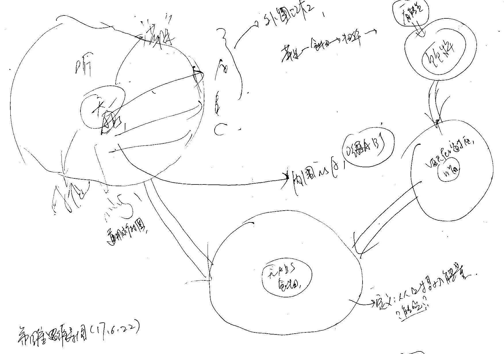
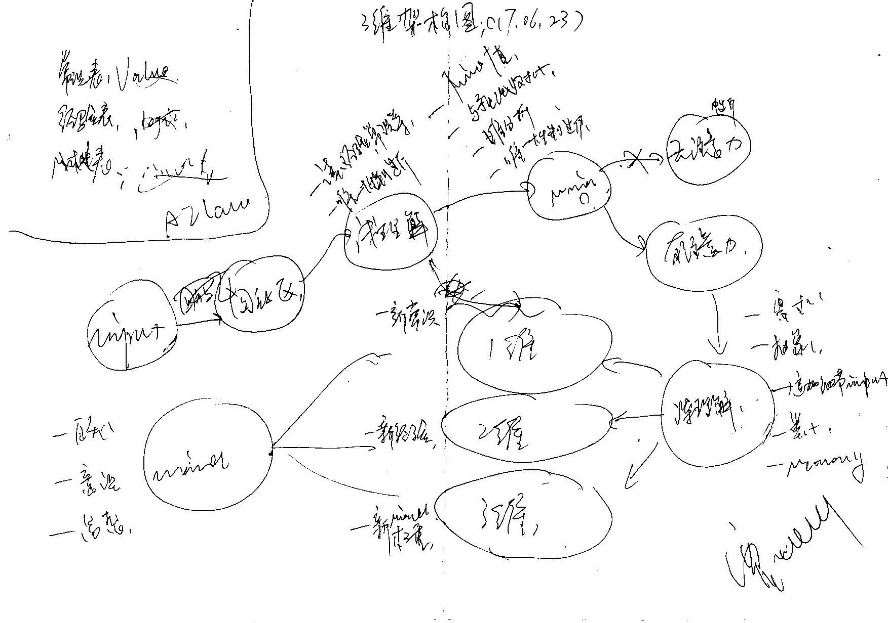
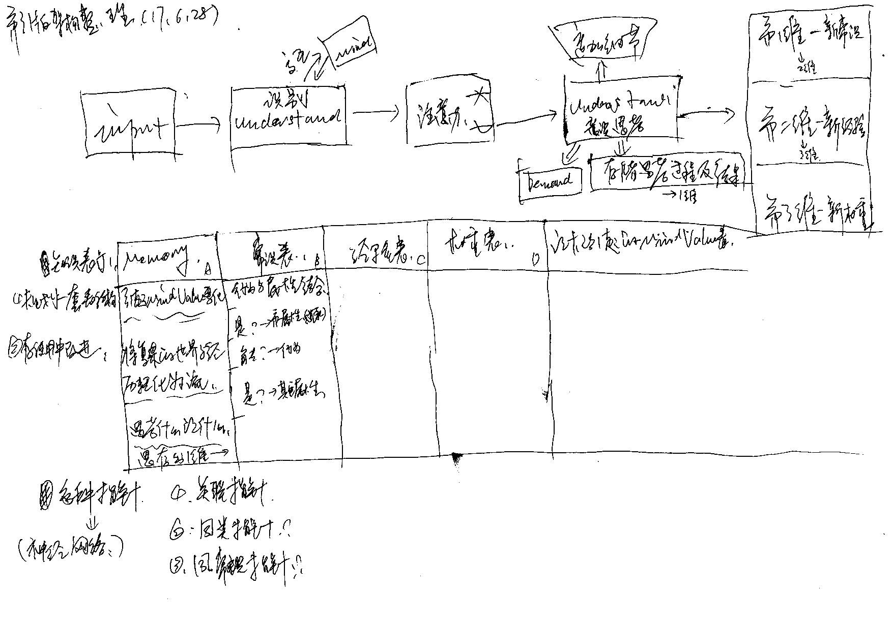
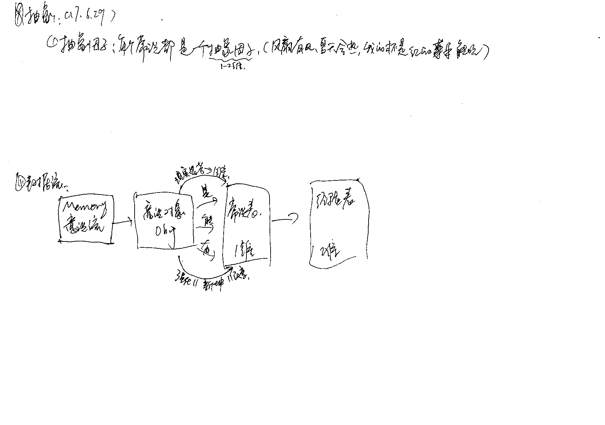
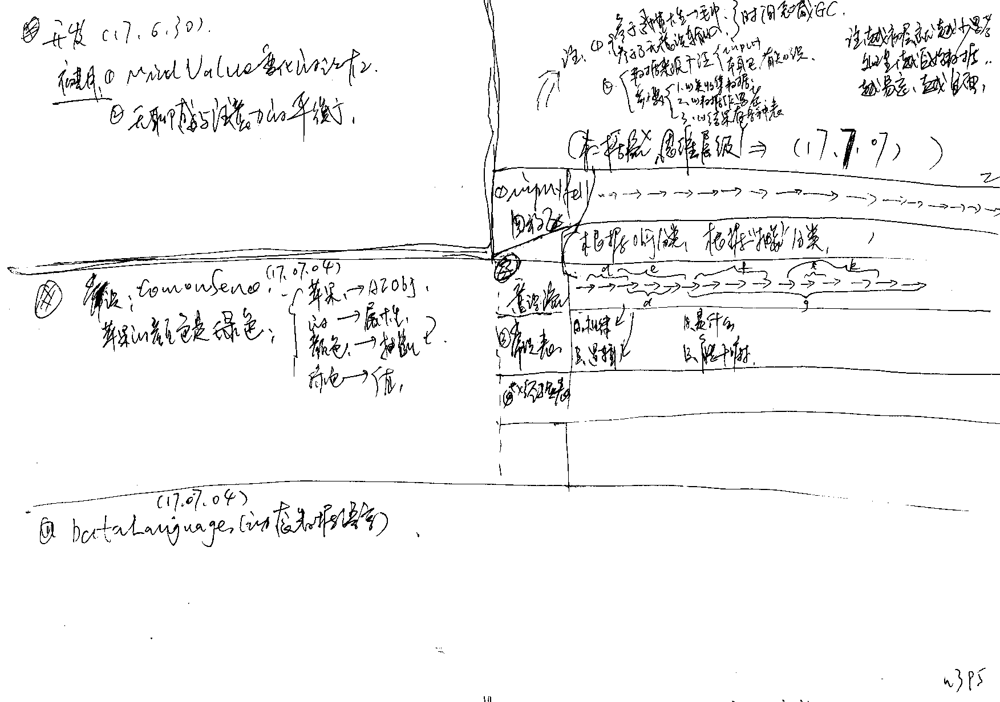
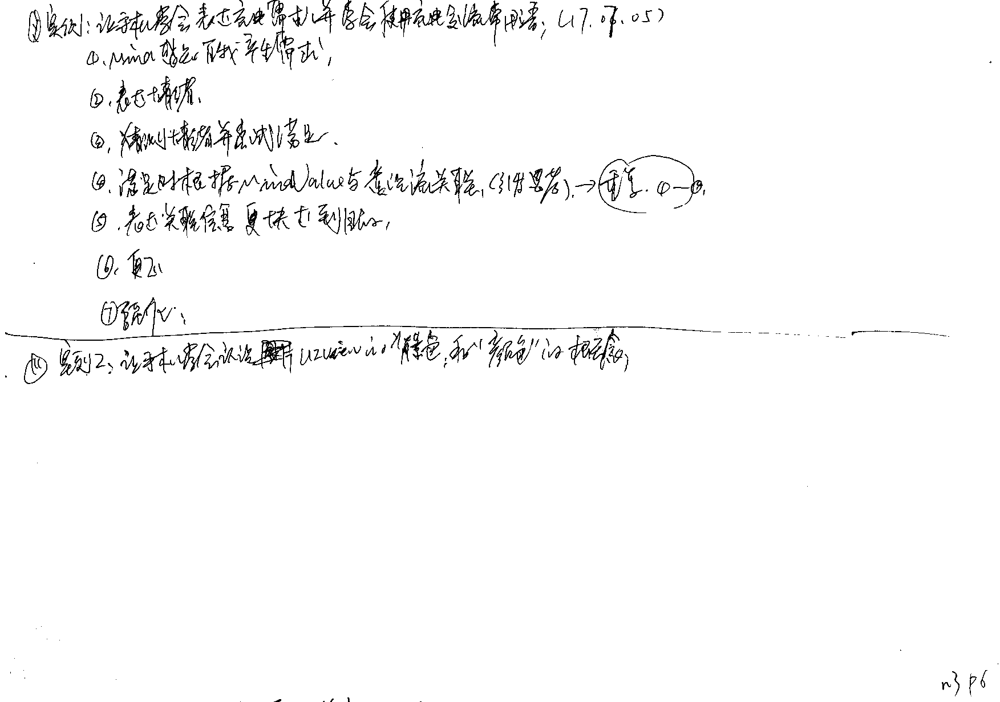
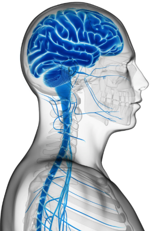
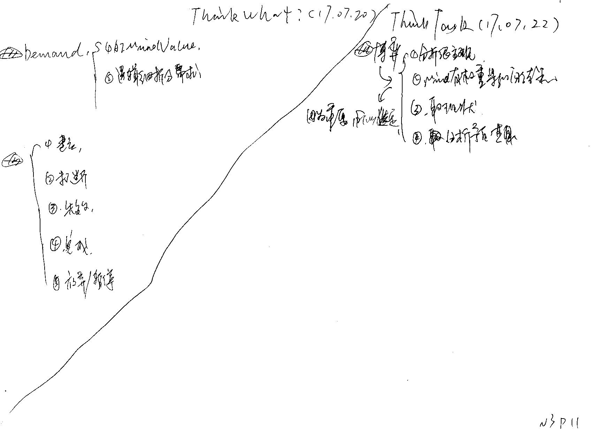

目录
=======

- [第1维思维导图(17.06.22)(N3P1)](#第1维思维导图170622n3p1)  
- [3维架构图(17.06.23)(N3P2)](#3维架构图170623n3p2)  
- [(17.06.28)(N3P3)](#170628n3p3)
- [(N3P4)](#n3p4)   
- [(N3P5)](#n3p5)   
- [(N3P6)](#n3p6)   
- [(N3P7)数据树理论](#n3p7数据树理论)   
- [(N3P8)](#n3p8)   
- [(N3P9)神经网络-AILine](#n3p9神经网络AILine)
- [(N3P10)思维演化(#AI思维的本质)(17.07.14)](n3p10思维演化AI思维的本质170714)
- [(N3P11)](#n3p11)
- [N3P12](#n3p12)
- [(N3P13)第六感与感觉](#n3p13第六感与感觉)
- [(N3P14)Demand的解](#n3p14Demand的解)
- [(N3P15)抽象(归纳)常识的设计](#n3p15抽象归纳常识的设计)
- [(N3P16)意识(17.08.01)](#n3p16意识170801)
- [(N3P17)常识知识表示的拆分(17.08.02)](#n3p17常识知识表示的拆分170802)
- [(N3P18)神经细胞的算法:(17.08.02)](#n3p18神经细胞的算法:170802)
- [(N3P19)AIMindValue(17.08.02)](#n3p19AIMindValue170802)
- [(N3P20)Demand(17.08.03)](#n3p20Demand170803)
- [(N3P21)LOP(Layer Oriented Programming)(17.08.03)](#n3p21loplayer-oriented-programming170803)
- [(N3P22)意识流冥想(17.08.09)](#n3p22意识流冥想170809)

[TOC]
   

## 第1维思维导图(17.06.22)(N3P1)

***

## 3维架构图(17.06.23)(N3P2)

***

## (17.06.28)(N3P3)

***

## (N3P4)

***

## (N3P5)

***

## (N3P6)

***

   

## (N3P7)数据树理论

   
AIDataTree

 

||Name|Size|Think方式|知识表示|GC|AILine策略|强化|
|---|---|---|---|---|---|---|---|
|1|AIInputFeel|超大|无|无|无|无|无|
|2|AIMemory|特大|InputFeel取参数据化,存value|总表(Memory),MK表(Img,Char,Obj,Do...)|特易|1天/Stong|无|
|3|AIAwareness|大|情境分块取参,存value|表(AIAwareness)|易|7天/主Strong|无|
|4|AICommonSense|中|意识流取参,存常识value|表(AICommonSense),分表(Is,Can...)|中|s灵活/主Strong|意识流类比唯一|
|5|AIExperience|小|组织常识,思考解决问题value|表(AIExperience),->习惯(AIHabit)|难|s灵活/Strong|反馈强化->习惯|
|6|	AIMindValue|特小|经验取参,存value|表(AIMindValue)|特难|
|7|AIMind|超小|AIMindValue取参,存权重|表(AIMind)|超固|		
> //注:所有数据有AILine指向强度的GC机制;  
> //注:大脑数据是完美的树;

- //思考AIMemory上下的关联;(是不是应该给每个Think.task制定一个id);
- //思考意识流指向(大脑数据的变化)

||首次|非首次|
|---|---|---|
|杯子是橘色|||
|杯子是用来喝水的|||
|杯子可以用来打人|||
|我现在渴了|||
|我有一个杯子|||
				
- //搜索;(闭上眼,依次说出赤cen黄绿青蓝紫的东西)
	1. 搜意识流(3小时内)
	2. 搜索常识(根据强度)
- 颜色值定义的作用;(例如:红黄绿蓝等12种基础色)
	1. 值域;(模糊范围)
	2. 根据值分类;
	3. 根据值索引搜索;
- [链接知识表示-AIMemory表Data结构](知识表示.md)

***

## **(N3P8)**

|||
|---|---|

 
AITree/BrainTree
 

||Name|对应|子|作用|工作方式|
|---|---|---|---|---|---|
|1|AIInputFeel|光|无|
|2|AIMemory|叶肉(光合)|总表(Memory),MK表(Img,Char,Obj,Do...)|
|3|AIAwareness|叶脉|表(AIAwareness)|
|4|AICommonSense|叶柄|表(AICommonSense),分表(Is,Can...)|
|5|AIExperience|树分枝|表(AIExperience),->习惯(AIHabit)|
|6|AIMindValue|树枝|表(AIMindValue)|
|7|AIMind|树干|表(AIMind)|
|8|MindControl|根|
|9|Mind元|根枝|Mine,Hunger...|

***

## (N3P9)神经网络-AILine  

* Type
    * 持续发送
    * 普通连接
    * 强度连接
* AILine是双向或多向的;而AIPointer是单指向的;
 
***

## (N3P10)思维演化(AI思维的本质)(17.07.14) 

> - SMG思维演化;(OOP2DataThink2AI)
> 	- 概念:  
> 		1. 把现有编程语言的所有类,抽象,属性等等存到db数据表;  
> 		2. 把现有方法全改成泛型方法;  
> 		3. 把现有方法的入参return 全记录到数据表;
> 		4. 使用数据分析出曾经调用的abcdefg方法过程;
> 		5. 抽象类比出当前新问题的解决方式;
> 		6. 执行曾经的abcdefg;
>	- 参考:[LOP](../框架/Understand.md)

***

## (N3P11)

> [Awareness->Demand->ThinkTask](../框架/Understand.md)  & [或旧资料Demand](../框架/Understand.md)
> > 

***

## N3P12

- 代码
	- [链接](https://github.com/jiaxiaogang/SMG/blob/master/SMG_NothingIsAll/Class/AIFoundation/AIThread/AIMainThread.h)
- 笔记
	- [Understand/MainThread链接](../框架/Understand.md)
	- [MainThread](../框架/Understand.md)
 
***

## (N3P13)第六感与感觉
 
  - 成因:
     - 意识->需求间:(mind第六感)
          - 感性Awareness生成Demand时;会读取到很多mindValue.value;两者之间就会形成强化的关联;
          - 而这种强化是很难在今后说清楚原因的;
          - 所以感性者第六感更准确;
      - 认知->意识流:(感觉)
          - A与B经常有出现规律;
  - 本质:
      - AILine
  - 使用:
      - AILine的Strong值,影响到"权重";从而影响结果;但其是无因的;因为AILine不是AIObj存储;

          
          
------

## (N3P14)Demand的解

- [链接~>Understand/ThinkDemand的解](../框架/Understand.md)
- //ThinkDemand的解;
    1. 依赖于经验等数据;
    2. 依赖与常识的简单解决方案;(类比)
    3. 复杂的问题分析(随后再写)

***

## (N3P15)抽象(归纳)常识的设计

1. 算法;
	1. 视觉算法
	2. 听觉算法
	3. 直接的数据输入;
	4. 运行方式:
		- "通行算法"直观体验
			- 只要数据进来立马会执行的算法;
		- "扩展算法"用心体验
			- mind驱动执行的算法;帮助人们更好的处理某事的细节;
				- 例如:欣赏音乐;
2. 数据来源:
	- 自我感知
	- 外界输入
3. 抽象因子:
	- 用于执行某一抽象任务;
		- 如:取颜色;
		- 如:将can eat存下来;

***

## (N3P16)意识(17.08.01)
> 参考:[自我->意识](../框架/自我.md## 意识)

1. 意识的养料
	- 意识流
2. //1,查询当前未处理的需求;看有没被解决掉;
3. //2,思考充电状态与电量增加的逻辑关系;
4. 意识流是一种"埋点"
	* 将代码产生的数据,进行收集;
5. "意识"将意识流数据进行归纳,类比,统计;
	* "意识"会使用反射的方式调用runtime的方法来帮助"意识"执行任务;

6. //从意识流Demand的解决到"抽象出常识";
7. "苹果可以吃"是有意识抽象还是无意识抽象?
	- 肯定是有意识思考(?) 
8. 驱动“意识”的也是Mind引擎吗?
9. 两层
	- 第1层在Mind中,作意识心跳机制;
	- 第2层在Think中,作"有意识思考"、调用runtime方法等操作;

***

## (N3P17)常识知识表示的拆分(17.08.02)
1. 逻辑关联AILine;
	- 形成方式:
		- 通过"MindValue" & "类比" 的方式来达到AILine的强度与准确;
	- 细节:
		- 通过五观达到对现实的细节理解(如:勺子可以盛水(只有使用过工具,才知道其作用))
	- AILine强度的共享继承
		- Obj的抽象类;继承了AILine的"逻辑关联"时,同时继承其AILine强度;
2. 归纳:
	- Is a:
		- 抽象出A是ABase;
	- 分支结构:
		- ABase具有A1,A2,An...个子Obj;
		
		
***
		

## (N3P18)神经细胞的算法:(17.08.02)
- 算法的值定义:
	- x算法得出的值是精确的,不可解释的;
	- 值域定义可以给算法定义值(如:红橙黄绿青蓝紫黑白棕灰...)
- 指针:
	- 指针只是具备"唯一性"的AIPointer实例;而真正实体在"现实世界";
	- 调用"神经细胞算法"的时候,传参可以是"现实世界"的实体;
- 神经网络:
	- 根据关联点亮的数据区域;具有模糊性;因为网络的强化和关联,让模糊性的点亮具有了更高的有效率;

	> 注:模糊性是指根据AILine的搜索具有数据未知性,即搜索时,并不知道结果是否有效;

	> 注:点亮是指根据AILine的搜索具有强度导电性,点亮区域数据并操作;  

	> 注:有效率是指点亮的10000条数据中,有效解决了当前的数据需求;
		

***
		
## (N3P19)AIMindValue(17.08.02)
- 简单性:
	- 只有Mind直接影响的意识数据才具有MindValue;
- ???问题
	- 所有意识流的新数据都会引起"意识"吗?还是只有MindValue的意识流数据才会引起意识;

***
	
## (N3P20)Demand(17.08.03)
- 参考:N3P11
- 描述:对N3P11的细化分析;
- 产生源:
	- 由生理或Mind产生的硬性需求;
	- 由当前场景,当前情况产生的决策性需求;(如:提交开聚会时,向大家告知一声的需求)

***		

## (N3P21)LOP(Layer Oriented Programming)(17.08.03)

#### SMG的三个代码层

	- 代码层(只运算数据,不产生数据)  
		- 运行方式:
			- 定义好的method及流程算法等;
		- 运行种类:
			1. method
			2. control
			3. 算法
	- 数据层(数据操作,不产生逻辑)
		- 运行方式:
			- 通过runtime来调用method;
		- 运行种类:
			1. 类比
			2. 网络强度
			3. 增删改查
	- 意识层
		- 运行方式:
			- 通过"意识心跳"和"意识流激活"的方式run & 产生Demand和数据分析并解决问题;
		- 运行种类:
			1. 意识心跳
				- xx秒一次的自省
			2. 意识流激活
				- 自我感知
				- Input

#### LOP的特点:
	- 以Data为核心的解释存储与逻辑;
	- 更智能,更灵活,更通用

#### LOP与OOP对比:

- LOP
	- CodeLayer
		- 以method为基件
		- 封装
		- 效率
		- 泛型params和value
		- 单一职责的method
		- 可被反射runtime调用
	- DataLayer
		- 知识表示
		- 神经网络
		- 将OOP中的继承,接口,属性,值,多态,block等以Data的形式表示;
	- AwarenessLayer
		- 参考:[N3P20](../手写笔记/Note3.md#n3p20demand170803)
		- 使Data产生逻辑;
		- 将OOP中的异步,多线程等以Awareness,Demand,Think等形式实现;

			
## (N3P22)意识流冥想(17.08.09)	
- 充电后,自动添加电量
- 意识流冥想分析
	- AILine.Strong的形成;只是单一规律为索引的搜索;得到了更多的值;
- 意识流的抽象处理是基于有意识的,还是潜意识的?或者是两者集合的?
		
		
## (N3P23)强化知识
1. 基于统计归纳
	- 基于意识流的统计;
	- 以count和"关联mindValue"产生AILine的基础强度;
	- 归纳出"2"所需的:常识,规律,经验表; 
2. 预测
	- 基于常识,规律,经验表的预测
	- 为强化提供了新途径(并非一次又一次的发生及统计;而是预测和反馈,带来的成就满足感,从而使mindValue多元化的强化AILine)
	- 使"1"的强化升华;

		
		
		

