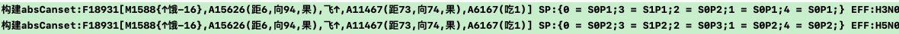
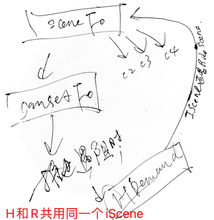
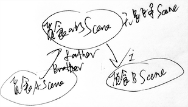
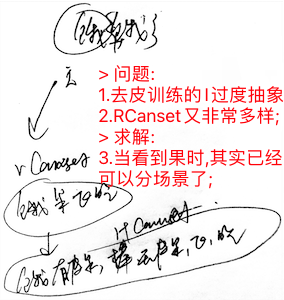
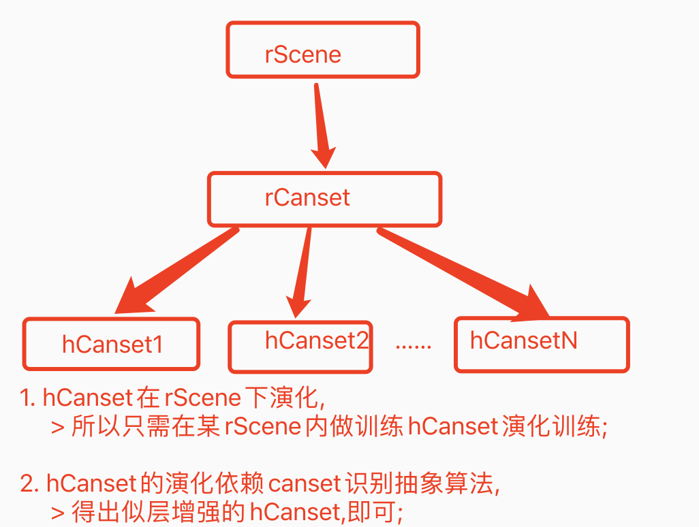

# 回测防撞训练继续觅食训练

***

<!-- TOC -->

- [回测防撞训练继续觅食训练](#回测防撞训练继续觅食训练)
  - [n30p01 回测防撞训练](#n30p01-回测防撞训练)
  - [n30p02 回测觅食训练](#n30p02-回测觅食训练)
  - [n30p03 回测觅食训练2](#n30p03-回测觅食训练2)
  - [n30p04 防撞觅食联合训练](#n30p04-防撞觅食联合训练)
  - [n30p05 迭代TCRefrection反思](#n30p05-迭代tcrefrection反思)
  - [n30p06 去皮训练-前期准备](#n30p06-去皮训练-前期准备)
  - [n30p07 多任务时,防撞任务有循环问题](#n30p07-多任务时防撞任务有循环问题)
  - [n30p08 支持TI和TO双线程](#n30p08-支持ti和to双线程)
  - [n30p09 去皮训练-大纲分析部分](#n30p09-去皮训练-大纲分析部分)
  - [n30p09b 去皮训练-去皮动机部分](#n30p09b-去皮训练-去皮动机部分)
  - [n30p11 去皮训练-学会去皮部分1](#n30p11-去皮训练-学会去皮部分1)
  - [n30p12 去皮训练-学会去皮部分2](#n30p12-去皮训练-学会去皮部分2)
  - [n30p13 去皮训练-学会去皮部分3](#n30p13-去皮训练-学会去皮部分3)
  - [n30p14 去皮训练-学会去皮部分4](#n30p14-去皮训练-学会去皮部分4)
  - [n30pN 备](#n30pn-备)

<!-- /TOC -->

***

## n30p01 回测防撞训练
`CreateTime 2023.06.03`

在n29末，识别二次过滤器测试ok了,本节主要回测下手训防撞,看效果如何;

| 30011 | 手动防撞训练 |
| --- | --- |
| 步骤1 | 强训防撞训练第1步 x 4轮 (多训练多看过各种木棒后,识别准确度更高); |
| 步骤2 | 认知模式手动躲开: `路中偏上,手动上躲成功3次`,`路中偏下,手动下躲成功3次`; |
| 步骤3 | 动物模式试错训练: `路中偏左上`,它应该能迁移过来方案,然后自行进行飞躲; |

```js
//30012-BUG: 碰撞检测误判BUG (明明没撞到,但却判断为撞到了)
//如下,真实情况是鸟是先第二次飞下,然后棒才从279->616的,所以:
//  1. 要么就是鸟飞动画后,没有触发取到真实的棒位置;
//  2. 要么就是鸟飞动画后,压根没触发frame变化,而是在木棒飞完后才触发;
//分析: 根据以下日志触发时间看,应该是第2种,但不一定,可以尝试把触发者打印出来,查下为什么会有这种情况;
//线索: 经调试,发现是鸟飞完动画结束回调未及时执行,而是等到下次主线程不卡时才执行,但不卡可能过了很久(如5s),以往的碰撞检测方法会认为鸟飞了5s,这么慢的飞与木棒撞了,但事实上,鸟压根只飞了0.15s;
//方案: 将动画开始时也回调记录一下动画时长,待完成回调真正执行时,无论它卡了多久,它都能判断鸟在0.15s时就已经飞完了 (只用这0.15s做碰撞检测);
190 [11:14:16:496      BirdGrowPage.m 587] 碰撞检测: 没撞到 棒(0 -> 0) 鸟(362,221 -> 362,221)
191 [11:14:16:497      BirdGrowPage.m 587] 碰撞检测: 没撞到 棒(0 -> 0) 鸟(362,221 -> 362,221)
196 [11:14:17:100      BirdGrowPage.m 587] 碰撞检测: 没撞到 棒(0 -> 48) 鸟(362,221 -> 362,221)
197 [11:14:17:101      BirdGrowPage.m 587] 碰撞检测: 没撞到 棒(48 -> 48) 鸟(362,221 -> 362,221)
435 [11:14:19:608      BirdGrowPage.m 587] 碰撞检测: 没撞到 棒(48 -> 279) 鸟(362,221 -> 362,251)//鸟第1次下飞 (没撞到)
440 [11:14:19:616      BirdGrowPage.m 587] 碰撞检测: 没撞到 棒(279 -> 279) 鸟(362,251 -> 362,251)
441 [11:14:19:617      BirdGrowPage.m 587] 碰撞检测: 没撞到 棒(279 -> 279) 鸟(362,251 -> 362,251)
711 [11:14:23:271      BirdGrowPage.m 587] 碰撞检测: 撞到了 棒(279 -> 616) 鸟(362,251 -> 362,281)//鸟第2次下飞 (明明没撞到,但却判断到撞到了)
//结果: 经修复后,上面BUG修复ok;
```

| 30013 | 二次过滤后末尾也偶尔有准确度低的结果 |
| --- | --- |
| 方案 | 直接把20%并最小4条,改成4条,不要20%了有时20%依然多,留太多也没啥用 `T`; |
| 结果 | 改成4条后,结果发现防撞第1步训练x4后,几乎很准确了 `T`; |

```js
//30014-源自brother迁移过来的canset虽然eff第1名,但实则压根不正确;
=============================== 1 rSolution ===============================
protoFo:F7052[A7050(向7,距124,棒)] 已有方案数:0
测下override过滤生效 (B-F): 原有3 - 过滤1 => 结果2 item场景(B):F4524[A4520(距105,向355,棒)] 取得候选数:2 转成候选模型数:1

0. {1 = S0P1;2 = S1P0;}:(分:1.00) H2N0:(分:1.00) B<F4524 F6996[A4520(距105,向355,棒),飞↑,A6883(距46,向328,棒)]>
1. {}:(分:0.50) H1N0:(分:1.00) I<F6062 F6902[A6059(向8,距115,棒),飞↓,A6899(向14,距97,棒)]>
2. {}:(分:0.50) H1N0:(分:1.00) I<F6143 F6903[A6138(向6,距137,棒),飞↓,A6899(向14,距97,棒)]>
3. {}:(分:0.50) H1N0:(分:1.00) I<F4426 F6906[A4423(向7,距143,棒),飞↓,A6899(向14,距97,棒)]>
4. {}:(分:0.50) H1N0:(分:1.00) I<F4577 F6908[A4571(向10,距105,棒),飞↓,A6899(向14,距97,棒)]>
5. {}:(分:0.50) H1N0:(分:1.00) B<F6062 F6902[A6059(向8,距115,棒),飞↓,A6899(向14,距97,棒)]>
6. {}:(分:0.50) H1N0:(分:1.00) B<F4577 F6908[A4571(向10,距105,棒),飞↓,A6899(向14,距97,棒)]>
7. {}:(分:0.50) H1N0:(分:1.00) B<F6062 F6902[A6059(向8,距115,棒),飞↓,A6899(向14,距97,棒)]>

* 说明: 如下日志,proto为向7,然后在solution决策后,最终优胜者为: 从向355brotherScene迁移来的F6996;
* 复现: `801x4,路中偏上,直投,可顺利躲开`, `然后再重启,路中偏下,直投,可复现如上问题,并错误的向上躲了`
* 思路: 如上日志,源自I的四条,全是正确的canset正确的飞下,只是源自Brother在eff上更优而已;
* 结果. 不用改,再训练多几下自己就好了,其实就是HN需要一个验证过程,在实际测试中,第一次上飞错方向被撞,第二次就改了;
* 共4次试错日志: 第1次偏上,上躲成功; 第2次偏下,上躲失败(错误飞上了); 第3次偏下,下躲成功(正确飞下了); 第4次偏下,下躲成功;
```

| 30015 | 又有一种碰撞误判的情况 |
| --- | --- |
| 说明 | 鸟先躲成功,等棒飞过去半秒后,鸟又飞回来了,被判断为撞到了,日志如下: |
|  | 1. 碰撞检测: 没撞到 棒(0 -> 0) 鸟(380,152 -> 380,152) from:鸟飞开始 |
|  | 2. 碰撞检测: 没撞到 棒(0 -> 91) 鸟(380,152 -> 380,122) from:鸟飞开始 |
|  | 3. 碰撞检测: 没撞到 棒(91 -> 658) 鸟(380,122 -> 380,123) from:鸟飞开始 |
|  | 4. 碰撞检测: 撞到了 棒(658 -> 658) 鸟(380,123 -> 380,123) from:鸟飞结束 |
| 分析 | 看起来这日志撞到时,完全没啥可疑的,鸟在380,123没动,棒在658也没动,是怎么撞到的呢? |
| 线索 | 经调试,发现有时totalTime=0导致woodTime也是0,在分10帧计算时,woodTime做分母,导致radioRect返回的Rect全是NaN |
|  | > 而在求Rect交集时,任何Rect与NaN的交集,全有结果 (非Null),所以导致判断有交集撞到了; |
| 方案 | 针对totalTime为0的情况,支持radioRect返回的一直是初始woodFrame就行,而不是返回NaN无效Rect; |
| 结果 | 改为分母为0时,得数为0,结果回测此bug好了 `T`; |

| 30016 | 继续回归防撞训练 |
| --- | --- |
| 说明 | 经30011步骤训练,`得到FZ80`; |

***

## n30p02 回测觅食训练
`CreateTime 2023.06.09`

在上节中,手训防撞训练FZ80上下躲都ok了,这节开始回归觅食训练;

| 30021 | 手动觅食训练: 训练步骤 |
| --- | --- |
| 1 | 学饿: (`饿,扔随机坚果,不吃,又饿` x 200轮) x 4次; |
| 2 | 学吃: 在认知模式下:`饿,指定方向附近扔坚果,手动飞过去,触发吃掉` x 方向上下各2次; |
| 3 | 试错: `饿,上扔坚果`,它应该能自行飞过去吃掉; |

| 30022 | 觅食训练中遇到识别二次过滤: 性能超慢问题 |
| --- | --- |
| 说明 | 在30021-1训练4次后,第2步训练时,发现识别二次过滤超慢 (超过6s); |
| 优化1 | 在二次过滤中取同级场景节点后,AIPort的防重性能差,优化后从5s提升到1.3s `T`; |
| 优化2 | 概念和时序的识别结果过多,导致本来数据量就大,读硬盘就卡死了,加上限制识别结果数最高20条 `T`; |
| 优化3 | 减少二次识别取得的同层场景数,原来20条能取到80条同层场景太多了,改为强度最强的上限30条吧 `T`; |
| 优化4 | 另外测得在觅食第1步训练4次后,概念识别算法也卡,看下优化下... `经测,有缓存后就不卡了,先不改 T`; |
| 优化5 | 经测在30021-1训练时,二次过滤算法越往后跑好像越卡cpu?比如不卡时执行arrIndex要0.04ms,卡时就2ms `T`; |
|  | 原因: 最后发现,是因为XGDebug的models太多了,导致变慢; |
|  | 方案: 将XGDebug的根据loopId新建的一堆model及时删除 (打印debug结果后,就直接删掉) `T`; |
| 结果 | 本节主要优化了训练过程中的性能问题 (主要集中在二次过滤代码),优化后 `转下表回归训练30021 T`; |

| 30023 | 训练至30021-第3步时,发现EFF总是null,然后也没看到TCEffect统计日志更新 |
| --- | --- |
| 日志 | 0. {}:(分:0.50) (null):(分:0.00) B<F2867 F3796[M1177{↑饿-16},A2864(距25,向290,果),A1191(吃1)]> |
| 说明 | 如上F3796,已经试错三次,但一直没有TCEffect更新HN值,然后打出来日志也一直是null; |
| 调试 | 后调试时,发现在未试错时(仅训练前两步),取得的也是null; |
| 线索 | 后发现,原因是在FoNode.updateConCanset()中,更新effect值的targetIndex全传了1,导致的; |
|  | 注: 取AIEffectStrong时sceneTarget是2,而存时全错传了1,导致下标错误取得effStrong全是nil; |
| 修复 | 将FoNode.updateConCanset()更新effect值的targetIndex改成正确的值 `T`; |

| 30024 | 训练至30021-第2步时,发现P反省太快来不及学吃; |
| --- | --- |
| 日志 | 预测: 感性IRT触发器新增等待反馈:0x7fc4a52a9b90 (F1948[M802{↑饿-16},A1945(距6,向94,果)] useTime:2.37) |
| 触发 | 刚上飞一次,就触发了: F1948[M802{↑饿-16},A1945(距6,向94,果)] spIndex:2 -> (坏) |
| 说明 | 如上日志,第2步训练时从预测到触发更饿,只有2.37s,根本来不急飞吃两下,就触发了(坏的结果); |
| 另外 | 因为每次飞都有飞后视觉,所以其实最终也有好的结果,只是它面向的都是飞一下就吃到的那些; |
|  | >>> 而这些最终好的结果,根本迁移不过来,因为完全场景不一样,一个是两步远左右的距离,一个是一步远左右的距离; |
| 修复 | 1.将饥饿感后,触发更饿的时间调长些 `T`;   2.将扔在附近的坚果更近一些,让它先能顺利学吃 `T`; |

| 30025 | 继续回测觅食训练-测得反思不通过问题 |
| --- | --- |
| 问题 | 训练前两步ok,第3步时,发现15条solution结果,在TCRefrection反思中全失败,日志如下: |
| 日志 | `F4507[M143{↑饿-16},A339(距13,向149,果),飞↑,A4500(向130,距0,果),A2893(吃1)] CUT:1 前匹配度0.66 无效率:1.00` |
|  | `反思评价结果:未通过 (解决任务奖励分21.9 Canset风险:-25.00 懒分:-1.0 = -4.1)` |
| 分析 | 任务pFos被解决奖励分为21到22分,`更饿的`场景风险为-25分,无论如何,风险都大于奖励,所以反思全不通过; |
| 思路 | 日志显示effect无效率为1,所以风险总是-25*1=-25,而无效率=1的原因,是计算effectScore时取得AIEffectStrong为nil导致; |
| 结果 | 所以,继续修复30023的问题,等30023修复了,这里AIEffectStrong不为nil了,本文自然就反思通过了 `转30023 T`; |

```c
30026: 30023修复后,训练至第3步时,明明solution有许多结果,反思也通过了,但却打出了`无计可施`;
0. {}:(分:0.50) H1N0:(分:1.00) I<F790 F4497[M328{↑饿-16},A787(距27,向127,果),飞↑,A4488(距0,向225,果),A2893(吃1)]>
1. {}:(分:0.50) H1N0:(分:1.00) I<F1056 F4494[M436{↑饿-16},A1053(距20,向110,果),飞↑,A4488(距0,向225,果),A2893(吃1)]>
2. {}:(分:0.50) H1N0:(分:1.00) I<F1056 F4514[M436{↑饿-16},A1053(距20,向110,果),飞↑,A4508(距0,向186,果),A2893(吃1)]>
3. {}:(分:0.50) H1N0:(分:1.00) B<F790 F4497[M328{↑饿-16},A787(距27,向127,果),飞↑,A4488(距0,向225,果),A2893(吃1)]>
4. {}:(分:0.50) H1N0:(分:1.00) B<F790 F4497[M328{↑饿-16},A787(距27,向127,果),飞↑,A4488(距0,向225,果),A2893(吃1)]>
5. {}:(分:0.50) H1N0:(分:1.00) B<F342 F4495[M143{↑饿-16},A339(距13,向149,果),飞↑,A4488(距0,向225,果),A2893(吃1)]>
6. {}:(分:0.50) H1N0:(分:1.00) B<F1056 F4494[M436{↑饿-16},A1053(距20,向110,果),飞↑,A4488(距0,向225,果),A2893(吃1)]>
7. {}:(分:0.50) H1N0:(分:1.00) B<F1056 F4514[M436{↑饿-16},A1053(距20,向110,果),飞↑,A4508(距0,向186,果),A2893(吃1)]>
8. {}:(分:0.50) H1N0:(分:1.00) B<F1056 F4494[M436{↑饿-16},A1053(距20,向110,果),飞↑,A4488(距0,向225,果),A2893(吃1)]>
9. {}:(分:0.50) H1N0:(分:1.00) B<F1056 F4514[M436{↑饿-16},A1053(距20,向110,果),飞↑,A4508(距0,向186,果),A2893(吃1)]>

=============================== 2 TCRefrection反思 ============================
F4497[M328{↑饿-16},A787(距27,向127,果),飞↑,A4488(距0,向225,果),A2893(吃1)] CUT:1
反思评价结果:已通过 (解决任务奖励分22.6 Canset风险:-0.00 懒分:-1.0 = 21.6)
>>>>>> rSolution 无计可施

调试: 经调试,发现fo中的mv元素被判断为空概念了 (因为原来mv的port.header全是由nil生成的,而不是由content_ps);
原因: 而在TCRealact中,空概念会从它的具象重新找一个canset替换返回,而mv并不是空概念,它也没具象指向啥canset,所以就全替换成了nil,导致报无计可施 (参考29069-todo8);
修复: 将mv的delta_p和urgent_p当成mv的content_ps去生成header,这样就不会被判断为空概念 `T`;
总结: 本节误判mv为空概念导致觅食训练明明有解却在TCRealact中替换成了nil,导致未行为化的问题;
```

本节性能优化,以及修复了决策过程中的一些跑不顺的BUG,下节继续回测;

***

## n30p03 回测觅食训练2
`CreateTime 2023.06.19`

| 30031 | 第3步来不及吃到,更饿就发生了 |
| --- | --- |
| 说明 | 根据30021训练至第3步,发现8s后更饿已触发,9s后才吃到坚果; |
| 猜测1 | 既然8s没来的急,要不改成更久时间试下; |
|  | 问题: 可以是可以调长些,让它有足够多飞几次的时间,但这样第1步训练就该很慢了 (毕竟每训练一轮都得等很久); |
|  | 结果: 最后发现慢的原因是因为首次识别没缓存,时间不用调长; |
| 猜测2 | 要不就是把中途发生的事简化一下,因为中途发生太多识别等导致9s后才吃到; |
|  | 分析: 可试下,如果吃前吃后有视觉,可废除下; |
|  | 结果: 吃前后有视觉也没啥影响,何况看起来中途并没有什么可简化的; |
| 猜测3 | 考虑每8s更饿一下,直到吃到为止,这样就不限时间内了; |
|  | 问题: 即使后面又吃到了,前面的那个canset的effect也已经计为eff-1了 (即前面明明有效的一轮错误计负了); |
| 原因 | 经调试,压根就是首次识别因为没缓存太慢导致的,首次坚果的识别竟然用了5s; |
| 结果 | 调整训练步骤,在正式试错前,先把缓存加载上,即可 `转30032-3 T`; |

| 30032 | 手动觅食训练: 训练步骤 |
| --- | --- |
| 1 | 学饿: (`饿,扔随机坚果,不吃,又饿` x 200轮) x 4次; |
| 2 | 学吃: 在认知模式下:`饿,指定方向附近扔坚果,手动飞过去,触发吃掉` x 方向上下各2次; |
| 3.1 | 缓存: 先在认知模式下,`上扔坚果,模拟重启`, (识别下,以加载缓存); |
| 3.2 | 试错: 然后动物模式下: `饿,上扔坚果`x2,`饿,下扔坚果`x2,它应能自行飞过去吃掉; |
| 4 | 扔远点试下,看能不能连续飞觅食成功; |
| 结果1 | 经前3步训练,得到FZ81,在第3步上下各两次试错,都觅食成功了; |
| 结果2 | 在FZ81基础上,尝试第4步(两飞距离远),连续飞ok,存为`20230619连续飞吃到坚果.mov`; |

本节觅食训练大致ok,并存为FZ81;

***

## n30p04 防撞觅食联合训练
`CreateTime 2023.06.19`

| 30041 | 训练规划 |
| --- | --- |
| 简介 | 在学会防撞和觅食的基础上,能够学会: `有车时,不飞过去吃`; |
| 注 | 此训练只有`上下躲和上下飞吃`两个方向,别的方向暂未参与到此训练测试中; |
| 第1步 | 认知模式: 学饿(30032-1) |
| 第2步 | 认知模式: 学撞(30011-1) |
| 第3步 | 认知模式: 学吃(30032-2) |
| 第4步 | 认知模式: 学躲(30011-2) |
| 第5步 | 动物模式: 自躲试错: `路中偏上/偏下(左中右都试下)` x N,它应该能迁移过来方案,然后自行进行飞躲; |
| 第6步 | 动物模式: 自吃试错: 先在认知模式识别下坚果加载缓存,然后`饿,上扔坚果` x N,`饿,下扔坚果`x N,自行飞吃; |
| 第7步 | 鸟在底部出生,饥饿,坚果扔到顶上,鸟在自行向上觅食过程中,再扔木棒,鸟会怕疼并折回 (测在危险时,不飞过去吃); |
| 记录1 | 目前为止，训练到第5步一切ok; |
| 记录2 | BUG_有时第6步连续飞时,飞到坚果上又立马飞超过了,也输出吃动画了,但就是没吃到; |
|  | > 修复: 因为动画执行完后,又不在坚果处了,改为只要吃就吃到,而不是动画后才正式算吃 `T`; |
| 记录3 | BUG_第6步时,与上例类似情况,飞到又立马飞超过了,有时压根无法触发吃; |
|  | > 原因: 现在是根据飞后位置rect来判断是否能吃到的,但有连续飞时,可能会连续飞的一下闪过坚果所在; |
|  | > 分析: 飞动画执行完成后,可以根据飞过的轨迹来判断是否有路过坚果,只要路过了就吃掉; |
|  | > 思路: 和碰撞检测算法类似,用分帧来模拟轨迹,判断有没路过坚果 (现在都是直飞,有斜着,分帧都可支持); |
|  | > 方案: 判断下飞前后的距离,比如距离为42,就分42帧来判断,看下复用碰撞检测算法 `T`; |
| 记录4 | 训练到第6步完成,第6步试错几乎全自行成功吃到坚果; |
| 记录5 | 训练到第7步完成,第7步训练ok,得到`FZ82`和`20230624想吃但怕撞.mov`; |

| 30042 | 进一步训练计划 |
| --- | --- |
| 1 | 试下在安全地带的坚果,即使有车也敢吃; |
|  | 失败: 因为即使安全地带,看到木棒也有些许害怕,它会影响到小鸟向着躲的方向飞下; |
|  | 原因: 关键在于等木棒飞走安全后,小鸟应该能折回才对,但显然目前的饥饿不够持续,等安全后,饥饿状态也没了; |
|  | 解决: 只有饥饿状态更加可持续 (比如持续性的5s一次触发,直到吃到为止),这样才可以让小鸟有足够动机折回 `转2`; |
| 2 | 试下在危险地带的坚果,在安全后能飞过去吃 (需要支持循环变饿,即持续饥饿状态); |
|  | todo1: 支持持续饿感 `T`; |
|  | todo2: 在饥饿时直接触发一下视觉,而不是必须扔一下坚果,因为循环持续的饥饿状态,总不能每循环一次就扔一个 `T`; |
|  | todo3: 因为饿后会触发一次视觉,并且改成了持续饿感,学饿步骤改成:`学饿: 认知模式(扔随机坚果,饿 x 200轮) x 4次;` `T` |
|  | >>> 回滚: 此训练步骤改动回滚回原步骤`饿,果`,因为即使初次饿后有视觉,也因当时无果,而看不到东西 `转30043-方案`; |
|  | todo4: 第2步学吃训练,可分两种训练,第1种是`坚果,飞,吃`,第2种是`坚果,饿,飞,吃` `废弃,变更为todo5 T`; |
|  | >>> 说明: 其中第1种,用于解决识别pFo为`[果]->{饿}`的问题,第2种用于解决识别pFo为`[果,饿]->{更饿}`的问题; |
|  | >>> 问题: 第1种pFo其实还没饿,它只是为了避免饿,但可能吃后再饿呢导致无效,也有可能吃撑死毕竟并没在解决饥饿问题; |
|  | >>> 废弃: 所以第1种学吃训练废弃 `转todo5,改为仅学吃第2种`; |
|  | todo5: 第2步学吃训练: `饿,坚果,飞,吃` `T`; |
| 3 | 30042-2改后,此处记录回训; |
|  | 回训1: 用新的`学饿`来训练觅食,识别ok,然后训练第2,3步,最终第3步时上下连续吃都ok `T`; |
|  | 回训2: 在回训1的基础上,加上`右吃`,然后再进一步训练`多次飞并转向`吃 `T`; |
|  | >>> 结果: 坚果在右上角时,先上飞,再右飞是ok的,但第1次飞和第2次飞之间总是停顿8秒 `转30043`; |
|  | 回训3: 在以上基础上,训练防撞,并最终可以: `危险地带坚果,等木棒走后安全了再飞过去吃` `转30044-8`; |

| 30043 | BUG_变向觅食的停顿问题 |
| --- | --- |
| 说明1 | 在上表回训2中,比如右上的坚果,觅食飞上后,紧跟不右飞,会等下次8秒后饥饿触发时,才会右飞问题 |
| 说明2 | 其实不用变向,只要是距离远点,连续飞才能吃到的,都会有此BUG; |
| 分析 | 第1次飞的pFo起因是: `[果,饿]->{更饿}`,解决方案是: `[坚果,饿,飞,吃]`; |
|  | 第2次不动时的起因是: `[果]->{饿}`,解决方案是: `无计可施`; |
| 思路 | 看下第1次飞后,能不能识别到[饿,果]->{更饿},然后为它训练解决方案,即可让鸟不等就第2次飞; |
| 调试 |  |
| 说明 | 上图为,需要连续飞才能吃到的情况时,在中途停顿前的最后一条识别日志; |
|  | 解读: 图中可见,鸟已经下飞一次,protoFo为[饿,果,下飞,果],此时应该识别到它还会再饿的pFo才对; |
|  | 问题: 但很明显,图中并未识别到`[饿,果]->再饿`之类的pFo,导致未能针对目前场景立刻继续飞觅食; |
|  | 思路: 看能不能优化下训练步骤,让它能够在这种情况下识别到`[饿,果]->再饿`; |
| 方案 | 看第1步学饿训练改回原来的: `饿,果` (现在是`果,饿`),然后回测下能不能让它容易识别到 `T`; |
|  | >> 正据: 在30042-todo3,改成了"果,饿",但本方案与30042-todo3-回滚相互呼应,可改后训练试下; |
| 结果 | 按着此方案改后,重新训练学饿,并看下此BUG还存在不 `转30044-进行训练`; |
| 回测 | 回测结果: 经30044训练得到FZ83,其可持续识别到[饿,果]->再饿了,也不再有停顿问题,可以直接连续飞吃了 `T`; |

| 30044 | 经30043调整后和改了持续饿感,重新进行手动觅食训练: 训练步骤 (参考30032) |
| --- | --- |
| 注 | 新电脑硬盘性能更好,不用在第3步前加载缓存了,并且现在是持续饿感了,即使第1下饥饿失败一下也没啥; |
| 注2 | 本表前4步为觅食训练,后3步为防撞训练; |
| 1 | 学饿: (`饿(持续饿感3次),扔随机坚果,不吃,又饿` x 200轮) x 4次; |
| 2 | 学吃: 认知模式:`饿,指定方向附近扔坚果,手动飞过去,触发吃掉` x 上下右各2次; |
| 3 | 试错: 动物模式:`饿,扔坚果` x 上下右各3次 (因为是持续饿感,前一两次它会有试错然后正确飞吃,第3次直接能正确飞吃) |
| 4 | 连续飞吃: 动物模式: `扔远点试下(直方向,斜方向各 x 3次),看能不能连续飞觅食成功`; |
| 小结 | 经训练得到FZ83,四步训练都ok顺利; |
| 5 | 强训防撞训练第1步 x 4轮 (多训练多看过各种木棒后,识别准确度更高) (参考30011-1); |
| 6 | 认知模式手动躲开: `路中偏上,手动上躲成功3次`,`路中偏下,手动下躲成功3次` (参考30011-2); |
| 7 | 动物模式试错训练: `路中偏左中右` x 上下各N次,它应该能迁移过来方案,越来越准确的自行飞躲 (参考30011-3); |
| 小结 | 经训练得到FZ83-5,83-6,83-7,三步训练都ok顺利; |
| 8 | 危险坚果安全后吃: `出生路下方,饥饿,路上方扔坚果,开始觅食时,扔木棒`,小鸟应能等木棒走后安全了再飞过去吃; |
| BUG1 | 中途BUG: 发现痛感mv才-9,所以在竞争中,宁可忍着疼也要冲过去吃坚果,将痛感增强后ok `T`; |
| 问题2 | 第8步,看到木棒后,已经决策输出行为折回防撞了先,不过当时思维想了好多东西,导致很卡,还是被撞到了; |
|  | 调试: 在看到木棒后怕疼,飞下躲了一下,但紧跟着在反省后,立马又TCScore然后任务竞争,又激活了饥饿任务,然后就又向上飞了;相当于原地下飞又上飞... |
|  | 所以当时并不是在卡,而是确实在思维循环处理两个任务,只是疼任务和饿任务的行为洽好相反(矛盾) (猜想: 导致二者不断竞争替换着而已?); |
|  | 分析: 看是否在饥饿行为输出前,反思一下,可能会导致碰撞的问题,然后阻止; |
|  | 即: 将当前反思算法迭代一下,支持多任务间的综合评价,避免捡了芝麻丢了西瓜的事 `转n30p05`; |
| 追加 | 在3005b后,迭代了父子任务的反思,并且修测修了一些BUG,训练得到FZ83 `转3005b`; |

总结: 本节尝试防撞和觅食联合训练,迭代了`连续饿感`(参考30042),修复了连续飞的停顿问题(参考30043),修复了饿价值感大于疼的问题(30044-BUG1),但最终测得多任务间反复激活左右摇摆导致捡了芝麻丢了西瓜的问题(参考30044-问题2),经分析此问题转下节继续解决;

***

## n30p05 迭代TCRefrection反思
`CreateTime 2023.07.03`

在30044-问题2中,遇到反思算法比较单调(仅支持当前canset输出前的反思),但对别的任务有什么反面影响没有做处理 (即可能导致捡了芝麻丢了西瓜的事,比如30044-问题2中为了吃而冲过去被撞的实例);

| 30051 | 任务树反思-解决方案前期分析 |
| --- | --- |
| 推进1 | **先回顾下现有反馈反思识别的代码:** |
|  | 思路: 查下原来的反思识别的代码,看能不能用子任务综合评分来解决下此问题,现子任务代码流程及日志如下; |
|  | >>> feedbackTOR(反馈判断)->feedbackRegroup(重组)->feedbackRecognition(识别)->feedbackDemand(子任务) |
|  |  |
|  | 说明: 现反馈反思太简陋,如上图根据一个疼pFo,识别到另外几个疼pFo,嵌套为子任务其实在原地打转 (HE循环禁止原地打转); |
|  | 方案: 考虑把反馈识别改成从cansets中进行识别,这样更符合现架构做法; |
|  | 缺陷: 反馈反思识别主要面向的是反馈后,触发的反思,而目前我们的问题应该是在行为化之前的反思 `所以,转推进2`; |
| 推进2 | **在行为化前反思TCRefrection集合cansets识别来解决当前问题;** |
| 结果 | 本表经过推进1和推进2的分析,已经得出大致解决此问题的清晰思路,具体的方案制定转下表 `转30052`; |

| 30052 | 任务树反思-方案制定与实践规划 |
| --- | --- |
| 简介 | 接上表,我们需要在`行为化输出前`,通过反思,来实现多任务间的互相影响判断,方案制定如下: |
| 方案 | **输出前在TCRefrection中,新写个:判断当前任务的canset如果执行,会对任务树中的别的任务产生什么影响** |
|  | >>> 如果不良影响大,则反思不通过,如果影响不大则反思通过; |
| 实践 | **将当前A任务canset已发生与别的B任务的pFo未发生进行拼接,在B.cansets中识别,以判断A对B任务产生的影响**; |
| todo1 | TCRefrection中新写一个多任务间影响的反思方法,叫:refrection4DemandTree(); |
| todo2 | 将A行为化canset中cutIndex之后,与B任务pFo的cutIndex之前,拼接起来; |
| todo3 | 然后到B任务的cansets中进行识别,看下识别结果的spEff值; |
| todo4 | 根据B任务的spEff值,乘以B任务的mv值,得出A任务如果这么做对B任务带来的影响; |
| 结果 | 反思识别不能从cansets中识别,所以本表代码实践中止`见30053代码段`,然后新的方案`转30054`; |

```c
# 30053代码段 (此代码段是30052的todolist完成中,分析识别算法该怎么写,然后却发现30052不可行的问题,并转30054重新思考解决方案);
//在写30052之前,先分析下: 识别算法怎么写
//  1. 这里不会为regroup生成fo;
//  2. 看下这里的regroup和oldCansets之间怎么判断全含?是哪个mIsC哪个;

//  3. 其实pFo的front部分不用识别,它已发生,且在cansets中本来就有相对应的满足;
//  4. 而back部分,mIsC怎么判断,通过实例来分析:
//      > 比如:pFo为疼,cansets其中一条为:车撞到会疼;
//              疑问: 不解决问题的canset似乎不会生成吧?
//              分析: 有可能迁移来,但在无效后再判为否,但即使它无效未必是因为它的锅,也许仅仅是没用而已,但不至于是负作用 (0分不是负分);
//              结论: 即,判断它是否为负,还是应该在外围进行识别预测价值来决定,而不是在cansets中识别;
//      > 而当前任务的解决方案就是飞到危险地带吃,多任务树反思后发现,吃没疼重要,所以反思不通过;

//      > 再如:pFo为疼,cansets其中一条为:吃药不解决饥饿问题;
//              疑问: 这里反馈似乎未涉及到吃药会苦的介入?
//              分析: 它判断不到苦,可能药就直接吃了,吃了后再反馈又能如何?也是迟了;
//              结论: 即,判断它是否苦,应该放到外转进行识别预测价值来决定,而在cansets中识别是不可能实现的;
//      > 而当前任务的解决方案就是吃药,多任务树反思后发现,吃药治病比饥饿重要,所以反思通过;

//  5. 第4的疑问可见,从cansets进行返回,并不可靠,建议在拼接前后部分后,重新进行识别,然后制定子任务;
//  6. 建议子任务后,再看能不能通过按交通灯按钮,将绿灯改成红灯,让车停下来?
//  7. 如果子任务无解 (即无法改变交通灯),则中止吃的任务 (因为比起饿更怕疼);
//  8. 说白了,就是反思识别提前呗,提前到行为化之前...别的啥也不用改;

//所以: 查下如果将反思识别前置,它能不能在飞之前有效打断?如果能,那这里就不用写了,中止;
//结果: 30052中止后,转30054重新想个方案,解决反思识别的问题;
```

**小结: 以上是针对任务树反思来解决多任务间互相影响的问题(但最终否掉中止了),而以下开始转向用旧有反思子任务来解决这一问题;**

| 30054 | 新方案: 用子任务来解决多任务互相影响的问题 |
| --- | --- |
| 方案 | 把以前的反馈反思识别改一改,前置一下,让它在行为化输出前就完成反思识别,而不是反馈后; |
| 改动 | 然后看用不用改成,拼后段,而不是只拼反馈那一帧 (毕竟改后就没反馈了); |
| 另外 | 分析下,反馈后是不是不用反思识别了? |
|  | 1. 应该不用了,因为现在的regroupFo是由瞬时记忆序列发生的四帧,加上当前canset要行为化的几帧组成; |
|  | 2. 而如果反馈了新的(也会存到瞬时序列里),然后下次行为化之前的反思,它就又可以调用反思识别了; |
|  | 3. 但这里有个要求,就是我们的反思识别,应该在TCAction调用,而不是TCSolution输出之前; |
|  | 结果: 这样就能保证第2条能达成; |
| todo1 | 将瞬时记忆中最后一个protoFo的内容做为前半部分 `T`; |
| todo2 | 将当前actionFo即将行为化的部分(actionIndex到targetIndex之间),做为后半部分 `T`; |
| todo3 | 将前后两个部分生成新的regroupFo `T`; |
| todo4 | 并进行识别(复用时序识别算法) `T`; |
| todo5 | 反思识别的pFo结果生成子任务 `T`; |
| todo6 | 对反思识别生成子任务后的"反思结果"进行判断 (反思通过 = 当前任务迫切度 > 最严重的子任务迫切度) `T`; |
| todo7 | 反思通过时继续行为化,不通过时转由TCScore来自行决定下轮循环竞争是否先解决子任务还是转向别的任务 `T`; |

| 30055 | 回测得死循环BUG |
| --- | --- |
| 调试 | 经调试流程为: `激活父任务->反思不通过并得到子任务->又激活父任务->又反思不通过并得到子任务`; |
| 原因 | 经查原因为,现在TCPlan中激活子任务开关关着,导致子任务永远不会被激活,导致了死循环; |
| 结果 | 把子任务决策开关废弃掉直接 `T`; |

```py
30056: 问题-action反思仅拼接了行为化后段,但瞬时记忆的前段即是0条?
// =============================== 9 行为化Fo ===============================
// 第 3/5 个,时序:F7787[M451{↑饿-16},A1213(距40,向86,果),飞↑,A7781(向157,距0,果),A1785(吃1)]
// =============================== 9 行为化前 反思识别 ===============================
// protoFo:F18026[飞↑,A7781(向157,距0,果),A1785(吃1)]
思路: 按道理来说,这里已经是2283行日志,前面也有看到`果,果,飞,果,棒,飞`,但为什么它们没在瞬时序列里呢?
原因: 当行为输出时,是不会识别的,也不会生成protoFo,所以不能用最后一帧的protoFo,而是必须各帧收集 (mv输入时应该也是这样);
修复: 经测各帧收集一样能取到所有protoFo的order,所以改成各帧收集后ok了 `T`;
```

| 30057 | 觅食方案在刚看到木棒的情况下,未能反思到危险的问题 |
| --- | --- |
| 日志 |  |
| 线索 | 如下两种日志,同样ass是A13310,在proto中也都是A18745,但前者全含,后者非全含; |
| 1普通 | =============================== 8 时序识别 =============================== |
|  | protoFo:F18747[A18729(向88,距66,果),飞↑,A18741(距56,向88,果),A18745(向11,距193,棒)]-> |
|  | ------------------------ 时序全含检查 ------------------------ |
|  | ass:F13313[A13310(向355,距152,棒)]->M263{↑疼-81} |
|  | 时序识别: item有效+1 |
|  | 时序识别itemSUCCESS 匹配度:0.789034 F13313[A13310(向355,距152,棒)]->M263{↑疼-81} |
| 2反思 | =============================== 12 行为化前 反思识别 =============================== |
|  | regroupFo:F18760[A18745(向11,距193,棒),飞↑,A18754(距123,向167,棒),A18755(距46,向88,果),A1785(吃1)] |
|  | ------------------------ 时序全含检查 ------------------------ |
|  | ass:F13313[A13310(向355,距152,棒)]->M263{↑疼-81} |
|  | 末帧时,找不着则联想时就:有BUG === 非末帧时,则ass未在proto中找到:非全含 |
| 说明 | 上面日志是觅食过程中扔木棒,可以看到,2反思中,明明危险却判断为非全含,导致识别不到危险; |
| 原因 | 因为时序全含要求末帧必含,而regroupFo的末帧未能全含,导致整体全含失败; |
| 修复 | 在regroupFo调用时序识别时,不要求末帧必含,修复后ok了,并回测因为危险觅食反思不通过了 `T`; |

| 30058 | 在30057示图中,明明木棒后下飞了下,但瞬时记忆却没有的问题 |
| --- | --- |
| 调试 | 当时的情况是,先觅食上飞,然后看到木棒,再然后又下飞防撞; |
| 分析 | 但上飞后,未立马反馈上飞(在飞动画0.2秒后才会反馈),而此间又看到了坚果,然后把觅食的上飞反馈给了防撞的下飞 |
| 思路1 | [TCScore score]调用处太多,导致循环有点乱 |
| 思路2 | 要不在飞执行后立马反馈吧,不然主线程一卡,它0.2秒根本反馈不了,要等到下次主线程卡过来才会执行; |
|  | > 解释: 因为HE目前的虚拟世界和智能系统是同一个设备执行的,二者受互卡影响; |

| 30059 | 30057反思识别修复正常执行后,变的很卡 |
| --- | --- |
| 调试 | 经调试,行为化前反思识别没有二次过滤,经常识别到20条结果,再到rSolution一执行往往跑出5000循环,导致卡慢; |
| 思路 | 给行为化前反思识别写个二次过滤器,只保留最准确的2到4条,不然rSolution顶不住; |
|  | 1. 二次过滤,要保证它的mv多样性 (避免留下几条全是饿没疼); |
|  | 2. 竞争因子: 既然是反思,应该按每条pFo的迫切度排序 (spScore * mvScore); |
| 方案 | 根据以上思路,写二次行为化反思识别过滤器: 根据mv类型分组,然后过滤出每组迫切度最强的一条; |
| 回测 | 回测不通过-因为用迫切度排序不合理,因为这样总是怕左怕右,一步都不敢飞了; |
|  | 比如: 在实测时遇到: 觅食,反思时预测自己飞一下后依然吃不到,还会饿,然后又取了最迫切的; |
|  | 问题: 成了发现飞后会导致更饿,所以就反思不通过,不飞了,所以调整方案如下; |
| 方案2 | 可调整试下改为matchPFos排序方式不变,仅截取每种mv类型的前3条,看能不即能不彻底改变原有工作,又不至于太多条卡顿; |
| 结果 | 改后,卡顿问题倒是解决了 `T 但测得反思仍然不太稳定,有时通过有时不能,转3005a`; |

| 3005a | 经测试反思同样是饥饿又反思到饥饿问题,但有时能通过(占30%),有时无法通过(占70%),查下为什么; |
| --- | --- |
| 方案1 | 用简单减权的方式,让子任务的迫切度评分x60%,以使HE有更强的连续性行为化意愿; |
|  | 说明: 此方案实践简单有效,先做了再说 `实践转3005b`; |
|  | 比如: 我们赶远路,总不能走一步就想一下下一步会不会更累一点点,然后就因为这一点点就停下; |
| 举例 | 比如我要饿了要找吃的必须走到三百米外饭店,但我走路过程必然会更饿,难道怕更饿,我就不走了么? |
|  | 分析: 现在饿了(-15),如果不走会极度饿(-99),但如果走了虽然会更饿一些(-23)但可以吃饱; |
|  | 思路1: 即,我们不会因为-23<-15就不去饭店,而是因为-23>-99所以我们会去饭店; |
|  | 思路2: 如果不出门,不会变的更饿呢(比如家里有零食可顶下先),那么我们可能放弃去饭店; |
| 流程 | 根据思路1和思路2,得出此例流程如下: |
|  | 1. 饿了(-15) |
|  | 2. 去饭店更饿(-23) |
|  | 3. 所以不去饭店(反思不通过) |
|  | 4. 这样下去会更饿(-99,新的识别和任务) |
|  | 5. 去饭店更饿(-23),>-99,所以去饭店(反思通过); |
| 原因 | 现在饥饿并不会越来越饿,而仅仅是连续饿感而已,导致就像我现在持续-15的饿,去吃一下会-23,我就宁可不去; |
| 方案2 | 应该对饿感进行递增,为防止越来越饿,它才会反思通过去吃 `先不做,等需求更明确再做`; |
|  | 说明: 这种做法无疑是略复杂,但它是必要的; |
|  | 比如: 我们赶远路,累了就歇歇,不累了就再次出发,越来越累的机制在这就很重要 |
| 决择 | 方案1和方案2可同时推进,方案1用于平时反思时pk双方差异不大时,而方案2用于pk双方差异明显时能够继续推进; |
| 结果 | 本节提出了方案1和方案2,其中方案1现在就可以做,方案2可先不做,等到需求更明确时再做 `方案1实践转3005b`; |

| 3005b | 3005a方案1-实践 |
| --- | --- |
| 修复 | 按着3005a-方案1修复后,发现父子任务的反思符合预期了,该通过时可以立马行为化,该不通过时也可以拦截不行为化; |
| 回训 | 继续训练30044-8,顺利得到`20230715-觅食途中遇险躲等安全再去吃.mov`,并打包`FZ83`记忆快照; |

总结:
1. 本节3005a方案2中提出了饿感递增的需求,但这里先不做,后面需求明确了再说;
2. 本节将action反思识别前置到行为化前执行 (参考30054);
3. 并测试修复了期间的几个BUG(30055到3005b),并最终训练FZ83顺利(3005b);

***

## n30p06 去皮训练-前期准备
`CreateTime 2023.06.29`

以上已做好: 防撞训练,觅食训练,二者联合训练,本文开始做去皮训练;

| 30061 | 去皮训练-初步分析 |
| --- | --- |
| todo1 | demo支持输出搬运动作,将坚果移动到某方向指定距离; |
| todo2 | demo支持木棒能把坚果压破皮机制; |

**总结: 本节未能开始实施,因为上节末测得了多任务时还是有一些卡顿问题,后面一个月在n30p07到n30p08间做了思维多线程,到n30p09再继续做去皮训练;**

***

## n30p07 多任务时,防撞任务有循环问题
`CreateTime 2023.07.15`

| 30071 | 多任务时,防撞任务有循环问题 |
| --- | --- |
| 说明 | 发现第1任务为觅食,第2任务为防撞时,明明木棒都飞走了,它还在躲好几次; |
| 怀疑 | 怀疑是子任务在循环求解,通过父任务失效时,子任务跟着失效应该能解决 `怀疑不成立,因为压根和子任务无关 T`; |
| 调试 | 11931 [17:53:47:354      AIVisionAlgs.m  58] 视觉目标 [方向:148 距离:105 高:100 皮:0] |
|  | 说明: 如上日志,在11931行,木棒早就不知道飞哪去了,它竟然还看到距105向148的木棒,这个方向应该是木棒的动画结尾位置 |
|  | 问题: 导致它不断看到木棒,感到一丝危险,所以一直这么循环着; |
|  | 线索: 先查下木棒动画结束后,为什么视觉还能看到; |
| 方案 | 将木棒动画结束后,改为alpha=0后,设为不可见状态 (直接HEView所有不可见时不输入到inputR视觉输入) `T`; |

***

## n30p08 支持TI和TO双线程
`CreateTime 2023.07.16`

发现思维想太多了,一直不断的执行,导致和UI主线程互卡的很,TC执行太多卡了,本节分析解决;

| 30081 | 思维想太多问题: TCScore执行频繁 |
| --- | --- |
| 方案1 | 看能不能每次任务输出行为化后,直接销毁,而不是等下帧继续推进; |
|  | > 不太好,毕竟我们需要工作记忆有持续性的指导,这不可妄改 `否决`; |
| 方案2 | TO不断的循环,跑到行为输出后,立马再次回到TCScore开始下轮循环 `转30084`; |

| 30082 | 思维想太多问题: 支持任务间反思 |
| --- | --- |
| 方案 | 尤其是次要任务向重要任务的反思,需要支持下; |
| 说明 | 当主要任务的actYes输出行为时,就不要干扰它,说白了,次要任务不影响第一任务的执行时,才会行为化次要任务; |
|  | 例1: 我在等人,如果次要任务想打个电话,对等人无干扰那就打; |
|  | 例2: 我在等人,如果次要任务是去买水喝,对等人有干扰就不买; |
| 结果 | 以后再支持,现在action反思已经够用了 `暂不做`; |

| 30083 | 思维想太多问题: 思维异步执行 |
| --- | --- |
| 方案 | 思维和Demo都在主线程,看能不能把思维异步下,从根源上解决二者互卡的问题 (以前试过失败了,这次更坚决试下); |
| 遇坑 | 异步执行后,很多模块(如概念识别)等非常耗时 `电脑当时在卡,电脑cpu不卡后自然就好了 T`; |
| todo1 | 将TC的三个commit方法和AITime的触发器,都切换到TC线程 `T`; |
| todo2 | 封装线程安全的AsyncMutableArray,避免多线程操作闪退 (DemandManager的loopCache数组等) `T`; |
| todo3 | AsyncMutableArray支持forEash方法,避免循环里面的array内容时有多线程操作闪退问题 `T`; |
| todo4 | tc线程由串改为并行,因为外界随时会输入信号,不应排队 (如果TC在忙,可在某些模块因优先级不足而中断,但不该排队) `T` |
| 回测 | 问题1. todo4的TC线程用并行,问题非常大,改为并行后,各种提前销毁队列,各种全局array操作闪退都出现了; |
|  | 问题2. TC并不应该并行,随时信号输入也要看TC是否忙状态,忙是处理不过来的 (可以闲时才接受信号); |
|  | 问题3. 现在视觉比较少,还不至于卡队列,暂时可不处理忙时不接受新输入的问题; |
| 结果 | 本表TC线程写完了 `T` 但回测问题转由下节处理 `转30084`; |

| 30084 | TCScore执行频繁问题-TO间隔10ms跑循环 |
| --- | --- |
| TI线程 | 在30083-todo4中,TI线程是并行跑的,但应改为串行 (参考30083-回测问题); |
|  | 反例: 如果边看到危险,边感受疼,如果危险处理慢,就成了先疼后看到危险了; |
|  | 帧数: 比如视觉场景比较复杂,可以将来不及的队列及时清除,此时可能一秒就看到3帧; |
| TO线程 | TO行为化也应该串行,因为同时只能解决一个任务,避免鬼搐 (如下例子); |
|  | 反例: 边起床工作,边躺下睡觉,二者同步进行,或者上步没走完下步又来了,两步紧跟着进行; |
| 分析 | 其实无论是TI还是TO,在忙时可以直接跳过,只有闲时,才可以增加到队列中; |
| 重点 | **TI和TO各一个串行线程,TI可以闲时队列才接受任务(暂不需要支持),TO可以上轮结束后10ms开始下轮;** |
| 方案 | 即,TO可以一直在TCScore和TCOut间循环,上次行为化执行完毕后,过10ms就开始下一次TO; |
|  | 优点: 从根本上解决了TCScore调用混乱的问题; |
| todo1 | 行为输出时,要设定等待(行为动作所需的)时间 `T`; |
| todo2 | TO过程失败中断时 / 最终成功完成时,都要继续下轮循环 `T`; |
| todo3 | 写个TCResult模型,无论TO执行结果如何,以此模型返回执行结果数据 `T`; |
| 结果 | 写完,初步回测ok `T`; |

**小结: 从30083-30084主要做了TI和TO多线程改动**

30085: 线程小知识总结tips
1. 并行线程在执行完时会销毁,尤其涉及到定时器回调执行它时,可能早就销毁了;
   - 比如在SMGUtils中生成的saveBlock,如果在TC线程生成,到XGWedis使用时,它可能已经销毁了;
2. 转线程时的参数,要用__block保留一下,不然也容易提前销毁;
3. 串行线程不可嵌套调用,否则会循环死锁;
   - 比如本来就在main线程,然后又调用一次,会导致后面等前面,前面又必须执行完后面;
4. 多线程操作数组和字典,尤其是foreach容易闪退,要不copy一下(简单暴力,现选用),要不加同步锁;
   - 可以用dispatch_barrier_async来实现局部串行,使之不要边for边insert/remove;
5. 在并行线程中,任何公用数组都可能闪退;
   - 比如: node.absPorts,它在内存中是全局复用的,如果TC是并行线程,则ports就有可能同时操作而闪退;

| 30086 | 按照30044步骤回归训练 |
| --- | --- |
| 1 | 学饿: (`饿(持续饿感3次),扔随机坚果,不吃,又饿` x 200轮) x 4次; |
| 2 | 强训防撞训练第1步 x 4轮 (多训练多看过各种木棒后,识别准确度更高) (参考30011-1); |
| 3 | 学吃: 认知模式:`饿,指定方向附近扔坚果,手动飞过去,触发吃掉` x 上下右各2次; |
| 4 | 试错: 动物模式:`饿,扔坚果` x 上下各3次 (因为是持续饿感,前一两次它会有试错然后正确飞吃,第3次直接能正确飞吃) |
| 5 | 连续飞吃: 动物模式: `扔远点试下(上下方向各 x 3次),看能不能连续飞觅食成功`; |
| 6 | 认知模式手动躲开: `路中偏上,手动上躲成功3次`,`路中偏下,手动下躲成功3次` (参考30011-2); |
| 7 | 动物模式试错训练: `路中偏左中右` x 上下各N次,它应该能迁移过来方案,越来越准确的自行飞躲 (参考30011-3); |
| 8 | 危险坚果安全后吃: `出生路下方,饥饿,路上方扔坚果,开始觅食时,扔木棒`,小鸟应能等木棒走后安全了再飞过去吃; |

| 30087 | 训练进度及遇到的问题 |
| --- | --- |
| 进度 | 训练第8步时,有木棒向下躲太多次(应该飞走后更快停下才对),然后飞回时又经常停住(没持续飞过去吃); |
| 调试 | ---//感性IRT触发器新增等待反馈:0x600003583280 (F10001[A9998(距22,向2,棒)] \| useTime:6.07) |
| 说明 | 如上: 明明很近距离,但却预测时间为6s,导致飞好久,任务才全失效; |
|  | 需要查下,这里距离这么短,而时间这么长的原因 |
| 分析1 | 问题: 现在deltaTime只会增长,不会缩短; |
|  | 方案: 分析下这里时间的机制,是否需要每次触发疼痛时,能够给予时间修正,使之更贴近现实时间; |
|  | todo3: 在时序类比抽象时,抽象节点的mvDeltaTime根据新的两个具象fo偏移修正 `T`; |
|  | todo4: 抽象的mvDeltaTime向着新的conFo.mvDeltaTime移动 `T`; |
|  | todo5: 偏移量公式 = (conMvDeltaTime - absMvDeltaTime) / (sum(absFo.conPorts.strong) + 1) `T`; |
|  | > 说明1: 具象总强度即为它总共偏移过的次数; |
|  | > 说明2: 具象总强度+1: 即把当前这次也计入总数(分母不会=0了 且 初次=1全偏移,直接=首个conFo的mvDeltaTime值); |
|  | todo6: 实际代码中抽象时已经构建了关联,即本来强度已经+2了,应该相应将公式改成-1和不减,来分别计算偏移量 `T`; |
| 分析2 | 现在的碰撞检测并不及时,可能撞到好久后,才检测到碰撞,触发mv,导致mvDeltaTime变长; |
|  | todo1: 看改成每帧检测: 将木棒改用CADisplayLink来实现动画 `T`; |
|  | todo2: 在每帧回调时,都进行碰撞检测 `T`; |
| 结果 | 分析1和2全写了,最后回测也ok `T`; |
| 回训 | 本表改完后,根据30086步骤训练得FZ84,8步都顺利,并得到:`20230730-觅食途中遇险躲等安全再去吃.mov`; |

**小结: 30087修复了mvDeltaTime不准确问题,30086为最终回训步骤,并顺利得到FZ84**

***

## n30p09 去皮训练-大纲分析部分
`CreateTime 2023.07.30`

n30p06未能正式开始去皮训练,本文正式开始;

| 30091 | 去皮训练-初步分析 |
| --- | --- |
| todo1 | demo支持有皮坚果的搬运功能 `T` |
|  | 方案1. 对有皮坚果,可以咬住携带,到目标地再放开 `5%`; |
|  | 方案2. 支持踢坚果,可以向着8个方向踢出去一定距离 `95%`; |
|  | 结果: 因为方案2更简单,`暂选方案2`; |
|  | todo1.1 支持8向踢动作 `T`; |
|  | todo1.2 支持三击时扔带皮坚果(单双击已被占用: 单击是扔无皮坚果,双击是飞行) `T`; |
| todo2 | demo支持木棒能把坚果压破皮机制 `T`; |
|  | todo2.1 写木棒与坚果的碰撞检测 `T`; |
| todo3 | 设计强化训练工具的训练步骤,能够习得通过踢来搬运坚果 `转30092展开分析`; |

| 30092 | 去皮训练-训练步骤-大致分析 |
| --- | --- |
| 说明 | 本表主要分析去皮训练具体该怎么做,在步骤的大体上,再实际跑一下每一个步骤去深入分析其可行性; |
| 步骤1 | 类似学饿步骤,学会各视角下有皮果会饿; |
|  | **RL训练步骤: 认知模式训练学饿: (`饿(持续饿感3次),扔随机带皮坚果,不吃,又饿` x 200轮) x 4次;** |
|  | todo1: 在RL强训工具里写了kick1BtnClick()强训步骤,可支持步骤1的强训 `T`; |
| 步骤2 | 学吃,能在危险地带时,带皮果会被压破皮并吃到 (旧记忆里已学会飞吃,只需要压破皮别的即可自动完成); |
|  | >>> 即习得: `[饿,带皮果,棒撞果,无皮果,飞,吃]->{不再饿}`; |
|  | **RL训练步骤: `饿,安全地带出生,危险地扔带皮果,扔木棒` (压破皮后,小鸟自行会飞吃掉)** |
|  | 结果: 破皮训练还需要再加深入分析 `转30093`; |
| 步骤3 | 手训几步`学习搬运,然后飞过去,吃到` (只有反省为P好时,才会计为cansetFo,所以直接训练它吃到); |
|  | >>> 即习得: 去皮H经验 => `[带皮果,搬运到危险地带,棒撞果,无皮果]`; |
| 步骤4 | 步骤2联合步骤3,遇到步骤2吃不到的带皮果时,可以使用步骤3的H经验将其搬运到危险地带; |

**小结: 以上是去皮训练的大纲,分成了两步: 1.去皮 2.搬运, 这两步下面详细展开来做;**

| 30093 | 30092-步骤2不顺利问题: 破皮训练规划 |
| --- | --- |
| 描述 | **注意: 压破皮前,饥饿解决方案的第2帧无皮果都没有,破皮后有了,看能不能从中习得压破皮的H经验;** |
| 问题 | 尝试训练发现,并没有获得去皮H经验,本表重点分析这一问题 |
| 分析 | 1. 带皮果饥饿时,没有解决方案; |
|  | 2. 得有解决方案了,才能判定它"无皮果"帧反省spIndex失败; |
|  | 3. 但现在它没有解决方案,所以也没法判失败........ |
|  | 4. 说白了,它饿了没想找无皮果,我们应该在无论何时,让它能去尝试找无皮果.. |
|  | 5. 或者再进一步: 它没能在饿了后,立马预测一会还会饿? |
| 思路 | 经以上分析,饿后,应该立马预测一会还会饿,然后找到解决方案,解决方案中下帧目标应该是找`无皮果`; |
| 方案1 | 想吃无皮果,然后想到把有皮果加工成无皮果 `95%`; |
|  | 优点: 本方案更符合复杂任务的求解方式 (优先选用) |
|  | 改动点: 要支持P输出时,也要调用时序识别; |
|  | >>> 改动点分析: 本来mv输入现在也算是普通alg帧,所以触发识别也是正常的 `实践转30094`; |
| 方案2 | 直接就是想把有皮果去皮后吃掉,整个过程计为整个长时序来推进 `5%`; |
|  | 改动点A: 要支持瞬时序列中类似帧的合并; |
|  | >>> 改动点A实践分析: 其实在交层抽象层,就相当于有类似效果,根本不必单独写什么类似帧合并功能; |
|  | 改动点B: 或者在工作记忆的带动下能够存留更多帧; |
|  | >>> 改动点B实践分析: 应该是通过反馈啥的,树形拍平就拉长有更多帧了 |
|  | 总结: 本方案需要长时序解决方案的支持,而解决方案都需要PFo来触发才能激活; |
|  | 否定: 改动点A无法获得长时序pFo,而改动点B也很难获得长时序解决方案; |
| 结果 | 复杂任务只有结构化推进才更可行,所以选定方案1; |

**小结: 以上再次深入分析,并重新制定去皮训练的大纲,分为:`去皮动机`、`学会去皮`和`执行去皮`三个部分;**

***

## n30p09b 去皮训练-去皮动机部分
`CreateTime 2023.08.03`

上节中,制定了`去皮动机`和`学会去皮`两个部分,本节将推进去皮动机部分;

| 30094 | pInput时支持时序识别-实践规划 |
| --- | --- |
| todo1 | pInput时不需要概念识别,也不需要二次过滤 `T`; |
| todo2 | pInput时生成protoFo (将mv放为末帧,而不是mv指向),用来进行时序识别 `T`; |
| todo3 | 为防止原来的mv指向代码,与现在的mv为末帧代码,二者产生冲突,可以先各自生成各自工作互不影响 `T`; |
|  | >>> 将mv为末帧的protoFo单独命名成: protoFo4PInput `T`; |
| todo3.1 | 为pInput单独写个TIUtils.pRecognitionFo()方法,等这些流程,区分二者不同处理 (比如识别后抽具象关联等) `T`; |
|  | >>> 经查读代码,应该不用另写,也没啥区别 `废弃,不必重写时序识别算法 T`; |
| todo4 | 彻底废弃fo指向mv,仅保留mv做为概念种类之一来用 `暂不做 T`; |
| todo4.1 | 指向mv不变,在时序识别时,指向的mv也做为一个索引来取assFo,判断全含时也将其做为一帧判断 `T`; |
| todo4.2 | 写fo子类,在pInput时生成的protoFo用这个子类,这个子类中mv在末帧,但也可以取cmv_p指向自动将末帧返回 `废弃`; |
|  | >>> 如果写个fo子类,然后再各种改写方法,使输出数据与抽象fo相同,那和不写没区别 `废弃`; |
| todo5 | pInput时调用时序识别,pFos预测,并生成任务 `T`; |

| 30095 | pInput时支持时序识别-测试与BUG |
| --- | --- |
| BUG1 | **时序识别中mvNode索引取refPorts只有一条,就是protoFo自身;** |
| 分析 | mvNode并未全局防重,同样的迫切度分区也会生成不同的mvNode,而时序识别又依赖它有抽具象关联和refPorts指向等; |
| 方案1 | 看下先pLearning的话,会不会就有抽具象关联了? (不会,因为首帧就是饥饿时,pLearning也是空跑) `不可行 5%`; |
| 方案2 | 看下是否写个mvNode的概念识别算法,并支持下抽具象关联 `可行但麻烦 20%`; |
|  | > 此算法需要支持每次输出迫切度码至少有些不同,不然概念识别就没啥意义了; |
| 方案3 | 直接对mvNode支持全局防重 `简单可行 90%`; |
|  | > 作用: 这样就不缺refPorts了,而refPorts的fo们也自由竞争,激活时各增强各的索引强度 |
|  | > 可行性: 此方案简单可行,迫切度和delta两个值就是mv的content_ps,可用来防重用; |
| 结果 | 暂选方案3,todo实践如下: |
| todo1 | 在构建具象mv和抽象mv两处加上防重机制 `T`; |
| todo2 | mv的fo指向改成数组,因为全局防重后,它可能指向许多fo `T`; |
| 回测1 | **饿预测还饿和生成任务测试 (参考30094-todo5) `测试通过 T`** |
|  | 步骤: `手动饿`(它会自动持续性的饿),然后每下次触发饿后,能够识别到一会还会饿 `T`; |
|  | 测试结果: 测试mv的全局防重ok,mv指向多个foPorts也ok,饿后识别到还会饿也ok `T`; |
| 回测2 | **去皮动机测试 (参考30093-方案1)** |
|  | 步骤: 先做下觅食训练,然后再跑下回测1的饿识别会更饿并生成任务,然后看能不能有去皮动机 `参考30093-方案1`; |
|  | 测试步骤1: `FZ84,饿跑3分钟(其间持续饿感)` (能够习得饿了还会更饿的经验: [饿]->{饿}); |
|  | 测试步骤2: `认知模式,饿,上很近处扔坚果,立马上飞` (它会立马吃掉,并反省为`饿了更饿`生成新canset[饿,果,上飞,果,吃]); |
|  | 测试步骤3: `饿` (它应能找着步骤2时习得的吃果经验,并激活行为化,在行为化中发现现在没有坚果) `参考参考30095代码段4`; |
|  | 测试步骤4: `没坚果转为H任务,并解决H任务` (经测转为H任务正常,但没解决H任务) `参考参考30095代码段4 转30096`; |

```js
//30095代码段1: 此处为`30095-回测2-测试步骤2`反省得到Canset的日志;
=============================== 10 IP反省 ===============================
F17264[M448{↑饿-16}] spIndex:1 -> (好)
---//IP反省触发器执行:0x600000d03a00 F17264 状态:等待反馈
R新Canset:F17544[M448{↑饿-16},A17512(距12,向92,果),M448{↑饿-16},A17512(距12,向92,果),飞↑,A17522(距0,向95,果),A6167(吃1),飞↑,飞↑] (状态:无反馈 fromPFo:F17264 帧:1)

//30095代码段2: 此处为`30095-回测2-测试步骤3`日志;
=============================== 1 rSolution ===============================
任务源:饿 protoFo:F17553[] 已有方案数:0 任务分:-15.57
第1步 R场景树枝点数 I:1 + Father:1 + Brother:14 = 总:16
第2步 转为候选集 总数:0
//问题1: 此处虽然激活但却转为0条;
//原因1: 经查,因为pInput时protoFo长度为0,导致转为候选集前段条件不满足,所以转成功的为0条;
//修复1: 此时应该传入protoFo4PInput,其长度为1,可用于在判断前段条件满足等决策中使用 `T`;

//问题2: 问题1修复后,还是转为0条;
//原因2: 经测,现在的canset太长(往往有多个饿帧),而protoFo4PInput就只有一帧饿,导致前段很难条件满足;
//思路2: 方案1-要么试下训练更及时吃到坚果的canset经验,方案2-要么等protoFo4PInput多饿几次时再来试;
//修复2: 先尝试方案1,不行再试方案2 (结果,方案1有效,方案2就不试了) `T`;
第5步 Anaylst匹配成功:0
第6步 排除不应期:0
第7步 排除FRSTime来不及的:0
>>>>>> rSolution 无计可施

//30095代码段3: 此处为`30095代码段2-问题2-方案1`跑出来的有效果的日志 (此处为30095-测试步骤2提供了成果);
第2步 转为候选集 总数:10
第5步 Anaylst匹配成功:10
第6步 排除不应期:10
第7步 排除FRSTime来不及的:10
0. {}:(分:0.50) H1N0:(分:1.00) I<F17264 F18197[M448{↑饿-16},A18186(距9,向97,果),飞↑,A18191(距0,向123,果),A6167(吃1)]>
1. {}:(分:0.50) H1N0:(分:1.00) I<F17556 F18198[M448{↑饿-16},A18186(距9,向97,果),飞↑,A18191(距0,向123,果),A6167(吃1)]>
2. {}:(分:0.50) H1N0:(分:1.00) B<F17264 F18197[M448{↑饿-16},A18186(距9,向97,果),飞↑,A18191(距0,向123,果),A6167(吃1)]>
3. {}:(分:0.50) H1N0:(分:1.00) B<F17556 F18198[M448{↑饿-16},A18186(距9,向97,果),飞↑,A18191(距0,向123,果),A6167(吃1)]>
4. {}:(分:0.50) H1N0:(分:1.00) B<F17264 F18197[M448{↑饿-16},A18186(距9,向97,果),飞↑,A18191(距0,向123,果),A6167(吃1)]>

//30095代码段4: 在代码段3输出S结果后,然后执行行为化正常,转成H子任务也正常 (但H任务似乎没执行,转30096解决此问题);
=============================== 2 行为化Fo ===============================
第 2/5 个,时序:F18197[M448{↑饿-16},A18186(距9,向97,果),飞↑,A18191(距0,向123,果),A6167(吃1)]
=============================== 3 hDemand ===============================
A18186(距9,向97,果)
TO上轮:成功 等待:0.0 下轮:2 消息:out 此帧需要HDemand来完成,已转为h任务
```

**小结: 如上30093-30095解决了去皮的动机,下面开始做`学会去皮`部分;**

**总结: 本节在30095代码段4已经实现了hDemand动机,但它的行为化却并不顺利 `转30111继续`;**

***

## n30p11 去皮训练-学会去皮部分1
`CreateTime 2023.08.16`

在上节中,实现了`去皮动机`,本节主要接着做`学会去皮`部分;

| 30111 | 去皮H任务生成后,没执行hSolution (接30095-测试步骤4) |
| --- | --- |
| 复现 | 执行在30095-测试步骤3,即可复现此BUG,在日志中可看到30095代码段4后面,没有执行hSolution; |
| 结果 | 在30095中已经实现了动机,执行hSolution是算做`学会去皮`部分在本节完成 `转下表继续`; |

| 30112 | 学习去皮的初步步骤分析 |
| --- | --- |
| 步骤1 | 上节末已针对第二帧坚果生成hDemand,第一步先执行hSolution,知道它没有,并静默等待(actYes状态); |
| 步骤2 | actYes触发理性反省,在理性反省触发前,我们表演一下去皮给它看; |
| 步骤3 | 它会将去皮的过程计为得到无皮果的hCanset; |
| 步骤4 | 下回再遇到找无皮果时,激活hCanset,并试图将当下具备的有皮果,尝试重现去皮过程; |
| 问题 | 反省时间很短,但这期间要表演去皮过程,不知其能否将去皮全程计做hCanset,在实测中确有此问题时解决下; |

```c
30113-查去皮H任务未执行hSolution的原因 (参考30111);
︹︹︹︹︹︹︹︹︹︹︹︹︹︹︹︹︹︹︹︹︹︹︹︹︹︹︹︹︹︹︹︹︹︹︹︹︹︹︹︹︹︹︹︹︹︹︹︹︹︹︹︹︹︹︹︹
* ReasonDemandModel: F18212[M448{↑饿-16}]->M448{↑饿-16} (普 | ActYes)
  > TOFoModel: F18198[M448{↑饿-16},A18186(距9,向97,果),飞↑,A18191(距0,向123,果),A6167(吃1)]-> (普 | ActYes)
    - TOAlgModel: A18186(距9,向97,果) (普 | ActYes)
      # HDemandModel
    - ReasonDemandModel: F6099[M1{↑饿-16},A6095(距105,向138,果)]->M2{↑饿-16} (普 | Other)
︺︺︺︺︺︺︺︺︺︺︺︺︺︺︺︺︺︺︺︺︺︺︺︺︺︺︺︺︺︺︺︺︺︺︺︺︺︺︺︺︺︺︺︺︺︺︺︺︺︺︺︺︺︺︺︺
Demand竞争 ==> START 共1条
第1条 饿 评分-13.80 因endHavActYes 失败 {proto:F18720 pFos:(F18212,F17264,F17556)}

线索: 看起来似乎是因为HDemand的baseAlgModel是actYes状态,导致它激活失败;
疑点: 但algModel并不是末帧,它应该不能算endHavActYes;
  > 在现在代码的endHavActYes()方法中,demandModel是被排除不算末枝的,所以只因为baseAlgModel是ActYes状态就不激活了;
分析: 以下顺着思路分析此问题 (主要围绕HDemand是否也应计入endActYes判断中来思考),并随思随记:
1. HDemandModel应该计入,因为HDemandModel也有可能有解;
      a. 疑问: HDemand.baseAlg到底应该自然发生,还是推进H任务后发生?这是一个问题 (答案见`分析结果`);
              * 如果是前者,那么H任务就不必执行;
              * 如果是后者,那么H任务就应该执行;
      b. 尝试例1: 在等西红柿变红的过程中,是否再放入可催熟的苹果呢? (此例失败,略过);
              * 此例催熟的动机,应该是另一个R任务,所以此例不适用于本问题,略过;
      c. 尝试例2: 如果想要坚果随时就会有,那还需要对带皮果去皮吗? (显然,是否执行H任务,要看baseAlg自然出现的SP稳定性);
              * 比如: baseAlg 50%会自然发生,而HDemandModel的稳定性是60%,那么我们就可以尝试执行HCanset;
              * 再如: baseAlg 99%会自然发生,而HDemandModel的稳定性是60%,那么我们还不如原地等待呢;
2. RDemandModel是否计入呢?
      a. 如果不计入,那么子R任务就没法跑了;
分析结果: 根据c例子,hDemand不管怎样都应该先执行下,只是在hSolution反思时,要pk一下是否值得行为化;
方案: 在endHavActYes()方法中,应该不排除demandModel (支持此方案的正例如下);
  正例1. 经查旧代码，在28143暴力的认为HDemand无解不算末枝，但HDemand并非无解时呢？却没照顾到 (即逻辑有漏洞)。
  正例2. 以上`分析-c尝试例2`的两个例子，说明无论hDemand是否有解或反思通过，此处都应该优先执行hDemand。
todo1: 先将hDemandModel也计入末枝actYes判断中,RDemand不动(因为不影响当前问题,先不动它) `T`;
结果: 在改了todo1后,回测了下,依然没激活HDemand `转30114解决此问题`;
```

```c
30114: 在TCScore找末枝endBranch应该也有问题,因为在下图中,它激活了F18896而不是HDemand
︹︹︹︹︹︹︹︹︹︹︹︹︹︹︹︹︹︹︹︹︹︹︹︹︹︹︹︹︹︹︹︹︹︹︹︹︹︹︹︹︹︹︹︹︹︹︹︹︹︹︹︹︹︹︹︹
* ReasonDemandModel: F18903[M448{↑饿-16}]-> (普 | ActYes)
  > TOFoModel: F18198[M448{↑饿-16},A18186(距9,向97,果),飞↑,A18191(距0,向123,果),A6167(吃1)]-> (普 | ActYes)
      - TOAlgModel: A18186(距9,向97,果) (普 | ActYes)
          # HDemandModel
      - ReasonDemandModel: F18905[M448{↑饿-16},A18186(距9,向97,果),飞↑,A18191(距0,向123,果),A6167(吃1)]-> (普 | Other)
︺︺︺︺︺︺︺︺︺︺︺︺︺︺︺︺︺︺︺︺︺︺︺︺︺︺︺︺︺︺︺︺︺︺︺︺︺︺︺︺︺︺︺︺︺︺︺︺︺︺︺︺︺︺︺︺
1. 此处先收集了subRDemands,再收集subHDemands; //原因仅仅是因为收集先后不同导致的
2. 所以,如果二者都无解时,会优先激活RDemands;
3. 而这里的RDemands的来源是: 行为化前反思 (并且当时反思是通过了的); //子R的来源
4. 所以问题在于,我们先继续推进父任务,还是先解决子任务？ //此问题的关键在于此,到底哪个优先?
5. 现在的子R任务是"行为化前反思"得来的,既然这里F18198是ActYes状态,说明当时是反思通过了的;
6. 重点: 在反思不通过时,再执行子R任务,反思通过时则不执行R任务,因为过度执行子R任务会让任务的推进变的复杂; //子R任务在反思不通过时重要,比如出门可能遇虎,但反思通过时不然,比如我战力高不怕虎也不备枪
todo1. 把反思结果存到solutionTOFoModel中 `T`;
7. 在25042-4中,是磨刀不误砍才功的做法,所以会优先解决子R任务,而此处应改为,反思通过和不通过时,区别对待子R和子H的优先级;
todo2. 在反思通过时优先执行子H任务,而不通过时优先执行子R任务 `T`;

回测: 在改了todo1和2后,回测了下,发现激活HDemand后,没能找着解决方案,日志如下:
  =============================== 2 hSolution ===============================
  第1步 H候选集数:0 fromTargetFo:F18198[M448{↑饿-16},A18186(距9,向97,果),飞↑,A18191(距0,向123,果),A6167(吃1)] (帧1)
  >>>>>> hSolution 无计可施
结果: 因为`30112-步骤2`还没训练,所以无解是正常的,做下30112-步骤2训练后,就行了 `转30121`;
```

**小结: 从30113-30114,是在修复30111的问题,也是在边测边推进30112-步骤1的顺利执行;**

***

## n30p12 去皮训练-学会去皮部分2
`CreateTime 2023.08.21`

| 30121 | 训练去皮hCanset (参考30112-步骤2) |
| --- | --- |
| 注 | 此表训练的前提是30095-回测2的4步已执行,即去皮动机部分都已训练ok; |
| 方案 | 在30095代码段4中执行rCanset时,就手动扔出有皮果,并演示去皮给它看; |
|  | 说明: rCanset的第2帧无皮果会等待9s,这个时间是足够的 (用来跑下30092-步骤2,如下:) |
|  | 步骤: `路下出生,不远处路面扔带皮果,木棒(压破皮),上飞(后自行吃掉)` (tips:路下偏左,这样扔木棒更快,9s内跑完步骤全部); |
|  | 示图:  |
| 结果 | 识别无皮果后,在反馈中mIsC却没对上,查下原因 `转30122`; |

| 30122 | 查上方附近无皮果识别后mIsC对不上的问题 (参考30121-方案1-问题) |
| --- | --- |
| 说明 | 即: 反馈中mIsC匹配率低的问题; |
| 分析1 | 所需反馈absA: 从30114-可见HDemand在等待反馈的是A18186(距9,向97,果); |
|  | 疑点: H18186看起来像是最具象节点不像absA; |
| 分析2 | 试下多跑几遍"上方附近扔无皮果",经测识别结果比较宽泛,距几十,向几十到一百多的都有; |
|  | 疑点: 感觉这里没竞争出匹配度较高的matchAlgs概念识别结果; |
| 线索 | 无论是概念识别后,还是二次过滤后,从来就不是最匹配的必在结果中,所以识别不到A18186太正常了; |
|  | 佐证: 随着经历多,可能有几千坚果节点,结果只有前十来条,识别结果不含A18186是大几率,很正常; |
|  | 思路: 我们应该想办法优化反馈算法,比如扩宽反馈中的mIsC判断,来解决此问题; |
| 调试 | 经调试A18186确实是最具象节点,它的抽象`A18186.absPorts与识别结果matchAlgs`交集比例高达82%; |
| 示例 | 本表示例: 我想利用木棒滚过压破坚果皮,如果此时反馈了汽车,可以反馈匹配吗? |
|  | 分析: 为了此问题与此实例的分析推进: 以下通过`扩展和问题及求解`来找出本表问题的答案,并制定方案: |
| 扩展 | 如果我们不喜欢汽车压,因为同时坚果也会被压坏些; |
|  | **问题1: 即我们寻找合适工具的过程,哪些算合适,哪些算不合适?** |
|  | > 解答1: 现在我们是支持反馈反思的,它算这个问题的答案; |
|  | **问题2: 期待的木棒变成了汽车,那么是不是相应的要预测坚果皮会稀碎,即:`为当前反馈迁移一个相匹配的Canset`;** |
|  | > 解答2: 当前反馈来的新的protoA,自会影响到后续一切求解的迁移,所以不必在此处刻意再嵌套迁移功能; |
|  | **问题3: 木棒和汽车还同时是物体呢,如果反馈一个树叶,是不是因为树叶是`运动中的物体`所以也能匹配到?** |
|  | > 解答3: 此处重点在于压破皮功能,树叶不支持,所以是否能匹配到,要看father层,即二者都可实现压破皮,即为匹配成功; |
|  | > 解答3: 结合本表最初的问题,无论是哪里的无皮果,只要它支持: `能吃`,即是可以反馈匹配的; |
|  | > 解答3: 即,A18186的抽象和matchAlgs中共同支持father层的对应absA,即匹配成功 `转方案2`; |
| 方案1 | 查下alg迁移代码,看能不能用于此处支持反馈匹配 `因本表解答2,此方案pass 5%`; |
| 方案2 | 通过抽象father层来判断mIsC (参考扩展问题3) `95%`; |
|  | 介入示例: 木棒和汽车都是移动重物,确实是可以做匹配的; |
| 结果 | 经分析方案2具备可行性,但它还需要边分析代码边推进,这个下表来继续 `转30123`; |

| 30123 | 本表推进30122方案2 |
| --- | --- |
| 推进1 | 查下此问题实测中的father层,看这个absA到底是谁?此处设想是否在代码中真实可行; |
|  | > 结果: 参考30123代码段A,此处根本没有father层,因为跑的少,也没能形成抽象的[饿,抽象果,飞吃]的canset经验; |
| 推进2 | 继续多训练几下,看能不能在抽象层构建出absCanset (或查下以往absCanset哪来的,去按着来构建到absCanset); |
|  | > 经查: 构建absCanset的流程为: TCSolution->TCScene三层树->TCTransfer把方案迁移到I层->触发类比抽象; |
|  | > 可见,它应该是有father层的,但经调试,因为训练的少,它本来就是IScene下的解决方案,所以也没触发迁移和类比; |
| 方案1 | 根据推进2可见,还是得多训练下,不然HE就只以为上次经历那个坚果就是它的唯一解,必须找着它 `无效`; |
|  | > 此方案无效: 在根据`30095-测试步骤2`加训几次后,发现无效,因为[饿]->{饿}决定了它们是同一个IScene; |
| 推进3 | IScene是[饿]->{饿},所以场景很单一,按道理说这种情况应该抽象出ICanset才对; |
|  | > 问题: 但正因为IScene单一,没触发TCTransfer,所以也没触发Canset识别类比抽象; |
| 结果 | 本表未果,但也有它推进的意义,在表末推进3的问题 `转下表继续` |

**小结-30123发现场景单一问题**

```c
30123代码段A:
︹︹︹︹︹︹︹︹︹︹︹︹︹︹︹︹︹︹︹︹︹︹︹︹︹︹︹︹︹︹︹︹︹︹︹︹︹︹︹︹︹︹︹︹︹︹︹︹︹︹︹︹︹︹︹︹
* ReasonDemandModel: F20712[M448{↑饿-16}]-> (普 | ActYes)
  > TOFoModel: F18198[M448{↑饿-16},A18186(距9,向97,果),飞↑,A18191(距0,向123,果),A6167(吃1)]-> (普 | ActYes)
    - TOAlgModel: A18186(距9,向97,果) (普 | ActYes)
      # HDemandModel
    - ReasonDemandModel: F20714[M448{↑饿-16},A18186(距9,向97,果),飞↑,A18191(距0,向123,果),A6167(吃1)]-> (普 | Other)
︺︺︺︺︺︺︺︺︺︺︺︺︺︺︺︺︺︺︺︺︺︺︺︺︺︺︺︺︺︺︺︺︺︺︺︺︺︺︺︺︺︺︺︺︺︺︺︺︺︺︺︺︺︺︺︺
```

| 30124 | 本表接30123-结果,继续推进 |
| --- | --- |
| 问题 | 上表末: 当IScene很单一时,ICanset是什么时候开始触发归纳类比的? |
| 分析 | 通过抛出以下示例来分析此问题的解; |
|  | 第1次: 我饿了,吃面条不饿了; |
|  | 第2次: 我饿了,吃了面包不饿了; |
|  | 第3次: 我饿了,吃了烤鸭不饿了; |
|  | 提问:  什么时候我开始对"吃面条,吃面包,吃烤鸭"进行归纳,并得出吃食物就能不饿的 (关于归纳触发); |
| 思路 | 显然原本在transfer后才类比是有些不够用了,以前也有过newCanset时场景内识别算法,可以考虑重新启用下; |
| 方案 | rInput时是不会识别cansetFo的,所以只能在新canset形成时,在场景内进行识别类比归纳了; |
| 原则 | 无论是Scene识别还是Canset识别(内含反省时生成新canset形成和迁移后生成新canset),都是在**有新的时立即触发**; |
| todo1 | 在newCanset时,触发canset识别类比流程 `T`; |
| todo2 | 当newCanset有效时eff+1 或 无效时eff-1 (同时作用于识别结果和类比抽象结果) `T`; |
| todo3 | 原来的`迁移时触发的识别类比,及eff值不变`的做法不做改动 `T`; |
| 回测 |  |
| 结果 | 如上图,在根据`30095-测试步骤2`加训几次后,能够抽象并增强出F18931,且它的SPEFF都在正常增强,存为FZ8603 `T`; |

**小结-30124在newCanset时触发canset识别类比**

| 30125 | 本表接30124-结果,继续推进 |
| --- | --- |
| 回测 | 经测试,构建的absCanset虽然SPEFF很强,但在`FZ8603,路下出生,马上饿`时,并没有优化激活absCanset; |
| 原因 | 经查,现在无论是具象canset还是抽象canset,因为`没经过试错训练`,导致effScore全是1; |
| 分析 | 试错训练就先不做了,迟早它会自己经历的,取候选集时,在一级排序按effScore(现做法)的基础上,加上二级因子(用H值); |
| 结果 | 在solutionCansetFilter()取候选集时,加上以H值为二级排序因子,后回测ok `T`; |

**小结-30125提升absCanset的激活优先级**

| 30126 | 本表接30125-结果,继续推进 |
|:---:| --- |
| 问题 | 在最终TCSolution排序时,absCanst排在后面(因为spScore=4/12=0.33),前三名conCanst的sp是空白=默认0.5; |
| ↓ | > 所以试错还是不可避免的,前三的canset需要再跑跑,让它<0.33时,absCanset才能竞争胜出 (经分析试错训练步骤如下); |
| 试错训练 | 步骤: `FZ8603,路下出生,马上饿,上方附近扔坚果,等它自行上飞吃` x N次; |
| ↓ | 说明: 在持续饿感不断试错中,absCanset会慢慢竞争出胜出浮现,并自行上飞吃成功; |
| ↓ | **结果: 第1次用了2.3w行日志时才自行上飞吃成功,第3次时只用了22循环3k行,第4次8循环 `4次训练后,存为FZ8604`;** |
| 训得问题1 | **思维路径与预想不同问题: 但在顺利上飞吃到坚果时,激活absCanset的方式和原本想的不太一样;** |
| ↓ | 1. 原本想的是H任务被解决,然后继续推进; |
| ↓ | 2. 但实际上是直接激活的前段条件满足,然后下一帧行为化直接就是上飞; |
| 问题分析 | 应该是饿后视觉触发太早了,导致决策时`坚果`已经加到瞬时序列中; |
| ↓ | 思路: 应该是到决策时,才决定找坚果,然后在视觉中找到坚果才符合"训得问题-1"的预想; |
| 方案1 | 加训试错训练,使之能竞争出更快匹配到视觉坚果的反馈,然后"先饿,后决策,完后再扔坚果让HE看到坚果,并触发反馈匹配"; |
| ↓ | > 优点: 简单,选择后立马就可以执行训练; |
| 方案2 | 将"视觉"做成"反射反应过度到后天主动行为"的方式来实现,在决策子H任务找坚果后,再触发主动视觉去找坚果; |
| ↓ | > 缺点: 此方案改动就大了,随后再说吧; |
| 答案1 | **见以上优缺点分析,暂选方案1,训练步骤: `FZ8604,饿,看日志H任务形成后,再扔坚果`;** |
| 训得问题2 | **发现H任务形成后,直接输出无计可施 `转下表`;** |
| 结果 | 在`试错训练-结果`中,已经有效试错训练,并得到FZ8604,但又发现两个问题,问题1在本表有解,问题2转下表 |

**小结-30126做试错训练(顺利得到FZ8604),并测得两个问题,问题1已解,问题2转下表;**

| 30127 | H任务支持TCScene & TCCanset & TCTransfer功能 |
| --- | --- |
| 说明 | 在30126-训得问题,发现H任务全是无计可施; |
| 复现 | `FZ8604,饿`,然后直接看hSolution的日志,发现无计可施; |
| 原因 | 经查,因为hSolution_Slow()不支持`TCScene & TCCanset & TCTransfer`功能,导致全是无计可施; |
| 方案 | 当时写TCScene,TCCanset,TCTransfer这些功能时,只对R任务做了支持,现在补上H任务的支持即可; |
| todo1 | 捋一捋TCScene,TCCanset,TCTransfer这系列代码,对H任务兼容支持下 `T`; |
| 回测 | 经回测还是无计可施,但原因与本表初有所不同了,查修见下表; |

**小结-30127主要对H任务支持了TCScene,TCCanset,TCTransfer三大模块**

| 30128 | 回测上表改动 |
| --- | --- |
| 问题 | 在hGetSceneTree()返回0条结果,经调试,发现h任务的targetFo是R任务的canset,而不是scene; |
| 原因 | 因为h的targetFo压根不是scene,所以I从抽象取不到FatherScene,因为I压根不是sceneFo; |
| 原则 | **肯定得回到scene,不能canset当成scene,否则即使sceneTree有结果,canset下也无法再取到hCanset解;** |
| 示图 |  |
| 结果 | 根据上图修复此BUG后 (把R的sceneFo用于H任务的scene),回测发现H可激活canset了,不再是无计可施 `T`; |

**小结-30128修复了H任务取scene错误的小小BUG;**

| 30129 | H输出canset的targetIndex错误 |
| --- | --- |
| 问题说明 | 上节回测后,发现H输出canset的targetIndex=fo.count而不是正确的2(第2帧是坚果); |
| 修复isH | 测得的isH传错了,导致targetIndex=fo.count错误; |
| 问题转移 | isH的值改正后,又发现TCCanset.convert2CansetModel()在H任务时返回Nil; |
| 分析 | 经测,在convert2CansetModel()中后段不匹配,导致返回nil,经调试R任务的场景和子H任务的Canset如下: |
|  | H方案: F18734[M448{↑饿-16},A18706(距20,向91,果),飞↑,A18711(距13,向92,果),飞↑,A15812(距0,向98,果)...] |
|  | R场景: F18212[M448{↑饿-16}]->{-12.80} |
|  | R方案: F18734[M448{↑饿-16},A18706(距20,向91,果),飞↑,A18711(距13,向92,果),飞↑,A15812(距0,向98,果)...] |
|  | 结果: 所以,HCanset和RScene只有第1帧匹配,后段(第2帧坚果是目标后段)是不可能匹配的; |
| 思路 | 在R任务又H任务之间这么一跳,后段早已未必在RScene中,而是在RCanset中... |
| 方案 | 应该兼容一下,当H任务时,后段直接在RCanset.targetIndex和HCanset > cutIndex之间做判断 `弃,原因如下`; |
| 缺点 | 直接从RScene下取HCanset看似简单,实则缺点很多,比如: |
|  | 1. HCanset的后段从RScene是找不着的,因为说白了,RScene毕竟不是真正的HScene `不致命`; |
|  | 2. HCanset的后段有效率等也不好取 `不致命`; |
|  | 3. 从RScene比如[饿]->{饿},直接取HCanset,毕竟太宽泛了,比如:在家里找吃的,和在野外找吃的,还是不可同视之 `致命`; |
|  | 总结: 缺点1和2善不致命,毕竟从RCanset可以迂回余地,善且有解,但缺点3是真无解,场景太泛即定义边界不清,原则性错误; |
| 结果 | 此方案有致命缺点,所以转别的解决方法,转下表; |

**小结-30129测得H任务后段不匹配的问题,最终发现是以前的HCanset是由RScene中的RCansets中顺带着来解的,但这看起来缺点很多,需要改进;**
**总结: 在本节中,是边测边改细节问题,来推进`学会去皮`的,本节稳步推进,但还未达到终点,下节继续;**

***

## n30p13 去皮训练-学会去皮部分3
`CreateTime 2023.09.13`

上节末,发现HCanset从RCansets的理性节点部分来求是不对的,H应该有自己的场景和cansets挂载;

| 30131 | HCanset由R场景改为单独场景-RCanset做为HScene |
| --- | --- |
| 说明 | 根据30129-缺点3条来看,HCanset应该有自己的独立HScene,与RScene间接关联,形成类似嵌套关系; |
| 方案 | 应该是RScene->RCanset(做为HScene)->HCanset,这样的父子场景结构 (RCanset同时也是HScene); |
|  | 缺点: 这么做相应迁移性是会弱一些的,但首先主要是应该做好父子场景,其次才是它的迁移性问题 `以后遇到了再解决`; |
|  | **缺点的解决思路: HCanset的迁移性是依附于RCanset的,只要HCanset该跟的时候紧跟着RCanset就能具备合理的迁移性;** |
|  | >>> 而rCanset是会被多个RDemand复用的,**只要rCanset的迁移性够强,那么hCanset的迁移性就足够;** |
| todo1 | 在TCRethink.reasonOutRethink()中,每一条canset的SP更新,同时为其新增一条spIndex下的hCanset `T`; |
|  | > 说白了,以前仅统计SP值,而现在要对每一次SP+1的发生,构建hCanset了 (相当于canset的canset,还增强了SP的可解释性); |
| todo2 | 在TCScene.hGetSceneTree()中,改回rCanset做为hScene (参考30128) `T`; |
| todo3 | 在hSolution流程中,改为从hScene取hCansets `TCScene改后,这些都自然ok了,不需要改 T`; |
| todo4 | 回测,在`FZ8604,饿,鸟上方附近扔坚果`,看能不能feedbackTOR匹配上,然后生成HCanset `T`; |
|  | > 经回测,有feedbackTOR匹配上的,也有生成HCanset; |
| 结果 | 按方案修复,且回测有效 `T`; |

**小结: 本表将RCanset做为HScene,并在OR反省时生成hCanset;**

| 30132 | 训练学习:`饿时,扔有皮果并压破皮`的过程,学HCanset |
| --- | --- |
| 训练步骤 | `FZ8604,饿,鸟上方路中扔有皮果,扔木棒压破皮`,看能否学会破皮HCanset; |
| 训得问题 | 没训练出预想中的[有皮果,压,无皮果],经查rCanset在OR反省时取到的order实则是每条TOAlgModel的feedbackAlg; |
| 方案 | 可把TOFoModel的feedbackAlg方式,改成类似pFo.realMaskFo的方式; |
| 前提1 | 先调试下TOFoModel的base中找到pFo,然后从它的realMaskFo中能不能取到我们想要的; |
|  | 调试: 从basePFo倒是可以取到realMaskFo,取得realMaskFo如下: |
|  | >>> F23394[A23334(向90,距12,果),M448{↑饿-16},A23334(向90,距12,果),M448{↑饿-16},A23334(向90,距12,果)] |
| 前提2 | 查下,在rCanset执行状态=actYes后,或者failure后,是否已经获得不到反馈,对以上realMaskFo有没影响; |
|  | >>> 看起来只要是在有效期(isExpired=true)的pFo,都会接受realMaskFo反馈; |
|  | >>> 结论: 现在先不管这个了,等测到有realMaskFo有缺失帧时,再来补查这块,而不是主动去查; |
| 结果 | 经以上两个前提分析,此方案是可行的 `T`; |
| 回测 | 依本表训练步骤来训练x3次,生成hCanset成功,日志见30132-代码段,存为FZ8605; |

```c
//30132-代码段
R反省(好 第1帧)为rCanset:F19307[M448{↑饿-16},A19296(距13,向79,果),飞↑,A19301(向64,距6,果),A6167(吃1)]...
	> 生成hCanset:F21827[M448{↑饿-16},A21814(向98,距11,皮果),A21817(向21,距72,棒),A21821(向90,距26,棒),A21822(向98,距11,果)]

OR反省(坏 第1帧)为rCanset:F21950[M448{↑饿-16},A21776(向100,距12,果),飞↑,A17512(距12,向92,果),A6167(吃1)]...
	> 生成hCanset:F21998[M448{↑饿-16},A21992(向86,距12,皮果),A21995(向23,距67,棒)]

OR反省(好 第1帧)为rCanset:F6116[M4{↑饿-16},A702(距77,向10,棒)]...
	> 生成hCanset:F22030[M448{↑饿-16},A21992(向86,距12,皮果),A21995(向23,距67,棒),飞↓,A702(距77,向10,棒)]

OR反省(好 第1帧)为rCanset:F16894[A602(距14,向47,棒),飞↑,A5705(向353,距110,棒),飞↑,A16203(向345,距92,棒)]...
 	> 生成hCanset:F22137[M448{↑饿-16},A22089(距11,向82,皮果),A21817(向21,距72,棒),A602(距14,向47,棒),A22096(距11,向82,果)]

OR反省(好 第1帧)为rCanset:F16894[A602(距14,向47,棒),飞↑,A5705(向353,距110,棒),飞↑,A16203(向345,距92,棒)]...
	> 生成hCanset:F22198[M448{↑饿-16},A22156(向95,距10,皮果),A22159(向22,距71,棒),A602(距14,向47,棒),A22164(向95,距10,果),飞↑,A22173(向159,距52,棒),A22174(距0,向107,果),A22179(向162,距53,棒),A6167(吃1)]
```

**小结: 本表尝试训练30131的成果,但不顺利,改进了下,用pFo.realMaskFo来生成hCanset后ok;**

| 30133 | 训测下一步流程: 上表习得的hCanset能否正常激活 (激活不顺利) |
| --- | --- |
| 问题 | hCanset的迁移性不太够,根据`30131-方案`,它确实依赖rCanset的迁移性,但现在就是rCanset的迁移性不够; |
| 尝试 | 怀疑是rCanset覆盖不够导致,就加训了下生成更多hCanset,结果,在加训后,rCanset也激活不了了 `失败的尝试`; |
|  | 说明: 假如rCanset有上千条,那么我们有hCanset覆盖的rCanset未必能竞争激活,rCanset都激活不了,别说hCanset了; |
| 原因 | 这里rDemand是[饿]->{饿},它极度抽象,所以它的rCanset就非常多样且数量多; |
|  | > 导致无论你怎么覆盖,都可能盖左激活右,完全搭不上边; |
| 分析 | 我们要一步步来,比如先竞争出rCanset,然后再针对这一绝对激活的rCanset去给它训练hCanset; |
| 原则 | **说白了就是指导性弱,应从更抽象场景(比如无距向果场景)来帮助解决此问题 (仅帮助指导性和提升迁移性,别的不变)** |
| 方案 | 第1步. 需要先训练出足够抽象的rCanset,如:[无向无距果,飞,吃]; |
|  | 第2步. 然后再给其训练出hCanset,如:[无向无距带皮果,去皮]; |
| 代码分析 | 分析下怎么实现在[饿]->{饿}下,生成无向无距果的rCanset经验,规划为训练步骤: |
| 1> | 主要查rCanset的类比算法的触发机制 (刚改过触发机制: 只要新建rCanset必然触发识别类比 `参考30124-原则`); |
|  | 1. feedbackTIP时,对pFo下新挂一个rCanset,并触发识别类比 |
|  | 2. TCTransfer发生迁移后,会对迁移新生成的rCanset触发识别类比; |
|  | 3. rCanset执行顺利且有效时,会直接对有效的rCanset和实际执行的realMaskFo触发类比; |
|  | 4. rCanset执行不顺但有效时,会生成新的rCanset并触发识别类比; |
| 2> | 然后为此制定一下训练步骤 |
| 3> | 再然后看下rCanset类比算法的抽象算法部分。 |
|  | 调试分析: 调试下,过度抽象的scene下,各样的rCanset之间的识别类比,会产出什么? `答案见下行` |
|  | 代码解读: rCanset外类比时,其元素会抽象出oldCanset.alg或直接构建空概念,构建的可能性有两种如下: |
|  | 构建1. 如果oldAlg和newAlg无纵向关联时,代入方案中例子,只会生成absCanset=[空概念果,空概念飞,吃]; |
|  | 构建2. 如果oldAlg和newAlg有纵向关联时,且rScene本身就是无距无向果时,代入方案中例子,会生成absCanset=[无距向果,飞,吃]; |
|  | 构建3. 如果oldAlg和newAlg有纵向关联时,且rScene是似层,代入方案中例子,会生成absCanset=[有距向果,飞,吃] `参考29064-观点3`; |
|  | 总结: 本表主要期望得到`构建2`训练成果,即rScene本就是无距无向果,然后训练absRCanset也是,再训练hCanset也是; |
|  | 问题: 关键在于,每一次有距有向果的新input输入,能不能绝对识别到无距向果?并且建立概念上的纵向关联? |
|  | 前提: 无论是无皮果还是有皮果,都要先训练至: 其能够稳定识别到无距向的,然后再去训练`rScene->rCanset->absRCanset->hCanset`这一套,才能跑顺当; |
| 结果 | 本节测得hCanset未能顺利激活,因为rCanset各样性太多了,激活不到也正常; |
|  | 然后,本节分析了应该从rScene->rCanset->absRCanset->hCanset一步步优胜竞争,一步步依次得到无距向果,转下表 |

**小结: 本表测得问题为hCanset激活不顺利,问题说明: 因为rScene极度抽象,导致rCanset非常多,有h经验的rCanset大几率没机会激活,导致hCanset就更加激活不到了,但好在分析到一些线索能够通过训练来解决此问题,转下表继续;**

| 30134 | 接上表,用四步训练,最终解决hCanset难激活的问题->TODOLIST |
| --- | --- |
| 引言 | 根据上表结果可见,本表似此顺序来实现: `rScene->rCanset->absRCanset->hCanset`; |
| todo1 | 想办法训练,进行类比得到`无距向无皮果`和`无距向带皮果`,并多训练下,使之强度在自然竞争中变强; |
|  | todo1.1训练: `路边出生(各距向都跑跑),饿,路中扔无皮果` x N,等待自行更饿 (然后触发类比,得到无距向无皮果); |
|  | todo1.2训练: `路边出生(各距向都跑跑),饿,路中扔带皮果` x N,等待自行更饿 (然后触发类比,得到无距向带皮果); |
|  | todo1.3回测: 无论是有皮还是无皮,都能够在alg识别中识别到无距向的matchAlg `转30135`; |
| todo2 | 训练rCanset,在识别到无距向果的matchFo后,立即为其训练rCanset,得到无距向的rCanset; |
| 总结 | 本表是从内部分析,得出四步能够得到hCanset,但事实上第一步就忽略了`去皮`的训练和`觅食`是不同的,转下表; |

| 30135 | 上表todo1.3不可能实现: 因为现在概念识别结果现在只有似层没有交层 `参考30133-构建3 & 29064-观点3`; |
| --- | --- |
| 原则 | 关于本表改动,再重点声明下30133的原则: **此处向交层寻求帮助,仅为了提升指导性和迁移性,别的不变;** |
| 方案1 | 打开概念识别交层结果,不过单存一个字段(命名为matchAlgs4Jiao),不要干扰原有所有matchAlgs的相关逻辑; |
|  | 缺点: 改动较大,可不仅仅要改概念识别,时序识别也要跟着改,不然是识别不到交层pFos结果的,所以转方案2尝试改进; |
| 方案2 | 在现有pFos的基础上直接取抽象absFo,即可以取得交层,不必改识别算法; |
|  | 优点: 此方案简单可行,可以尝试下先: 至少在TI阶段改动很小,但在TO阶段还是免不了改动,具体捋捋需改动如下: |
|  | todo: 生成新的rCanset时,也要取抽象层,然后将新rCanset扩给交层一份; |
|  | 否定: 细一想此方案不就是TCTransfer的推举和继承所做的事嘛,根本不用做,本来就支持rCanset向抽象(含交层)推举; |
| 方案3 | 对`学去皮`的知识网络进行整体性的分析,从根本上制定出一条适用于此任务,且可行的路子 `95% 转下节`; |
|  | 说明1: 近期陷在`学去皮`的推进中,忽略了`现在的去皮训练`和`原来的觅食训练`的抽具层级完全是不同的; |
|  | 说明2: 原来的做法用于现任务是应该有所不同的,转下节,通过整体的绘图分析,分析二者的不同,制定`学去皮`可行的路子; |

**小结: 30134本来是通过四步来实现hCanset的学习,但在真实推进todo时,发现现代码根本不识别交层等问题,也发现现代码本来就有很好的迁移性等支持,只是去皮H任务没有很好的把他们调动起来;**
1. 但本节确实为了解H去皮任务分析了许多细节,这对随后实现它是很有好处的 (算收集线索阶段);
2. 下节,应该将这些线索运用起来,并且与原"觅食任务"时的知识结构进行对比,争取用最小的代码改动,想明白更适合"去皮H任务"的路径;

***

## n30p14 去皮训练-学会去皮部分4
`CreateTime 2023.09.26`

接上节,本节通过更加整体和与原觅食任务对比的方式,来找到"去皮H任务"的学习路径;

| 30141 | 觅食与去皮的示图对比分析 |
| --- | --- |
| 1.觅食 |  |
|  | 说明: 觅食任务是典型的I和B是似层,F是交层(比如是无距向果),可以正常走迁移; |
| 2.去皮 |  |
|  | 说明: 现去皮的知识表征图IScene过度抽象(无法正常迁移),rCanset又太多样(激活不顺); |
| 分析 | 有些类似前面的**过度抽具象**问题,只是这里有些特殊,没看到无皮果时,它还无法区分场景; |
|  | > 而看到无皮果后,它能区分场景,但此时已经不需要(也无法生成)hCanset了(因为已经找着无皮果了); |
| 方案 | 可以"用有皮果来区分场景"试下; |
| 疑问 | rScene长度只有4,容不下[饿,有皮果,棒,无皮果,飞,吃]; |
|  | 思路1. 试下能不能在有mv做为元素时,以此提升它的长度; |
|  | 思路2. pFo并不需要这么多帧,只需要`[饿,有皮果]->{更饿}`即可; |
|  | 答案: 思路2更好,可解答此题,注: "容不下的[饿,有皮果,棒,无皮果,飞,吃]是rCanset而不是rScene"; |
| 步骤 | 先推演下方案的可行性: |
|  | 步骤1. 先用`饿,有皮果,棒,无皮果,飞,吃`各方向 x N训练下; |
|  | 步骤2. 再用`饿,无皮果,飞,吃`各方向 x N训练下; |
|  | 步骤3. 步骤1和2会抽象出[饿]->{饿}和rCanset=[饿,果,飞,吃]; |
|  | 步骤4. 下次单纯饿时,再从rCanset得到想吃果动机; |
|  | 步骤5. 再回来进一步测试最近几节所需要测试的HCanset的迁移性 (此结构看起来与1觅食的示图一致,迁移性应该ok); |
| 结果 | 经如上几步推演可见,本表方案是可行的,在目前的框架下,它能跑的通,且可行性ok `转30142继续推进 T`; |

| 30142 | 30141-方案: 学去皮训练步骤规划V1 |
| --- | --- |
| 参考1 | 步骤1和步骤2与30092几乎一致 (参考30092); |
| 参考2 | 步骤3: 在30092训练去皮hCanset失败,但在30132成功了,本表也成功了 (参考30132); |
| 简述 | 步骤123分别负责学饿学吃学去皮,1负责训练rScene,2负责训练rCanset(且rCanset是可以迁移的),3负责训练hCanset; |
| 步骤1 | **带皮学饿: 认知模式,(`饿(持续饿感3次),扔随机带皮坚果,不吃,又饿` x 200轮);** |
|  | 解析: 类似学饿,学会各视角下有皮果也会饿 (现有kick1BtnClick()强训代码可用,`参考30092`) `训练顺利并存为FZ871`; |
| 步骤2 | **带皮学吃: 认知模式,(`饿,路边出生,路上就近扔带皮果,扔棒去皮,手动飞过去,触发吃掉`) x 上下各2次** |
|  | 解析: 即习得: rCanset`[饿,带皮果,棒撞果,无皮果,飞,吃]->{不再饿}`) `训练顺利并存为FZ872`; |
| 步骤3手 | **手训学H去皮: 动物模式,(`路边出生,饿,路中扔有皮果,扔木棒`) x 出生位置上下各2次** |
|  | 结果: 顺利生成hCanset日志:`生成hCanset:F2970[M1{↑饿-16},(距63,向58,皮果),(棒),(棒),(距10,向97,果)]` |
|  | 解析: 扔木棒后,rCanset推进到无皮果帧并生成hDemand,在压破皮后得到无皮果 `训练顺利并存为FZ873`; |
| 步骤3自 | **强训学H去皮: 动物模式,(`随机出生,饿,扔随机带皮果,扔木棒` x 200轮);** |
|  | 注: 步骤3自类似步骤3手,只是更随机的扔有皮果,**来学什么时候能压到,什么时候压不到 (这是训练目标)**; |
|  | 示图: 要分析hCanset的自由竞争演化,可以借助示图来分析如下: |
|  |  |
|  | TIPS1: 其实只需要和rScene只训练有mv指向的pFo一样,此处也**只需要训练能够压到的hCanset及其SP稳定率**; |
|  | TIPS2: 得到各位置能压到果的SP稳定性后,**动机即是为了让SP稳定性由低变更高,所以会将有皮果踢到更可能被压到的路上**; |
|  | todo1: 写RL强训脚本kick3BtnClick(),实现以上步骤3的训练 `T`; |
|  | todo2: hCanset生成后可加上类比抽象(有类比抽象更易竞争演化) `不用支持,现在只在TCTransfer时类比就挺好的 T`; |
|  | 结果: 将训练结果存为`FZ873自`; |

| 30143 | 测30142-步骤3自-todo2的hCanset演化过程时,发现没体现出演化 |
| --- | --- |
| 说明 | hCanset未体现出演化过程问题,通过调试分析下,为什么没体现出来,查下是哪一步不顺利: |
| 调试 | 第A步: 经调试,发现先是[饿,带皮果]预测会更饿; |
|  | 第B步: 然后rCanset也正常激活[饿,皮果,棒,果,飞,吃]; |
|  | 第C步: 然后对第3帧(棒),生成HDemand,发现棒无计可施; |
| 问题1 | 根据以上调试,首先B就不太顺利,因为上节步骤2训练的少,有rCanset的少,所以导致B成功率只有5%左右; |
|  | 分析: 此问题是迁移性的问题,在步骤2时,确实只有部分rScene有rCanset,但rScene应该能从brotherScene上迁移到才对; |
|  | 结果: 随后查下,为什么此问题没迁移到 `转30144解决`; |
| 问题2 | 根据以上调试,C也不顺利,但也不算什么问题,毕竟木棒本来就不是H可解的,不过上节`步骤3自`的训练步骤也会扔木棒,查下这里有了木棒反馈后是否能继续推进; |
|  | 复现: `FZ873,路下出生,饿,路中鸟X并齐扔带皮果,等预测危险并想得到木棒h任务时,扔木棒`; |
|  | 调试: 如下30143代码段日志,扔了木棒后,没匹配上rCanset中所需的A2677; |
|  | 分析: rCanset是在`FZ872`生成的,而在`FZ873自`才有了大量的木棒训练,所以FZ872的A2677可能强度不够,`FZ873自`中最强的木棒另有节点; |
|  | 方案1: 可以尝试下,把FZ873和FZ872反过来训练试下,看是不是就能匹配上了 `5%`; |
|  | >>> 缺点: 此方案反而会导致学不会H去皮了,因为H去皮是在rCanset的基础上,要先学会rCanset再学H去皮,即顺序如下: |
|  | 方案2: 训练顺序调整为:`带皮学饿->学认木棒->带皮学吃->学H去皮` `95% 转30145调整步骤顺序`; |
|  | >>> 优点: 此方案即保证了在`带皮学吃`前能够认识到`抽象木棒`,又保证了在`学吃rCanset`后,再训练`H去皮`; |

```c
//30143代码段:
519 [21:45:27:108 TI        TCFeedback.m  35] =============================== 6 feedbackTOR ===============================
520 [21:45:27:108 TI        TCFeedback.m  35] 输入ProtoA:A10452(向26,距61,棒) (识别matchAlgs数:26)
521 [21:45:27:108 TI        TCFeedback.m  35] 等待中任务数:8
522 [21:45:27:112 TI        TCFeedback.m 327] rAlg反馈_M(A10452) isC(A2677) 结果:0 CAtFo:F8511[M1{↑饿-16},A2590(向51,距31,皮果),A2677(向21,距74,棒),A2681(距26,向86,棒),A2682(向85,距10,果),飞↑,A2690(向169,距94,棒),A2691(距0,向70,果),A2696(距96,向170,棒),A2656(吃1)]
```

| 30144 | 参考30143-问题1 |
| --- | --- |

| 30145 | 学去皮训练步骤规划V2 `参考30142-训练步骤 & 30143-问题2-方案2` |
| --- | --- |
| 简介 | 本表依据`带皮学饿->学认木棒->带皮学吃->学H去皮`调整了训练步骤顺序,如下: |
| 注1 | 为了单纯训练去皮相关(避免疼痛影响它安静思考),本表将`随机出生`改为`随机路边出生`; |
| 步骤1 | **带皮学饿: 认知模式,(`饿(持续饿感3次),扔随机带皮坚果,不吃,又饿` x 200轮);** =>存为FZ871 |
| 步骤2 | **学认木棒: 认知模式,(`随机路边出生,扔木棒` x 300轮);** =>存为FZ882 |
| 步骤3 | **带皮学吃: 认知模式,(`饿,路边出生,路上就近扔带皮果,扔棒去皮,手动飞过去,触发吃掉`) x 上下各2次** =>存为FZ883 |
| 步骤4 | **学H去皮: 动物模式,(`随机路边出生,饿,扔随机带皮果,扔木棒` x 200轮);** =>存为FZ884 |
| 回测 | 经测训练FZ884后hCanset构建到了 `T` |

```c
30146-回测发现`rCanset所需的木棒` 和 `扔后识别木棒的结果`匹配不上;
1. H任务需要的;
TCDemand.m  39] A3524(距57,向27,棒)
TCDemand.m  39] A3611(向18,距78,棒)

2. 上面HAlg源自这些rCansetFo;
=============================== 2 rSolution ===============================
任务源:饿 protoFo:F9438[M1{↑饿-16},A9436(向87,距11,皮果)] 已有方案数:0 任务分:-14.55
第1步 R场景树枝点数 I:4 + Father:12 + Brother:52 = 总:68
] 0. I<F1832 F8382[M1{↑饿-16},A1829(距33,向140,皮果),A3524(距57,向27,棒),A3528(距25,向88,棒),A3529(向93,距11,果),飞↑,A3538(距62,向163,棒),A3539(向98,距0,果),A3544(向166,距64,棒),A3547(吃1)]> {2 = S1P0;}:(分:0.00) H1N2:(分:0.33)
] 1. B<F1832 F8382[M1{↑饿-16},A1829(距33,向140,皮果),A3524(距57,向27,棒),A3528(距25,向88,棒),A3529(向93,距11,果),飞↑,A3538(距62,向163,棒),A3539(向98,距0,果),A3544(向166,距64,棒),A3547(吃1)]> {2 = S1P0;}:(分:0.00) H1N2:(分:0.33)
] 2. B<F1832 F8382[M1{↑饿-16},A1829(距33,向140,皮果),A3524(距57,向27,棒),A3528(距25,向88,棒),A3529(向93,距11,果),飞↑,A3538(距62,向163,棒),A3539(向98,距0,果),A3544(向166,距64,棒),A3547(吃1)]> {2 = S1P0;}:(分:0.00) H1N2:(分:0.33)
] 3. I<F1832 F3637[M1{↑饿-16},A1829(距33,向140,皮果),A3611(向18,距78,棒),A3615(距23,向88,棒),A3616(向93,距9,果),飞↑,A3624(距62,向165,棒),A3625(向108,距0,果),A3630(向168,距64,棒),A3547(吃1)]> {2 = S3P0;}:(分:0.00) H1N3:(分:0.25)
] 4. B<F1832 F3637[M1{↑饿-16},A1829(距33,向140,皮果),A3611(向18,距78,棒),A3615(距23,向88,棒),A3616(向93,距9,果),飞↑,A3624(距62,向165,棒),A3625(向108,距0,果),A3630(向168,距64,棒),A3547(吃1)]> {2 = S3P0;}:(分:0.00) H1N3:(分:0.25)

3. 扔木棒后matchAlgs所给的;
概念识别结果 (29条) protoAlg:A9444(距65,向25,棒)
P-->>>(1068) 全含item: A4366(向15,距111,棒)   	相近度 => 0.80 (count:4)
P-->>>(932) 全含item: A3972(向45,距58,棒)   	相近度 => 0.87 (count:4)
P-->>>(920) 全含item: A3772(距105,向16,棒)   	相近度 => 0.82 (count:4)
R-->>>(1256) 全含item: A2822(距61,向41,棒)   	相近度 => 0.90 (count:4)
R-->>>(1256) 全含item: A3168(向42,距38,棒)   	相近度 => 0.82 (count:4)
R-->>>(1156) 全含item: A3221(向341,距69,棒)   	相近度 => 0.75 (count:4)

4. 问题: 发现二者还是未能匹配上,可以加训下第3步试试,第3步训练太少,可能没能撞上,不过尽量深入分析下没撞上的原因;
=============================== 6 OR反省 ===============================
OR反省(坏 第3帧)为rCanset:F8382[M1{↑饿-16},A1829(距33,向140,皮果),A3524(距57,向27,棒),A3528(距25,向88,棒),A3529(向93,距11,果),飞↑,A3538(距62,向...    )]
 	> 生成hCanset:F9448[M1{↑饿-16},A1829(距33,向140,皮果)]

5. 经加训第4步,发现也是能生成(好)的hCanset的,如下:
TCRethink.m  72] OR反省(好 第3帧)为rCanset:F8544[M1{↑饿-16},A944(距72,向182,皮果),A6552(距121,向17,棒)]...
TCRethink.m  72] 	> 生成hCanset:F9533[M1{↑饿-16},A944(距72,向182,皮果),A9530(向11,距236,棒)]

6. 而以上F8544又是源于以下rDemand;
时序二次过滤后条数: 原15 剩4 >>>>>>>>>>>>>>>>>>>>>>>>>>>>>>>>>>>>>>>>>>>>>
	1. F21[M1{↑饿-16},A18(距87,向168,皮果)]
	2. F1846[M1{↑饿-16},A1843(距77,向176,皮果)]
	3. F37[M1{↑饿-16},A34(向168,距110,皮果)]
	4. F947[M1{↑饿-16},A944(距72,向182,皮果)]

7. 分析: 因为rDemand决定了rCanset,然后决定了hCanset,所以这里应该是因为这个没跑通,明天继续分析;
8. 复现: `FZ884,左下安全地带出生,饿,鸟上面危险地带扔带皮果,等有hDemand时,扔木棒`;

9. 通过几次复现,发现木棒识别的结果,总是对不上rCanset中所需的木棒;
=============================== 5 feedbackTOR ===============================
输入ProtoA:A9900(距25,向93,棒) (识别matchAlgs数:29)
等待中任务数:6
rAlg反馈_M(A9900) isC(A3524) 结果:0

10. 分析: 通过网络可视化,发现A3524和A3611也只是最具象木棒,看来feedbackTOR里判断mIsC不行,得改成共同抽象;
```

* **30147: 本节整理自`30143-问题2`以来的所有,并继续深入分析下此问题;**
  - 30143-问题2后续跟进: 问题2后续修复过程,在此处做跟进记录:
  - 30143-问题2的说明: **本表第C步,木棒无计可施: 木棒本来就无H解这很正常,但问题在于,我们扔了木棒后,它也没匹配上**
  * 跟进1: 30145-试图训练出`更抽象更强的木棒`;
  * 跟进2: 但在30146回测发现欲匹配的mc双方全是最具象节点,所以你再抽象也没用,压根不可能匹配上;
    - 可以考虑改成mc有共同抽象即可,而不是mIsC判断 (经调试,确实是有共同抽象的);

  * 跟进3: 分析r/hCanset的木棒元素,它在演化中抽具象程度等变化相关的代码,先查下canset到底有没类比抽象过;
    - 如果rCanset或hCanset没有触发过类比抽象,mc就是兄弟结构;
    - 如果触发过类比抽象,mc则可能是mIsC结构 (经后面设想,这条可推进 `转跟进6-方案`);

  * 跟进4: 分析下canset的抽象中"空概念"的设计,比如:用个东西打开贝壳,这东西真的是空概念吗,还是明确的描述了: "坚硬的东西",或者"吸力大的东西"这种具备明确的抽象内容;
    - 目前倾向于后者;

  * 跟进5: 另外有个问题,mc太容易有共同抽象了,如果它们的抽象是过度抽象的呢?这极可能发生!
    - 思路: 是否能够想个办法,类似空概念的做法,只是把这种抽象alg限定在场景内: 落实到代码上,就是为canset抽象单独写一个absPorts;
    - 思路: 如果说conCansets相当于专用的conPorts,那么完全可以写一个absCansets来做专用的absPorts;
    - 实践1: 事实上,这里主要针对的是alg的共同抽象限定在scene下,所以并不是absCanset,而是比如先用木棒取absAlgs,然后再判断它在场景中(根据cansets判断);
    - 实践2: 这样的方式即可实现即是木棒的抽象,又在当前场景中 (但mc共同抽象方案未必会被使用,参考跟进6);
    - 方案: 参考实践2,即改成判断`mc在场景内有共同抽象` `待验证是否需要这么改,转跟进6`;

  * 跟进6: 如果废除空概念,再加强canset的类比抽象,那么就不必再判断mc共同抽象了,因为canset的元素就变的抽象了,可以用mIsC来判断了;
    - 方案: 所以我们先把空概念废掉,然后加强canset抽象后,再来测下canset.alg能不能mIsC匹配上,如果到时候还不能,跟进5-实践2 `实践转30148`;

| 30148 | canset.alg匹配不上问题todolist |
| --- | --- |
| todo1 | 废弃空概念,改为正常类比,别的识别等也改为普通节点的识别类比等算法类似 (参考30147-跟进4&跟进6) `T`; |
| todo1.1 | 在canset识别算法判断全含,也改为正常识别算法的方式,废弃以共同抽象为判断依据 `T`; |
| todo1.2 | 在canset类比中的每条indexDic映射的Alg都进行类比 (普通节点的类比算法类似),同时此处会废弃创建空概念 `T`; |
| todo2 | todo1修复后,重新训练,并回测canset.alg匹配不上的问题,改用mIsC能不能匹配上 (参考30147-跟进6-方案); |
| todo3 | 如果todo2测试匹配不上,那么`写mc在场景内共同抽象` (参考30147-方案); |

| 30149 | 学去皮训练步骤规划V3 `参考30142-V1 & 30145-V2` |
| --- | --- |
| 简介 | 本表降低步骤4的难度,使系统可以更简单的"飞一步"来达到解决问题,同时步骤4为试错训练; |
| 步骤1 | **带皮学饿: 认知模式,(`饿(持续饿感3次),扔随机带皮坚果,不吃,又饿` x 200轮);** =>存为FZ871 |
| 步骤2 | **学认木棒: 认知模式,(`随机路边出生,扔木棒` x 300轮);** =>存为FZ882 |
| 步骤3 | **带皮学吃: 认知模式,(`饿,路边出生,路上就近扔带皮果,扔棒去皮,手动飞过去,触发吃掉`) x 上下各2次** =>存为FZ883 |
| 步骤4 | **带皮学吃试错: 动物模式,(`饿,随机路边出生,路上就近扔带皮果,扔棒去皮`) x 上下近中远各2次** |
|  | 训练目标: 使小鸟可通过试错,增强rCanset强度,同时将rCanset迁移到更多rScene下; |
| 步骤5 | **学H去皮: 动物模式,(`随机路边出生,饿,扔随机带皮果,扔木棒` x 200轮);** |

***

TODOTEST:
2、在FZ884的基础上,回归测试一下30143问题2。
3、如果好了,再回测下问题1。
4、测下hCanset的强度演化是否正常。

***

## n30pN 备

* 2023.08.05: 多码特征中每个码的xy用相对值;
* 2023.08.05: A码与B码,同向80%时,相似度总计为80%,异向时两个80%应计为64%;
* 2023.09.11: h任务即使失败,r任务也可以接受反馈,继续推进 (现在应该就是如此吧?暂未验证,随后再说);

<br><br><br><br><br>
