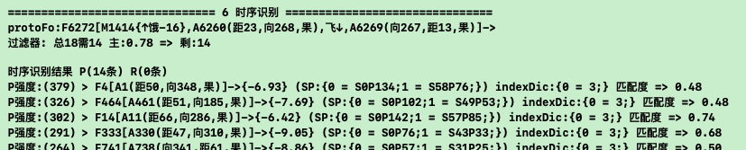
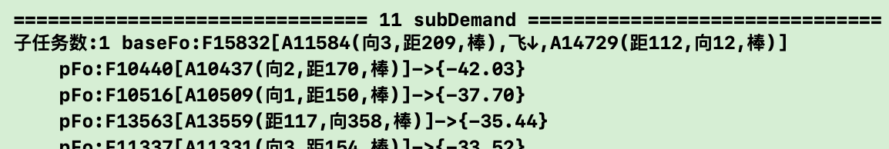
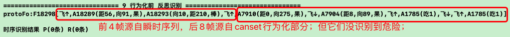

# 回测防撞训练继续觅食训练

***

<!-- TOC -->

- [回测防撞训练继续觅食训练](#回测防撞训练继续觅食训练)
  - [n30p01 回测防撞训练](#n30p01-回测防撞训练)
  - [n30p02 回测觅食训练](#n30p02-回测觅食训练)
  - [n30p03 回测觅食训练2](#n30p03-回测觅食训练2)
  - [n30p04 防撞觅食联合训练](#n30p04-防撞觅食联合训练)
  - [n30p05 迭代TCRefrection反思](#n30p05-迭代tcrefrection反思)
  - [n30p05 搬运训练](#n30p05-搬运训练)
  - [n30p07 多任务时,防撞任务有循环问题](#n30p07-多任务时防撞任务有循环问题)
  - [n30p08 优化思维想太多](#n30p08-优化思维想太多)

<!-- /TOC -->

***

## n30p01 回测防撞训练
`CreateTime 2023.06.03`

在n29末，识别二次过滤器测试ok了,本节主要回测下手训防撞,看效果如何;

| 30011 | 手动防撞训练 |
| --- | --- |
| 步骤1 | 强训防撞训练第1步 x 4轮 (多训练多看过各种木棒后,识别准确度更高); |
| 步骤2 | 认知模式手动躲开: `路中偏上,手动上躲成功3次`,`路中偏下,手动下躲成功3次`; |
| 步骤3 | 动物模式试错训练: `路中偏左上`,它应该能迁移过来方案,然后自行进行飞躲; |

```js
//30012-BUG: 碰撞检测误判BUG (明明没撞到,但却判断为撞到了)
//如下,真实情况是鸟是先第二次飞下,然后棒才从279->616的,所以:
//  1. 要么就是鸟飞动画后,没有触发取到真实的棒位置;
//  2. 要么就是鸟飞动画后,压根没触发frame变化,而是在木棒飞完后才触发;
//分析: 根据以下日志触发时间看,应该是第2种,但不一定,可以尝试把触发者打印出来,查下为什么会有这种情况;
//线索: 经调试,发现是鸟飞完动画结束回调未及时执行,而是等到下次主线程不卡时才执行,但不卡可能过了很久(如5s),以往的碰撞检测方法会认为鸟飞了5s,这么慢的飞与木棒撞了,但事实上,鸟压根只飞了0.15s;
//方案: 将动画开始时也回调记录一下动画时长,待完成回调真正执行时,无论它卡了多久,它都能判断鸟在0.15s时就已经飞完了 (只用这0.15s做碰撞检测);
190 [11:14:16:496      BirdGrowPage.m 587] 碰撞检测: 没撞到 棒(0 -> 0) 鸟(362,221 -> 362,221)
191 [11:14:16:497      BirdGrowPage.m 587] 碰撞检测: 没撞到 棒(0 -> 0) 鸟(362,221 -> 362,221)
196 [11:14:17:100      BirdGrowPage.m 587] 碰撞检测: 没撞到 棒(0 -> 48) 鸟(362,221 -> 362,221)
197 [11:14:17:101      BirdGrowPage.m 587] 碰撞检测: 没撞到 棒(48 -> 48) 鸟(362,221 -> 362,221)
435 [11:14:19:608      BirdGrowPage.m 587] 碰撞检测: 没撞到 棒(48 -> 279) 鸟(362,221 -> 362,251)//鸟第1次下飞 (没撞到)
440 [11:14:19:616      BirdGrowPage.m 587] 碰撞检测: 没撞到 棒(279 -> 279) 鸟(362,251 -> 362,251)
441 [11:14:19:617      BirdGrowPage.m 587] 碰撞检测: 没撞到 棒(279 -> 279) 鸟(362,251 -> 362,251)
711 [11:14:23:271      BirdGrowPage.m 587] 碰撞检测: 撞到了 棒(279 -> 616) 鸟(362,251 -> 362,281)//鸟第2次下飞 (明明没撞到,但却判断到撞到了)
//结果: 经修复后,上面BUG修复ok;
```

| 30013 | 二次过滤后末尾也偶尔有准确度低的结果 |
| --- | --- |
| 方案 | 直接把20%并最小4条,改成4条,不要20%了有时20%依然多,留太多也没啥用 `T`; |
| 结果 | 改成4条后,结果发现防撞第1步训练x4后,几乎很准确了 `T`; |

```js
//30014-源自brother迁移过来的canset虽然eff第1名,但实则压根不正确;
=============================== 1 rSolution ===============================
protoFo:F7052[A7050(向7,距124,棒)] 已有方案数:0
测下override过滤生效 (B-F): 原有3 - 过滤1 => 结果2 item场景(B):F4524[A4520(距105,向355,棒)] 取得候选数:2 转成候选模型数:1

0. {1 = S0P1;2 = S1P0;}:(分:1.00) H2N0:(分:1.00) B<F4524 F6996[A4520(距105,向355,棒),飞↑,A6883(距46,向328,棒)]>
1. {}:(分:0.50) H1N0:(分:1.00) I<F6062 F6902[A6059(向8,距115,棒),飞↓,A6899(向14,距97,棒)]>
2. {}:(分:0.50) H1N0:(分:1.00) I<F6143 F6903[A6138(向6,距137,棒),飞↓,A6899(向14,距97,棒)]>
3. {}:(分:0.50) H1N0:(分:1.00) I<F4426 F6906[A4423(向7,距143,棒),飞↓,A6899(向14,距97,棒)]>
4. {}:(分:0.50) H1N0:(分:1.00) I<F4577 F6908[A4571(向10,距105,棒),飞↓,A6899(向14,距97,棒)]>
5. {}:(分:0.50) H1N0:(分:1.00) B<F6062 F6902[A6059(向8,距115,棒),飞↓,A6899(向14,距97,棒)]>
6. {}:(分:0.50) H1N0:(分:1.00) B<F4577 F6908[A4571(向10,距105,棒),飞↓,A6899(向14,距97,棒)]>
7. {}:(分:0.50) H1N0:(分:1.00) B<F6062 F6902[A6059(向8,距115,棒),飞↓,A6899(向14,距97,棒)]>

* 说明: 如下日志,proto为向7,然后在solution决策后,最终优胜者为: 从向355brotherScene迁移来的F6996;
* 复现: `801x4,路中偏上,直投,可顺利躲开`, `然后再重启,路中偏下,直投,可复现如上问题,并错误的向上躲了`
* 思路: 如上日志,源自I的四条,全是正确的canset正确的飞下,只是源自Brother在eff上更优而已;
* 结果. 不用改,再训练多几下自己就好了,其实就是HN需要一个验证过程,在实际测试中,第一次上飞错方向被撞,第二次就改了;
* 共4次试错日志: 第1次偏上,上躲成功; 第2次偏下,上躲失败(错误飞上了); 第3次偏下,下躲成功(正确飞下了); 第4次偏下,下躲成功;
```

| 30015 | 又有一种碰撞误判的情况 |
| --- | --- |
| 说明 | 鸟先躲成功,等棒飞过去半秒后,鸟又飞回来了,被判断为撞到了,日志如下: |
|  | 1. 碰撞检测: 没撞到 棒(0 -> 0) 鸟(380,152 -> 380,152) from:鸟飞开始 |
|  | 2. 碰撞检测: 没撞到 棒(0 -> 91) 鸟(380,152 -> 380,122) from:鸟飞开始 |
|  | 3. 碰撞检测: 没撞到 棒(91 -> 658) 鸟(380,122 -> 380,123) from:鸟飞开始 |
|  | 4. 碰撞检测: 撞到了 棒(658 -> 658) 鸟(380,123 -> 380,123) from:鸟飞结束 |
| 分析 | 看起来这日志撞到时,完全没啥可疑的,鸟在380,123没动,棒在658也没动,是怎么撞到的呢? |
| 线索 | 经调试,发现有时totalTime=0导致woodTime也是0,在分10帧计算时,woodTime做分母,导致radioRect返回的Rect全是NaN |
|  | > 而在求Rect交集时,任何Rect与NaN的交集,全有结果 (非Null),所以导致判断有交集撞到了; |
| 方案 | 针对totalTime为0的情况,支持radioRect返回的一直是初始woodFrame就行,而不是返回NaN无效Rect; |
| 结果 | 改为分母为0时,得数为0,结果回测此bug好了 `T`; |

| 30016 | 继续回归防撞训练 |
| --- | --- |
| 说明 | 经30011步骤训练,`得到FZ80`; |

***

## n30p02 回测觅食训练
`CreateTime 2023.06.09`

在上节中,手训防撞训练FZ80上下躲都ok了,这节开始回归觅食训练;

| 30021 | 手动觅食训练: 训练步骤 |
| --- | --- |
| 1 | 学饿: (`饿,扔随机坚果,不吃,又饿` x 200轮) x 4次; |
| 2 | 学吃: 在认知模式下:`饿,指定方向附近扔坚果,手动飞过去,触发吃掉` x 方向上下各2次; |
| 3 | 试错: `饿,上扔坚果`,它应该能自行飞过去吃掉; |

| 30022 | 觅食训练中遇到识别二次过滤: 性能超慢问题 |
| --- | --- |
| 说明 | 在30021-1训练4次后,第2步训练时,发现识别二次过滤超慢 (超过6s); |
| 优化1 | 在二次过滤中取同级场景节点后,AIPort的防重性能差,优化后从5s提升到1.3s `T`; |
| 优化2 | 概念和时序的识别结果过多,导致本来数据量就大,读硬盘就卡死了,加上限制识别结果数最高20条 `T`; |
| 优化3 | 减少二次识别取得的同层场景数,原来20条能取到80条同层场景太多了,改为强度最强的上限30条吧 `T`; |
| 优化4 | 另外测得在觅食第1步训练4次后,概念识别算法也卡,看下优化下... `经测,有缓存后就不卡了,先不改 T`; |
| 优化5 | 经测在30021-1训练时,二次过滤算法越往后跑好像越卡cpu?比如不卡时执行arrIndex要0.04ms,卡时就2ms `T`; |
|  | 原因: 最后发现,是因为XGDebug的models太多了,导致变慢; |
|  | 方案: 将XGDebug的根据loopId新建的一堆model及时删除 (打印debug结果后,就直接删掉) `T`; |
| 结果 | 本节主要优化了训练过程中的性能问题 (主要集中在二次过滤代码),优化后 `转下表回归训练30021 T`; |

| 30023 | 训练至30021-第3步时,发现EFF总是null,然后也没看到TCEffect统计日志更新 |
| --- | --- |
| 日志 | 0. {}:(分:0.50) (null):(分:0.00) B<F2867 F3796[M1177{↑饿-16},A2864(距25,向290,果),A1191(吃1)]> |
| 说明 | 如上F3796,已经试错三次,但一直没有TCEffect更新HN值,然后打出来日志也一直是null; |
| 调试 | 后调试时,发现在未试错时(仅训练前两步),取得的也是null; |
| 线索 | 后发现,原因是在FoNode.updateConCanset()中,更新effect值的targetIndex全传了1,导致的; |
|  | 注: 取AIEffectStrong时sceneTarget是2,而存时全错传了1,导致下标错误取得effStrong全是nil; |
| 修复 | 将FoNode.updateConCanset()更新effect值的targetIndex改成正确的值 `T`; |

| 30024 | 训练至30021-第2步时,发现P反省太快来不及学吃; |
| --- | --- |
| 日志 | 预测: 感性IRT触发器新增等待反馈:0x7fc4a52a9b90 (F1948[M802{↑饿-16},A1945(距6,向94,果)] useTime:2.37) |
| 触发 | 刚上飞一次,就触发了: F1948[M802{↑饿-16},A1945(距6,向94,果)] spIndex:2 -> (坏) |
| 说明 | 如上日志,第2步训练时从预测到触发更饿,只有2.37s,根本来不急飞吃两下,就触发了(坏的结果); |
| 另外 | 因为每次飞都有飞后视觉,所以其实最终也有好的结果,只是它面向的都是飞一下就吃到的那些; |
|  | >>> 而这些最终好的结果,根本迁移不过来,因为完全场景不一样,一个是两步远左右的距离,一个是一步远左右的距离; |
| 修复 | 1.将饥饿感后,触发更饿的时间调长些 `T`;   2.将扔在附近的坚果更近一些,让它先能顺利学吃 `T`; |

| 30025 | 继续回测觅食训练-测得反思不通过问题 |
| --- | --- |
| 问题 | 训练前两步ok,第3步时,发现15条solution结果,在TCRefrection反思中全失败,日志如下: |
| 日志 | `F4507[M143{↑饿-16},A339(距13,向149,果),飞↑,A4500(向130,距0,果),A2893(吃1)] CUT:1 前匹配度0.66 无效率:1.00` |
|  | `反思评价结果:未通过 (解决任务奖励分21.9 Canset风险:-25.00 懒分:-1.0 = -4.1)` |
| 分析 | 任务pFos被解决奖励分为21到22分,`更饿的`场景风险为-25分,无论如何,风险都大于奖励,所以反思全不通过; |
| 思路 | 日志显示effect无效率为1,所以风险总是-25*1=-25,而无效率=1的原因,是计算effectScore时取得AIEffectStrong为nil导致; |
| 结果 | 所以,继续修复30023的问题,等30023修复了,这里AIEffectStrong不为nil了,本文自然就反思通过了 `转30023 T`; |

```c
30026: 30023修复后,训练至第3步时,明明solution有许多结果,反思也通过了,但却打出了`无计可施`;
0. {}:(分:0.50) H1N0:(分:1.00) I<F790 F4497[M328{↑饿-16},A787(距27,向127,果),飞↑,A4488(距0,向225,果),A2893(吃1)]>
1. {}:(分:0.50) H1N0:(分:1.00) I<F1056 F4494[M436{↑饿-16},A1053(距20,向110,果),飞↑,A4488(距0,向225,果),A2893(吃1)]>
2. {}:(分:0.50) H1N0:(分:1.00) I<F1056 F4514[M436{↑饿-16},A1053(距20,向110,果),飞↑,A4508(距0,向186,果),A2893(吃1)]>
3. {}:(分:0.50) H1N0:(分:1.00) B<F790 F4497[M328{↑饿-16},A787(距27,向127,果),飞↑,A4488(距0,向225,果),A2893(吃1)]>
4. {}:(分:0.50) H1N0:(分:1.00) B<F790 F4497[M328{↑饿-16},A787(距27,向127,果),飞↑,A4488(距0,向225,果),A2893(吃1)]>
5. {}:(分:0.50) H1N0:(分:1.00) B<F342 F4495[M143{↑饿-16},A339(距13,向149,果),飞↑,A4488(距0,向225,果),A2893(吃1)]>
6. {}:(分:0.50) H1N0:(分:1.00) B<F1056 F4494[M436{↑饿-16},A1053(距20,向110,果),飞↑,A4488(距0,向225,果),A2893(吃1)]>
7. {}:(分:0.50) H1N0:(分:1.00) B<F1056 F4514[M436{↑饿-16},A1053(距20,向110,果),飞↑,A4508(距0,向186,果),A2893(吃1)]>
8. {}:(分:0.50) H1N0:(分:1.00) B<F1056 F4494[M436{↑饿-16},A1053(距20,向110,果),飞↑,A4488(距0,向225,果),A2893(吃1)]>
9. {}:(分:0.50) H1N0:(分:1.00) B<F1056 F4514[M436{↑饿-16},A1053(距20,向110,果),飞↑,A4508(距0,向186,果),A2893(吃1)]>

=============================== 2 TCRefrection反思 ============================
F4497[M328{↑饿-16},A787(距27,向127,果),飞↑,A4488(距0,向225,果),A2893(吃1)] CUT:1
反思评价结果:已通过 (解决任务奖励分22.6 Canset风险:-0.00 懒分:-1.0 = 21.6)
>>>>>> rSolution 无计可施

调试: 经调试,发现fo中的mv元素被判断为空概念了 (因为原来mv的port.header全是由nil生成的,而不是由content_ps);
原因: 而在TCRealact中,空概念会从它的具象重新找一个canset替换返回,而mv并不是空概念,它也没具象指向啥canset,所以就全替换成了nil,导致报无计可施 (参考29069-todo8);
修复: 将mv的delta_p和urgent_p当成mv的content_ps去生成header,这样就不会被判断为空概念 `T`;
总结: 本节误判mv为空概念导致觅食训练明明有解却在TCRealact中替换成了nil,导致未行为化的问题;
```

本节性能优化,以及修复了决策过程中的一些跑不顺的BUG,下节继续回测;

***

## n30p03 回测觅食训练2
`CreateTime 2023.06.19`

| 30031 | 第3步来不及吃到,更饿就发生了 |
| --- | --- |
| 说明 | 根据30021训练至第3步,发现8s后更饿已触发,9s后才吃到坚果; |
| 猜测1 | 既然8s没来的急,要不改成更久时间试下; |
|  | 问题: 可以是可以调长些,让它有足够多飞几次的时间,但这样第1步训练就该很慢了 (毕竟每训练一轮都得等很久); |
|  | 结果: 最后发现慢的原因是因为首次识别没缓存,时间不用调长; |
| 猜测2 | 要不就是把中途发生的事简化一下,因为中途发生太多识别等导致9s后才吃到; |
|  | 分析: 可试下,如果吃前吃后有视觉,可废除下; |
|  | 结果: 吃前后有视觉也没啥影响,何况看起来中途并没有什么可简化的; |
| 猜测3 | 考虑每8s更饿一下,直到吃到为止,这样就不限时间内了; |
|  | 问题: 即使后面又吃到了,前面的那个canset的effect也已经计为eff-1了 (即前面明明有效的一轮错误计负了); |
| 原因 | 经调试,压根就是首次识别因为没缓存太慢导致的,首次坚果的识别竟然用了5s; |
| 结果 | 调整训练步骤,在正式试错前,先把缓存加载上,即可 `转30032-3 T`; |

| 30032 | 手动觅食训练: 训练步骤 |
| --- | --- |
| 1 | 学饿: (`饿,扔随机坚果,不吃,又饿` x 200轮) x 4次; |
| 2 | 学吃: 在认知模式下:`饿,指定方向附近扔坚果,手动飞过去,触发吃掉` x 方向上下各2次; |
| 3.1 | 缓存: 先在认知模式下,`上扔坚果,模拟重启`, (识别下,以加载缓存); |
| 3.2 | 试错: 然后动物模式下: `饿,上扔坚果`x2,`饿,下扔坚果`x2,它应能自行飞过去吃掉; |
| 4 | 扔远点试下,看能不能连续飞觅食成功; |
| 结果1 | 经前3步训练,得到FZ81,在第3步上下各两次试错,都觅食成功了; |
| 结果2 | 在FZ81基础上,尝试第4步(两飞距离远),连续飞ok,存为`20230619连续飞吃到坚果.mov`; |

本节觅食训练大致ok,并存为FZ81;

***

## n30p04 防撞觅食联合训练
`CreateTime 2023.06.19`

| 30041 | 训练规划 |
| --- | --- |
| 简介 | 在学会防撞和觅食的基础上,能够学会: `有车时,不飞过去吃`; |
| 注 | 此训练只有`上下躲和上下飞吃`两个方向,别的方向暂未参与到此训练测试中; |
| 第1步 | 认知模式: 学饿(30032-1) |
| 第2步 | 认知模式: 学撞(30011-1) |
| 第3步 | 认知模式: 学吃(30032-2) |
| 第4步 | 认知模式: 学躲(30011-2) |
| 第5步 | 动物模式: 自躲试错: `路中偏上/偏下(左中右都试下)` x N,它应该能迁移过来方案,然后自行进行飞躲; |
| 第6步 | 动物模式: 自吃试错: 先在认知模式识别下坚果加载缓存,然后`饿,上扔坚果` x N,`饿,下扔坚果`x N,自行飞吃; |
| 第7步 | 鸟在底部出生,饥饿,坚果扔到顶上,鸟在自行向上觅食过程中,再扔木棒,鸟会怕疼并折回 (测在危险时,不飞过去吃); |
| 记录1 | 目前为止，训练到第5步一切ok; |
| 记录2 | BUG_有时第6步连续飞时,飞到坚果上又立马飞超过了,也输出吃动画了,但就是没吃到; |
|  | > 修复: 因为动画执行完后,又不在坚果处了,改为只要吃就吃到,而不是动画后才正式算吃 `T`; |
| 记录3 | BUG_第6步时,与上例类似情况,飞到又立马飞超过了,有时压根无法触发吃; |
|  | > 原因: 现在是根据飞后位置rect来判断是否能吃到的,但有连续飞时,可能会连续飞的一下闪过坚果所在; |
|  | > 分析: 飞动画执行完成后,可以根据飞过的轨迹来判断是否有路过坚果,只要路过了就吃掉; |
|  | > 思路: 和碰撞检测算法类似,用分帧来模拟轨迹,判断有没路过坚果 (现在都是直飞,有斜着,分帧都可支持); |
|  | > 方案: 判断下飞前后的距离,比如距离为42,就分42帧来判断,看下复用碰撞检测算法 `T`; |
| 记录4 | 训练到第6步完成,第6步试错几乎全自行成功吃到坚果; |
| 记录5 | 训练到第7步完成,第7步训练ok,得到`FZ82`和`20230624想吃但怕撞.mov`; |

| 30042 | 进一步训练计划 |
| --- | --- |
| 1 | 试下在安全地带的坚果,即使有车也敢吃; |
|  | 失败: 因为即使安全地带,看到木棒也有些许害怕,它会影响到小鸟向着躲的方向飞下; |
|  | 原因: 关键在于等木棒飞走安全后,小鸟应该能折回才对,但显然目前的饥饿不够持续,等安全后,饥饿状态也没了; |
|  | 解决: 只有饥饿状态更加可持续 (比如持续性的5s一次触发,直到吃到为止),这样才可以让小鸟有足够动机折回 `转2`; |
| 2 | 试下在危险地带的坚果,在安全后能飞过去吃 (需要支持循环变饿,即持续饥饿状态); |
|  | todo1: 支持持续饿感 `T`; |
|  | todo2: 在饥饿时直接触发一下视觉,而不是必须扔一下坚果,因为循环持续的饥饿状态,总不能每循环一次就扔一个 `T`; |
|  | todo3: 因为饿后会触发一次视觉,并且改成了持续饿感,学饿步骤改成:`学饿: 认知模式(扔随机坚果,饿 x 200轮) x 4次;` `T` |
|  | >>> 回滚: 此训练步骤改动回滚回原步骤`饿,果`,因为即使初次饿后有视觉,也因当时无果,而看不到东西 `转30043-方案`; |
|  | todo4: 第2步学吃训练,可分两种训练,第1种是`坚果,飞,吃`,第2种是`坚果,饿,飞,吃` `废弃,变更为todo5 T`; |
|  | >>> 说明: 其中第1种,用于解决识别pFo为`[果]->{饿}`的问题,第2种用于解决识别pFo为`[果,饿]->{更饿}`的问题; |
|  | >>> 问题: 第1种pFo其实还没饿,它只是为了避免饿,但可能吃后再饿呢导致无效,也有可能吃撑死毕竟并没在解决饥饿问题; |
|  | >>> 废弃: 所以第1种学吃训练废弃 `转todo5,改为仅学吃第2种`; |
|  | todo5: 第2步学吃训练: `饿,坚果,飞,吃` `T`; |
| 3 | 30042-2改后,此处记录回训; |
|  | 回训1: 用新的`学饿`来训练觅食,识别ok,然后训练第2,3步,最终第3步时上下连续吃都ok `T`; |
|  | 回训2: 在回训1的基础上,加上`右吃`,然后再进一步训练`多次飞并转向`吃 `T`; |
|  | >>> 结果: 坚果在右上角时,先上飞,再右飞是ok的,但第1次飞和第2次飞之间总是停顿8秒 `转30043`; |
|  | 回训3: 在以上基础上,训练防撞,并最终可以: `危险地带坚果,等木棒走后安全了再飞过去吃` `转30044-8`; |

| 30043 | BUG_变向觅食的停顿问题 |
| --- | --- |
| 说明1 | 在上表回训2中,比如右上的坚果,觅食飞上后,紧跟不右飞,会等下次8秒后饥饿触发时,才会右飞问题 |
| 说明2 | 其实不用变向,只要是距离远点,连续飞才能吃到的,都会有此BUG; |
| 分析 | 第1次飞的pFo起因是: `[果,饿]->{更饿}`,解决方案是: `[坚果,饿,飞,吃]`; |
|  | 第2次不动时的起因是: `[果]->{饿}`,解决方案是: `无计可施`; |
| 思路 | 看下第1次飞后,能不能识别到[饿,果]->{更饿},然后为它训练解决方案,即可让鸟不等就第2次飞; |
| 调试 |  |
| 说明 | 上图为,需要连续飞才能吃到的情况时,在中途停顿前的最后一条识别日志; |
|  | 解读: 图中可见,鸟已经下飞一次,protoFo为[饿,果,下飞,果],此时应该识别到它还会再饿的pFo才对; |
|  | 问题: 但很明显,图中并未识别到`[饿,果]->再饿`之类的pFo,导致未能针对目前场景立刻继续飞觅食; |
|  | 思路: 看能不能优化下训练步骤,让它能够在这种情况下识别到`[饿,果]->再饿`; |
| 方案 | 看第1步学饿训练改回原来的: `饿,果` (现在是`果,饿`),然后回测下能不能让它容易识别到 `T`; |
|  | >> 正据: 在30042-todo3,改成了"果,饿",但本方案与30042-todo3-回滚相互呼应,可改后训练试下; |
| 结果 | 按着此方案改后,重新训练学饿,并看下此BUG还存在不 `转30044-进行训练`; |
| 回测 | 回测结果: 经30044训练得到FZ83,其可持续识别到[饿,果]->再饿了,也不再有停顿问题,可以直接连续飞吃了 `T`; |

| 30044 | 经30043调整后和改了持续饿感,重新进行手动觅食训练: 训练步骤 (参考30032) |
| --- | --- |
| 注 | 新电脑硬盘性能更好,不用在第3步前加载缓存了,并且现在是持续饿感了,即使第1下饥饿失败一下也没啥; |
| 注2 | 本表前4步为觅食训练,后3步为防撞训练; |
| 1 | 学饿: (`饿(持续饿感3次),扔随机坚果,不吃,又饿` x 200轮) x 4次; |
| 2 | 学吃: 认知模式:`饿,指定方向附近扔坚果,手动飞过去,触发吃掉` x 上下右各2次; |
| 3 | 试错: 动物模式:`饿,扔坚果` x 上下右各3次 (因为是持续饿感,前一两次它会有试错然后正确飞吃,第3次直接能正确飞吃) |
| 4 | 连续飞吃: 动物模式: `扔远点试下(直方向,斜方向各 x 3次),看能不能连续飞觅食成功`; |
| 小结 | 经训练得到FZ83,四步训练都ok顺利; |
| 5 | 强训防撞训练第1步 x 4轮 (多训练多看过各种木棒后,识别准确度更高) (参考30011-1); |
| 6 | 认知模式手动躲开: `路中偏上,手动上躲成功3次`,`路中偏下,手动下躲成功3次` (参考30011-2); |
| 7 | 动物模式试错训练: `路中偏左中右` x 上下各N次,它应该能迁移过来方案,越来越准确的自行飞躲 (参考30011-3); |
| 小结 | 经训练得到FZ83-5,83-6,83-7,三步训练都ok顺利; |
| 8 | 危险坚果安全后吃: `出生路下方,饥饿,路上方扔坚果,开始觅食时,扔木棒`,小鸟应能等木棒走后安全了再飞过去吃; |
| BUG1 | 中途BUG: 发现痛感mv才-9,所以在竞争中,宁可忍着疼也要冲过去吃坚果,将痛感增强后ok `T`; |
| 问题2 | 第8步,看到木棒后,已经决策输出行为折回防撞了先,不过当时思维想了好多东西,导致很卡,还是被撞到了; |
|  | 调试: 在看到木棒后怕疼,飞下躲了一下,但紧跟着在反省后,立马又TCScore然后任务竞争,又激活了饥饿任务,然后就又向上飞了;相当于原地下飞又上飞... |
|  | 所以当时并不是在卡,而是确实在思维循环处理两个任务,只是疼任务和饿任务的行为洽好相反(矛盾) (猜想: 导致二者不断竞争替换着而已?); |
|  | 分析: 看是否在饥饿行为输出前,反思一下,可能会导致碰撞的问题,然后阻止; |
|  | 即: 将当前反思算法迭代一下,支持多任务间的综合评价,避免捡了芝麻丢了西瓜的事 `转n30p05`; |
| 追加 | 在3005b后,迭代了父子任务的反思,并且修测修了一些BUG,训练得到FZ83 `转3005b`; |

总结: 本节尝试防撞和觅食联合训练,迭代了`连续饿感`(参考30042),修复了连续飞的停顿问题(参考30043),修复了饿价值感大于疼的问题(30044-BUG1),但最终测得多任务间反复激活左右摇摆导致捡了芝麻丢了西瓜的问题(参考30044-问题2),经分析此问题转下节继续解决;

***

## n30p05 迭代TCRefrection反思
`CreateTime 2023.07.03`

在30044-问题2中,遇到反思算法比较单调(仅支持当前canset输出前的反思),但对别的任务有什么反面影响没有做处理 (即可能导致捡了芝麻丢了西瓜的事,比如30044-问题2中为了吃而冲过去被撞的实例);

| 30051 | 任务树反思-解决方案前期分析 |
| --- | --- |
| 推进1 | **先回顾下现有反馈反思识别的代码:** |
|  | 思路: 查下原来的反思识别的代码,看能不能用子任务综合评分来解决下此问题,现子任务代码流程及日志如下; |
|  | >>> feedbackTOR(反馈判断)->feedbackRegroup(重组)->feedbackRecognition(识别)->feedbackDemand(子任务) |
|  |  |
|  | 说明: 现反馈反思太简陋,如上图根据一个疼pFo,识别到另外几个疼pFo,嵌套为子任务其实在原地打转 (HE循环禁止原地打转); |
|  | 方案: 考虑把反馈识别改成从cansets中进行识别,这样更符合现架构做法; |
|  | 缺陷: 反馈反思识别主要面向的是反馈后,触发的反思,而目前我们的问题应该是在行为化之前的反思 `所以,转推进2`; |
| 推进2 | **在行为化前反思TCRefrection集合cansets识别来解决当前问题;** |
| 结果 | 本表经过推进1和推进2的分析,已经得出大致解决此问题的清晰思路,具体的方案制定转下表 `转30052`; |

| 30052 | 任务树反思-方案制定与实践规划 |
| --- | --- |
| 简介 | 接上表,我们需要在`行为化输出前`,通过反思,来实现多任务间的互相影响判断,方案制定如下: |
| 方案 | **输出前在TCRefrection中,新写个:判断当前任务的canset如果执行,会对任务树中的别的任务产生什么影响** |
|  | >>> 如果不良影响大,则反思不通过,如果影响不大则反思通过; |
| 实践 | **将当前A任务canset已发生与别的B任务的pFo未发生进行拼接,在B.cansets中识别,以判断A对B任务产生的影响**; |
| todo1 | TCRefrection中新写一个多任务间影响的反思方法,叫:refrection4DemandTree(); |
| todo2 | 将A行为化canset中cutIndex之后,与B任务pFo的cutIndex之前,拼接起来; |
| todo3 | 然后到B任务的cansets中进行识别,看下识别结果的spEff值; |
| todo4 | 根据B任务的spEff值,乘以B任务的mv值,得出A任务如果这么做对B任务带来的影响; |
| 结果 | 反思识别不能从cansets中识别,所以本表代码实践中止`见30053代码段`,然后新的方案`转30054`; |

```c
# 30053代码段 (此代码段是30052的todolist完成中,分析识别算法该怎么写,然后却发现30052不可行的问题,并转30054重新思考解决方案);
//在写30052之前,先分析下: 识别算法怎么写
//  1. 这里不会为regroup生成fo;
//  2. 看下这里的regroup和oldCansets之间怎么判断全含?是哪个mIsC哪个;

//  3. 其实pFo的front部分不用识别,它已发生,且在cansets中本来就有相对应的满足;
//  4. 而back部分,mIsC怎么判断,通过实例来分析:
//      > 比如:pFo为疼,cansets其中一条为:车撞到会疼;
//              疑问: 不解决问题的canset似乎不会生成吧?
//              分析: 有可能迁移来,但在无效后再判为否,但即使它无效未必是因为它的锅,也许仅仅是没用而已,但不至于是负作用 (0分不是负分);
//              结论: 即,判断它是否为负,还是应该在外围进行识别预测价值来决定,而不是在cansets中识别;
//      > 而当前任务的解决方案就是飞到危险地带吃,多任务树反思后发现,吃没疼重要,所以反思不通过;

//      > 再如:pFo为疼,cansets其中一条为:吃药不解决饥饿问题;
//              疑问: 这里反馈似乎未涉及到吃药会苦的介入?
//              分析: 它判断不到苦,可能药就直接吃了,吃了后再反馈又能如何?也是迟了;
//              结论: 即,判断它是否苦,应该放到外转进行识别预测价值来决定,而在cansets中识别是不可能实现的;
//      > 而当前任务的解决方案就是吃药,多任务树反思后发现,吃药治病比饥饿重要,所以反思通过;

//  5. 第4的疑问可见,从cansets进行返回,并不可靠,建议在拼接前后部分后,重新进行识别,然后制定子任务;
//  6. 建议子任务后,再看能不能通过按交通灯按钮,将绿灯改成红灯,让车停下来?
//  7. 如果子任务无解 (即无法改变交通灯),则中止吃的任务 (因为比起饿更怕疼);
//  8. 说白了,就是反思识别提前呗,提前到行为化之前...别的啥也不用改;

//所以: 查下如果将反思识别前置,它能不能在飞之前有效打断?如果能,那这里就不用写了,中止;
//结果: 30052中止后,转30054重新想个方案,解决反思识别的问题;
```

**小结: 以上是针对任务树反思来解决多任务间互相影响的问题(但最终否掉中止了),而以下开始转向用旧有反思子任务来解决这一问题;**

| 30054 | 新方案: 用子任务来解决多任务互相影响的问题 |
| --- | --- |
| 方案 | 把以前的反馈反思识别改一改,前置一下,让它在行为化输出前就完成反思识别,而不是反馈后; |
| 改动 | 然后看用不用改成,拼后段,而不是只拼反馈那一帧 (毕竟改后就没反馈了); |
| 另外 | 分析下,反馈后是不是不用反思识别了? |
|  | 1. 应该不用了,因为现在的regroupFo是由瞬时记忆序列发生的四帧,加上当前canset要行为化的几帧组成; |
|  | 2. 而如果反馈了新的(也会存到瞬时序列里),然后下次行为化之前的反思,它就又可以调用反思识别了; |
|  | 3. 但这里有个要求,就是我们的反思识别,应该在TCAction调用,而不是TCSolution输出之前; |
|  | 结果: 这样就能保证第2条能达成; |
| todo1 | 将瞬时记忆中最后一个protoFo的内容做为前半部分 `T`; |
| todo2 | 将当前actionFo即将行为化的部分(actionIndex到targetIndex之间),做为后半部分 `T`; |
| todo3 | 将前后两个部分生成新的regroupFo `T`; |
| todo4 | 并进行识别(复用时序识别算法) `T`; |
| todo5 | 反思识别的pFo结果生成子任务 `T`; |
| todo6 | 对反思识别生成子任务后的"反思结果"进行判断 (反思通过 = 当前任务迫切度 > 最严重的子任务迫切度) `T`; |
| todo7 | 反思通过时继续行为化,不通过时转由TCScore来自行决定下轮循环竞争是否先解决子任务还是转向别的任务 `T`; |

| 30055 | 回测得死循环BUG |
| --- | --- |
| 调试 | 经调试流程为: `激活父任务->反思不通过并得到子任务->又激活父任务->又反思不通过并得到子任务`; |
| 原因 | 经查原因为,现在TCPlan中激活子任务开关关着,导致子任务永远不会被激活,导致了死循环; |
| 结果 | 把子任务决策开关废弃掉直接 `T`; |

```py
30056: 问题-action反思仅拼接了行为化后段,但瞬时记忆的前段即是0条?
// =============================== 9 行为化Fo ===============================
// 第 3/5 个,时序:F7787[M451{↑饿-16},A1213(距40,向86,果),飞↑,A7781(向157,距0,果),A1785(吃1)]
// =============================== 9 行为化前 反思识别 ===============================
// protoFo:F18026[飞↑,A7781(向157,距0,果),A1785(吃1)]
思路: 按道理来说,这里已经是2283行日志,前面也有看到`果,果,飞,果,棒,飞`,但为什么它们没在瞬时序列里呢?
原因: 当行为输出时,是不会识别的,也不会生成protoFo,所以不能用最后一帧的protoFo,而是必须各帧收集 (mv输入时应该也是这样);
修复: 经测各帧收集一样能取到所有protoFo的order,所以改成各帧收集后ok了 `T`;
```

| 30057 | 觅食方案在刚看到木棒的情况下,未能反思到危险的问题 |
| --- | --- |
| 日志 |  |
| 线索 | 如下两种日志,同样ass是A13310,在proto中也都是A18745,但前者全含,后者非全含; |
| 1普通 | =============================== 8 时序识别 =============================== |
|  | protoFo:F18747[A18729(向88,距66,果),飞↑,A18741(距56,向88,果),A18745(向11,距193,棒)]-> |
|  | ------------------------ 时序全含检查 ------------------------ |
|  | ass:F13313[A13310(向355,距152,棒)]->M263{↑疼-81} |
|  | 时序识别: item有效+1 |
|  | 时序识别itemSUCCESS 匹配度:0.789034 F13313[A13310(向355,距152,棒)]->M263{↑疼-81} |
| 2反思 | =============================== 12 行为化前 反思识别 =============================== |
|  | regroupFo:F18760[A18745(向11,距193,棒),飞↑,A18754(距123,向167,棒),A18755(距46,向88,果),A1785(吃1)] |
|  | ------------------------ 时序全含检查 ------------------------ |
|  | ass:F13313[A13310(向355,距152,棒)]->M263{↑疼-81} |
|  | 末帧时,找不着则联想时就:有BUG === 非末帧时,则ass未在proto中找到:非全含 |
| 说明 | 上面日志是觅食过程中扔木棒,可以看到,2反思中,明明危险却判断为非全含,导致识别不到危险; |
| 原因 | 因为时序全含要求末帧必含,而regroupFo的末帧未能全含,导致整体全含失败; |
| 修复 | 在regroupFo调用时序识别时,不要求末帧必含,修复后ok了,并回测因为危险觅食反思不通过了 `T`; |

| 30058 | 在30057示图中,明明木棒后下飞了下,但瞬时记忆却没有的问题 |
| --- | --- |
| 调试 | 当时的情况是,先觅食上飞,然后看到木棒,再然后又下飞防撞; |
| 分析 | 但上飞后,未立马反馈上飞(在飞动画0.2秒后才会反馈),而此间又看到了坚果,然后把觅食的上飞反馈给了防撞的下飞 |
| 思路1 | [TCScore score]调用处太多,导致循环有点乱 |
| 思路2 | 要不在飞执行后立马反馈吧,不然主线程一卡,它0.2秒根本反馈不了,要等到下次主线程卡过来才会执行; |
|  | > 解释: 因为HE目前的虚拟世界和智能系统是同一个设备执行的,二者受互卡影响; |

| 30059 | 30057反思识别修复正常执行后,变的很卡 |
| --- | --- |
| 调试 | 经调试,行为化前反思识别没有二次过滤,经常识别到20条结果,再到rSolution一执行往往跑出5000循环,导致卡慢; |
| 思路 | 给行为化前反思识别写个二次过滤器,只保留最准确的2到4条,不然rSolution顶不住; |
|  | 1. 二次过滤,要保证它的mv多样性 (避免留下几条全是饿没疼); |
|  | 2. 竞争因子: 既然是反思,应该按每条pFo的迫切度排序 (spScore * mvScore); |
| 方案 | 根据以上思路,写二次行为化反思识别过滤器: 根据mv类型分组,然后过滤出每组迫切度最强的一条; |
| 回测 | 回测不通过-因为用迫切度排序不合理,因为这样总是怕左怕右,一步都不敢飞了; |
|  | 比如: 在实测时遇到: 觅食,反思时预测自己飞一下后依然吃不到,还会饿,然后又取了最迫切的; |
|  | 问题: 成了发现飞后会导致更饿,所以就反思不通过,不飞了,所以调整方案如下; |
| 方案2 | 可调整试下改为matchPFos排序方式不变,仅截取每种mv类型的前3条,看能不即能不彻底改变原有工作,又不至于太多条卡顿; |
| 结果 | 改后,卡顿问题倒是解决了 `T 但测得反思仍然不太稳定,有时通过有时不能,转3005a`; |

| 3005a | 经测试反思同样是饥饿又反思到饥饿问题,但有时能通过(占30%),有时无法通过(占70%),查下为什么; |
| --- | --- |
| 方案1 | 用简单减权的方式,让子任务的迫切度评分x60%,以使HE有更强的连续性行为化意愿; |
|  | 说明: 此方案实践简单有效,先做了再说 `实践转3005b`; |
|  | 比如: 我们赶远路,总不能走一步就想一下下一步会不会更累一点点,然后就因为这一点点就停下; |
| 举例 | 比如我要饿了要找吃的必须走到三百米外饭店,但我走路过程必然会更饿,难道怕更饿,我就不走了么? |
|  | 分析: 现在饿了(-15),如果不走会极度饿(-99),但如果走了虽然会更饿一些(-23)但可以吃饱; |
|  | 思路1: 即,我们不会因为-23<-15就不去饭店,而是因为-23>-99所以我们会去饭店; |
|  | 思路2: 如果不出门,不会变的更饿呢(比如家里有零食可顶下先),那么我们可能放弃去饭店; |
| 流程 | 根据思路1和思路2,得出此例流程如下: |
|  | 1. 饿了(-15) |
|  | 2. 去饭店更饿(-23) |
|  | 3. 所以不去饭店(反思不通过) |
|  | 4. 这样下去会更饿(-99,新的识别和任务) |
|  | 5. 去饭店更饿(-23),>-99,所以去饭店(反思通过); |
| 原因 | 现在饥饿并不会越来越饿,而仅仅是连续饿感而已,导致就像我现在持续-15的饿,去吃一下会-23,我就宁可不去; |
| 方案2 | 应该对饿感进行递增,为防止越来越饿,它才会反思通过去吃 `先不做,等需求更明确再做`; |
|  | 说明: 这种做法无疑是略复杂,但它是必要的; |
|  | 比如: 我们赶远路,累了就歇歇,不累了就再次出发,越来越累的机制在这就很重要 |
| 决择 | 方案1和方案2可同时推进,方案1用于平时反思时pk双方差异不大时,而方案2用于pk双方差异明显时能够继续推进; |
| 结果 | 本节提出了方案1和方案2,其中方案1现在就可以做,方案2可先不做,等到需求更明确时再做 `方案1实践转3005b`; |

| 3005b | 3005a方案1-实践 |
| --- | --- |
| 修复 | 按着3005a-方案1修复后,发现父子任务的反思符合预期了,该通过时可以立马行为化,该不通过时也可以拦截不行为化; |
| 回训 | 继续训练30044-8,顺利得到`20230715-觅食途中遇险躲等安全再去吃.mov`,并打包`FZ83`记忆快照; |

总结:
1. 本节3005a方案2中提出了饿感递增的需求,但这里先不做,后面需求明确了再说;
2. 本节将action反思识别前置到行为化前执行 (参考30054);
3. 并测试修复了期间的几个BUG(30055到3005b),并最终训练FZ83顺利(3005b);

***

## n30p05 搬运训练
`CreateTime 2023.06.29`

以上已做好: 防撞训练,觅食训练,二者联合训练,本文开始做搬运训练;

| 30051 | 搬运训练-初步分析 |
| --- | --- |
| todo1 | demo支持输出搬运动作,将坚果移动到某方向指定距离; |
| todo2 | demo支持木棒能把坚果压破皮机制; |

***

## n30p07 多任务时,防撞任务有循环问题
`CreateTime 2023.07.15`

| 30071 | 多任务时,防撞任务有循环问题 |
| --- | --- |
| 说明 | 发现第1任务为觅食,第2任务为防撞时,明明木棒都飞走了,它还在躲好几次; |
| 怀疑 | 怀疑是子任务在循环求解,通过父任务失效时,子任务跟着失效应该能解决 `怀疑不成立,因为压根和子任务无关 T`; |
| 调试 | 11931 [17:53:47:354      AIVisionAlgs.m  58] 视觉目标 [方向:148 距离:105 高:100 皮:0] |
|  | 说明: 如上日志,在11931行,木棒早就不知道飞哪去了,它竟然还看到距105向148的木棒,这个方向应该是木棒的动画结尾位置 |
|  | 问题: 导致它不断看到木棒,感到一丝危险,所以一直这么循环着; |
|  | 线索: 先查下木棒动画结束后,为什么视觉还能看到; |
| 方案 | 将木棒动画结束后,改为alpha=0后,设为不可见状态 (直接HEView所有不可见时不输入到inputR视觉输入) `T`; |

***

## n30p08 优化思维想太多
`CreateTime 2023.07.16`

发现思维想太多了,一直不断的执行,导致和UI主线程互卡的很,TC执行太多卡了,本节分析解决;

| 30081 | 思维想太多问题: TCScore执行频繁 |
| --- | --- |
| 方案1 | 看能不能每次任务输出行为化后,直接销毁,而不是等下帧继续推进; |
|  | > 不太好,毕竟我们需要工作记忆有持续性的指导,这不可妄改 `否决`; |
| 方案2 | TO不断的循环,跑到行为输出后,立马再次回到TCScore开始下轮循环 `转30084`; |

| 30082 | 思维想太多问题: 支持任务间反思 |
| --- | --- |
| 方案 | 尤其是次要任务向重要任务的反思,需要支持下; |
| 说明 | 当主要任务的actYes输出行为时,就不要干扰它,说白了,次要任务不影响第一任务的执行时,才会行为化次要任务; |
|  | 例1: 我在等人,如果次要任务想打个电话,对等人无干扰那就打; |
|  | 例2: 我在等人,如果次要任务是去买水喝,对等人有干扰就不买; |
| 结果 | 以后再支持,现在action反思已经够用了 `暂不做`; |

| 30083 | 思维想太多问题: 思维异步执行 |
| --- | --- |
| 方案 | 思维和Demo都在主线程,看能不能把思维异步下,从根源上解决二者互卡的问题 (以前试过失败了,这次更坚决试下); |
| 遇坑 | 异步执行后,很多模块(如概念识别)等非常耗时 `电脑当时在卡,电脑cpu不卡后自然就好了 T`; |
| todo1 | 将TC的三个commit方法和AITime的触发器,都切换到TC线程 `T`; |
| todo2 | 封装线程安全的AsyncMutableArray,避免多线程操作闪退 (DemandManager的loopCache数组等) `T`; |
| todo3 | AsyncMutableArray支持forEash方法,避免循环里面的array内容时有多线程操作闪退问题 `T`; |
| todo4 | tc线程由串改为并行,因为外界随时会输入信号,不应排队 (如果TC在忙,可在某些模块因优先级不足而中断,但不该排队) `T` |
| 回测 | 问题1. todo4的TC线程用并行,问题非常大,改为并行后,各种提前销毁队列,各种全局array操作闪退都出现了; |
|  | 问题2. TC并不应该并行,随时信号输入也要看TC是否忙状态,忙是处理不过来的 (可以闲时才接受信号); |
|  | 问题3. 现在视觉比较少,还不至于卡队列,暂时可不处理忙时不接受新输入的问题; |
| 结果 | 本表TC线程写完了 `T` 但回测问题转由下节处理 `转30084`; |

| 30084 | TCScore执行频繁问题-TO间隔10ms跑循环 |
| --- | --- |
| TI线程 | 在30083-todo4中,TI线程是并行跑的,但应改为串行 (参考30083-回测问题); |
|  | 反例: 如果边看到危险,边感受疼,如果危险处理慢,就成了先疼后看到危险了; |
|  | 帧数: 比如视觉场景比较复杂,可以将来不及的队列及时清除,此时可能一秒就看到3帧; |
| TO线程 | TO行为化也应该串行,因为同时只能解决一个任务,避免鬼搐 (如下例子); |
|  | 反例: 边起床工作,边躺下睡觉,二者同步进行,或者上步没走完下步又来了,两步紧跟着进行; |
| 分析 | 其实无论是TI还是TO,在忙时可以直接跳过,只有闲时,才可以增加到队列中; |
| 重点 | **TI和TO各一个串行线程,TI可以闲时队列才接受任务(暂不需要支持),TO可以上轮结束后10ms开始下轮;** |
| 方案 | 即,TO可以一直在TCScore和TCOut间循环,上次行为化执行完毕后,过10ms就开始下一次TO; |
|  | 优点: 从根本上解决了TCScore调用混乱的问题; |

30085: 线程小知识总结tips
1. 并行线程在执行完时会销毁,尤其涉及到定时器回调执行它时,可能早就销毁了;
   - 比如在SMGUtils中生成的saveBlock,如果在TC线程生成,到XGWedis使用时,它可能已经销毁了;
2. 转线程时的参数,要用__block保留一下,不然也容易提前销毁;
3. 串行线程不可嵌套调用,否则会循环死锁;
   - 比如本来就在main线程,然后又调用一次,会导致后面等前面,前面又必须执行完后面;
4. 多线程操作数组和字典,尤其是foreach容易闪退,要不copy一下(简单暴力,现选用),要不加同步锁;
   - 可以用dispatch_barrier_async来实现局部串行,使之不要边for边insert/remove;
5. 在并行线程中,任何公用数组都可能闪退;
   - 比如: node.absPorts,它在内存中是全局复用的,如果TC是并行线程,则ports就有可能同时操作而闪退;

<br><br><br><br><br>
