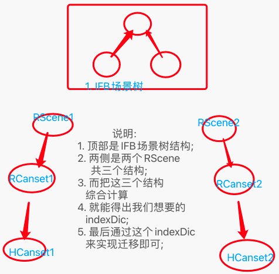
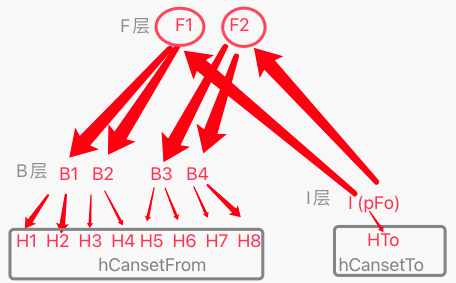
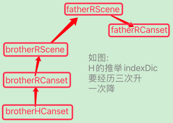
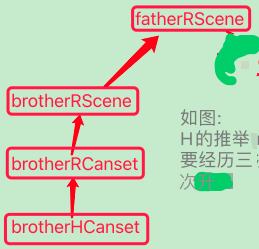

# 去皮搬运训练 & Cansets实时竞争

***

<!-- TOC -->

- [去皮搬运训练 & Cansets实时竞争](#去皮搬运训练--cansets实时竞争)
  - [n31p01 去皮训练-学会去皮部分6 (规划搬运训练步骤 & 学会搬运带皮果)](#n31p01-去皮训练-学会去皮部分6-规划搬运训练步骤--学会搬运带皮果)
  - [n31p02 TO类似任务执行太多次问题: 同质Root合并](#n31p02-to类似任务执行太多次问题-同质root合并)
  - [n31p02b TO第2步转为候选集巨慢优化](#n31p02b-to第2步转为候选集巨慢优化)
  - [n31p02c 学会搬运](#n31p02c-学会搬运)
  - [n31p05 运用搬运](#n31p05-运用搬运)
  - [n31p06 重跑学搬运-rCansetA反馈过度宽泛问题 (宽入未窄出)](#n31p06-重跑学搬运-rcanseta反馈过度宽泛问题-宽入未窄出)
  - [n31p07 Cansets实时竞争1: 主体改动](#n31p07-cansets实时竞争1-主体改动)
  - [n31p08 Cansets实时竞争2: 迭代TCPlan模块](#n31p08-cansets实时竞争2-迭代tcplan模块)
  - [n31p09 Cansets实时竞争3: 回测训练](#n31p09-cansets实时竞争3-回测训练)
  - [n31p10 继续迭代hSolutionV3](#n31p10-继续迭代hsolutionv3)
  - [n31p11 继续迭代hSolutionV3: 之hCanset迁移部分](#n31p11-继续迭代hsolutionv3-之hcanset迁移部分)
  - [n31p12 继续迭代hSolutionV3: 之hCanset过滤排序实时竞争机制](#n31p12-继续迭代hsolutionv3-之hcanset过滤排序实时竞争机制)
  - [n31pN TODO备忘](#n31pn-todo备忘)

<!-- /TOC -->

***

## n31p01 去皮训练-学会去皮部分6 (规划搬运训练步骤 & 学会搬运带皮果)
`CreateTime 2023.11.09`

| 31011 | 规划搬运训练,在目前的基础上,训练学会搬运有皮果: 搬运动机部分 |
| --- | --- |
| 简介 | 本表主要解决`搬运`动机问题: 当发现压不到坚果时,搬运后,能压到了 (并将此经验记录成HCanset); |
| 分析 | 1. 木棒确实不可被hCanset实现,但仍可以预测: 即使有木棒,它有些情况下也压不到的; |
|  | 2. 先测下,在压不到的情况下,它是否会预测到这种情况是压不到的 (在30145-步骤4已经训练了各种能否压到的情况); |
| 调试 | 1. 生成任务日志: `pFo:F947[M1{↑饿-16},A944(距72,向182,皮果)]->{-16.00}` |
|  | 2. 找到R解日志: `I<F947 F8544[M1{↑饿-16},A944(距72,向182,皮果),A6552(距121,向17,棒)]> {2 = S0P2;}` |
|  | 思路: 根据以上日志可见,在什么场景下能不能压的到,并不是matchFos预测得到的,而是rCanset的SP稳定性计数出来的; |
| 原则 | **搬运动机源于: 对Canset追求更高的SP稳定性;** |
| 测下 | 在FZ885的基础上再跑跑`30145-步骤4`,看下日志,能不能激活rCanset,然后增强SP? `具体测的跟进,转以下几张表` |

**小结: 31011分析了搬运动机,但被下方几张表的BUG卡住,所以搬运动机要转至31016再继续;**

```c
31012-木棒cansetA的deltaTime=0的问题;
//说明: 如下日志,rCanset能激活,也能顺利转到H任务A3568(棒),但问题在于,取到出现木棒的时间是0s,导致触发器很快,根本来不及等到feedbackTOR反馈;
_Fo行为化第 3/10 个: F4591[M1{↑饿-16},A159(向335,距60,皮果),A3568(向331,距56,棒),A3572(向274,距27,棒)...
---//构建行为化帧触发器:0x600000643b10 for:饿 time:0.00
_Fo行为化第 3/10 个: F4026[M1{↑饿-16},A384(向23,距67,皮果),A3568(向331,距56,棒),A3572(向274,距27,棒)...
---//构建行为化帧触发器:0x600000655c70 for:饿 time:0.00
_Fo行为化第 3/10 个: F4026[M1{↑饿-16},A384(向23,距67,皮果),A3568(向331,距56,棒),A3572(向274,距27,棒)...
---//构建行为化帧触发器:0x6000006b79d0 for:饿 time:0.00
//分析: 经查,在生成尤其决策期的一些fo时,比如cansetFo或者feedbackRegroupFo时,order的时间不是时间戳,而是本身就是deltaTime值;
//解答: 这导致在生成fo时,再次计算deltaTime,会算错,算成0,把输入时是输入时间戳还是已经是deltaTime加以区分,改后好了 `T`;
```

| 31013 | 改掉deltaTime=0的BUG后,重新训练步骤3到步骤5 |
| --- | --- |
| 简介 | 上表BUG修复后,因为这个BUG主要影响cansetFo生成和决策期,所以相关的就是步骤2到5,本表重新训练下这三步 |
| 注1 | 为了单纯训练去皮相关(避免疼痛影响它安静思考),本表将`随机出生`改为`随机路边出生`; |
| 步骤1 | **带皮学饿: 认知模式(`饿(持续饿感3次),扔随机带皮坚果,不吃,又饿`x200轮);** =>存为FZ871 |
| 步骤2 | **学认木棒: 认知模式(`随机路边出生,扔木棒` x 300轮);** =>存为FZ882 |
| 步骤3 | **带皮学吃: 认知模式(`饿,路边出生,路上就近扔带皮果,扔棒去皮,手动飞过去,触发吃掉`)x近中远上下各1次** =>存为FZ893 |
|  | > 重点日志: 看下`newRCanset`日志,应该能生成许多(避免更饿)RCanset; |
| 步骤4 | **学H去皮: 动物模式(`随机路边出生,饿,扔随机带皮果,扔木棒`x200轮);** =>存为FZ894 |
|  | > 重点日志: 看下`newHCanset`日志,应该能生成许多(去皮)HCanset; |
| 步骤5 | **预想与实际类比: 动物模式(`步骤3一致`)x近中远上下各1次** (参考30154-测1) =>存为FZ895 |
|  | > 重点日志: 看下`预想与实际`日志,应该能类比生成许多抽象RCanset; |
| 结果 | 本表在FZ882的基础上重新训练下步骤3到5,并存为FZ893,FZ894,FZ895; |

**小结: 以上31012-31013修复了deltaTime=0的BUG,并重新训练了FZ893,894,895;**

```c
31014-在31013-步骤5训练时,发现"预想与实际类比"的结果不好,调试日志如下:
1. 新proto: F9190[M1{↑饿-16},A515(距32,向72,皮果),A9163(距82,向18,棒),A9168(距26,向90,棒),A9169(向98,距9,果),飞↑,A9177(距53,向160,棒),A9178(距0,向122,果),A9183(向163,距54,棒),A3547(吃1)]
2. 与ass: F8938[M1{↑饿-16},A515(距32,向72,皮果),A8912(距79,向17,棒),A8917(距23,向88,棒),A8918(向94,距10,果),飞↑]
3. 外类比构建时序: F9029[A13(饿16,7),A515(距32,向72,皮果),飞↑]->{} from: (protoFo(1):assFo(2))
RCanset预想与实际类比:F9029[A13(饿16,7),A515(距32,向72,皮果),飞↑] (curS:F8938 状态:Runing fromPFo:F518 帧:2)
//问题: 如上日志中,proto和ass还是挺相似的,但类比出的结果却没有`棒`,另外ass的末帧也没有收集到`吃`;
//复现: 用现在的`FZ895,近下出生,跑步骤3`,然后即可复现触发"预想与实际类比";
//分析: 应该是木棒确实mIsC没匹配上,毕竟现在的新木棒在似层能匹配上的机率很低(因为概念识别结果的条数少,而似层总数特别多);
//方案: 可以尝试下多跑跑步骤5,让Canset更多的触发类比,然后过度到交层,只要过度到交层了,此问题也就自然解决了;
//TODO1: 在同位置出生然后同样相对位置扔有皮果，然后跑步骤5，看能不能“预想与实际类比”出交层结果？训练日志如下：
第1行. RCanset预想与实际类比:F9029[A13(饿16,7),A515(距32,向72,皮果),飞↑] (curS:F8938 状态:Runing fromPFo:F518 帧:2)
第2行.RCanset预想与实际类比:F9267[A13(饿16,7),A515(距32,向72,皮果),A9266(距23,棒),飞↑] (curS:F8938 状态:Runing fromPFo:F518 帧:2)
第3行.RCanset预想与实际类比:F9303[A13(饿16,7),A515(距32,向72,皮果),A9302(向88,棒),飞↑] (curS:F8938 状态:Runing fromPFo:F518 帧:2)
第4行.RCanset预想与实际类比:F9303[A13(饿16,7),A515(距32,向72,皮果),A9302(向88,棒),飞↑] (curS:F8938 状态:ActNo fromPFo:F518 帧:2)
第5行.RCanset预想与实际类比:F9350[A13(饿16,7),A2528(距67,向141,皮果),A9349(距26,棒),A9348(距9,果),飞↑,A9347(距0,果),A3547(吃1)] (curS:F9192 状态:ActYes fromPFo:F2531 帧:2)
//结果: 从todo1训练日志可见，本表方案可以得到交层“无距棒、无向棒、无向果” `可将本表方案整理成训练步骤6,转31015`;
```

| 31015 | 预想与实际类比得到交层Canset -> 训练步骤6 |
| --- | --- |
| 步骤6 | **过渡到交层Canset: 动物模式(路边出生,饿,就近Y大致对齐路中扔皮果,扔棒,手动飞至,触发吃掉)x上下各5次** =>存为FZ896 |
|  | > 之所以要Y大致对齐,是为了让鸟和果的相对位置相对稳定,这样能帮助从似层快速过渡到交层; |
|  | > 重点日志: 看下`预想与实际`日志,应该能类比生成许多`交层Canset` (参考31014-方案&第5行日志); |

**小结: 31014-31015测得了抽象Canset因过度抽象缺失帧的问题,所以追加了训练步骤6,以训练交层Canset(交层能避免缺失帧问题);**

| 31016 | 搬运动机 -> 训练步骤7 |
| --- | --- |
| 简介 | 在31011分析了搬运动机的实现思路(其实就是给RCanset训练SP值),本表追加实际的训练步骤6,来试下; |
| 步骤7 | **搬运动机: 在FZ896基础上再跑跑步骤4** `参考31011-原则&测下` =>存为FZ897; |
|  | > 重点日志: 看下`OR反省`日志,rCanset的SP有增强; |
| 结果 | 比较稳定SP的Canset激活后,会显示[饿,路中带皮果,棒,无皮果,飞,吃],但可能带皮果不在路上呢?就需要搬运了 `转下表`; |

| 31017 | 搬运训练 -> 训练步骤8 |
| --- | --- |
| 简介 | 在31016-结果中指出了如果带皮果不在路上的情况,本表则针对此H需求做`学会搬运HCanset`; |
| 副目标 | 为快速达成训练目标,可以**尽量使用迁移和试错来学会搬运** (即只训练一两次hCanset,剩下的全用迁移和试错来完成); |
| 思路 | 1. 分析下RCanset需要什么距向的有皮果,然后生成为H任务后,把不符合的有皮果,搬运成符合的有皮果,并生成为hCanset; |
|  | 2. 这样下回再激活HDemand有皮果时,就可以找到hCanset经验,并尝试通过搬运来加工符合条件(搬到路上)的有皮果; |
| 前验 | **通过以下几步尝试,先提前验证一下上面的思路能不能跑的通;** |
|  | 说明: 主要验证**触发带皮果H任务,不符时,符合时,然后再试下能不能学会HCanset**,这4条都提前验证下; |
| 前验1 | 触发HDemand: 试下仅点击饿,能不能预测到更饿,然后得到rCanset,并将有皮果转成hDemand; |
|  | 问题1. 点击饥饿时,没有立马预测到更饿; |
|  | 解答1. 经查pInput时连概念识别都没调用,所以识别不到饿了会更饿,改先支持下,然后再测 `T`; |
|  | 问题2. 在饥饿调用概念识别时,全含检查全不通过; |
|  | 解答2. 因为mvAlg的count取contentPorts返回0,导致全含失败,改为用content_ps.count后返回2,全含能通过了 `T`; |
|  | 问题3. mv概念识别ok后,时序识别结果仍是0条; |
|  | 求解3. 经查,没有[饿]->{更饿}时序,导致识别不到,经查前7步从来没训练过[饿]->{更饿}; |
|  | 解答3. 可以在步骤2和步骤3之间先插入一步`饿了更饿`的训练 `转31018-步骤2.5`; |
|  | 问题4. 在31018-FZ907的基础上,点击饿发现: `饿了更饿`生成的任务无计可施,没有激活rCanset; |
|  | 求解4. 经查,饿了更饿没rCanset的原因是,手动训练时,点击重启太早,导致realMaskFo还未收集完成就重启了; |
|  | 解答4. 改为在看到思维闲时(TC的FPS为0持续三秒)再重启即可 `T`; |
| 前验2 | 符合时: 试下有皮果扔路上时H任务能反馈到; |
| 前验3 | 不符时: 然后再试下不扔到路上时,H任务反馈不到; |
| 前验4 | 学会HCanset: 然后再试下不扔到路上,但搬运到路上,然后又反馈到; |
| 步骤8 | **搬运训练: 动物模式(路下出生,路下扔带皮果,路上带皮果转为h任务后,把坚果搬运到路上,扔木棒,飞,吃)** |

**小结: 以上规划了"搬运动机"和"搬运训练",但搬运训练之前的前验并不顺利,因此需要加步骤2.5等,见下表;**

| 31018 | 插入一步: 步骤2.5 |
| --- | --- |
| 步骤2.5 | 饿了更饿: 认知模式(`饿(持续饿感3次)`x20轮); =>存为FZ902.5 |
| 实践 | 加了步骤2.5后,对后面步骤的训练都有影响,所以需要重整理下所有步骤并重新训练下: **↓↓↓** |
| 回测 | 按如下8个步骤回测下 (只需要训练2.5之后的步骤,之前的不变可复用FZ871和FZ882); |
| 步骤1 | 带皮学饿: 认知模式(`饿(持续饿感3次),扔随机带皮坚果,不吃,又饿`x200轮); =>存为FZ871 |
| 步骤2 | 学认木棒: 认知模式(`随机路边出生,扔木棒` x 300轮); =>存为FZ882 |
| 步骤2.5 | 饿了更饿: 认知模式(`饿(持续饿感3次)`x20轮); =>存为FZ902.5 |
|  | > 重点日志: 看下点了饿后,立马能识别到`[饿]->{更饿}`; |
| 步骤3 | 带皮学吃: 认知模式(`饿,路边出生,路上就近扔带皮果,扔棒去皮,手动飞过去,触发吃掉`)x近中远上下各1次 =>存为FZ903 |
|  | > 重点日志: 看下`newRCanset`日志,应该能生成许多(避免更饿)RCanset; |
| 步骤4 | 学H去皮: 动物模式(`随机路边出生,饿,扔随机带皮果,扔木棒`x70轮); =>存为FZ904 |
|  | > 重点日志: 看下`newHCanset`日志,应该能生成许多(去皮)HCanset; |
|  | 问题1. 在加入步骤2.5后,步骤4学不到去皮的HCanset了,需要再跑跑分析下原因; |
|  | 分析1. 看起来是步骤3得到的newRCanset太具象了,很难走到`无皮果HDemand`那一帧; |
|  | 解答1. 可以先跑跑后面的`预想与实际类比`和`过渡到交层`,然后再来跑第4步看下能不能得到newHCanset; |
|  | 实践1. 把步骤4(学H去皮)调整到步骤6(过渡到交层Canset)之后 `转3101a`; |
| 步骤5-8 | 本表只训练到步骤4....步骤5到步骤8因以上`步骤4-问题1`导致本表未继续训练,略; |
| 结果1 | 本表补了个步骤2.5,然后整个后面的都要重新训练,有点太麻烦 `太麻烦的问题 转31019`; |
| 结果2 | 本表测得步骤4(学H去皮)训练未得到`去皮newHCanset`的问题 `转3101a`; |

| 31019 | 最近总是发现训练步骤会缺一些东西,导致推进不顺 |
| --- | --- |
| 分析 | 比如上面的步骤2.5就是缺了饿了更饿,而31017-问题4又测得了饿了更饿没rCanset; |
| 重点 | 如果每次缺了什么,就补一个步骤,再重新训练,补一点点就重新跑一次训练,那得累死; |
| 方案 | 先废除训练步骤,边跑边测边推进,缺什么就训练什么,灵活点搞; |
|  | 优点: 这么做的优点是,灵活训练,缺什么训练什么,更容易发现问题,推进测试和修补系统细节问题; |
| 结果 | 先采用本表方案,**等灵活跑顺了,再改回:规划训练步骤;** `T` |
| 追加 | `灵活跑`的方案,还是灵活用吧,想用时用用,但主要还是以规划步骤为主线 `T`; |

**小结: 31018训练了: 饿了更饿,但发现"学H去皮"不顺利,转下表把学H去皮后置一些;**

| 3101a | 将步骤4后调到步骤6之后 |
| --- | --- |
| 说明 | 本表在31018的基础上,将31018-步骤4,调整到步骤6之后 (因为在RCanset更抽象后,); |
| 解析 | 本表: 步骤1-3是基础训练,4-6是rCanset训练,7-8是搬运带皮果训练,9之后是去皮训练; |
| 步骤1 | 带皮学饿: 认知模式(`饿(持续饿感3次),扔随机带皮坚果,不吃,又饿`x200轮); =>存为FZ871 |
| 步骤2 | 学认木棒: 认知模式(`随机路边出生,扔木棒` x 300轮); =>存为FZ882 |
| 步骤3 | 饿了更饿: 认知模式(`饿(持续饿感3次)`x20轮); =>存为FZ913 |
|  | > 重点日志: 看下点了饿后,立马能识别到`[饿]->{更饿}`; |
| 步骤4 | 带皮学吃: 认知模式(`饿,路边出生,路上就近扔带皮果,扔棒去皮,手动飞过去,触发吃掉`)x近中远上下各1次 =>存为FZ914 |
|  | > 重点日志: 看下`newRCanset`日志,应该能生成许多(避免更饿)RCanset; |
| 步骤5 | 预想与实际类比: 动物模式(`与带皮学吃一致`)x近中远上下各1次 (参考30154-测1) =>存为FZ915 |
|  | > 重点日志: 看下`预想与实际`日志,应该能类比生成许多抽象RCanset; |
| 步骤6 | 过渡到交层Canset: 动物模式(路边出生,饿,就近Y大致对齐路中扔皮果,扔棒,手动飞至,触发吃掉)x上下各3次 =>存为FZ916 |
|  | > 说明: 之所以要Y大致对齐,是为了让鸟和果的相对位置相对稳定,这样能帮助从似层快速过渡到交层; |
|  | > 重点日志: 看下`预想与实际`日志,应该能类比生成许多`交层Canset` (参考31014-方案&第5行日志); |
| 步骤7 | 搬运动机: 动物模式(`随机路边出生,饿,扔随机带皮果,扔木棒`x70轮) =>存为FZ917; |
|  | > 重点日志: 看下`OR反省`日志,rCanset的SP有增强 **(SP的增强就等价于搬运动机)**; |
|  | > 说明1: 搬运动机其实就是激活了`路中带皮果`,然后转成HDemand,来加工带皮果从路边到路中 `参考31011-原则&测下`; |
|  | > 说明2: 激活SP最稳定的Canset `如:[饿,路中带皮果,棒,无皮果,飞,吃]`,而第2帧带皮果不在路上就转为H任务搬运 `转下步`; |
| 步骤8 | 搬运训练: 动物模式(路下出生,路下扔带皮果,路上带皮果转为h任务后,把坚果搬运到路上,扔木棒,飞,吃) |
| 步骤9 | 学H去皮: 动物模式(`随机路边出生,饿,扔随机带皮果,扔木棒`x70轮) =>存为FZ919 |
|  | > 重点日志: 看下`newHCanset`日志,应该能生成许多(去皮)HCanset; |
|  | > 说明: 其实学H去皮不需要特意训练,只要有了"路中带皮果",无非就是看到木棒后,自然就有了"无皮果"; |

**小结: 本表在上面几张表:新增了"饿了更饿"和"学H去皮"后置后,重新整理了一下9个步骤;**

| 3101b | 上表步骤7训练后,发现OR反省中SP值普遍<3 |
| --- | --- |
| 简介 | 因为SP的增强就等价于搬运动机,所以能解决饥饿问题的正确rCanset能够增强SP稳定性非常重要; |
| 分析 | 1. 只有步骤4到6顺利吃到了,但次数很少,而步骤7中的70次经历都是没吃到的; |
|  | 2. 即步骤4到6的rCanset一次次激活又失败,它们的SP稳定性都已经很低; |
|  | 3. 此时TCTransfer迁移到新场景上的rCanset会不会继承那个很低的SP呢? |
|  | 4. 如果不会继承SP值,就可能导致本表的问题,即迁移过来的SP默认为S0P0,但稳定性却大于那些很低的rCanset; |
| 线索 | 5. 从而导致总是比较新迁移出来的rCanset被最终激活,它的SP值也必然是<3的(因为没继承迁移前的SP值); |
| 方案 | 在TCTransfer迁移出新canset时,可以继承(/推举)一下SP值; |
| todo1 | 继承算法加上随便继承SP值 `T`; |
| todo2 | 推举算法也加上SP推举初始值 (参考下方方案2及相关分析) `T`; |
|  | 方案1. 暂不加推举SP值 `5%` |
|  | >>> 推举时也推举SP值吧 (比如吃了苹果和梨了,会认为水果大几率能吃); |
|  | 方案2. 谁推举就加谁的SP初始值 `95%` |
|  | >>> 防重复推举: 推举的canset可能本来就有,已推举过的不重复推举; |
|  | >>> 推举SP机制: 推举一次更新一次SP,即谁新推举时,计入它的SP即可,这样其实与方案3是等效的; |
|  | 方案3. 从多个具象里综合sumSP值 `5%` |
|  | >>> 方案3求综合sumSP值有点废性能不可取; |
|  | 结果: 根据以上分析,选择方案2进行实践 `T`; |
| todo3 | 推举或继承都要防重 (参考todo2-方案2-防重复) `本就支持 T`; |
| todo4 | 推举和继承SP值的机制都是异步做,谁推举/继承,谁的SP值就计进去 (参考todo2-方案2-推举SP机制) `T`; |
| todo5 | 构建cansetFo时,改为场景内防重,而不是全局防重 (为什么这么做的原因如下) `T`; |
|  | 为什么这么做: 如果全局防重,在各场景生成一模一样的cansetFo时,分别继承SP,会混在一起,SP全累计到一起; |
|  | 比如1: 在家吃饭的SPEFF感觉,和在野外独自一人吃饭肯定不一样,虽然都是吃饭,但场景不同,不应该混在一起; |
|  | 比如2: 在北京吃龙虾不行,在家是可以的 (这些canset虽然内容一样,但SPEFF完全不同,不能窜); |
| todo6 | 同理todo5:在预想与实际类比构建absCanset时 和 自然未发生时创建canset,也都改为场景内防重 `T`; |
| 结果 | 改完后,再跑FZ917,看OR反省日志,有了SP值>6的情况了,虽然不是很多; |

**小结: 本表写了: 1.迁移时连带SP值 2.构建Canset改为场景内防重**

**总结: 本节跑搬运动机,并修复了一些细节问题,不过搬运动机依然还不是很顺,`FZ917,饿,路边有皮果,棒`,这个过程中生成的hDemand往往是针对木棒(这种情况占90%以上),而不是针对带皮果(占比2%左右),但日志太杂而乱了,日志几乎是不可读状态,TO执行的循环太多次类似的在跑,转下节先把这个TO循环太杂乱的问题搞搞再说;**

***

## n31p02 TO类似任务执行太多次问题: 同质Root合并
`CreateTime 2023.12.11`

见上节末总结,TO循环太杂乱了,全是类似的Demand在反反复复的跑;

| 31021 | TO循环虽然与TI分离了,但针对类似任务还是执行太多次了 |
| --- | --- |
| 说明 | 比如感到饿,然后看到带皮果,然后看到木棒,这个过程中,触发多次识别,然后触发Demand,触发TO |
| 分析 | 能不能把这种非常类似的任务都整合一下,避免反反复复的TO过程,又耗能,又没啥用,还看起来混乱; |
| 方案v1 | 看下类似的Demand在有新帧输入时,全更新到原类似RootDemand中,而不是生成为新的RootDemand `5%`; |
| 问题 | 分析root防重的判定方法: 即怎么判定各个pFo是属于"类似"的,如以下两个时序: |
|  | 比如: 先识别到:`F1[A1,B1,C1],cutIndex=B1`; 过了一会又识别到:`F2[A2,B2,C2],cutIndex=C2`; |
|  | 疑问: F1和F2是"类似"时序吗?如果A1和A2的mcIsBrother成立,或者mIsC成立,那么算"类似帧"吗? |
|  | 解答: **可以以A1和A2都在同一个概念识别的matchAlgs结果中,来判断它们是"类似的"**; |
|  | 实践规划: 在DemandManager生成Root时,判断pFo,将所有"类似"的pFo都归到同一个rootDemand下; |
| 举例 | 说白了,如果你饿了,你在做饭中,又感受到了饿,你需要重新决策还是继续做饭? |
|  | 说明: 这确实是两次饿,但它们相似度高,且第1次饿正在推进中 (本例迎来转机,从而让本表转向方案v2); |
|  | 调试: 通过实际调试分析生成任务的情况: 见31021代码段,确实会有数次饥饿任务,并且没有前后衔接上,导致重复决策; |
| 方案v2 | 在DemandManager生成RDemand时,看下如果有同质的,就直接把pFo下的枝叶solution推进进度移过来 `95%`; |
|  | 说明: 新任务把旧同质任务的solution枝叶继承过来; |
|  | 实践问题: 下一帧如果和上一帧+1一致时,将上一帧+1的工作记忆成果移过来继续用 (那么怎么判断一致呢?); |
|  | 解答: 只要旧帧和新帧的pFo是同一个matchFo; |
|  | >>> 1. 那么新帧的输入肯定对的上旧帧预测的那一帧 (即肯定这一帧一致); |
|  | >>> 2. 且其下的工作记忆成果都可以兼容移过来 (因为本来就是同一个matchFo,当然可以移植); |
|  | 实践规划: 在DemandManager生成Root时,判断pFo,将旧有"类似"的pFo的subSolution直接挂到新的pFo下; |
| 抉择 | 方案v1是在空想情况下得出的方案,而方案v2是在实际调试训练跑日志后得出的方案,所以选业方案v2 `实践转31022`; |

```c
31021-代码段A: 通过两种训练(手训和自训各跑一次),看下日志,都生成了哪些Root任务;
//第1种尝试. 手训步骤,看下solution过度执行的问题;
//复现: FZ917x2,路边出生,饿,路中扔带皮果,棒
//日志: 测得以下日志,TO确实一直在执行,每次不是果饿果饿,就是饿果饿果;
//分析: 此时看起来已经是去皮成功了,只差飞过去吃掉;
//尝试: 可以试下feedbackTIP是不是也要收集往后送 / 或者pInput时,也要调用feedbackTIR吧,因为现在mv也会入时序中;
//说明: 如下在训练中共7次生成RDemand;
RMV新需求: 饿 (条数+1=1 评分:-10.226748)
	 pFo:F3566[M1{↑饿-16}]->{-10.27} SP:{0 = S0P559;1 = S358P200;} indexDic:{0 = 0;}
	 //另外有类似F3566的别的pFo: F3521 F3579 F3871 F3543 F3597 F3717 F3825 F3900 F3611 F3531 F3553 F3629 F3651 F3908 F3699

RMV新需求: 饿 (条数+1=1 评分:-10.226748)
	 pFo:F3566[M1{↑饿-16}]->{-10.27} SP:{0 = S0P559;1 = S358P200;} indexDic:{0 = 0;}
   //另外有类似F3566的别的pFo: F3521 F3579 F3871 F3543 F3597 F3717 F3825 F3900 F3611 F3531 F3553 F3629 F3651 F3908 F3699

RMV新需求: 饿 (条数+1=3 评分:-10.226748)
	 pFo:F3566[M1{↑饿-16}]->{-10.27} SP:{0 = S0P560;1 = S359P200;} indexDic:{0 = 3;}
   //另外有类似F3566的别的pFo: F3521 F3579 F3871 F3543 F3597 F3717 F3825 F3900 F3611 F3531 F3553 F3629 F3651 F3908 F3699

RMV新需求: 饿 (条数+1=4 评分:-14.4)
   pFo:F6355[A6339(向191,距122,果),M1{↑饿-16},A6347(向191,距126,棒),A6339(向191,距122,果)]->{-14.40} SP:{0 = S0P10;3 = S0P10;2 = S0P10;1 = S0P10;4 = S9P1;} indexDic:{0 = 0;3 = 3;2 = 2;1 = 1;}

RMV新需求: 饿 (条数+1=5 评分:-9.751501)
	 pFo:F3566[M1{↑饿-16}]->{-10.28} SP:{0 = S0P561;1 = S360P200;} indexDic:{0 = 3;}
   //另外有类似F3566的别的pFo: F3521 F3579 F3871 F3543 F3597 F3717 F3825 F3900 F3611 F3531 F3553 F3629 F3651 F3908 F3699
   //以及以下几个不类似的4个pFo >>> 内容为[饿,饿]->{饿}:F3534 F3546 F3559 F3524

RMV新需求: 饿 (条数+1=6 评分:-9.759939)
	 pFo:F3566[M1{↑饿-16}]->{-10.29} SP:{0 = S0P562;1 = S361P200;} indexDic:{0 = 3;}
   //另外有类似F3566的别的pFo: F3521 F3579 F3871 F3579 F3543 F3597 F3717 F3825 F3900 F3611 F3531 F3553 F3629 F3651 F3908 F3699
   //以及以下几个不类似的4个pFo >>> 内容为[饿,饿]->{饿}:F3534 F3546 F3559 F3524

RMV新需求: 饿 (条数+1=7 评分:-8)
	 pFo:F16518[A8905(距122,果),A13(饿16,7),A8905(距122,果)]->{-8.00} SP:{0 = S0P12;1 = S0P12;2 = S0P12;} indexDic:{0 = 1;1 = 2;2 = 3;}

//第2种尝试. 再试下训练自训步骤: "学H去皮",看下日志关于过度执行solution的问题;
//复现: "FZ917,学H去皮";
//  a. 发现训练一轮间,确实数次饿感和看到木棒,坚果,是数次分别形成了pFos;
//  b. 且在形成HDemand(木棒)前木棒视觉已经发生完毕了,导致它压根反馈不到;
//  c. 除非两次pFos之间,可以过度一下...
//  d. 从以下日志可见,在同一轮训练中: 数次生成rDemand,非常类似;
//说明: 如下在训练中共6次生成Demand;

第1次: RMV新需求: 饿 (条数+1=1 评分:-10.252431)
 pFo:F3566[M1{↑饿-16}]->{-10.29} SP:{0 = S0P568;1 = S364P202;} indexDic:{0 = 0;}
 //另外有类似F3566的别的pFo: F3521 F3579 F3871 F3579 F3543 F3597 F3717 F3825 F3900 F3611 F3531 F3553 F3629 F3651 F3908 F3699

第2次: RMV新需求: 饿 (条数+1=2 评分:-16)
 //四条pFo: [饿,皮果]->{饿} 分别为:F2096 F2031 F1700 F1980

第3次: RMV新需求: 饿 (条数+1=3 评分:-9.755568)
 pFo:F3566[M1{↑饿-16}]->{-10.27} SP:{0 = S0P569;1 = S365P203;} indexDic:{0 = 3;}
 //另外有类似F3566的别的pFo: F3871 F3521 F3579 F3543 F3597 F3717 F3825 F3900 F3611 F3531 F3553 F3629 F3651 F3908 F3699
 //以及以下几个不类似的4个pFo >>> 内容为[饿,饿]->{饿}:F3534 F3546 F3559 F3524

第4次: RMV新需求: 饿 (条数+1=4 评分:-16)
 //四条pFo: [饿,皮果]->{饿} 分别为:F2096 F2031 F2315 F1700

第5次 =============================== 32 hDemand ===============================
 A4249(向351,距150,棒)
 TO上轮:成功 等待:0.0 下轮:5 消息:out 此帧需要HDemand来完成,已转为h任务
 第1条 饿 评分-16.00 激活成功     {proto:F15687 pFos:(F2096,F2031,F2315,F1700)}

第6次: RMV新需求: 饿 (条数+1=5 评分:-10.244307)
 pFo:F3566[M1{↑饿-16}]->{-10.28} SP:{0 = S0P570;1 = S366P203;} indexDic:{0 = 3;}
 //另外有类似F3566的别的pFo: F3521 F3871 F3579 F3543 F3597 F3717 F3825 F3900 F3611 F3531 F3553 F3629 F3651 F3908 F3699

**结果: 如上两种训练方式,都数次生成很类似的Demand,是非常应该想办法防止重复决策的,转31021-举例-调试**
```

**小结: 以上针对同质任务重复太多次执行的问题: 制定方案 & 并代码日志前验分析了下很有(rootDemand防重合并的)必要性;**

| 31022 | 同质任务重复太多次执行问题-实践前问题: 为什么要合并?并到什么程度? |
| --- | --- |
| 说明 | 本表分析rootDemand并的必要性有多大?怎么并?并介入实例细节分析下,并到什么程度; |
| 内存角度 | 1. 即使并成一帧,也只是outModels并了,能省不少内存 (但目前这个动不动模拟重启的训练,省内存也没啥用); |
|  | 2. 而inModels依然是四帧没变,也没啥用; |
|  | 总结: 所以在内存角度看,合并没意义; |
| 举例分析 | 通过举例分析,到底该不该并? |
|  | 比如: 张三会先后扔出x个飞标打我,最好的方法就是接住所有x个飞标,并扔回去将张三biu死; |
|  | 分析: 此例中,张三和飞标都会带来危险,先分析下此例,共带来多少细节危险任务,这些是否都需要合并; |
|  | >>> 1. 某个飞标的位置一直在变,会不断更新新的[matchFo]->{危险} `本来就是同一飞标变了位置,可合并`; |
|  | >>> 2. 也会有新的飞标被扔出,即新加入新的飞标[newMatchFo]->{危险} `合并到新帧可方便统筹分析一并接住所有飞标`; |
|  | >>> 3. 张三的位置不变,可能除第一眼外压根不看张三[首帧张三]->{危险} `合并到新帧才能实现:接住后直接扔回的canset` |
|  | 结果: 根据上例中三种情况分析,是**都应该合并的,即只要新旧pFos有交集,则直接把新旧pFos全合并到新帧RootDemand里**; |
| 总结 | 从`内存角度`未分析到全面合并的必要性,但从`举例分析`分析到应该尽量合并,以使之方便`统筹求解`; |

**小结: 以上通过介入实例分析(rootDemand防重合并)的必要性,其中三个情况的分析,为后面代码实践指明了方向;**

| 31023 | 同质任务重复太多次执行问题-实践前问题: 具体怎么并? |
| --- | --- |
| 说明 | 本表分析怎么合并: 是把旧pFo的枝叶移到新的下面?还是是直接旧的替新的?还是两帧全保留? |
| 顺便 | 本表顺便分析下旧的solution移给新Root时,是不是有cutIndex等需要兼容下,或者避免产生兼容问题; |
| 方案1 | 旧枝叶+新壳子: 把旧的枝叶嫁接给新的pFo,旧的pFo壳子删掉; |
| 方案2 | 旧枝叶+旧壳子: 仅保留旧的pFo及其枝叶,新的pFo删掉; |
| 方案3 | 旧全部+新全部: 旧的枝叶和壳子全保留,新的pFo也保留; |
| 分析 | 目前倾向于第3方案,把两个都留下: |
|  | 原因1. 反证据: 因为cutIndex不同,取canset候选集其实是会不一样的,旧的枝叶canset未必就是新scene壳子的方案; |
|  | 原因2. 反证据: 因为cutIndex不同,本来新壳子+旧枝叶就会有兼容性问题 (比如判断条件满足等,壳子和枝叶都是严密贴合的); |
|  | 原因3. 正证据: 二者同时存在并不冲突,各取各的候选方案,公平竞争即可 (比如冷水和烧至温水,二者都可继续烧变成开水); |
| 结果 | 因以上分析3个原因先选定方案3 `转31024进行代码实践 T`; |

**小结: 以上分析具体合并后,新旧同质的pFo保留哪一个 (决定新旧pFos二者全留,旧root删掉),为后面代码实践明确了该怎么做;**

| 31024 | 同质任务重复太多次执行问题-实践规划 |
| --- | --- |
| todo1 | 判断新旧Root的pFo有交集,则直接移植旧pFos(壳子和枝叶)到新的Root的pFos中(即二者合并,参考31023-方案3) `T` |
| todo2 | 合并后,把旧的Root直接删掉 (合并后,旧的没了,只留新的) `T`; |
|  | 1. 即推进一帧后,上一帧的root可以直接关闭 (即移植是移动,而非复制); |
|  | 2. 但上一帧也不是完全无用,有些正在推进中的canset是可以继续搞的 (即移植后,它所在的pFo继续推进它); |

***

## n31p02b TO第2步转为候选集巨慢优化
`CreateTime 2023.12.21`

回测上节Root合并,并且测得TO第2步转为候选集巨慢,在本节优化一下;

| 31025 | 回测 |
| --- | --- |
| 回测1 | 手动步骤(参考3101a-步骤6)回测: `FZ917x2,饿,路边出生,路上就近扔带皮果,扔棒去皮` |
|  | 目的: 这么训练的目的是为了看下TO还会不会同质重复执行太多次; |
|  | 效果: TO执行几次后,小鸟会自行飞过去,触发吃掉,连续试了三次,都是如此,其中三次飞成功后,OR反省的日志如下: |
|  | spIndex:4 -> (好) null->S0P1 F18814[M1{↑饿-16},A8905(距122,果),A13(饿16,7),A8905(距122,果),飞↑,果,吃] |
|  | spIndex:4 -> (好) S0P1->S0P2 F18814[M1{↑饿-16},A8905(距122,果),A13(饿16,7),A8905(距122,果),飞↑,果,吃] |
|  | spIndex:4 -> (好) S0P2->S0P3 F18814[M1{↑饿-16},A8905(距122,果),A13(饿16,7),A8905(距122,果),飞↑,果,吃] |
|  | 结果: 目前看起来,确实没有大量同质Root重复执行 (毕竟已经合并了),但还需要再跑跑别的训练试试 (转回测2); |
| 回测2 | 自动步骤(参考3101a-步骤7)回测: `随机路边出生,饿,扔随机带皮果,扔木棒` |
|  | 目的: 持续饿感会持续三次,看下这三次有没合并同质Root,看下同质Root会不会重复执行太多; |
|  | 问题: 见31025-代码段日志,从日志可解读出两个问题: |

```java
31025-代码段
195 [23:19:30:848 TO        TCSolution.m  39] =============================== 2 rSolution ===============================
196 [23:19:30:848 TO        TCSolution.m  39] 任务源:饿 protoFo:F19095[M1{↑饿-16}] 已有方案数:0 任务分:-10.30
198 [23:19:31:430 TO           TCScene.m  84] 第1步 R场景树枝点数 I:16 + Father:16 + Brother:304 = 总:336
1454 [23:19:45:862 TO    TCSolutionUtil.m 216] 第2步 转为候选集 总数:652
1455 [23:19:45:863 TO    TCSolutionUtil.m 237] 第5步 Anaylst匹配成功:652
1456 [23:19:45:866 TO    TCSolutionUtil.m 243] 第6步 排除不应期:652
1457 [23:19:45:888 TO    TCSolutionUtil.m 249] 第7步 排除FRSTime来不及的:0
1458 [23:19:45:889 TO        TCSolution.m 166] >>>>>> rSolution 无计可施
//问题1. 从第1步到第2步转为候选集,跑了15秒,这15秒够死多少回了,查并优化;
//  > 可见现在转候选集是很耗能的 -> 下面主要边调试性能边优化第1步到第2步的性能,如下:
//  > todo1. 优化AIFilter.solutionCansetFilter()候选集过滤器中的排序 (优化了7秒左右 -> 效果:优化至8s内);
//  > todo2. 优化solutionFoRankingV3()候选集排序 (优化了1秒左右 -> 效果:优化至7s内);
//  > todo3. 优化rSolution_Slow()提前在for之前取scene所在的pFo,以优化其性能 (优化了0.x秒);
//  > todo4. 优化TCScene取的场景树防重 (优化了5秒左右 -> 效果:优化至1s内);
//  > 总结: todo1和2是提前取AIEffectStrong模型,减少执行数,todo4是场景防重,减少它带来的执行数,最终优化至1s内,顺利完成 `T`;
//  > 回测: 回测日志如下:
4497 [09:18:20:179 TO           TCScene.m 108] 第1步 R场景树枝点数 I:16 + Father:1 + Brother:9 = 总:26
4498 [09:18:20:470 TO    TCSolutionUtil.m 228] 第2步 转为候选集 总数:202
10948 [09:19:27:051 TO           TCScene.m 108] 第1步 R场景树枝点数 I:20 + Father:2 + Brother:8 = 总:30
10950 [09:19:27:378 TO    TCSolutionUtil.m 228] 第2步 转为候选集 总数:201
//问题2. 第7步,652条候选集,全部都是来不及?
//  > 查下能不能提前对FRSTime来不及做评价,而不必在转为候选集后 (或者提前到一个不影响性能的阶段);
//  > 经查FRSTime中取到validPFos为空,因为全是isExpired失效状态,所以判断giveTime全是0,怎么都来不及;
//  > 思路,跑下31025-回测2,并把isExpired过期的日志打出来,查下为什么全失效了:
//  > 日志1. 196 [23:25:04:115 TO           TCScene.m  84] 第1步 R场景树枝点数 I:16 + Father:16 + Brother:304 = 总:336
//  > 日志2. 1426 [23:25:18:153 TO    TCSolutionUtil.m 216] 第2步 转为候选集 总数:809
//  > 说明: 如上日志: 因为solution太慢,02秒时构建任务,10秒时已经全过期了,到18秒才转为候选集完成,当然后面全是失效,FPSTime失败;
//  >   过期原因1. feedbackTIP在8秒后发生,会导致过期 (上面就是因为这个过期的);
//  >   过期原因2. 触发器本身到期也会过期 (触发器是10s左右,上面不是因为这个,但也等不到18秒);
//  > 举例: 说白话,就是你三秒内必须躲开,你决策这个问题就用了10秒,等你想到办法了,早就黄花菜都凉了;
//  > 解答: 还是得解决下问题1,卡顿问题,只要卡顿解决了,自然就不会来不及了 `问题1修复后,此问题好了,日志如下:`;
193 [08:53:54:521 TO        TCSolution.m  39] =============================== 2 rSolution ===============================
194 [08:53:54:521 TO        TCSolution.m  39] 任务源:饿 protoFo:F24563[M1{↑饿-16}] 已有方案数:0 任务分:-10.30
196 [08:53:55:142 TO           TCScene.m 108] 第1步 R场景树枝点数 I:16 + Father:1 + Brother:9 = 总:26
208 [08:53:56:570 TO    TCSolutionUtil.m 228] 第2步 转为候选集 总数:203
209 [08:53:56:570 TO    TCSolutionUtil.m 251] 第5步 Anaylst匹配成功:203
214 [08:53:56:571 TO    TCSolutionUtil.m 257] 第6步 排除不应期:203
225 [08:53:56:590 TO    TCSolutionUtil.m 263] 第7步 排除FRSTime来不及的:203
```

**小结: 31025优化了TO性能(从15s优化到1s),然后回测31024同质任务执行太多的问题没啥问题了,手动和自动步骤都没发现明显问题;**

***

## n31p02c 学会搬运
`CreateTime 2023.12.28`

上节TO性能ok了,本节正式开始搞下搬运训练;

| 31026 | 正式开始做: 步骤8-搬运训练 |
| --- | --- |
| 示图1 |  |
| 示图2 |  |
| 第1步 | 试下能必现搬运动机 |
|  | 步骤规划: `路下远些出生,饿,路下近些扔坚果,扔木棒` (见示图1); |
|  | 日志分析: 日志分析见31026-代码段1; |
|  | 结果: 虽然有一些小问题,但搬运动机是存在的 (只要生成了带皮果H任务,就说明动机ok); |
| 第2步 | 再做下搬运看能够学到搬运hCanset |
|  | 步骤规划: `路下出生,饿,鸟同位置扔带皮果,把坚果踢到路上` (见示图2); |
|  | 重点关注1: 看下踢了带皮果后,有没有反馈到hDemand带皮果; |
|  | >>> 参考31026-代码段2-feedbackTOR部分,日志可见反馈带皮果顺利; |
|  | 重点关注2: 看下在反馈到hDemand带皮果后,有没有生成新的hCanset; |
|  | >>> 参考31026-代码段2-OR反省部分,日志可见可顺利生成新hCanset; |
|  | 结果: 关注1和关注2都实训顺利 `接下来可以正式训练下第8步,转31027`; |

* 31026-代码段1: 31026-第1步跑出日志如下:

```c
=============================== 11 hSolution ===============================
目标:A4614(向267,距11,皮果) 已有S数:0
第1步 H场景树枝点数 I:1 + Father:0 + Brother:0 = 总:1
第2步 转为候选集 总数:0
第5步 Anaylst匹配成功:0
第6步 排除不应期:0
第7步 排除FRSTime来不及的:0
>>>>>> hSolution 无计可施

=============================== 82 hSolution ===============================
目标:A4015(向91,距10,皮果) 已有S数:0
第1步 H场景树枝点数 I:1 + Father:0 + Brother:0 = 总:1
第2步 转为候选集 总数:0
第5步 Anaylst匹配成功:0
第6步 排除不应期:0
第7步 排除FRSTime来不及的:0
>>>>>> hSolution 无计可施
```
* 问题. 共执行hSolution31次,只有两次是皮果H任务,别的全是木棒H任务 (而生成任务共50次,皮果占18次,木棒占32次);
  - 说明. 皮果H任务占36%,但执行hSolution却只占6.5%;
* 暂停: 这问题先不管了,只要能生成H任务就是有动机,至于占比太少的问题,随后看影响很重要,到时再查 `暂停解决此问题 T`;

```c
31026-代码段2:
说明: 此处仅有日志,具体的问题和解答,在31026-第2步: 重点关注1和关注2;
=============================== 2 rSolution ===============================
任务源:饿 protoFo:F27751[M1{↑饿-16}] 已有方案数:0 任务分:-10.34
第1步 R场景树枝点数 I:16 + Father:1 + Brother:9 = 总:26
第2步 转为候选集 总数:176
第5步 Anaylst匹配成功:176
第6步 排除不应期:176
第7步 排除FRSTime来不及的:176
0. I<F3597 F4659[M1{↑饿-16},A4614(向267,距11,皮果),A4618(向342,距82,棒),A4623(距24,向272,棒),A4624(向267,距11,果),飞↓,A4633(距33,向211,棒),A4634(向260,距0,果),A4639(向205,距34,棒),A3981(吃1)]> {1 = S1P1;}:(分:0.50) H1N0:(分:1.00)
1. I<F3597 F4728[M1{↑饿-16},A4683(向275,距13,皮果),A3106(向350,距143,棒),A4695(距25,向275,棒),A4696(向275,距13,果),飞↓,A4705(距52,向200,棒),A4706(向283,距5,果),A4711(向197,距54,棒),A3981(吃1)]> {}:(分:0.50) H1N0:(分:1.00)
=============================== 2 行为化Fo ===============================
第 2/10 个,时序:F4659[M1{↑饿-16},A4614(向267,距11,皮果),A4618(向342,距82,棒),A4623(距24,向272,棒),A4624(向267,距11,果),飞↓,A4633(距33,向211,棒),A4634(向260,距0,果),A4639(向205,距34,棒),A3981(吃1)]
=============================== 2 行为化前 反思评价 ===============================
> 最严重子任务分(饿):-9.57 > 当前任务分(饿):-10.34 =====> 已通过
_Fo行为化第 2/10 个: F4659[M1{↑饿-16},A4614(向267,距11,皮果),A4618(向342,距82,棒),A4623(距24,向272,棒),A4624(向267,距11,果),飞↓,A4633(距33,向211,棒),A4634(向260,距0,果),A4639(向205,距34,棒),A3981(吃1)]
---//构建行为化帧触发器:0x6000038cc0f0 for:饿 time:2.11
=============================== 3 hDemand ===============================
A4614(向267,距11,皮果)
=============================== 3 feedbackTOR ===============================
输入ProtoA:A27753(距0,向229,皮果) (识别matchAlgs数:30)
等待中任务数:5
RCansetA有效:M(A27753) C(A4614) 结果:1
=============================== 9 OR反省 ===============================
spIndex:1 -> (好) S1P1->S1P2 F4659[M1{↑饿-16},A4614(向267,距11,皮果),A4618(向342,距82,棒),A4623(距24,向272,棒),A4624(向267,距11,果),飞↓,A4633(距33,向211,棒),A4634(向260,距0,果),A4639(向205,距34,棒),A3981(吃1)]
因OR反省(好 第2帧)为rCanset:F4659 -> A27753(距0,向229,皮果) 挂载NewHCanset:
F27769[M1{↑饿-16},A27753(距0,向229,皮果),踢↑,A27760(距8,向96,皮果)]
---//行为化帧触发理性反省:0x6000038cc0f0 A4614 状态:OuterBack
```

| 31027 | 进行搬运训练并存为FZ918 |
| --- | --- |
| 步骤8 | 搬运训练: 动物模式(路下出生,饿,鸟同位置扔带皮果,把坚果踢到路上) `存为FZ918` |
|  | > 重点日志: 搜hCanset,应该有为有皮果生成新的hCanset,即踢↑之后得到路上的有皮果; |
|  | > 说明: 训练步骤`参考31026-示图2`,重点日志`参考31026-代码段2-OR反省`; |
| 结果 | 已学会搬运并存为FZ918 `使用搬运转下节 T`; |

**小结: 本节测搬运动机和学搬运都顺利,并最终正式训练后,存为FZ918;**

***

## n31p05 运用搬运
`CreateTime 2024.01.01`

本节运用搬运;

| 31050 | 测下使用搬运hCanset |
| --- | --- |
| 重点 | **主要测搬运hCanset的迁移性,看在类似情况时,能够自主搬运坚果到路上** |
| 训练 | 跑下`FZ918,路下出生,饿,鸟同位置扔带皮果`,看他能不能自行搬运到路上; |
| 结果 | 测得31051的问题; |

| 31051 | 生成有皮果H任务,却未能执行hSolution问题 |
| --- | --- |
| 问题 | 如下`31051-代码段1`可见,虽然生成了hDemand,但却没继续推进hSolution,而是执行了另一个rRoot; |
| 回顾 | `2023.12.29的31026-代码段1左右`已经遇到过这个问题,只是没重视,看来躲不过了,本表查修下; |
| 原因 | 经调试,因为两个Root竞争,虽然先来的生成的hDemand,但后来的更迫切 `参考31051-代码段2`; |
| 方案1 | Root看能不能再合并 (都是饿,可以试下从时序识别切入,因为饿了更饿在看到皮果后,也全含,应该也能识别到); |
|  | 缺点: 看起来此方案可以解决这个问题,但是一种妥协下的小聪明,会导致别的问题,比如: 被烧和被咬都是疼,但不应合并; |
| 方案2 | 已经有一些推进的Root应该加权,其实就是为了任务更持续防止被经常性打断的设计 (参考沉没成本) `95%`; |
|  | 白话说明: 其实就是为了: 避免徒劳,已经付出努力的价值,计为进度分; |
|  | 代码说明: 就是把solutionFo的推进计算成progressScore加到demandScore里,影响ROOT的排序; |
| 结果 | 暂选定方案2,转31052进行实践分析; |

```c
31051-代码段1:
=============================== 1 rDemand ===============================
RMV新需求: 饿 (第1条 评分:-10.471538)
	 pFo:F3566[M1{↑饿-16}]->{-10.50} SP:{0 = S0P587;1 = S384P201;} indexDic:{0 = 0;}
	 pFo:F3871[M1{↑饿-16}]->{-10.50} SP:{0 = S0P546;1 = S357P187;} indexDic:{0 = 0;}
	 pFo:F3825[M1{↑饿-16}]->{-10.49} SP:{0 = S0P547;1 = S358P188;} indexDic:{0 = 0;}

=============================== 2 概念识别 ===============================
A15171(距0,向62,皮果)

=============================== 2 rSolution ===============================
任务源:饿 protoFo:F15169[M1{↑饿-16}] 已有方案数:0 任务分:-10.47
第1步 R场景树枝点数 I:16 + Father:1 + Brother:9 = 总:26
第2步 转为候选集 总数:192
第5步 Anaylst匹配成功:192
第6步 排除不应期:192
第7步 排除FRSTime来不及的:192
0. I<F3900 F3997[M1{↑饿-16},A3955(向92,距10,皮果),A3958(距51,向27,棒),A3962(距23,向87,棒),A3963(向92,距10,果),飞↑...
1. I<F3825 F5124[M1{↑饿-16},A5087(向267,距12,皮果),A5091(向342,距86,棒),A4196(距26,向272,棒),A5096(向267,距12,果...)
2. I<F3900 F4055[M1{↑饿-16},A4015(向91,距10,皮果),A4018(距98,向14,棒),A4022(距23,向88,棒),A4023(向91,距10,果),飞↑...

=============================== 2 行为化Fo ===============================
第 2/10 个,时序:F3997[M1{↑饿-16},A3955(向92,距10,皮果),A3958(距51,向27,棒),A3962(距23,向87,棒),A3963(向92,距10,果)...

=============================== 3 hDemand ===============================
A3955(向92,距10,皮果) //21:22:20:089

第1条 饿 评分-14.50 激活成功 	{proto:F15174 pFos:(F643,F387,F1323,F518)} //21:22:21:093
Demand竞争 <<<== SUCCESS 共2条

=============================== 3 rSolution ===============================
任务源:饿 protoFo:F15174[M1{↑饿-16},A15171(距0,向62,皮果)] 已有方案数:0 任务分:-14.50 //21:22:21:095
第1步 R场景树枝点数 I:4 + Father:12 + Brother:40 = 总:56
第2步 转为候选集 总数:6
第5步 Anaylst匹配成功:6
第6步 排除不应期:6
第7步 排除FRSTime来不及的:6
0. I<F1323 F4435[M1{↑饿-16},A1320(距63,向58,皮果),A4387(向15,距92,棒),A4022(距23,向88,棒),A3963(向92,距1...)
```

```c
31051-代码段2:
说明: (如下两点,本来后来的root就更迫切,在竞争中胜出是正常的);
//由日志可见,饿了更饿先跑出hDemand,但它毕竟发生的早,迫切度只有10.47分;
//而[饿,皮果]->更饿,因为发生的迟,明显迫切度更高,有13.77分;
## 1. 任务迫切度: -13.77 分
    ︹︹︹︹︹︹︹︹︹︹︹︹︹︹︹︹︹︹︹︹︹︹︹︹︹︹︹︹︹︹︹︹︹︹︹︹︹︹︹︹︹︹︹︹︹︹︹︹︹︹︹︹︹︹︹︹
    * ReasonDemandModel: F15424[M1{↑饿-16},A15421(向72,距0,皮果)]-> (普 | Other)
    ︺︺︺︺︺︺︺︺︺︺︺︺︺︺︺︺︺︺︺︺︺︺︺︺︺︺︺︺︺︺︺︺︺︺︺︺︺︺︺︺︺︺︺︺︺︺︺︺︺︺︺︺︺︺︺︺
## 2. 任务迫切度: -10.47 分
    ︹︹︹︹︹︹︹︹︹︹︹︹︹︹︹︹︹︹︹︹︹︹︹︹︹︹︹︹︹︹︹︹︹︹︹︹︹︹︹︹︹︹︹︹︹︹︹︹︹︹︹︹︹︹︹︹
    * ReasonDemandModel: F15419[M1{↑饿-16}]-> (普 | ActYes)
      > TOFoModel: F3997[M1{↑饿-16},A3955(向92,距10,皮果),A3958(距51,向27,棒),A3962(距23,向87,棒),A3963(向92,距10,果),飞↑,A3972(向154,距35,棒),A3973...
        - TOAlgModel: A3955(向92,距10,皮果) (普 | ActYes)
          # HDemandModel
        - ReasonDemandModel: F15422[M1{↑饿-16},A3955(向92,距10,皮果),A3958(距51,向27,棒),A3962(距23,向87,棒),A3963(向92,距10,果),飞↑,A3972(向154,距35,棒),A3973(向98,距0,果),A3978(向159,距36,棒),A3981(吃1)]-> (普 | Other)
    ︺︺︺︺︺︺︺︺︺︺︺︺︺︺︺︺︺︺︺︺︺︺︺︺︺︺︺︺︺︺︺︺︺︺︺︺︺︺︺︺︺︺︺︺︺︺︺︺︺︺︺︺︺︺︺︺
```

| 31052 | 方案2: 以Root推进进度计入任务竞争分加权 => 实践分析 |
| --- | --- |
| 前验 | 先把当前正在执行中的canset的cutIndex算出比重,计入加权调试下,看是否有效; |
|  | 公式1: progress进度 = actionIndex已推进帧数 / targetIndex目标; |
|  | 公式2: hot热度 = 1 - cooledValue(progress)符合28定律的牛顿冷却曲线; |
|  | 公式3: progressScore进度分 = hot热度值 * demandScore任务分 |
| 疑问 | 可是父子任务可能有多层,即HDemand可能在八层之后,那么它怎么综合计算`进度分`值呢? |
|  | 解答: 只需要判断Root下一层的canset,再下面不管先 `这样做的优点: 性能ok,精度足够`; |
| todo1 | 根据公式,计算出进度分 `T`; |
| todo2 | 将进度分参与到DemandManager.refreshCmvCacheSort()方法中 `T`; |
| 结果 | 改后回测见31052-代码段: 任务1的F3997有进度分5.79分,使其可以排序战胜Root2,成功激活; |

```c
31052-代码段
//1. Root1
︹︹︹︹︹︹︹︹︹︹︹︹︹︹︹︹︹︹︹︹︹︹︹︹︹︹︹︹︹︹︹︹︹︹︹︹︹︹︹︹︹︹︹︹︹︹︹︹︹︹︹︹︹︹︹︹
* ReasonDemandModel: F15509[M1{↑饿-16}]-> (普 | ActYes)
  > TOFoModel: F3997[M1{↑饿-16},A3955(向92,距10,皮果),A3958(距51,向27,棒),A3962(距23,向87,棒),A3963(向92,距10,果),飞↑,A3972(向154,距35,棒),A3973(向98,距0,果),A3978(向159,距36,棒),A3981(吃1)]-> (普 | Runing)
    - TOAlgModel: A3955(向92,距10,皮果) (普 | OuterBack)
      # HDemandModel
    - ReasonDemandModel: F15511[M1{↑饿-16},A3955(向92,距10,皮果),A3958(距51,向27,棒),A3962(距23,向87,棒),A3963(向92,距10,果),飞↑,A3972(向154,距35,棒),A3973(向98,距0,果),A3978(向159,距36,棒),A3981(吃1)]-> (普 | Other)
︺︺︺︺︺︺︺︺︺︺︺︺︺︺︺︺︺︺︺︺︺︺︺︺︺︺︺︺︺︺︺︺︺︺︺︺︺︺︺︺︺︺︺︺︺︺︺︺︺︺︺︺︺︺︺︺

//2. Root2
︹︹︹︹︹︹︹︹︹︹︹︹︹︹︹︹︹︹︹︹︹︹︹︹︹︹︹︹︹︹︹︹︹︹︹︹︹︹︹︹︹︹︹︹︹︹︹︹︹︹︹︹︹︹︹︹
* ReasonDemandModel: F15513[M1{↑饿-16},A14914(距0,向130,皮果)]-> (普 | Other)
︺︺︺︺︺︺︺︺︺︺︺︺︺︺︺︺︺︺︺︺︺︺︺︺︺︺︺︺︺︺︺︺︺︺︺︺︺︺︺︺︺︺︺︺︺︺︺︺︺︺︺︺︺︺︺︺

//3. 排序日志;
任务分:10.47 + 最终进度分:5.79 = 总分:16.26
  * cansetFo: F3997 Runing (2/10) 进度:0.10 热度:0.55 进度分:5.79
任务分:14.20 + 最终进度分:0.00 = 总分:14.20
```

```c
31053-测得有皮果hSolution无计可施问题 (取不到H场景树导致);
说明: 当前情况说明: 见31052-代码段日志=>竞争加权测试ok了,而下方日志可见=>h任务也可以顺利激活了;
问题: 查下FZ918中训练的hCanset未能在此处迁移使用到,查下原因;
复现: `FZ918,路下出生,饿,鸟身上丢给它一个带皮果`;
=============================== 4 hSolution ===============================
目标:A3955(向92,距10,皮果) 已有S数:0
第1步 H场景树枝点数 I:1 + Father:0 + Brother:0 = 总:1 //注意: 这里TCScene场景树仅取到自己,没迁移到别的
第2步 转为候选集 总数:0
第5步 Anaylst匹配成功:0
第6步 排除不应期:0
第7步 排除FRSTime来不及的:0
>>>>>> hSolution 无计可施

问题: hSolution的第1步,显示场景做就只取到自己(i有1条,f和b全是0条),没把以前的hCanset所在场景迁移过来;
分析: 在TCScene.hGetSceneTree()中,是从hScene(即rCanset)取F和B;
线索: 但rCanset本来也没啥抽具象关联,所以取到的F和B就全是0条喽;
求解: 而只有rScene才有丰富的抽具象关系,rCanset是没有的;
思路: 先把允许迁移的入口放宽,让它能迁移到,至于后面测试中如果发现放太宽带来了问题,再依问题带来的线索进行收窄;
所以: 有把迁移入口放宽的方案如下几种:
方案1. 改下使rCanset抽具象关系丰富化,使之能迁移到 `5%`;
  * 缺点: rCanset本身还挂在rScene之下呢,它再抽具象也没啥用,必须到rScene的抽具象关联中找迁移试下;
方案2. 借由rScene实现迁移: 直接从rScene的抽具象关联中找F和B迁移;
  * 比如: 在自己家修东西需要找下工具箱,在别人家修东西也可以问下他家有没有工具箱;
方案3. 借由Alg的抽具象关联实现迁移;
  * 比如: 无论在哪里(与环境无关),饿了首先想到买饭或做饭;
  * 示例: 如需要饭时,未必真的要做饭,如果现在所处的场景可以买到饭,或者让厨师帮忙做饭,都可以推进当前任务中的HAlg(饭);
抉择: 因为方案2还有点约束(有rScene抽具象关系),不至于像方案3会完全放飞(脱离场景),所以优先选方案2,不行再选方案3;
调试: 训练一个新的hCanset出来,然后看下它的网络结构,分析下方案23哪个能行,怎样能顺利迁移给别的rScene;
```


```c
31054-代码中原手稿 (20240106);
//测下h任务也从r场景树迁移 (参考31053);
//1. 从cansets中过滤出与hDemand有抽具象关系的 (用hAlg取抽具象关系的,判断交集即可);
//问题: 此处再跑一次R的流程有点浪费,并且R流程也不行,得再改代码,往H再深入一层,有点复杂且麻烦;
**跟进: 此处因测得严重问题先转向解决严重问题了,然后到n31p10时才继续写hSolutionV3了;**:
```

**总结: 本节测得严重问题: 学会的搬运压根不成立,转下表先解决此问题,解决后,再回来看能不能接住n31p05和n31p06的哪些成果,如果接不住,到时候再重训练`学会搬运和运用搬运`;**

***

## n31p06 重跑学搬运-rCansetA反馈过度宽泛问题 (宽入未窄出)
`CreateTime 2024.01.09`

在跑31053时,测得一个严重问题,在n31p05时学会的搬运不成立:
1. 因为当时学会的是:hCanset[距0有皮果1,踢,距15有皮果2] //原日志为:F27769[M1{↑饿-16},A27753(距0,向229,皮果),踢↑,A27760(距8,向96,皮果)]
2. 而rCanset的第2帧是:[距11有皮果3];
3. 然后`31026-代码段2`中,feedbackTOR其实反馈的是`A27753(距0,向229,皮果)`,它是距0有皮果1;
4. 所以,与踢压根无关,在踢之前已经反馈了;
5. 问题: 即A27753已经反馈了hDemand,而不是后面的A27760,本节应先解决此问题后,再继续上面的`学会和运用`;

**小结: 之前mcIsBro成立即接受反馈太宽泛的问题,比如我们需要路中带皮果,路边的也接受了,其实这种反馈很不准确**

| 31061 | 方案制定 |
| --- | --- |
| todo1 | 把OR反省触发习得newHCanset改为在feedbackTOR中就触发 `T`; |
|  | 优点: 可以避免后面的`踢和有皮果`这些其实与hCanset事实发生无关的帧被加到hCanset后段; |

| 31062 | feedbackTOR反馈不准确问题: 问题分析与方案制定; |
| --- | --- |
| 问题 | feedbackTOR的mcIsBro太宽泛,导致newHCanset极易生成的问题 |
| 说明 | 说白了,这个疑问是: **feedbackTOR太容易匹配导致生成的H不够准确问题**; |
| 外例 | 1. 我在找锤子的过程中看到砖头,是不是就反馈ok了; |
|  | 2. 如果我拿到砖头后,又看到了锤子呢? (是否要再生成一个newHCanset?) |
|  | 3. 二者的匹配度是不同的,锤子生成的hCanset,肯定是比砖头生成的hCanset更容易竞争战胜的; |
| 问题 | 导致H极易达成,但其实压根解决不了R的问题 |
| 原则 | **如果H不准确,那么R也会受其拖累,看起来进度很6,但最终R没啥效果;** |
| 内例 | 路边带皮果有了,不表示路中带皮果有了 (不能动不动就说已经达成了); |
| 回查 | 查下以前为什么要写mcIsBro来着; |
|  | 解答: 经查,当时白话叫"猜测尝试",即`mcIsBro应该能行,试试看的意思` (参考3014b-方案5); |
|  | 缺点: 既然是"猜测尝试",那么一刀切的认为现在的反馈可用,显然是不行的; |
|  | 线索: 用**相对解矛盾**的原则 (绝对无解,则尝试使相对矛盾的兄弟协作,把死循环变良循环),来分析解决此问题; |
|  | 思路: 应该开放接受持续的反馈才对,即拿到砖头后,又看到锤子,应该放弃砖头拿起锤子; |
| 方案 | 支持feedbackTOR持续接受更高准确的反馈,即"支持多次反馈,且只有更高匹配度的才能持续反馈进来"; |
| 结果 | 本节分析了feedbackTOR中mcIsBro导致反馈不准确的问题,并制定方案 `实践转下表`; |

| 31063 | feedbackTOR反馈不准确问题: 实践规划; |
| --- | --- |
| todo1 | 在feedbackTOR中受到反馈后,HAlg为OuterBack状态的也能接受持续反馈 `T`; |
| todo2 | 持续反馈时,要判断新反馈的匹配度更高,才可以将新反馈的把旧反馈的替换掉 `转31064`; |
|  | 备注: 关于怎么计算匹配度 (参考31064); |
| todo3 | 如果是actionIndex以往帧接受持续反馈时,需先评价下返工是否值得 `先不支持,真正需要时再来做`; |
|  | > 先不支持: 先不支持以往帧的持续反馈,因为支持返工评价还是比较麻烦的; |
|  | > 说明: 这涉及到两个一模一样的rCanset之间pk, 比如:已做了一半的饭,发现有更好的方法做更好,是否立即重新做? |

**小结: 31061-31063分析之前mcIsBro反馈不准确问题,改代码可以支持持续接受反馈,而不是只接受一次,但这么做依然不够,因为每一次接受反馈哪个更准确,哪个不准确也需要评价,转下面继续解决:**

| 31064 | 31063-todo2展开分析: 如何判断本次反馈是否比旧有反馈更匹配 |
| --- | --- |
| 现结果 | protoAlg和cansetA在abs有交集: 交集与protoA的匹配度可计算 & 交集与cansetA的匹配度可计算; |
| 方案1 | protoA和cansetA,分别与交集,计算平均匹配度,二者相乘得到综合匹配度 `5%`; |
|  | 缺点: 此方案可能受干扰,感觉不如方案2; |
| 方案2 | 交集中的每一条,分别与protoA和cansetA取出两个匹配度,并相乘,找出相乘值最大的,做为最终匹配度 `5%`; |
|  | 分析: 此方案算是很单纯的匹配度竞争了,且没有方案1的问题(排除了干扰); |
|  | 示例: 美术生要找粉红色,找到了紫色,有70%匹配,但并不行,找到红色,有90%匹配,但依然不行; |
|  | 缺点: 如上示例可见,"hAlg的匹配度"与"是否有用"=>并不正相关,所以此方案pass; |
|  | 结果: 要想解决此问题,就必须回归到时序层面,来识别反思评价解决 `转方案3`; |
| 方案3 | 反思识别评价方案: 每次反馈时进行反思识别(功用反思)分析一下满意度(评价反馈的满意度) `95%`; |
| A | 示例1: 比如看到碎砖,用来当锤子不满意; |
|  | 步骤1: 将每次反馈代入原rCanset生成regroupFo; |
|  | 步骤2: 并从rCanset候选集中识别 (候选集 = solutionFoRankingV3.rank()结果); |
|  | 步骤3: 以识别结果在sort中的index做为满意度 (越靠前越满意); |
| B | 再深入分析可行性: 介入示例分析下此方案的细节; |
|  | 示例2: 如果是带刺的木头呢?是否能当锤子?看到带刺的木头想的不是是否和锤子像,而是: |
|  | >>> a. 想像这是否能行: 能否顺利完成砸钉子的任务(即肯定会regroup,以及候选集内时序识别) |
|  | >>> b. 想下刺是不是会伤到自己? (本表不涉及,不必管这条); |
|  | >>> 分析. 其实a和b都会去想,但本例主要涉及a,至于b以前已经做过,在别处会触发,此处不管它; |
| 结果 | 本表最终方案还是3,但深入分析后,有几大问题 `转下表31065` |

| 31065 | 方案3-用反思识别评价rCansetA反馈准确度: 分析此方案的几大问题; |
| --- | --- |
| 问题1 | 此方案超出了当前正在执行中的rCanset的范畴,即此方案会有越界风险; |
|  | 说明: 超出当前rCanset,不符合开发原则,也会让问题变的复杂; |
|  | 目标: 所以需要先分析下: "解决越界问题" 或 "使越界问题可控范围内" |
|  | 思路1. 仅做为反思评价的话,越界也没啥 |
|  | 思路2. 何况有regroup全含匹配限定着,也越界不了多少; |
|  | 所以: 越界问题可以先不管它,应该不至于影响本方案的推进 `暂不管`; |
|  | 追加: 即使越界不了多少,也有越界,也必须考虑它 `转n31p07下节会处理`; |
| 问题2 | 用于识别的候选集`solutionFoRankingV3.rank()结果`,它有些已迁移,但大部分并没有迁移; |
|  | 说明: 那么这些候选集中识别?迁移过的,没迁移的,是否要都处理下,使之可以公平执行识别评价流程? |
|  | 解答: 此问题,可以不进行迁移,但通过indexDic判断哪些有关联的帧(迁移时会继承推举的),直接算成100%匹配即可; |
|  | 结果: 说白了,rCansetA反馈要写个时序识别算法嘛,然后通过重写"时序识别的全含算法"来解决问题2 `转31066`; |

**小结: 31064-31065制定了"评价准确度的方法 (方案3)",然后又深入分析了两个问题,但问题2虽然有难度,但是可解的,转下面继续解决**

| 31066 | 方案3-用反思识别评价rCansetA反馈准确度: 实践规划TODOLIST; |
| --- | --- |
| 简介 | 本表: 大概就是把原来的识别算法升级改成符合此方案要求的: rCansetA反馈评价算法; |
|  | > 本表回顾了`cansetFo识别算法` 和 `TCTransfer算法`,并参考制定此次实践todolist; |
|  | > 白话: 就是原本找了碎砖将就用,现在又看到了更满意的锤子,则接受反馈,将rCanset改成用锤子砸钉子; |
| TODO1 | 在feedbackTOR中RCansetA有效时(mcIsBro成立),先评价比旧feedbackAlg更好才接受; |
| TODO2 | 评价时,先调用feedbackRegroup (改下使之不生成regroupFo,而是只收集order直接交给识别); |
| TODO3 | 将solutionFoRankV3的输出结果做为"限定识别范围"传给识别算法; |
| TODO4 | 设计写一个用于rCansetA评价满意度的时序识别算法 |
|  | 参考: 可参考cansetFo识别算法 (在3014b-方案5中,因为`猜测尝试`,认为它没必要废弃了); |
|  | 说明: 现在要新写的rCansetA反馈评价算法,和以前的cansetFo识别算法相似度高,在它的基础上改写比较好; |
|  | 回顾: 3014b-方案5当时的猜测尝试,重新整理了HCanset的自然生成以及再类比,压根不再压根识别类比抽象这套东西; |
|  | 疑问: 可见3014b-方案5的"猜测尝试"就不需要"canset识别抽象",是不完全对的,至少识别评价还是需要的; |
|  | 线索: 有了猜测尝试后,虽然不需要抽象了,但依然需要评价旧新反馈哪个更好,而不是埋头尝试就行; |
|  | 结果: 而现在我们需要打开它,用它来实现每一次HAlg反馈(锤子或碎砖)的满意度评价; |
| TODO5 | 直接设计好写个全含算法,使之有迁移indexDic映射的,直接计为有: 关联,并且以此来取匹配度计算; |
| TODO5.1 | checkFoValidMatch全含算法支持传入content_ps而不是直接传fo,相当于在不实际迁移的情况下判断全含; |
| TODO5.2 | 参考TCTransfer代码,支持伪迁移,(不迁移,但能够获取迁移后的content_ps),还可以获取到spDic等数据; |
| TODO5.3 | 写个模型,原cansetFo,typeI/B/F,迁移后的content_ps()方法,迁移后的spDic()方法; |
| TODO6 | 时序识别最终果也收集这些模型,并以原本solutionFoRankV3输出结果顺序为依据判定满意度; |
| TODO7 | 只有比旧的feedbackAlg更满意时,才接受反馈; |
| 结果 | 中断实践,原因见31071,要改为Canset竞争实时响应变化,而不止是持续反馈这么简单 `转n31p07`; |

**小结: 31066详细深入的分析了到底该怎么做(TODOLIST),才能解决现在的方案3和问题2;并且也回顾代码,明确了具体代码上怎么推进;**

**本节总结: 本节原本是:**
1. 解决feedbackTOR中RCansetA反馈太宽泛的问题;
2. 后来改了持续接受反馈;
3. 然后又对持续反馈做评价 (因转变为下节更根本的方案,所以未完成);
4. 发现应改为Canset竞争实时响应变化来解决(转下节);

***

## n31p07 Cansets实时竞争1: 主体改动
`CreateTime 2024.01.18`

上节仅仅接受RCansetA的持续反馈,和对每次反馈进行评价的方式不够彻底,本节转向更加彻底的方式: 当有反馈时,多Cansets候选集都会判断是否被反馈到,并且以此实时响应Cansets的竞争变化;

解读: 以前只有Demands是实时竞争的,而Cansets是先竞争结束后,再逐个尝试行为化,本节将把Cansets也改成实时竞争,至此: **任务和解决方案都将支持实时竞争**;

| 31071 | Cansets竞争实时响应变化: 缘起 |
| --- | --- |
| 说明 | 本表通过数个实例分析,以及分析得到的线索,得出本节的起因; |
| 例1 | 三个Canset:A锤子砸钉子,B气枪喷钉子,C火烧烫入钉子,当在执行A的过程中,找不到锤子但找到了B气枪呢; |
|  | 分析1: 此时,在CansetA时序识别中,会识别到与B最匹配,此时需要转为执行CansetB,而不是A; |
| 例2 | 买菜路上想起家里还有饺子,则可能折回家里吃饺子,不买菜了; |
| 例3 | R任务为: 有蚊子,怕痒 (R任务的三个Canset如下分析); |
|  | 分析1. 找毛巾驱赶蚊子,没找着毛巾; |
|  | 分析2. 却看到杀虫剂,也可能转变Canset为使用杀虫剂干掉蚊子 |
|  | 分析3. 也可能看到防蚊贴,转为贴一片防蚊; |
| 结果 | 1. 以前是先激活Canset再反馈,现是否可改为: 先反馈->再竞争->再改变激活; |
|  | 2. 从以上三例分析可见:**当前有什么,对Canset的竞争应该有实时影响**; |

| 31072 | Cansets竞争实时响应变化: 深入更多细节分析方案是否合理 |
| --- | --- |
| 说明 | 上表得出了Canset竞争需要实时响应变化,本表此基础上,继续深入分析:怎么实现它? |
| 名词 | 焦点: 即Canset被solution()算法输出出bestResult,即激活为焦点; |
| 方案 | **多Canset候选集实时响应竞争,共同接受反馈** |
| 抉择 | 下面通过深入细节分析一下此方案可行性: |
| 细节1 | 当某Canset有一帧推进时,它再次竞争时,前段多一帧,后段少一帧 (计算出的:sp稳定性会更高); |
| 细节2 | 这样其实算所有Canset候选集,在同时推进了,只是同一时刻的焦点仅在其中一个Canset上面; |
| 细节3 | feedbackTOR中的mcIsBro可以考虑废弃掉: 因为宽入不再靠它,而是靠Canset候选集搞群体推进; |
|  | 正据1: 正好mcIsBro其实太泛了,屎和饭都是物体,但屎是不可以`猜测尝试`的; |
|  | 正据2: 从思路4可见,mcIsBro废弃掉,并不会影响Canset的演化流程; |
| 细节4 | 重新回顾一下: Canset从具象到抽象到SPEFF的整个演化流程; |
|  | 回顾1. 自然ok时,构建newCanset; |
|  | 回顾2. 再次ok时,与actionFoModels进行类比得出absCanset; |
|  | 回顾3. 今后无论是newCanset还是absCanset被激活后,就看它自己的造化了(SPEFF值); |
| 细节5 | 重新回顾一下`3014b-方案5`: 当时为什么要搞`猜测尝试`和mcIsBro; |
|  | 回顾1. 当时因为激活的bestCanset是最具象木棒,反馈的木棒也是最具象,用mIsC压根不可能匹配上; |
|  | >>> 现在我们改为多Canset推进后,多Canset中只要有一个是抽象的,就可以匹配上 (这个思路应该对,可以实测下); |
|  | 回顾2. 当时为了`利用猜测尝试`让Canset更大几率能推进 |
|  | >>> 现在用多Canset实时响应后,也可以大几率能推进,不必再使用`猜测尝试`了; |
|  | 回顾3. 当时认为`猜测尝试`可以更快速得到absCanset; |
|  | >>> 现在再看这一条,完全没必要: 1.absCanset并不依赖"猜测尝试" 2.猜测尝试可能过度抽象 (参考细节3); |
| 总结 | 本表方案大方向正向证据充足,可以边写实践边在实践过程中针对代码细节再分析推进 `转下表`; |

**小结: 31071-31072分析了本节Cansets实时竞争的起因,深入细节分析,以及制定方案,下面继续深入分析整理下思路;**

| 31072b | Cansets实时竞争: 继续深入分析下关键问题点; |
| --- | --- |
| 说明 | 本表,分析下上表方案中会遇到的两个关键问题: |
| 问题1 | CansetModel什么时候由虚转实(执行transferCreate()构建iCanset); |
|  | 首先. TOFoModel是要触发器和反省SPEFF的,我们不可能为所有CansetModels做这些 (这耗能耗空间,且没必要); |
|  | 线索. 在实时竞争中能够最终获胜的bestResult,它算是质的明确胜者; |
|  | 原则. 我们可以尽量迟的由虚转实 (避免生成没能激活成bestResult的canset); |
|  | 解答. 在输出bestResult后,将cansetModel由虚转实 (调用transferCreate()构建iCanset); |
| 问题2 | Canset实时竞争后,bestResult也随时可能被拉下来,即推进中就被后浪拍死,那它不应该继续执行SPEFF更新; |
|  | 比如. 比如买菜途中,想起家里还有饺子,不买菜了,回家煮饺子; |
|  | 解答. 即触发器触发后,发生bestResult已被后浪拍死,那它就不应该更新SPEFF (因为已经不推进了); |
| 结果 | 本表分析了CansetModel由虚转实的契机,然后分析了bestResult被后浪拍死后的后续 `T`; |

| 31072c | Cansets实时竞争: 捋一捋整个流程 |
| --- | --- |
| 说明 | 结合前面两张表的成果: 整理下从反馈到最后Canset的反省SPEFF更新,这整个步骤跑的流程; |
| 步骤1 | TI反馈 (所有TOFoModel和CansetModels候选集都要接受反馈); |
| 步骤2 | TO候选集实时竞争 |
| 步骤3 | TO得出bestResult由虚转实 (生成iCanset); |
| 步骤4 | 生成为TOFoModel,并交由TCAction行为化 |
| 步骤5 | 构建TOFoModel触发器 |
| 步骤6 | 推进SPEFF变化 (如果触发的bestResult已被后浪拍死,则不更新SPEFF值); |
| 结果 | 本表流程捋顺了,下面可以开始实践了 `T`; |

**小结: 31072b-31072c分析了Cansets实时竞争会遇到的关键问题,并且捋了下整个流程,下面开始代码实践;**

| 31073 | 多Cansets候选集接受反馈实时响应竞争: 代码实践 |
| --- | --- |
| TODO1 | 取出每个CansetModel时,直接为其生成伪迁移的TCJiCenModel和TCTuiJuModel(参考31066-TODO5) `T`; |
|  | 解释: 以方便后续在feedbackTOR或Canset实时竞争时,方便复用使用这些数据; |
| TODO2 | 在feedbackTOR中,先对rCansetA的反馈,支持所有候选集判断反馈 `T`; |
|  | 另外: 可以把mcIsBro改成mIsC试下 (参考31072-细节3&5); |
| 中途 | 中途遇到细节问题,并插入TODO2bcde等任务,起因如下: |
|  | 1. 在TODO2实践中发现: feedbackTOR对cansetModel有效时,需要推进cutIndex+1,记录feedbackAlg等; |
|  | 2. 所以考虑到两个模型相似性很高: 干脆把AICansetModel合并到TOFoModel中 `转TODO2b`; |
|  | 3. 另外: CansetModel在初始化时,就构建到工作记忆中,连接base和base.actionFoModels; |
|  | 3b. 另外: 但只初始化一次,后面再调用solution时,只竞争排序,避免重复生成到actionFoModels `转TODO2f`; |
|  | 3c. 为便于接受反馈到feedbackAlg,需提前把生成子TOAlgModel,并把cutIndex+1 `转TODO2g` |
|  | 4. 说白了,CansetModel,TOFoModel有它们的共同点(上面几条都是共同点),也有不同点如下: |
|  | 5. 不同点1: 阶段不同,即是否已`由虚转实`只是一个进化阶段 `转TODO2c`; |
|  | 6. 不同点2: 状态不同,即使由虚转实后,也可以被后浪拍死(新增besting和bested状态) `转TODO2d`; |
|  | 7. 不同点3: 反省不同,只有besting且触发器触发反省,才更新SPEFF值 `转TODO2e`; |
| 总结 | 起因123主要分析和合并AICansetModel和TOFoModel,起因567主要解决二者3个不同点处理; |
| TODO2b | 模型合同: 将AICansetModel模型合并到TOFoModel中 `T`; |
| TODO2c | 阶段不同: 在bestResult决出后,再触发`由虚转实` `T`; |
| TODO2d | 状态不同: 新增bestingStatus和bestedStatus两个状态 `T`; |
| TODO2e | 反省不同: 只有bestingStatus的在触发器后,才反省SPEFF值等 `T`; |
| TODO2f | 第一次调用solution时初始化,生成所有CansetModel为TOFoModel,第二次时只竞争不重复生成 `T`; |
| TODO2g | 写成TOFoMode.pushNextFrame(),用于cutIndex+1和生成TOAlgModel,以便接受反馈feedbackAlg `T` |
|  | 1. pushNextFrame的代码相当于将TCAction推进一帧的代码提前执行了,所以在TCAction中废弃这些代码 `T`; |
|  | 2. 在生成CansetModel时就调用pushNextFrame(),为接受反馈做好准备 `T`; |
|  | 3. 在feedbackTOR有反馈时,也调用pushNextFrame()为下帧准备 `T`; |
| TODO3 | 改下TCSolution中canset的ranking算法,让有feedbackTOR时能及时响应cutIndex推进和canset评分 `T` |
|  | 回顾: 现在的solutionFoRankingV3()是1级目标eff,1级下帧sp稳定性,3级h值; |
|  | 思路: 因TODO3的回顾和分析: 竞争改成中后段所有帧sp稳定性(相乘),做为竞争因子; |
|  | 方案: 这不都是且关系,应该应该按乘么,以前有一锤子买卖的感觉,现在是候选集实时竞争了; |
|  | 实践: 把solutionFoRankingV3()改成仅按未推进的中后段SP稳定性做第一竞争因子 `T`; |
| TODO3c | 把sceneSP和cansetSP明确区分成两个spDic `先不做,因为需求不迫切 T`; |
|  | 疑问c: sceneSP是预测和实际发生,cansetSP是预想和实际推进,二者不同不应互相影响; |
|  | 解答c: 暂不做,目前一直没区分scene和canset的SP,但用着还ok,那么此需求就不迫切,可以先不做; |
| TODO3d | 把cansetSPStrong模型中加上sceneFo_p,以区分各场景下sp不同 `先不做,因为需求不迫切 T`; |
|  | 疑问d: 同一个canset的SP值,在不同场景下可能不一样 (比如在家做饭易,在野外做饭难); |
|  | 解答d: 暂不做,目前一直没区分不同场景,但用着还ok,那么此需求就不迫切,可以先不做; |
| TODO3e | 看下把canset执行完成后,有没解决R任务,也计成一条cansetSPStrong值 `OP反省本就如此 T`; |
|  | 疑问e: 但R任务的最后一帧是mv指向,是没有SP值的; |
|  | 解答e: perceptOutRethink()中本来就是这样的,最后一帧mv是有SP值的; |
| TODO4 | 让Cansets竞争像TCScore一样,每次TO循环都重跑下(另外可以加rankScore缓存以实现复用省算力) `T`; |
|  | 解释: 因为现在是TI和TO两个线程,所以TI的feedback不能直接响应到TO,只能在TO下轮循环中通过工作记忆发现变化; |
| TODO5 | 输出bestResult后由虚转实 (参考31072b-问题1) `在TODO2c已做 T`; |
| TODO6 | 反省时,如果bestResult已被后浪拍死,则不更新SPEFF值 (参考31072b-问题2) `在TODO2e已做 T`; |
| TODO7 | 借着这次改动feedbackTOR方法的机会,把原来feedbackTOR里一堆代码整理下 `T`; |
|  | 1. 整理TOFoModel.feedbackPushFrameThenStep()方法,目前有三个用途如下: `T`; |
|  | 2. 用途1-R任务推进一帧则构建newHCanset `T`; |
|  | 3. 用途2-H任务推进完成则触发类比抽象生成absHCanset `T`; |
|  | 4. 用途3-原来老旧的那些更新status为finish或back等的代码也先留着在里面吧,随后证实不会再用了再删 `T`; |
| TODO8 | 每次竞争的不应期,仅把已经withOut失败的TOFoModel不应期掉 (已证实失败的,不必再参与求解并行为化) `T` |
|  | 细则: 另外,失败时是要有传染性的,不能只失败一条,而是将其传染给受此失败影响的所有工作记忆枝点,如下: |
| TODO8b | withOut要向父级传染,即:一条hDemand无计可施,那它的父级targetAlg和targetFo也失败 `T`; |
| TODO8c | withOut要向兄弟传染,即:targetAlg失败时,所有含targetAlg的所CansetModels都要失败 `T`; |
|  | 说明: 即支持批量withOut,不止是当前besting因targetAlg失败,而是所有含这一帧的全失败; |
|  | 例子: 比如没厨房,所有做饭的cansetModels应该全失败了; 再如没钱,所有买饭的cansetModels应该全失败; |
|  | 优点: 避免一个条件不满足,还会激活类似的,如此死循环似的,反复验证失败,做许多无用功; |
|  | 实践: 当前targetFo同一个Cansets池子里的兄弟,如果现在也在等待一模一样的targetAlg,那么全计为失败 `T`; |

**小结: 本节主要做了CansetModels实时竞争,即每个CansetModels都可以持续接受反馈,并因此实时竞争,然后附带也改了一些别的:**
1. 支持伪迁移 -> 由虚转实;
2. 写了feedbackTOR反馈的推进帧pushNextFrame();
3. 改了CansetModels的ranking算法: solutionFoRankingV3()竞争改为SP稳定性为第一竞争因子;
4. 每次TO.solution都跑下实时竞争代码 (下节还会深化这一条,直接由实时竞争来替代TCPlan模块);
5. 顺便把feedbackTOR的代码以及它的关键功能: `H任务的演化过程` 整理了一下;
6. 支持withOut状态向父级和兄弟的传染;

***

## n31p08 Cansets实时竞争2: 迭代TCPlan模块
`CreateTime 2024.01.28`

上节中,做了CansetModels实时竞争,它改动算很大了,对别的模块也有所影响,而本节就是针对它对TCPlan的影响,对TCPlan进行迭代: 主要是对CansetModels实时竞争的加强,直接用实时竞争来重写TCPlan模块;

| 31081 | 考虑用CansetModels实时竞争替代TCScore和TCPlan两个模块的功能 |
| --- | --- |
| 回顾1 | 以前TCScore是将子任务评成分,计算综合评分,而事实上无论Canset是否有效,都是为了解决父任务; |
|  | 思路1. 无论你怎么综合评分,事实上最终真正造成的价值是确定的,就是父.父.父...直到rootDemand (即root分); |
|  | 解答1. **即: TCScore可以直接全废除,全改为root的任务分,即是每个分枝的综合评分;** |
| 回顾2 | 以前TCPlan是以TCScore的评分来的,如果解答1成立,那么它每个分枝得分都一样,TCPlan没法pk出高低; |
|  | 思路2. 而CansetModels实时竞争,其实就是给每个分枝TOFoModel竞争出rank结果; |
|  | 解答2. **所以TCPlan可以直接废除,可以改为CansetModels从root向sub逐级进行CansetModels实时竞争;** |
| 综合 | 综上解答1和解答2,可以将旧有TCScore废除,TCPlan迭代为由CansetModels实时竞争得出endBestBranch; |
| 追加 | TCScore现在跑的善可,且综合评分等功能也不可轻易全然废除,所以不废除TCScore,迭代下TCPlan即可,转下表; |

* 31082-以下继续扩展想细节,从1到15分析了几来几回,但不整理了,整理麻烦,原稿粘到下面;
1. 优惠等于赚钱。
2. 子任务比父任务花费少等于赚。
3. 正价值子任务直接计入综合评分影响竞争
4. 负价值子任务without后计入综合评分影响竞争。
5. 在选择买牛肉和鸡肉之间，价格会影响cansets实时竞争：而影响方式是直接对比了食物价格和好不好吃。两种子任务评分。
6. 即食物价格的反思可以对应上价格价值映射(可是canset是没有指向mv的)，得支持批量反思，整个cansets同时反思出价值评分。
7. besting一条canset时，再反思它，并且支持cansets批量得出反思评分(比如买牛肉和买鸡肉)
8. 比如买饭觉得贵，又转向做饭，再反思做饭麻烦，又批量反思得出做饭太麻烦负评分。
9. 然后再对cansets竞争时，pk平价买饭＞做饭＞买贵饭
10. 如果此时突然想到冰箱有饭，又会转向在家直接吃，而不是买平价饭。
11. 综评价值分会穿透任务树多层，而cansets实时竞争则不会，综评分优先级大于cansets竞争。
12. 那么TCScore应该无法废除吧？
13. 综上，其实只需要改两点，第一：反思支持批量。第二：cansets竞争可集成到TCPlan中。
14. 或者：TCPlan和TCScore大致不变，只是把TCScore中actionFoModels改成besting和bested的筛选出来。别的都不改了. 现在在跑着大致其实还行算正常;
15. 如果TCScore只取besting和bested状态的actionFoModels的话,不必批量反思,一共不激活几条,没必要;
16. 结果: 本表观点未整理,但总得总结下成果,转下表 `转31083`;

**小结:**
1. 31081主张大改: 即直接废除TCScore和重写TCPlan;
2. 31082改为小改: 回顾代码发现TCScore综合评分等还重要不能废除,且CansetModels实时竞争也可以用来融入迭代下TCPlan即可,转下表;

| 31083 | 根据31082,只改以下两点,且最终其实就是迭代TCPlan为重点; |
| --- | --- |
| TODO1 | TCScore中改成仅以besting和bested做子R任务的综合评分 `T`; |
| TODO2 | 在TCPlan取endBranch时,从root到sub,依次对每层的CansetModels进行竞争 `转TODO4.1` |
|  | 2.1 第一因子是besting&ed的综合价值分 (看是否大于父任务分,大于则必然好于没best的那些Cansets); |
|  | 2.2 第二因子以CansetModels的SP稳定性竞争来即可 (即感性一致,则看谁更理性好); |
| TODO3 | 主要迭代一下TCPlan,一级级从root到sub竞争抉出endBestBranch `再想透些,整理下 转TODO4`; |
|  | 3.1 感性分不一样时,以感性为best为胜; |
|  | 3.2 感性分一样时,则以CansetModels竞争SP最稳定为胜; |
|  | 3.3 遇到WithOut时,则pass掉转向下一分枝; |
| TODO4 | TCPlan迭代V2: 主要全面支持下Cansets实时竞争 `T`; |
| TODO4.1 | 逐层Cansets竞争,一级因子是评分(默认为0),二级因子是SP稳定性 `T`; |
| TODO4.2 | 只要排序后有解(ArrIsOk),取第1个,并且推进它的子任务 (递归下一层) `T`; |
|  | 说明: 子任务会再次调用TCPlanV2方法,只要有一条能跑通,就跑它; |
| TODO4.3 | 当任务有解,但得不偿失(Score<root任务分),直接返回nil,向上层递归 `T`; |
|  | 说明: 说白了,最好的都得不偿失,那么相当于这一父任务整体无计可施了; |
| TODO4.4 | 当任务有解且得大于失(Score>root任务分),可继续下层,即使下层失败,也可以bestFo强行执行 `T`; |
| TODO4.5 | 当任务无解,直接返回nil,向上递归 (递归后,上层bestFo会强行执行,因为能到这层,说明上层得大于失) `T` |
| TODO4.6 | 子任务无解时,改子解状态为ActNo,改父状态为ScoreNo,父任务状态为WithOut等 `T`; |
| TODO5 | 把Solution()中反思不通过的,及时改成ScoreNo或actNo状态,以使在实时竞争时,能及时过滤掉 `T`; |

**小结: TCPlanV2的大概逻辑如下:**
1. 未初始化过则初始化Cansets;
2. 初始化过则Cansets实时竞争;
3. 无解 => 则递归到上一层;
4. 有解但得不偿失 => 则递归到上一层;
5. 有解且得大于失 => 则继续向下一层;
6. 有解且得大于失 且 下层全失败 => 强行执行这一层的最佳Canset;

***

## n31p09 Cansets实时竞争3: 回测训练
`CreateTime 2024.02.04`

回顾一下写实时竞争的起因,以及当时训练的阶段是什么情况,明天规划下怎么测下Cansets实时竞争相关改动;

**春节期间不适于搞训练,因为训练是偏散的信息堆中找规律适于连续性比较强的工作状态,所以先继续写hSolutionV3(),转下节;**

***

## n31p10 继续迭代hSolutionV3
`CreateTime 2024.02.05`

接`31053`,本节,继续迭代hSolutionV3();

**31100-代码中原手稿 //本节大致初步分析过程**
1. 此处有RCansets初始化后,可以试下直接顺着它迁移过来...
 a. Cansets大多数还是用非体状态
 b. 所以最好可以从sceneModel的原canset下,找hCanset;
 c. 关键1-要怎么判断这个hCanset是否适用于当前hDemand;
 d. 关键2-要怎么迁移下 (也是有用有体两步);
 e. 关键3-画图分析下,然后看把h时该重构的地方重构下,尽量全复用;
 f. 所以: 相当于,hSolution,迁移,实时竞争,等代码,都兼容下H任务;
 * 结果: 先画图对比下H和R的结构区别,分析迁移区别,和hSolutionV3该怎么写; ==> (后在31101中继续搞这个);
   - 分析: 根据记忆网络结构分析: hCansets怎么取?
     1. 从rCansets中取所有hCanset;
     2. 需要各自>cutIndex的 且 <cutIndex+1的所有hCansets: 或者说,本来就是取cutIndex+1的hCansets;
     3. 应该是当前RCanset的cutIndex+1对应的rScene树上别的场景的那一帧的hCansets;
     4. 即从当前rCanset出发,找rScene,然后再...画下图,应该是不通的,得根据mIsC来判断?
**即: 取hCanset时**
 1. 用cutIndex来限定位置; ==> (后转31102有用到此思路)
 2. 用mIsC来判断是否相符; ==> (后转31103有用到此思路,只是用了mcIsBro而不是mIsC)
**与RSolution区别巨大:**
 3. RScenes和RCansets已经有了; ==> (后面所有取hCanset都是从hScene,也即rCanset来取的)
 4. 只需从RCansets中判断下一帧(cutIndex+1),是否与当前hAlg有mIsC关系: 有关系时,取HCansets;
 5. 示例: 如需要饭时,未必真的要做饭,如果现在所处的场景可以买到饭,或者让厨师帮忙做饭,都可以推进当前任务中的HAlg(饭);

| 31101 | 大致步骤分析 |
| --- | --- |
| 第1步 | 取hCansets; |
| 第2步 | 筛选出有效的hCansets; |
| 第3步 | 有效的hCansets总是要迁移的,分析一下怎么迁移? |
| 第4步 | 实时竞争hCansets; |

| 31102 | 第1步: 取有效的hCansets (以下x个方案取hCansets分析下用哪个); |
| --- | --- |
| 方案1 | 从cutIndex到有映射有效下帧之间的hCansets; |
|  | a. 当前targetAlg在targetFo中的index与它的scene有映射; |
|  | b. 各scene之间因为ifb是有映射的 (取出targetFo和别的scene之间: 下一帧有映射的index2); |
|  | c. 在别的scene中,取cutIndex到index2之间的所有hCansets; |
|  | d. 第2步: 只要这些hCansets的目标 与 targetAlg 有mIsC关系,则列为有效hCansets; |
|  | 注: d已经算第2步筛选有效了,在31103还会继续分析是否确实是mIsC关系; |
| 方案2 | 从cutIndex到fo.count之间的hCansets; |
|  | a. 直接取cutIndex到sceneFo.count之间的所有hCansets; |
| 抉择 | 对比: 方案1看起来更严谨,而方案2更简单; |
|  | 宽窄分析: 严谨带来窄出效果,以宽入窄出原则来看,此时激活hCansets最好是能宽入,而非窄出; |
|  | 简繁分析: 且方案1会带来代码复杂,要先判断下帧的下标等,会让代码更复杂许多; |
|  | 综合: 根据以上分析,先用方案2; |
| 结果 | 选定方案2,转下表继续`筛选有效`; |
| 实践 | 不用改代码,getConCansets()方法本就如此 `T`; |

| 31103 | 第2步: 筛选出有效的hCansets |
| --- | --- |
| 说明 | 上表方案2中,怎么判断有效呢? |
| 解答 | rAlg与targetAlg有mIsC关系的hCansets,计为有效hCansets (想要面,有食物亦可); |
| 疑问 | **判断有效的: 确定是mIsC关系吗?还是isBro或别的什么?** |
| 分析 | 场景包含帧,可能是mIsC也可能是isBro判断,对于场景(rCanset就是hScene场景)不包含帧呢? |
|  | * 比如: 如果targetAlg是鸡米花,而brotherCanset中有爆米花,那么,我们会尝试用做爆米花的方式做鸡米花吗? |
|  | * 疑惑: 它似乎脱离了ifb那一套sceneTree场景抽具象结构,而鸡米花和爆米花又是概念抽具象isBro关系; |
|  | * 备注: ifb是场景抽具象结构,而鸡米花爆米花是概念抽具象结构; |
| 回顾 | 回顾下以前R迁移时的代码,是怎么筛选过滤出有效rCansets的; |
|  | 1. TCScene取出了ifb树,所以肯定是有bro关系的; |
|  | 2. R时,有共同的mv同区指向,即为有效; |
|  | 3. 现在H,没法判断mv同区了,怎么判断有效呢? |
|  | 4. 例一: 你要做鸡米花,只做过爆玉米花,可以用那个方法试试吗? |
|  | 5. 例二: 你要找张医生,但张医生不在,只有刘医生,你会找他试试吗? |
|  | 6. 例三: 我们要砸钉子,幼儿可能会用玻璃杯或棉花糖当锤子用 (他不知道这样危险或不可行); |
|  | 7. 例四: 我们要砸钉子,大人可能会用砖头当锤子用 (我们知道砖头亦可行); |
| 结果 | 以上四个例子表明: **迁移要尽早,并且要宽泛,只是评价要跟上,避免幼稚的事一再发生**; |
| 思路 | 那么应该就是mcIsBro关系了,以下通过方案分析,我们应该用什么isBro关系来筛选有效hCansets; |
| 方案1 | 根据抽具象Canset的mcIsBro关系,来判断关系有效 `不会,此思路不通,见下:` |
|  | 如: 爆玉米花和爆大米花,已经抽象成了,爆食物成米花的canset; |
|  | 即: 如果是这样,那么其实就是mIsC结构在起作用,而不是bro; |
|  | 但: 即使未抽象(爆食物花),也应该能够迁移(迁移需要更快响应,不然需要训练许多才能有抽象有解); |
|  | **复读部分: 以上表明,不能指望先有抽象canset,再实现迁移 (以前也有过这个问题,指望抽象canset门槛太高)** |
| 方案2 | 根据抽具象alg的mcIsBro关系,来判断关系有效; |
|  | 即: 我们可以用玻璃杯,棉花糖,砖头等当锤子,这很宽泛,几乎没啥可过滤的,因为张医生刘医生都是医生,也都是物体; |
| 结果 | 选定方案2,用alg的mcIsBro来筛选,它非常宽泛,好处是:带来更好的创造力,挑战是:需要更多的竞争挑战; |
| 实践 | 判断下hCansetTargetAlg目标帧,与h任务的targetAlg目标帧的mcIsBro关系来筛选即可 `T`; |

| 31104 | 第3步: hCansets的迁移机制; |
| --- | --- |
| 说明 | 以下通过分析: 场景不包含帧,却又是isBro关系,如何实现迁移?来深入此问题; |
|  | 比如: 就像病急乱投医，没有可行方法了，尝试迁移(创造)新的，就是当下最好的方法。 |
|  | 1，找诊所张医生。 |
|  | 2，张医生找不到。 |
|  | 3，迁移到和协医院刘医生。 |
|  | 4，那么最终找到的和反馈的，其实都是刘医生。 |
| 所以 | 与rCansets当时写迁移时应该一样; |
|  | * 场景包含帧用indexDic映射关系来替换 (将张医生迁移成医生,再迁移到刘医生); |
|  | * 场景不包含帧使用迁移前的为准 (以刘医生为准); |
|  | * 结果: 即使用概念的抽具象结构为准(mcIsBro结构),使之可以尽早实现迁移; |
|  | **复读部分: 方案2部分表明,场景包含帧迁移时用替换,场景不包含帧用迁移前那个为准 (以前R时也这样过);** |
| 结果 | 如上:场景包含帧用indexDic映射来迁移替换,场景不包含帧用迁移前的为准; |

| 31105 | 第4步: hCansets的竞争机制; |
| --- | --- |
| 说明 | 以下两个疑问,分别点出了**评价竞争 和 匹配度竞争**两个竞争因子; |
|  | 疑问1: 在31103中的: mcIsBro可能有过度宽泛问题: 张医生和刘医生都得是医生,也可能都是物体; |
|  | * 优点1: **不仅仅是幼儿时,在任何一个新的场景下,它的hCansets都是空白的,都是可以发挥出创造力的;** |
|  | * 思路1: 迁移可以宽,但评价一定要跟上,这样才能避免幼稚的事一再发生 (幼儿常用玩具过家家,长大了不会); |
|  | 疑问2: 评价跟上之前呢?比如:所有的hAlg都是物体,是不是所有的hCansets全有效?一条都筛选不掉; |
|  | * 思路2: 所以要在alg的mcIsBro基础上,加上匹配度的竞争,使匹配度低的即使没评价值之前,也很难激活; |
| 总结1 | 即: 1.有评价前,以匹配度竞争; 2.有评价后,以评价竞争; |
|  | 也即: 第1竞争因子为评价; 第2竞争因子为匹配度; |
|  | 疑问3: 因为迁移时,初始SP是要继承的,那么会导致评价做为第1竞争因子始终排在前列,而匹配度则起不到什么作用; |
|  | * 思路3: 所以在竞争前,最好先做一轮过滤,比如把匹配度低的80%先过滤掉,仅留20%最匹配的,再进行竞争排序; |
| 总结2 | 1.过滤: 先根据匹配度过滤掉80%; |
|  | 2.排序: 再根据SP评价来排序; |
|  | 3.排序: SP评价一致的根据匹配度排序; |
| 结果 | 如上-总结2: 本表对hCansets的过滤和排序分析到基本成果,可依此先实践代码先; |
| 追加 | 转n31p12进行: 一并对hCansets的过滤机制,和竞争机制,实时竞争等整理弄好 `转n31p12`; |

**总结: 本节主要制定了hSolutionV3的框架和四个步骤,并且将前两个步骤代码实践了,第3步有点复杂,转下节继续搞;**

***

## n31p11 继续迭代hSolutionV3: 之hCanset迁移部分
`CreateTime 2024.02.20`

在31104中,初步制定了H迁移:`通过R树来实现` & `场景包含帧映射替换,不含帧以迁移前为准`这两点,而本节继续推进它的细节深入和代码实践;

**31111-hCanset的迁移示例:**

**1. R场景说明:**
* 张氏家庭,有子,父,兄,三种类型的个体人;
* 其中: 子父兄各自都负责赚钱养家;

**2. H技能说明:**
1. 子A是矿工,工作过程中知道怎么使用传送带;
2. 父B是厨师,工作过程中知道怎么炒菜,买菜;
3. 兄C是建筑工,工作过程中知道怎么盖房,看图纸;
4. ...等等;

**3. 迁移需求:**
* 有一天,子X想开一家小火锅饭店,要求达到:使用传送带传送菜品,并且要看图纸装修店面,菜品进货等,但子X啥都不会干,请问他该怎么自动化的找到各个子父兄来把各自的技能传达给他;

**4. 初步分析:**
* 此问题中,不仅要从一家子(共同赚钱的家族)中,找到子父兄;
* 还得找到子父兄各自的技能;
* 这些技能分别是否适用于自己,哪些条件自己具备,哪些不具备,哪些条件需要迭代成自己适用的,等等,都是需要考虑的;

**5. 初步总结:**
* 这个就是hCanset的迁移,它比rCanset的迁移要复杂一个数量级;

**6. 追加结果:**
* 其实hCanset迁移就是比rCanset头和尾各多一层,这个数量级的复杂可以直接封装到zonHeIndexDic计算方法中 `T 后面也是这么做的,转31113-TODO9-方案2&实践`;

| 31112 | 问题: hCanset迁移前后的映射计算 |
| --- | --- |
| 说明 | 映射是必须的,它在迁移中用于判断场景是否包含等,但H的迁移显然知识结构上要比R复杂一个数量级; |
| 示例 | 比如拿怎么设计H的迁移之: 继承算法来说; |
|  | **此处有两个主支:** |
|  | 1. fatherScene是rCanset (此处是从它迁移了HCanset过来,它是迁移源),它在一个fatherScene之下; |
|  | 2. iScene也是一个rCanset (即targetFoModel),它也是一个I或F或B的RScene; |
|  | **两个主支内的结构说明:** |
|  | 1. father这个rCanset所在的RScene一支有: 从RScene->RCanset->HCanset三重indexDic; |
|  | 2. 而targetFo这个rCanset所在的RScene这一支也有: 从RScene->RCanset->HCanset三重indexDic; |
|  | **两个主支间的结构说明:** |
|  | 1. 而这两个RScene之间,有R场景树; |
| 思路 | 如上示例分析,无非就是各种结构之间的indexDic来回合并计算; |
| 示图 |  |
| 方案 | 将以上"迁移源,迁移目标,场景树"三个结构的indexDic,通过综合计算,最终算出indexDic关系 `实践转下表`; |

| 31113 | 实践: hCanset迁移 (综合映射计算和迭代推举继承算法等) |
| --- | --- |
| 说明 | 本表边推进TODOLIST边思考路途遇到的问题; |
| TODO1 | from: 把取到hCanset的源头,计为迁移源,综合计算此结构的indexDic(见上图左侧部分)`转31113-TODO8` |
| TODO2 | to: 把hCanset迁移的目标,计为迁移目标,综合计算此结构的indexDic(见上图右侧部分)`转31113-TODO8` |
| TODO3 | tree: 捋顺场景树结构部分的indexDic关系`转31113-TODO4&TODO8`; |
| TODO4 | 问题: 如果from和to都是B或F层,但没有共同的F或I怎么办? (因为I源自pFos是多个) `T`; |
|  | 分析: 即to中targetFoM所在的pFo未必能把from所在的pFo下的hCanset迁移过来; |
|  | 方案1: 是否针对to中targetFoM所在的pFo重新搞一套sceneTree? |
|  | 解答1: 没必要,因为搞出来的和现在的sceneTree一样 `方案1否掉`; |
|  | 方案2: 各个pFo树隔离开,每颗树就仅迁移自己树上的hCansets,别的pFo不尝试; |
|  | 思路2: 比如在火虫的例子中,解决火pFo时,可以随着找灭火器,解决咬pFo时,可以找风精油; |
|  | 解答2: 但在解决火时,是不会想到找风精油的,即使此时它有用,说明它只从当前火pFo这颗树上在找hCansets; |
|  | 结果: 选定方案2,改为仅从当前targetFoM所在的pFo这一颗树下进行hCansets迁移 `T`; |
| TODO5 | 问题: 迁移到to的protoRCanset下,还是由虚转实后的iRCanset下面 `T`; |
|  | 解答: 现在的任务就是在推进由虚转实后的iRCanset,所以应该迁移到iRCanset下面; |
|  | 追加: HCanset应该迁移到正在推进行为化中的rCanset下,即targetFoModel转实后的canset下; |
| TODO6 | 问题: 随着上面两个问题,对目前控制中的知识结构进行了两次简化,感觉31112中的示图可以简化了 `T`; |
|  | 起因1. from和to处在同一个pFo下,即和原来的rCanset迁移时一样了,无非就是IFB走向I,要么推举,要么推举+继承; |
|  | 起因2. to必然已经由虚转实,必然有IScene和ICanset (参考31113-TODO5); |
|  | 结果: 可简化为对from的hCanset写一个推举算法,一个继承算法 (唯一与R迁移不同是它在RCanset下,所以多一层) |
|  | 追加: 最后改为推举和继承合而为一,从from到to综合计算indexDic了,一步到位的迁移,但虚实是保留的 `T`; |
| TODO7 | 问题: H比R多一层,是否它就应该多一次推举且多一次继承? `T,具体实现转31113-TODO8` |
|  |  |
|  | 说明: 从上图可见,H的迁移的继承和推举,都需要多执行一层; |
|  | 结果: 在推举和继承算法中计算indexDic时,多计算一个(hCanset和hScene之间的那一个); |
| TODO8 | 综合计算indexDic: 从抽象向具象依次判断,从最抽象开始逐层判断与下个indexDic是否有映射 `T`; |
|  | 条件: 所有层跑完最终映射成功,则收集这一条; 但中途任一层不成功链条断开,则不收集这一条; |
| TODO9 | 综合计算indexDic: 在抽具象转向时的综合计算 (向上转为向下,或下转上) `T`; |
|  |  |
|  | 名词说明: 1型-像图中左侧一边的纵向多层抽具象的综合计算; |
|  | 名词说明: 8型-像图中顶部fatherRScene左右各一个分叉的综合计算; |
|  | 方案1. 如图在TODO8解决了1型综合计算,此处再加个8型综合计算即可; |
|  | 方案2. 在现在的综合计算算法上,加个参数,表示每个indexDic是向上还是向下,然后此方法可以支持计算各种转向; |
|  | 抉择: 方案1改动小,但以后要用V型倒1型等还得各种拼接; 方案2改动大,但更通用对各种转向全能支持; |
|  | 结果: 选定方案2,虽然改动大,但一步到位,以后想怎么计算综合indexDic都ok了 `T`; |
|  | 实践: 参考TOUtils.zonHeIndexDic()方法; |

| 31114 | 发现H推举到fatherRCanset遇到问题; |
| --- | --- |
| 问题 | **重点问题: 推举时,hCanset应该推举到哪个fatherRCanset下呢?** |
|  | 说明: fatherRScene可能有多个fatherRCanset,总不能全推举一遍吧; |
|  | 说明: 当初R时,之所以要推举,是因为要用father层的帧元素替换一下brother层的那些与I完全无关的帧; |
|  | 说明: 当初R时,之所以可以推举,是因为rCanset直接挂在rScene下,scene树就是rCanset的场景结构; |
|  | 说明: 而现在H不一样了,它不直接挂在rScene下,scene树并不能直接帮助它,rCanset树才是它的场景结构; |
| 分析 | 以下通过思考HCanset的迁移演化过程,看能不能找到思路,解决此问题; |
| 演化 | H迁移是否应该随着经验成长阶段,制定不同的迁移策略?如下: |
|  | 1初期阶段: 此时HScene下几乎没有HCanset,必须延着RScene树来迁移HCanset,完成初始化; |
|  | 2中期阶段: 延着RCanset树就能找着足够的解; |
|  | 3后期阶段: 自身rCanset下就能找着足够的解; |
| 分析 | 三个阶段,可以找同样代码来跑,即无论处在第几阶段,都延着RScene树来取解,至于23阶段只是它在竞争中取胜罢了; |
| 思路 | 至于上面的H迁移问题,我们可以只推举到rScene这一层,继承时,再继承到rCanset即可,如下: |
|  | 1. H推举时不往fatherRCanset走这一步,只走到fatherRScene,它在father层也不由虚转实; |
|  | 2. 我们只触发fatherRScene的帧替换,但却不找fatherRCanset层,也不由虚转实(用完就走); |
|  | 3. 在继承时,再落实到i.rCanset这一层,同时也会触发由虚转实; |
| 示图 |  |
| 解答 | H推举仅推举到fatherRScene层且不触发由虚转实,继承时再落实到iRCanset层且会由虚转实; |
| TODO | 如图,H推举时: 改为只推举到fatherRScene,不降到fatherRCanset `T`; |

| 31115 | H迁移之继承迭代 |
| --- | --- |
| 说明 | 如上表中的H推举示图,H在继承时,因为不同类型其网络结构也是不同的,需要各自搞综合indexDic计算等; |
| 实践 | 如下,不同的type迁移源(F/B),不同的任务(H/R),他们的结构都是不同的,要区分计算综合indexDic,如下: |
| TODO1 | 第1种: type=father & H任务时(迁移要经历二上二下)求出综合indexDic,结构如下: |
|  | 从fatherHCanset向上->fatherRCanset->fatherRScene,再向下->iRScene->iRCanset |
| TODO2 | 第2种: type=father & R任务时(迁移要经历一上一下)求出综合indexDic,结构如下: |
|  | 从fatherRCanset向上->fatherRScene,再向下->iRScene |
| TODO3 | 第3种: type=brother & H任务时(迁移要经历一上二下)求出综合indexDic,结构如下: |
|  | 从fatherHCanset向上->fatherRScene,再向下->iRScene->iRCanset |
| TODO4 | 第4种: type=brother & R任务时(迁移要经历一上一下)求出综合indexDic,结构如下: |
|  | 从fatherRCanset向上->fatherRScene,再向下->iRScene |
| TODO5 | 第5种: type=I & H任务时(迁移要经历二上一下)求出综合indexDic,结构如下: |
|  | 从hCansetFrom向上->hSceneFrom->iRScene,再向下->hSceneTo |
| 结果 | 以上都完成了,还没测 `T`; |

| 31116 | 将推举和继承两个算法合而为一 |
| --- | --- |
| 起因 | 1. 前几表的改动,可见区分推举和继承并不优美,使代码变的复杂 (一步迁移到位的逻辑,变成了推举和继承两步); |
|  | 2. H时,根据没法推举到f,因为推举到哪个fatherHScene是无法指定的; |
|  | 3. 支持各种变方向的indexDic综合计算后,感觉推举和继承没必要,毕竟无论你怎么判断映射都能达成; |
| 正据 | 1. 前面多次提过:"决策中,过度抽象是正确的废话,且行为化必须是具体的" (候选集也是用多具象,而非抽象); |
|  | 2. 具象canset的SP计数是很准确的,但抽象的未必准确 (因为它受具象累计的影响,具象可行,抽象未必可行); |
|  | 3. 抽象father层其实也不需要优待,它应与i和b公平竞争,只要它参与竞争且SP分高了,它才是真才实料的准确可行; |
|  | 4. 现在概念识别算法只有似层,而feedbackTOR又是概念识别结果包含waitAlg,所以交层canset大致是会全失败的 |
|  | 5. 查现在代码,调用father层canset几乎没有 (除了spEff计数时会调用一下); |
| 所以 | 1. SP的推举会导致father层canset在SP评分上不准确 (参考正据2); |
|  | 2. 交层的Canset在目前概念识别和反馈机制上,全部会行为化失败 (参考正据4); |
| 结果 | 目前来看,虽非100%,但95%支持二者合而为一,此表设想可行 `T`; |
| 追加 | 1. 在推举继承合而为一后,迭代迁移V3代码简化了,唯一不同是针对IFB和RH六个路径各写了个求综合indexDic; |
|  | 2. 没有原来的ifb三个transferModel了: 虚模型只有xvModel,实模型只有siModel; |

**总结: 本节完成了一节的第3步: H的迁移 (迭代了TCTransferV3);**

***

## n31p12 继续迭代hSolutionV3: 之hCanset过滤排序实时竞争机制
`CreateTime 2024.03.08`

在31105中,初步分析了hCanset的竞争机制,本节重点针对这部分进行相关代码的改动;
说明: 本节一并对hCansets的过滤机制,和竞争机制,实时竞争等整理弄好;

| 31121 | 分析应该该哪些代码,怎么改 |
| --- | --- |
| 回顾 | 参考31105先用匹配度过滤,至于后面的SP竞争现在就有代码不用改; |
| TODO1 | 废除Override算法,因为它本质上只是一个防重复迁移的过滤器,直接写到RHSolution()里得了 `T`; |
| TODO2 | 在第二步判断mcIsBro成立时,将匹配度存下来,然后把匹配低的20%过滤掉; |

***

## n31pN TODO备忘

> 将一些,目前需求不明确,或者还没到时候的备忘于此,时机成熟再做;

* 2023.12.17: 支持连续帧rInput (连续视觉);
  - 本次起因: 因为31021分析过Root合并避免重复多次执行的问题,而洽好越是连续帧rInput,31021中的合并就越跑的顺当,所以就想到写连续帧rInput;
  - 相关回顾: 以往是有过多次做连续帧的想法的,但需求都不太成熟,所以先没做 (本次需求也不迫切,因为没连续帧也大致不耽误做31021中的ROOT合并问题);
  - 方案细节: 做了连续视觉后,大几率inModels瞬时序列也要支持合并功能,不然4-7帧肯定就不够嘛;
* 2024.01.02: 支持多码感官和特征模块;
  - 方案细节: 一样需要支持合并功能(比较通用的压缩算法);
* 2024.01.10: 学搬运后半部分(第10步训练),因为有皮果是相对位置,而小鸟看不到路面,所以小鸟要知道把有皮果扔路上,必须以木棒位置为参考;
  - 方案: 即,实现搬运后,要想真正掌握好这一技能,需要RL多跑几轮,各个位置出生,各个位置扔木棒,来尝试hCanset,踢不同方向将其搬运到路上;

<br><br><br><br><br>
