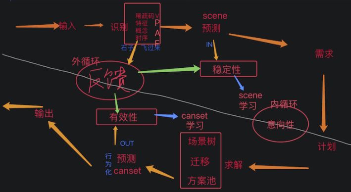

# 训练和修细节

***

<!-- TOC -->

- [训练和修细节](#训练和修细节)
  - [n32p01 继续修BUG和训练测试](#n32p01-继续修bug和训练测试)
  - [n32p02 多层子H任务嵌套时的H迁移](#n32p02-多层子h任务嵌套时的h迁移)
  - [n32p03 整理下：HE模型流程图](#n32p03-整理下he模型流程图)

<!-- /TOC -->

***

## n32p01 继续修BUG和训练测试
`CreateTime 2024.06.09`

```txt
32011-我特意加训了rCanset[饿,扔无皮果,飞至,吃],但rSolution就是激活不到它;
训练: 在FZ954x7基础上: 加训饿果飞吃三次后,存为:FZ955x3;
说明: 如下日志,rSolution激活到的,都是一些[硬扛],或者[饿,果,果],这些rCanset;
3. I<F4900 F8772[M1{↑饿-16},M1{↑饿-16},M1{↑饿-16},M1{↑饿-16}]> {0 = 3;} {} (null):(分:0.00)
4. I<F4900 F8798[M1{↑饿-16},M1{↑饿-16},M1{↑饿-16},M1{↑饿-16}]> {0 = 3;} {} (null):(分:0.00)
3. I<F3611 F6351[A13(饿16,7),A4899(距11,果),A4899(距11,果)]> {} {0 = S4P2;1 = S0P1;2 = S0P1;} H2N6:(分:0.25)
4. I<F3521 F5100[A13(饿16,7),A5099(向90,果),A5099(向90,果)]> {} {0 = S0P1;1 = S1P2;2 = S3P2;} H3N3:(分:0.50)
4. I<F3521 F5100[A13(饿16,7),A5099(向90,果),A5099(向90,果)]> {} {0 = S0P1;1 = S1P2;2 = S3P2;} H3N3:(分:0.50)
解决思路: 说白了,无论是错误还是正确的rCanset,都没有积累过SPEFF,导致对的没出头,错的又易胜出,所以搞下试错训练自然就好了,如下:
试错训练: `FZ954x7,饿,上方扔无皮果`,如果它激活硬扛等错误rCanset就会败北,如果它激活[无皮果,飞,吃]就能成功解;
具体实行: 打出flt日志,step1=激活行为化的rCanset,step2=feedbackTOR反馈,step2b=feedbackTOP反馈,step3a=OR反省,step3b=OP反省,从这5个日志观察整个rCanset从激活到最终SP反馈;
遇到问题: 在跑以上试错训练时,发现试错训练有点慢,虽然传染了,但只要SP不打负分,就相当于每次遇到任务时,都得重新来一遍 `此问题转32012`;
结果: 在32012写了OutSPDic后,Canset可以快速响应了,试错效率没啥问题了 `T 参考32012-结果`;
```

**小结: 上表在做试错训练,但并不顺利,问题如下 (此问题转下表解决,待解决后,再回来继续进行试错训练);**  

**问题: 因为SPEFF仅针对cs_besting的canset,导致那些cs_none状态的,在下次重启时又可以卷土重来,而真正有用的canset[无皮果,飞,吃]则很难有出头之日 (即试错效率太低);**

| 32012 | Canset池SPEFF试错效率太低 |
| --- | --- |
| 说明 | 见上表试错训练时-遇到问题: 传染只发生在工作记忆中,长时记忆的SPEFF又仅针对转实后的Canset,导致效率低下; |
| 方案 | 即使不转实,也可以累积SPEFF,这样可以从根本上解决试错效率低下的问题; |
| 实践 | 可以在sceneTo下,直接针对sceneFrom和cansetFrom记录SPDic,这样性能才ok,可不转实就批量记录SP参数; |
|  | > 借此机会把IN和OUT的SPDic分开 (IN是对scene存SP,OUT是对canset存SP); |
| TODO1 | 新写一个AIOutSPStrong(),把sceneFrom和cansetFrom存里面,然后把spDic也存里面 `T`; |
| TODO2 | 在AIFoNodeBase里加一个outSPDic<K=sceneFromPId_cansetFromPId, V=AIOutSPStrong> `T`; |
| TODO3 | 改下在生成xvModel前(更不需要等siModel),就把outSPDic初始一下 `T`; |
|  | 时机: 在构建canset到canset池时,把cansetFrom的spDic做为初始化outSPDic (加上防重,仅初始化一次) `T` |
|  | 更正: 把由spDic做初始,改成由sceneFrom中cansetFrom的outSPDic来初始 `T`; |
| TODO4 | 改下把中间帧超时反馈失败的 (及所有传染到的),在actYes超时未反馈后,计SP- `T`; |
| TODO5 | 改下把中间帧反馈成功的 (或被唤醒的),在feedbackTOR反馈匹配后,计SP+ `T`; |
|  | 另外: 其中唤醒的,应先把传染时的负1回滚一下,再把正1加上 `T`; |
| TODO6 | 改下把末帧超时未反馈负价值的 (及所有已达到末帧的canset),在actYes超时未反馈后,计SP+ `T`; |
| TODO7 | 改下把末帧反馈负价值的 (及所有已达到末帧的canset),在feedbackTOP反馈匹配后,计SP- `T`; |
| TODO8 | 把canset竞争由InSP改成由OutSP来计算 `T`; |
| 回测 | 继续上表末的试错训练: `试跑几次,饿,上扔无皮果`,看下canset的竞争情况会不会快速响应竞争变化; |
| 结果 | 经测跑三四次`饿,无皮果,飞,吃`后,是可以快速响应变化,使这些有用的canset快速具备竞争力 `存为FZ955x6`; |

**小结: 上表支持了OutSPDic,然后可以快速响应试错效率提升了,下面继续推进31183的训练项3;**

| 32013 | 在FZ955基础上接着继续31183-训练项3的`无皮果动机`及后续训练项 (参考31183) |
| --- | --- |
| 步骤 | 动物模式(`路边出生,饿,路上扔带皮果,扔棒去皮,手动飞至,触发吃掉`) x 路下n次 (注:鸟与果相对位置要稳定些) |
| 训练项1 | 测下hSolutionV3()能输出结果 `在31183已完成 T`; |
| 训练项2 | 测下newRCanst,absRCanset,newHCanset,absHCanset四个都能执行到 `在31183已完成 T`; |
| 训练项3 | 测下无皮果动机; |
|  | > 训练步骤 `FZ955x6,路下出生,点击饿` 日志如下 (说明: 可见能够得到无皮果动机); |
| 训练项4 | 学去皮: 学会去皮(压去皮) `T`; |
|  | > 训练步骤: 1.在去皮动机生成H无皮果后 2.扔有皮果 3.扔棒去皮 4.feedbackTOR反馈到无皮果 5.生成扔棒去皮H经验 |
|  | > 具体步骤: FZ944x4,路上出生,点击饿,在生成H无皮果后,扔有皮果,扔木棒去皮,上飞吃掉 => 存为944x5; |
|  | 说明: 如上日志,能够生成扔棒去皮H经验; |
| 训练项5 | 用去皮: 能生成H有皮果动机; |
| 训练项6 | 学搬运: 学会搬运(踢坚果); |
| 训练项7 | 用搬运: 使用搬运; |

```txt
3201x-接31184结果: 无皮果动机和有皮果动机,都需要加训和试错;
//1. 加训无皮果RCanset: 路下出生,扔路上无皮果,上飞至,吃掉;
//      > 目标: 使之能稳定的激活上面习得的rCanset[无皮果,飞至,吃掉],然后生成无皮果hDemand;
//2. 加训有皮果HCanset: 生成无皮果HDemand后,扔有皮果,扔木棒去皮,h无皮果反馈成立,生成无皮果hCanset;
//      > 目标: 使之能稳定的激活上面的hCanset[有皮果,木棒,无皮果],然后生成有皮果的hDemand;
//3. 试错训练: 然后试下,这么多各种canset,是否应该多淌一淌,把一条可行的路慢慢淌出来;

明日: 别着急,一步步来,先看下训练项3,无皮果动机是哪来的,是不是rCanset[无皮果,飞至,吃];
```

**小结: 上面针对31183中,训练不顺的那些训练项,制定了更为细节的训练规划;**

TODO测试项3: 测试RCanset有皮果反馈后,能不能继续推后进下一帧;

***

## n32p02 多层子H任务嵌套时的H迁移
`CreateTime 2024.06.09`

起因: 在上节最后的测试中,发现多层H嵌套时,H的迁移应该只支持一层 (测得不支持多层H迁移问题);
1. 原先写的是H的scene必然是rCanset
2. 但其实H的scene可能是baseH,不一定就是rCanset;

示例: H任务在工作记忆中是会多层嵌套的,比如:
1. 无皮果的HCanset为[有皮果,压,无皮果]
2. 然后它的有皮果又有子H任务[路边有皮果,踢,路中有皮果]

问题: 以前H的迁移比R多一层,在这里来看,这是不对的,H不止是一层,它可能多出多层 (因为子H可能嵌套多层);
1. 本节主要分析并支持这种多层下H迁移的情况;

| 32021 | 回顾现有代码之: 多层hCanset合并为单层rCanset; |
| --- | --- |
| 示图 |  |
| 说明 | 如图,H确实会嵌套,但它的成果会被打包成一个(合并)整体的rCanset; |
| 总结 | 多层H的成果确实是一个rCanset,但成果之前,它确实是多个h嵌套 (即`本表不妨碍本节的问题依然存在`); |

| 32022 | 回顾现有代码之: h迁移也是基于rScene树的; |
| --- | --- |
| 说明 | 现有代码中,H的迁移也是基于RScene树来进行的,所以H也许不会有多层嵌套的问题; |
| 解释 | 即无论H有多少层嵌套,它在长时记忆中都是场景树,比R多一层而已; |
| 结果 | 本表可见,本节多层子H嵌套的问题压根不存在; |

**小结: 从32022的结果可见,本节的问题应该是不存在的,中止之;**

***

## n32p03 整理下：HE模型流程图
`CreateTime 2024.06.15`

| 32031 | HE流程图 |
| --- | --- |
| 彩图 |  |
| 说明 | https://www.bilibili.com/video/BV1Xw4m1e7RH/ |
| 注1 | 反馈由外循环推动(现实与智能体循环),意向性推动了内循环(认知与决策循环); |
| 注2 | 识别与求解相对,识别是IN阶段的展开,求解是OUT阶段的展开; |
| 注3 | 此图临时起意,细节上用的名词等并不严谨,但与HE代码的流程是一致的,不影响"表达和理解"其意; |

**小结: 最近试用了一下B站直播功能,分享了HE流程图,顺便把以上模型图画了下;**

<br><br><br><br><br>
