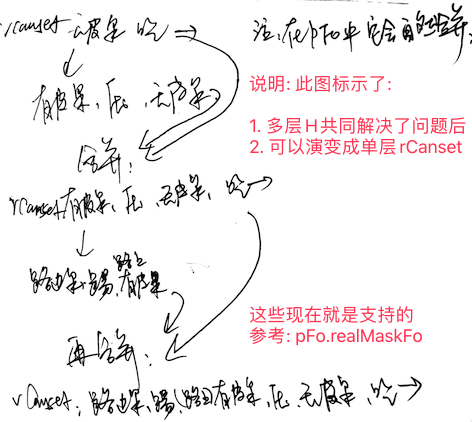
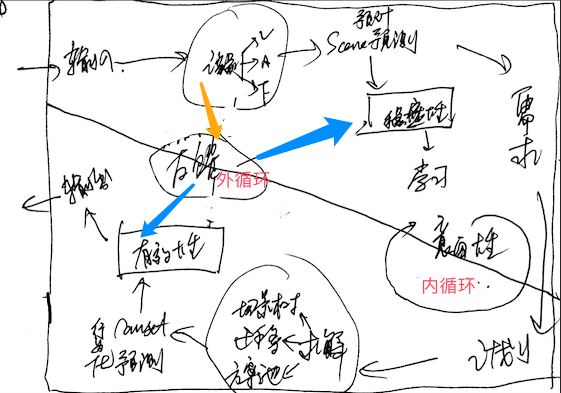

# 训练和修细节

***

<!-- TOC -->

- [训练和修细节](#训练和修细节)
  - [n32p01 继续修BUG和训练测试](#n32p01-继续修bug和训练测试)
  - [n32p02 多层子H任务嵌套时的H迁移](#n32p02-多层子h任务嵌套时的h迁移)
  - [n32p03 整理下：HE模型流程图](#n32p03-整理下he模型流程图)

<!-- /TOC -->

***

## n32p01 继续修BUG和训练测试
`CreateTime 2024.06.09`

```txt
32011-我特意加训了rCanset[饿,扔无皮果,飞至,吃],但rSolution就是激活不到它;
训练: 在FZ954x7基础上: 加训饿果飞吃三次后,存为:FZ955x3;
说明: 如下日志,rSolution激活到的,都是一些[硬扛],或者[饿,果,果],这些rCanset;
3. I<F4900 F8772[M1{↑饿-16},M1{↑饿-16},M1{↑饿-16},M1{↑饿-16}]> {0 = 3;} {} (null):(分:0.00)
4. I<F4900 F8798[M1{↑饿-16},M1{↑饿-16},M1{↑饿-16},M1{↑饿-16}]> {0 = 3;} {} (null):(分:0.00)
3. I<F3611 F6351[A13(饿16,7),A4899(距11,果),A4899(距11,果)]> {} {0 = S4P2;1 = S0P1;2 = S0P1;} H2N6:(分:0.25)
4. I<F3521 F5100[A13(饿16,7),A5099(向90,果),A5099(向90,果)]> {} {0 = S0P1;1 = S1P2;2 = S3P2;} H3N3:(分:0.50)
4. I<F3521 F5100[A13(饿16,7),A5099(向90,果),A5099(向90,果)]> {} {0 = S0P1;1 = S1P2;2 = S3P2;} H3N3:(分:0.50)
解决思路: 说白了,无论是错误还是正确的rCanset,都没有积累过SPEFF,导致对的没出头,错的又易胜出,所以搞下试错训练自然就好了,如下:
试错训练: `FZ954x7,饿,上方扔无皮果`,如果它激活硬扛等错误rCanset就会败北,如果它激活[无皮果,飞,吃]就能成功解;
具体实行: 打出flt日志,step1=激活行为化的rCanset,step2=feedbackTOR反馈,step2b=feedbackTOP反馈,step3a=OR反省,step3b=OP反省,从这5个日志观察整个rCanset从激活到最终SP反馈;
遇到问题: 在跑以上试错训练时,发现试错训练有点慢,虽然传染了,但只要SP不打负分,就相当于每次遇到任务时,都得重新来一遍 `此问题转32012`;
```

**小结: 上面是测得的bug,但还没修好;**

| 32012 | Canset池SPEFF试错效率太低 |
| --- | --- |
| 说明 | 见上表试错训练时-遇到问题: 传染只发生在工作记忆中,长时记忆的SPEFF又仅针对转实后的Canset,导致效率低下; |
| 方案 | 即使不转实,也可以累积SPEFF,这样可以从根本上解决试错效率低下的问题; |

```txt
3201x-接31184结果: 无皮果动机和有皮果动机,都需要加训和试错;
//1. 加训无皮果RCanset: 路下出生,扔路上无皮果,上飞至,吃掉;
//      > 目标: 使之能稳定的激活上面习得的rCanset[无皮果,飞至,吃掉],然后生成无皮果hDemand;
//2. 加训有皮果HCanset: 生成无皮果HDemand后,扔有皮果,扔木棒去皮,h无皮果反馈成立,生成无皮果hCanset;
//      > 目标: 使之能稳定的激活上面的hCanset[有皮果,木棒,无皮果],然后生成有皮果的hDemand;
//3. 试错训练: 然后试下,这么多各种canset,是否应该多淌一淌,把一条可行的路慢慢淌出来;

明日: 别着急,一步步来,先看下训练项3,无皮果动机是哪来的,是不是rCanset[无皮果,飞至,吃];
```

**小结: 上面针对31183中,训练不顺的那些训练项,制定了更为细节的训练规划;**

TODO测试项3: 测试RCanset有皮果反馈后,能不能继续推后进下一帧;

***

## n32p02 多层子H任务嵌套时的H迁移
`CreateTime 2024.06.09`

起因: 在上节最后的测试中,发现多层H嵌套时,H的迁移应该只支持一层 (测得不支持多层H迁移问题);
1. 原先写的是H的scene必然是rCanset
2. 但其实H的scene可能是baseH,不一定就是rCanset;

示例: H任务在工作记忆中是会多层嵌套的,比如:
1. 无皮果的HCanset为[有皮果,压,无皮果]
2. 然后它的有皮果又有子H任务[路边有皮果,踢,路中有皮果]

问题: 以前H的迁移比R多一层,在这里来看,这是不对的,H不止是一层,它可能多出多层 (因为子H可能嵌套多层);
1. 本节主要分析并支持这种多层下H迁移的情况;

| 32021 | 回顾现有代码之: 多层hCanset合并为单层rCanset; |
| --- | --- |
| 示图 |  |
| 说明 | 如图,H确实会嵌套,但它的成果会被打包成一个(合并)整体的rCanset; |
| 总结 | 多层H的成果确实是一个rCanset,但成果之前,它确实是多个h嵌套 (即`本表不妨碍本节的问题依然存在`); |

***

## n32p03 整理下：HE模型流程图
`CreateTime 2024.06.15`

| 32031 |
| --- |
|  |


<br><br><br><br><br>
