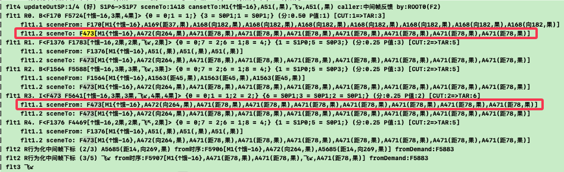
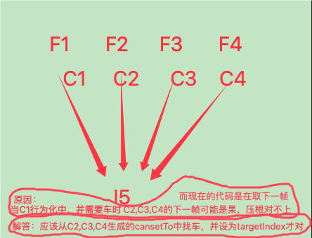
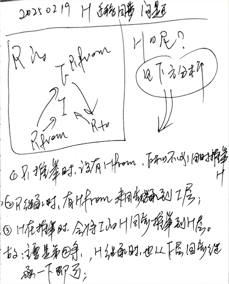
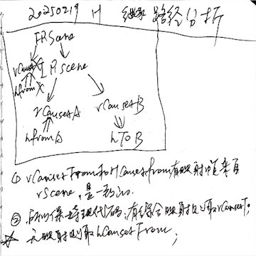
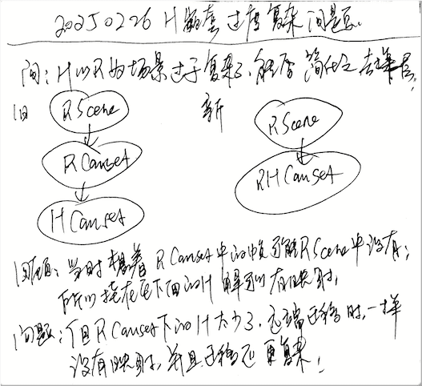

# (觅食 & 飞躲 & 踢搬运)三项的多向连续训练,以及三项融合训练

在前面,已经学会搬运,且会用搬运来踢坚果到路上,至此所有单轮的训练项目全部通过了,以下开始对这些项目进行连续行为训练,以及融合在一起训练等;

***

<!-- TOC -->

- [(觅食 & 飞躲 & 踢搬运)三项的多向连续训练,以及三项融合训练](#觅食--飞躲--踢搬运三项的多向连续训练以及三项融合训练)
  - [n33p01 回顾多向觅食训练之: (FZ981学无距有向果场景B & FZ982各方向学飞吃)](#n33p01-回顾多向觅食训练之-fz981学无距有向果场景b--fz982各方向学飞吃)
  - [n33p01b 回顾多向觅食训练之: FZ983试错训练-修测到的BUG(第一批)](#n33p01b-回顾多向觅食训练之-fz983试错训练-修测到的bug第一批)
  - [n33p02 完善TCPlanV2流程细节](#n33p02-完善tcplanv2流程细节)
  - [n33p03 回顾多向觅食训练之: 继续测FZ983试错训练-修测到的BUG(第二批)](#n33p03-回顾多向觅食训练之-继续测fz983试错训练-修测到的bug第二批)
  - [n33p04 回顾多向觅食训练之: 继续FZ983试错训练](#n33p04-回顾多向觅食训练之-继续fz983试错训练)
  - [n33p05 迭代Canset类比算法](#n33p05-迭代canset类比算法)
  - [n33p06 测修outSPDic的多个错误](#n33p06-测修outspdic的多个错误)
  - [n33p06b 改下反思评价的公式](#n33p06b-改下反思评价的公式)
  - [n33p07 启用反思子任务: 迭代TCPlan支持反思子任务](#n33p07-启用反思子任务-迭代tcplan支持反思子任务)
  - [n33p08 启用并迭代前段条件满足](#n33p08-启用并迭代前段条件满足)
  - [n33p09 回顾多向觅食训练之: 继续FZ1003试错训练 & 回测以上三大改动](#n33p09-回顾多向觅食训练之-继续fz1003试错训练--回测以上三大改动)
  - [n33p10 回顾多向觅食训练之: 继续FZ1003试错训练 & 回测outSPDic和竞争效果](#n33p10-回顾多向觅食训练之-继续fz1003试错训练--回测outspdic和竞争效果)
  - [n33p11 时序识别似层化 & 迭代迁移:将BFI分成BF和FI两步](#n33p11-时序识别似层化--迭代迁移将bfi分成bf和fi两步)
  - [n33p12 TCTransfer支持多层H](#n33p12-tctransfer支持多层h)
  - [n33p13 回测试错训练，测二次过滤后多样性(主要是有向无距场景)消失BUG](#n33p13-回测试错训练测二次过滤后多样性主要是有向无距场景消失bug)
  - [n33p14 继续回测试错训练，测`有向无距场景`的竞争浮现](#n33p14-继续回测试错训练测有向无距场景的竞争浮现)
  - [n33p15 明确和完善：H迁移延着R迁移关联进行](#n33p15-明确和完善h迁移延着r迁移关联进行)
  - [n33p15B 迭代hSolutionV4：扩大求解范围和修正迁移路径](#n33p15b-迭代hsolutionv4扩大求解范围和修正迁移路径)
  - [n33p16 继续回测试错训练，测`有向无距场景`的竞争浮现](#n33p16-继续回测试错训练测有向无距场景的竞争浮现)
  - [n33p17 简化H嵌套](#n33p17-简化h嵌套)

<!-- /TOC -->

***

## n33p01 回顾多向觅食训练之: (FZ981学无距有向果场景B & FZ982各方向学飞吃)
`CreateTime 2024.08.09`

训练就两个方法: 一是教的多,二是练的多;

| 33011 | 尝试训练觅食-初步规划大岗 |
| --- | --- |
| 1. 学飞 | 8个方向一步远位置各扔下无皮果,引至吃掉 |
| 2. 试错 | 8个方向一步远位置各扔下无皮果,点击饥饿,试错尝试; |

| 33012 | 尝试训练觅食-训练方法分析 |
| --- | --- |
| 原则 | **训练就俩方法: 一是教,二是练**; |
| 教 | 即: 最基本的经历(比如: 能够抽象出无距方向坚果的场景 & 在反射反应中各个方向都飞过); |
| 练 | 即: 先给个简单的的场景(比如: 坚果扔近些,让它试错,让正确飞行方向的Canset能优胜出); |

| 33013 | 尝试训练觅食-学无距有向果场景 |
| --- | --- |
| 目标 | 先习得`8个方向无距坚果`的场景; |
| 回顾 | 经查871,882,913,这前三步的训练,都没有各方向无皮果训练的步骤; |
| 步骤 | **无皮学饿: 认知模式(`饿(持续饿感3次),扔随机无皮坚果,不吃,又饿`x50轮);** => |
| 强训 | 参考RLT工具中现在已经有`学饿`和`学吃`两个强训项 (参考28172-第1步&第2步); |

**小结: 上面三表,从大岗到实际尝试`训练觅食`,测得时序识别同质化严重的问题,转下表先修一下;**

| 33014 | BUG: 测得时序识别结果同质化严重 |
| --- | --- |
| 描述 | 在上表训练中,时序识别结果20条全是`[饿]->{更饿}`; |
| 问题 | 而我们希望它能训练出`无距有向果`场景,现在连识别都识别不到,谈何抽象出`无距有向果`场景呢? |
| 白话 | 说白了,这会导致智能体刻板固化,不易接受新事物(新场景难出头,更难类比抽象); |
| 说明 | 它识别的全是[饿]->{更饿},并且它们强度一个比一个强,所以`带方向果`的永无出头之日; |
| 分析 | 现在时序没有防重功能,导致同质化严重,同样的饿->更饿能占满20条,即因为此; |
| 方案1 | 场景时序加上全局防重功能 `95%`; |
|  | > 全局防重倒是简单可行,只需要参考当时概念全局防重: 在构建时,优先取本地已有的一模一样的时序即可; |
| 方案2 | 同质时序在识别结果中互斥 `5%`; |
|  | > 互斥很难判断,比如indexDic全含,且有共同的抽具象关系,算互斥吗?或者说相似度达到怎样算互斥? |
| 实践 | 暂选定方案1进行实践: 参考概念全局防重,为场景时序构建时,也加上相应的防重功能即可; |
| 结果 | 经查,原本就有防重功能,只是构建`最具象时序protoFo`时,有些没调用防重方法,全改成调用即可 `T`; |

**小结: 33014中,把时序识别同质化严重的问题修了下 (打开了protoFo构建时的全局防重),下表继续回归训练觅食;**

| 33015 | FZ981-尝试训练觅食-学无距有向果场景B |
| --- | --- |
| 说明 | 因为protoFo未防重的BUG影响到FZ97,所以本表重新从第1步训练FZ98; |
| FZ981 | 用强训工具训练`无皮学饿` (参考33013-步骤) `存为FZ981`; |
| 训练步骤 | `饿,扔随机坚果,不吃,又饿` x 50轮; |
| 回测 | `FZ981,饿,随便扔个果`,观察概念识别和时序识别结果,如下: |
|  | 1. 概念识别结果中: 无向果 或 无距果 两种都有了; |
|  | 2. 时序识别结果中: 无向果场景 或 无距果场景 或 无距无向果场景 三种都有了 (参考33015-代码段1); |
| 问题 | 虽然A和F识别都ok了,不过时序识别在二次过滤后: 未识别到`无距有向果场景`结果 (参考33015-代码段2); |
| 结果 | 将问题修复后,重新训练FZ981完成 `T`; |

```java
33015-代码段1: 训练日志分析 ==> 这个代码段主要是33015-回测的从时序识别日志中摘出;
经查1: 从时序识别结果看: protoFo:[饿果]-> 和 protoFo:[饿果果]-> 没有识别结果 (时序识别到0条);
经查2: 反而,饿果果果 & 饿果果果果 & 饿果果果果果 & 饿果果果果果果 & 饿果果果果果果果 & 饿果果果果果果果饿果 & 饿果果果果果果果饿果果 ... 都有识别结果;
    > 应该是因为只识别有mv指向的结果,而连续视觉中,只要更饿发生了,就肯定已经看了3帧以上的`果`了,前两帧时,还没更饿,所以也没法识别到,这是正常的;

成果1: 像无向果场景也可以识别到 => "2. P强度:(106)    > F1951[M1{↑饿-16},A1950(距90,果),A1950(距90,果),A1950(距90,果)]->{-6.54}";
成果2: 像无距果场景也可以识别到 => "0. P强度:(2060)    > F31[A30(向189,果),A30(向189,果),A30(向189,果),A30(向189,果)]->{-4.29}";
成果3: 像无向无距果场景也可以识别到 => "3. P强度:(289)    > F1654[M1{↑饿-16},A49(,果),A49(,果),A49(,果)]->{-2.49}";
结果: 如上日志3个成果可见,时序识别已经ok了,无距有向果场景,已经抽象到了,也能识别到了 `T`;
```

```java
33015-代码段2: 测得识别问题 ==> 在时序识别二次过滤后,没有`无距有向果场景`的结果;
时序二次过滤后条数: 原20 剩5 >>>>>>>>>>>>>>>>>>>>>>>>>>>>>>>>>>>>>>>>>>>>>
	1. F956[M1{↑饿-16},A932(距90,向161,果),A932(距90,向161,果),A932(距90,向161,果)]
	2. F935[M1{↑饿-16},A932(距90,向161,果),A932(距90,向161,果),A932(距90,向161,果)]
	3. F443[M1{↑饿-16},A436(距67,向174,果),A436(距67,向174,果),A436(距67,向174,果),A436(距67,向174,果),A436(距67,向174,果),A436(距67,向174,果),A436(距67,向174,果)]
	4. F52[M1{↑饿-16},A51(向182,果),A14(距121,向170,果),A14(距121,向170,果),A14(距121,向170,果),A14(距121,向170,果),A14(距121,向170,果),A14(距121,向170,果),A14(距121,向170,果)]
	5. F28[M1{↑饿-16},A12(距100,向182,果),A14(距121,向170,果),A14(距121,向170,果),A14(距121,向170,果),A14(距121,向170,果),A14(距121,向170,果),A14(距121,向170,果),A14(距121,向170,果)]
结果: 经查是因为二次过滤算法,只针对PJ似层,把交层全给过滤掉了 `已修复 T`;
```

**小结: 以上33015做了第1步FZ981学饿,并且已经可以顺利抽象出`无距有向果场景`,下面继续在这个基础上做第2步`学吃训练`**

| 33016 | FZ982-尝试训练觅食-各方向学飞吃 |
| --- | --- |
| FZ982 | 学一下向8个方向的飞,和靠飞可以改变距离,解决吃到坚果的距离问题,存为FZ982 |
| 步骤初定 | 手动训练: 8个方向一步远位置各扔下无皮果,引至吃掉 |
| 步骤分析 | 刚开始还是多做些原始积累,用强化训练来跑比较好,并且手把手教的太多也不太好,像婴儿一样让它自己学步比较好; |
| 训练步骤 | `饿,扔附近坚果,随机连飞3下(如飞中吸吮反射)` x 100轮 (参考28173-2学飞); |
| 重点关注 | 打出flt日志,观测在预测会更饿,然后飞吃到坚果后,习得newRCanset; |
| 结果 | 经查日志,newRCanset执行了很多,因为是认知模式,没有跑absRCanset,等FZ983时,再测absRCanset; |

**小结: 做了FZ982训练完成,下面做FZ983试错训练;`**

***

## n33p01b 回顾多向觅食训练之: FZ983试错训练-修测到的BUG(第一批)
`CreateTime 2024.08.18`

| 33017 | FZ983-尝试试错训练-各方向自行飞吃 |
| --- | --- |
| FZ983 | 8个方向方向扔下无皮果,然后让它自己决策行为飞吃; |
| 训练步骤1 | 附近一飞距离手动扔无皮果,然后观察它能不能越来越准确的飞正确方向; |
| 训练步骤2 | 远距离手动扔无皮果,然后观察它能不能自行准确的飞吃到坚果; |
| 重点关注 | 1.观察下各个RCanset的SP值; 2.观察下在求解时RCanset正确时,能触发类比并生成AbsRCanset; |
| 训练记录 | 第1次: 饿,扔右上无皮果,它自行右下飞,上飞,上飞,吃了果; |
|  | 第2次: 饿,扔上方无皮果,它自行上飞,吃了果; |
| 明日 | 重点观察下,让sceneFrom和sceneTo都是带无距有向果的场景,不然正确再多,也只是蒙中了而已; |
|  | 或者,即使Root是无向的,它的子H任务也得有向 (必须有向场景,才能有正确的Canset行为化,才能输出正确飞的方向); |

**小结: 试错训练并不顺利,下面几个BUG都是因为试错训练不顺利来的;**

```java
33018-BUG回测发现RCanset跳过了飞 `T 不是BUG,见结果`
=============================== 5 rSolution ===============================
任务源:饿 protoFo:F5923[M1{↑饿-16},A3442(向135,距12,果),M1{↑饿-16},A3442(向135,距12,果)] 已有方案数:0 任务分:-3.93
第7步 R排除Infected传染掉的:53
R0. I<F1418 F3788[↑饿-16,2果,飞↙,2果]> {0 = 0;1 = 1;2 = 3;}  H4N0:(分:1.00) [CUT:3=>TAR:4]
R1. I<F1568 F3789[↑饿-16,3果,飞↙,3果]> {0 = 0;1 = 1;2 = 3;}  H4N0:(分:1.00) [CUT:3=>TAR:4]
复现: FZ982,饿,附近扔无皮果 -> 然后看rSolution日志即可看到;
说明: 如上日志,所有RCanset的CUT就是第四帧(下标3),而第四帧就是最后一帧,即它没行为化任何东西,直接等待末帧mv自然不发生;
问题: 这显然不对,这种RCanset没有飞行,是不可能成功的,它的前段条件判断有问题;
回顾: 上次原本就把前段条件满足给弃掉了,所以这个BUG我们正好想一下,是否应该重新打开前段条件满足 (上回是用场景满足替代了前段条件满足);
思路: 查下,为什么这里的CUT是3,它应该是1才对吧;
    > 日志1. sceneFrom: F1568[M1{↑饿-16},A1563(距45,果),A1563(距45,果)]
    > 日志2. cansetFrom: F3789[M1{↑饿-16},A1563(距45,果),飞↙,A1563(距45,果)]
说明: 如上日志可见: sceneFrom中确实发生两帧无皮果,所以对应到cansetFrom确实是在方向之后了,没啥BUG;
    > 日志3. sceneFrom: F1418[M1{↑饿-16},A51(,果),A51(,果)]
    > 日志4. cansetFrom: F1841[M1{↑饿-16},A51(,果),A51(,果),飞↘,A1838(距7,向286,果)]
说明: 如上日志可见: 也有些sceneFrom的cansetFrom中的飞是在CUT之后的 (即可以正常输出飞行行为的);
结果: 所以,此BUG不算BUG,只是有一些无效的canset还没被否掉罢了,等它们都被否了,自然就有可以输出飞行行为的canset可被激活 `T 不是BUG,不必修,继续33017试错训练`;
```

| 33019 | BUG2-Root无法持续激活,导致来不及p反省负SPEFF,就不激活了 |
| --- | --- |
| 起因 | 试错训练时,无向场景,下的cansetFrom应该被SP否掉,直至无法激活; |
|  | 但训练时: RCanset:F1418被激活许多次,也没能飞对方向解决饥饿问题,但P反省的负SPEFF日志一直没执行到; |
| 说明 | 现在在持续视觉后,其实像[无皮果,飞,吃]这样的Canset里的这几帧都很容易被反馈到,但它即使全反馈了也未必有效; |
|  | 比如: 一个无向场景,它下面的Canset可能飞向任何方向,但这个方向是错误的,此时即使全反馈到Canset执行完成,也无效; |
| 问题 | 这导致一个Root即使R帧推进再顺利,P末帧反馈也无效,但现在的BUG是`它没有执行到P反省负SPEFF`; |
| 调试 | Root1激活后,执行一两轮行为化,大概能飞一下,然后就成了被传染状态,在计算任务进度分时,传染状态会跳过; |
|  | 导致,Root1被传染了,它的进度分是0,也就没啥竞争力,导致无法激活了,此时还没到执行p反省的时候,所以没法计负; |
|  | 导致,试错训练中,无论怎么跑,它都`没起到试错的作用`; |
| 日志 | R行为化中间帧下标 (3/5) 飞↑ from时序:F2236[↑饿,果,果,飞↑,A2233(果)] fromDemand:F8414 |
|  | R行为化中间帧下标 (4/5) A2233(距0,向103,果) from时序:F2236[↑饿,果,果,飞↑,A2233(果)] fromDemand:F8414 |
|  | R行为化末帧下标 (4/4)  from时序:F6341[M1{↑饿-16},A51(,果),飞↑,A51(,果)] fromDemand:F8428 |
|  | 说明: Root任务F8414激活两次后,就没再激活了; |
| 思路 | 说白了,还是Root任务的竞争问题,以前的做法是:`任务1静默等待时,会执行任务2`; |
|  | 问题-而这一做法导致饥饿Root1静默了,饥饿Root2继续尝试,依此类推,没一个Root能跑到P反省负SPEFF; |
| 方案1 | 同区任务应该互斥,非同区任务不排斥; |
|  | 1. 情况1-即一个饥饿任务在静默等待时,别的饥饿任务也不应该执行; |
|  | 2. 情况2-而饥饿任务在静默等待时,非饥饿的任务应该可以先执行; |
| 方案2 | 所有任务都不排斥; |
|  | 1. 在此方案下,如果饥饿任务最迫切并竞争取胜激活了,并且此任务在静默等待状态,那么别的任务全等着不允许执行; |
|  | 2. 除非`危险任务`更强,它最迫切并取胜激活了,才可以跨过饥饿,先执行危险任务; |
| 抉择 | 方案1看似更应对所有情况,实际方案2更简单直白,方案2也可以应对所有情况,所以先选用方案2; |
|  | 如果以后方案2发现不够用,再回来考虑方案1; |
| 实践 | TODO1-在Canset被传染后,或者状态非ActYes或Runing时,也计进度分 `T`; |
|  | TODO2-在TCPlan中,如果Root1是静默状态(或者被传染状态),那么这轮TO线程就空转啥也不跑; |
| 结果 | TODO1做了,而TODO2的问题在于`TCPlan在各种状态下要跑哪个`,这个 `转n33p02里整体完善下细节 T`; |

* **3301a: BUG3-接上表,即使Root可以持续激活,它的RCanset也没能持续激活,而是激活的RCanset在不断变化;**
- 问题: 这种RCanset不断变化,会导致它不断左突右试,各种乱飞,即使这些RCanset全都不对;
- 目标: 查下这个BUG,让它能随着稳定的一个RCanset从执行到反省SPEFF,该静默就静默等待,等一条噶了,再试下一条;
- 思路: 调试下代码,查下为什么RCanset在不断变 (以下以行为化F2236为例,查它为什么在执行行为化后,又噶了);
  - `R行为化中间帧下标 (3/5) 飞↑ from时序:F2236[M1{↑饿-16},A51(,果),A51(,果),飞↑,A2233(距0,向103,果)]`
- 调试: 以下两种情况(F2236被改成了ActNo或WithOut状态),这两种状态都会导致在实时竞争中,它直接被过滤掉 (噶掉);
  - 调试情况1. 有一次是第四帧A2233果超时了,它自然在OR反省中,计为ActNo状态了;
    - `在ReasonOutRethink反省后 solution:F2236 因超时无效而set actYes to actNo————>`
    - 分析: 这种情况下,F2236应该计了负SPEFF,是正常的;
  - 调试情况2. 还有两次,是因为第三帧飞,没生成SubHDemand (导致了在TCPlan.112行中,它因无HDemand直接计为WithOut状态 ();
    - 分析: 这种情况应该不正常,像F2236的第三帧是飞行为输出,它是不会生成子HDemand任务的;
- 结果: 这里像`中间帧超时在TCPlanV2的处理,或者中间帧是Out行为在TCPlanV2中的处理`等等 `转n33p02完善下TCPlanV2的细节 T`;

**小结: 本节试错训练不顺利,在试错训练中,测到多个bug,最终指向了前段时间迭代的TCPlanV2还有一些细节问题,转下表继续;**

***

## n33p02 完善TCPlanV2流程细节
`CreateTime 2024.08.27`

在上节33019&3301a的结果中,测得多种情况或状态下,TCPlanV2现代码对这些情况处理的不太清晰,所以本节把TCPlanV2整理下各种行为化情况,时下一步走向哪里,完善完善细节 (因为原来迭代TCPlanV2时是单纯的迭代完了,却没测,现在算是测下,并看哪里有问题,完善下细节);

```java
33021-现在测到的要完善哪些细节问题;
回顾: 现TCPlanV2代码没考虑末帧时的情况,也没考虑中间帧是Out时的情况,本节都补上;
说明: 下面是把这些完善细节后的伪代码整理如下:
//6. 三种情况,分别走三块不同逻辑;
if (canset已经到了末帧) {
    //一. ================================ 末帧 ================================

    if (bestCanset.feedbackMvAndPlus)
    //11. 好的mv反馈,说明当前rRootDemand被解决了,不需要再决策 => 继续尝试下一root;

    else if (bestCanset.feedbackMvAndSub && 是持续性任务)
    //12. 坏的mv反馈: 如果是持续性任务,则该canset失败,继续尝试下一canset;

    else if (bestCanset.feedbackMvAndSub && 非持续性任务)
    //13. 坏的mv反馈: 如果非持续性任务,则该root失败 => 继续尝试下一root;

    else if (!bestCanset.actYesed && !bestCanset.feedbackMv)
    //14. 还在等待mv反馈中 => 则继续等待即可;

    else if (bestCanset.actYesed && !bestCanset.feedbackMv)
    //15. 等待结束,避免负mv成功,则该任务完成 => 继续尝试下一root;
} else if (frameAlg.content_p.isOut) {
    //二. ================================ 中间帧_Out ================================

    if (frameAlg.actYesed && !frameAlg.feedbackAlg) //21. actYesed && !feedbackAlg -> 当前行为输出到期也没等到反馈: 把当前bestCanset否掉,重新找出下一个bestCanset,转下一个canset;

    if (frameAlg.feedbackAlg) //22. feedbackAlg -> 则应该在feedbackTOR()中已经转了下一帧,但如果这里如果取curFrame,发现有反馈,还没转,则先不管它,啥不也不执行吧,等它自己转下一帧 (不管什么状态,只要已经反馈了,就都走这里);

    if (!frameAlg.actYesed) //23. 等待中的isOut帧,没有subH,只需要等肢体动作执行完成再转输入rInput后,会反馈成功,还在等待说明还没触发,继续等着即可 (行为输出也是需要时间的,比如飞要0.2s,再静默等等) (参考3301a-调试情况2);

} else {
    //三. ================================ 中间帧_非Out ================================

    if (frameAlg.actYesed && !frameAlg.feedbackAlg) //31. actYesed && !feedbackAlg -> 当前行为输出到期也没等到反馈: 把当前bestCanset否掉,重新找出下一个bestCanset,转下一个canset;

    if (frameAlg.feedbackAlg) //32. feedbackAlg -> 则应该在feedbackTOR()中已经转了下一帧,但如果这里如果取curFrame,发现有反馈,还没转,则先不管它,啥不也不执行吧,等它自己转下一帧 (不管什么状态,只要已经反馈了,就都走这里);

    if (!subHDemand) //33. 非Out帧等待中,则尝试subH求解 -> 防空检查 (非输出帧的subH不应该为空,没有hDemand是BUG,因为algModel初始时,就有hDemand了) (subH为空时,那这条Canset失败,继续尝试baseDemand的下一条 (逐条尝试))

    if (!subHDemand.alreadyInitCansetModels) //34. subH没求解过,则尝试对subH求解: 成功: 当前条 -> hDemand没初始化过,直接return转hSolution为它求解;

    //35. subH求解过,则subH继续深入下一层: 继续: 下一层 -> 当前条继续向枝叶规划;
    BOOL success = [self plan4Cansets:subHDemand complate:complate prefixNum:prefixNum + 2];

    if (!success && !frameAlg.actYesed) //36. 如果subH求解全失败了,则咱不解了,咱等着即可,看它能不能自行反馈到,则继续等 -> 如果bestCanset枝叶全失败了,还是静默等等状态,直接返回成功,啥也不用干 (比如: 等饭熟,有苹果也会先吃一个垫垫);

    if (!success && frameAlg.actYesed) //37. 如果subH求解全失败了,它的等待时间也结束了,则当前bestCanset计为失败: 驳回: 下一条 -> 当前hDemand的枝叶全失败了,继续尝试baseDemand的下一条 (逐条尝试);
}
```

**总结: 本节完善了TCPlanV2的细节,下表继续回归FZ983试错训练;**

***

## n33p03 回顾多向觅食训练之: 继续测FZ983试错训练-修测到的BUG(第二批)
`CreateTime 2024.08.30`

上节完善了TCPlanV2的细节,本节回归多向觅食训练之: 试错训练;

重点. 本节重点关注:
1. 观察一下canset竞争因为SP在试错时的计数变化正常;
2. 观察一下有效时,触发absCanset类比,类比的结果正常;

| 33030 | 测试试错的训练步骤 |
| --- | --- |
| 步骤 | 饿,右侧(或下方)附近扔无皮果,让它自己试飞,如果飞错飞远了,就把它再给拉到附近来,让它继续试; |
| 结果 | 结果它错一两次后,是可以试到正确的飞行方向,然后下回也会这么飞; |
| 总结 | 但这不能说明它试错训练都顺了,这还差多呢,不过目前这种: 能帮我们在本节中测bug就行; |

| 33031 | 在FZ982的基础上,继续做试错训练,并观察日志还有没什么问题 |
| --- | --- |
| BUG1 | 测得SP有重复计数的问题 (比如饥饿任务求解中,又更饿了很多次,此时末帧S就重复执行了多次) `T`; |
|  | fix1: 写一个方法,防止SP计数重复 (只记一次) `T 参考checkAndUpdateOutSPStrong()`; |
| BUG2 | 测得SP有冲突计数的问题 (比如无皮果没反馈计了S,过了一会又反馈了计了P,此时S要回滚掉) `T`; |
|  | 回顾: 以前就有回滚,但写的比较乱,执行起来也许多问题 (比如重复执行多次,只回滚一次等问题); |
|  | fix2: 改为写个方法S/P换了时,就把已经记录的P/S回滚 `T 参考checkAndUpdateOutSPStrong()`; |
| 问题3 | rCanset在推进到中途时,提前反馈了负mv 或 正mv,此时是否应该提前为末帧SP计数; |
|  | 方案: 改为在正mv 或 负mv发生时,即使canset没推进到末帧,也把feedbackMv记录下来,并且为末帧SP计数+1; |
|  | TODO3: 把pInput中正mv输入给持续性任务后调用feedbackTOP 和 feedbackTOP中改为不再限制必须已经到末帧; |
|  | TODO4: scene预测也要支持mv提前反馈的情况 (即feedbackTIP支持); |
|  | 回顾: 现在的做法是: 当mv提前发生时,会为其生成新的scene或canset,并触发类比抽象 `T 所以此问题不必解决`; |
|  | 结果: 即提前反馈mv可以不处理,为其构建新fo,并且触发类比构建新的absFo,也是一样的,何必支持提前反馈多此一举 `T`; |
|  | 总结: 问题3已经分析了方案和TODOLIST,但在代码中又发现,这个不需要修 `T 不用修`; |
| 小结 | 上面,修复了前两个问题,第3个问题不算问题 `T`; |
| BUG4 | 吃到一个坚果后,它还在飞,按道理说,正mv反馈会导致所有的饥饿Root任务全失效,应该不会再飞了 `T`; |
|  | 分析: 在吃到后,再立马又预测到了饥饿,此时又生成Root,又开始决策解决饥饿问题; |
|  | fix1: 在吃到后(正mv输入)后,如果它再输入新的饥饿Root,则针对旧的Root中有expired4PInput状态,做下防重即可 `T`; |
| 结果 | 这四个bug不算啥,各个修了即可 `T`; |

| 33031b | BUG5: 广传染&窄计数 (BUG5比较涉及改动多些,见本表内容) |
| --- | --- |
| 注意 | 本表的修复过程,是在边试错训练,边修改本表BUG的,即深入到训练中,发现问题,修改细节规则的此BUG5; |
| BUG5 | 最优RCanset往往没任何Out帧,导致它往往半天愣着不动,然后等这些慢慢都pass掉许多,才遇到有Out帧的RCanset,才飞动起来; |
|  | 简述: 此BUG5用于解决:哪些该传染,哪些该SP计数,**使RCanset可以更充分的竞争,又可以使TO思维顺当跑起来**; |
|  | 1. 矛盾: 这里的矛盾是传染时,如果也更新SP,则好像SP被轻易妄动了; |
|  | 2. 相对: `传染状态用于短时程: 快速影响思维` & `SP用于长时程些: 影响今后`; |
|  | 3. 协作: 传染状态使思维快速响应变化,而SP主打影响今后的思维 `实践转TODO4`; |
|  | 4. 原则: 即`广传染+窄计数`原则,内存广传染是为了更快思维响应,硬盘窄计数是为了更准确的判其可行性; |
|  | 回顾: 查下新生成的RCanset,它的末帧SP是1分,还是0.5分 (默认的应该是0.5才对,不然会导致新RCanset竞争力太强); |
|  | 经查: 新生成的RCanset它的SP确实是0.5,但很容易滑向1,并且构建时它赋值了EFF+1,所以它默认确实是想是1来着,只是EFF废弃了; |
| TODO1 | NewRCanset时,它经历一次正mv反馈,确实默认就该是P=1 `T`; |
| TODO2 | 正mv反馈时,不应该唤醒别的末帧canset,因为给它机会了,没中用,不应让它分劳动成果 `T`; |
|  | 功效: todo2可以帮助那些不中用的rCanset快速打回原形 (即spScore快速变回 < 1); |
| TODO3 | 同样,求解cansetPool时,初始化传染mv时,也不应该计S+1,因为别的canset不中用,不表示自己也不行 `T`; |
|  | 说明: TODO2和3,其实是围绕BUG5-`矛盾相对协作`为基础支撑展开的,所以如下: |
|  | 1. 初始化可传染: 别的末帧不行,它末帧干等也大几率不行,所以先传染掉,避免堵着思维无法快速跑起来 `T 本就如此`; |
|  | 2. 初始化不可S+1: SP又不可以一杆子打死(别的canset不行,不表示自己不行) `T`; |
| TODO4 | 查下`mv/alg帧 x SP正负 = 共四处代码调用`,都改成"传染与SP计数"相对协作的关系 (广传染,窄计数) `T 参考原则`; |
| TODO5 | 无论是否在末帧,只要提前有了正mv反馈,全给末帧计P `T`; |
| 回测1 | 在这么改后测下BUG5(跑下试错训练),看能不能顺利思维又快速响应,canset该停的停,该放的放; |
| 回测2 | 如果这些不稳定的RCanset全计为<1了,那么那些`有向无距果场景`是否应该有资格激活了? |

| 33031c | 问题6: 正mv反馈提前计P+1时: 哪些计P+1,哪些不计? |
| --- | --- |
| 条件1 | 非bested/besting状态的,没在推进中,不接受反馈 (因为besting状态随时可能被顶掉,所以bested也算吧); |
| 条件2 | 以下分析下,还有没有第2个条件需要满足? (最终结果选定了方案3,不需要条件2); |
| 线索 | 但导致许多actNo和outerBack状态也混进来了,此问题是否可以引出条件2? |
| 分析例1 | `CansetA[果,飞,无距果,吃]->末`,此例的每一帧SP都好,末帧也好 (因为它每一帧都循序渐进,最终成功解决mv); |
| 分析例2 | `CansetB[果,飞,无距果,果,果,果]->末`,此例前3帧帧SP都好,末帧也好 (但它第3帧后就触发吃到,提前反馈正mv了); |
| 分析例3 | `CansetC[果,无皮果,吃]->末`,此例中间帧SP不好,末帧也不好 (即使沾了光提前反馈正mv,它中间帧也经不起后续考验); |
| 分析例4 | `CansetD[果,吃]->末`,此例中间帧SP都好,但末帧不好 (因为吃不到时吃空气不解决mv问题); |
| 方案1 | 所以加上waitModel.status == TOModelStatus_Runing (这样的话,如果canset是actNo和outerBack都不会执行); |
|  | 否掉: TOStatus变动的代码多的是,压根没法以此为准做判断; |
| 方案2 | 所以加上cansetCutIndex == alreadyActionActIndex (这样的话,如果canset连中间帧都没处理好,即使提前反馈也不算); |
|  | 否掉: 反例: 即使是管用的CansetB,它在无距果反馈成功之后,立马会第4帧,此时此方案两个值不相等,但也算提前反馈正mv; |
| 方案3A | 不必理它,只要best过就计末帧P+1,允许沾光,毕竟此处P只是末帧,即使它沾了光,它其它帧照样拖死自己; |
|  | 说明: 根据例3例4可见,即使它沾了光,后续再执行时,例3中间帧不行,例4末帧不行,总会打回原型的; |
| 方案3B | 如果canset从激活到提前正mv反馈,其间一帧都没推进成功(即initCutIndex=cutIndex),则不计末帧P+1 `T`; |
|  | 说明: 即沾光也得好歹做出一点贡献,如果什么贡献都没有,那就不分成果给它 `T`; |
| 结果 | 目前选用方案3A+3B (即只要有贡献,就允许沾光),不需要第2条件,只判断条件1即可 `T`; |

| 33032 | 疑问7: 查下: canset.initCutIndex哪来的,它如果不是场景与方案的indexDic来的,说明前段不准,会导致其SP也不准; |
| --- | --- |
| 解答 | 经查,是indexDic来的,前段很准确,SP也可信 `T`; |

| 33033 | 疑问8: 测下: 在提前正mv反馈后,有没有触发canset类比,比如[abcde]在c时就提前反馈,可以与实际real类比出abs[abc]; |
| --- | --- |
| 解答 | 触发类比了,但它的类比结果似乎不太对,如下: |
|  | 真实很具体: `Canset演化> NewRCanset:F12938[M1{↑饿-16},A51(,果),A12915(距10,向268,果),A12915(距10,向268,果),A12915(距10,向268,果),A12915(距10,向268,果),A12915(距10,向268,果),A12915(距10,向268,果),A12915(距10,向268,果),A12915(距10,向268,果),A12915(距10,向268,果),A12915(距10,向268,果),飞↓,A12936(距0,向261,果)] toScene:F9331[↑饿-16,2果] (原因:持续任务反馈正mv)` |
|  | 提前反馈Canset是在第5帧时,被提前反馈了正mv: `flt4 updateOutSP:5/7 (好) S0P3->S0P4 sceneTo:9331 sceneFrom:F9331 cansetFrom:F10119[飞←,A10078(距12,向273,果),A10063(距12,向263,果),M1{↑饿-16},A51(,果),飞↓,A10090(距0,向252,果)]` |
|  | 但看起来,没有生成什么有益的abs: `Canset演化> AbsRCanset:F10176[A2038(),A51(,果)] from(F12938:F10119) toScene:F9331[↑饿-16,2果]` |
| 结果 | 此处Canset类比确实有问题,但需要大改 `转n33p05继续`; |

***

## n33p04 回顾多向觅食训练之: 继续FZ983试错训练
`CreateTime 2024.09.10`

上节修了许多个试错训练途中测到的细节BUG,本节继续回归多向觅食之: 试错训练;

| 33041 | 试错训练步骤 |
| --- | --- |
| 说明 | 前面修了好几个试错SP计数等BUG,本表继续搞试错训练; |
| 步骤 | 饿,附近扔无皮果,让它自己试飞,如果飞错飞远了,就把它再给拉到附近来,让它继续试; |
| 注意 | 1. 观察一下scene识别结果中,有没有`有向无距场景`; |
|  | 2. 观察一下canset竞争因为SP计数变化,直接影响到竞争力变化; |

***

## n33p05 迭代Canset类比算法
`CreateTime 2024.09.10`

因为上节33033-疑问8中,测得Canset类比到的AbsCanset是错误的,所以本节分析下原因,并且重新迭代Canset类比算法: 主要改回根据indexDic实现(以上写过用indexDic实现类比,现在相关细节更完备了,再用起来);

```java
33051-分析代码段1
1. newCanset: F14608[M1{↑饿-16},A14593(距10,向272,果),A51(,果),A14593(距10,向272,果),A14593(距10,向272,果),A14593(距10,向272,果),A14593(距10,向272,果),飞↓,A14604(距0,向276,果)]
2. oldCanset: F10119[飞←,A10078(距12,向273,果),A10063(距12,向263,果),M1{↑饿-16},A51(,果),飞↓,A10090(距0,向252,果)]
3. 得出AbsRCanset: F10176[A2038(),A51(,果)]->{} from: (protoFo(1):assFo(4))

问题: 查下,这两个类比后,为什么没有`飞下`;
线索: 这里即使最后一帧`无距果`互相之间没有mIsC关系,也不应该跳过`飞下` (感觉应该从前往后类比,还是从后往前);
原因: 但下面日志,已经说明,原来的类比算法就是从后往前一帧帧找的,newCanset第8帧,已经找到oldCanset第4帧了,`飞下`早就错过了;
  * 日志0. ----------- 外类比(普) -----------
  * 日志1. newCanset的第8: A14604 类比 oldCanset的第6: A10090 (失败)
  * 日志2. newCanset的第8: A14604 类比 oldCanset的第5: A1609 (失败)
  * 日志3. newCanset的第8: A14604 类比 oldCanset的第4: A51 (成功)    成功抽象出第1帧. alg类比 ===> A14604(距0,向276,果) : A51(,果) = A51(,果)
  * 日志4. newCanset的第7: A1609 类比 oldCanset的第3: A1 (失败)
  * 日志5. newCanset的第7: A1609 类比 oldCanset的第2: A10063 (失败)
  * 日志6. newCanset的第7: A1609 类比 oldCanset的第1: A10078 (失败)
  * 日志7. newCanset的第7: A1609 类比 oldCanset的第0: A1657 (成功)   成功抽象出第2帧. alg类比 ===> 飞↓ : 飞← = A2038()
思路: 这里的前段,本来就有indexDic,应该不能单纯以是否mIsC来判断,在迁移算法执行时,它的indexDic已经前段有映射了;
结果: 所以Canset的类比还是要介入indexDic来完成 `转33052继续`;
```

```java
33052-分析代码段2
********************* 根据日志重新分析直接用indexDic映射的Canset类比算法 *********************
1. newCanset: F14888[M1{↑饿-16},A51(,果),A14867(距9,向262,果),A14867(距9,向262,果),A14867(距9,向262,果),A14867(距9,向262,果),A14867(距9,向262,果),A14867(距9,向262,果),A14867(距9,向262,果),飞↓,A14884(距0,向236,果)]
2. oldCanset: F10119[飞←,A10078(距12,向273,果),A10063(距12,向263,果),M1{↑饿-16},A51(,果),飞↓,A10090(距0,向252,果)]
3. 得出AbsRCanset: F10176[A2038(),A51(,果)]->{} from: (protoFo(1):assFo(5))

线索: 在oldCanset.realCansetToIndexDic中取得cansetTo到newRCanset的全段映射: {3 = 0;4 = 1;5 = 9;} (K为cansetTo,V为newRCanset下标)
思路: 根据以上映射,可以不类比,直接得出AbsRCanset为: [M1{↑饿-16},A51(,果),飞↓];
TODO1: 根据以上思路,用realCansetToIndexDic来重写analogyCanset类比算法 `T`;
TODO2: 在rCanset类比 和 hCanset类比中启用新的canset类比算法 `T`;

回测: 在写了TODO1和TODO2后,回测如下:
1. new:F14909[M1{↑饿-16},A51(,果),A14890(距10,向269,果),A14890(距10,向269,果),A14890(距10,向269,果),A14890(距10,向269,果),A14890(距10,向269,果),A14890(距10,向269,果),飞↓,A14906(向264,距0,果)]
2. old:F10119[飞←,A10078(距12,向273,果),A10063(距12,向263,果),M1{↑饿-16},A51(,果),飞↓,A10090(距0,向252,果)]
3. createAbsCanset:F14910[M1{↑饿-16},A51(,果),飞↓]
结果: 如上回测日志,它已经可以顺利类比出`F14910[M1{↑饿-16},A51(,果),飞↓]`;
待断点测试项: 不过hCanset类比这里没测到,先打上断点随后再测;
```

**总结: 本节起因是Canset类比结果不准确,然后经分析,改为介入realCansetToIndexDic来实现类比算法,并将此算法启用到rCanset类比和hCanset类比中;**

| 33053 | 追加TODO |
| --- | --- |
| 说明 | 后面在n33p08中,启用并迭代前段条件满足,导致canset前段必须全满足才可能激活 |
| 所以 | 而激活后,canset类比用的realCansetToIndexDic中,相当于就是: canset的前段; |
| 所以 | 所以这类比也没啥意义,直接取前段截出来都行 `后需要时改成这样`; |

***

## n33p06 测修outSPDic的多个错误
`CreateTime 2024.09.13`

在32012时,将outSPDic单独出来了,但别的地方TO的代码并没有完全从spDic切到outSPDic,导致它有许多错误,比如:`见33061`;

| 33061 | 本表列出: 都发现哪些outSPDic使用问题 |
| --- | --- |
| 问题1 | `迁移模块中转实`时,没有把outSPDic也继承给转实 (此时sceneFrom和cansetFrom已经变了,它应该重新计一份outSPDic); |
|  | 说明: 现在的outSPDic有问题,以sceneFrom_cansetFrom为k,转实时,又没转变k,导致前后接不上; |
| 问题2 | `canset类比`时,就没有把原本的outSPDic继承给absCanset; |
|  | 说明: 在类比抽象canset时,现在是将初始化继承了spDic,改成outSPDic即可; |
| 问题3 | 错误1和2中,`初始化继承`的outSPDic,都应当避免重复 (因为重复会带来爆炸的SP值); |
|  | 说明: 看下outSPDic的初始化继承:spDic,应该避免下重复,总不能每抽象或转实一次,就更新一次; |
| 结果 | 这三个问题,都在33062中,综合在一个表里,修复了 `转33062`; |

| 33062 | 问题4: outSPDic在转实前不应该继承到sceneTo下面; |
| --- | --- |
| 反据1 | 确实可以,不过先不改这些,原来的用着好好的,虽然不合理,但先不改,等以后确定它没用,再废弃这一做法; |
| 反据2 | 确实可以,不过目前的做法,相当于sceneFrom和cansetFrom就是它自己的场景和自己,也兼容它 `所以不改也行`; |
| 正据1 | 过早的迁移outSPDic,导致outSPDic爆炸性占用空间浪费; |
| 正据2 | 转实后,可以用cansetTo来做k了(不必用sceneFrom_cansetFrom做key),此时再初始化outSPDic; |
| 正据3 | 现在的更新outSPDic计数,或者canset抽象时继承outSPDic,正好都是转实的,针对sceneTo.cansetTo的outSPDic; |
| 正据4 | 转实前,其实就是为了竞争,不转存outSPDic,也可以根据sceneFrom和cansetFrom计算spScore `转TODO5`; |
| 所以 | 根据以上分析,需求是充分的,此问题可以改; |
| TODO1 | 在初始化canset池时,不迁移继承outSPDic `T`; |
| TODO2 | outSPDic的key改为cansetTo.pId,value改为spDic<itemK=spIndex,itemV=spStrong> `T`; |
| TODO3 | 迁移转实时,再迁移继承outSPDic (即把cansetFrom的itemOutSPDic设为cansetTo的默认itemOutSPDic) `T`; |
| TODO4 | Canset类比抽象后,把conCanset的itemOutSPDic设为absCanset的默认itemOutSPDic `T`; |
|  | TODO4.1 加上防重,只有新构建absCanset时,初始化一下itemOutSPDic,以后再有重复的,不初始化了 `T`; |
| 说明 | 这里`TODO3的转实`和`TODO4的抽象`,这两种初始化默认itemOutSPDic的代码逻辑是完全不同的,要各自写方法处理; |
| TODO5 | 计算outSPScore时,未转实则用cansetFrom的outSP值,转实则用cansetTo的outSP值来计算 `T`; |
| TODO6 | 更新outSP值时,先判断下有没转实,不转实的不更新 `T`; |
|  | > 正据6.1-接33031b-协作:outSP只影响长时记忆 & 正据6.2-按本表做法,没转实时outSP更新不了的; |
| 结果 | 本表主要迭代了outSPDic: 1是转实时初始化 2是抽象时初始化 3是只有转实后才更新outSP值 `T`; |
| 追加 | 2024.09.21又将转实时初始化,改回构建canset时就初始化了 `参考33065`; |
| 追加 | 2024.09.21又将转实后才计outSP值,改回不转实也能计outSP值了 `参考33065`; |

**小结: 在33062中通过迭代outSPDic,顺便把33061-33062的四个问题给修复了;**

| 33063a | 重新训练FZ982成FZ992; |
| --- | --- |
| 说明 | 因为原来的outSPDic应该全没了,FZ982有默认outSP值,所以得重新训练下; |
| 步骤 | 认知模式: `饿,扔附近坚果,随机连飞3下(如飞中吸吮反射)` x 100轮 (参考28173-2学飞); |
| 训练 | 参考33016-学吃,现在强化工具就有这个,重跑下即可 `存为FZ992 T`; |

**小结: 上表训练了FZ992学飞;**

| 33063b | 重新训练FZ983成FZ993; |
| --- | --- |
| 说明 | 因为原来的outSPDic应该全没了,FZ983试错也都得重新训练,存为FZ993; |
| 问题 | 旧的983的步骤有问题,这里先改进下; |
|  | 旧步骤: 饿,附近扔无皮果,让它自己试飞,如果飞错飞远了,就把它再给拉到附近来,让它继续试; |
|  | 的问题: 飞错又拉回来会导致: 明明不正确的rCanset`因正mv反馈而触发类比抽象有了后代`,后代又有后代,永远无法真正否掉; |
| 新步骤 | 饿,附近扔无皮果,让它自己试飞 (如果吃到了=计P+1, 如果飞错飞远了=计S+1); |
|  | 优点: 比起原步骤,现在的步骤无论对错,都任由它去,这是优点,它需要在经历中总结SP计数经验; |
| 结果 | 后来训练完FZ992后,又测到下面几个BUG,所以FZ993没训练就中断了,后面先修BUG后,再继续; |

**小结: 因FZ992测到下面几个BUG,所以上面的FZ993训练先中断了;**

| 33064 | 回测-回测下itemOutSPDic的改动是否都ok,并看下有没影响到别的什么 |
| --- | --- |
| 回测BUG1 | 测得激活的rCanset许多都是末帧 `转33065修复`; |

```java
33065-BUG1-在FZ992的训练后,它习得的许多rCanset,全是末帧? (即飞被跳过了,但事实上它就是因为飞才有效的)
说明: 说白了,就是明明训练了许多`飞吃的解`,但它就是半天不动,一直在尝试末帧解,而没去尝试`飞`;
起因: 因为33062中改为转实时才初始化outSPDic,导致本表的BUG (即半天SP起不到作用);
复现: FZ992,饿,附近扔坚果;
flt2 R行为化末帧下标 (4/4)  from时序:F1955[M1{↑饿-16},A1563(距45,果),飞↙,A1563(距45,果)] fromDemand:F5438
flt2 R行为化末帧下标 (5/5)  from时序:F3001[M1{↑饿-16},A51(,果),A51(,果),飞→,A51(,果)] fromDemand:F5442
flt2 R行为化末帧下标 (4/4)  from时序:F4004[M1{↑饿-16},A51(,果),飞↗,A51(,果)] fromDemand:F5442
flt2 R行为化末帧下标 (4/4)  from时序:F5478[M1{↑饿-16},A51(,果),飞↘,A51(,果)] fromDemand:F5444
flt2 R行为化末帧下标 (4/4)  from时序:F1954[M1{↑饿-16},A51(,果),飞↙,A51(,果)] fromDemand:F5444
思路1. 是因为没有习得准确的解?它的映射全错误了,映射到了末帧?
  1.1 分析: 查下-是否需要手动引导吃到几次,看下日志,为什么映射到了末帧?
  1.2 反据: 应该不是这个原因,应该是末帧和非末帧的canset都训练有,只是末帧有优势而被激活了而已 `未证实,但以前确实有许多非末帧的解,应该这个想法是对的`;
思路2. 会不会是因为末帧的SPScore太容易是1分了,导致全是它?毕竟等着就行,只要成功过一次,就是1分;
  2.1 所以: 把这些末帧的直接过滤掉,看激活的是不是就正常了?
  2.2 回顾: 以前就过滤过(参考28052-4),不过后来又废弃掉了;
  2.3 反据: 不应该过滤掉,因为有些任务本来就是啥也不用干,等着就行 (一杆子打死全给过滤掉,肯定是不对的);
思路3: 这种解应该很容易被S掉,只是因为它们几乎没有best过,导致没能计上S而已;
  3.1 所以: 是不是考虑即使未转实,也能计SP?这样就能把它们S掉了;
  3.2 问题: 如果不转实也能计SP,那么fromI或fromF或fromB是不是应该有所不同? `解答: 即使用cansetToOrders做key,那么就都是针对cansetTo的,那fromIFB都应该同权等效`;
  3.3 方案1: 我们完全可以把cansetToOrder计成key,这样的话,即使未转实,也可以顺利计outSP;
  3.4 优点: 方案1的优点是,它确实可以快速为当前场景下的所有cansets计上outSP,以前本就是这样,现在只是换成orders当key然后把outSP改回生成canset时就初始化;
  3.5 正据: 在33062改outSPDic之前,训练FZ983时,还没有本表的BUG,所以这个方案相当于把outSPDic的业务流程改回之前了,应该是可以有效的 `当然需要改后实测下才能明确效果`;
思路4: 一个canset静默等待末帧失败了,那么后面的静默等待末帧,是不是都应该被传染才对?
  4.1 方案2: rCanset末帧等待也支持下传染功能;
  4.2 疑问: 那么那些已经有action推进了几帧,推进到末帧的,是否也被传染?
  4.3 先不做: 原来的pFo的mv在负反馈后,就有传染 (只是持续性任务不传染),但这个方案2应该需求不明确,没必要现在就做 `先不做方案2`;
实践: 对思路3的方案1进行实践如下:
TODO1. 把itemOutSPDic的key改成由cansetTo的orders的alg拼成 (然后为了key不要有长有短的显得乱,可以取它的md5做key) `T`;
TODO2. 把outSP转实时初始化,改回生成canset时就初始化 `T`;
TODO3. 把转实后: 即!=CS_None才计outSP,改回不转实也能计outSP值 `T`;
回测: 重训练下FZ992,然后再试下试错 (经测试,应该是比没改前好些?但也不太确定,因为下面又测到反思评价的BUG了,先改下一个BUG吧,转n33p06b);
补充: 在后面打开了前段条件满足后,然后在33087重新训练FZ1002后,回测时,此BUG已经彻底没了,日志如下:
  1. 修好后日志例1: flt1 R0. I<F1418 F1781[↑饿-16,2果,2果,飞↙,4果]> {0 = 0;1 = 1;2 = 2;} {5 = S0P1;} (分:0.25 P值:1) [CUT:2=>TAR:5]
  2. 修好后日志例2: flt1 R4. I<F1568 F2899[↑饿-16,3果,3果,飞↗,4果]> {0 = 0;1 = 1;2 = 2;} {5 = S0P1;} (分:0.25 P值:1) [CUT:2=>TAR:5]
```

**小结: 以上把outSPDic转实后才初始化和计数,改回迁移后不转实也可以初始化和计数了;**

***

## n33p06b 改下反思评价的公式
`CreateTime 2024.09.21`

本节主要修复反思评价过滤器,对spScore低的canset永远无法激活的BUG;

| 33066 | BUG2: 反思评价有问题 (得迭代下公式) |
| --- | --- |
| 说明 | 现代码是用 (奖励分 + 风险分 + 懒分 > 0) 来判断反思评价通过的,但很久没迭代了,似乎已经不太适用了; |
| 日志1 | flt1 R0. I<F1418 F2214[↑饿-16,2果,2果,飞↙,4果]> {0 = 0;1 = 1;2 = 2;} {5 = S0P1;} (分:0.25 P值:1) [CUT:2=>TAR:5] |
| 日志2 | 反思评价结果:未通过 (解决任务奖励分9.7 Canset风险:-16.00 懒分:-0.5 = -6.8) |
| 回顾1 | 比如风险分,就是任务分,一般像现在的饥饿感,都是打满的16分; |
| 回顾2 | 而奖励分是根据sp稳定性 x 任务分 来计算的,spScore肯定<1,所以奖励分肯定比16分小; |
| 回顾3 | 懒分一般比较小,可以暂不考虑; |
| 问题 | 根据以上回顾,spScore<1的rCanset它奖励分就永远pk不过风险分,就全是反思评价不通过的; |
| 分析 | 那么得改下使spScore<1的也有机会激活,毕竟它是为了解决来的,而不是来帮倒忙的,所以上面的公式得改; |
| 旧公式 | 任务评分 > 方案评分 + 懒评分 |
|  | 问题: 以前的风险分 = 方案如果无效的风险分 **但如果方案spScore<0.5那它注定风险会大于奖励**; |
| 方案 | 其实方案,也是为了解决任务,所以应该是: `方案spScore x 任务spScore = 奖励分`,所以改新公式如下: |
| 新公式 | 奖励分 > 风险分 + 懒分 (各项分计算公式和说明如下); |
| 1.奖励分 | 新分式改为: `奖励分 = mv分 x sceneSP分 x cansetSP分`; |
| 2.风险分 | 分析: 其实风险分应该使用子任务预测分 (即如果这么做了,会导致什么风险); |
|  | 问题: 不过现在`反思识别子任务`功能是关闭状态,所以先分析下是否需要: 再打开反思识别子任务评风险分; |
|  | 思路: 可以考虑改成: 打开反思识别子任务评分,但构建子任务还继续关着; |
| 3.懒分 | 懒分现在的问题是,它太小了,几乎不可能和奖励分抗衡,它在这个`反思评价公式`里作用很小; |
|  | 问题: 如果不打开反思识别的风险评分,指望懒分,是永远不可能 > 奖励分的; |
| 所以 | 一共有两个反思算法,本表是第1个反思,它没考虑子任务评分,如果只判断>懒分,它几乎全是通过; |
| 结果 | 本表发现,改了公式后,这里反思几乎全通过了 `转33068 整理总结下`; |

| 33067 | 另外需要注意的问题 (随后迭代完反思后,核实下); |
| --- | --- |
| 问题1 | 留意下: `行为化反思`的重组功能,用不用改下,总不能每一帧推进,都行为化反思识别一回(这太耗能); |
| 问题2 | 留意下: `行为化反思`在调用识别后,要不要判断有识别结果,或怎么防重下? |

| 33068 | firstRefrection() 初筛反思去尾 |
| --- | --- |
| 新公式改 | 这里就判断`奖励分 > 懒分`即可,原因如下: |
|  | 初筛: 它的作用是初筛 (把懒到没必要投入行为的低分任务,直接排除掉); |
|  | 二筛: 而行为化时的反思是第二轮筛选:与初筛不同,它负责子任务派生出subRDemands(另一个root,参考32071-TODO); |
|  | 总结: 初筛去尾(连懒都战胜不了的任务筛除掉),二筛掐头(只有副作用小的头部canset才能最终行为化); |
| 变化 | 当二筛执行过后,初筛也可以复用它的识别结果,直接判断如果它还是无解,就Pass掉了; |
| 结果 | 所以本表初筛反思就简单了,直接判断`奖励分 > 懒分`=初筛反思通过 `T`; |
| 另外 | 关于反思二筛,转下表继续分析需要改什么; |

| 33069 | secondRefrection() 二筛反思掐头 `转33071` |
| --- | --- |

**总结: 本节把初筛反思评价的公式精简了下,避免spScore低的canset永远不可能激活的BUG;**
**顺便: 分析了二筛反思子任务,在32071迭代TCPlanV2时关掉了,现测到这个阶段,应该需要再打开了,转下节继续;**

***

## n33p07 启用反思子任务: 迭代TCPlan支持反思子任务
`CreateTime 2024.09.22`

在上节末,决定重新打开行为化反思子任务算法,本节主要做这个;

| 33071 | secondRefrection() 二筛反思掐头 |
| --- | --- |
| 名词 | R子任务: 这种反思识别预测到的是R子任务,它是与父任务链标识都不相同的R子任务 (父链上,可能有多个不同标识的R任务); |
| 所以 | 说白了,两个反思是一样的,只是在初筛时,不调用反思识别算法,best后进行二筛时先调用下反思识别; |
| 流程 | 在这个思路上推演一下反思的工作流程: |
| 步骤1 | 进行行为化反思识别,将识别结果中,与当前root同标识的排除掉 (即饥饿不反思识别派生饥饿任务) `T`; |
| 步骤2 | 别的识别结果,都生成派生root子任务 `T`; |
| 步骤3 | 判断下`反思通过 = 当前任务的奖励分 > 派生子任务的风险分`,如果通过则继续行为化; |
| 步骤4 | 如果不通过,则直接return并等待下轮TO再跑 (这轮TO就此停止不继续了); |
| 步骤5 | 当二筛不通过的canset,它的派生root任务,又随着canset推进几乎已经被解决时,再回来求best时; |
|  | 比如: 比如枪准备好了(派生root推进到几乎被解决了); |
| 步骤6 | 此前二筛不通过的canset,又可以通过初筛了(复用反思识别结果的子任务),并可以继续执行行为化了; |
|  | 比如: 可以继续翻虎山了(发生原来翻虎山的root任务又可以反思通过了,因为它的派生root任务都被解决了); |
| 步骤7 | 至此父任务,可以继续跑了; |
| 实践 | 根据以上的步骤分析捋一下代码都需要改什么改一下,然后还有下面这些TODO也要改下; |
| TODO1 | R子任务要挂在baseCansetFo下; |
|  | 作用: 为了下次反思时复用等方便&也为了通过root.baseOrGroup说明它是R子任务; |
| TODO2 | R子任务也要挂在loopCache中; |
|  | 作用: 为了在TCPlan中,做root竞争时,它能够同台竞争; |
| TODO3 | 如果触发了重新反思,那么旧的几条R子任务要先从loopCache中移除掉; |
| 疑问转折 | 如果base没激活呢?R子任务还有和别的root同台竞争的机会吗? |
|  | > 答: base都不激活了,R子任务自然也就不应该激活了; |
|  | > 如: 翻山遇老虎危险,突然想到还有条水路可走,自然就不必再准备猎枪了; |
| 结果 | 根据以上疑问转折,R子任务还是挂在baseFo下即可,不必加到loopCache下与root同台竞争 `转33072继续`; |

**小结: 上表本来计划把反思子任务也计入到root中的,但后来发现不妥,转下表改变思路继续;**

| 33072 | 启用反思子任务 -> TCPlan支持和步骤分析等 |
| --- | --- |
| 回顾 | 其实在32071迭代TCPlanV2之前,是支持反思子任务的,只是当时大改TCPlanV2,把它关掉了; |
| 本表计划 | 在上表中,发现R子任务就是R子任务,它做不得root,那么相当于我们还是回到老以前的做法,把它当R子任务即可; |
| 思路 | 需要把TCPlanV2改进下,再让它支持R子任务; |
| 步骤1 | 如果R子任务非常严重(反思评价不通过),比如翻山必然会遇到老虎,那么直接就评价不通过scoreNo掉了; |
| 步骤2 | 如果R子任务没那么严重(反思评价通过),比如翻山百分之一可能遇到老虎,才可能冒着风险翻山; |
| 步骤3 | 为R子任务求解,以及行为化等...... |
| 步骤4 | R子任务求解时竞争出best时,要先评价下它是否来的急 (避免父任务很急时,子任务却在慢悠悠的跑); |
|  | 展开: 但像拍一下篮球这种小任务,每一个动作都反思下尚可,但R子任务再求解下,确实来不及 `转33073B`; |
| 步骤5 | R子任务的解,只需要在out帧时输出行为,in帧时就不必管它,但有反馈时,也要接受反馈,以及继续推进cutIndex+1; |
| 步骤6 | R子任务的解有推进时,说明R子任务不那么严重了,要削弱它的任务评分,而不是像以前的root那样加强; |
|  | 原因: 之所以感觉在削弱,是因为它每推进一帧都会重新反思,比如拿到枪了,感觉翻山就没那么危险了,而不是进度分在削弱评分; |
|  | 所以: 它并不会因为进度分,而削弱任务评分,此步骤不需要做代码改动 `废弃`; |
| 步骤7 | R子任务的进度,和父任务的进度,二者之间需要并进; |
|  | 比如: 还没找着枪,父任务就不能出发翻山,必须等它先找到枪,分析过程如下: |
|  | 展开: R子任务的前提是父任务,它不必做预测 (只要父任务的推进,就是子任务跟着推就行) `转33073A` |
|  | > 时序1. 父时序是: `[翻山]`; |
|  | > 时序2. R子任务是: `[翻山,见虎]->{危险}`; |
|  | > 时序3. 在子R的canset是:`[拿枪,翻山,见虎,开枪,吓跑]->{无危险}`; |
|  | 解析: 所以在子R的canset中的`拿枪`未完成前,不允许输出翻山行为 (三个时序的翻山,有indexDic映射); |
|  | 疑问: `拿枪 和 翻山`这两帧有什么区别呢? |
|  | 解答: 仅仅是`拿枪`在场景中没映射,而`翻山`是有映射的,所以有映射的要避免弄巧成拙; |
|  | 实践: 当子R的canset行为化中的帧,与场景有映射时,即使它是行为输出帧,也不输出,静默等待它反馈即可 `转33075-TODO3`; |
| 步骤8 | 如果翻山已经发生,枪根本没拿,那么上面的`时序3`就不应该被best激活,因为它的前提未满足 `转33073C 展开分析`; |
| 步骤9 | 其实不用分析这么细致,目前的小鸟训练,能做到激活和求解R子任务就可以了,太细的思量,压根测不到,需求不明确; |
| 注意 | 不能沉迷在推进子任务解决中,要及时将思绪拉回父任务 `转33073A-优点 & 33073B-优点 T`; |
| 总结 | 以上通过步骤分析了启用反思子任务,另外`在33073A和33073B有两个伴随问题的展开分析`,另外`实践转33075`; |

| 33073A | 启用反思子任务后的: 伴随问题1 - R子任务`不预测`但可反馈 (以前的防止弄巧成拙功能) |
| --- | --- |
| 问题 | 1. 主任务canset是计划中的,它在父canset中有预测,在R子任务中不需要再单独预测,待它自然推进就行; |
|  | 2. R子任务可以正常接受反馈,它只是不做倒计时预测触发器而已; |
| 优点 | 这种R子任务的不预测不期待,可以使R子任务只管推进,但不会沉迷其中,使思绪立马回到父任务; |
| 说明 | R子任务只有前期准备是可以直接执行的,后续的推进依赖父任务的推进才会推进; |
| 示例 | 翻山前准备好猎枪,但如果父任务中的翻山不正式出发,不反馈看到老虎,举枪的动作就永远不会发生; |
| 结果 | 目前不必做太细的设计,实践上简单支持下即可 `转33075-TODO3 T`; |

| 33073B | 启用反思子任务后的: 伴随问题2 - R父子任务的`来不及`矛盾 (以前的FRSTime时间不急功能) |
| --- | --- |
| 问题 | 主任务和R子任务在时间来不及上可能冲突,导致主任务急死了,子任务不能慢悠悠,要支持一下这个矛盾的处理; |
| 优点 | 这种R子任务的canset的推进,随时要考虑父任务是否来的及,可以拿之不沉迷在子任务中,使思绪立马回到父任务; |
| 示例 | 传篮球前,会想下这么传是不是不合适,但我们来不及为R子任务做各种充分的准备了,父任务必须立马推进不然来不及了; |
| 结果 | 以前就有过`时间来不及评价器`(回顾下以前的代码,看需要改的话改下启用起来) `转33075-TODO4 T` |

| 33073C | 启用反思子任务后的: 伴随问题3 - 启用前段条件满足 |
| --- | --- |
| 问题 | 如果翻山已经发生枪没拿,那么R子任务的解:`[拿枪,翻山,见虎,开枪,吓跑]`就不应best激活,因为它的前提未满足; |
| 反据 | 如果它可以激活,那么遇到老虎时,凭空开没有的枪,是不成立的,也不能帮助解决吓虎任务; |
| 回顾 | 以前把`前段条件满足`关掉了,因为当时认为`场景就是前提`; |
| 实践 | 但`场景只是前提的一部分`,比如有indexDic映射的翻山,但拿枪也是前提,也应当被满足 `实践转33075-TODO5`; |

**小结: 以上33072通过步骤分析了启用反思子任务,并且在33073ABC分别展开分析了三个伴随问题: 1.弄巧成拙 2.FRSTime时间不急 3.前段条件满足;**

| 33075 | 启用反思子任务 -> TODOLIST |
| --- | --- |
| 说明 | 目前小鸟演示用不着太复杂的设计,实践上简单支持下即可; |
| TODO1 | 在TCPlan中,每一层一个fo战胜后,优先推进它的R子任务 `T`; |
|  | > 回顾: 以前TCPlanV1时就是这样,现在也可以回去参考下以前TCPlanV1的代码; |
| TODO2 | 在TCAction中,每推进一帧,都要重新触发反思识别R子任务一次,原来旧反思的全删掉重存一下 `T`; |
|  | > 正据: 因为R子任务也要随时根据父任务的推进来响应变化,所以父任务每帧推进,都要重新反思一下; |
| TODO3 | 当子R的canset行为化中的帧 与 场景有映射时,即使它是行为输出帧也不输出,静默等待它反馈即可(参考33072-步骤7) `T` |
|  | > 回顾: 以前有过`防止弄巧成拙`的代码,在写这个之前,可以先参考下有没有用; |
|  | > 回顾: 经查以前的`弄巧成拙`代码确实有用,无论是子R还是父任务的canset,与场景有映射的帧都可以不输出,避免弄巧成拙; |
| TODO4 | R子任务在求best解时,先根据父任务给的时间,判断下是否来的及 (参考33072-步骤4) `T先不做`; |
|  | > 回顾: 以前有过`时间来不及`评价器代码FRSTime(),可以参考下它,看能不能在其基础上复用改动来实现下; |
|  | > 重点1: 取最近H/R场景能给的时间 (不然脱离太远,比如父任务不急,子任务可能需要抓时机才能成功,需要几秒内完成); |
|  | > 重点2: R子任务下一帧如果与父有映射,则应该从父中取"任务能给的时间"; |
|  | > 结果: 当前乌鸦演示不需要这么强的时间判断,先不做吧,等以后需要了再做 (记得重点关注以上两个重点); |
| TODO5 | 打开并迭代下canset的`前段条件满足判断`; |
|  | > 原因: 场景只是前提的一部分,canset自身的前段也应满足 (参考33073C-实践) `转n33p08继续 T`; |

**总结: 33075中,在TCPlan中,优先处理R子任务,其实目前主要在训练多向觅食,其实是没啥R子任务的;**
**总结: 只是上节改反思补筛的公式,顺便本节就启用反思二筛R子任务这些功能模块了,不过现在还用不着,所以也没法测 (等后续用到时,再测吧);**
**总结: 另外,又顺着本节,发现"重启前段条件满足"这个需求比较成熟了,并且这个现在就能测,转下节继续做启用前段条件满足的事;**

***

## n33p08 启用并迭代前段条件满足
`CreateTime 2024.09.27`

在上节33075-TODO5中,要启用前段条件满足,本节做此事;

| 33081 | 启用并迭代前段条件满足: 初步分析 |
| --- | --- |
| 有映射部分 | 与场景有映射的可以从场景映射判断满足; |
|  | 经查: 在31175-TODO1中,前段已经改由indexDic来判断了; |
|  | 即: 现做法是无法满足无映射帧的条件满足判断的; |
| 无映射部分 | 没映射的可以从protoFo中判断是否满足 |
|  | 经查: TCCanset.getFrontIndexDic()中,就是以protoFo(即realMaskFo)来判断是否满足条件的; |
|  | 即: 在这些没映射的间隔间,看有没realMaskAlg mIsC 当前cansetToAlg 成立的 (成立就是条件满足,不成立就是不满足); |
| 方案 | 把以上两个部分结合下,重写个条件满足的判断方法出来; |

| 33082 | 启用并迭代前段条件满足: 代码回顾1 |
| --- | --- |
| 回顾 | 本表回顾一下上个版本和当前版本中的前段条件满足是怎么做的? |
| 老旧版 | 在TCCanset.getFrontIndexDic()方法,类似识别算法,是一帧帧从realMaskFo中判断它是否有mIsC的,全有则满足; |
| 现旧版 | 只要在scene下的canset,都默认认为前段条件满足,前段条件完全由场景来负责; |
|  | 问题: 而本节主要就是测到这么做有问题: **场景只是满足了有映射帧,无映射帧它是不满足的;** |
| 方案 | 所以能不能前段,与realMaskFo有映射的以映射为准,在不打乱有映射的顺序的基础上,再求出无映射的前段是否都满足; |

| 33083 | 启用并迭代前段条件满足: 代码回顾2 |
| --- | --- |
| 回顾 | 我们现在的做法是工作记忆中从root向sub,一层层传递indexDic映射; |
| 传递 | 这些映射是怎么一步步传递的呢?如下: |
|  | 第1步. 在pFo.indexDic2中,存了pFo.matchFo和realMaskFo之间的映射; |
|  | 第2步. 然后在每个子枝节点中,都有sceneTo和cansetTo的映射; |
|  | 第3步. 每一层的scene都是上一层的canset,所以这个映射就一直顺着一层层往下综合映射; |
|  | 第4步. 每个TOFoModel中都有个realCansetToIndexDic,用于存传递过来的pFo.realMaskFo与当前cansetTo之间的映射; |
| 思路 | real与sceneTo无映射,sceneTo与cansetTo无映射,不表示real与cansetTo无映射; |
|  | 线索: 工作记忆枝叶层层传递,多一层能映射到的越少,但不表示它真的没映射了,只是一层层交错下来,续不上判断不上了而已; |
| 假设 | 现设realMaskFo为X层,下层scene为Y层,下层canset为Z层; |
| 疑问 | 当X与Y无映射的帧,同时Y与Z这一帧也无映射,那么X与Z这一帧也无映射吗?事实上,它是有可能有映射的; |
| 比如 | X=[我,打,虎] Y=[打,虎] Z=[我,打,虎],其中"我"就是X与Y无,Y与Z无,但X与Z是有映射的; |
| 方案 | 把层层传递时交错丢失的映射,补起来即可; |

| 33084 | 启用并迭代前段条件满足: 实践规划1 |
| --- | --- |
| 回顾 | 在canset里,有realCansetToIndexDic存映射的,它有两个方法init和update; |
| 分析1 | 前段条件满足,其实相当于从canset池中识别realMaskFo,与识别算法是较为相似的,尤其是时序识别的全含判断算法; |
|  | > 只是它是在依赖indexDic映射的基础上再去识别 (所以不太好复用,还是参考参考单写吧); |
| 分析2 | 现在的realCansetToIndexDic,在init时只存了映射到的帧,现在可以改下,把没传递到的帧也判断一下; |
|  | > 如果全判断满足了,则为前段条件满足,即使差一帧,也全盘否定过滤掉; |
| 分析3 | 现在的realCansetToIndexDic,在update时,倒是没啥问题,一帧帧反馈和推进,并且计上新的映射; |
| 方案 | 根据如上三条分析,主要把realCansetToIndexDic在init时,重新把前段无映射的帧都判断一下mIsC; |

**前四张表是结合以往代码 和 当前代码,推导证实映射的错漏问题,并且给出方案来补上这一BUG;**

| 33085 | 启用并迭代前段条件满足: 实践规划2 |
| --- | --- |
| 简介 | 以上从33081-33084的四个方案都是不冲突的,都是ok的,本表做个总结; |
| 总结 | 在原有realCansetToIndexDic映射的基础上,在它init后,把别的帧也依顺序判断下mIsC,并补充到映射中; |
| 补充说明 | 依顺序是指: 在不打乱现有realCansetToIndexDic的基础上,把前段别的条件帧判断下是否满足即可; |

**33085-是把前四表做了总结,为下面TODOLIST做好铺垫;**

| 33086 | 启用并迭代前段条件满足: TODOLIST |
| --- | --- |
| TODO1 | 在realCansetToIndexDic执行init后,把别的帧也依顺序判断下mIsC,补充到映射中 `T`; |
| TODO2 | 如果前段条件帧没能全满足,则直接从canset池中移除掉 (前段是已发生的,不满足也没法袮补了,直接删掉即可) `T`; |

**上面启用迭代了前段条件满足,下面回测;**

| 33087 | 启用并迭代前段条件满足: 回测 |
| --- | --- |
| 跑FZ1002 | 原来FZ992有点跑乱了,不知道是哪个代码跑出来的,所以重跑下: 在FZ981的基础上,重跑下第二步,得到FZ1002; |
| 回测 | 然后测下(FZ1002,第3步训练) `经测补充映射和前段条件满足都ok T`; |

***

## n33p09 回顾多向觅食训练之: 继续FZ1003试错训练 & 回测以上三大改动
`CreateTime 2024.10.04`

本节重新回到觅食试错训练,跑跑看有了上面的三大改动(转33090)后,能不能顺当一些;

33090-三大改动回测,以及一个测试重点;
**上面做了三处较大改动;**
1. n33p05迭代了Canset类比算法;
   - 测试结果11: 测到了33092因dic无序,导致顺序错乱的BUG修好了 `转33092 已修好 T`;
2. n33p06整理了outSPDic更新机制;
3. n33p08迭代并打开了前段条件满足;
   - 测试结果31: 看起来,能激活的canset更合理了,也更能快速响应输出飞行觅食的行为;

**以及一个测试重点:**
4. 让它在一次次试错中,把带方向场景浮出来,然后把场景与飞行方向的稳定解,也浮现出来;
   - 测试结果41: 测到`有向无距果`场景时序未能识别到的问题 `转33093 已修好 T`;

| 33091 | 跑下第3步: FZ1003试错训练 |
| --- | --- |
| 步骤 | FZ1002,饿,某方向附近扔果 (注: 看它能不能自行飞吃到,如果飞错,也不要干预它,多试错训练几次); |

```java
33092-canset类比结果的顺序错误;
复现: FZ1002,饿,下方附近扔果
说明: 如下日志,可看到类比结果不太对,在old时序的`飞↙`后,压根没有两个`果`,所以怎么可能抽象出两个A51呢?
----------- Canset类比 -----------
new:F6705[M1{↑饿-16},A6685(距10,向270,果),A51(,果),A51(,果),A6685(距10,向270,果),A6685(距10,向270,果),飞↙,A6699(距7,向222,果)]
old:F1781[M1{↑饿-16},A51(,果),A51(,果),飞↙,A1778(距0,向24,果)]
createAbsCanset:F6706[M1{↑饿-16},飞↙,A51(,果),A51(,果)]
原因: 经调试,因为dic是无序的,导致循环indexDic收集absAlg时,序列就是乱的;
修复: 先把序列排好,再收集类比就好了 `T`;
```

| 33093 | 连续视觉后,时序识别的全含算法测到BUG (导致未识别到有向无距果场景时序) |
| --- | --- |
| 回顾 | 看起来和`时序识别同质化问题`有些雷同,只是当时已修复了 (参考33014); |
|  | > 此次问题描述: 在FZ1002的基础上,训练试错训练时,它总是只识别到同质化时序; |
|  | > 结果: 经查,其实不是一个问题,本表BUG的原因是因为有了连续视觉后,同概念连续多帧,导致全含算法无法全含的BUG; |
| 说明 | 同质化,是指: 未识别到有向无距果的场景时序 (因为它是最终的优胜者,只有广入时有它,它才可能慢慢在竞争中浮现出来); |
| 调试 | 日志1: protoFo:`F2068[M1{↑饿-16},A2067(距11,向269,果)]->` |
|  | 日志2: assFo:`F473[M1{↑饿-16},A472(向264,果),A471(距78,果),A471(距78,果),A471(距78,果),A471(距78,果),A471(距78,果),A471(距78,果),A471(距78,果)] -> M4{↑饿-16} 全含:{}` |
| 说明 | 如上日志,F2068识别到F473(含有向无距果)应该可以全含才对,不过却没全含到,看来这BUG应该就出在全含算法上了; |
| 线索 | 在全含算法中查了下,现在的全含算法是从后往前循环判断是否满足mIsC的; |
|  | > 然后从后往前时,assFo的第8帧 与 proto的第2帧 mIsC匹配上了,所以assFo的前面另外7帧显然无法都全含; |
| 原因 | 前不久,刚做过`连续视觉`,导致时序中同概念的多帧连续出现,如果后面帧就匹配上了,前面那么多帧显然无法全含了; |
| TIPS | 全含算法,其实就是前段条件满足算法,二者本质上是一致的; |
| 方案 | 把全含算法的循环改为从前往后,这样可以避免`连续视觉带来的同概念的多帧干扰`; |
| 回测 | 初步回测ok,F473场景时序可以全含,并识别到了 `T`; |
| 补充 | 后发现,本表BUG修复后,应该重新训练下前两步 `转33104 T`; |

**总结: 本节通过33091的训练步骤,对33090的四条测试项进行测试,测到33092和33093两个BUG,并修好了,下表继续测,看还有没啥问题;**

***

## n33p10 回顾多向觅食训练之: 继续FZ1003试错训练 & 回测outSPDic和竞争效果
`CreateTime 2024.10.11`

上节中,又修了两个BUG,本节继续试错训练,看还有没啥问题;

| 33091 | 跑下第3步: FZ1003试错训练 |
| --- | --- |
| 步骤 | FZ1002,饿,某方向附近扔果 (注: 看它能不能自行飞吃到,如果飞错,也不要干预它,多试错训练几次); |

| 33102 | 重新跑下FZ1003试错训练,观察日志,看有没啥问题; |
| --- | --- |
| 关注点1 | 看下`有向无距果`场景,能不能在不断的试错中通过SP积累慢慢浮现; |
|  | 结果: 试错训练第7次时,发现有`有向无距果场景`的痕迹了,转下表展开记录手稿 `转33103`; |
| 关注点2 | 看下`outSPDic`的更新频次时机等是否合理正确; |
|  | 结果: 实测试错训练时,没发现有啥问题; |

**小结: 以上测两点之一: 测有向无距果场景可以激活ok了;**

| 33103 | 记录`有向无距果`场景在竞争中,慢慢浮现的过程; |
| --- | --- |
| 训练点 | 训练至FZ1003第7次时(前四次下方投果,后三次上面投果),乌鸦慢慢发现过度抽象的场景下,始终没有稳定的Canset; |
|  | 此时,F473`有向无距果场景`开始激活canset了,如下图; |
|  |  |
|  | 说明1. 第一个红框是有canset迁移到F473下并排在第1位; |
|  | 说明2. 第二个红框是有F473下的canset直接排在第4位; |
| 训练 | 继续试错训练,看FZ473有没有机会 (把正确方向的canset激活并sp慢慢稳定下来); |
| 问题 | 发现: `有向无距果`场景,在竞争中很难浮现,感觉第二步训练的canset好像啥也没学到; |
| 解答 | 在FZ1002时,本来它就有`场景时序识别同质化严重`的问题 (因为33903的BUG); |
| 结果 | 时序识别的改动对整个TI阶段的训练都有影响,所以转33104,重新训练下前两步 `T 转下表`; |

**小结: 以上测两点之二: 测有向无距果场景在竞争中慢慢浮现不顺利,经分析需要重训练前两步 `转下表 T`;**

| 33104 | 重新训练下FZ1011和FZ1012; |
| --- | --- |
| 说明 | 因为33903修改了时序识别全含算法,它对整个认知阶段时序识别都有影响,前两步都得重跑下; |
| 第1步 | 认知模式:`饿,扔随机坚果,不吃,又饿`x50轮 (RL工具跑:无皮学饿) (参考33013-步骤); |
| 第2步 | 认知模式:`饿,扔附近坚果,随机连飞3下(如飞中吸吮反射)`x100轮 (RL工具跑:学吃) (参考28173-2学飞); |
| 结果 | 第1步存为FZ1011,第2步存为FZ1012; |
| 回测 | 本次训练非常有用,经观察概念和时序识别结果中,有向无距,和有距无向,都变得非常频繁了 `T`; |

**小结: 以上重新训练前两步,顺利没遇到什么问题**

| 33105 | 在FZ1012基础上,跑下第3步试错训练,看`有向无距果场景`在不断竞争中浮现的怎么样; |
| --- | --- |
| 测试 | 在测试中,又测到如下BUG `转33106 & 33107`; |

**小结: 以上重新训练第三步,期间观察日志,遇到的问题在下面记录解决;**

```sql
//33106-BUG1: 查下为什么中间帧,即使没反馈,也没有sp反馈:
//说明: 即,有些canset在flt2行为化了,但却没有执行flt4的OutSPDic计数更新;
//flt2 R行为化中间帧下标 (3/4) A4136(向269,距12,果) from时序:F4645[M1{↑饿-16},A105(有向无距果209),A103(有向无距果203),A4136(向269,距12,果)] fromDemand:F4622
//复现: 跑下第三步试错训练,即可复现;
//调试: 可以顺着找几条没执行的,查下原因,顺带是对上次这里整理后的测试了;
//原因: 经调试,看起来是已经计了SP的,只是日志前面打的是sceneFrom和cansetFrom,后面打的是sceneTo和cansetTo,导致日志前后没对上 `T`;
//解决: 加了fromDSC日志(把From的:"任务,场景,方案"三者打印出来),可以前后追踪一个canset在工作记忆中的经历;
//回测: 经观察了8条左右,看起来没啥问题了,每个flt2行为化的,最后都有flt4的OutSPDic计数了 `T`;
```

```sql
//33107-BUG2: canset不是全局防重吗?这里怎么会有两个一模一样的canset,如果内容一样,那么单纯以content做key也不行了,先查下这里为什么会同时有1262和4219两个一模一样的canset;
//问题日志1. flt1 R0. I by:FROM<F464 F108 F1262[↑饿-16,3果]>
//问题日志2. flt1 R1. I by:FROM<F464 F108 F4219[↑饿-16,3果]>
//复现: 跑下第三步试错训练,即可复现;
//原因: 经调试,发现RCanset类比后,如果正好absCanset和oldCanset内容一模一样,此时未防重 (因为防重时,把两个conCansetFo给排除掉了);
//解决: 改成即使conFo和absFo也不允许重复,就好了 `T`;
//影响: 从第3步试错训练才开始在动物模式训练的,所以只要第三步重新跑下即可,FZ1012没受到影响;
```

**小结: 本节又修复了两个BUG,33106的其实不算BUG(是日志打印不细匹配不上导致的),33107的BUG修后好了,下面继续做试错训练;**

| 33108 | 继续试错训练; |
| --- | --- |
| 承上 | 在33107修复后,需要重跑下第3步训练 |
| 启下 | 本节主要从`有向场景`需要在竞争中慢慢浮现出,这个思路出发,进行试错训练; |
| 问题 | 抽象在前期是占有优势的,所以`无向场景`更容易激活,而`有向场景`不易激活,所以要从不断试错中纠正它; |
| 思路 | 先给点甜头,让某canset冒头,然后再让它错,把错误的冒着压下去; |
|  | 比如: 先扔下,扔几次,让它能好几次吃到 -> 然后再转而扔上,让它能下飞的经验怎么都吃不到上面的坚果; |
| 注意 | 要多错: 在试错训练中,要注意以下几点,避免它太顺利,导致没体现出试错的作用; |
|  | 1. 试错训练要多错,不然体现不出意义; |
|  | 2. 训练方向感 (各方向,近处扔坚果,就是让它多失败,从失败中吸取教训) |
|  | 3. 错了后,不要模拟重启,直接点saveDB,不要打扰它去体验错误; |
| 训练 | 以上面的思路,多手动训练训练,观察日志,看它能不能从`无向场景`,慢慢过度出`有向场景`; |
|  | 记录1: 手动训练第7次左右时,从flt日志中,搜索`有向`5条,`无向`217条; |
| 调试日志 | 竞争浮现过程: 把`有向无距场景`,从识别到场景树,再到cansetRank,看整个过程的每一步的排名打出来,并观察排名变化; |

**小结1. 本表捋了下多错多失败的试错训练思路**
**小结2. 然后为了方便调试`有向无距果场景`的竞争浮现过程,打了专门的日志**
**小结3. 但从浮现日志中,测得了二次过滤后多样性消失的BUG,转下表继续解决;**

| 33109 | 二次过滤后,"有向无距场景"一条都没了,全被过滤完了 |
| --- | --- |
| 分析 | 首先二次过滤这里卡的有点严了,导致准确度虽然高了,但影响到了广 |
| 调试 | 经调试,这里说到底是为了识别准确,至于后面是否管用,并非这里负责的; |
|  | > 二次过滤的依据是:特征重要性,它只是根据strong强度来计算的,与sp无关; |
| 方案1 | 卡的松些,看能不能二者兼得 (但二者矛盾,无法兼得,准则无广,广则失准); |
|  | > 说明: 可以考虑,把时序识别时,结果多一些,然后二次过滤时,即使留的少,也能留够; |
|  | > 分析: 方案1治标不治本,难道有50%,损失一些准确度提高多样性,依然无法保证多样性,可能正好50%全没有`有向无距场景`; |
|  | > 缺点: 方案1治标不治本,卡的松只是看起来有效,但并不解决根本问题,即使卡的再松,也可能无法保证多样性; |
|  | > 实践: 原来是仅保留四条,可以改成保留50%(但至少4条) `T 原本已经改了方案1,但后来发现方案3最好,回滚下这条改的代码`; |
| 方案2 | 除非二者同存协同工作,比如: 把这里的重要度存下来,做为后面排序的因子 (比如: 在TO竞争时,可以乘上这个重要度); |
|  | > 缺点: 重要度是根据TI中的强度分布来计算的,它没资格影响TO,方案2pass掉,说白了: **识别就是为了准确,扯别的皆错**; |
|  | > 抉择1: 依据以上调试,方案1至少比方案2好,可以考虑先采用方案1,先卡的松些; |
| 方案3 | 参考概念识别时一样,只识别似层不识别交层时序,而从似层的抽象一取就是交层,所以虽然没识别它也相当于全识别了; |
|  | > 优点: 方案3的似层管准确度,交层管多样性,算是一举两得了; |
|  | > 正好: 现在代码中: 每一次TO的sceneTypeI反馈时,把sceneTypeF也同时接受了反馈,方案3由此看来,可以水到渠成; |
|  | > 抉择2: 显然方案3才是最终方案,只是这个方案要改的代码,可能会有些多; |
| 结果 | 选定方案3 `莫急莫躁,永往无前`,实践转n33p11; |

**小结: 本表根据二次过滤后,多样性消失的BUG,最终分析出了方案3: 时序识别只识别似层,然后用似层来代表交层,实践转下节;**

***

## n33p11 时序识别似层化 & 迭代迁移:将BFI分成BF和FI两步
`CreateTime 2024.10.28`

在33109中,测得时序识别多样性的BUG,最终分析出了方案3,即: 识别全面似层化,多样性直接由似层取抽象来获得; 即: 将时序识别全面似层化,其后再用似层取抽象absPorts来获得多样性的交层,本节对方案3进行深入和实践;

| 33111 | 时序识别改为仅似层,其后用似层代表交层 TODOLIST |
| --- | --- |
| TODO1 | 时序识别改为仅识别似层时序 `T`; |
|  | 优点: 这样改更加契合`向性`原则: 学习时,从具象向抽象; |
|  | 方案1: 用ass时序每帧和protoAlg的长度来判断是否似层 (长度<protoAlg的长度则为交层); |
|  | 方案2: 构建alg和fo时,在其指针地址上定义一个isJiao,alg时直接判断长度,fo时判断任意alg元素是交层,识别时亦以此为据; |
|  | 抉择: 方案1用长度判断这种做法并不严谨,有可能已发生都是似层,而未发生是交层,为了避免养BUG,所以选定方案2; |
| TODO4 | scene父非子: 在时序识别时,父inSPDic也应该对子的评分产生影响 (单纯的子似层,很难有准确的sp稳定性评分); |
| TODO2 | scene子即父: 反馈时,具象计SP,抽象中凡有映射的,同时也计下SP (延伸见33112-TODO3) `本就支持 参考29069 T`; |
|  | 回顾: 其实现在的代码就是这样,在TCRethink里,会对所有absPorts同时计SP+1 `T`; |
|  | 细节1: 这样的话,其实推进的canset只可能是似层canset了,因为sceneI其实就是pFo,现在全是似层了; |
|  | 细节2: 这样的话,其实alg反馈也只需要似层了,说白了,用似层contains似层,就能判定反馈有效; |
| TODO3 | 把现在迁移中的BF推举和FI继承,改成BF推举部分由认知期完成(转33112),FI继承部分由决策期完成(转33113) `T`; |

**小结: 上表中识别似层化,又涉及到似层往交层推举SP,以及outSP,而依赖的Canset,看起来Canset也要提前推举,所以分析此扩展,得出一个大改动: 迁移也得跟着迭代!见下:**
**承上启下: 在上节,时序识别改成了仅似层,而后需要用似层来代表交层,而迁移中,以前是似与交的BFI三层场景在自由竞争,现在可以也按照此思路改一下:**

| 33112 | 生成Canset时可以改下,同时推举完成B/F两层 (参考33111-TODO3); |
| --- | --- |
| 疑问 | Canset挂在具象,同时挂到抽象?还是只挂outSPDic,抽象中不挂真实的canset? |
| 分析1 | 抽象中的canset的alg和具象alg不一样,它推举后alg就要替代成抽象的,所以抽象得挂真实canset; |
| 分析2 | 多个具象可能有同样的新canset,建议直接推举挂到抽象,这样才能更加实时的把抽象中计上sp值; |
| 解答 | 所以,根据以上分析,Canset同时挂到抽象,并且同时计outSP; |
| 性能 | 这样做,显然是空间换时间,性能会更好; |
| 后续 | 如果推举及时,那么迁移中应该就只需要保留I/F,不需要B了 `转33113`; |
| TODO1 | 新构建RCanset时,实时推举到F层 (将sp也防重的情况下,累计到F中) `T`; |
| TODO2 | 新构建HCanset时,实时推举到F层 (借助R场景树进行推举,会复杂些) `T`; |
| TODO3 | canset子即父: 每次canset计SP+1时,推举到所有F层也累加1 `T`; |
|  | 释义: 子即父 (指: 每个个体都是环境的一部分,苹果是水果,苹果也是水果之一; 比如:每个子孙都会为家族带来影响); |
|  | 原则: 子是父,父非子 (所以子SP可以直接init给和累计给父,但父不允许反过来直接给子); |
|  | 实现: 在AINetUtils中写了updateOutSPStrongIF方法,对I更新SP后,用transferPort关联把F层也全给SP+1了; |
| TODO4 | 理顺迁移关联 `T`; |
| TODO4.1 | 为了性能考虑,可以基于transferPorts迁移关联,来复用迁移成果,避免每次都重新计算迁移 `T`; |
| TODO4.3 | 无论是推举to,还是继承from,这二者都是父层,在计子即父时,这些父都要计SP+1 `T`; |
| TODO4.4A | 现在的迁移关联用的是from和to,可以改成I和F,避免似层的F,被误当成I,从而导致再取from时错把子当成父 `T`; |
| TODO4.4B | 现在的做法是把迁移关联记在scene里,可以改成记在canset中,避免难以准确判断是哪个canset迁移成了哪个 `T`; |
|  | > 即改成: 单纯的ICanset与FCanset的迁移关联,但这么做也有问题,如下: |
|  | > canset是必然挂在scene下才能判定唯一性的,所以原来的scene_p加canset_p的数据模型不变,只是改成I/F来明确它的层; |
|  | > 并且因为scene和canset是一起判定唯一性的,所以在这两个ports中,再加上当前的canset进去,即迁移port中存三个p指针; |
|  | 总结: 即,还是挂在selfScene下,不过把原来的targetScene和targetCanset之外,再加上selfCanset; |
| TODO4.5 | 在TransferXv时就构建迁移关联 (因为即使是未转实,canset也可能计SP+1,此时一切迁移的数据其实已经有了) `T`; |
|  | > 正据1. 这样可以更快的推举SP+1,即更准确及时的计SP (说白了,潜意识里就可以对SP更新计数,有助于对稳定性的感觉准确性); |

**33112小结: 当似层I发生时,直接推举到B交层;**
**33112作用: 时序识别改似层后半部分:以似层代表交层 和 迭代迁移前半部分:BF部分 这两者对接**

| 33113 | 场景树可以改下,仅取I/F两层 (起因: 参考33111-TODO3 & 33112-后续); |
| --- | --- |
| 说明 | 这样改更加契合`向性`原则: 求解时,从抽象向具象(迁移); |
| 旧做法 | 现在的做法是从I/F/B层迁移,因为迁移必须具备及时性(即从一开始就可以把可能的解迁移过来),F可能没有解,B才有; |
| 新做法 | 但33112改后,不存在F没有解的情况了,它并不影响迁移的及时性,所以B没有必要存在了; |
| 正据1 | 过去的做法取B场景,可能把没资格激活的场景都激活进来,也会导致许多无意义的s0p1的canset激活起来,需要被试错下去; |
| 正据2 | 而新做法,完全把B去掉后,可以完全避免这一情况,这样的话,也有助于试错效率,没有垃圾干扰,只有这些精华pFo在竞争了; |

**33113&33114小结: 当似层I求解时,只从交层F继承;**

| 33114 | 问题: **F/I时,I的SP怎么决定?** |
| --- | --- |
| 释义 | 父非子 (指: 环境不是个体,但影响个体); |
| 方案v1 | 由所有F继承下来; |
|  | 反据: 这一方案容易导致I没有自我,说白了,自己不行=>怎么都死不了,自己可以=>却总被拖死; |
|  | 也即: 必须考虑下I自己的SP值 `转方案v2`; |
| 方案v2 | 还是只继承一次,随后都由I自己来决定; |
|  | 反据: 这一方案肯定不行,不能因为一次错,永远错,它的兄弟够努力,复活它是被允许的,但如果自己作死,又不该给生路; |
|  | 也即: 越抽象,对I的SP作用力越小,越不那么抽象,对I的SP作用力越大 `转方案v3`; |
| 方案v3 | I与F相辅相成来决定 (采用匹配度乘积来计算每个F层的作用力); |
|  | 说明: I作用力最大,越抽象的F作用力越小 (抽象程度不好判断,但现在有匹配度,可以用乘积达到同效); |
|  | 反据: 越抽象的F越发生频繁,即使它匹配度低一些,但仍占据太大话语权; |
|  | 也即: 抽象F太重了,而I又太轻了,说白了,就是自己与环境的权重关系,这个由牛顿冷却曲线来计算洽好 `转方案v4`; |
| 方案v4 | I与F相辅相成来决定 (采用匹配度的牛顿冷却来计算每个F/I层的权重); |
| 原则 | 子是父,父非子 (子SP可以直接init给和累计给父,但父不允许反过来直接给子,不过父可以以环境的名义影响子); |
| 抉择 | 先选定方案v4,上面几个方案是分析改良来的,最后一版往往最好; |
| TODO1 | canset父非子: 所有I和F层的SP各计各的,不继承 (包括迁移时,也不初始继承spDic,及今后F的增强,全不同步到I层) `T`; |
| TODO2 | 当I受到SP反馈时,相当于F也受到反馈,同时累计SP+1 `T`; |
| TODO3 | canset池竞争时,采用匹配度的牛顿冷却曲线来计算综合评分,用于竞争 `T`; |
| 结果 | 说白了,I/F各计各的SP (I实时推举到F),等到计算SP稳定性时,再由F通过冷却后的SP值影响I `T`; |

**小结: 上表为父非子公式第一步: 制度了I/F相辅,共同决定SP的大方向;**

| 33115 | 问题: **父非子的公式是什么?** |
| --- | --- |
| 说明 | 本表,用于分析`子非父`的综合评分公式; |
| 原则 | 原则是: F从客观量上看是80%,但对I的作用力上变成20%; |
| 变化 | 环境对个体影响力: 1.在个体成长前应该有80% 2.在个体成长后应该有20%; |
| 方案1: | 冷却作用力,作用于spScore `5%` |
|  | 公式: 综合得分 = SP冷却后的热度值求和 / fPorts迁移关联数 ==> 即: score = SUM(COOL(itemOutStableScore)) / fPorts.count(); |
|  | 分母说明: 除以fPorts.count,是为了避免迁移经历多的占优势,因为这里核心在于:SP得分,一切干扰SP得分准确度的因素,都要避免; |
|  | 分子说明: 与iScene的匹配度,做为冷却时长,越抽象热度影响阈值越低,越具象匹配热度影响阈值越高; |
|  | 缺陷: 率无法表示成长程度,比如: 当个体S0P1 与 S0P100,都表示100%稳定,它的率最初就达到了满分,并且这两种情况竟然等效; |
| 方案2 | 冷却作用力,作用于spStrong `95%` |
|  | 公式: 综合得分 = SP冷却后的强度值求和 => 即: score = SUM(COOL(pStrong)) / SUM(COOL(sStrong+pStrong)); |
|  | 疑惑: 感觉这个方案,无法把80%压下来,冷却公式虽然够劲,但: 1.本身F的spStrong就强 2.F与I的多对一关系; |
|  | 解惑: 行不行,拉出来溜溜; |
|  | 优点: 为了区分个体成长程度,就必须用spStrong,因为每一票都要起到作用 (一条SP+1计一票,每一条都有效); |
|  | 优点: 冷却公式已经给了个体成长空间,它已经有了表达优势,比如: I层的P100表示的就是100,而F的100可能只表示5; |
| 结果 | 冷却作用于spStrong值 `T` |

**小结: 上表为父非子公式第二步: 制度了I/F相辅时,使用SPStrong来做为计算基数;**

| 33116 | 问题: 冷却公式的`时间进度`怎么算? |
| --- | --- |
| 说明 | 现在的`时间进度`,是基于抽象程度的,即: 抽象程度应该怎么算? |
| 方案1 | 以匹配度做为抽象程度(时间进度) `95%`; |
|  | 说明: 直接用匹配度当时间进度 (用每个alg元素的匹配度相乘得出); |
|  | 疑问: 匹配度可能都很高,比如多个F全部都在90%,此时就会导致I缺失自我; |
|  | 解惑: 这么多亲近的F都在帮他,失去自我太正常了,这本来就是个自然而然的事; |
| 方案2 | 以所有抽象匹配度的排序做为抽象程度 `5%`; |
|  | 说明: 应该先以匹配度对F进行排序,然后用排序的index,做为它的`时间进度`; |
|  | 缺陷: 如果有两个F,一个匹配度0.01,一个匹配度0.02,明明都过于抽象,却因为排第1名而非常影响I层,这很不合理; |
| 方案3 | 逐个映射去F层找，找到了就求出匹配度，根据匹配度冷却后 x SP值，然后累加到I层来 `5%`。 |
|  | 说明: 此方案是在方案1基础上再改为: 每个alg元素独立找匹配度,并独立计抽象程度,计算冷却并累计SP值; |
|  | 对比: 方案1是直接用:整个fo的整体匹配度,而方案3是用:每个alg单独用匹配度; |
|  | 比如: I[拍子打蚊子],F[拍子打动物],拍子打蚊子可行,但打动物几乎不行; |
|  | 分析: F不行,就不应该因为拍子和拍子很匹配,就把F中拍子的S1000P300都继承过来,这么一继承,让I也不可行了; |
|  | 缺陷: 如上,不应该以每个alg匹配度为准,应该就是以整个fo匹配度为准 (不可脱离fo); |
| 结果 | 暂选定方案1,以时序匹配度做为抽象程度 `T`; |

**小结: 上表为父非子公式第三步: 制度了I/F相辅时,怎么计算抽象程度;**
**总结: 从33114-33116三张表,分别制定了公式的三步: 1.使用I/F综合计算SP稳定性,其中F需冷却 2.用SPStrong做计算基数 3.用时序匹配度做抽象程度(冷却公式的时间进度);**

***

## n33p12 TCTransfer支持多层H

目前支持的不完善,现状及问题说明如下:
1. 工作记忆本来就支持: H任务在工作记忆中本来是支持多层的,比如: 做饭就要有菜,要菜就要去买,去买就要拿钱;
2. 迁移只支持一层: 但现在的迁移模块,只支持了一层,即: H->RCanset->BrotherR->FatherR->IR->RCanset->HCanset;
3. 只支持一层有问题: 问题是H可能还有H,迁移时,也要支持这种不断向上映射,直到找到R为止 (即递归);

| 33121 |  |
| --- | --- |
| TODO1 | 在step2_FeedbackThenNewHCanset()中现在只有R任务才构建NewHCanset,改成H下也能再构建H |
| TODO2 | 在step3_FeedbackThenAbsHCanset()中现在只有第一层H才将absHCanset推举给BF场景树,改成任一层H都可以推举; |
|  | > 这一条要先好好想想,无论是找菜找钱都不是单纯从HCanset的conCansets找,而是回到场景树去找 (不然就脱离场景了); |
|  | > 矛盾在于: H层一多,就脱离场景,在长时记忆中层级越少越好,工作记忆中层级却不应限制; |
|  | > 所以: 1.长时无论多少层H,全融合成长时序Canset 2.然后全直接挂载到R下 3.而工作记忆中无论多少层H,全回到R树来找H解; |
|  | > 说明: 融合长时序,是指许多个小的Canset解,在多层推进时,在pFo中会拼接成一个长的realMaskFo; |
|  | > 不过: 还有个问题,就是H目标菜,可能不在R中,但却在H中,在迁移时,可能H1->R->H2,其中H1和H2可能映射不到,这个也要解决下; |

***

## n33p13 回测试错训练，测二次过滤后多样性(主要是有向无距场景)消失BUG
`CreateTime 2024.11.21`

回顾：在33109测得二次过滤后，多样性消失，有向无距场景全没了，然后就转向n33p11迭代时序识别似层，用似层代表交层。
本节：回归试错训练，看多样性消失问题，应该是从根据上解决了。

| 33131 | 看下哪些训练步骤需要重新训练 |
| --- | --- |
| 分析 | 因为整个I向F实时推举了，以及SP也实时推举了。所以应该是所有步骤都需要重新训练下。 |

| 33132 | 重新训练下三步,并存为FZ102; |
| --- | --- |
| FZ1021 | 认知模式:`饿,扔随机坚果,不吃,又饿`x50轮 (RL工具跑:无皮学饿) (参考33013-步骤) `T`; |
| FZ1022 | 认知模式:`饿,扔附近坚果,随机连飞3下(如飞中吸吮反射)`x100轮 (RL工具跑:学吃) (参考28173-2学飞) `T`; |
| FZ1023 | 动物模式:`饿,某方向附近扔果` (注: 看它能不能自行飞吃到,如果飞错,也不要干预它,多试错训练几次); |
| 观察 | 第3步试错训练,看`有向无距果场景`在不断竞争中SP浮现的怎么样; |

**小结: 33131-33132主要规划并回归训练;**

```java
33133 - 训练到FZ1022时测得: F层一例Canset都没推举上的BUG;
说明: 如下日志,在FZ1023第三步时,饿,某方向附近扔果,然后发现所有的canset都是从I层来的,没有一个F层;
分析: 可以回到FZ1022的训练中看下,应该是第二步时F层就一个Canset都没推举上;
分析: 按道理来说,所有I层的Canset在F层都有了,这很正常;
但是: I2可能把Canset推举给F12,然后F12可能又把Canset继承给I1,实现从I2到I1的迁移;
flt1 R0. I by:FROM<F2 F61 F2138[↑饿-16,4果]> {0 = 0;} {2 = S0P1;} (分:0.50 P值:1) [CUT:0=>TAR:2]
flt1 R1. I by:FROM<F2 F83 F2153[↑饿-16,4果]> {0 = 0;} {2 = S0P1;} (分:0.50 P值:1) [CUT:0=>TAR:2]
flt1 R2. I by:FROM<F2 F441 F1898[↑饿-16,4果,4果]> {0 = 0;} {3 = S0P1;} (分:0.25 P值:1) [CUT:0=>TAR:3]
flt1 R3. I by:FROM<F2 F670 F1907[↑饿-16,4果,4果]> {0 = 0;} {3 = S0P1;} (分:0.25 P值:1) [CUT:0=>TAR:3]
flt1 R4. I by:FROM<F2 F459 F1908[↑饿-16,4果,4果]> {0 = 0;} {3 = S0P1;} (分:0.25 P值:1) [CUT:0=>TAR:3]
flt1 R0. I by:FROM<F4012 F604 F2549[↑饿-16,4果,飞↙,4果]> {0 = 0;1 = 1;2 = 3;} {4 = S0P1;} (分:0.25 P值:1) [CUT:1=>TAR:4]
flt1 R1. I by:FROM<F4012 F1603 F3649[4果,飞↓,4果]> {0 = 0;} {3 = S0P1;} (分:0.25 P值:1) [CUT:0=>TAR:3]
flt1 R2. I by:FROM<F4012 F623 F2550[↑饿-16,4果,飞↙,4果]> {0 = 0;1 = 1;2 = 3;} {4 = S0P1;} (分:0.25 P值:1) [CUT:1=>TAR:4]
原因: 经调试,在solution()时有F层,只是因为在TuiJu_R/H()推举时,就有防重BUG,导致没推举上 `T`;
修复: 把防重判断的BUG修复后,好了 `T`;
```

**小结: 33133修复了个canset没推举上的bug;**

| 33134 | 分析本节: 重点测试点 |
| --- | --- |
| 测试点1 | 测下父非子 (SP稳定性评分算法) |
|  | BUG1a. 测得父非子累计SPDic时,因为SPStrong模型里是int类型,而冷却后的值经常小于1,导致强转Int后只累计到0; |
|  | FIX1a. 把AISPStrong模型的sStrong和pStrong都改成float类型了 `T`; |
| 测试点2 | 测下子即父 (实时推举Canset,和实时推举SP+1); |
|  | BUG2a. 测得SP稳定性,总是求到0.0x,因为许多帧的SP都是0,默认为0.5,乘积下来就是0.0x了; |
|  | FIX2a. In场景时序识别后,或者Out求解时序构建时,应该把从0帧到cutIndex帧全都计P+1 `T`; |
|  | 回测: FIX2a修复后,重新训练前两步,在第三步测得两个问题,见33135,33136; |
| 测试点3 | 测下时序识别仅似层 (看下有没影响出什么别的问题); |
| 测试点4 | 测下试错训练能否快速竞争 (时序识别的多样性问题没了,并且可以及时推举,快速竞争了) |

**小结: 本节大岗: 四大测试点**

```java
33135 - 问题1: 需要优化下决策速度,这里rSolution跑了10s太慢了 (主要是第7步之后,到打印flt1R0,这期间比原来慢太多了) `T`;
 194 [08:47:20:266 TO        TCSolution.m  39] =============================== 0 rSolution ===============================
 195 [08:47:20:266 TO        TCSolution.m  39] 任务源:饿 protoFo:F2[M1{↑饿-16}] 已有方案数:0 任务分:-1.94
 196 [08:47:20:404 TO           TCScene.m 112] 第1步 R场景树枝点数 I:20 + Father:26 + Brother:0 = 总:46
 276 [08:47:23:539 TO    TCSolutionUtil.m 183] fltxaaa 653 -> cansetTo防重:79 / 进度&cansetTo防重117 / 进度&sceneTo&cansetTo防重536
 277 [08:47:23:540 TO           TOUtils.m 907] 初始时,发现整树已传染:()
 278 [08:47:23:549 TO           TOUtils.m 934] root数:1 总方案数:0 已传染数:0
 279 [08:47:23:549 TO    TCSolutionUtil.m 192] 第2步 R转为候选集:653 - 中间帧被初始传染:0 - 末帧被初始传染:0 = 有效数:653
 280 [08:47:23:550 TO    TCSolutionUtil.m 216] 第5步 RAnaylst匹配成功:653
 281 [08:47:23:552 TO    TCSolutionUtil.m 224] 第6步 R排除Status无效的:653
 282 [08:47:23:553 TO    TCSolutionUtil.m 230] 第7步 R排除Infected传染掉的:653
 981 [08:47:39:373 TO            AIRank.m 174] flt1 R0. I by:FROM<F2 F285 F2372[↑饿-16,4果,4果,飞←,4果]> {0 = 0;3 = 4;2 = 2;1 = 1;} {0 = S0.00P2.00;3 = S0.00P36.13;2 = S0.00P36.13;5 = S0.00P138.54;1 = S0.00P36.13;4 = S0.00P36.13;} (分:1.00 P值:282) [CUT:0=>TAR:5]
 982 [08:47:39:389 TO            AIRank.m 174] flt1 R1. F by:FROM<F2 F195 F2887[↑饿-16,4,4果,飞↙,4果]> {0 = 0;} {0 = S0.00P1.00;3 = S0.00P22.65;2 = S0.00P22.65;5 = S0.00P45.31;1 = S0.00P22.65;4 = S0.00P22.65;} (分:1.00 P值:133) [CUT:0=>TAR:5]
 983 [08:47:39:402 TO            AIRank.m 174] flt1 R2. I by:FROM<F2 F224 F2690[↑饿-16,4果,飞↖,4果]> {0 = 0;} {0 = S0.00P1.00;3 = S0.00P20.22;2 = S0.00P20.22;1 = S0.00P20.22;4 = S0.00P40.44;} (分:1.00 P值:100) [CUT:0=>TAR:4]
 984 [08:47:39:405 TO            AIRank.m 174] flt1 R3. I by:FROM<F2 F494 F3011[↑饿-16,4,4果,飞↙,4果]> {0 = 0;1 = 1;} {0 = S0.00P2.00;3 = S0.00P11.22;2 = S0.00P11.22;5 = S0.00P38.88;1 = S0.00P11.22;4 = S0.00P11.22;} (分:1.00 P值:82) [CUT:0=>TAR:5]
 985 [08:47:39:408 TO            AIRank.m 174] flt1 R4. I by:FROM<F2 F441 F2901[↑饿-16,4,4果,飞↙,4果]> {0 = 0;} {0 = S0.00P1.00;3 = S0.00P22.65;2 = S0.00P22.65;5 = S0.00P45.31;1 = S0.00P22.65;4 = S0.00P22.65;} (分:1.00 P值:67) [CUT:0=>TAR:5]
1019 [08:47:45:337 TO    TCSolutionUtil.m 265] 任务F2[↑饿-16]的实时竞争Top10: (F2372,F2887,F2690,F3011,F2901,F2931,F2071,F2015,F2295,F2313)
1020 [08:47:45:339 TO           TCDebug.m  61] [TCSolution.m => TCRefrection.m] 操作计数:106 用时: (25.071s) (读:2854 写:0)
调试: 打日志,查下取到的653条canset,在防重后有多少条?
日志: 原本条数: 653条
    1. 根据:cansetTo防重时:79条
    2. 根据:进度&cansetTo防重时:117条
    3. 根据:进度&sceneTo&cansetTo防重时:536条;
    4. 结果: 防重就别想了,canset的sceneFrom,cutIndex等等,都不一样,真要防重的话,这些数据会乱成一锅粥;
说明: 可见,此处重复是很多的,即使cansetTo一样,也有进度不一样的情况;
思路1: 然后再看,要不要把sceneFrom做成数组?还是怎样比较好?
      分析: sceneFrom做成数组应该不行,因为不仅是sceneFrom不同,包括cansetFrom,cutIndex等都不一样,如果做成数组,就混乱一通了;
思路2: 或者看下,在竞争时,取spScore时,能不能复用下,以提升性能;
      分析1. 只要是同一个sceneTo&cansetTo,它的迁移源都是共同的,即: 评spScore时,只要它进度相同,评分应该也是一模一样的;
      分析2. 即使进度不同,肯定是进度越靠后的,越有竞争力,靠前的可以直接pass掉;
思路3: 也可以看把cansetModels取的时候就增强一下竞争力;
思路4: 也可以实际测下性能瓶颈在哪里?应该是在spScore算法中,现在父非子了,对取数据要求更高?所以更慢了?这是很可能的疑点线索;
思路5: 根据31025-代码段可见,有两三百条canset,并且第7步之前,有个两三秒是正常的,而这次慢的问题,主要集中在第7步之后 (应该就是综合sp评分慢,待调试实测下);
实践: 以上思路全没啥用,经AddDebugCodeBlock_Key和PrintDebugCodeBlock_Key工具实测,找出三处性能慢的代码,如下:
//2024.11.29: 性能优化: 单次已从6.99优化至0.08ms;
NSArray *fPorts = [AINetUtils transferPorts_4Father:iScene iCansetContent_ps:iCansetContent_ps];//优化了iCansetHeader直接存成md5Header直接复用,避免拼接字符串上万次,然后判equal也很慢;
//2024.11.29: 性能优化: 单次已从0.66优化至0.03ms;
CGFloat foMatchValue = [iScene getAbsMatchValue:fScene.pointer];//优化了fo抽具象匹配度存下来,直接复用,避免取alg元素算匹配度慢;
//2024.11.30: 性能优化: 单次已从1.14优化至0.02ms;
NSDictionary *fSPDic = [fScene getItemOutSPDic:fPort.fCansetHeader];//优化了fCanset存成md5Header直接复用,避免fCanset取db出来再content_ps转key慢;
总结: 这次的慢,主要是因为刚写的`父非子计算综合outSP稳定性算法`的getStableScore_Out()算法太慢所致;
结果: 修改了以上三处慢代码后,跑rSolution在第7步到打印结果canset的速度已经由16s优化到250ms `T`;
```

**小结: 33135主要做了性能优化;**

```java
33136 - 问题2: 上表653条canset全是反思失败,然后最终无计可施;
4662 [08:56:13:488 TO      TCRefrection.m  39] =============================== 7 TCRefrection反思 ===============================
4663 [08:56:13:488 TO      TCRefrection.m  39] F2526[4果,↑饿-16,4果,飞↖,4果] CUT:-1 cansetSPScore:0.02
4664 [08:56:13:490 TO      TCRefrection.m  67] 反思评价结果:未通过 = 奖励分-0.0 > 懒分:0.5
4665 [08:56:13:501 TO      TCRefrection.m  39]
4666 [08:56:13:501 TO      TCRefrection.m  39]
4667 [08:56:13:501 TO      TCRefrection.m  39] =============================== 7 TCRefrection反思 ===============================
4668 [08:56:13:501 TO      TCRefrection.m  39] F2020[↑饿-16,4果,4果,飞↗,4果] CUT:-1 cansetSPScore:0.02
4669 [08:56:13:501 TO      TCRefrection.m  67] 反思评价结果:未通过 = 奖励分-0.0 > 懒分:0.5
4670 [08:56:13:509 TO      TCRefrection.m  39]
4671 [08:56:13:509 TO      TCRefrection.m  39]
4672 [08:56:13:509 TO      TCRefrection.m  39] =============================== 7 TCRefrection反思 ===============================
4673 [08:56:13:509 TO      TCRefrection.m  39] F2300[↑饿-16,4果,4果,飞←,4果] CUT:-1 cansetSPScore:0.02
4674 [08:56:13:509 TO      TCRefrection.m  67] 反思评价结果:未通过 = 奖励分-0.0 > 懒分:0.5
4675 [08:56:13:510 TO        TCSolution.m 108] >>>>>> rSolution 无计可施
4676 [08:56:13:510 TO AIThinkingControl.m 276] TO上轮:失败 等待:0.0 下轮:1 消息:rSolution 无计可施
结果: 33135修复后,这个不复现了 `T`;
```

```java
33137A-protoFo[饿,果]的时序识别结果有错误;
=============================== 2 rInput时序识别 ===============================
protoFo:F8690[M6{↑饿-16},A8689(距8,向270,果)]->
时序识别结果 P(2条) R(0条)
0. P强度:(35)	> F2439[A2398(距32,向269,果),M6{↑饿-16},-,A2429(向204,距152,果),-,-,-,-]->{-5.57} (SP:{0 = S0.00P27.00;5 = S0.00P1.00;1 = S57.00P10689.00;6 = S0.00P1.00;2 = S285141818008403968.00P664852945426186240.00;7 = S0.00P1.00;3 = S0.00P1.00;4 = S0.00P1.00;}) indexDic:{0 = 1;1 = 0;} 匹配度 => 0.91
1. P强度:(15)	> F2413[A2398(距32,向269,果),M6{↑饿-16}]->{-11.20} (SP:{0 = S0.00P14.00;1 = S192896386303099424.00P449767964793907520.00;2 = S1.00P0.00;}) indexDic:{0 = 1;1 = 0;} 匹配度 => 0.91
问题1: 如上日志,indexDic竟然是0->1,1->0,这显然不太对,顺序都错了;
    > 修复: 在全含判断时,没有锁定进度,导致每一次进度从0开始判断mIsC,造成了错乱,老以前是有的,只是上回不知道什么原因竟然去掉了,可能是漏了这个代码吧,加上进度后此BUG好了 `T`;
> 结果: 问题1已修复,且已回测ok `T`;
```

```java
33137B-SP值巨大BUG;
问题2: 从33137A中日志见,P竟然已经有449767964793907520这么大的数了?这也不太对,这个值哪来的?是不是存在重复推举inSP值的情况?比如:同一个assFo:protoFo,是不是assFo多次把sp值推举给absSceneFo了?
    > 调试: 经查,在类比后,如果assFo与absFo是新关联的,会继承assFo的sp值;
    > 原因: 而assFo可能已经是absFo了(因为absFo也有似层),导致它的SP值越推越巨大;
    > 方案v1: 判断assFo和absFo如果有共同的具象,则把这些共同具象的sp值排除掉,以避免重复推其sp值;
      > 问题: 不过这种方式,只可以判断一层,因为判断两层会有性能问题,即超过两层的共同具象它是判断不到的;
      > 解答: 可以**把似交层分的更清楚些**,层级少些,以避免太多层造成重复SP还判断不到重复的问题;
    > 方案v2: 比如,把0层FrontOrderFo可以支持初始推sp值 & 最多再加上1层absFo可以初始推sp值 & 其余>1层的absFo都不允许再初始化时推sp值;
      > 示例1: 0层:武松会打虎; 1层:虎松是人,人可以打虎; 2层:人是动物,动物也可以打虎;
      > 示例2: 假如我们认识张三,而张三轻易可举千斤,有一天发现张三是外星人;
        > 疑问: 此时我们立马会把张三的时序SP值,全推给外星人吗?比如,外星人都可以轻易举千斤吗?
        > 分析: 如果是同一外星物种,那么它很可能,但如果非同物种,则几乎不可能,即: 推sp值时,也与匹配度相关;
        > 但是: 但更可能是因为: 决策外星人是否都可以举千斤这个任务时,才有了sp根据匹配度冷却后的值;
        > 缺点: 首先,具象取差集,然后再一一从差值中,取出conNode,才能根据indexDic找出sp值,这个读操作本身就比较耗能,尽量别这么做,所以为了性能考虑,可以改进方案如下:
    > 方案v3: 要不直接像抽具象匹配度一样,把每个具象的sp值,都单独存到spDicPorts中;
      > 优点: 这样以空间换时间,可以快速求出具象差集的sp差值;
      > 缺点: 这做法感觉做复杂了,没必要为了这么个SP值巨大的BUG就这么大改特改,所以改为方案如下:
    > 方案v4: 所以改为,只有似层且为FrontOrderFo时(即未抽象过的似层),才在类比出absFo时,同时向上推整个assFo的sp值;
      > 说明: 现在的时序识别只有似层,即assFo肯定是似层,但似层也有absFo,它的sp值仍可能很大,所以此方案加个条件,改为具象中,从未抽象过的FrontOrderFo;
    > 方案v4TODO: 在createAbsFo方法中,调用extendSPByIndexDic时,加上assFo必须是AIFrontOrderNode类型的条件 `T`;
    > 回测: 经回测以上方案v4修改后无效(应该是治标不治本,大SP的来源还在);
    > 调试: 经调试再查,发现这些大SP就是rethink每次+1这么一个个推举来的,每秒触发一次视觉,每一次都能识别到恒强的似层,它就一直被推着+1;
    > 线索: 如果多个pFo,都推举同一个F,那么就得防重,不能让这些pFo全推一次,事实上,在整个工作记忆树中,它都几乎是针对同一个场景的;
    > 小结: 方案v4无效,上面的线索指向场景防重,即整个场景中,针对同一个F层,应该只计一次SP,不能每个pFo推一次;
    > 方案v5: 对子即父SP计数防重: **每一次feedback反馈,对同一条F节点,只更新一次SP值;**
    > 方案v5TODO1 当feedbackTIP/R调用到TCRethink()时,对absF层的SP计数支持防重 (即一次feedback调用中,针对同一个absF时序,只更新一次SP) `T`;
    > 方案v5TODO2 当feedbackTOP/R调用checkAndUpdateOutSPStrong()也同理,对F层的outSP支持防重 (即一次feedback调用中,针对同一个F时序,仅更新一次outSP) `T`;
    > 方案v5TODO3 为了代码易读性,可以考虑改成: 每一个loopId,计一个防重数组,这样就不必把防重except4SP2F传来传去了 `先测下前两个TODO,这个TODO3是扩展深入的锦上添花之举,可以随后再写`;
    > 再回测: 方案v5无效,治标不治本,重训前两步后,发现SP很大的问题还在;
    > 疑点: 首先,OutSP在TOFoModel中防重和回滚的,InSP也可以在pFo中防重和回滚,另外回滚不能只针对I层,也要把F层回滚下;
    > 方案v6: 可以在pFo中,加上InSP的防重和回滚,并且对F层也附带上防重和回滚 `T`;
    > 方案v6TODO1: 参考原来的outSP在canset的防重,封装成spMemRecord来实现:"防重和回滚" `T`;
    > 再回测: 但方案v6无效,以前outSPDic加过防重和回滚,现在这里也支持了,不过可惜它没效果,此BUG仍然存在;
    > 方案v7: 经查,发现在getStableScore_In()中,spDic.copy后,它的每个AISPStrong指针其实还是一样的没复制,所以需要改下,使spDic真正的深复制,而非表面复制一下 `T`;
    > 方案v7TODO1: 封装成ThinkingUtils.copySPDic()方法,对spDic的每个AISPStrong值都复制一下;
    > 再回测: 方案v7TODO1改后,再回跑1021和1022,测得此BUG经回测彻底修好了 `T`;
    > 总结: 问题2-SP巨大的问题,在经历各种尝试后,终于好了,虽然最终是spDic深复制的原因;
    > 补充: 不过期间像v6做的防重和回滚其实也很有意义,先保留之,但方案v5和v6作用重复,随后可以把v5的代码废弃掉 `T`;
> 结果: 问题2已修复,且已回测ok `T`;
```

**小结: 33136全反思失败BUG不复现 & 33137A-时序识别全含错乱BUG修复 & 33137B-SP值巨大BUG修复;**

| 33138 | 时序识别结果太少 |
| --- | --- |
| 说明 | 在试错训练时,初次识别[饿,果]时,只识别到两条结果,再后面,更是一条都没了 `目前看来不算BUG,如下:`; |
| 结果 | 应该是正常的,在上节n33p11中,刚做了`时序识别似层化`,所以只识别到少数几个似层相似的时序是正常的 `T`; |

**小结: 时序识别结果太少,不过疑似不算BUG;**

| 33139 | 饥饿任务还没解,就变成`planV2 final failure` |
| --- | --- |
| 说明 | 明明饥饿还没吃到坚果,但它一直输出`planV2 final failure`,导致没执行求解; |
| 调试1 | 经查,所有solution输出的结果全是`[CUT:0=>TAR:5]`, |
|  | R0. I by:FROM<F2 F48 F2944[↑饿-16,4,4果,飞→,4果]> {0 = 0;} {0 = S0.00P22.00;3 = S0.00P22.00;2 = S0.00P22.00;5 = S0.00P44.00;1 = S0.00P22.00;4 = S0.00P22.00;} (分:1.00 P值:132) [CUT:0=>TAR:5] |
|  | R1. F by:FROM<F2 F221 F3030[↑饿-16,4,4果,飞→,4果]> {0 = 0;} {0 = S0.00P22.00;3 = S0.00P22.00;2 = S0.00P22.00;5 = S0.00P44.00;1 = S0.00P22.00;4 = S0.00P22.00;} (分:1.00 P值:132) [CUT:0=>TAR:5] |
|  | R2. I by:FROM<F2 F173 F4001[↑饿-16,4,4果,飞↓,4果]> {0 = 0;} {0 = S0.00P11.00;3 = S0.00P11.00;2 = S0.00P11.00;5 = S0.00P22.00;1 = S0.00P11.00;4 = S0.00P11.00;} (分:1.00 P值:66) [CUT:0=>TAR:5] |
| 思路1 | 可以先查下,为什么排前面的全是CUT0,或者为什么只有CUT0才排到前面? |
| 调试2 | 又经查,其实CUT1什么的,后面也有,只是现在时序识别是似层的,所以进度本来也就到前一两帧而已; |
|  | R17. I by:FROM<F9956 F280 F7190[↑饿-16,4果,飞↙,4果]> {0 = 0;1 = 1;} {0 = S0.00P3.00;3 = S0.00P3.00;2 = S0.00P3.00;1 = S0.00P3.00;4 = S0.00P6.00;} (分:1.00 P值:12) [CUT:1=>TAR:4] |
| 思路2 | 只是这些过于具象的canset还没受到过毒打而已,多做几下试错训练,它们自然就从前面掉下来了; |
| 调试3 | 经实测,下方扔坚果试错训练3次失败后,第4次成功了(它激活的解全是CUT1了,并且它自行飞下吃到坚果); |
|  | 注意: 我并没有细看日志,试错对这个outSP累计了多少S,只是从直观看它先失败后成功,并且激活的解也靠谱多了; |
| 结果 | 但第5次又失败了,转下表继续; |

**小结: 求解总失败,加训了几次试错,有能成功的了 (本表算训练: `33134-测试点4-canset快速竞争并浮现`了);**

| 3313a | 但第5次时又失败了,如下日志,I层4条(看起来都比较新),F层7条,竟然一个解都没有; |
| --- | --- |
| 识别日志 | 时序二次过滤后条数: 原15 剩4 >>>>>>>>>>>>>>>>>>>>>>>>>>>>>>>>>>>>>>>>>>>>> |
|  | > 1. F10040[M1{↑饿-16},A10028(向275,距10,果),-,-,M1,A10028,-] |
|  | > 2. F10056[M1{↑饿-16},A10028(向275,距10,果),-,-,M1,A10028,-,-] |
|  | > 3. F10048[M1{↑饿-16},A10028(向275,距10,果),-,M1,A10028,-] |
|  | > 4. F10051[M1{↑饿-16},A10028(向275,距10,果),-,M1,A10028,-,-] |
| 求解日志 | > protoFo: F10332[M1{↑饿-16},A10331(距11,向273,果)]-> |
|  | > 第1步 R场景树枝点数 I:4 + Father:7 + Brother:0 = 总:11 |
|  | > 第2步 R转为候选集:0 - 中间帧被初始传染:0 - 末帧被初始传染:0 = 有效数:0 |
| 分析1 | 查下,为什么这么多I和F,一条解都没有,即使I没有,F也应该有才是; |
| 分析2 | 会不会因为时序仅识别似层,但与交层的对接又不足,导致F交层太少,或者对接不上? |
| 调试 | 经调试,二次过滤后,如果留下像F302,F280这样的老场景时,就有许多解,并且它的F层还有F221提供更多解,而反之像上面这种pit上万的场景时,就几乎没啥解; |
| 线索 | 即: 新场景再准确没有用,它自身与F层关联都不充分,这样的识别结果放到求解时,几乎是啥啥都不行; |
| 分析 | 根据充分竞争的28定律: 有`80%的解`在这些`20%的老场景`中,所以改方案如下: |
| 方案 | 时序识别二次过滤时: 增加强度竞争,使老场景有更多机会存活 `T`; |
| 结果 | 把二次过滤(匹配度)减弱,一次过滤(强度)增强后,问题已ok `T`; |

**小结: 上表,增强了时序识别的强度,减弱了时序识别的匹配度,以避免识别到的都是些: 匹配却无用的时序;**

| 3313b | 时序识别结果太少问题: 为什么20条PS层的Alg索引,只识别到两三条时序? |
| --- | --- |
| 分析 | 经查,这里20条alg是没毛病的,只是它索引到的fo确实少?还是啥原因; |
| 线索 | 因为似层本来就少,上次改了时序仅识别似层后,似层要准确匹配的本来就少,有几条就不错了; |
| 思路 | 说白了,概念得多备,宁滥勿缺,书到用时方恨少,大不了用不着再过河拆桥; |
| 所以 | 就像当时稀疏码层就是给了30%量大管饱的,到宏一级,再反过来过滤掉用不到的也就是了; |
| 方案 | 建议放宽概念识别的条数,然后在时序识别后,二次过滤时,再竞争淘汰这些没用到,或不太准确的概念; |
| TODO1 | 增加概念识别条数 `T`; |
| TODO2 | 在概念识别后,不要直接建立抽具象关联,等时序识别后,再关联 `T`; |
| TODO3 | 在时序识别时,把瞬时记忆末帧inModel=传过去,用做末帧的索引 `T`; |
| TODO4 | 索引识别时序后,并且二次过滤后,再反过来把剩下的matchAlg和matchFo做抽具象关联 `T`; |
| TODO5问题 | 在上面改后,时序全含全不通过,因为末帧刚概念识别后没建立抽具象关联,导致全含判断时mIsC全不成立 `T`; |
| TODO5修复 | 把代码改成,末帧时,直接从inModel.matchAlg_PS判断contains `T`; |
| 结果 | 改完后,只要它有相关经历,更容易识别到这些时序结果了 `T`; |

**小结: 上表,修复了时序识别结果过少的BUG: 放宽概念识别结果条数 & 抽具象仅关联二次过滤后更准确的结果;**

***

## n33p14 继续回测试错训练，测`有向无距场景`的竞争浮现
`CreateTime 2024.12.24`

回顾：上表在时序仅识别似层后,测并修了数个BUG,本节终于可以回到训练主旋律上了;

| 33141 | 上节训练了FZ102,本节继续在这基础上,观察下`有向无距场景`的竞争浮现情况 (参考33132-步骤3 & 33134-测试点4); |
| --- | --- |
| 简介 | 在FZ1023基础上,继续多做些试错,然后观察日志,看`有向无距场景`有没有在竞争中获得优势; |
| FZ1023 | 动物模式:`饿,某方向附近扔果` (注: 看它能不能自行飞吃到,如果飞错,也不要干预它,多试错训练几次); |
| 观察 | 第3步试错训练,看`有向无距果场景`在不断竞争中SP浮现的怎么样; |

| 33142 | 测得父非子中F的作用力太低的BUG |
| --- | --- |
| 说明 | 现在的F层作用力,是按照28冷却公式来的,但感觉28冷却太陡峭了(经常得出作用力0.0032),重新分析一下这个公式,如下: |
| 公式要素1 | 作用力与匹配度有关 (很亲近的家长,和不亲的家长,对孩子的影响力肯定是不同的); |
|  | TODO1: 这个可以用冷却定律来实现 (计算每个家长分别对孩子影响多大) `T 不用改,代码本如此`; |
| 公式要素2 | 作用力与fScene的数量有关 (A家族只有一个家长,B家族有一百个家长,这两个家族的每个家长对孩子的影响力,肯定是不同的); |
|  | TODO2: 把所有fScene冷却后的S之和,和P之和,算出来 (这可以求出所有fScene最终得出的SP得分) `T 不用改,代码本如此`; |
| 公式要素3 | 所有家长的影响力之和,占80%即可; |
|  | TODO3: 根据iSPScore占20%,fSPScore占80%,计算出最终得分 (比如i层0分,f层1分,最终得分0.8分; 再如i层0.3分,f层0.5分,最终得分0.46分); |
|  | 缺点: 并不是所有的家庭对孩子的影响全是80%,宽其实不太适合全盘按80%的直接套入来计算; |
| 结果 | 根据以上分析,感觉现在的做法也没啥问题,公式不用太改; |
| 调试 | 经调试,发现IF场景时序的匹配度全是0,这个明显有BUG,查修下先; |
| 结果 | 经查,原因是时序里的匹配度字典压根没持久化,加上持久化NSCoding后,有了 `T`; |

| 33143 | 抽具象时序匹配度有取到nil的问题; |
| --- | --- |
| 说明 | 在实际运行中,也发现fo匹配度经常取到空的问题 (压根没存上); |
| 问题 | 在33135中,虽已改为直接记录和复用fo匹配度了,不过fo识别时,并不是全部的匹配度,它只是fo在cutIndex已发生部分的匹配度; |
|  | > 不准确: 即现在存的fo的匹配度,不准确; |
|  | > 不准确的问题不成立: 因为识别那一刻protoFo与matchFo的匹配度和映射,是针对全量的,即matchFo虽然未完全,但protoFo已完全; |
|  | > protoFo再有新帧输入时,就会变成另一个protoFo,而不是现在这个了; |
| 所以 | 时序匹配度是可以存的,只是它存的是整个时序综合的匹配度,而不是每帧单独存了一条数据; |
| 线索 | 经调试,当前fo只有在识别后存了fo匹配度,在别的地方(像类比抽象时),压根没存上,所以其次它存的有遗漏; |
| 方案1 | 应该改成,在所有调用relateFo时,都必须调用updateMatchFo同时存上匹配度 `95%`; |
|  | 实践: 在识别后的现有基础上,又在时序类比后,加了存抽具象时序匹配度 `T`; |
| 方案2 | fo不是一刻的信息,尝试改回用alg元素配合cutIndex来计算fo匹配度,而不是在fo中直接存 `5%`; |
|  | 实践: 在父非子中,改为使用alg元素来计算fo匹配度了,不过性能也倒回去了,即从0.03ms回到0.66ms了; |
|  | 否掉: 此方案麻烦,还得去查性能优化问题,并且看起来0.66ms也没多少优化空间了,还是转向方案1吧; |
| 结果 | 通过方案1,把存时序匹配度补全了 `T`; |

| 33144 | H任务时,transferPort没有存RScene,导致"父非子(稳定性评分)算法"取不到抽具象场景匹配度的问题 |
| --- | --- |
| 原因 | 因为H任务时,压根没存上场景树的IF关系,它存的是HCanset的HScene(即RCanset); |
| TODO1 | 在H任务构建relateTransfer关联时,就把场景树IF补存上 `T`; |
| TODO2 | 然后在父非子算法中,复用匹配度时,兼容一下H任务时,用IF场景树来复用它的匹配度 `T`; |
| 结果 | 已修复,现在H的迁移关联可以通过IF场景取匹配度了 `T`; |

**小结: 33142测得父非子稳定性评分时,取不到时序抽具象匹配度的问题: 1.没持久化导致 2.类比后没存上也会导致 3.H任务的迁移关联port没存上IF场景也会导致;**
**小结: 以上三个BUG分别在33142,33143,33144都修了,目前未测得取不到的问题了;**

| 33145 | realCansetToIndexDic有重复元素的BUG |
| --- | --- |
| 结果 | 已修，因为feedbackTIR和feedbackTIP有判断条件：不符合条件的帧没收集到RealMaskFo中，导致帧重复。`T` |

***

## n33p15 明确和完善：H迁移延着R迁移关联进行
`CreateTime 2025.01.08`

1、上节测试修了许多BUG，但又测到hSolution总是无计可施问题。
2、修这个H无计可施的BUG时，发现H嵌套在R之下在迁移代码中，不够明确（应该是因为前段时间在n33p11刚改了迁移的：推举和继承分开），`所以H的知识网络不够明确`->`所以查本节无计可施BUG就不太好查`。
3、所以在这个BUG上，先修完善下H的迁移细节。（说明：现做法H迁移也是延着R迁移关联进行的，但部分代码在写的时候对此不够明确，本节修下明确一下）。

| 33151 | hSolution总是无计可施的BUG |
| --- | --- |
| 调试 | 经查hSolutionV3()代码,第1步还有几条解,但到第2步已经是0条。 |
|  | > 经调度，发现第1步之后，会根据当前rCanset的下一帧，与别的rCanset的下一帧间判断共同抽象匹配度，而这两个rCanset的下一帧可能完全没关系，匹配度取到0是很正常的，所以它会被过滤掉。 |
| 回顾1 | 经查hSolutionV3()当时的31121开发文档，看这个算法，应该是过时了，因为现在的迁移早就不一样了。 |
| 回顾2 | 在cansetFroms1中，每个hSceneFrom（即同任务下的rCanset）与hCansetFrom的target是有映射的。//说白了，就是此任务下所有rCanset的下一帧h解。 |
| 回顾3 | 而此处，hCansetFrom迁移过来的hCansetTo的目标帧，与当前rCanset的目标帧hTargetAlg没有共同抽象。//说白了，就是当前是第三层，第二层是rCanset和别的rCanset，第一层是rScene（即任务） |
|  | > 问题：这个首先就不对，别的rCanset的下一帧，与当前rCanset的下一帧可能完全没关系，对它的控制不足，容易导致控不住的混乱。 |
| 回顾4 | r任务的解，注定无法保证完全映射上，因为要求第一层（饥饿）里，有什么饭是不可能的，只能在各种R解之中找“饭”。 |
|  | > 示例：可是必须从别的RCanset的下一帧取吗？下两帧呢？比如：我明明先找锅，再找菜，再炒，就可以得到食物，那我从下一帧找，显然只找到锅，是无法找到食物的。 |
| 回顾5 | 所以我感觉这里取cansetFrom1时就已经错了，显然我们不应该脱离当前curRCanset的下一帧为目标帧，去找h解才对。 |
| 回顾6 | 其实看TCTransfer的实时推举代码，本来IRCanset和FRCanset之间就必有迁移关联，这里应该把这个利用起来，不必出死力还不见效的去海选。 |
| 思路 | 应该加强控制器的控制，尽量更全面的建立在当前已有知识网上进行hSolution()。 |
| 结果 | 本表大致知道了迭代思路，下表继续。 |

| 33152 | H迁移改为顺着R迁移关联进行 |
| --- | --- |
| 方案 | 迭代hSolutionV4和transferTuiJv_H_V2，让H迁移延着R迁移关联进行。 |
| 细则 | 1、借助I/FRCanset的迁移关联，从它们的后段（未发生部分）帧中，找与当前行为化中的RCanset的下一帧有映射的。 |
|  | 2、这个应该好找，因为所有有迁移关联的rCanset是等长一一对应的，所以只要顺着找所有有迁移关联的FCanset的下一帧的h解即可。 |
|  | 3、看下transferTuiJv_H()，它也应该顺着本来就有的I/FRCanset迁移关联来推举新的HCanset。 |
| 结果 | 本表，只是粗略的制定了要改：`迭代H推举算法`、`迭代hSolution算法`，这两个顺着R迁移关联进行，具体的见下继续。 |

```txt
33153-分析H推举算法的HCansetTo与HSceneTo的映射怎么取？ & fatHCansetTo的content_ps从哪取？
说明：即fatHCanset的内容和映射，
分析1、虽然IFScene之间并不是一一对应，但iCanset和fCanset是一一对应（等长），那iHCanset和fHCanset是否可以一一对应呢？(它等长，且它的scene也等长）。
分析2、iHCanset与iHScene可映射上的部分 与 fHCanset与fHScene可映射上的部分，是否绝对一致呢?
分析3、画图分析下 或 示例分析下 或 实际调试下。
分析4、通过画图也不太好分析，实际调试更不好弄，示例分析比较好弄，下面就用示例分析下：

** 示例分析如下：**
//FScene=“无距果”->更饿，FRCanset=“无距果，吃了”->不饿，FHCanset=“无距带皮果，压，无距无皮果”。
//IScene=“有距果”->更饿，IRCanset=“有距果，吃了“->不饿，IHCanset=“有距带皮果，压，有距无皮果”。

** 模拟演化过程：**
//  1、IHCanset此处推举后，会变成FHCanset=“有距带皮果，压，目标帧”。
//  2、其中目标帧，在R推举时：
//      2a、有映射则来自RSceneTo（即：无距果）
//      2b、无映射则来自RCansetFrom（即：有距果）
//      3c、这个倒是都还好，关键在于当时R的迁移关联，有没有cansetFromTo的映射？
//  3、其中第一帧：
//      3a、这个看起来麻烦，但它明确没映射，所以肯定是延用IHCanset的第一帧。
//  4、说白了，从A-IHCansetScene到B-FHCansetScene之间的迁移。（重要）
//      4a、判断A无映射的，从IHCansetFrom取。
//      4b、判断A有映射的，原本应该从IHScene取，不过IHScene已经迁移成了FHScene，所以改为从FHScene取更准确（即延着R迁移做H迁移）。
//      4c、这样B的映射，其实与A的映射是一模一样的，因为4a和4b的处理，就是依A的映射，来形成BHCansetTo结果，使它的映射一致了。
//  5、无论是R迁移还是H迁移，有映射时来自RSceneTo，没映射时来自cansetFrom，而IRScene和FRScene本来就有抽具象关系，所以直至H迁移时：（重要）
//      5a、有映射的帧，这个抽具象关系依然成立。
//      5b、无映射的帧，依然采用hSceneTo的对应帧就行了。

** 分析结果：**
主要看“模拟演化过程”的第4和第5条，它即表明了：IHCanset和IHScene的映射，与FHCanset和FHScene的映射是一模一样的，还表明了：有映射帧对应的FHCansetAlg是IHCansetAlg的抽象。

** TODO **
TODO1、根据以上分析结果：在transferTuiJv_H_V2中，直接用I层的hCanset和hScene的映射，当成F层的映射用就行。`T`
TODO2、生成orders，有映射的：取F层hSceneTo对应的帧，无映射的：取I层hCansetFrom对应的帧。`T`
```

**小结：33152-33153：看起来transferTuiJv_H_V2()延着R迁移关联迁移后，只是比V1更准确了，性能更好了，但原来V1也未必就迁移有问题，所以这一条对本节BUG未必有效。**

| 33154 | 抽象HCanset怎么办？它没有迁移关联： |
| --- | --- |
| 方案1 | 在虚迁移继承时，变的有关联？（这方案可考虑，能把抽象canset带活就行）。 |
| 方案2 | 还是在抽象HCanset时，给它补一下迁移关联？（此方案不可行，性能不能这么搞）。 |
| 变数 | 谁说抽象HCanset推举时，没有迁移关联的？现在无论是NewRCanset还是AbsRCanset，还是NewHCanset和AbsHCanset都调用了推举算法。 |
|  | 即：AbsHCanset生成时，已经调用了推举算法，并且延着R迁移关联推举上去了。 |
| 结果 | 本表问题不存在，不必修 `T`。 |

| 33155 | 接33152-迭代hSolutionV4 `不用改 T` |
| --- | --- |
| TODO | 迭代hSolutionV4，延着RCanset的迁移关联，找到并继承hCanset `本就如此 T`。 |
| 中断 | 经查，现hSolutionV3代码本来就是延着R迁移关联取H解的，不必大迭代V4。 |

**小结：33155：hSolution看起来不必迭代，只是有个`共同抽象匹配度得分的过滤器`似乎有BUG，继续跟进查一下。**

| 33156 | HCanset的Xv迁移，也得延着RCanset的迁移关联进行。 |
| --- | --- |
| 分析1 | R迁移时，延着RScene实现，而H迁移时，延着RCanset实现。 |
| 分析2 | 但新的R迁移时，并不会把所有的H同时迁移过来，那些H还是原来的R上面。 |
| 分析3 | 所以hSolution时，我们从所有目前actionFoModels的RCanset中，尝试迁移它们的RCanset过来。 |
| 重点4 | 并且进行虚迁移时，看下映射关系怎么处理？（RCansetFrom和RCansetTo是等长的）（HCansetFrom和HCansetTo一样如此）。 |
| TODO | 在H调用Xv迁移时，兼容一下上一条（第4条）改下 `在xv迁移计算综合映射时，改成了RCanset等长，然后迁移前后的映射也一致 T`。 |

```java
33157-全面回顾hSolution的工作流程，分析h经常无解问题
//原来的transverXv_FH看起来是从fatherHFrom->fatherHSceneFrom->fatherRSceneFrom->iRSceneTo->iHSceneTo->iHCansetTo
//但，现在的H迁移只从这些可以吗？现在的H迁移关联似乎没这么多吧？还是画下图理顺些先。。。（最终答案在末尾）。

//即使R迁移过了，也可能H解from挂在迁移前？并且各有各的rSceneTo。
//所以H迁移，不仅仅是迁移到hSceneTo上面就行了，当前激活中的rCanset大几率并不是这个迁移到的hSceneTo。
//所以问题在于：
//1、这里是在各个rCanset之间取H解。
//2、而TCTransfer却只在当前rCanset上面虚迁移。
//并且：
//1、只在当前rCanset迁移就很可能无解。
//3、跳到整个rScene树上面迁移，H就会脱离场景（而R不会脱离场景）。
//所以：这里H无计可施的问题没那么简单，
//1、首先肯定得从整个rScene场景树取H解，不然迁移源太窄。
**迁移步骤：**
//1、首先RCanset池那些前段条件满足的。
//2、然后它的后段与targetAlg有mIsC匹配的。
//3、再然后需要迁移到当前激活的rCanset下做H解（这个映射也需要分析好怎么计算综合映射）。
//  3.1、从一个IF树，迁移H解，到另一个IF树上面，除非从protoFo上能找着点映射，不然是绝无映射的（缺点：即使找着映射了，隔着rCanset和hCanset两层场景不包含帧，也会缺失映射）。
//  3.2、当然还有个办法就是调用fixIndexDic了，用于补足缺失映射。
//4、但有一点：此处即使不找到indexDic，也可以借助它的baseRCanset知道它的截点位置，那我们找不找到indexDic似乎也没那么重要了，迁移时也不必管映射了，直接把hCansetFrom和hCansetTo设为一致即可。
//  4.1、按此想法改的话，分析下优缺点如下：
//      4.1.1、缺点：改动会巨大（但感觉应该是值得的）。
//      4.1.2、优点：避免都重新fixIndexDic性能应该会很好。
//      4.1.3、优点：找香蕉结果找到梨时，之所以能匹配，就是因为迁移过来的找香蕉已经变成了找水果，而没有因为I层有映射又变成找香蕉（导致梨完全反馈不成立，也打断了思维，不会真正考虑梨）。
//  4.2、如果我们想要香蕉，反馈的也必须是香蕉，那么它永远不可能因此产生absCanset是水果。
//  4.3、如果我们想要香蕉，从F层迁移过来的cansetFrom即使是想要水果，也因为映射采用sceneTo的元素，被加工变成了想要香蕉，那么我们永远无法因为得到梨就尝试成立。
//  4.4、总结：根据以上分析，此方案优点多于缺点，但需要加加细节（broCansetFrom直接做iCansetTo肯定是不行的），转第5条。
//5、**尝试成立的范围必须广**：所以建议
//  5.1、在推举时：有映射就加工成F的元素。
//  5.2、在继承时：即使有映射也不加工成I的元素。
//  5.3、总结：这么改的话，改动会非常大，要思考再三再动手。
//6、细思考下，又有变数：
//  6.1、原则1 - 在场景树中，多个IF树之间，不可跨树迁移（它不可实现，强行实现会不准确）。
//  6.2、原则2 - 代换必须存在（比如炒面不能炒错成米）。
//  6.3、原则3 - 要尝试米可以由absCanset来实现。
//  6.4、所以 - 还是先只在场景单树内迁移。
//  6.5、方案 - 还是依赖R迁移关联进行H求解？
7A、IF树“习得H解”从无到有的流程：
       第1步、当前IF树H无解后。
       第2步、另一个IF树激活，并且找到H解。
       第3步、另一个IF树输出H解并行为化有效后。
       第4步、当前IF树也会因此被feedbackTOR反馈有效，学到H解。
       注意、不允许H失败时，hAlg传染整个工作记忆树了，它只传染当前IF树，因为当前IF树没有它的H解，不表示别的IF树也没有它的H解。（补充：可以传染整树的actIndex帧，参考8.TODO2)。
       示例佐证、当你在陌生城市饿了时，把这里识别成室内和城市两个IF场景：室内时你不能使用别人的厨房获取食物。但城市时你可以点外卖获取食物。
       总结：即习得H解也是左突右进的方式来实现。
7B、IF树“使用H解”从无到有的流程：
       说明：那怎么办呢？有中间帧的目标所在的h解，是无法迁移过来的（那么我们可以捋一下现在的整个流程，看它能不能从无H解到有H解，并且跑通）。
       步骤1、整个工作记忆树该传染就传染，传染后自然能激活别的未传染掉的rCanset（注：这里是指整个工作记忆树的actIndex帧只要匹配就传染掉 参考8.TODO2）。
       步骤2、等未传染掉的rCanset推进有效，并且最终实现了当初的h目标时，当时已传染的rCanset们又会被唤醒。
       步骤3、这些被唤醒的因此习得新的newHCanset解，从此后它们也从无h解到有h解了。
       总结：即H求解也是左突右进的方式来实现。
//8、TODOLIST
//  TODO1、写hSolutionV4还是依赖r迁移关联来求h解 `现在代码延着同一个IF树下的rCansets找h解，其实就是延着R迁移关联来求H解 T`。
//  TODO2、单个IF场景H求解失败时，只在IF场景内传染 `已否认，保持现在对整个工作记忆的actIndex帧传染 T`。
//      问题：那几百个rCanset候选集得传染到什么时候？所以必须得整个工作记忆树传染。
//      解答：只需要判断actIndex帧是否传染掉即可，目前就是这么做的（现代码本就如此）。
//  TODO3、那么：传染范围有多大，求解范围就有多大【后证明这想法错误】，所以只要下帧mIsC成立可传染的，同样可以激活h解迁移过来 `已否认 T`。
//      问题：但这没有意义，actIndex下一帧就是目标时，智能体什么都不用做（无中间帧），它是自然发生的。
//  TODO4、所以还是保持IF树内延着R迁移关联来进行H迁移 `本就如此，参考“仅取当前pFo树下的”处代码 T`。
//      路径为：transverXv_FH看起来是从fatherHFrom->fatherHSceneFrom->fatherRSceneFrom->iRSceneTo->iHSceneTo->iHCansetTo

//9、总结：求H解时：
  1、H求解，只在IF树内进行（参考6.1）`代码本就如此 T`。
  2、要延着R迁移关联进行H迁移（参考8.TODO4）`本就如此，本次只是简优化了H虚迁移时计算综合映射 T`。
  3、可传染整个工作记忆树的actIndex帧（参考8.TODO2）`代码本就如此 T`。
  4、当前IF树内无解时，通过左突右进来实现从无到有（参考7A&7B）`代码本就如此 T`。
  5、把hSolutionV3中，取共同抽象的sameAbses代码调度下为什么匹配度是null。

10、结果、根据以上总结来看，其实这次代码啥也没改，只是查了下匹配度是null的bug，然后注意回测的时候，重点测下`左突右进`的行为化推进方式。
```

**小结：看起来，hSolutionV3的H求解也没啥问题，迁移范围，传染范围，左突右进机制，都没啥问题，还是回到查匹配度为null的BUG和把那个匹配度为null的过滤器去掉。**

| 33158 | 把hSolutionV3的匹配度为0过滤器去掉，并复现查下为什么匹配度为null |
| --- | --- |
| 问题 | 前段时间把直接从B迁移迭代成了BF/FI两步，所以hSolution判断求解目标与hTargetAlg的匹配度时，不能再从共同抽象取最佳匹配度 |
| TODO1 | 现在只有FI迁移，所以直接有抽具象关联，直接取匹配度即可 `T`。 |
| 调试 | 1、说是FI迁移，其实H迁移时targetIndex必须有映射，不然H迁移会失败。 |
|  | 2、而迁移时如果有映射就会从hSceneTo取帧，所以hCansetTo的target帧本来取的就是rCansetTo的actIndex帧。 |
|  | 3、也所以当前targetAlg和hCansetTo.targetIndex本来就是同一个概念。 |
| TODO2 | 所以本来它两个就是同一个概念，它即使没有共同抽象（没抽象）时，匹配度也应该是1才对 `就按TODO1写代码了，因为同一节点时，TODO1的代码也可以顺利取到1 T`。 |
| 回测 | 回测了几次，targetAlg和hCansetTo.targetIndex确实是同一概念 `T`。 |

**小结：hSolutionV3中匹配度为null的BUG只复现了一次，后死活不复现了，先不管了，等复现时打了断点再查。**
**总结：本节因春节滑了水，原本H迁移就几乎是延着R迁移来的，本节只是迭代了下transferTuiJv_H_V2()，更加明确了H推举算法延着R进行，然后就是修了下hSolutionV3中有匹配度为null的BUG，这BUG还死活不复现了，真见了鬼。**

***

## n33p15B 迭代hSolutionV4：扩大求解范围和修正迁移路径
`CreateTime 2025.02.10`

上节末未复现的BUG，又复现了，本节继续修下先，主要修两个部分：
1、扩大求解范围：typeI层也要从迁移关联的源头F层求H解（因为H解并不是实时同步分布到各个hScene下的，所以要向F层取一下）。
2、修正迁移路径：hCanset并不是迁移到hSceneFrom对应的hSceneTo下，而是要迁移到targetFo下，二者并不是同一个rCanset，本节修下此问题。

| 33159 | BUG又复现了，经查数据，如下： |
| --- | --- |
| 经查 |  |
| 说明 | 说白了，是一个I多个F，从不同F迁移过来的rCanset内容完全不同（并不像前面分析的迁移过来的rCanset长度都一样）。 |
| 思路 | H求解时，从同IF树内别的rCansetTo中找后段(>actIndex)，只要后段任一帧 is TargetAlg成立，即可。 |
| 1 | 之所以要>actIndex是因为下一帧不行，下一帧与当前H任务同进度，不能啥也不干，就干等它自己实现（必须有中间帧）。 |
|  | 更新：应该是H解必须有中间帧，而不是rCansetFrom判断有中间帧，是否在干等（用目标帧-截点必须>1）。 |
| 2 | 迁移推举路径为：hCansetFrom->rCansetFrom(也即rCansetTo)->IRScene（从hCansetFrom推举到IRScene）。 |
| 3 | 迁移继承路径为：IRScene->targetFo->targetAlg的hCansetTo（从IRScene再继承到hCansetTo）。 |
| 疑问1 | R迁移本来就存在了（rCansetFrom到rCansetTo部分），H推举路径何时实现？也要像R一样构建h解时就推举吗？ |
|  | 分析：R推举时，并没有把其下所有的H都推举一下，即H并不是提前广播好的，当先生成H后推举R时，此时H推举的肯定不充分。 |
|  | 解答：H应该是求解时再推举，如上分析，H的推举不可能充分，性能上也遭不住。 |
|  | 补充1、核实下，现有H推举应该是从BR场景推向FR场景，H求解时只需要从FR场景继承即可。 |
|  | 补充2、但因为FR下面又嵌套了许多个RCanset，所以H是双重推举，双重继承（顺着R一重，H自己一重）。 |
|  | 补充3、构建H时只做R那一重的推举(1)，H求解时需要做：R那一重的继承(2)、H那一重的推举(3) 和 H那一重的继承(4)。 |
| 疑问2 | 求解H的源从rCanset池可能并不充分，因为许多已迁移过的R解，其rCansetFrom被排除了，但它下面可能有H解。 |
|  | 分析：最好是实时取出所有的IF，然后从它们下面求h解。 |
| TODO1 | 还是迭代下hSolutionV4，不过这里的数据结构还是略复杂，后面多测测 `T`。 |
| TODO2 | H求解时，因为H推举的不充分，必须同时从F和I取H解。`参考3315a T` |
|  | 2A、当前是typeI时：从I下面直接取H解 `T`。 |
|  | 2B、当前是typeI时：从I迁移关联的F下面取H解 `T`。 |
|  | 2C、当前是typeF时：只需要从F下取就行 `T`。 |
|  | 2D、当前是typeF时：I不管有没有转实，都不需要从I取H解（rCansetTo的I刚继承过来，就没有H解）。 |
| TODO3 | 原来的H虚迁移算法要跟着改下，现在的hSceneFrom和hSceneTo并非等长一一对应，而是需要通过rScene来综合计算映射，迁移路径如下：`T`。 |
|  | 问题：现迁移是直接从sceneFrom迁移到sceneTo，这是有问题的，因为rSceneTo和当前激活中的targetFo压根不是一个rCanset。 |
|  | 代码回顾1：现迁移路径为：hCansetFrom（F） -> rCansetFrom（F） -> rSceneFrom（F） -> rSceneTo（I） -> rCansetTo（I） -> hCansetTo（I）。 |
|  | 代码回顾2：因为rCansetTo和rCansetFrom的映射一一对应，所以现代码被简化为：hCansetFrom（F） -> rCansetFromTo（F/I） -> hCansetTo（I）。 |
|  | 思路：当前取H解的rCanset和targetFo并非同一个，映射也不会一一对应，必须通过rSceneFrom（I或F层）->rSceneTo（I层）->targetFo的路径来综合计算一下。 |
|  | 方案：而实际的H迁移路径应该是从actionFos（一般是另一个rCanset）取H解，最终迁移到targetFo（当前行为化中的rCanset），迁移路径的实践如下： |
|  | 实践分析A、当typeI从I取H解时迁移路径为：hCansetFrom（I） -> rCansetFrom（I） -> rSceneFromTo（I） -> targetFo（I） -> hCansetTo（I）。 |
|  | 实践分析B、当typeI从F取H解时迁移路径为：hCansetFrom（F） -> rCansetFrom（F） -> rSceneFrom（F） -> rSceneTo（I） -> targetFo（I） -> hCansetTo（I）。 |
|  | 实践分析C、当typeF从F取H解时迁移路径为：hCansetFrom（F） -> rCansetFrom（F） -> rSceneFrom（F） -> rSceneTo（I） -> targetFo（I） -> hCansetTo（I）。 |
|  | 实践总结D：如上，当从I取H解时迁移路径为：hCansetFrom（I） -> rCansetFrom（I） -> rSceneFromTo（I） -> targetFo（I） -> hCansetTo（I）。 |
|  | 实践总结E：如上，当从F取H解时迁移路径为：hCansetFrom（F） -> rCansetFrom（F） -> rSceneFrom（F） -> rSceneTo（I） -> targetFo（I） -> hCansetTo（I）。 |
|  | TODO3A：如上，其实迁移路径都是：hCansetFrom（I/F） -> rCansetFrom（I/F） -> rSceneFrom（I/F） -> rSceneTo（I） -> targetFo（I） -> hCansetTo（I）`T`。 |
|  | TODO3B：只是当rSceneFrom和rSceneTo是同一个时，可以跳过它俩这一步 `T`。 |
|  | TODO3C：当rCansetFrom和rCansetTo是同一个时，可以跳过其间那三步 `T`。 |
| TODO4 | 修正targetIndex也要跟着改下（原来的targetIndex是下一帧，而现在从别的rCanset把H解找到targetFo中来，targetFo的下一帧要实时从中找一找才对）`T`。 |
|  | TODO4A问：为性能考虑下，从后段一帧帧找targetAlg的mIsC匹配帧，性能不好。 |
|  | TODO4A解：可以直接从targetAlg及其conAlgs中，找找与迁移后的hCansetToOrder的后段判断下，有没有交集，来取修正后的targetIndex位置 `T`。 |

| 3315a | H迁移同步问题 -> for 扩大求解范围 |
| --- | --- |
| 问题 | H迁移因为R迁移时未同步进行，导致H有迁移不同步问题。 |
| 示图 |  |
| 说明 | 如上图分析，只需要在H继承时，也从F层同步继承一下即可。 |
| 结果 | 即：本节中，扩大求解范围的问题，其实只需要无论如何从F层继承一下即可 `T`。 |

| 3315b | H继承路径分析 -> for 修正迁移路径 |
| --- | --- |
| 问题 | 上表确定了H只需要实现从F的继承即可，但本节H继承路径有问题的BUG还在，本表分析下。 |
| 示图 |  |
| 说明 | 如上图分析，保持现代码即可，有综合映射则取hSceneTo，没映射则取hCansetFrom。 |
| 结果 | 求综合映射，还用33159-TODO3的方案，求orders则复用旧代码即可 `T`。 |

***

## n33p16 继续回测试错训练，测`有向无距场景`的竞争浮现
`CreateTime 2025.02.06`

本节先打开相关flt日志，继续测下`有向无距场景`的竞争浮现。

***

## n33p17 简化H嵌套
`CreateTime 2025.02.26`

在n33p15B中，做完`迭代hSolutionV4：扩大求解范围和修正迁移路径`后，测试时，发现H迁移过于复杂了，它有继承滞后问题，需要R继承后，仍然从F层继承H，本节重点分析这一问题，看能否对其结构进行简化。

| 33171 | 画图分析H嵌套过度复杂问题 |
| --- | --- |
| 示图 |  |
| 说明 | 如图，现在H是即映射不到，迁移还复杂。 |
| 方案 | 如图，把RScene->RCanset(HScene)->HCanset三层，简化成两层Scene->RHCanset。 |
| 正据1 | 首先感性解是末帧，理性解是中间帧。二者在存储时没任何冲突。 |
| 正据2 | R习得新H解，却难迁移，还不如存到RScene下得了，求解方案，迁移方案，还没有H继承滞后问题。 |
| 正据3 | 虽然没把理论HCanset直接挂到targetIndex下，不过挂了也没用，本来在迁移过程中极大几率映射也会丢失。还不如放到rScene下，到时候再判断其对target有效。 |
| 正据4 | H求解范围，除了已经激活的rCansets池，那些没激活的rCanset下也可能有解，但把这些rCanset都取出来，显然性能不行，所以还是直接把hCansetFrom挂在rScene下，这样性能上也更好。 |
| 正据5 | 重要：主要是能够解决H嵌套的过度复杂问题，可以简化代码，简化各种迁移关联，迁移，等的复杂度。 |
| 正据6 | 根据以上`正据`分析，感觉也只是把挂在RCanset下，改成挂在RScene下，别的不用动。 |
| 另外1 | H的OutSPDic仍然要记到rCanset下，因为SP值必须能够明确到当前rCanset自己。 |
| 另外2 | 迁移目标仍然是rCansetTo下面，必须把HCanset明确到RCanset下面，才能orders准确。 |
|  | > 反例：如果我们的targetAlg是找锤子，而hCansetFrom能找着小锤子，那么迁移后hCansetTo是锤子还是小锤子？ |
|  | > 说明：以上反例的意思是，如果我们知道找到的还是小锤子，那这一条order就不是从rCansetTo下面取的，而是从hCansetFrom下取的。 |
|  | > 所以：是否意味着，我们不必把hCansetFrom迁移到rCansetTo下面，而是只需要迁移到rSceneTo下。 |
| 另外3 | 可以给RCanset与HCanset间，加上迁移关联，可以避免重复迁移的性能问题。 |
| 总结 | 以上：`正据1和3和6的没有副作用`，以及`正据2的能从根本上解决继承滞后问题`，以及`正据4的性能考虑`，以及`正据5的大大简化数据结构和控制的复杂度`。 |
| 方案 | 根据以上总结，可以采纳示图的改动，把hCansetFrom挂载在rScene下。 |
| TODO | 先按着此方案写一版hSolutionV5出来跑跑看。 |


<br><br><br><br><br>
