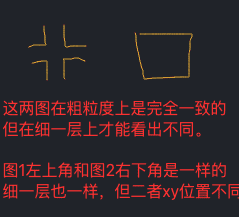

# 测试推进细节修正的问题，并整理推进(觅食 & 飞躲 & 踢搬运)三项的多向连续训练,以及三项融合训练

在前面,已经学会搬运,且会用搬运来踢坚果到路上,至此所有单轮的训练项目全部通过了,以下开始对这些项目进行连续行为训练,以及融合在一起训练等;

***

<!-- TOC -->

- [测试推进细节修正的问题，并整理推进(觅食 & 飞躲 & 踢搬运)三项的多向连续训练,以及三项融合训练](#测试推进细节修正的问题并整理推进觅食--飞躲--踢搬运三项的多向连续训练以及三项融合训练)
  - [n34p01 回测简化的嵌套关系、OutSPDic存取、新版Solution、CansetV3类比等](#n34p01-回测简化的嵌套关系outspdic存取新版solutioncansetv3类比等)
  - [n34p02 整理下HE的多码特征计划](#n34p02-整理下he的多码特征计划)
  - [n34p03 多码特征的：感官算法 和 感官模型](#n34p03-多码特征的感官算法-和-感官模型)
  - [n34p04 多码特征的：组码表征 和 特征表征](#n34p04-多码特征的组码表征-和-特征表征)
  - [n34p05 多码特征的：组码识别 和 特征识别](#n34p05-多码特征的组码识别-和-特征识别)
  - [n34p06 多码特征的：组码类比 和 特征类比](#n34p06-多码特征的组码类比-和-特征类比)
  - [n34p07 多码特征的：回测 & BUG & 细节 & 优化](#n34p07-多码特征的回测--bug--细节--优化)
  - [n34p08 多码特征的：组码索引](#n34p08-多码特征的组码索引)

<!-- /TOC -->

***

## n34p01 回测简化的嵌套关系、OutSPDic存取、新版Solution、CansetV3类比等
`CreateTime 2025.03.13`

| 34011 | 重新训练下三步,并存为FZ103（参考33132） |
| --- | --- |
| FZ1031 | 认知模式:`饿,扔随机坚果,不吃,又饿`x50轮 (RL工具跑:无皮学饿) (参考33013-步骤) `T`; |
| FZ1032 | 认知模式:`饿,扔附近坚果,随机连飞3下(如飞中吸吮反射)`x100轮 (RL工具跑:学吃) (参考28173-2学飞) `T`; |
| FZ1033 | 动物模式:`饿,某方向附近扔果` (注: 看它能不能自行飞吃到,如果飞错,也不要干预它,多试错训练几次); |

| 34012 | 训练中观察注意 |
| --- | --- |
| 测项1 | 观察新的构建Canset四处代码。 |
| 测项2 | 看下推举V3算法，能不能正常推举和构建映射等。 |
| 测项3 | 看下OutSPDic的存取。 |
| 测项4 | 看下新版Solution仅从F求解情况。 |
| 测项5 | 看下CansetV3类比器，能不能正常类比出结果。 |
| 测项6 | 递归更早前的测试项：看下hSolution还会不会总是无解了。 |
| 测项7 | 递归更早前的测试项：第3步试错训练,看`有向无距果场景`在不断竞争中SP浮现的怎么样; |

***

## n34p02 整理下HE的多码特征计划
`CreateTime 2025.03.14`

本节借着长字符串相似度识别问题，把HE一直没做的多码特征整理下，主要是从稀疏粒度到特征层，以前是单码特征，本来计划是到v3时再做多码特征，不过一来是近年HE的改动不再过于推晚不做早，二来是乌鸦演示对系统的全面性细节性要求高于原先预计，所以感官端这里跟一下进度也无不可。

**34021、需求**
老同事的需求，想搞这样的数据库。在HE系统的数据库基础上分析如下（有些像加了解释性的CNN，也可以到网上自行找“CNN可解释性研究”，应该还有别的可行方案）。

**34022、数据库**
1. 稀疏码：一个字符串有一千字符，用这一千字符，生成1000个稀疏码（每个码必须是一个值类型）。
2. 稀疏索引：把各个稀疏码做成一个数组索引（按从小到大排序）。
3. 稀疏粒度：可以对长字符串按1/10，1/100，1/1000粒度去分别做多粒度分组。按1/10粒度，就是100字符一粒，用这一粒生成一个平均值，计为一条该粒度的稀疏码。
4. 特征：其实就是整个字符串，在该例中，计为：它的字符串特征（因为该例不涉及比如视觉那样的多特征，所以只需要走到特征这一级就够用了）。
5. 特征与稀疏码：一组稀疏码，组成一个特征（比如1/10粒度的特征就含10个稀疏码）。
6. 特征引用：每个特征引用了哪些稀疏码，比如1/10粒度时，有100个稀疏码，特征要分别与它的100个稀疏码创建一个关联（叫refPorts关联）（这个关联以后要用来做启发式搜索的）。
7. 关联强度：以后搜索时，每一次激活成功后，要对这个refPorts中记一次strong+1（也是以后用来搜索竞争用的）。

8. 另1、粒度关联：在1/10，1/100，1/1000各粒度产生出的稀疏码间，要建立关联，比如：一千字符，产出1/10粒度稀疏10个，它的每块分别与1/100粒度产生的100个中的10个码建立粒度关联splitPorts。
9. 另2、特征错位：另外为了准确度，也可以做错位层（即以0.5个粒度进行）（这条也是为了性能，因为粗粒度时，筛选的越准，它后面性能就越好）。
10. 另3、再后面的概念、时序、价值，这些在该需求不涉及，砍掉。

**34023、工作步骤**
1. 输入长字符串。
2. 按从粗到细粒度，分别拆分成稀疏码（如1/10，产出10个稀疏码）。
3. 每个产出码，都在各自粒度的索引序列中，可以向上下相近的值扩展30%（比如现在平均值是666，那么找到索引后，分别向从小大到的索引序列两测扩15%）（相当于找30%的值相近度）。
4. 然后分别通过这些稀疏码的refPorts找对应特征索引（记住，此时并不激活特征，只是取出refPorts索引而已，性能上没问题）。

5. 根据各粒度取到的refPorts，计算匹配度（注意：稀疏码索引时，就已经知道相近度了，这是微观相似度，到宏观特征的相似度由乘积获得）。
6. 通过refPorts取出强度（过去激活次数）。
7. 单粒度内通过refPorts取到目标的次数（因为单个粒度也有多个码，索引时可以指向同一个refPort.target特征多次）。
8. 多粒度间通过refPorts取到目标的次数（多个粒度取refPort.target特征虽然各自在不同粒度上，但它们有splitPorts粒度关联，可以来判断refPort.target是不是指向同一个特征）。
9. 取次数其实是在取交（相当于缩小范围，即：每一新取refPorts时，相当于直接在上一轮的结果中取）。

10. 竞争：根据以上匹配度、强度、索引到目标次数，综合竞争（找出各粒度都比较匹配的特征结果）。
11. 结果：最后得到结果仍是数组，并且是有相似度，且在一级级向细粒度上解析，可以完全还原它的内容，即：具备可解释性）。

**小结：以上大概讲了从稀疏码到特征的表征和识别方式。**

| 34024 | 用图表示稀疏码到特征的流程 |
| --- | --- |
| 示图 |  |
| 步骤1 | 如图，我们从粗粒度开始索引，它因为粒度粗（所以refPorts结果少），再加上扩30%的索引（ref结果会多些，但因为粒度粗，在可接受范围），做为一级结果。 |
| 步骤2 | 然后分两条路径：一条是根据取到的粗结果特征，向细粒度找splitPorts。另一条从细粒度稀疏码，向refPorts找细粒度特征。 |
| 步骤3 | 两条路径的结果取交集（或结果计数，计数多的更准确），然后根据匹配度竞争，再保留可接受数量的二级结果。 |
| 步骤5 | 再分两条路径：二级结果向splitPorts取，三级粒度稀疏码向refPorts取。 |
| 步骤6 | 再两条路径的结果取交集（或结果计数，计数多的更准确），然后根据匹配度竞争，再保留可接受数量的三级结果。 |
| 结果 | 像如图中，一级取到4条(ABCD)，二级2条(B9,D9)，三级1条(D99)，当然图只是个示意，真要跑的是九格全跑，不可能只跑第9格。 |

**小结：34024中，通过示图详细说明了从稀疏码到特征的识别过程。**

| 34025 | 非视觉中心错位，导致识别不准确的问题。 |
| --- | --- |
| 问题说明 | 识别时，原感官数据有错位问题，比如视觉往往不在视觉中心，导致错位，导致识别不准。 |
| 思路分析 | 当识别有价值影响（值得关注）的信号（如危险）时（此时已经有了任务），它正视目标然后能实现更准确识别，并解决任务。 |
| 正面解答 | 那这个：”正视目标”本身就是解决任务的第一个步骤而已，即：我们是为了解决任务，才正视目标，识别目标，精准解决任务。 |
| 反面解答 | 而不是为了能解决识别的非视觉中心错位问题，而专门去实现正视目标，或者平移图像实现识别。 |
| 总结 | 即：此问题，融入到整个思维系统中去解决了，而不是通过感官算法解决（即我老以前说的，脖子动是行为，而不是主动视觉的功能）。 |

**小结：34025中，描述了被动视觉是怎样实现正视的，解答了非视觉中心导致的识别不准确问题。**
**总结：当前he4o的v2版本不做多码特征，此笔记中多码特征部分，和splitPorts粒度关联并未工程化，但整个做法与以往HE的做法是同源的。**

***

## n34p03 多码特征的：感官算法 和 感官模型
`CreateTime 2025.03.15`

上节中，分析了多码特征的一些细则，想着就着思路，就写写先，也不必非要等下版本再做，毕竟图片识别的测试方式实现起来也简单。

注：本次多码特征的迭代，以1万像素图片的视觉为例。

| 34031 | 多码特征的实践之：感官部分 |
| --- | --- |
| 说明 | 特征分索引模块（粒度层级索引） 和 特征组节点模块（9格为1个节点）。 |
| TODO1 | 每个概念有多个特征，比如视觉有HSB三个特征 `T`。 |
| TODO2 | 每个特征有多个粒度，比如总宽100像素，转为点数81，level分4层，每层9格，又下挂子层9格 `T`。 |
|  | > 因为是多层，可以用嵌套分形数据结构，一父多子，子又含多子。 |
| TODO3 | 每个粒度都是一个字典<K=x_y，V=H或S或B值> `T`。 |
| TODO4 | 把以上写成视觉感官模型AIVisionAlgsModelV2，下面写HColors、SColors、BColors三个特征 `T`。 |
| TODO5 | 做个样图测试createTestImage()，看视觉感官处理色值矩阵正确 `T`。 |

***

## n34p04 多码特征的：组码表征 和 特征表征
`CreateTime 2025.03.16`

说明：稀疏码多粒度表征，其实最后落实到代码上，就是组码表征，因为多粒度是感官层的说法，到了表征层，就必须拆开一组组，一条条的去表征，说白了，就是树的耦合必须全打开。

| 34041 | 多码特征的实践之：稀疏码的：粒度树索引部分 |
| --- | --- |
| 说明 | 粒度树其实还是索引（也还属于稀疏码，它是值类型）。 |
| 问题1 | 需要粒度树索引吗？ |
|  | 正据：粒度树可用于识别过程中性能保证等（参考34024-示图）。 |
|  | 反据：性能保证只是尽可能的使用粗粒度（其实只是表征了level层级，具体实现是通过细一级9宫的相似度判断的）（参考34042-分析3）。 |
|  | 思路：那么粒度树是不是只需要存在感官层面，和特征中有level就行，在稀疏码模块应该不需要它？ |
| 问题2 | 用单码向ref索引是不可取的，性能上不行，并且太泛，压根找不到想要的特征， |
|  | 思路：稀疏必须支持组码（九宫打包成块）（或者叫九宫组码）这样做的好处，首先九宫组码可以向ref索引识别特征。 |
| 总结 | 就是组码节点的content_ps有九位单码组成，且它是有序的，顺序就是从第一行到最第三行，每行左从至右各三位 `T`。 |

| 34042 | 多码特征的实践之：特征节点部分 |
| --- | --- |
| 说明 | 粒度树的父层，可能有多个子层。而特征节点则不然，它以一组小特征或稀疏码组成，精准的表达它的具象信息内含。 |
| 分析1 | 分析下怎么打包具象特征组，以构建具象特征。 |
|  | > 特征节点：特征组，是给一组特征的别名，它会被建成特征节点（然后有具象特征，也会归纳抽象特征）。 |
| 分析2 | 分析下怎么写类比归纳找规律，以构建抽象特征。 |
|  | > 抽象特征：特征明显的稳定的（一般是细粒度层）（找出规律的抽象特征：比如眼角的样子）。 |
| 分析3 | 分析下，用哪个粒度层做组，来表征特征？ |
|  | > 性能考虑：如果粗粒度一级就能表征到很相似的匹配到特征，那么优先使用粗粒度（节能省空间，其实就是压缩算法）。 |
|  | > 怎样判定粗粒度相似呢？细一级粒度的九宫的码值没什么差别，即表示它相似（比如：九宫全是亮度1，那我用粗一级一个码就表示了）。 |
|  | 总结：其实就是把所有九宫一致的组码去掉，自然就剩下不同部分了（不同部分就是具象特征的内容）。 |
| 分析4 | 特征是指针类型，它含数个码，可是特征怎么表征这些码呢？这些码有序吗？有位置吗？有层级吗？如下图： |
|  |  |
|  | 1. 根据以上性能考虑，要尽量使用粗粒度码，所以特征里的码，必须包含level层级，因为3层一点和4层一点是完全不同的。 |
|  | 2. 根据以上示图分析，即使一模一样的粗粒度，以及其细一层也一样，粗粒度的位置也可能不同，所以必须包含xy值。 |
|  | 总结：特征里的多码，必须包含：level_x_y的表征。 |
| 总结 | 就是特征节点，必须除了content_ps中存组码，还要把每个组码的level,x,y存下来 `T`。 |

| 34043 | TODOLIST |
| --- | --- |
| TODO1 | 视觉多粒度中，所有单码的装箱 `T`。 |
| TODO2 | 写AIGroupValueNode和组码装箱（用下面的构建器） `T`。 |
| TODO3 | 写AIFeatureNode和特征装箱（用下面的构建器） `T`。 |
| TODO4 | 写通用构建器（即可以构建组码节点，又可以构建特征节点），并支持本地防重，组分关联等 `T`。 |
| TODO5 | 写特征压缩算法，所有9宫相似的组码，都压缩掉，只保留有特异性的组码 `T`。 |
| TODO6 | AIFeatureNode不仅有content_ps，还有level,x,y，所以把它也加到生成header里，使之可防重 `T`。 |
| TODO7 | 性能优化：稀疏码要限制下精度（先通过输入端+装箱时）两步都限制了，以后有机会再更新成一步自动计算 `T`。 |
| TODO8 | 测试工具：写生成手写数字的方法 `写的不完美，先试试用，后面再改进 T`。 |

***

## n34p05 多码特征的：组码识别 和 特征识别
`CreateTime 2025.03.19`

在上节中，做了组码和特征的表征，本节搞识别。

| 34051 | 组码识别 |
| --- | --- |
| 结果 | 参考概念识别，先进行单码识别，然后边ref，边乘积相近度，边求交集（元素匹配计数）就行了 `T`。 |

| 34052 | 特征识别 |
| --- | --- |
| TODO1 | 参考概念识别，先进行组码识别，然后边ref，边乘积相近度，边求 交集（元素匹配计数）就行了 `T`。 |
| TODO2 | 性能优化：为了性能把level,x,y都存到组码的refPort里，便于不取特征，就能计算level,x,y的匹配度 `T`。 |
| TODO3 | 特征识别需要判断level，如果层级错乱几乎是无法匹配上的，但错位是可以的，比如近景远景的匹配，所以可以计算level差值一样的计为了组 `T`。 |
| TODO4 | 特征识别需要判断x,y值，不然位置错乱肯定无法匹配上的，可以分别以x和y从小到大排序，排成两个序列，然后根据顺序相似度来计算xy相似度 `T`。 |

| 34053 | 特征识别中的`组码位置匹配度` |
| --- | --- |
| 说明 | 特征识别中，其局部位置是否都正确？即判断组码的位置是否正确，怎么判断？怎么求出这个匹配度？ |
| 分析 | 参考34042-分析4，原本留下了level,x,y数据，所以可以用于计算。 |
| 旧方案 | 采用根据y,x,level三步从小到大排序，对特征中的组码content_ps进行排序，那么是否顺序相同者即位置匹配？ |
|  | 解答：顺序相同，不表示位置正确，比如李四在第一排张三后面，王五可能在第二排张三下面。二人都在张三顺序后，但位置却是一个在右一个在下完全不同。 |
| 新方案 | 如下图，还是得用xy来计算推测它应该出现的位置，然后根据这个符合推测范围，来计算匹配度。 |
| 示图 |  |
| 结果 | 选定新方案，进行代码实践，并测试 `T`。 |

***

## n34p06 多码特征的：组码类比 和 特征类比
`CreateTime 2025.03.20`

在上节中，做了组码和特征的识别，本节搞类比。

| 34061 | 组码类比 |
| --- | --- |
| 重点 | 在于9宫一一相对。 |
| TODO | 可以参考以前单码概念的类比，计算单码的重要程度，以类比归纳得出抽象组码 `T`。 |

| 34062 | 特征类比 |
| --- | --- |
| 重点 | 在于缩放和平移：即无论是缩放还是平移，都是取相对位置，而相对位置，其实还是数组按顺序的取交（还是类比归纳）。 |
| 方案1 | 可以参考以前时序的类比，单纯以mIsC来类比归纳出特征的抽象 `废弃 T`。 |
|  | 缺点: 因为特征可能包含很多组码,而组码又互相抽具象越来越多,所以用mIsC的方案1,可能并没有那么好用。 |
| 方案2 | 可以在特征识别后(识别时有局部位置的正确判断),把protoAssIndexDic直接存下来,到时用映射来类比 `T`。 |
| 结果 | 暂选定方案2进行代码实践 `T`; |

***

## n34p07 多码特征的：回测 & BUG & 细节 & 优化
`CreateTime 2025.03.22`

在前几节中，用6天时间顺便把多码特征写了（包括从1w像素图像视觉感官算法，感官多粒度模型，组码表征，特征压缩，特征的表征，组码识别，特征识别，组码类比归纳抽象，特征类比归纳抽象），本节回测下。

| 34071 | BUG LIST |
| --- | --- |
| BUG1 | 特征识别时，组码的位置`符合度`经常算出0，查下为什么 `T`。 |
| 结果 | 后测得若干BUG，都直接在代码里分析并修复了，此处略不记。 |

| 34072 | 优化 TODOLIST |
| --- | --- |
| 优化1 | 把位置符合度存为特征中的组码相似度（而不是竞争完就没了，类比时还要用它呢）`T`。 |
| 优化2 | 位置符合度算法，由一点判断，改成多点共同判断。 |
| 优化3 | 现在的性能还很问题，得用性能debug工具，过一下性能，该优化的优化下 `T`。 |
| 性能4 | 组码识别有性能问题，40个组码x各9个码x各激活80个单码x各取10个refPorts，最内层循环得跑30w次，性能很慢。 |
|  | 性能4A: 可以用取交方式来解决下，即第1码ref到的，在第2码时也必须从中取（不然就不全含了），这样让漏斗越来越小，让循环少些 `T`。 |
|  | >>> 总结: 这个取交本身的性能就不好，因为它需要把G码都取出来判断取交，并且特征有40个组码每个组码含9个单码它就得判断360次。 |
|  | >>> 分析: 但仍慢，仅靠最内层加`取交防重`是不行的，判30w防重都吃不消，得每一层都尽量加上防重 `T`。 |
|  | 性能4B: 为每一层都加上cache，统一设计下加到瞬时序列的ShortModel里，只要ShortModel不销毁或被新short使用，继承过来 `T`。 |
|  | >>> 总结: 跑了下命中率从12%，多次重复后跑到3x%，但它并没有从根本上解决组码循环太多的问题。 |
|  | 性能4D: 索引G码时，把现在单码的整个refPorts分成x_y共9个refPorts，这样就可以把循环从40w变成5w `T`。 |
|  | >>> 总结: 这个确实有效，但感觉不太够，得加强一下，单用xy来分，只能减少循环数为1/9，但性能还是达不到理想效果。 |
| 总结 | 各种防重和缓存机制都加上了，虽然也有很大效果，但治标不治本，即使只循环8w次，也得2秒多 `转34081 T`。 |

| 34073 | 测试训练记录 |
| --- | --- |
| 记录1 | 用Mnist图片跑几张0和1，测试后能识别到，不过还不够准确，需要更多的抽象和更多的SP稳定性，所以需要更全面的测试训练，转下条。 |
| 记录2 | 搞下更全面的训练手段，比如看到3乌鸦点头就喂坚果，或再简化些：改成只有3号坚果可以吃，用强训工具来跑。 |

***

## n34p08 多码特征的：组码索引
`CreateTime 2025.03.26`

在上节中，对多码特征进行了测试，修BUG，细节处理，优化等。不过最终测到组码识别慢的问题时，发现循环数太多，怎么优化也标治不标本，本节用于解决这一问题，实现一个独立的：组码索引。

| 34081 | 独立实现：组码索引 |
| --- | --- |
| 问题 | 参考34072-性能4：本表分析一个治本的优化方法，把组码循环太多慢的问题彻底解决下。 |
| 思路 | 原问题根本上在于从单码到组码，之间需要太多循环了，其实只要我们直接对组码设计一个索引（跳过单码），就可以了。 |
| 回顾 | 原来的单码索引是以值序列，加相近度来的。 |
| 方案1 | 而组码索引完全可以由：`相对位置（可由顺序替代），平均值（绝对值大小），差值（值范围）`这些来试着实现（见下图方案分析）。 |
| 示图 |  |
| 说明 | 如上图，得出四点线索： |
|  | 1、顺序：从小到大，先x后y，得出以上两张图A和图B排序路径一致。 |
|  | 2、平均：所有值求和/9，得出上A图平均值3，B图平均值7。 |
|  | 3、差值：最大减最小值，得出上A图差值4，B图差值4。 |
|  | 4、权重：各粒度组码的权重不同，A图level1宽81，B图level3宽9，假如此时所有码总宽=192：A权重=81/192=42%，B权重-9/192=5%。 |
| 疑问1 | 无法区分1-2-2-3-3-3-4-4-5和1-3-3-3-3-3-3-3-4=5的区别，因为二者完全可以排成：顺序，平均值，差值，都一样。 |
| 解决1 | 把顺序两两之间的差值求出来，比如：122333445，计为1(1)2(0)2(1)3(0)3(0)3(1)4(0)4(1)5,共17位。 |
|  | 注：差值精度可以低一些，比如先定为0.1。 |
| 疑问2 | 平均值呢？也要照顾下，只要信息体现出的差异都得照顾下。 |
| 解决2 | 可以把平均值当成末位，共18位，不过精度可以再粗一些，比如：0.25，一共1到4四个可能值。 |
| 疑问3 | 精度写死成太粗，会不会导致索引到的数据量太大，或太小，不好调整。 |
| 解决3 | 精度完全可以尽量细一些，取的时候按范围取就行了，比如精度是0.03，那我取0.2的范围的时候，取相邻共7条就行了。 |
| 疑问4 | 精度写死成太细，又会导致索引太多，刚开机会显得系统发呆一会反应慢。 |
| 解决4 | 这个要自行取舍一下（当然也可以建多个精度的索引，以空间换时间，但这涉及到多个索引同步的问题，暂不做那么深入复杂）。 |
|  | 示例：`相近的明暗 或 相近的颜色`我们单独看也很难辨别（意思是其实组码差值和平均值的精度也没必要那么高）。 |
| 重点 | **其实本表给组码建的索引，也相当于替代了组码识别，直接可以由索引取得相近的组码。** |
| TODO1 | 如上可以用顺序9位数的排序，组成一个1-9的索引路径来表示。 |
| TODO2 | 再把顺序中两两计算差值，按0.1精度转为1-9之间的数字，然后把这8个差值，插在1-9的路径间隙中。 |
| TODO3 | 再把平均值按0.25精度转为1-4之间的数字，然后把这1个平均值，插在17位的最后做为第18位。 |
| TODO4 | 可以参考原单码代码PNDATA & PNINDEX & PNVALUE，该复用的复用，该新增的比如命名PN_G_DATA来做新的即可。 |

***

     
