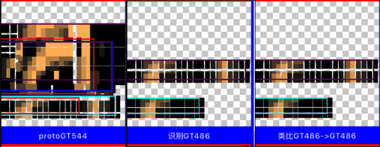

# 继续多码特征 & 自适应粒度迭代

***

<!-- TOC -->

- [继续多码特征 & 自适应粒度迭代](#继续多码特征--自适应粒度迭代)
  - [n35p01 回测显著度](#n35p01-回测显著度)
  - [n35p02 自适应粒度-开发](#n35p02-自适应粒度-开发)
  - [n35p03 自适应粒度-细节完善-支持组特征](#n35p03-自适应粒度-细节完善-支持组特征)
  - [n35p04 自适应粒度-优化 & 测修BUG](#n35p04-自适应粒度-优化--测修bug)

<!-- /TOC -->

***

## n35p01 回测显著度
`CreateTime 2025.04.30`

| 35011 | 测能类比出显著特征 |
| --- | --- |
| 说明 | **做几张有点共同特征的简笔画测试下类比出显著特征。** |
| 手写3 |  |
| 简笔人 |  |
| 结果 | 如上，可以顺利类比出显著特征，并且可视化工具也好用了。 |

| 35012 | 测显著特征的显著度能越来越强 |
| --- | --- |
| BUG | **测得手写2和3很难准确的BUG。** |
| 思路 | 尝试提高识别竞争力度，然后重测下，结果发现如下线索。 |
| 示图 |  |
| 线索 | 如上图：局部特征全识别正确，但最后取整体后，却错了，得调试下，这问题怎么来的。 |

***

## n35p02 自适应粒度-开发
`CreateTime 2025.04.29`

起因：在前面尝试测试识别特征细节时，想到九宫可能有错位错漏等问题，本节解下此题。

本节主要针对以下两个问题，分析制定方案和尝试做一版大的迭代。
1. 错位问题：在N34中多码特征虽然都是多粒度，但粒度按9宫来的不够平滑。可能出现`错位问题`：就是当9宫错了1到2格时，此时如果GV差异很大，会导致索引不上。
2. 错漏问题：当3x3时，如果proto和ass正好是1.5倍怎么办？那可能因为比例问题，而错漏掉。

| 35021 | 针对错位错漏问题的`自适应粒度`问题分析 |
| --- | --- |
| 说明 | 本节`错位问题`目前只是猜测，并未实证，需要先找几张错位图来试一下。 |
| 错位图 |  |
| 错漏图 |  |
| 思路1 | 其实主要是不能再分九宫这种固定多粒度了，而是要平滑分粒度，比如细节需要时可能分1.2粒度，细节不需要时可能分18粒度。 |
| 思路2 | 可以从整体开始，一级级向细节逐轮进行识别（下一层建立在上一层的基础上，慢慢取交收缩识别范围）。 |
| 思路3 | 粒度要平滑，意味着一帧视觉，可能进行更多轮的组码识别，甚至更多轮的特征识别。 |
|  | 要求：必须达到比如80%以上相似度的组码，才激活，不然： |
|  | 一来不准确的太多，导致特征识别算法数据量循环太多，太耗性能。 |
|  | 二来到特征就更不准确了（比如手写2和3就很相似）。 |
|  | 三来如果要平滑粒度后更需要很多轮识别特征了。 |
| 线索 | 可以根据内容对齐来定粒度（即ass的内容是怎样的，就怎样定粒度，而不是以固定的3x3或者1.1x1.1啥的来定）。 |
| 结果 | 本表一步步分析，得到`根据内容对齐来切粒度`的线索，下表展开将该线索制定成方案。 |

**小结：35021大致制定了“根据内容对齐来切粒度”的方向，下表分析具体方案。**

| 35022 | 主方案V1：根据内容对齐来切粒度 |
| --- | --- |
| 问题回顾 | 因错位问题导致有一些识别不到的问题，如下： |
| 问题说明 | 无论多粒度按3x3九宫分，还是2x2四宫分，永远都会漏掉可能正好两个图错位，比例等问题导致的识别不到。 |
| 上节回顾 | 但是：我们可以让每一个被识别者自举，反向识别。我举个例子： |
|  | 1、校长想在学生里找人才（但校长也不知道这么多学生，哪些各有什么特长）。 |
|  | 2、所以校长说：觉得自己是人才的学生自己举手，并上台表明自己有什么特长。 |
|  | 3、校长来决定，这些特长的学生，算不算自己要找的人才，哪个更人才。 |
|  | 即：这样的话，就不是按多少固定比例来做粒度，而是学生说自己属于哪个粒度，就切成哪个粒度。 |
| 方案V1 | proto还按9宫，但每一格偏移都做成GV索引去找assT，找到assT后，立马转为用ass.content和rect来反向切割protoT做匹配判断。 |
| 说明 | 该方案做两手准备： |
|  | 1、原来的9宫表征保留（即现在的主要表征手段不变）。 |
|  | 2、而最初的索引：protoGV则可以精细些，要照顾到没有错位错漏问题。 |
| 结果 | 该方案大致ok，但还有子问题，比如：protoGV怎么个精细法？怎么照顾到没有错位错漏问题？转下表继续。 |
| 追加 | 此方案不够深入，转35024继续深入展开思考下。 |

**小结：35022制定了方案V1-“protoT靠算力每格都索引，然后找着assT后，立马转为根据assT内容对齐来切粒度”。**

| 35023 | 子问题：protoGV怎么避免错位 和 错漏问题？ |
| --- | --- |
| 线索 | 九宫肯定会导致错位，所以proto每三格采一次样肯定不行了，缝隙太宽必然有错位。 |
| 说明 | 因为这些子问题，仅针对proto层，它没有性能问题，也不必持久化，不必担忧空间问题，所以可以放开手干，那么就不再是什么大问题。 |
|  | 即：protoGV的存储已经剥离了，proto只计算生成GV索引用（包含所在粒度层信息protoScale）。 |
| 方案1 | proto按十等分一格格右移，分别得protoGV索引激活assT。 |
|  | 缺点：十格也可能有错位，不是格多格少的问题，而是每格都要照顾到的问题，10能照顾10以下，100格呢？ |
| 方案2 | 由原来的每3格采一次九宫改成每一格都要采样9宫。 |
|  | 分析：这方案对错位ok，对错漏不行。 |
| 方案3 | 在原来每3格采一次九宫甚至上，进行向后追加处理偏移两格，以遍历到所有格避免错位问题。 |
|  | 分析：这方案和方案2也没啥区别，走一大步原地抖两步，和一步一格三步三格，其实没区别。 |
| 方案4 | 可以每1.3倍一个粒度层，1-3，2-4，3-5...这样一格格取九宫转protoGV索引，反正不存，咱就细到它没问题为止 `95%`。 |
|  | 分析：此方案看似暴力，但即然不在识别时多个嵌套循环，又不持久化，算力就不再是问题。 |
|  | 优点：此方案即解决了错位问题，又解决了错漏问题，当首选。 |
| 抉择 | 经上分析，方案4更暴力简单直观实用，选定进行实践。 |

**小结：35023中，针对错位错漏问题，制定并最终选定方案4：对protoT以1.3倍一个粒度层，一格格逐步向右取九宫，直到最后一格。**

| 35024 | 主方案继续深入思考1-自举还是被举？（参考35022） |
| --- | --- |
| 起因 | 一觉醒来，发现35022-主方案V1有两个缺点： |
|  | 1、每一次都把assT的contents和rects读出来，本身就很有性能问题 |
|  | 2、再则proto如果已经找着ass了，说明已经确定它的粒度比例了，何必多此一举的再让它自举？ |
| 已确定 | 无论怎么做，35023的方案4是确定的：protoGV每个粒度都计算gv索引和找refPort。 |
|  | 1、protoGV自带protoScale表示它是从哪个粒度层切来的。 |
|  | 2、refPort自带rect也有粒度层refLevel，可用width来计算。 |
| 正方 | 应该继续方案v1以assT.content和rects来自举切粒度。 |
|  | 缺点1：这需要把assT提前取出来，这个缺点也比较致命（特征全量非常巨大，抽象的稳定的好不少）。 |
|  | 示例：如果ass是一个比例在变化的呢？第一个gv是1.5倍，第二个变成1.8，第三个又因为变形或别的局部干扰导致level层在更大粒度一层。 |
|  | 缺点2：图中是8吗？如果用assT8来自举，它是肯定匹配不到此图的。 |
|  | 辩解：可以根据refPort的强度来竞争，只保留前20%，尝试找出抽象稳定的显著特征，而后再conPorts做整体特征识别。 |
| 反方 | 以当前gv的protoScale和refLevel，依次确定切下一个assT.gv在proto中的合适粒度 (废弃现特征识别算法中的固定deltaLevel)。 |
|  | 说明：protoScale和其refPort.level，这两个可以比较确定下一次proto应该以哪个粒度比例来应对下一个gv。 |
|  | 分析：这么多proto切粒度，其实这相当于多轮特征识别了，不过能边推进下一个gv.refPorts，边一轮轮淘汰assT也可以。 |
|  | 缺点1：但它终是无法明确比例，无法明确protoT的千变万化，这一计算非常复杂，看起来此缺点比较致命。 |
|  | 缺点2：除非assT自举切粒度，不然以proto为准去一个个refPort找，非常难以找准确，因为step1Model中的rank将大爆炸。 |
|  | 辩解：可以不断用当前gv的protoScale和refLevel预估切下一个gv的粒度，边ref边修正下个gv的scale。 |
| 抉择 | 反方即使知道ass下一个gv的粒度比例，protoT也会因自己的各种错位噪点等影响，导致切不出assT下一个gv所正对应需要的部分。 |
|  | > 真正assT下一个gv要哪部分，还是assT自己最知道，靠简单的比例去蒙肯定是蒙不中的。 |
|  | > 继续维持方案V1，必须先以assT去自举，才有可能准确，不然全靠蒙是不可能准确的。 |

**小结：35024深入分析，并最终选择继续维持方案V1，不过加上：“缩小ref范围为仅竞争靠前的特征（前期为普通特征，后期一般为合理抽象程度的显著特征”。**

| 35025 | 主方案继续深入思考2-比例变化怎么切粒度？（参考35022） |
| --- | --- |
| 简述 | 其实在以不同视角观看同一物体时，这种形变非常常见。 |
| 说明 | 本图中的8，是比例在不变变化，思考下方案v1自举怎么兼容这一情况？ |
| 示图 |  |
| 说明 | 如图：A1找到A2后，B2怎么自举找着B1？ |
| 思路 | 根据B2在assT中的rect，推测对应B1在protoT中的rect，然后以与A1:A2相交处为锚点，进行缩放，直至找出最为相近的切粒度区域与比例。 |
|  | 即：每一条新的gv，都可以重新缩放找最相近的切粒度比例，做为下一个gv的初始比例。 |

**小结：35025深入分析了比例变化的情况下怎么切粒度：“每一条新的gv都根据上次的初始比例，在锚点上缩放对齐，找出新gv下的最优比例”。**

| 35026 | 流程整理：总结本节以上所有表为工作流程 |
| --- | --- |
| 1 | protoT输入时，脱离存靠算力：按1.3倍一个粒度层，从第一格，逐格向后取九宫，直至最后一格结束 `T`。 |
| 2 | 每一个九宫都生成gv索引，尝试取refPorts，找到assT `T`。 |
| 3 | 对找到的assTs进行竞争缩小范围（如保留前20%）（冷启时胜者为普通assT，后逐步变成稳定合理抽象的显著特征）`T`。 |
| 4 | 找着assT后，立马转向自举：“根据assT的内容来一个个gv向后在protoT中切粒度” `T`。 |
| 5 | 每assT前一个gv做为下一个gv的初始比例，在描点上缩放对齐，找出最优比例，同时做为下一个gv的初始比例 `T`。 |
| 防重 | 一条proto.gv取得ref.assT后，自举掉一批assT.rect后，这些rect区域就不再进行12345步了 `T 改为6`。 |
|  | > 这样的话，只需要少数的proto.gv就可以把整图穷尽了，避免了穷尽所有粒度和偏移太耗性能的问题。 |
| 6 | 防重改为根据assT.pId和assIndex来防重，因为像8有四个下斜线，切入点不同时，也许又行了 `T`。 |
| 7 | 出界时，图片只显示到局部，或推测的proto出界时，直接跳过该条gv处理，因为匹配度会除matchCount所以不会影响最终竞争 `T`。 |
| 结果 | 把以上几条都代码实践完成。 |

**小结：35026中，把流程整理了下，并直接代码实践把这些做了。**

***

## n35p03 自适应粒度-细节完善-支持组特征
`CreateTime 2025.05.08`

上节开发完毕，本节测试修细节和BUG。

| 35031 | 整体特征识别结果总为0条问题: 并最终将整体特征迭代为组特征。 |
| --- | --- |
| V1以前的数据结构 |  |
| V2现在的数据结构 |  |
| 说明 | 如图，现在没有`自适应粒度的protoT`，所以就没法从absT1234找到protoT，它们只能各自找到自己的assT一条。 |
| 方案 | 可以把absT1234整合成自适应粒度的protoT，并与absT1234建立关联，但它应该相当于组特征节点了，看来得再定义个GTNode了。 |
| 结果 | 本表新增了组特征GTNode，然后把组特征识别、类比、可视化等都支持并测试ok了，并且已经可以识别到整体特征了。 `T`。 |

**小结：注意本表是把整体特征改成组特征了，然后局部特征相当于单特征，单特征都是固定三分九宫，而组特征是各种单特征组成的自适应粒度。**

| 35032 | 回测组特征 |
| --- | --- |
| 测项1 | 看局部特征识别结果不可以太多，不然组protoGT的元素就太多了。 |
| 测项2 | 测下上万像素图片识别，看下性能怎么样，然后调试下性能优化下。 |
| 测项3 | 测下错位，细节等的识别。 |

| 35033 | BUG及细节问题跟进 |
| --- | --- |
| 1BUG | 组特征识别中有rectItems.count>assT.count的情况。导致符合度>1 `转35034 T`。 |
| 2细节 | 三通道都放开测下。 |
| 3思考 | 能不能单次就把三通道全给处理了？（建建别全通道合一，不然可能又要大改，等需求明确再说）`T 暂不做`。 |
| 4性能 | 调试下性能优化（尤其是局部特征识别的性能）`T 转35041`。 |
| 5测试 | 测下手写数字2和3的识别，看特征提取和组特征识别的效果怎么样。 |

| 35034 | 组特征识别rectItems重复BUG |
| --- | --- |
| 起因说明 | 经查之所以rectItems.count>assT.count，是因为有重复，重复说明如下： |
| 重复说明 | 有时protoGT有多条元素，指向同一条assT的同一个元素时，日志如下。 |
|  | protoGT1722的Index:3=T1690（0左上）: {{0, 0}, {15, 3}} 指向assGT1691的refRect{{3, 12}, {15, 3}} |
|  | protoGT1722的Index:6=T1690（0右下）: {{3, 12}, {15, 3}} 指向assGT1691的refRect{{3, 12}, {15, 3}} |
|  | rectItem数:2 assT数:1 protoGT数:8 |
|  | 说明：日志可见，protoGT的左上角和右下角，全匹配到了assGT的同一帧（refRect一致即是同一帧），然后最终rectItem数2比assGT数1还大。 |
| 示例说明 | 比如protoGT为0时，其左上角(proto2)和右下角(proto5)都是上斜线，可能同时匹配到assGT中的(ass2)左上角。 |
| 方案1 | 分析下，这种情况，是否在单特征识别时，就加以分组防重？因为这里其实相当于是“重影“。 |
|  | 否定：在单特征识别时无法防重，此时还不知道哪个位置符合度更准确，如果单纯防重可能把protoGT0的左上角，和assGT0的右下角保留了。 |
| 方案2 | 到run4MatchDegree中，对deltaX和deltaY排序，把位置符合度最高的做为best留下 `95%`。 |
|  | 说明：即此处多条指向同一个assT的同一个assIndex时，它其实是冲突的，这几个应该竞争一下，只保留最优best那一个。 |
| 方案3 | 如果同一个subT指向同一个groupT.同一个itemT，此时为什么在GT中的rect一致，但refPort.rect却不一样呢？要不统一表征一下，这样就可以防重了。 |
|  | 否定：此处是在protoGT中的位置不同，比如0的左上角和右下角的两个上划线就是一样的只是位置不同，而在assGT中指向同一个元素，所以范围也是一模一样的。 |
| 抉择 | 选定方案2，方案2是针对位置符合度竞争后，取best一条，别的防重掉，这样可以保证protoGT0的左上角对应上assGT0的左上角。 |
| 结果 | 用方案2修复后，重复问题ok了。 |

***

## n35p04 自适应粒度-优化 & 测修BUG
`CreateTime 2025.05.17`

| 35041 | 局部特征识别调用太多，没复用缓存，很慢。 |
| --- | --- |
| 性能 | DEBUG匹配 => 代码块:自适应粒度 循环圈:0 代码块:238 计数:1028 均耗:33.03 = 总耗:33952 读:176 写:0 |
| 说明 | 如上，局部特征识别一次33ms，但因为未缓存复用，导致1028次调用，用掉34s，巨慢。 |
| 思路 | 相近范围内，可以复用原局部特征识别缓存结果，示例分析如下： |
| 比如 | 1、从原图(3,3,9,9)索引值0.8切入，以其相近95%的0.75取refPorts，识别结果为T1,T2,T3。 |
|  | 2、从原图(3,4,9,9)索引值0.7切入，以其相近95%的0.75取refPorts，识别结果同样为T1,T2,T3。 |
|  | 3、此时其实切入点都是0.75，只是rect不同但相近，即：切入rect一个是3,3,9,9一个是3,4,9,9。 |
|  | 4、那么：如何计算rect的相近度？多相近算可以复用，多不相近就不可以复用了？ |
| 方案1 | 两个rect交集 / 并集 > 70%时，即复用，否则重新识别，并计新rect识别结果条目缓存，亦可被别的相近rect去复用。 |
|  | 分析：该方案适用于单帧视觉，可以尽可能在性能允许的情况下，识别全面些。 |
| 方案2 | 参考`35026-防重`，还按rect区域来防重，更多的识别可以用持续注视来完成。 |
|  | 分析：该方案适用于连续视觉，或者持续注视时，可以快速响应识别。 |
| 抉择 | 目前并没有注视功能，所以先采用方案1来搞，性能上应该也够用了，后续有了注视机制之后再用方案2，到时性能更快。 |
| TODO1 | 每次局部特征识别后，把切入rect的切入gv_p存下来 `T`。 |
| TODO2 | 再次局部特征识别时，把新切入rect和gv_p与之前的缓存中求rect相近度（交/并=近）`T`。 |
| TODO3 | 大于70%则直接复用结果（其实相当于直接跳过此轮识别）`T`。 |
| TODO4 | 小于70%则进行该轮识别，并将识别结果再次缓存到当前rect和gv_p中 `T`。 |
| 结果 | 1200多条识别，加上防重后，还剩200多条，但仍然非常慢，需要继续优化。 |

**小结：本表做了进行局部特征识别的条数防重优化，从原1200条优化到200条，但这只是最外层减少循环数，还不足以性能达标，后面继续搞。**

| 35042 | 局部特征识别调用太多，多层for循环太多，最内层要18w次执行，很慢 |
| --- | --- |
| 说明 | 从每次调用后的gv识别结果循环，到refPorts循环，再到assT.content循环，再到scale缩放判断循环。 |
|  | 每一个for循环导致量都在爆炸增强，但却没有收束。 |
| 方案1 | for循环收束：层层竞争，层层防重，最好是能逼近每一条最终成功匹配都执行且仅执行一次。 |
|  | 说明：每一条有效assT都只执行一次是不可能的，但我们可以尽量去逼近，让性能达到可接近的程度。 |
| 实践 | 边调试每层for循环的内容，边分析竞争或防重方式，最终把每一次都尽可能的收束，最终达到总循环数很少的程度为止。 |
| TODO1 | 写了beginRectExcept在切入点上进行防重 `T`。 |
| TODO2 | 写了assRectExcept在已被识别区域上进行防重 `T`。 |
| TODO3 | 为防止宏观识别后，微观全被防重掉，每个dotSize层级，都单独进行防重 `T`。 |
| TODO4 | 在局部特征识别成功时，才更新防重到beginRectExcept和assRectExcept中 `T`。 |
| 结果 | 加了beginRectExcept和assRectExcept后，性能到了可接受的程度，识别速度也可以至少跑起来了。 |

**小结：本表把单通道识别性能从几十秒，优化到一两秒内了，当然还有优化空间，不过目前用于调试是够用了，那性能问题就先这样。**

| 35043 | protoGT有重影BUG |
| --- | --- |
| 示图 |  |
| 说明 | 在各个dotSize粒度层级识别的结果，全都收集到一起了，导致最终absT收集构建成protoGT后，必须是多个层级的结果都在一块儿。 |
| 尝试1 | 可以尝试把各个dotSize粒度层识别的结果，单独进行类比打包protoGT `T`。 |
|  | 结果：改代码为：每个dotSize层单独打包protoGT后，还是有重影问题。 |
| 回顾 | 组成protoGT的absT都是由assT来的，而absT最终在proto图片中的位置，都是有计算的。 |
| 原则 | 因为性能连打包都来不及，其实视觉看到的，都是由以往的经验重组而成，而protoGT在这里也是重组来的。 |
|  | 那么：我们偏婴儿期重组到的，有偏差也是很正常的事，毕竟局部T最符合的也没多符合（位置不符导致重影是正常现象）。 |
| 验证 | 验证一下以上猜想，如果只是正常现象，那么就多测测，看偏成熟期后，拼接的protoGT能不能越来越符合原图的样子。 |
| 查明 | 最终查明，在特征识别中，比如0的内圈0和外圈0，都会被识别，导致重影。 |
| 修复结果 | 单特征识别后，根据assT.pId来防重下（保留最准确的一条）`T`。 |

```java
35044：protoGT的元素rect和可视化之后的大小不一致：
> 在构建protoGT时，再把这个坐标修正下，不要影响类比这里的代码。

**代码回顾：**
* 16A. 方案1、采用bestGV at assT的位置，做absT的元素位置分布：将gvRect在assT的范围，转成在newAbsT中的位置。
CGRect assGVRect = VALTOOK(ARR_INDEX(jvBuModel.assT.rects, obj.assIndex)).CGRectValue;
CGRect bestGV_absT1 = CGRectMake(assGVRect.origin.x - absT_AssT1.origin.x, assGVRect.origin.y - absT_AssT1.origin.y, assGVRect.size.width, assGVRect.size.height);

* 16B. 方案2、采用bestGV at protoT的位置，做absT的元素位置分布：此方案优点在于构建protoGT时，尺寸及位置可以更准确，缺点是类比这里本来就应该以assT为准，不关protoT的事，所以先采用方案1。
CGRect bestGV_absT2 = CGRectMake(obj.bestGVAtProtoTRect.origin.x - jvBuModel.bestGVsAtProtoTRect.origin.x,obj.bestGVAtProtoTRect.origin.y - jvBuModel.bestGVsAtProtoTRect.origin.y,obj.bestGVAtProtoTRect.size.width, obj.bestGVAtProtoTRect.size.height);

* 16C. 但这里有个问题，就是每个bestGVObj（AIFeatureJvBuItem）是有不同的scale的，即它并不是按assT直接抽象出来的，而是每个元素识别匹配时都有各自的比例。
  - 那么：这个比例要体现在bestGV_absT中吗？按ass抽具象树内的原则，肯定是不需要体现，但absT用于生成protoGT时，就丢失了这个gv的scale信息。
  - 除非：每个GT中，单独把每个itemT.itemGV的scale都存下来（转下面方案3）。

* AB二者说明：代码有两种坐标计算方式，一个向ass对齐，一个是向proto对齐，二者是有一个比例的
* AB二者总结：显然，这里是不同粒度间的识别匹配，它天然与proto上的rect就是有一个比例的，如果忽略了这个比例，显示到protoGT上当然就尺寸不准确。

**原因如下：**
1. 微观上：absT.gvs都是以assT为准进行rects计算的。
2. 宏观上：protoGT.rects又是以absT at protoT为准的。
3. 即absT对protoGT而言可能是rect1，而对其内的gvs而言又可能是rect2。
4. 即rect1和rect2之间的比例问题。。。
5. 而protoGT中的每个absT的比例差，可能各有不同，所以只有两个方法：

**方案如下：**
1. 方案1、把absT统一比例向protoGT对齐（即一个个生成protoT单特征），但这样absT与assT的抽具象关联又不那么对齐了。
   - 缺点：方案1会导致assT和absT之间对齐又不准确了。
   - 分析：最好是在自己的ass抽具象树内进行对齐（这是符合直觉，也容易调试），那absPort不存scale了，refPort就得存，所以转方案2。
2. 方案2、protoGT与其元素本来就有比例问题，记录一下xScales和yScales比例到AIGroupFeatureNode中。
   - 缺点：方案2可以解决比例问题，不过这太复杂了，组特征识别算法是不是也要因此变的更复杂？（因为计算位置符合度等都是依赖rect来计算的）。
3. 方案3、protoGT的元素的元素都各自有比例，protoGT虽然是用它们表征的，但细到每个gv都得各自变换拼接回protoGT，即每个absT都要存一个dic比例表。
   - 缺点：方案3更能解决比例问题，不过更复杂，也因此GT识别算法在计算rect时，变的更复杂，容易不可控的出各种太复杂导致的bug。
   - 优点：别的方案都无法把每一个gv的比例存下来，只有这里存下来了，此只有此方案可以完全还原protoGT的原图。
   - 示例：我们斜着看到一个长方形时，脑中激活的却是正的长方形，我们看到一个写的很漂亮的字时，如果不再去看一眼，却说不出它哪里漂亮的具体特征。
4. 方案4、类比时，同时生成absT和protoT，这些protoT用于构建protoGT。
   - 优点：二者兼得，虽然浪费些空间（但缺点是会影响复用性，如下）。
   - 缺点：absT的复用性降低了，因为单独生成protoT了，absT就不易复用到，需要测下GT识别会不会因此受影响？不过GT识别本来就是找protoGT，对于变形严重的不易识别到应属正常。
5. 方案5、尽量还用原来的refPort.rect和tNode.rects来表示比例，即拉伸平铺显示，拉伸的比例替代此需求中要存的scale比例差。
   - 优点1：实践简单-可复用以往rects相关的代码设计。
   - 优点2：符合直觉-ass抽具象树内，使用原1:1比例，refPort.rect和rects中使用引用比例，也符合原代码设计。

**方案PK如下：**
* 原则：单特征的形状和比例，二者必须单独表征各自可独立运行，这样才可保证形状 的 复用性。
* 抉择1：淘汰错误答案：方案1是取此失彼，不可行。方案4必然影响复用性，也不行。方案2画蛇添足没必要（方案5即可以表征protoGT元素的比例又改动简单），也也不行。
* 抉择2：决赛PK：方案3优点是可还原，缺点是代码和算力会复杂些。方案5缺点是仅估计了整个单特征比例不够还原，但优点是足够简单（可用现tNode.refPort和tNode.rects直接实现）。
* 结果：根据`方案3-示例`可见：我们未必需要完全还原，可以先用方案5，如果后面确实需要完全还原了 或 方案5不够用了，再回来搞这个方案3吧 `T`。
```

| 35045 | GT识别结果总是不全面 |
| --- | --- |
| 回顾 | 过去几天从单特征识别到类比，再到组特征识别到类比。 |
| 问题 | 测试单特征识别类比后，没发现什么异常情况。但测组特征识别类比后，感觉可视化结果总是不太成形，如下图： |
| 示图 |  |
| 说明 | 如图，有时protoGT生成的就不太全，可能只有0的上面2/3，而再组特征识别后，结果又本来都是抽象的，导致不全面。 |
| 分析 | 1、局部识别不全，所以组成protoGT不全面。2、组特征识别结果是抽象的，所以更加不全面。 |
