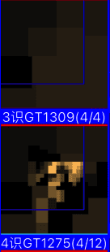
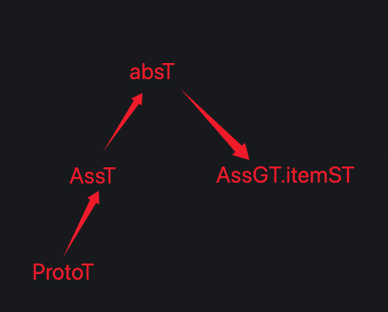
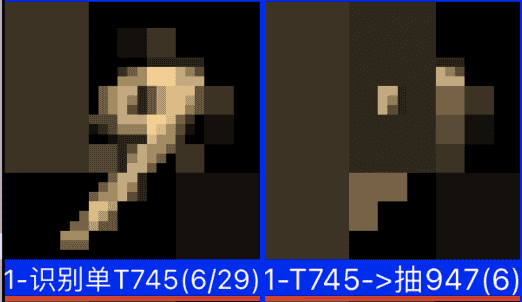
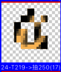
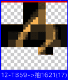

# 继续测和优化GT识别不够准确问题

***

<!-- TOC -->

- [继续测和优化GT识别不够准确问题](#继续测和优化gt识别不够准确问题)
  - [n36p01 提升对撞率二、GT识别不准确问题](#n36p01-提升对撞率二gt识别不准确问题)
  - [n36p01 提升对撞率三、迭代GT识别算法V7](#n36p01-提升对撞率三迭代gt识别算法v7)
  - [n36p02 提升识别准确度、GT识别竞争支持下显著度](#n36p02-提升识别准确度gt识别竞争支持下显著度)
  - [n36p03 提升识别准确度、深入调试GT竞争浮现的细节](#n36p03-提升识别准确度深入调试gt竞争浮现的细节)

<!-- /TOC -->

***

## n36p01 提升对撞率二、GT识别不准确问题
`CreateTime 2026.01.24`

在上节识别不准确问题中（主要是ST的问题），改了ST和GT都支持了“准中取具”，但经回测GT识别还是不准确，后来。

| 36011 | 准中取具后，GT识别仍然不准确问题 |
| --- | --- |
| 示图 |  |
| 复现 | 如上图训练0-9x3后，再扔个9。 |
| 说明1 | 如下代码段：虽然组特征识别总结里，显示91%是9，但其实个别GT识别结果并不准确。 |
| 说明2 | 如上图中，第3条压根无实质内容，完全不成形，第4条还像个9的样子，但仍不够。 |
| 说明3 | GT识别结果第一名（4/5匹配数），也是个不完整的局部特征（只显示了中间一小块儿长方形，未显出9的样子）。 |
| 分析 | 为什么这些前几名，符合度是1，匹配度0.87，防抽0.8，全是高分，但其实与9并不像（参考代码段第一行）。 |
| 思路1 | 查细节：可以把匹配到的元素打出来看看，看下这些元素，是怎么达到符合度匹配度都这么高的。 |
|  | 经调试：GT识别结果的匹配数偏低，转下表先处理这个问题 `转下表`。 |
| 思路2 | 即使结果里也有大致成形的9，为什么这些没能在竞争中优胜？ |
|  | 说明：这个其实还是GT的竞争问题，后面再修，现在先修思路1的子问题。 |
| 结果 | 思路1的子问题到下表继续展开来查修，思路2的问题先放放，后面再说。 |

```java
35154-代码段
//0. 组特征识别结果:T1434     符合度:1.00     匹配度:0.87     匹配数防抽:0.80 =    综合得分:0.692
//1. 组特征识别结果:T1414     符合度:1.00     匹配度:0.87     匹配数防抽:0.80 =    综合得分:0.692
//2. 组特征识别结果:T1309     符合度:1.00     匹配度:0.87     匹配数防抽:0.80 =    综合得分:0.692
//3. 组特征识别结果:T1275     符合度:1.00     匹配度:0.87     匹配数防抽:0.80 =    综合得分:0.692
//4. 组特征识别结果:T1475     符合度:1.00     匹配度:0.87     匹配数防抽:0.60 =    综合得分:0.523
//5. 组特征识别结果:T1334     符合度:1.00     匹配度:0.87     匹配数防抽:0.60 =    综合得分:0.523
//6. 组特征识别结果:T1476     符合度:1.00     匹配度:0.86     匹配数防抽:0.60 =    综合得分:0.516
组特征识别结果总结：(Mnist6=100% ,Mnist9=91% ,Mnist5=88% ,Mnist0=85% ,Mnist8=67% ,Mnist2=65% ,Mnist1=63% ,Mnist7=60% ,Mnist4=37% ,Mnist3=12% )
```

**小结：36011测得GT识别不准确是因为匹配数偏低（对撞率偏低）。**

| 36012 | GT识别匹配数偏低问题 `接35154-思路1-子问题` |
| --- | --- |
| 说明 | GT识别不够准确，测细节，发现普遍匹配数太低（对撞太少是基础都达不到，更别提更后面的准确问题了）。 |
| 复现 | 训练(0-9)x3，然后扔个9，让它识别，发现GT识别匹配数有偏低的问题（一般只有三四条）。 |
| 分析 | absST里有0的上半部分，assGT.itemST也必然存在这个上半部分吗？二者有交集？还是二者有包含关系？ |
|  | 1、二者不可能绝对相等现在就是这种，但匹配数很低。 |
|  | 2、二者不能算交集，因为有交集肯定有非交集问题，会导致猫不是狗，狗也不是猫这样的不准确。 |
|  | 3、absST包含assGT.itemST也不对，因为这样会让absST中有多余gv，识别出后会不准确。 |
|  | 4、assGT.itemST包含absST，这个倒是一切ok，可计为匹配。 |
| 原则 | **现在识别中要求equal对等关系，还是得改成contains全含关系，不然很难对撞上。** |
| 重点 | **说白了现在的识别不准问题说到底还是：对撞太低的问题（即需要提升对撞率）。** |
| 比如 | 比如absST为0的上半部分，而assGT.itemST为9的上半部分，比0的上半部分多一点尾巴，而0的上半部分不带。 |
|  | 此时9上半部分多一两个gv，但包含0上半部分，也应计为匹配上了。 |
| 回顾 | 现在的GT识别算法，上例中这一条ST肯定就匹配不上了。 |
|  | 但其实9的上半部分只是少匹配上一两个GV，别的部分与现在的ProtoT还是很匹配的。 |
| 方案1 | 把GT识别自举算法，改为assGT.itemST全含absST `5%`。 |
|  | 优点、方案1可以直接判断全含，很可靠。 |
|  | 缺点1、判断全含性能太差了。 |
|  | 缺点2、全含后根据全含的gvs也判断不了位置符合，并且计算匹配度算力更吃不消，匹配度和位置符合度都计算不了。 |
|  | 缺点3、全含也不表示这些全含的gvs可组成当前树下真实存在的神经元，它还未组建成node，就不可臆想定义的存在。 |
|  | 否掉、方案1的缺点不可接受：臆想定义 & 无法复用 & 不易计算 & 性能差。 |
| 方案2 | 直接判断mIsC即可，即：assGT.itemST抽象指向absST `95%`。 |
|  | 分析、把GT识别自举算法：改为取出assGT.itemST.content_ps，判断其全含absST.content_ps。 |
|  | 本质、其实取assST的全含抽象（有效抽象），再取assGT.itemST的抽象全含，其实就是判断二者mcIsBro。 |
|  | 缺点、有可能mIsC不成立，但其实全含是成立的，所以方案2性能好但不那么可靠。 |
|  | 优点、方案2的优点是可以复用匹配度。 |
|  | 抉择、方案2的缺点也是一种优点，因为有抽象说明absNode被定义了，它可复用，是真实存在的信息神经元单元。 |
| 方案PK | 1、有可能mIsC不成立，但其实全含是成立的，所以方案2性能好但不那么可靠，方案1可靠但性能差。 |
|  | 2、需要实际分析或测下方案1和2究竟哪个在这里更适合。 |
|  | 3、其实主要性能差是因为assGT很多，不可能一个个全取出来。 |
|  | 4、还有个方法，absST的GV是源自assST，而assST数据不多，assST.GV全取出来也不多。 |
|  | 5、用所有的assST.GV取其refPorts来判断是否全含assGT.itemST也是可以的。 |
|  | 6、不过这仍然需要把assGT.itemST全取出来。 |
|  | 7、画图分析：这里的启发式激活通路，其实就是assST和assGT.itemST，二者有共同抽象。 |
| 白话 | **世上没有两片完全一样的树叶，识别本身就是找共同抽象，只是哪个更准罢了（位置符合&匹配度竞争）。** |
| 结果 | 下表36013继续深入分析确定下该方案有没问题，然后在36014进行工程实践。 |

**小结：36012为GT识别匹配数偏低（对撞率偏低）问题，制定了解决方案，并最终选定方案2。**

| 36013 | 疑问：现在特征识别的通路，要走的层级有点多。 |
| --- | --- |
| 示图 |  |
| 说明 | 如图，从ProtoT到最后一步步识别GT的通路如上图，从这个图上看，我们怎么来优化GT识别算法比较好？ |
| 通路1 | 1. Proto向上：从最具层ProtoT，到似层AssST，再到交层AbsST |
| 通路2 | 2. Ass向上：然后AssGT.itemST本身应处于似层，再向交层取AbsST。 |
| 疑问1 | 那么：我们能否简化一下？是否需要简化？ |
|  | 说明：比如只从ProtoT -> AssST后，不取AbsST了，直接向具象找ConST，然后refGT。 |
|  | 缺点：AssST之所以取有效全含抽象：AbsST，是因为AssST太单一了，它不向上取全含有效抽象的话，甚至具象就只有ProtoT了。 |
|  | 解答：本来就是提升对撞率的，不向抽象匹配激活有效抽象ST，就无法实现广入，所以暂不需要简化。 |
| 疑问2 | 按上图所示，怎么refGT？ |
|  | 解答：现在的refGT方式就ok，取AssST的有效absST后，直接refGT。 |
| 结果 | 现在的特征识别走的通路并不算多，还是继续实践36012的方案2吧 `转下表进行工程实践`。 |

**小结：在36013继续深入分析了36012中解决方案2是否还有什么问题，主要是怀疑其通路复杂，经分析发现方案2没问题，可以继续推进工程实践。**

| 36014 | GT识别匹配数偏低问题：用mcIsBro改进GT识别算法对撞率（参考36012-方案2） |
| --- | --- |
| TODO1 | 其实就是判断assST和assGT.itemST二者mcIsBro=true（参考方案2-本质）。 |
| TODO2 | 然后把二者共同抽象中，复用匹配度相乘（aIsC 乘 bIsC）最best的匹配度计算出来。 |
| TODO3 | 即然GT识别自举用isBro来判断，那切入点是不是也应用absST.conST来refGT（现在是用absST在refGT) |
| 中断 | 以上3个TODO都很简单，其实难点在于GT自举算法也得跟着改，通路一变，整个位置符合度就得重新计算，转下表。 |
| 追加 | 其实以上相当于把GT识别算法的通路都加了一层，这已经不单单是改下mcIsBro了，而是整个模型和算法都需要改进 `转n36p02`。 |

**小结：36014本来要实践TODOLIST了，但发现还是想的不够深入，先中断下，转下表先分析下：GT自举算法需要跟着怎么迭代。**

| 36015 | 继续深入：识别通路变了，GT自举的位置符合度的Rect计算也得跟着变 |
| --- | --- |
| 分析 | 通过预演GT自举算法的步骤，来思考新通路下的Rect怎么算，如下： |
| 第1步 | 本来assST只是识别的准中取具的结果，而absST才是真正的单特征识别结果。 |
| 第2步 | 而为了提高对撞率，用absST.con取的兄弟broST，是可以预估broST_ProtoRect的。 |
| 第3步 | 并且根据broST.refGT后，也可得出broST_AssGTRect。 |
| 第4步 | 统一坐标系：为方便计算需要统一下坐标系，我们可以选择到AssGT下统一坐标系，因为AssGT的元素是确定的。 |
| 第5步 | 自举时：根据每个AssGT.itemST在assGT中的rect，计算预估其在Proto中的Rect。 |
| 第6步 | 把这个预估broST_ProtoRect，转为rectIndex，然后从broST池中，找出rectIndex一样的。 |
| 第7步 | 对以上池中筛选出的有效broSTs，仅保留best匹配度的一条。 |
| 总结1 | 以上步骤，是在位置符合度建立索引，然后完全一致防重的基础上，计算其匹配度。 |
| 总结2 | 即位置符合度绝对是100%，只是匹配度在通过竞争找最准的而已。 |
| 总结3 | 这做法其实和ST识别时是类似的，位置符合的基础上，进行rectIndex防重，进行匹配度best竞争。 |
| 结果 | 经以上分析，看来GT识别确实需要这么大改，且改动挺大的。 |

**小结：35015中，通过预演GT自举算法的步骤，捋顺当前GT识别算法迭代需求的大致情况，且发现这一改动，与先前的ST识别迭代非常相似（ST时是自举切protoRect像素范围，现在是自举预估AtProtoRect范围，其实二者都是回归到ProtoT原图上，取同样的范围，这样可以避免走形问题，并且还始终不脱离ProtoT原图）。**

***

## n36p01 提升对撞率三、迭代GT识别算法V7
`CreateTime 2026.01.29`

上节末捋顺了提升GT对撞率的方式：用mcIsBro来判断GT识别的匹配，相当于识别通路的大变动，整个识别算法，GT识别自举，GT识别模型，计算Rect都要顺着这个通路做迭代，所以本节在这个思路下迭代下GT识别算法V7版本。

| 36011 | 迭代GT识别算法V7版本：TODOLIST |
| --- | --- |
| TODO1 | 把识别过程中的模型迭代为GTModelV2和GTItemV2，支持记录assST、absST、broST `T`。 |
| TODO2 | 新模型中要支持计算assST、absST、broST分别在Proto的Rect `T` |
| TODO3 | 先用assST取absST `现就有这个 T` |
| TODO4 | 再用absST取broST `T` |
| TODO5 | 再用broST取ref.assGT `T` |
| TODO6 | 再对每个assGT做GT自举算法 `T` |
| TODO7 | 性能：用assST_Proto建立rectIndex + absST + broST整个通路来做防重 `T`。 |
| TODO8 | assGTs结果竞争排序可视化debug等代码复用原代码不变 `不用改` |
| TODO9 | GT类比算法也改下兼容新的GTModelV2和GTItemV2模型 `T` |
| TODO10 | 性能1：broST_ProtoRect可用于复用优化性能？还是别的什么作用 `还没明白怎么用，后做` |
| TODO11 | 性能2：同一个assGT，在同一个broST_ProtoRect.rectIndex时，进行防重 `T`。 |

**小结：上表迭代了GT识别算法V7版本。**

| 36012 | 训练和回测：组特征识别 |
| --- | --- |
| 基础知识库 | 跑下0-9x4（0-9依次跑，共跑4轮）。 |
| 回测项1 | 测下对撞率是否已经提升了。 |
|  | 结果：经测对撞率提高了，经常有匹配数8条以上的，以前匹配数只有两条左右。 |
| 回测项2 | 看能不能识别出2和3的区别。 |
|  | 计划：在基础知识库基础上，扔第5张0-9，看下GT识别可视化和总结日志，是否准确。 |
| 结果1 | 经观察，扔0-9整体比较偏向准确，比如0、1、5、8、9都能100%准确。 |
| 结果2 | 但也有别的只是偏向准确，比如2可能识别成100%的3，80%的5，40%的2。 |

**小结：上表测试了对撞率确实提升了。**

| 36013 | 看下“更新logDesc”有没什么问题， |
| --- | --- |
| 疑问 | 看下总结日志，都应该把匹配率乘进去，不然匹配数很低的太占便宜。 |
| 结果 | 把匹配率也乘进去了 `T`。 |

| 36014 | 组特征识别结果只有第一条综合得分>0 |
| --- | --- |
| 日志 | 0. 组特征识别结果:T1489 	匹配度:0.35 	匹配数防抽:1.00 =	综合得分:0.349 |
|  | 1. 组特征识别结果:T1269 	匹配度:0.28 	匹配数防抽:0.00 =	综合得分:0.000 |
|  | 2. 组特征识别结果:T1075 	匹配度:0.28 	匹配数防抽:0.00 =	综合得分:0.000 |
|  | 3. 组特征识别结果:T1074 	匹配度:0.28 	匹配数防抽:0.00 =	综合得分:0.000 |
| 说明 | 如上日志，为什么除了第一条，别的全是0，匹配数防抽全是0。 |
| 原因 | 因为float类型，在计算时分子分母全是int，所以匹配率算出来的全是1和0`T` |
| 结果 | 修复后，不再全是1和0了 `T`。 |

**小结：上表修复了竞争因子匹配数=0的BUG。**

| 36015 | 测区分手写2和3 |
| --- | --- |
| 基础知识库 | 先跑(0-9)x6。 |
| 测试 | 然后扔第7张2和3，只看识别最准确的第一条总结日志如下： |
| 扔2时 | 组特征识别结果总结：(Mnist2=100% ) |
| 扔3时 | 组特征识别结果总结：(Mnist3=100% ) |
| 结果 | 看起来，区分2和3没什么问题。 |
| 追加 | 以上只是总结了第一条GT识别结果，因为第二条开始识别率很低，转下表查修 `T`。 |

| 36016 | 问题：查为什么GT识别结果第一条匹配率高，后面的都低。 |
| --- | --- |
| 分析 | 比如第一条匹配率是（15/15），第二条开始就成了（5/13）、(4/17)、（2/12）等很低的匹配率。 |
| 修复 | 第1条是ProtoT，第二条开始才是正常的，把ProtoT过滤掉了 `T`。 |

**小结：上表把ProtoT从GT识别过程中过滤掉。**

| 36017 | logDesc的传递问题 |
| --- | --- |
| 说明 | 边跑边测哪里有不合理的细节问题，就改下，如下： |
| TODO | logDesc不需要从protoGT传递到assGT，虽相似但自己就是自己，相似之处已经存到absT中了 `T`。 |

**小结：上表改了个细节问题：“logDesc不从protoGT传递到assGT”，**

| 36018 | 测GT识别结果的竞争浮现过程：“GT识别中未体现出显著度的问题”。 |
| --- | --- |
| 经测 | GT竞争浮现过程效果不够明显，下面分析之。 |
| 问题 | GT竞争浮现效果没那么明显，GT识别的结果往往不是很明显的成形。 |
| 疑点1 | 是GV压缩，导致了GT识别有影响？（轮廓和细节要区分判断匹配权重？） |
|  | 分析、本来T模块只有指针类型，只允许抽具关联来判别，不管GV压不压缩，在ST时都不允许再用稀疏码计算。 |
|  | 结果、所以不是这个疑点的问题，想想别的疑点，如下。 |
| 疑点2 | 加训基础知识库，自然能把基础特征都抽出来，无论0-9还是别的，最终都由这些基础抽象特征来拼成。 |
| 分析 | 疑点2需要细节分析下步骤，如下： |
| 步骤1 | ST可能来自0-9任何一处（比如0上半部分，可能来自9也可能来自6，来自0）。 |
| 步骤2 | ST一定要可以识别到这些显著特征（比如要可以从assST的有效抽象中，可稳定取到0的上半部分）。 |
| 步骤3 | 识别GT时找broST，那么如果一个absST是显著特征，在这个过程中有什么竞争优势？ |
|  | 解释：如果它没有竞争优势，我们找不找得出这个显著特征，就体现不出意义。 |
|  | 线索：识别的assST->absST->broST通路中，如果absST是0的上半部分，那应在GT识别竞争中体现出其优势。 |
|  | 思路：它能体现出竞争优势，这个稳定的抽象才能体现作用：“使显著的ST在GT识别结果中有所体现”。 |
|  | 解答：即在GT识别中，应该让ST的显著度影响竞争因子。 |
| 总结 | 如上疑点2，及其展开的步骤分析（尤其是步骤3），挑明了现在问题出在显著ST没在GT识别中体现出来。 |
| 方案 | 把ST显著度作用于GT识别竞争。 |

**小结：上表测得GT竞争浮现不够明显的问题（说白了就是显著特征未起到作用），并分析制定解决方案。**

| 36019 | 继续深入分析显著特征：“显著特征的竞争浮现演化” |
| --- | --- |
| 意义 | 显著ST的意义在于，线段是由两个端点一条线组成的，而不是由一小段线段，再加一小段线段...组成的。 |
| 问题 | 如何保证protoGT或absGT是由显著特征构成的？ |
| 演化 | 我们应该让越来越显著的抽具象ST树，能够浮现出来，这将是高质量识别的升华。 |
| 分析 | 如果GT不由显著特征构成，我们怎么让它慢慢由显著构建的越来越多，这个演化步骤分析如下。 |
| 步骤1 | ProtoT都是不显著的（显著和不显著的全在里面），由具层assSTs构建而成。 |
| 步骤2 | 用assST取absST时，就可以体现显著度了，使之越显著越有竞争力。 |
| 步骤3 | 用absST取broST时，依然体现显著度，使之越显著越有竞争力。 |
| 步骤4 | 因为步骤2和3的竞争，可把assGT中，那些竞争力强的显著ST，构建成absGT。 |
| 步骤5 | 这些显著度高一些的absGT，在今后的竞争中，会更容易优胜，变的越来越显著。 |
| 总结 | 以上步骤，仅通过步骤2和3的改动，就顺利把整个GT的显著演化过程打通了。 |

**小结：上表深入分析了显著特征的竞争浮现演化过程，并寻得步骤2和3这两个关键，为后续TODOLIST找准了方向。**

| 3601a | 示例分析：没有显著度相当于匹配度高但识别错误识别结果。 |
| --- | --- |
| 白话 | GT识别通路解决了宽入的问题，但窄出用匹配度是不够的，有**很多匹配度高的错误识别结果**。 |
| 回顾 | 36018的前提当时跑代码时，就是明明很多像2的结果，但其实只是别的数字的某部分形似，是却又不准。 |
| 示例1 | 2也有0的上半部分，但没人会直觉上优先2的半圆。 |
| 示例2 | 4也有7的横竖拐角，但4的显著特征是ㄥ和⎜，而不是左下角的7和上半部分/L。 |
| 总结 | 如果不做显著度，相当于有很多“匹配度高的错误识别结果”。 |

**小结：上表继续通过示例分析了显著度的重要性，将当前问题总结为：“匹配度高的错误识别结果”。**

***

## n36p02 提升识别准确度、GT识别竞争支持下显著度
`CreateTime 2026.02.07`

上表36019和3601a，敲定了GT识别中显著度的重要性，以及TODOLIST的切入点（参考36019步骤2 & 步骤3）。

| 36021 | GT识别竞争支持下显著度：TODOLIST |
| --- | --- |
| TODO1 | 将assST指向absST的强度计为计算显著度的因素之一 `T`。 |
| TODO2 | 将absST指向broST的强度计为计算显著度的因素之二 `T`。 |
| TODO3 | 核实下特征抽象时，增强强度strong+1 `T 本来就有`。 |
| TODO4 | 考虑下抽具象强度每次不是+1，而是+抽具象匹配率 `这个属于后续优化，先测着有效再做这个`。 |
| 回测 | 没什么效果，经测显著度都是1，0.64，0.8什么的，似乎分母比较小？转下表继续查下。 |

| 36022 | 继续查下GT识别加上显著度后，效果不理想的原因。 |
| --- | --- |
| 可疑1 | absT很难对撞，所以显著值strongValue应该无法正常累计起来（导致全是1，0.64等）。 |
|  | 思路：但它的GV是可以累计起来的。 |
| 可疑2 | ST识别竞争也得加上显著度吧？ |
|  | 思路：ST都没有抽象，如果要加显著度，相当于必须分析其GV是否显著了。 |
| 实践分析 | 两个可疑都指向GV，相当于抽象ST中，每个GV都要单独统计强度值（AIPort.strong）。 |
|  | 但是contentPorts必然是同时统计的，所以字典和不字典也没差别。 |
|  | 所以：可以把abs的content的总和统计值，统计到con中，这样就可以了。 |
|  | 相当于在conT.contentPorts中的强度值。 |
| 白话 | **ST的显著度不能以ST的抽具Port强度来，而是以元素GV的被抽象使用次数来。** |
| TODO1 | 类比T时，把absT的内容，在assT中的contentPort的strong+1 `T`。 |
| TODO2 | 在GT识别absST的显著度:以具象(assST/broST)的contentPorts的强度统计来做显著度 `T`。 |
| 回测 | 看起来显著度确实各种精度值都有了 `T`。 |
| 追加 | 但GT识别的竞争浮现仍不明显，还是得深入细节调试整个流程。 |

**小结：上面两个表，在GT识别中新增了显著度，不过识别准确度效果不明显，需要继续深入细节中查一下，转下表。**

***

## n36p03 提升识别准确度、深入调试GT竞争浮现的细节
`CreateTime 2026.02.08`

| 36031 | 大岗：深入调试GT竞争浮现的细节。 |
| --- | --- |
| 前期准备 | 训练下基础知识库：0-9x5轮。 |
| 调试项1 | 调试下扔2识别2时，识别结果中logDesc也是2的结果： |
|  | ST识别：在assST结果中，它们的匹配项及等竞争因子实际情况。 |
|  | GT识别：在assGT结果中，它们的匹配项及等竞争因子实际情况。 |
| 调试项2 | 边测试边调整ST竞争因子，使识图结果浮现显著局部特征OK。 |
|  | 比如：随着竞争浮现，可以取到0的上半部分，或者2下面的拐角，或者5左上的直角。 |

**小结：制定了深入细节测试，先测ST，再测GT的大岗。**
**计划：下面测调ST的竞争浮现及竞争因子参数，目标是随着竞争浮现，可以显示出局部显著特征（如0的上半部分，2下方的拐角，5左上的直角）。**

| 36032 | BUG1：9里面识别到了0的BUG（GV零散导致的特征不独立问题） |
| --- | --- |
| BUG1 |  |
| 如图 | 明明扔的是0，却识别到assST=9，匹配到6个GV，但这些GV不相邻。 |
| 思路 | 看起来这6个GV确实摆出了0的样子，只是这些GV并不是9的显著特征。 |
|  | 而是很多边缘边角料呈现出来的0的一点外轮廓的样子。 |
| 原因 | 看起来就是：“GV零散导致的特征不独立问题” |
|  | 相邻才可能共同呈现出一个明确独立的局部特征。 |
| 方案 | ST识别时，GV匹配优先相邻的（给相邻度评分做为ST竞争因子）`T`。 |
| 回测 | 发现效果不明显，下表BUG2修了后，再测试。 |

**小结：上表修ST特征识别太零散问题，加了相邻度，不过效果不明显。**

| 36033 | BUG2：很多ST识别结果都是铺满画布的 |
| --- | --- |
| 说明 | 发现很多都是27x27把画布铺满的，其实前面就发现这个问题了，不过一直没修。 |
| 方案 | 可以加个粒度竞争因子：太大的GV粒子，或太小的GV粒子，都打压一下 `T`。 |
| 回测 | 发现效果不明显，下表继续查修。 |

| 36034 | 问题：调试下27x27的竞争因子都是什么值，为什么它那么强总是可以优胜。 |
| --- | --- |
| 经查 | 27x27的全是切入点。 |
| 方案1 | 铺满画布做切入点没意义，粒度太大了（可以先去掉27x27的切入点试下识别）`粒度太大，转方案2`。 |
|  | 经查：现在dotSize粒度是>5才行。 |
|  | 所以：九宫就是3倍，即15-27最大，所以切入点太大了，现在的切入九宫范围为:15-27。 |
| 方案2 | 把切入九宫范围从现在的15-27 -> 调整为3-13.5，把极大极小都切掉。 |
|  | 说明：把GV粒度调整为3-(27/3)，即SV大小为1-(27/6)， |
| 重点 | **粒度太小切分组20%都不够，太大则只有轮廓而已，二者意义都不明，还浪费很多性能(参考35126)** |
| TODO2.1 | 即dotSize的范围为1-4.5之间 `T`。 |
| 测图 |  |
| 回测 | 改方案2-TODO2.1后，全是27x27的问题好了（如上图），但有性能问题，转下表进行优化。 |

**小结：上两表修ST识别总是铺满画布的问题，加了dotSize粒度切入范围，回测ok。**

| 36036 | 上表调整切入点范围后，ST识别有5000多条，非常卡 |
| --- | --- |
| 思路 | 有一些ST结果即可，那些过抽象的，提前就可以过滤了。 |
| 本质 | 说白就是广入窄出，广入太多了（无非是针对广入的竞争不够激烈）。 |
| 方案V1 | 以前有过类似做法：直接只取最具层isJiao=false，交层全过滤掉。 |
|  | 说明：把所有refPorts的强度前x名大量减少即可。 |
|  | 优点：本来就没法照顾到所有似交层特征，只识别似层，然后交层通过有效抽象也可取得。 |
|  | 缺点：现在的refPorts太散了，都是针对不同的gv来ref的，所以不太好同台竞争。 |
|  | 实践：改后发现没效果，虽然确实过滤了交层，但激活的ST仍然很多。 |
| 思考进展1 | 增强相近GVs的竞争力，以减少GV切入点。 |
|  | 说明：40个gv，分别激活相近的20个gv，又分别ref到5个assST，就是4000条了。 |
|  | 白话：说白了，要加强GV的竞争淘汰机制。 |
|  | 分析1：最终稳定浮现的局部特征无非是线，弦，角，方形，等这些常见的。 |
|  | 分析2：组成这些稳定的“线弦角方”的GV就是我们应该采纳的切入点，别的全否掉。 |
|  | 问题：用什么竞争因子来实现GV的竞争？ |
| 思考进展2 | 用GV相近度来实现GV竞争。 |
|  | 缺点：相近的特多，并且相近不表示准确，如不同光线相近度很不同，但结果导向时发现它才是准确的。 |
| 思考进展3 | 结果导向，当GV识别到稳定浮现的ST时，加强其GV.refPort.strong强度。 |
|  | 缺点：GV.refPort.strong来竞争，又有方案V1中refPorts太散的问题。 |
|  | 思路：不管太散了，把这些散的全收集起来，然后用强度统一竞争淘汰吧。 |
|  | 比如：全国高考时，总分都差不多，那么随便一个考生直接问总分，也是可以大致判断出成绩好坏的。 |
| 方案V2 | 把GV.refPorts全收集起来，只对前20%强度的refPort对应的assST进行识别。 |
|  | 说明：即无论是GV.refST还是st.refGT，在广入上都要控制好量，量太大肯定就爆炸。 |
|  | 比如：GV的refPorts中最强的，就是ST中最常用的，如“线弦角方”等这些ST（参考35105-方案2-解决）。 |
| 子问题1 | “线弦角方”这些ST如果从似层找，其强度很难累计成长起来（参考35105-方案2-解决）。 |
| 子分析1 | 能不能累计成长起来，要看assST的候选量（越少越好），以及累计次数（发生越多越好）。 |
| 子解答1 | 识别累计次数是相对固定的A，而取似层则候选量少B，所以A/B应该是更容量累积的。 |
| 示例推演 | 1. 比如刚开始识别陌生物种都是一模一样的。 |
|  | 2. 后面慢慢这些GV慢慢构建起来。 |
|  | 3. 其GV.refST.strong也慢慢构建越来越强。 |
|  | 4. 才能达到原知识激活的min阈值，才有资格激活。 |
|  | 5. 才能够识别分辨这个陌生物种。 |
|  | 注1. 活的越久，这个min阈值就越强大，越难达成。 |
|  | 注2. 亦可借助即有特征提前达成识别：如陌生物种的肤色、身高、胖瘦，毛发长短。 |
| TODO | ST识别算法中，把GV.refPorts全收集起来，竞争强度，只保留强度最强的20到100条 `T`。 |
| 回测 | 经回测，性能好了，但有别的问题，转下表。 |

**小结：上表修复了ST识别的性能问题，但有别的问题转下表。**

| 36037 | 问题：GV.refPorts强度排名靠前的全是同一个assST，最终强者恒强。 |
| --- | --- |
| 说明 | 问题体现为：从同一个assST中可以找出任意局部ST，并拼成0-9任何一个数字 |
| 问题1 | 但全从一个assST中各种protoRect找局部特征，它匹配率一般都偏低（用0识别1肯定匹配率很低）。 |
| 问题2 | 如果不识别就不知道它很低，如果识别了，它就排在前100名被正常广入。 |
| 方案v1 | 要么把广入增加一些，让别的都有机会进去。 |
|  | 缺点：如果前3000条全是同一个assST呢？总不能增加3000条机会 |
| 方案v2 | 要么同一个assST与proto的识别结果：只保留最准确的一条。 |
|  | 缺点：怎么找出识别结果最准确的一条呢，如果有3000条难道全识别一遍？ |
| 方案v3 | 同一个assST与proto的识别结果：只保留最准确的一条，且给10次识别机会 `95%`。 |
|  | 说明：如果10次还捕捉不到很好的局部匹配，那说明assST和protoT真的很不一样，不必强找相同局部。 |
| 抉择 | 方案v1缺点会导致性能差，方案v2也一样，方案v3折中，即照顾了10次保底机会，又不至于拖死性能。 |
| TODO1 | 同一个assST只允许进十次 `T`。 |
|  | 实践：写个计数字典即可 `T`。 |
| TODO2 | 同一个assST怎么只保留最准确的一两条？`不用改，当前竞争机制本就可以` |
|  | 解答：在竞争中，把不准确的那些assST多余条数自然竞争淘汰掉。 |
| 回测 | 经回测有效果。 |

**小结：上表修复了一例BUG。**

| 36038 | ST识别结果中：最准确的为什么排在最后面 |
| --- | --- |
| 示图 |  |
| 说明 | 识别0时，识别到结果0的匹配数最高，但竟然排在最后一名，查下原因，日志如下： |
|  | 0. 单特征识别结果:T1491 	(5/41) 	匹配度:0.72 	匹配数防抽:0.29 区域竞争力:0.57 (总分35/科数8=均分4) 	相邻度:0.65 	中心度:0.96 = 总分:0.36 |
|  | 1. 单特征识别结果:T1599 	(4/38) 	匹配度:0.73 	匹配数防抽:0.24 区域竞争力:0.60 (总分37/科数8=均分5) 	相邻度:0.76 	中心度:0.74 = 总分:0.34 |
|  | 2. 单特征识别结果:T1560 	(4/32) 	匹配度:0.74 	匹配数防抽:0.24 区域竞争力:0.62 (总分53/科数11=均分5) 	相邻度:0.52 	中心度:0.98 = 总分:0.31 |
|  | 3. 单特征识别结果:T1491 	(7/41) 	匹配度:0.76 	匹配数防抽:0.41 区域竞争力:1.00 (总分85/科数11=均分8) 	相邻度:0.55 	中心度:0.50 = 总分:0.28 |
|  | 4. 单特征识别结果:T1560 	(3/32) 	匹配度:0.80 	匹配数防抽:0.18 区域竞争力:0.71 (总分38/科数7=均分5) 	相邻度:0.65 	中心度:0.54 = 总分:0.25 |
|  | 5. 单特征识别结果:T859 	(4/38) 	匹配度:0.75 	匹配数防抽:0.24 区域竞争力:0.73 (总分34/科数6=均分6) 	相邻度:0.43 	中心度:0.69 = 总分:0.22 |
|  | 6. 单特征识别结果:T893 	(6/23) 	匹配度:0.81 	匹配数防抽:0.35 区域竞争力:0.65 (总分5/科数1=均分5) 	相邻度:0.50 	中心度:0.64 = 总分:0.21 |
|  | 7. 单特征识别结果:T1491 	(8/41) 	匹配度:0.75 	匹配数防抽:0.47 区域竞争力:0.65 (总分35/科数7=均分5) 	相邻度:0.32 	中心度:0.92 = 总分:0.19 |
|  | 8. 单特征识别结果:T859 	(9/38) 	匹配度:0.74 	匹配数防抽:0.53 区域竞争力:0.52 (总分4/科数1=均分4) 	相邻度:0.38 	中心度:0.94 = 总分:0.18 |
|  | 9. 单特征识别结果:T1529 	(7/43) 	匹配度:0.71 	匹配数防抽:0.41 区域竞争力:0.63 (总分34/科数7=均分5) 	相邻度:0.36 	中心度:0.79 = 总分:0.18 |
|  | 10. 单特征识别结果:T1491 	(7/41) 	匹配度:0.72 	匹配数防抽:0.41 区域竞争力:0.63 (总分34/科数7=均分5) 	相邻度:0.32 	中心度:0.71 = 总分:0.15 |
|  | 11. 单特征识别结果:T859 	(17/38) 	匹配度:0.70 	匹配数防抽:1.00 区域竞争力:0.29 (总分9/科数4=均分2) 	相邻度:0.54 	中心度:0.91 = 总分:0.14 |
| 分析 | 如上日志，各项全是满分，但区域竞争力竟然是最低分，这个区域竞争力应该可以废弃了。 |
| 正据 | 前段时间一直想废弃它，但没机会，这次算是需求明确了，该废弃了。 |
| 回测 | 废弃掉后，最准确的不会排在后面了，排在前面了。 |

**小结：上表修复了ST识别准确的排在最后面问题，把区域竞争废弃了，下表继续测GT识别的准确问题**

| 36039 | 继续测GT识别及调参 |
| --- | --- |
| 说明 | GT识别结果明确不准确，跑了0-9x4的基础视觉库后，识别还是不准确。 |
| 明日 | 调试下GT识别算法的竞争，看为什么不准确，原因，及调用。 |
