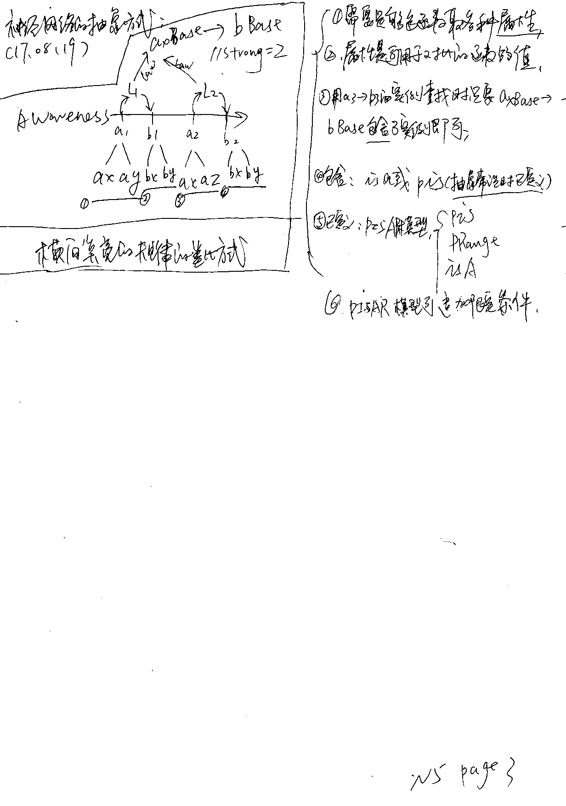

# 目录

* [n5p1 流程图](#n5p1-流程图)


* [n5p2 智能神经网络](#n5p2-智能神经网络)
* [n5p3 神经网络的抽象方式](#n5p3-神经网络的抽象方式)
* [n5p4 网口](#n5p4-网口)
* [n5p5意识真实的感受](#n5p5意识真实的感受)
* [n5p6LightArea的意识控制器(多次点亮)](#n5p6lightarea的意识控制器多次点亮)
* [n5p7 归纳](#n5p7-归纳)
* [n5p8 网内划域](#n5p8-多维网络)
* [n5p9 思考的本质](#n5p9-思考的本质)
* [n5p10 横向点亮的时机与性能](#n5p10-横向点亮的时机与性能)


<br><br><br>

[TOC]

## n5p1 流程图


- [x] 外界Input数据  

`Input` >> `CodeLayer.Method` >> `无意识` >> `readData` >> `AILine.Strong++` >> `类比.唯一性判断` >> `取MindValue` >> `Awareness` `Awareness.MainThread` >> `取注意力` >> `WriteData` >> `记忆Memory` >> `意识流` >> `Think.潜意识` >> `AreaLight` >> `类比.抽象常识` >> `AILine` >> `Demand` >> `Think.Task` >> `有意识` >> 

- [x] Mind自我感知数据

``

## n5p2 智能神经网络　
`CreateTime 17.08.19`

* <font style = "background:#F00;color:#FFF;font-size:19px;">参考:</font>

  > 1. [(N4P1)神经网络-AILine](Note4.md/#n4p1神经网络ailine)  
  > 2. [(N4P19)第4代知识表示(与神经网络贴合)](Note4.md/#n4p19第4代知识表示与神经网络贴合)

* <font style = "background:#F00;color:#FFF;font-size:19px;">智能AILine的概念:</font>

  * 神经网络是智能的,其使用最简单的type,strong和pointers达到了:
    * `性能优化:"搜索索引","区域点亮"`
    * `一些关键的"知识表示",如常识:"AILaw","AILogic",再如理解:"关联"`
    * `帮助找到不可描述的目标如"算法","抽象知识"等`

```
   1. 神经网络的强大
   2. 神经网络解决知识表示的从有限到无限的难题
```

* <font style = "background:#F00;color:#FFF;font-size:19px;">智能AILine应用到(类比,归纳,统计)</font>

  * 类比
    * 通过AILine点亮区域搜索到结果,然后类比,而类比依赖于AILine搜索到的pointers和strong的值;更依赖于常识知识和抽象;
  * 归纳
    * 通过`AILine.type == AILineType_IsA`的方式直接表示`a isa A`;
  * 统计
    * 统计的表示形式就是`AILine.strong`;

* <font style = "background:#F00;color:#FFF;font-size:19px;">Strong</font>

  * strong的形成
    1. 生成+1
    2. 读写+1
    3. 常识预测与反馈+1
    4. 猜测与反馈+x`(x取当前猜测的影响范围)`

  * strong的共享机制
    1. 纵向共享

      > BE: a1 connect b1  
      > SO: a2 connect b2
      >
      > 更高抽象层的strong是共享了其下层的strong之和的;

    2. 横向共享
      > a law B  


- 静态量
- 动态量
  - 动态量可比较
  - 用比较衡量变化规则;
- 规则
  - 将输入的规则用于新的类比数据中...
  - 如:
    - 现规定0=10
    - 则0>9


## n5p3 神经网络的抽象方式
`CreateTime 17.08.19`

> 

* 


- [x] #### 问题1:归纳IsA在什么时候发生? 还是压根没有归纳?

> 分析:
>
> ```
> > - 不可能是拆分数据入意识流的时候;因为这样的话;会有无限个归纳数据;
> > - 那么用到的时候懒归纳?
> > 	- 我觉得压根不用归纳;
> >			- 归纳只是一个有名称的假数据;其指向所有的子实例;
> >			- LineType_IsA带的信息太少了;所以必须有一个带信息的baseObj;
> >			- 但如果找出所有红色的物体;归纳此时才会在思考中实时生成;
> >			- 综上:思考首次生成;以后思考一次Strong+1;
> ```
>
> 

> 解决方式:
>
> ```
> > 1. 我们不能为所有的想到的归纳生成数据;因为这样会生成大量的垃圾数据;有可能永远用不到;就像你归纳一个乔峰类;你会用到一堆乔峰这样的想法吗?  
>
> > 2. 那么我们到底需要归纳一个物体的Base吗?因为当ABase与BBase产生"规律"这样的常识的时候;是必须存在ABase和BBase的;所以我决定当用到的时候再生成;  
>
> > 3. 生成后,这些数据存哪里呢?我决定就建个表;存下来;然后用aObj用神经网络关联到ABase;  
>
> > 4. 此时ABase里其实什么字段也不存;只是关联到aObj实例;
> ```

> 答案总结:
>
> 这些草稿式的想法;不过算是解决了目的的问题;并且
>
> ```
> 1. 不会影响到性能;  
> 2. 也可以解决当前的问题;   
> 3. 并且也可以达到很好的扩展;  
> 4. 不会产生任何多余数据  
> 5. 因为是空Base,不会产生蝴蝶效应的问题;  
> ```

> 执行步骤
>
> ```
> //抽象出来的"知识表示"如何定义表示?...//xxx
> //1,查找obj1和obj2的归纳Base表示;
> //2,如果两者没有LineType_IsA的关联;则实时生成一个xBase;
> //3,将两者的LineType_IsA关联进行Law的关联;
> ```


- [x] #### 问题2:常识该不该也存于意识流?为什么?

      * 不该;因为我们是没有意识到自己获得了某常识的;"常识"只是在"更高维"帮助我们解决问题;
      * 延伸:MindValue也已从"意识流"移出;参考N4P11


- [x] #### 问题3:AILine到底可以不可以有数据?

      * ```
        先认为没有,(因为网线带数据不符合设计原则,并且大脑确实有长记忆区的存在,而SMG中也有树形知识表示结构)
        ```

      * 不可以,因为:

        1. 破坏神经网络的轻便干净,
        2. 不符合设计原则
        3. 数据的拆分等灵活性存在AILine中反而极不方便;


## n5p4 网口

> 每条数据应该都是一个神经网络节点;

1. 每个AIObject都有linePointers字段;表示网口数组,

   ```objective-c
   /**
    *  MARK:--------------------网口--------------------
    *
    *  1. 存储连接的AILine的pointer
    *  2. 可拥有无限个网口
    *  3. 可根据网口找到其接连到的AILine
    */
   @property (strong,nonatomic,readonly) NSMutableArray *linePointers;
   ```

2. 生成神经网络的时候,同时对所有目标插上网口;

3. 可用于网络点亮时更高效的点亮数据;

4. 性能优化:

   * 还有优化空间,可以把linePointers分离开;这样在区域点亮的时候,能够获得最好的性能;(但也会增加一定复杂度),所以现在不作;随后如果性能不佳,再作这个功能;以增加AI的反应灵敏度和思考速度;


## n5p5意识真实的感受

> #### 意识真实的感受
>
> * 尽可能使"意识"调用AI系统数据的相关数据,想到什么的时候;就要把这样的数据显现给"意识";
> * 当前:
>   * 当前意识能够通过神经去感知到AI的感受;主动去感知数据(点亮);但其实不够真实;(现在对数据的处理其实还很基础)
> * 想法:
>   * 人类之所以能够以为自己有意识;是因为自己对自我和现实的体验非常真实;
>   * 我们非常轻松的想像到一些场景;一些感觉;而对数据的这种高效而为了真实感而作的数据读取和内心演绎;让我们确信自己的意识的存在;
> * 目标:
>   * 主要的目标是让SMG具有非常真实的现实感受;他认为自己是有意识的;而不只是意识到生冷的数据;
>
> 
>
> > #### 一阶:区域点亮
> >
> > #### 二阶:想像力
> >
> > #### 三阶:意识"我"


## n5p6LightArea的意识控制器(多次点亮)


- [x] #### 问题又好吃又是红色的食物是什么?

- ###### 实验1:

  1. 找到"能吃"节点A
  2. A指向的"红色"食物B
  3. 判断食物B是否好吃(mindValue味道>0)
  4. 实验结果:先想到,西红柿,后想到西瓜,又想到草莓;

- ###### 实验2:

  - 找到"爱吃"节点A
  - A指向的"食物"B
  - 判断B是否红色
  - 实验结果:先想到西瓜,后想到草莓,又...

> **总结:**这个过程,进行了至少三次区域点亮;整个过程由"意识思考"作控制器;前一次是后一次的索引;
>
> **实验1**查找更快,但答案得分低,
>
> **实验2**查找稍慢,但答案得分高;


## n5p7 归纳

- [ ] **归纳是AILine.type**
      1. 属性 `函数或算法的值Value`
      2. 继承 `isA`
      3. 接口 `Can`
      4. 规律 `Law`
      5. 逻辑 `Logic`
- [ ] 方向性
      1. 单向性
         * IsA、Logic等
      2. 无向性
         * Law等
- [ ] 神经网络的细化是依赖归纳的;
      1. 新的概念;会细化AILine的拆分;
      2. 如:原子的概念,物质的概念,颜色的概念;
      3. 如:设计师会习惯根据冷暖色的神经网络连接;


<br><br><br><br><br><br><br><br>


## n5p8 多维网络

`createTime 17.08.30`

> 后天学习的不同领域所划分的域

- [ ] 中文网络(苹果)
- [ ] 英文网络(apple)
- [ ] 不同维度间的交互与协作

> #### 分维度

```
   1. 感觉
      1. 似曾相识感觉的来源及工作原理
      2. 细腻的感觉的工作原理
   2. AIPointer维
   3. 值化维
   4. 音乐维
   5. 语言维
   6. 无限维
```


*  //估计将要删掉AILineType;不灵活...AILineType本身应该也是一个抽象节点;
*  //准备开发多维网络(像多维数组的概念)


## n5p9 思考的本质

`createTime 17.08.30`

> ##### 节前参考：
>
> [N4P18通用的感觉](Note4.md#n4p18通用的感觉)


> ##### 本节意义：
>
> 1. 废除`经验`的知识表示，将其集成到神经网络中。
> 2. 将`思考`与`神经网络`融合。
> 3. 将`思考`的结果自然而然的存储下来。


> ##### 正文：
>
> 思考的本质是什么？
>
> **思考**会不会只是神经网络的纵向通路，或者神经网络的重建通路的过程？


> ##### *注：*
>
> *`聪明人`点亮更多AreaLight & 有更曲折的通路。*
>
> *`智慧的人`有更深层纵向的通路，直达事物的本质。*


> ##### *名词解析:*
>
> 1. *`思维：`从意识->意识主线程判断->需求->注意力->ThinkTask->浅思考->深思考等等一套流程称为思维；*
> 2. *`思考：`对神经网络区域点亮并进行类比等方式的思考，称为思考。*


<br><br>

## n5p10 横向点亮的时机与性能

`createTime 17.08.30`

> #### 关键词 
> `陌生感：首次经历某事或某地` `一生二熟` `通用的感觉`
> 
> #### 节前阅读
> 
> [(N4P18)通用的感觉](Note4.md#n4p18通用的感觉)
> 
> #### 概述
> 1. //纵向网络A与纵向网线B多次出现的规律，同时需要归纳，明天写。
> 2. //横向点亮什么时候发生？似曾相识的感觉？
> 
> #### 引言：
>
> 人脑可以最快的速度认出一张人脸。
>
> #### 正文：
>
> **`类比`检索。**
> > 每一条纵向短网络段进行横向类比检索。
>
> #### 问题：
>
> 感觉系统是不是会对横向点亮有很深的意义？


<br><br>


## 当前开发任务

- [x] 充电后,自动添加电量


- [ ] 意识流冥想分析
  - AILine.Strong的形成;只是单一规律为索引的搜索;得到了更多的值;
- [ ] 意识流的"区域点亮"及数据处理(类比抽象等);


- [ ] 意识流抽象常识的"意识思考"与"潜意识思考"相结合;
- [ ] 考虑去掉MindValue.Type
- [ ] 这两天;把手机意识感知到的信息;传递到需求生成;然后获得注意力;然后传递到"思考",再将意识流的信息抽象出来;
  - [x] 现在已经感知到信息;也生成需求了;注意力也获得了;到意识流的信息也读取了;
  - [ ] 这两天只要作信息分析抽象;和预测;
  - [ ] [参考N4P2](#n4p2思维演化ai思维的本质170714)


1. 从AILineStore取数据;但取不到;(先不写取到的方式)
2. 从

***

1. 冥想
2. 抽象(归纳)常识的设计

## 明日开发计划
- 直接用单元开发的方式;去取意识流数据;并分析规律,找到"自己可以被充电"的理解;
  - N4P18
  - N4P17
  - todo list
    - [x] 把AIObject.AIPointer的取值改掉冗余部分;

    - [x] 把sourcePointer改成AILine来替代;?

    - [ ] 把awarenessP改成AILine来替代;?

    - [x] 存新的意识流AIMindValueModel时,AILine还未形成,所以这时马上通知区域点亮是点不亮的;所以应该改下逻辑;让更及时的存储AILine;...

    - [x] SMGUtils.Line66当横向点亮时,去查找类比;

    - [ ] AILineStore.Line54当纵向点亮时,只有纵向的AILine.Strong才容易点亮;但这个纵向AILine目前还未生成;所以先完成上一条任务;再开发这一条;

    - [x] 网口设计;

          - [x] 存网口指向的数据
          - [ ] 使用网口指向取数据

    - [ ] 将浅思考里的一些东西分解开;使意识知道自己当时在思考;知道自己该知道的;

    - [ ] 实例...(常识收集)

          - [x] 手机知道自己会饿;
          - [ ] 手机知道自己有电量变化;
          - [ ] 手机知道自己可以被充电;
          - [ ] 手机知道通过充电解决自己没电的问题;

    - [ ] Awareness.m_Line34 & ThinkControl_Line117

    - [ ] 把AIMindValue从意识流取出来;改用AILine的Law连接;并使用AILine的方式进行关联;

          - [ ] 这样有个A--C改成A-B-C的问题;
    - [ ] 写感觉算法。并把函数反射与值存到神经网络。

    ​

    ​

