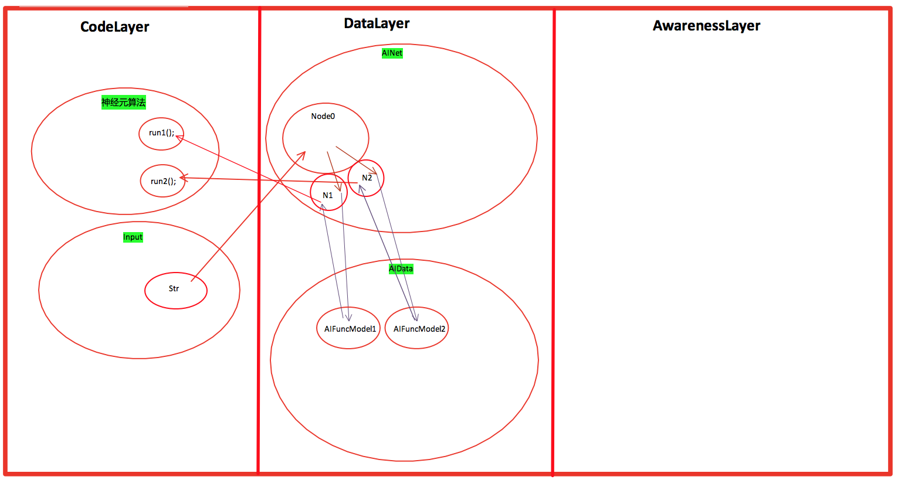
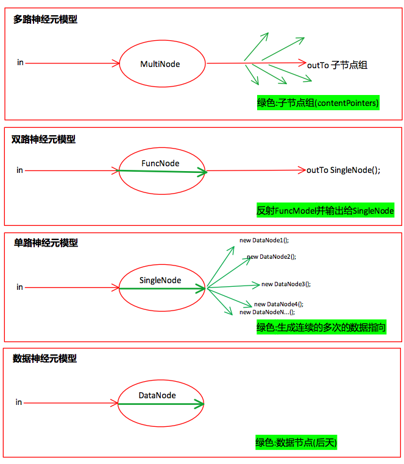
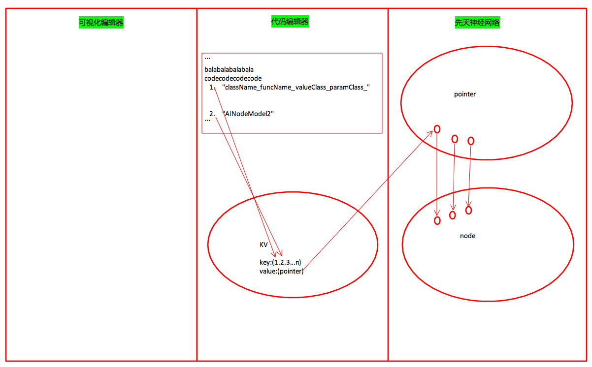
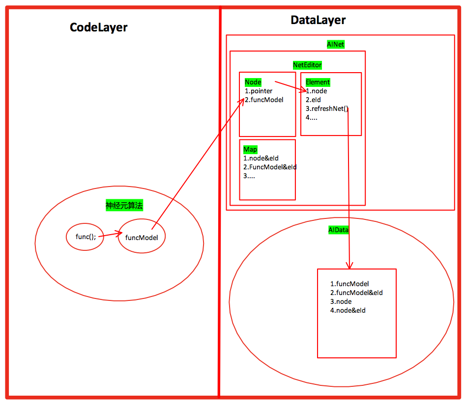
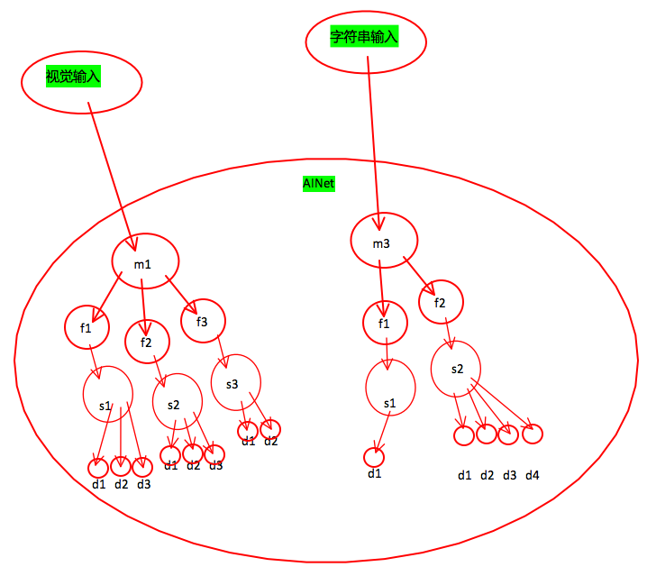

# 目录

* [n7p1 神经元与先天神经网络](#n7p1-神经元与先天神经网络)
* [n7p2 AINode模型](#n7p2-AINode模型)
* [n7p3 先天神经网络编辑器](#n7p3-先天神经网络编辑器)
* [n7p4 LOP代码规范](#n7p4-lop代码规范)
* [n7p5 双路神经元](#n7p5-双路神经元)
* [n7p6 Input至神经网络功能区](#n7p6-input至神经网络功能区)
* [n7p7 神经网络与意识](#n7p7-神经网络与意识)


<br><br><br><br>


## n7p1 神经元与先天神经网络
`CreateTime 17.09.21`



```objective-c
//
//  AINode.m
//  SMG_NothingIsAll
//
//  Created by 贾  on 2017/9/7.
//  Copyright © 2017年 XiaoGang. All rights reserved.
//

#import "AINode.h"

@implementation AINode

-(id) content{
    if (POINTERISOK(_contentPointer)) {
        return self.contentPointer.content;
    }
    return nil;
}

-(void) setContent:(id)content{
    if (self.type == AINodeType_Data) {

    }else if (self.type == AINodeType_Func) {
        //2. 反射子神经元
        //a. 取神经元算法数据
        AIFuncModel *funcModel = self.content;
        if (ISOK(funcModel, AIFuncModel.class)) {
            //b. 执行算法
            id value = [funcModel run:content];
            //c. 存算法值
            //...此处需要取到另一个存储结果的神经元节点;而Func节点;必定关联了两个(1. 多功能节点; 2. 存算法结果Data节点);
            //...两种解决方式;1. 分写几个AINode的子类; 2. 将AIPort分成四部分(传入,传出,存入,关联); 3. 保持现状,丰富type,使用判断type的方式解决;
        }
    }else if (self.type == AINodeType_MultiFunc) {
        //3. 功能型神经元将数据下发到子神经元
        //a. 遍历当前节点网口
        for (AIPointer *pointer in ARRTOOK(self.ports)) {
            AILine *line = pointer.content;
            if (LINEISOK(line)) {
                //b. 取此网线另一头节点
                NSArray *otherPointers = [line otherPointers:pointer];
                for (AIPointer *nodePointer in otherPointers) {
                    //c. 将数据传给另一头节点
                    AINode *node = nodePointer.content;
                    if (ISOK(node, AINode.class)) {
                        [node setContent:content];
                    }
                }
            }
        }
    }else{
        NSLog(@"AINodeType Is ERROR!!!");
    }
}


@end

```


<br><br><br><br>


## n7p2 AINode模型
`CreateTime 17.09.26`




<br><br><br><br>


## n7p3 先天神经网络编辑器
`CreateTime 17.09.27`

> 为调试和编辑方便,在代码中生成先天神经网络;




#### 代码规范

1. 每个Editor的Element都继承自NEElement
2. NE开头命名 (如:NENode,NEFuncModel,

#### 步骤(以下以NENode为例,描述其工作及代码步骤)

1. 在AINetEditor.init中...写new NENode();传入各Element所需的属性值及唯一ID;
2. 在AINetEditor.refreshNet中...自动存储建立id和aiPointer的映射;

#### ChildElement

1. AINetEditor.refreshNet时...如果有子组件未保存,应先保存子组件,
2. 如果有互子死循环,应打ERRORLOG;
3. 在NEElement中有addChild等Arr的方法;

#### 生命周期-AIElement

1. 在Editor中initNet中创建;
2. 在refreshNet中构建;(如是有子element或子data会先存子,再存自身)其中:
  * 子element有自己的eId;
  * 子data继承使用父node的eId;

#### 生命周期-AINode

1. 在element的refreshNet中构建;
2. 构建后,内存中则销毁
3. 调用时,通过神经网络调用;有两种:
  * 通过搜索后,直接由区域点亮来调用;
  * 通过input直接由multiNode展开调用;


<br><br><br><br><br>


## n7p4 LOP代码规范
`CreateTime 17.10.09`

#### LOP对象表

|  | new | pointer |
| --- | --- | --- |
| 内存 | 先alloc后init | 一直有 |
| 硬盘 | 先new到内存中,后再io | io后才有 |


#### LOP对象操作

1. 所有操作在io前赋值操作等使用data;
2. io后操作pointer
3. 在实际使用数据类比的时候,再用pointer取data操作;

#### AIPointer的使用规范

1. 目前以旧的*指针为主;AIPointer只负责达成硬盘指针的目的而设计和使用;

  > **不过度使用AIPointer的原因:**
  >
  > 目前的硬件架构非常成熟,并且短期不可能为SMG系统作大的硬件配合变动,所以以旧有体系为主,新的体系达到功能为辅;今后版本轶代中,再将AIPointer强化,并且弱化*指针;

2. 所以在传参上,多使用内存对象传递,而AIPointer只在io等情况下使用;
3. 导致大量多余io的问题;(1,缓存`建立二级缓存` 2,懒io`使用策略,数据size大的时候,自动使用影子data替代`)


<br><br><br><br><br>


## n7p5 双路神经元
`CreateTime 17.10.09`




<br><br><br><br><br>


## n7p6 Input至神经网络功能区
`CreateTime 17.10.12`

> Input先传给think是错误的;应先传到先天神经网络;进行算法处理(神经元算法处理是不消耗意识主线程的,其是无意识处理部分,这么作也是对积极响应外界状态(安全))

> 之所以说是无意识处理;是因为其算法处理后,会传递给awareness作判断(感觉值的预测对比);



#### 示图注:
1. 视觉输入,字符串输入表示功能区
2. `m` 表示multiNode
3. `f` 表示funcNode
4. `s` 表示singleNode
5. `d` 表示dataNode


<br><br><br><br><br>


## n7p7 神经网络与意识
`CreateTime 17.10.19`

#### 1. 关联权重

> ###### 概念:
> 在神经网络的构建中,代码中定义的一些值会影响到其关联强度,这个值称为"关联权重";
> ###### 前言:
> 这是最基础的权重,其与"快乐,恐惧"等基本情感要素一一对应;
> ###### 作用:
> 其是智能化向意识化的重要起点;
> ###### 例子:
> 如`恐惧与远离行为`,`快乐与重复体验`,`愤怒与发泄`的工作原理;
> ###### 原理:
> "关联权重"通过构建时(runTime),将其影响延迟到神经网络,
> ###### 来源:
> "关联权重"来自于mindValue在神经网络中的总强度统计计算得出;(只有恐惧过的人,才懂得恐惧)

#### 2. MindValue

> ###### 概念:
> 在Awareness层中,mindValue的定义对SMG系统的整体运行规则影响巨大,其像树根一样影响着树的生长;而人类对于"快乐"的理解,也仅是mindValue+抽象节点的定义而已;
> ###### 前言:
> 其是"快乐,恐惧"等基本情感要素的值化体现;
> ###### 作用:
> mindValue是根本产生意识的重要起源动力之一或唯一。
> ###### 例子:
> 如`恐惧与远离行为`,`快乐与重复体验`,`愤怒与发泄`的工作原理;
> ###### 原理:
> mindValue通过`关联权重`,`mindValue值`,`mindValue值方向`,`排序权重`等方式将其影响智能体的重要行为;
> ###### 数据:
> 恐惧,快乐,愤怒的数据表现就是mindValue+;而远离,重复,发泄就是mindValue-;mindValue定义了:1. 关联权重 2. value值

#### 3. 排序权重

<br><br><br><br><br>


## TaskList

#### `2017.10.09`

- [x] 添加NEFuncNode;

#### `2017.10.10`

- [x] 测试funcNode的调用;
- [x] 添加NEMutilNode;
- [x] 调用mutilNode
- [x] 将funcNode输出为singleNode;
- [x] 根据数据结果生成DataNode;
- [x] 测试;

#### `2017.10.18`

- [ ] 除str.length外再加一个基础算法;
- [ ] 创建AINet关联;
- [ ] 接入思维,尝试理解抽象概念;
