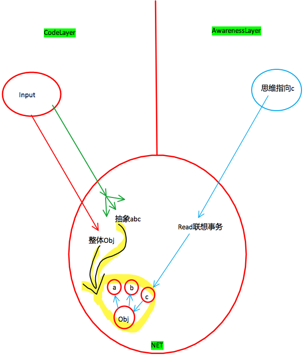
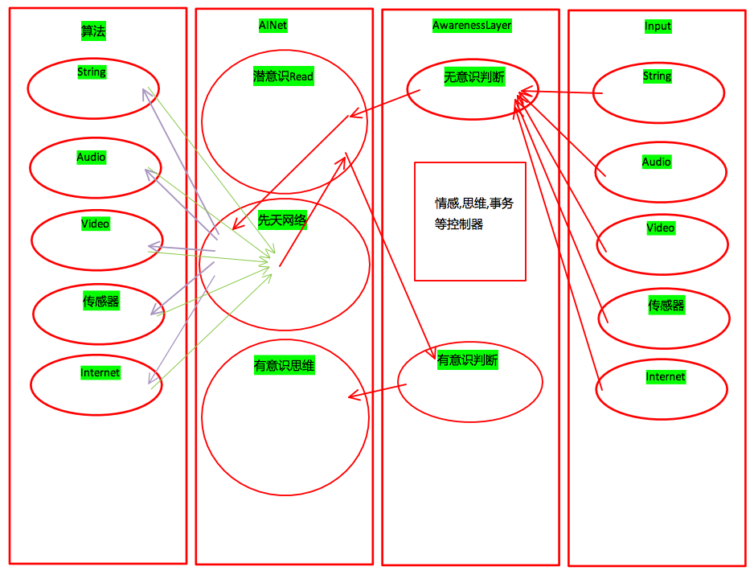
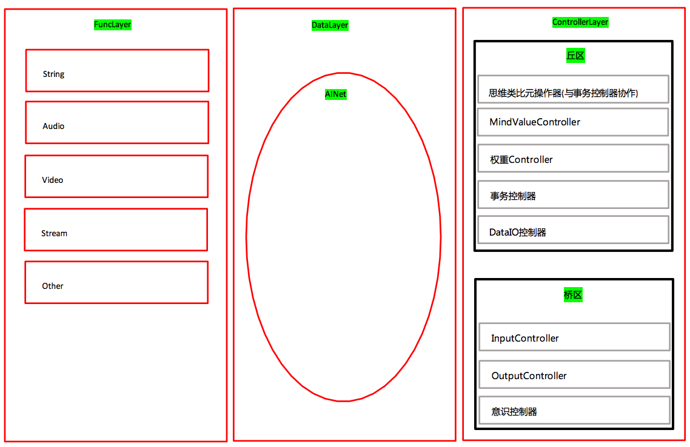
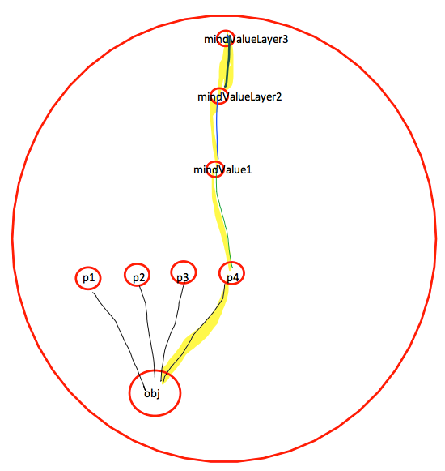
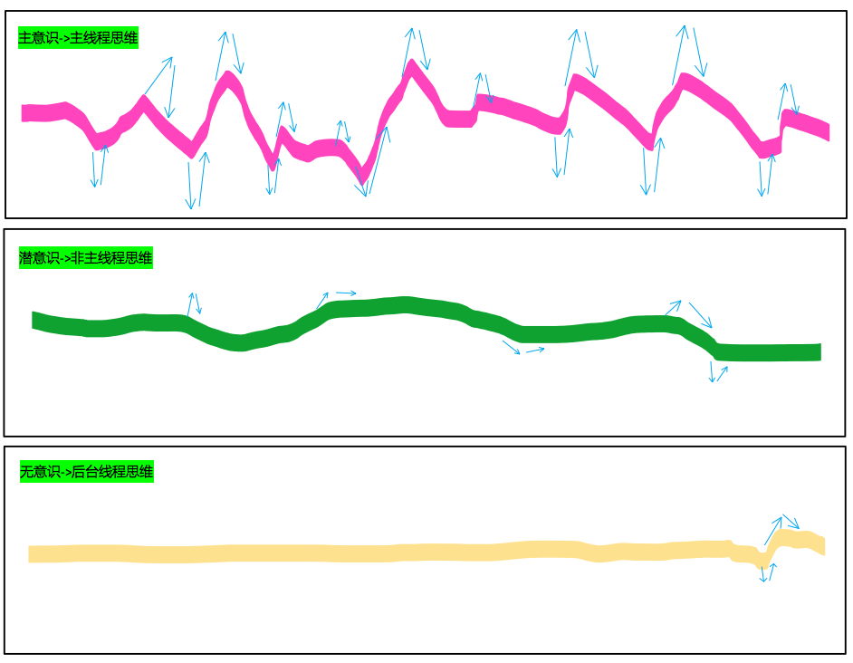
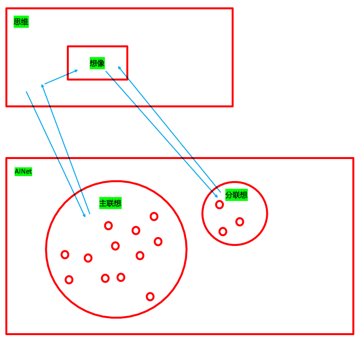
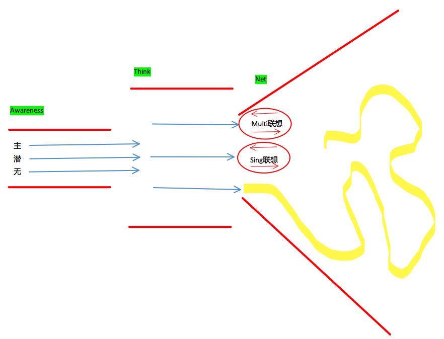

# AwarenessLayer-软件架构设计

***

<!-- TOC depthFrom:1 depthTo:6 withLinks:1 updateOnSave:1 orderedList:0 -->

- [AwarenessLayer-软件架构设计](#awarenesslayer-软件架构设计)
	- [n8p1 AwarenessLayer软件架构初想法](#n8p1-awarenesslayer软件架构初想法)
				- [<font color=red>前言:</font>](#font-colorred前言font)
				- [<font color=red>定义:</font>](#font-colorred定义font)
			- [<font color=red>两个原则:</font>](#font-colorred两个原则font)
			- [<font color=red>Controller</font>](#font-colorredcontrollerfont)
	- [n8p2 意识真实的感受2-(想像力/逆向演绎)](#n8p2-意识真实的感受2-想像力逆向演绎)
				- [<font color=red>参考:</font>](#font-colorred参考font)
				- [<font style="color:red">前言:</font>](#font-stylecolorred前言font)
				- [<font style="color:red">工作流程<font>](#font-stylecolorred工作流程font)
				- [<font color=red>思考:</font>](#font-colorred思考font)
				- [<font color=red>复合逆向演绎包括:</font>](#font-colorred复合逆向演绎包括font)
				- [<font color=red>示图:</font>](#font-colorred示图font)
	- [n8p3 精简意识控制器](#n8p3-精简意识控制器)
				- [<font color=red>参考:</font>](#font-colorred参考font)
				- [<font color=red>原始意识控制器:</font>](#font-colorred原始意识控制器font)
				- [<font color=red>精简意识控制器:</font>](#font-colorred精简意识控制器font)
				- [<font color=red>精简意识控制器_有意识的特征:</font>](#font-colorred精简意识控制器有意识的特征font)
	- [n8p4 SMG软件架构](#n8p4-smg软件架构)
				- [<font color=red>示图:</font>](#font-colorred示图font)
	- [n8p5 事务控制器](#n8p5-事务控制器)
				- [<font color=red>前言:</font>](#font-colorred前言font)
	- [n8p5 AwarenessLayer软件架构初想法2](#n8p5-awarenesslayer软件架构初想法2)
				- [<font color=red>前言:</font>](#font-colorred前言font)
				- [<font color=red>结构:</font>](#font-colorred结构font)
	- [n8p6 LOP2](#n8p6-lop2)
				- [<font color=red>LOP2的概述</font>](#font-colorredlop2的概述font)
				- [<font color=red>LOP2的主要目的</font>](#font-colorredlop2的主要目的font)
	- [n8p7 意识思维与神经网络融合](#n8p7-意识思维与神经网络融合)
	- [n8p8 区域点亮2](#n8p8-区域点亮2)
				- [<font color=red>区域点亮与思维的融合:</font>](#font-colorred区域点亮与思维的融合font)
	- [n8p9 MindValue](#n8p9-mindvalue)
				- [<font color=red>概念:</font>](#font-colorred概念font)
				- [<font color=red>作用:</font>](#font-colorred作用font)
				- [<font color=red>MoodDurationManager概念:</font>](#font-colorredmooddurationmanager概念font)
				- [<font color=red>MoodDurationManager工作流程:</font>](#font-colorredmooddurationmanager工作流程font)
	- [n8p10 知识表示X](#n8p10-知识表示x)
			- [神经元逆向算法(错误)](#神经元逆向算法错误)
			- [思维对知识读取流程](#思维对知识读取流程)
			- [神经网络数据的单一性](#神经网络数据的单一性)
			- [神经网络数据的破单一性](#神经网络数据的破单一性)
	- [n8p11 ControllerLayer](#n8p11-controllerlayer)
	- [n8p12 拆分与融合](#n8p12-拆分与融合)
	- [n8p13 思维控制器](#n8p13-思维控制器)
	- [n8p14 意识控制器](#n8p14-意识控制器)
	- [n8p15 想像力](#n8p15-想像力)
	- [n8p16 config_接口_后台](#n8p16-config接口后台)
	- [n8p17 AwarenessLayer的规则](#n8p17-awarenesslayer的规则)
	- [n8p18 DOP(DataOrientedProgramming)面向数据编程](#n8p18-dopdataorientedprogramming面向数据编程)
	- [TaskList](#tasklist)

<!-- /TOC -->

<br><br><br><br>


## n8p1 AwarenessLayer软件架构初想法
`CreateTime 17.10.21`

##### <font color=red>前言:</font>
```
主要讲AwarenessLayer中的控制性,软件架构的实现和灵活编程方案;
```

##### <font color=red>定义:</font>

```
1. smg中意识定义:

    关于意识无明确定义,因为没有研究明白前无法确切定义;
    在smg中意识包含:`思维`,`智能`等所有smg主观性的体现;
    相当于AwarenessLayer中的代码引擎(众控制器的组合);

2. smg中智能定义:

    在smg中智能是以数据广泛性为基础的,

3.smg中的思考定义:

    思考是思维在神经网络具体事务上的体现
```

> 1. 智能与意识紧密关联:
>
>    如果没有意识,智能如散沙;
>
> 2. 智能的作用:
>
>     智能给DNA瘦身,给本体通用性熵减能力;

#### <font color=red>两个原则:</font>
```
1. 保证数据的灵活性;无论是接入思维还是意识或其它功能;
2. 保证awarenessLayer层的控制协调功能;而控制器的功能要分模块化;用接口的方式接入,并自动作用起来;
```

#### <font color=red>Controller</font>
```
1. 控制Demand/Task的持续性
2. 控制情感的持续性MindDurationManager
3. 控制主意识思维的事务同时单一控制器(一心一用)
4. 对当前自我感受状态的紧迫性HungerLevel<0.1f
5.
```

| AwarenessLayer架构演化 >> |
| --- |

|  | title | desc | 参考 |
| --- | --- | --- | --- |
| 1 | 流式 | 通过面向对象的方式定义Understand,Decision,Mind等 | 初版代码(已删) |
| 2 | 代码及算法方式 | 用代码定义,函数算法输出结果 | 代码结构中.(部分已删) |
| 3 | 控制器方式 | 用控制器方式,分隔每层的功能,并熵减无序因素 | #n8p6 #n8p11 |
| 4 | 规则化 | 定义规则,使无序看似有序,但又大多被 `数据` 影响着,善用数据的灵活及无限 | #n8p13 #n8p17 |


| 电脑对比人脑 >> |
| --- |

|  | desc |
| --- | --- |
| 1 | 人脑是软硬一体的,cpu硬盘内存与一体 |
| 2 | 电脑cpu内存硬盘是分离的,所以在SMG设计上必须思考这种异同,来设计smg软件架构 |


<br><br><br><br><br>


## n8p2 意识真实的感受2-(想像力/逆向演绎)
`CreateTime 17.10.22`

##### <font color=red>参考:</font>

```
n5p5
```

##### <font style="color:red">前言:</font>

```
思维再面向纯抽象节点时是无法思考的;所以具象问题如下:

例如我们在选择红苹果好吃还是绿苹果好吃时,如果只是思考红色和绿色哪个好吃;

所以必须先行逆向演绎成红苹果和绿苹果,再来比较;
```

##### <font style="color:red">工作流程<font>

```
逆向演绎是将抽象节点指向实体obj节点的其它属性收集过来并有机结合的过程;此过程就是为了方便思维的思考元类比操作;所以有以下步骤:

1. 根据某抽象高层节点找到obj
2. 根据obj点亮其它属性节点
3. 将所有obj相关节点进行有机结合(可能这种有机只是划分区域边界)
4. 将所有边界内数据用于类比等;

1. 只是想像力,区域点亮取出信息,类比;(简)
2. 取出信息后要整合;(中)
3. 整合后,要内识别理解具象的数据;(难)
4. 而理解具象数据其实也就是理解它的属性等抽象节点;(循环)

注: 有可能思考过程中,只是多连续事务的控制过程;直到思考任务结束,
都算是联想和逆向演绎阶段;

问: 理解,只是区域点亮相关数据,作数据关联映射;使经验跑进来;还是真的存在具象理解;
4中循环在时候中止;
```

##### <font color=red>思考:</font>

```
1. 逆向演绎究竟存在不存在?或者说是否只是找到低节点后,read其属性的操作;
```

##### <font color=red>复合逆向演绎包括:</font>

```
1. 字符串逆向演绎
2. 音频逆向演绎
3. 视频逆向演绎
4. 空间逆向演绎
5. 时间逆向演绎

注: 任意一种会联想到其它;
```

|  | AINet事务控制器融合阶段 |
| --- | --- |
| 1 | 到节点是第一次数据融合 |
| 2 | 到obj是第二次数据融合 |
| 3 | 到区域是第三次融合 |
| 4 | 到多区多维是第四次融合 |
| 参考 | n8p12 |


```
1. 将各种数据进行联想检索的能力;
2. 将各种数据进行想像融合的能力;(融合规则)
3. 将融合后的数据,演绎给大脑,或者是新的关联与节点数据存储;
```

##### <font color=red>示图:</font>




```
1. 蓝色:思维走向;
2. 左侧:神经网络构建流程;
```


<br><br><br><br><br>


## n8p3 精简意识控制器
`CreateTime 17.10.22`

##### <font color=red>参考:</font>

```
n4p7 & n4px
```

##### <font color=red>原始意识控制器:</font>

```
无，潜，有三种意识状态同时存在，互相共享数据合作。

1. 无意识:对应后台耗时任务 & 小脑任务;
2. 潜意识:对应未获取到注意力之前的任务;
3. 有意识:对应意识注意力思维思考等偏后行为;
```

##### <font color=red>精简意识控制器:</font>

```
1. 只存在潜过度到有意识的合作任务;(后台耗时任务 & input持续任务 都归到潜意识)
2. 最大的问题来自意识的灵活性;(随心所欲)
```
##### <font color=red>精简意识控制器_有意识的特征:</font>

```
1. 主线程同时执行一件思考任务
2. 注意力
3. 后天写权限
```


<br><br><br><br><br>


## n8p4 SMG软件架构
`CreateTime 17.10.22`

##### <font color=red>示图:</font>




<br><br><br><br><br>


## n8p5 事务控制器
`CreateTime 17.10.23`

`参考:` [N6P4](Note6.md#n6p4-多次点亮2)
[N5P6](Note5.md#n5p6lightarea的意识控制器多次点亮)

##### <font color=red>前言:</font>

```
1. 事务控制器,灵活的控制了AwarenessLayer对DataLayer的操作;
2. 需与意识合作,因为事务本身只负责区域点亮及其它事务执行,而不知道其结果是否中意;
3. 事务接口:(执行 & 添加 & 打断 & 驳回 & Success & Error & Failure 等)
4. 调用:(区域点亮调用,带方向的区域点亮调用,电量参数,是否可转为后台长时参数);
5. 思维抽象事务;
```


<br><br><br><br><br>


## n8p5 AwarenessLayer软件架构初想法2
`CreateTime 17.10.24`

##### <font color=red>前言:</font>

```
1. AwarenessLayer是引擎,SMG的CPU;
2. AwarenessLayer是事务控制器,
3. AwarenessLayer是重转站,大脑循环站;
4. ControllerLayer引擎,大脑的cpu;
```

##### <font color=red>结构:</font>

```
链式结构;每一节点都是控制器;分类器;决定下一站到哪;作什么事务;
```

```
1. input
2. 数据传递到:AwarenessLayer意识判断(此时,虽然不知道数据是什么,但可以判断`来源` 和 `数据量`)
3. 数据传递到神经元FuncLayer
4. 处理后输出给AINet
5. 由 `丘区` (mindValue)指引数据成长方向;
```

```
1. `桥区` 产生Demand 与 输入信息
2. 由输入信息到AINet检索经验作区域点亮等操作;
3. 事务控制器控制思维;在AINet中作类比等操作;
4. 思维控制器决策
5. 思维控制器将结果(一组输出值)返回给 `桥区` 的OutputController
n. output
```


<br><br><br><br><br>


## n8p6 LOP2
`CreateTime 17.10.24`




```
1. 算法层负责生产数据 和 其它控制器取值打辅助;
2. 数据层负责一切智能活动,等等参考前文神经网络;
3. ControllerLayer负责控制整个过程有序进行;
```

##### <font color=red>LOP2的概述</font>

```
其实人类的大脑也是几乎这样的模型;是个强化版的MVC;并且特别是Model层;(即神经网络)将很多Controller的功能作到Model中了;所以表现出了非常好的通用性灵活性和智能;
```

##### <font color=red>LOP2的主要目的</font>

```
我提出LOP的方式;最主要其实就两个目的;

1. 让人们将OOP忘掉;将OOP中的那些理念回归到数据中..
2. 让人们更加重视DataLayer层;因为数据带来的泛化能力和灵活性是前所未有的;
3. 让Controller的和思维类比等配合下,代码逻辑源于数据;
```


<br><br><br><br><br>


## n8p7 意识思维与神经网络融合
`CreateTime 17.10.24`

```
1. 融合，不止是事务与controller，其意义是意识思维与神经网络一起成长。

2. 即数据即思维升级,数据即意识升级;
```


<br><br><br><br><br>


## n8p8 区域点亮2
`CreateTime 17.10.25`

`参考:` [N4P17](Note4.md#n4p17lightarea)

##### <font color=red>区域点亮与思维的融合:</font>

```
1. 去掉电能量的设计;换成 `抑制` 和 `兴奋`;
2. 所以思维,是在每个DataNode神经元点亮时已经在跟着工作了,而非全部取完,作统一类比;这样的好处是:
	1. 大大提高区域点亮的效果;
	2. 可以更智能灵活的控制整个区域点亮的过程;
	3. 可以尽可能少的减少不必要的点亮与思维,性能更优化;
```


<br><br><br><br><br>


## n8p9 MindValue
`CreateTime 17.10.26`

`参考:`

[框架/Mind#MoodDuration心情持续](../框架/Mind.md#moodduration心情持续)

[Book心情持续](../Book/Chapters/Chapter8.md)

##### <font color=red>概念:</font>

```
意识思维通过MindValue的方式与AINet紧密合作,是数据的活跃剂,构建期监工,也是意识与数据的桥;让意识由神经反射升级成持续意识;
```

##### <font color=red>作用:</font>

```
1. mindValue在AINet中作用是指引成长方向;
2. mindValue在意识中作用是将神经反射作为持续的欲望或需求;
```

##### <font color=red>MoodDurationManager概念:</font>

```
1. MoodDurationManager属于丘区;mindValue功能体现之一;
```

##### <font color=red>MoodDurationManager工作流程:</font>

```
1. 持续内感受到 mindValue-;
2. AINet无记录时的手足无措,
3. 有记录时则促使smg去解决mindValue-的问题;
```


<br><br><br><br><br>

<font color=green>

## n8p10 知识表示X
`CreateTime 17.10.31`

#### 神经元逆向算法(错误)

* `Input写`->`神经元算法`->`思维分析结果`->`二进制存储`
* `二进制读取`->`神经元逆向算法`->`思维类比分析`->`Output读`

```
1. Gan逆向算法一一对应正向神经元算法。(错误)
2. AINet的节点数据是二进制，只有逆向算法后，才是节点整体信息。(错误)
3. 存在与否?

	应该不存在,数据的实物与属性,具象与抽象的关系应该是存在神经网络中...
```

#### 思维对知识读取流程

```
1. 区域点亮
2. 节点数据读取
3. 节点数据的整体复合(复合参考:n8p2)
4. 成为完整的想象力事务。
```

#### 神经网络数据的单一性

```
1. 神经网络只存算法结果(不存mp4mp3)
2. 只强化思维结果的关联
```

#### 神经网络数据的破单一性

```
1. 神经网络通过mindValue与深入思维(冥想)整理,

使事物抽象与本质产生关联;

将看似均匀的可能性,导向更正确的关联可能性;
```

| 数据整理过程图: |
| --- |
|  |
| 1. 黑线:obj与property之间的关联; |
| 2. 黄线:obj与p4之间产生强关联;(与深入思维后mindValue123三层的继承有关) |
| 3. 绿线:本来p4或obj与mindValue1的相关 |
| 4. 蓝线:本来mindValue1 与 mindValue2 mindValue3的相关|
| 注: 冥想或思维只是强化关联 |
| 注: 深入思维只是描述了思维的层级,并非单纯围绕外围世界展开,而是围绕任意层次节点展开 |


</font>


<br><br><br><br><br>

<font color=green>

## n8p11 ControllerLayer
`CreateTime 17.11.01`

|  | 控制器 | 生命周期 | 主任务demand | IO | 参考 |
| --- | --- | --- | --- | --- | --- |
| 1 | main() |  |  |  | main() |
| 2 | SMG类 |  |  |  | update() |
| 1 | 意识控制器 |  |  |  | rootController & pageController |
| 2 | 思维控制器 | 构造 析构 |  |  | n8p13 & controller |
| 3 | AINet事务控制器 |  |  |  | 数据交互 |


</font>


<br><br><br><br><br>

<font color=green>

## n8p12 拆分与融合
`CreateTime 17.11.02`

|  | 拆融任务 | 实现方式 |
| --- | --- | --- |
| **数据IO事务拆分组** |  |  |
| 1 | 数据拆分 | 思维 |
| 2 | 数据融合 | 区域点亮->联想->想像力 |
| **思维组** |  |  |
| 1 | 思维拆分 | 意识控制器 |
| 2 | 思维融合 | 用AINet数据融合代替 |


</font>


<br><br><br><br><br>

<font color=green>

## n8p13 思维控制器
`CreateTime 17.11.02`

| 功能 >> |
| --- |

|  | 功能 |
| --- | --- |
| 1 | 数据拆分 |
| 2 | 构建后天网络 |
| 3 | 数据IO事务(联想事务) |
| 4 | 想像力事务 |
| 5 | 可持久化存储 |


| 生命周期 >> |
| --- |

|  |  |  |
| --- | --- | --- |
| 1 | init:(id)task; | task是由`意识控制器`提交过来的任务 `1.任务源:神经网络的数据 2. 任务目标:(一个mindValue方向 | 其它)` |
| 2 | initData |  |
| 3 | initRun |  |
| 4 | think |  |


| 思维工作示图 >> |
| --- |

|  |
| --- |
| 1. 思维只有1个 |
| 2. 思维有3个线程(主线程,非主线程,后台线程) |
| 注: 蓝色:双箭头表示一个联想事务,其影响着思维的任务及走向; |
| 注: 主意识:占有着注意力,可写权限,想像力逆向演绎,等;有大多资源调配力,其特征也是多变灵活的; |


</font>


<br><br><br><br><br>

<font color=green>

## n8p14 意识控制器
`CreateTime 17.11.03`

|  | 功能 | code |
| --- | --- | --- |
| 1 | 维护一个意识主线程; | mainThread_Awareness |
| 2 | 主线程分配100百分比占用; | CGFloat busyStatus |
| **method** |  |  |
| 1 | 判断潜意识准入 | -(BOOL) checkShallow{} |
| 2 | 判断注意力获取 | -(BOOL) checkDeep{} |

</font>


<br><br><br><br><br>

## n8p15 想像力
`CreateTime 17.11.07`

`参考:`

[当下不开发的/想像力](../当下不开发的/想像力.md)

[n5p5意识真实的感受_二阶-想像力](Note5.md#n5p5意识真实的感受)

[n6p2 感受](Note5.md#n6p2-感受)

[n8p2 意识真实的感受2-(想像力/逆向演绎)](#n8p2-意识真实的感受2-想像力逆向演绎)

[SMG/类人的学习项目](,,.SMG/类人的学习项目.md) `想像力，把图像属性，甚至文本描述GAN成图像演绎;`

`引言`

```c
/*
被窝好暖和，继续睡？起床？是个问题，大脑想起，身体想睡，眼睛闭着，脑袋意识清醒。

大脑思维那么快，但两者任务在controller里pk了半小时，
暖和的感觉是当下持续的mindValue+，起床后的任务是未来的mindValue+，
如果只是简单的执行思维思考，智能体将局限与经验量化智能，
但想像力足以变异思维控制器，智能体才可以升华出智慧。
一项我们天天在有意无意间使用的能力，却十分重要，让生命的体现都如此不同。
*/
```


| 正文 >> |
| --- |

|  | title | desc |
| --- | :---:| --- |
| 1 | 简介 | 想像力在SMG中是`代码能力`,其融合一个或多个`联想`事务;并通过思维将其逆向演绎 |
| 2 | 通俗简介 | Decoding能力(将data转为model的能力) |
| 3 | 特征 | 整个过程是 `有序` , `灵活` 的,体现为: `思维想到什么追加什么` |
| 4 | 描述 | 我们的思维如此快,当你读到 `一朵花` 时,你的思维已经想像出一朵漂亮的花呈现在大脑中.. |
| 5 | 作用 | 想像力是帮助读取数据的,没有想像力,数据将难以被主观意识读懂; |
| 6 | 工作状态 | 想像力,将当前思维的相关缺失数据以常识等方式补全,并构建新的关联 |
| 7 | maybe | 将非全面数据的补全机制(将数据构建关联至抽象节点之下最强关联的具象节点) |
| 8 | 联想对比想像 | 1. 先联想后想像 2. 联想先读内整数据,想像再追加外碎常识数据 3. 联想是AINet单Data事务,想像是多事务与解读数据 |


| 架构 >> |
| --- |

| title | desc |
| --- | --- |
| 1. Controller部分 | 思维控制器,Data事务控制器,想像力演绎器 |
| 2. AINet部分 | 空间区,时间区,等;及负责服务整个功能所需数据; |


| 想像力工作流程示图 >> |
| --- |

|  |
| --- |
| 1. 想像负责多Data事务;每个事务产生一个 `分联想` |
| 2. 思维想到什么追加什么 |
| 注: 小红色圆:AINode |
| 注: 大红色圆:区域点亮范围 |


<br><br><br><br><br>

## n8p16 config_接口_后台
`CreateTime 17.11.08`

|  | title | desc |
| --- | --- | --- |
| 1 | 简介 | 1. 配置生理或者心理需求,快乐等情感; 2. 接入传感器,肢体等外设 |


<br><br><br><br><br>

## n8p17 AwarenessLayer的规则
`CreateTime 17.11.10`

| 引言 >> |
| --- |

|  | title | desc |
| --- | --- | --- |
| 1 | 简介 | 在思维对数据分析时...有限的规则影响着意识与思维的走向; |


| 规则 >> |
| --- |

|  | title | desc |
| --- | --- | --- |
| 1 | 意识的规则 | 主意识的busy状态,潜和无转向主意识的规则,及n8p12中的权限规则 |
| 2 | 思维的规则 | 基础类比操作 + 数据影响走向 + 想像力演绎真实感 + NET构建规则 + DemandTask规则 + 3种思维的权限规则 |
| 3 | Data事务规则 | 区域点亮 + 多维分区间规则 + 后台任务规则 |
| 4 | Input规则 |  |
| 5 | Output规则 |  |


```
1. 意识规则:定义了意识的三种`运行方式`源定义;其定义了cpu资源的三个线程;

		* 主意识注意力;
		*	潜意识readData与input触发运行;
		*	无意识任务(意识中断,代理回调碰撞)

2. 思维规则:定义了cpu的`运算规则`;其本身也是思维规则,受数据影响其航向;

		* 想像力;
		* DemandTask的规则;
		*	思维的持久化(意识流)(90%不单独存在)

3. 数据规则:定义了神经网络的构建,使用等方法;

		* 多次联想;
		* 联想;
		*	后台检索

注:
		1. 思维结果不是由意识决定的,也不是cpu决定的;也不是代码算法决定的;而是由数据决定的;
	  2. 一切都要保证数据的灵活性, `数据产生逻辑` 的原则;
		3. 数据有效性没有100%;所以有多次联想,想像力,等来帮助多事务找到问题出口;
		4. 思维的元操作,(类比是针对神经网络的读取等操作的);除类比外,神经网络的一些经验记录才是真正的逻辑源;(常识等)

```

| Awareness规则 >> |
| --- |

|  |
| --- |

<br><br><br><br><br>


## n8p18 DOP(DataOrientedProgramming)面向数据编程
`CreateTime 17.11.11`

| 时间线 >> |
| --- |

|  | time | desc |
| --- | --- | --- |
| 1 | 2017.02 | DataLanguage |
| 2 | 2017.05 | AIFoundation |
| 3 | 2017.08 | LOP |
| 4 | 2017.11 | DOP |


| 对比OOP,LOP,DOP >> |
| --- |

|  | title | desc | 参考 |
| --- | --- | --- | --- |
| 1 | OOP |  | n4p13 |
| 2 | LOP |  | n4p13 |
| 3 | DOP | LOP的分层其实是不明确的,并且定义不太准确,(其实就是起的名字不太对,所以换了DOP) | n4p13 |


<br><br><br><br><br>


## TaskList

- [ ] 考虑去掉DataNode反射调用FuncNode;原因有二:

	```
  1. 因为原input数据已经不见了;只能逆向演绎,不能传回重新神经元组处理;
  2. 因为multiNode的复杂性,也不建议这么写;(90%确定)
	```

- [ ] 改变神经网络结构;(依Note8内容改变)


***
