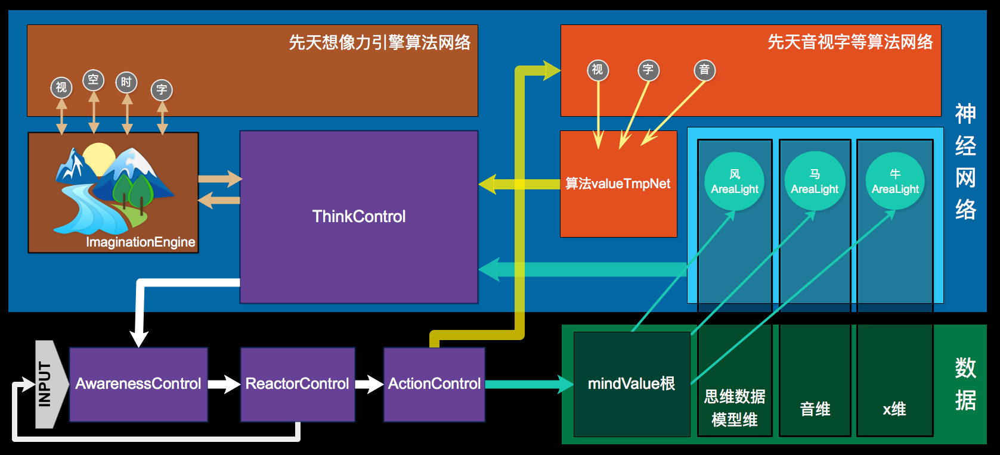
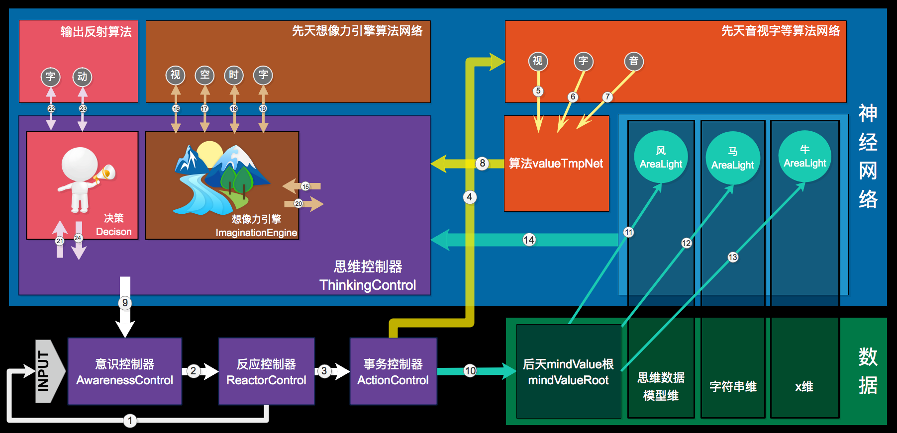
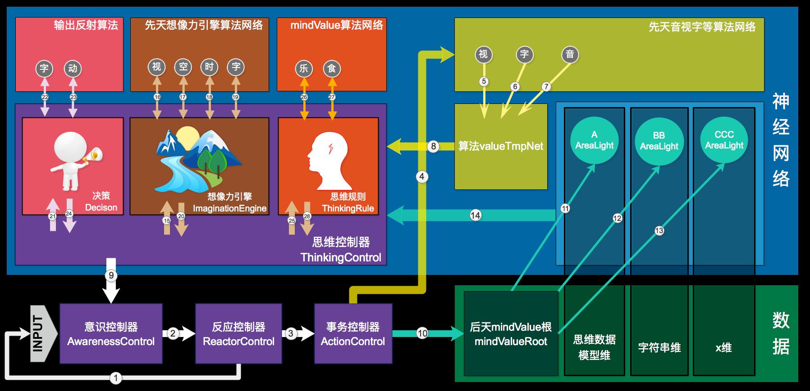
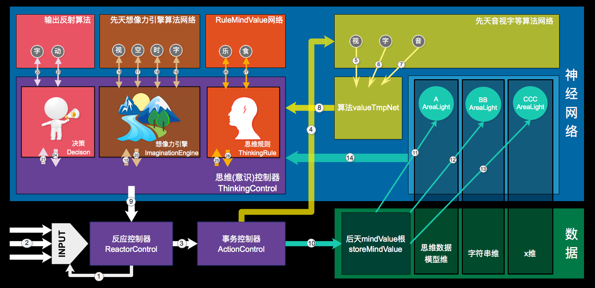

# 思维

<!-- TOC depthFrom:1 depthTo:6 withLinks:1 updateOnSave:1 orderedList:0 -->

- [思维](#思维)
	- [n9p1 思维控制器与神经网络合并部分](#n9p1-思维控制器与神经网络合并部分)
	- [n9p2 思维控制器独立部分](#n9p2-思维控制器独立部分)
	- [n9p3 自我](#n9p3-自我)
	- [n9p4 事务控制器2](#n9p4-事务控制器2)
	- [n9p5 SMG软件架构2](#n9p5-smg软件架构2)
	- [n9p6 思维方式的先后天](#n9p6-思维方式的先后天)
	- [n9p7 想像力2](#n9p7-想像力2)
	- [n9p8 AINet(算法分区 & 多维分区)](#n9p8-ainet算法分区-多维分区)
	- [n9p9 AINet(数据模型)](#n9p9-ainet数据模型)
	- [n9p10 数据源于思维 & 思维源于数据](#n9p10-数据源于思维-思维源于数据)
	- [n9p11 想像力引擎](#n9p11-想像力引擎)
	- [n9p12 思维数据模型](#n9p12-思维数据模型)
	- [n9p13 SMG软件架构3](#n9p13-smg软件架构3)
	- [n9p14 OUTPUT](#n9p14-output)
	- [n9p15 思维的规则](#n9p15-思维的规则)
	- [n9p16 MindValue](#n9p16-mindvalue)
	- [n9p16 MindValue模型](#n9p16-mindvalue模型)
	- [n9p17 AINet针对SMG软件架构3的改版](#n9p17-ainet针对smg软件架构3的改版)
	- [n9p18 先天神经网络编辑器2](#n9p18-先天神经网络编辑器2)
	- [TaskList](#tasklist)

<!-- /TOC -->

| 示图 >> |
| --- |

|  |
| --- |


<br><br><br><br><br>


## n9p1 思维控制器与神经网络合并部分
`CreateTime 17.11.20`

| 思维的神经网络存什么 >> |
| --- |

|  | desc |  |
| --- | --- | --- |
| 1 | 存task | task的神经网络存储，依关联强度自然排序 |
| 2 | 存解决问题的记录 |  |
| 3 | 构建AINet |  |


<br><br><br><br><br>


## n9p2 思维控制器独立部分
`CreateTime 17.11.20`


| 思考分离到AIThinkingRule中的部分到底是哪些 >> |
| --- |

|  | title | desc |
| --- | --- | --- |
| 1 | 逻辑源则 | 所有数据的思考要回归以数据为准,代码只是辅助数据解决不了的事情; |


<br><br><br><br><br>


## n9p3 自我
`CreateTime 17.11.20` `参考: n9p1`

| 自我循环圈概念 >> |
| --- |

| title | desc |
| --- | --- |
| 概念 | 自我状态(五感状态与mindValue状态)的神经网络化形成自我; |
|  |  |

| 自我循环圈之Mood >> |
| --- |

|  |
| --- |

| 自我循环圈之思维数据 >> |
| --- |

| NULL |
| --- |


<br><br><br><br><br>


## n9p4 事务控制器2
`CreateTime 17.11.21` `参考: n8p5`

| 功能 >> |
| --- |

|  | 功能 | 描述 |
| --- | --- | --- |
| 1 | 归整Input | 接收AIAwareness的Input并传递给AINet |
| 2 | 兴奋仰制 | 当AINet反射算法有深度时,负责发出兴奋或抑制信号,从而改变AINet工作; |
| 3 | 思维事务控制器 | 当ThinkingRule提交事务时,作为事务控制器; |
| 4 | 联想 | 区域点亮 |
| 5 | 无意识事务 | 不断发送兴奋,不断作无意识思维的类比碰撞,直到ok |


<br><br><br><br><br>


## n9p5 SMG软件架构2
`CreateTime 17.11.22` `参考: n8p1 n8p4 n8p6 n8p9`

| 示图 >> |
| --- |

|  |
| --- |
| Thalamus是 `事务控制器`;(另外提供区域点亮的能量值等控制) |
| 杏仁核是神经网络的 `mindValueModel` 也是dataNode的根; |
| 海马是神经网络的 `AIDataModel` 存储部分 |
| Think里包含了 `ThinkControl` 和 `想像力引擎`; `参考:n9p11` |
| midBrain作 `反射` 和 `createMindValue()` 的;midBrain也作为 `AwarenessController`; |


<br><br><br><br><br>


## n9p6 思维方式的先后天
`CreateTime 17.11.23` `参考: n9p1 n9p2`

| 简介 >> |
| ------- |

| desc |
| --- |
| 思维在神经网络中的内心活动,就像黑箱,使数据的整理与智能的体现有了完善的熵减规则;为此,神经网络的先天结构定义本身也就成为了先天思维的实现方式,而思维本身的再神经网络化,又成了其后天; |


| 先天 >> |
| --- |

|  | desc | 栗子 |
| --- | --- | --- |
| 1 | 神经网络的数据逻辑logic(数据根据时间线x产生的变化) | `1-2`,`2-3`,`4-5`,`3-4` |
| 2 | 神经网络的数据规律raw() | `1-2`,`1-2`,`1-2` |

| 后天 >> |
| --- |

|  | desc | 栗子 |
| --- | --- | --- |
| 1 | multi(将多个常识,经验等联合成链等方式进行思考的能力) | `1-2-3` |
| 2 | 神经网络的数据经验experience(经验等实现的思维习惯) | `1-2-3` |
| 3 | 想像力辅助思维(想像力取决于数据与常识,一个色盲是无法想像识别不到的颜色的;) | `1-2-3-4-5` |


<br><br><br><br><br>


## n9p7 想像力2
`CreateTime 17.11.23` `参考: n8p2 n8p15`

| 概念 >> |
| --- |

| desc | 参考 |
| --- | --- |
| `想像力` 是1或多次:`事务+Think` 的过程; | 事务步骤 `参考: n8p5` |

| 想像力与事务 >> |
| --- |

| desc |
| --- |
| 想像力需要足够的细腻多维的数据;如:obj与`属性`与`属性的属性如:空间信息,声音,时间等`(分开存;然后相关联) |


<br><br><br><br><br>


## n9p8 AINet(算法分区 & 多维分区)
`CreateTime 17.11.24` `参考: n8p10 n9p12`

| 示图 >> |
| --- |

|  |
| --- |
| 1. 算法分区本身不具备识别功能,只有基本的并行运算功能 |
| 2. Thinking是真正的Net构建者,也是真正的AIDataNode生产者; |


<br><br><br><br><br>


## n9p9 AINet(数据模型)
`CreateTime 17.11.27` `参考: n9p8`


| 简介 >> |
| --- |

|  |
| --- |
| 节点数据序列化为json |
| 一个通用model;带一些基本信息; |


| 分类 >> |
| --- |

|  | title | desc | 参考 |
| --- | --- | --- | --- |
| **singleDataNode类型** |  |  |  |
| 1 | logic |  |  |
| 2 | raw |  |  |
| 3 | obj |  |  |
| 4 | abs |  |  |
| **multiDataNode类型(思维数据模型)** |  |  | n9p12 |
| 1 | thinkingFeed |  | n9p12 |
| 2 | task |  | n9p12 |
| 3 | experience |  | n9p12 |
| **line类型** |  |  |  |
| 1 | `应该不需要` |  |  |


<br><br><br><br><br>


## n9p10 数据源于思维 & 思维源于数据
`CreateTime 17.11.27` `参考: n9p1`


| 思维 >> |
| --- |

|  | desc |
| --- | --- |
| 1 | 思维只是对数据的操作(读,写,搜等) |


| 将思维Net化(单独区) >> |
| --- |


|  | 作用 |
| --- | --- |
|  | 填补思维空白 |
|  | 填补思维空白 |
|  | 解放此步骤,获得最大灵活性 |


| 前言 >> |
| --- |

| title | desc |
| --- | --- |
| 问题 | 我们每天不断的思维,时而平静,时而疯狂,但却不知道这一切为什么运行,目的是什么,方向是什么, |
| 答案 | 而意识与丘脑决定了其运行,而mindValue决定了其目的,而神经网络关联与联想想像力决定了其方向; |
| 总结 | 只要这些最简单的规则,决定思维的基本要素,一切将活起来; |


| 思维规则三步骤 >> |
| --- |

|  | 思维只负责 |
| --- | --- |
| 1 | 数据事务-> |
| 2 | 想像力分析数据-> |
| 3 | 解决mindValue问题并输出-> |


<br><br><br><br><br>


## n9p11 想像力引擎
`CreateTime 17.11.30` `参考: n9p7`

| 前言 >> |
| --- |

| 思维对思维的欺骗 |
| --- |
| 只有思维`相信自己思考的是最真实的对象`;设计一个`自由的编辑器一样的想像力引擎`; |

| 功能 >> |
| --- |

|  | title | desc |
| --- | --- | --- |
| 1 | 字符串引擎 | 可自由组合,操作字符串 |
| 2 | 空间引擎 | 可自由生成空间并将尺寸,位置等obj排放 |
| 3 | 时间引擎 | 只是动态,时间可自由调节操控 |
| 4 | 图像引擎 | 可自由将图像渲染至某空间表面的任意位置,任意改变颜色形状等 |

| 软件架构设计 >> |
| --- |

| title | desc |
| --- | --- |
| 概念 | 想像力是意识自己在看自己的思维产生的影像,这种思维方式可以让A的下一个事务是Z,完全不相干的数据在AINet中关联是很弱很远的,只有这种方式可以让其将这样的数据被读到; |
| 张 | 想像力不必使一切与现实渲染一致,但保持一致可以使思维与行动更加一体,所以还是要尽量(目的与性能之合)设计一致; |
| 止 | 想像力是为多联想事务服务的,所以只要达到 `最佳多事务` 为目标即可; |

| 软件架构示图 >> |
| --- |

|  |  |
| --- | --- |
| 黄色箭头 | 事务管理的每个事务因为`想像力`而依次联想到`风马牛不相及`的数据; |
| 想像力算法 | 接入到神经网络;在固定格式的数据;反射调用固定的算法; |
| 性能 | 思维到某些角度的某些细节的时候,只对此角度细节建模渲染展示,而不是所有; |

| 问题 >> |
| --- |

| 想像力是否只可被 `主意识` 操作,如果是:那dataNode写权限是否与 `想像力` 有关? |
| --- |

<br><br><br><br><br>


## n9p12 思维数据模型
`CreateTime 17.12.06` `参考: n9p9`

| 简介 >> |
| --- |

| 概念 | 思维数据模型多为multiDataNode类型,各类单存一维度, |
| --- | --- |
| 注1: | 分Net维度是为了解决 `同维度污染` 问题 |
| 注2: | 使用Net是为了解决 `拆分融合` 问题 |
| 注3: | 使用想像力是为了解决 `逆向与多事务` 问题 |
| 问题: | ThinkingFeed的拆分存储与逆向融合 |

| 思维数据模型的种类 >> |
| --- |

|  | title | desc | 参考 |
| --- | --- | --- | --- |
| 1 | thinkingFeed | 随时可以自省自己在想什么 `(意识流)` | n9p12 |
| 2 | task |  |  |
| 3 | experience | thinkingFeed知道自己想过什么 & 强化学习 | n3p7 |
| 4 | 思维方式 | 以上数据的抽象, |  |
| 5 | 自我 |  | n8p9 |
| 6 | 行为习惯,原则 |  | `3维抽象概述.md` `知识表示.md` |
| 7 | 性格,风格 |  | `3维抽象概述.md` `知识表示.md` |
| 8 | 人格,价值观,思想 |  | `3维抽象概述.md` `知识表示.md` |
| 注: |  | 6-8只作思考不作设计,因为1-4的数据+思维会自动形成6-8; |  |

| 思维方式 >> |
| --- |

|  | desc |
| --- | --- |
| 简介 | 思维方式是首先要事务取的数据框架,指导事务控制器的走向 |
| 思维的特性 | 灵活，不确切，捉摸不定，自可控性，数据影响性，随机也是思维的选择 `结合反射随机算法` |
| 栗子及步骤 | 数据abc的思考步骤如下: |
|  | 1. 根据需求进行 `事务` 取 `思维方式` |
|  | 2. 根据 `思维方式` 反射 `随机算法` 得到a |
|  | 3. 传a进行事务 |
|  | 4. 根据数据变化再刷取 `思维方式` |
|  | 4. 根据结果调整，(调整也是思维方式,) |
| 栗子的bug | 思维方式的不断提取与应用,太过复杂;所以 `思维方式` 应该是Experience的抽象层,而根据事务的从根部开始检索的原则,思维方式自然而然的被应用到思维中;而非不断的刷取与分析; |


| 示图 >> |
| --- |

|  |
| --- |


<br><br><br><br><br>


## n9p13 SMG软件架构3
`CreateTime 17.12.07` `参考: n8p1 n8p4 n8p6 n8p9 n9p5`

| 示图 >> |
| --- |

|  |
| --- |
| Input循环 = 白色 + 黄色 + 橙色 |
| 思维循环 = 白色 + 青色 + 绿色 |
| 想像力循环 = 棕色 |
| 控制器部分 = 紫色 |


<br><br><br><br><br>


## n9p14 OUTPUT
`CreateTime 17.12.08`


```
output结合入net

output结合小脑生成思维不可直接访问的网络和算法。

小脑与大脑的完美合作

小脑的性能优势

小脑构建机制

输出一系列值，先天output网络区开放接口。。。

专门负责反射output输入细节的;大脑不需要直接频繁关注这些细节;但需要牵主线;
```

| 示图 >> |
| --- |

|  |
| --- |


<br><br><br><br><br>


## n9p15 思维的规则
`CreateTime 17.12.09`

| 前言 >> |
| --- |

| title | desc | 参考 |
| --- | --- | --- |
| 概念 | 思维的规则就是mindValue的规则(归0,持续和增涨)，如果没有mindValue规则，人脑与大气循环系统没有本质区别。 | n9p16 |
| mindValue意义 | 我们有无穷无尽的数据需要思考，所以mindValue指引了思维，让思维知道该想什么。 |  |
| 内心思维活动 | 调配了注意力，构建了数据,调用了想像力,用常识作了预测。 |  |
| 思维构建网络的原则 | 必须从根部开始构建，或者从根部开始联通到最终obj |  |
| `分析` 的概念 | 分析就是有目的的思维 |  |
| `高级的智能分析` 的概念 | 分析与常规情况不符(往往是抽象的不符),并分析不符背后的原因。(obj分析) |  |

| 例如 >> |
| --- |

| 情境: | 发现人类同性恋比例远大于其它知觉(如痛感)出误的数量级。 |
| --- | --- |
| 数据说明 | 当思维中 `同性恋5%`和 `疼痛感100%` 同时出现时，抽象了人类感觉比例的抽象节点 |
| 问题形成 | 然后发现数据差异太大，引起注意力，并分析原因。 |
| 分析步骤 | 1. 分析痛觉的原理和作用。2. 分析同性恋的情感来源，什么是爱情等... |


<br><br><br><br><br>


## n9p16 MindValue
`CreateTime 17.11.20`

| Mood与MindValue >> |
| --- |

|  | desc |
| --- | --- |
| 起因: | 所有情感对应两级性的接口。抽象为mindValue+- |
| 结果: | 也许不存在mood,只存在mindValue |


| mindValue与思维 >> |
| --- |

| title | desc |
| --- | --- |
| mindValue的定义 | 一个mindValue定义了以下几个方面: |
| 1 | Input外持续性 |
| 2 | Input值与感受值的规则曲线 |
| 3 | 感受内持续性 |
| 4 | 思维反应规则(持续追求,归零,增涨) |
| 注: | mindValue与思维通过 `规则` 彻底实现了融合 |
| 注: | mindValue不需要具体定义各个子类,所有的差异化只因为Net中与数据的关联才有用与体现; |

| 示图 >> |
| --- |

|  |
| --- |


| 后天MindValue根 >> |
| --- |

|  | desc |
| --- | --- |
| 使用 | 后天mindValue根只作为检索源作用,脱离了具体数据,它就没有任何意义; |


<br><br><br><br><br>


## n9p16 MindValue模型
`CreateTime 17.12.12`

| MV三种模型 >> |
| --- |

|  |  |  |  |
| --- | --- | --- | --- |
| 1 | inputMV模型 | `inputValue` `upType` `inputType` | 错误 |
| 2 | ruleMV模型 | `downType` `ruleType` | 错误 |
| 3 | storeMV模型 | `duration` `+-` | 错误 |

| MindValue各阶段代码实现 >> |
| --- |

|  |  |  |  |
| --- | --- | --- | --- |
|  | 前言 | mindValue的三个阶段,定义了不同阶段的值变化，对思维产生的影响。 | 错误 |
| 1 | inputMV模型 | 传入input标识,标识当前input的类型,upType | 错误 |
| 2 | thinkingMV模型 | 根据传入的input标识,到先天mv算法网络取值;... | 错误 |
| 3 | storeMV模型 | ... | 错误 |


| `InputMV和ChangeMV` 的先后天 >> |
| --- |

| title | desc | 参考 |
| --- | --- | --- |
| 简介 | Input产生了mv;而changeMV描述了思维变化对mv的影响 `情感` | 参考: `自我.md#3维思维链接` |
| 简介2 | MV作用于smg整个架构中,指导整个系统的运行; |  |
| 新分类 | 按照最基本 `饥饿与满足` 模型,分为两种mv: `inputMV` 和 `changeMV`; |  |
| StoreMV主导 | 思维0参数到ActionControl时,会优先点亮`思维Store`最强数据 |  |
| 结果 | 先用最简单的inputMV传入思维，并存储。changeMV下步再说。 |  |

| mindValue大循环步骤 >> |
| --- |

|  | 大循环是基于 `小循环(系统循环一次)` 建立的,控制所有循环的基石就是MindValue |
| --- | --- |
| 1 | inputMV传入示图`3-4-(5:7)-8` |
| 2 | 引起Thinking |
| 3 | `9-3-10-(11:13)` |
| 4 | 存inputMV和当前任务等思维数据; |
| 5 | `14` 事务到相关数据传给Thinking |
| 6 | 思维活动 `(15:20)-(21:24)-(25:28)` |
| 7 | 引发 changeMV 并传给 `9-3-10-(11:13)` |
| 8 | 存changeMV和经验等思维数据; |


| 示图 >> |
| --- |

|  |
| --- |


<br><br><br><br><br>


## n9p17 AINet针对SMG软件架构3的改版
`CreateTime 17.12.15` `参考: n9p8 n9p9`


| 算法分区与多维分区的 解耦 >> |
| --- |

|  |  |
| --- | --- |
|  | **存储与代码开发的解耦** |
| 1 | 将算法分区完全与硬盘隔离开;放在内存中... |
| 2 | 只将算法ID传到硬盘与节点共存储, |
|  | **文件类型(`输入区与输出区` `参数与返回值` `算法区与存储区`)的类型** |
| 1 | 输入如:string,img,audio |
| 2 | 输出如:string,int,img,color,audio,path,time(thinging),space(3ds) |
|  | **AIFuncMate** |
| 1 | 算法伴侣,与每个"算法区算法"形成一一对应,使多维分区的"算法节点"能够随时调用算法; |


| 示图 >> |
| --- |

|  |
| --- |


<br><br><br><br><br>


## n9p18 先天神经网络编辑器2

| 改版 >> |
| --- |

| 起因: | 最简单设计原则;当前先天神经网络的结构太复杂,没必要; |
| --- | --- |
|  | 将先天网络的结构改到代码中... `[AIEditorStore saveFunc:model]`,然后在`model`中写: |
| 唯一ID: | `STR_Format(@"%@,%@",className,funcId)` |
| 版本号: | `SaveVersion` |
| 封装: | 封一个`宏定义`;一行代码搞定; |
| 删: | 删掉`FuncNode`功能;删掉`反射`功能;删掉`funcId`; |
| 临时缓存区: | 只关注`数据value`的类型与批次;所以应该对`数据value`分group标type; |


<br><br><br><br><br>


## TaskList

|  | TASK | STATUS |
| --- | --- | --- |
|  | 分模块假数据开发，最后对接 |  |
| 1 | 重构神经网络 |  |
| 2 | 算法valueTmpNet写在内存中(pinCache支持) |  |
| 3 | mindValue算法作用于思维(以充电为例) |  |
| 4 | mindValue算法使用于Input:`如吃乐` |  |
| 5 | mindValue作用于神经网络 `思维构建网络且生成mindValueRoot` |  |
| 6 | 思维构建网络且生成多维 |  |
| 7 | 事务控制器-检索 |  |
| 8 | 想像力引擎(字符串)部分 |  |
| 9 | 想像力引擎作用于多事务 |  |
| 10 | 决策,先天输出网络的构建(输出情绪,借助mindValue规则定义:如`急哭`) |  |
| 11 | 决策,后天输出的网络构建 |  | 


<br><br><br><br><br>
***
