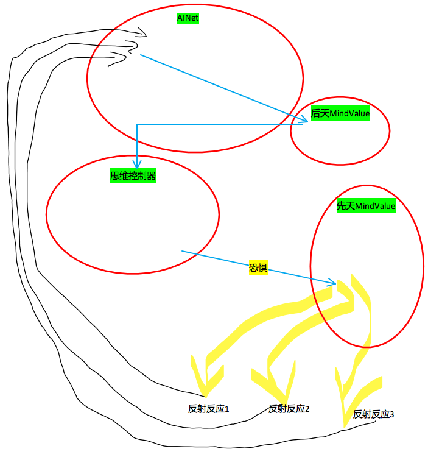

# 思维

- [思维](#思维)
	- [n9p1 思维控制器与神经网络合并部分](#n9p1-思维控制器与神经网络合并部分)
	- [n9p2 思维控制器独立部分](#n9p2-思维控制器独立部分)
	- [n9p3 Mood与MindValue](#n9p3-mood与mindvalue)
	- [n9p3 自我](#n9p3-自我)
	- [n9p4 事务控制器2](#n9p4-事务控制器2)

     

## n9p1 思维控制器与神经网络合并部分
`CreateTime 17.11.20`

| 思维的神经网络存什么 >> |
| --- |

|  | desc |  |
| --- | --- | --- |
| 1 | 存task | task的神经网络存储，依关联强度自然排序 |
| 2 | 存解决问题的记录 |  |

     

## n9p2 思维控制器独立部分
`CreateTime 17.11.20`

| 思考分离到AIThinkingRule中的部分到底是哪些 >> |
| --- |

|  | title | desc |
| --- | --- | --- |
| 1 | 逻辑源则 | 所有数据的思考要回归以数据为准,代码只是辅助数据解决不了的事情; |

     

## n9p3 Mood与MindValue
`CreateTime 17.11.20`

| 所有情感对应两级性的接口。抽象为mindValue+- >> |
| --- |

     

## n9p3 自我
`CreateTime 17.11.20` `参考: n9p1`

| 自我循环圈概念 >> |
| --- |

| title | desc |
| --- | --- |
| 概念 | 自我状态(五感状态与mindValue状态)的神经网络化形成自我; |
|  |  |

| 自我循环圈之Mood >> |
| --- |

|  |
| --- |

| 自我循环圈之思维数据 >> |
| --- |

| NULL |
| --- |

     

## n9p4 事务控制器2
`CreateTime 17.11.21` `参考: n8p5`

| 功能 >> |
| --- |

|  | 功能 | 描述 |
| --- | --- | --- |
| 1 | 归整Input | 接收AIAwareness的Input并传递给AINet |
| 2 | 兴奋仰制 | 当AINet反射算法有深度时,负责发出兴奋或抑制信号,从而改变AINet工作; |
| 3 | 思维事务控制器 | 当ThinkingRule提交事务时,作为事务控制器; |
| 4 | 联想 | 区域点亮 |
| 5 | 无意识事务 | 不断发送兴奋,不断作无意识思维的类比碰撞,直到ok |

     
***
