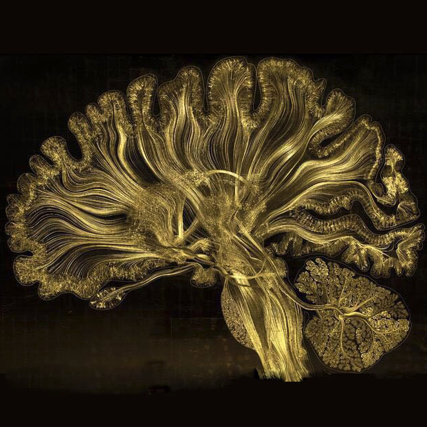
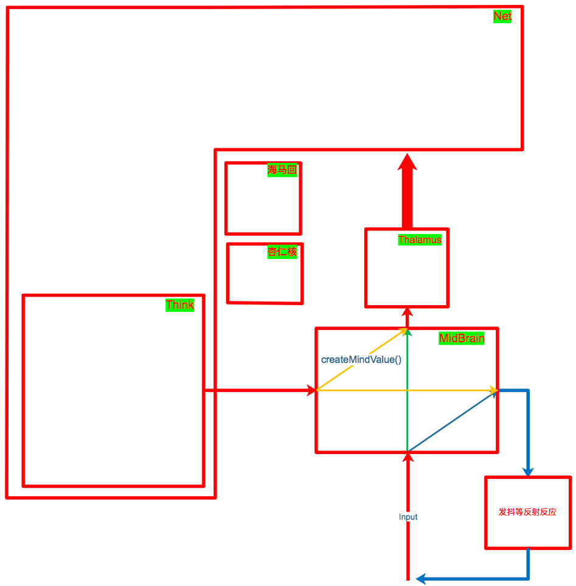
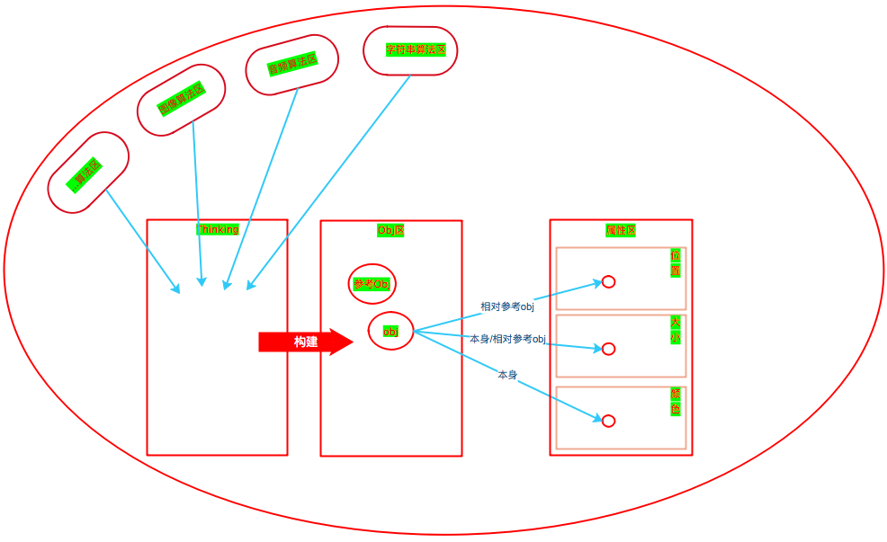
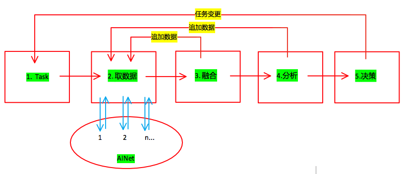
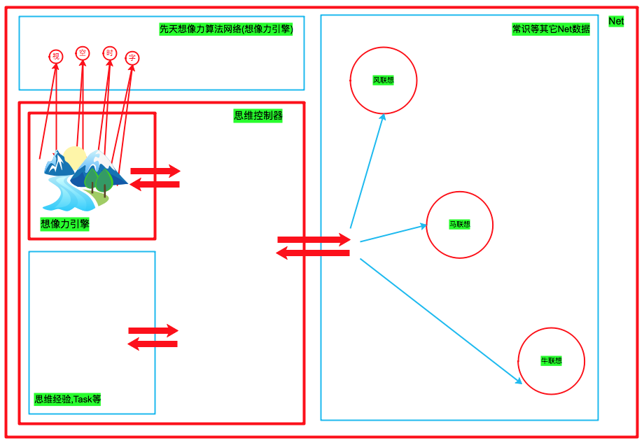

# 思维

<!-- TOC depthFrom:1 depthTo:6 withLinks:1 updateOnSave:1 orderedList:0 -->

- [思维](#思维)
	- [n9p1 思维控制器与神经网络合并部分](#n9p1-思维控制器与神经网络合并部分)
	- [n9p2 思维控制器独立部分](#n9p2-思维控制器独立部分)
	- [n9p3 Mood与MindValue](#n9p3-mood与mindvalue)
	- [n9p3 自我](#n9p3-自我)
	- [n9p4 事务控制器2](#n9p4-事务控制器2)
	- [n9p5 SMG软件架构2](#n9p5-smg软件架构2)
	- [n9p6 思维方式的先后天](#n9p6-思维方式的先后天)
	- [n9p7 想像力2](#n9p7-想像力2)
	- [n9p8 AINet(算法分区 & 多维分区)](#n9p8-ainet算法分区-多维分区)
	- [n9p9 AINet(数据模型)](#n9p9-ainet数据模型)
	- [n9p10 数据源于思维 & 思维源于数据](#n9p10-数据源于思维-思维源于数据)
	- [n9p11 想像力引擎](#n9p11-想像力引擎)
	- [n9p12 思维数据模型](#n9p12-思维数据模型)

<!-- /TOC -->

| 示图 >> |
| --- |

|  |
| --- |

     

## n9p1 思维控制器与神经网络合并部分
`CreateTime 17.11.20`

| 思维的神经网络存什么 >> |
| --- |

|  | desc |  |
| --- | --- | --- |
| 1 | 存task | task的神经网络存储，依关联强度自然排序 |
| 2 | 存解决问题的记录 |  |
| 3 | 构建AINet |  |

     

## n9p2 思维控制器独立部分
`CreateTime 17.11.20`

| 思考分离到AIThinkingRule中的部分到底是哪些 >> |
| --- |

|  | title | desc |
| --- | --- | --- |
| 1 | 逻辑源则 | 所有数据的思考要回归以数据为准,代码只是辅助数据解决不了的事情; |

     

## n9p3 Mood与MindValue
`CreateTime 17.11.20`

| 所有情感对应两级性的接口。抽象为mindValue+- >> |
| --- |

     

## n9p3 自我
`CreateTime 17.11.20` `参考: n9p1`

| 自我循环圈概念 >> |
| --- |

| title | desc |
| --- | --- |
| 概念 | 自我状态(五感状态与mindValue状态)的神经网络化形成自我; |
|  |  |

| 自我循环圈之Mood >> |
| --- |

|  |
| --- |

| 自我循环圈之思维数据 >> |
| --- |

| NULL |
| --- |

     

## n9p4 事务控制器2
`CreateTime 17.11.21` `参考: n8p5`

| 功能 >> |
| --- |

|  | 功能 | 描述 |
| --- | --- | --- |
| 1 | 归整Input | 接收AIAwareness的Input并传递给AINet |
| 2 | 兴奋仰制 | 当AINet反射算法有深度时,负责发出兴奋或抑制信号,从而改变AINet工作; |
| 3 | 思维事务控制器 | 当ThinkingRule提交事务时,作为事务控制器; |
| 4 | 联想 | 区域点亮 |
| 5 | 无意识事务 | 不断发送兴奋,不断作无意识思维的类比碰撞,直到ok |

     

## n9p5 SMG软件架构2
`CreateTime 17.11.22` `参考: n8p1 n8p4 n8p6 n8p9`

| 示图 >> |
| --- |

|  |
| --- |
| Thalamus是 `事务控制器`;(另外提供区域点亮的能量值等控制) |
| 杏仁核是神经网络的 `mindValueModel` 也是dataNode的根; |
| 海马是神经网络的 `AIDataModel` 存储部分 |
| Think里包含了 `ThinkControl` 和 `想像力引擎`; `参考:n9p11` |
| midBrain作 `反射` 和 `createMindValue()` 的;midBrain也作为 `AwarenessController`; |

     

## n9p6 思维方式的先后天
`CreateTime 17.11.23` `参考: n9p1 n9p2`

| 简介 >> |
| ------- |

| desc |
| --- |
| 思维在神经网络中的内心活动,就像黑箱,使数据的整理与智能的体现有了完善的熵减规则;为此,神经网络的先天结构定义本身也就成为了先天思维的实现方式,而思维本身的再神经网络化,又成了其后天; |

| 先天 >> |
| --- |

|  | desc | 栗子 |
| --- | --- | --- |
| 1 | 神经网络的数据逻辑logic(数据根据时间线x产生的变化) | `1-2`,`2-3`,`4-5`,`3-4` |
| 2 | 神经网络的数据规律raw() | `1-2`,`1-2`,`1-2` |

| 后天 >> |
| --- |

|  | desc | 栗子 |
| --- | --- | --- |
| 1 | multi(将多个常识,经验等联合成链等方式进行思考的能力) | `1-2-3` |
| 2 | 神经网络的数据经验experience(经验等实现的思维习惯) | `1-2-3` |
| 3 | 想像力辅助思维(想像力取决于数据与常识,一个色盲是无法想像识别不到的颜色的;) | `1-2-3-4-5` |

     

## n9p7 想像力2
`CreateTime 17.11.23` `参考: n8p2 n8p15`

| 概念 >> |
| --- |

| desc | 参考 |
| --- | --- |
| `想像力` 是1或多次:`事务+Think` 的过程; | 事务步骤 `参考: n8p5` |

| 想像力与事务 >> |
| --- |

| desc |
| --- |
| 想像力需要足够的细腻多维的数据;如:obj与`属性`与`属性的属性如:空间信息,声音,时间等`(分开存;然后相关联) |

     

## n9p8 AINet(算法分区 & 多维分区)
`CreateTime 17.11.24` `参考: n8p10 n9p12`

| 示图 >> |
| --- |

|  |
| --- |
| 1. 算法分区本身不具备识别功能,只有基本的并行运算功能 |
| 2. Thinking是真正的Net构建者,也是真正的AIDataNode生产者; |

     

## n9p9 AINet(数据模型)
`CreateTime 17.11.27` `参考: n9p8`

| 简介 >> |
| --- |

|  |
| --- |
| 节点数据序列化为json |
| 一个通用model;带一些基本信息; |

| 分类 >> |
| --- |

|  | title | desc | 参考 |
| --- | --- | --- | --- |
| **singleDataNode类型** |  |  |  |
| 1 | logic |  |  |
| 2 | raw |  |  |
| 3 | obj |  |  |
| 4 | abs |  |  |
| **multiDataNode类型(思维数据模型)** |  |  | n9p12 |
| 1 | thinkingFeed |  | n9p12 |
| 2 | task |  | n9p12 |
| 3 | experience |  | n9p12 |
| **line类型** |  |  |  |
| 1 | `应该不需要` |  |  |

     

## n9p10 数据源于思维 & 思维源于数据
`CreateTime 17.11.27` `参考: n9p1`

| 思维 >> |
| --- |

|  | desc |
| --- | --- |
| 1 | 思维只是对数据的操作(读,写,搜等) |

| 将思维Net化(单独区) >> |
| --- |

|  | 作用 |
| --- | --- |
|  | 填补思维空白 |
|  | 填补思维空白 |
|  | 解放此步骤,获得最大灵活性 |

| 前言 >> |
| --- |

| title | desc |
| --- | --- |
| 问题 | 我们每天不断的思维,时而平静,时而疯狂,但却不知道这一切为什么运行,目的是什么,方向是什么, |
| 答案 | 而意识与丘脑决定了其运行,而mindValue决定了其目的,而神经网络关联与联想想像力决定了其方向; |
| 总结 | 只要这些最简单的规则,决定思维的基本要素,一切将活起来; |

| 思维规则三步骤 >> |
| --- |

|  | 思维只负责 |
| --- | --- |
| 1 | 数据事务-> |
| 2 | 想像力分析数据-> |
| 3 | 解决mindValue问题并输出-> |

     

## n9p11 想像力引擎
`CreateTime 17.11.30` `参考: n9p7`

| 前言 >> |
| --- |

| 思维对思维的欺骗 |
| --- |
| 只有思维`相信自己思考的是最真实的对象`;设计一个`自由的编辑器一样的想像力引擎`; |

| 功能 >> |
| --- |

|  | title | desc |
| --- | --- | --- |
| 1 | 字符串引擎 | 可自由组合,操作字符串 |
| 2 | 空间引擎 | 可自由生成空间并将尺寸,位置等obj排放 |
| 3 | 时间引擎 | 只是动态,时间可自由调节操控 |
| 4 | 图像引擎 | 可自由将图像渲染至某空间表面的任意位置,任意改变颜色形状等 |

| 软件架构设计 >> |
| --- |

| title | desc |
| --- | --- |
| 概念 | 想像力是意识自己在看自己的思维产生的影像,这种思维方式可以让A的下一个事务是Z,完全不相干的数据在AINet中关联是很弱很远的,只有这种方式可以让其将这样的数据被读到; |
| 张 | 想像力不必使一切与现实渲染一致,但保持一致可以使思维与行动更加一体,所以还是要尽量(目的与性能之合)设计一致; |
| 止 | 想像力是为多联想事务服务的,所以只要达到 `最佳多事务` 为目标即可; |

| 软件架构示图 >> |
| --- |

|  |  |
| --- | --- |
| 蓝色箭头 | 事务管理的每个事务因为`想像力`而依次联想到`风马牛不相及`的数据; |
| 想像力算法 | 接入到神经网络;在固定格式的数据;反射调用固定的算法; |
| 性能 | 思维到某些角度的某些细节的时候,只对此角度细节建模渲染展示,而不是所有; |

     

## n9p12 思维数据模型
`CreateTime 17.12.06` `参考: n9p9`

| 简介 >> |
| --- |

| 概念 | 思维数据模型多为multiDataNode类型,各类单存一维度, |
| --- | --- |
| 注1: | 分Net维度是为了解决 `同维度污染` 问题 |
| 注2: | 使用Net是为了解决 `拆分融合` 问题 |
| 注3: | 使用想像力是为了解决 `逆向与多事务` 问题 |
| 问题: | ThinkingFeed的拆分存储与逆向融合 |

| 思维数据模型的种类 >> |
| --- |

|  | title | desc | 参考 |
| --- | --- | --- | --- |
| 1 | thinkingFeed | 随时可以自省自己在想什么 `(意识流)` | n9p12 |
| 2 | task |  |  |
| 3 | experience | thinkingFeed知道自己想过什么 |  |

     
***
