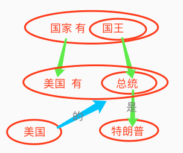
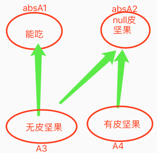

<!-- TOC -->

- [1. 概念嵌套的知识表示](#1-%E6%A6%82%E5%BF%B5%E5%B5%8C%E5%A5%97%E7%9A%84%E7%9F%A5%E8%AF%86%E8%A1%A8%E7%A4%BA)
- [2. 概念不能解决mv的反馈](#2-%E6%A6%82%E5%BF%B5%E4%B8%8D%E8%83%BD%E8%A7%A3%E5%86%B3mv%E7%9A%84%E5%8F%8D%E9%A6%88)
- [3. 时序的概念化](#3-%E6%97%B6%E5%BA%8F%E7%9A%84%E6%A6%82%E5%BF%B5%E5%8C%96)
- [4. 行为化中的挂起序列](#4-%E8%A1%8C%E4%B8%BA%E5%8C%96%E4%B8%AD%E7%9A%84%E6%8C%82%E8%B5%B7%E5%BA%8F%E5%88%97)

<!-- /TOC -->

### 1. 概念嵌套的知识表示
`CreateTime 2019.10.25` `优先级:高`

| 概念嵌套的知识表示 |
| --- |
| 1. 概念嵌套是抽具象关系 (如:`四个轮的汽车`/`左右两边的汽车`) 1% |
| 2. 概念嵌套是组分关联 (如:A1汽车含四个轮 / A2汽车分左右两边) 99% |
|  |
| 3. 概念`美国有总统`,`国家有国王`,`美国总统是特懒扑`,来分析,抽象嵌套algNode,与具象嵌套algNode之间的网络结构; |
|  |

### 2. 概念不能解决mv的反馈
`CreateTime 2019.11.08` `优先级:中`

| "关于带皮坚果不能吃"的常识获取及知识表示问题 |
| --- |
| Q1: 常识获取; |
| Q2: 知识表示; |

| 示图分析 >> |
| --- |
|  |
| 错误路径: (此路径是错想,he无此问题) |
| 1. 找A2坚果吃 |
| 2. 找到A4,可里氏替换A2,所以拿来吃; |
| 3. 结果发现压根不能吃,也无法解决问题 (BUG) |
| 正确路径: |
| 1. 我们吃过的,不是null皮坚果,而是无皮坚果; |
| 2. 所以,我们要找的CurAlg是A3; |
| 3. 但我们的MatchAlg是A4 |
| 4. 经过MC同级对比,发现,需要将皮变成0; |
| 5. 所以交给汽车来加工; |
| 注: 没皮的坚果,是一个具体存在的具象概念,不是A2这样的具象节点; |

| 191126更新 >> |
| --- |
| 我们无法区分`无皮坚果`和`null皮坚果`; |
| 因为无皮和null皮的content_ps是一样的; |
| 所以只能通过网络结构来解决此问题; (见上示图) |
| 结果: 在createAbsAlg时,如果判定到a1包含a2的话,不能直接把a2作为抽象; |
| 疑问: 在createAbsAlg中,如果不允许a2做抽象的话,会形成坚果是坚果的多层抽象;如何解决??? |
| 解决: 我们不区分`无皮坚果`和`null皮坚果`,而将其合成同一个节点;至于`带皮坚果不能吃`问题,转由n17p19解决; |

### 3. 时序的概念化
`CreateTime 2019.11.22` `优先级:中`

> 1. 关于时序的概念化,从老早以前就有此想法,手稿中应该有记录 (但记不清有没记录了)
> 2. 指一个时序,被做法一个分析对象时,概念化;
> 3. 比如:`能吃` 及很多更加复杂的时序概念化;

### 4. 行为化中的挂起序列
`CreateTime 2019.11.29` `优先级:低`

| n17p19扩展分析 >> |
| --- |
| 1. 本来饿了,不想吃瓜子,因为没多大用;但实在找不到吃的了,只好再反过来吃瓜子; |
| 2. 对于这种,本来行为化评价否,又反过来选择的情况,是否维护一个挂起序列? |

### 5. 决策之计划能力
`CreateTime 2020.05.14` `优先级：高`

　　决策中的计划能力，用以预想好那些原本无法简单解决的问题，有计划的去制定解决方案。比如制定作战计划，学习计划。

　　决策计划，可能会考虑很多经验，并复合生成计划（新的时序），并存到长时网络中。

　　也有一些简单的计划能力，比如我计划炒点鸡蛋西红柿吃。此时，可能马上就要在实施，并且可以将其存到outModel中。因为outModel是结构化的缓存，所以可以有父子任务模型。比如买西红柿、打鸡蛋、烧油等。
