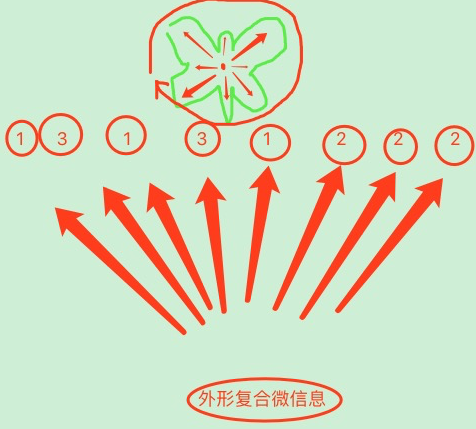
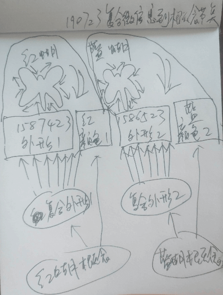
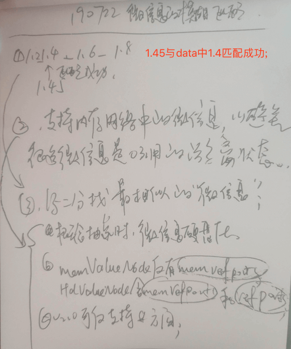
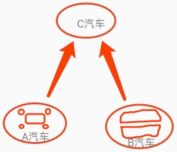

<!-- TOC -->

- [1. 有什么的问题](#1-有什么的问题)
- [2. 扩展算法result复合值 / 复合微信息](#2-扩展算法result复合值--复合微信息)
- [3. 扩展模糊祖母](#3-扩展模糊祖母)
- [4. 扩展主动视觉](#4-扩展主动视觉)
- [5. 视觉等大量数据不必进入硬盘 T](#5-视觉等大量数据不必进入硬盘-t)
- [6. 使用bool0和1来替代微信息中各种值](#6-使用bool0和1来替代微信息中各种值)
- [7. 对dataIn的结构化迭代](#7-对datain的结构化迭代)
- [8. AI的表达](#8-ai的表达)
- [9. mv高教](#9-mv高教)
- [10. 固化网络-小脑](#10-固化网络-小脑)
- [11. 瞬时记忆迭代计划](#11-瞬时记忆迭代计划)
- [12. 语言支持](#12-语言支持)
- [13. 扩展微信息的模糊匹配](#13-扩展微信息的模糊匹配)
- [14. v3.0版本计划](#14-v30版本计划)
- [15. 特征网络](#15-特征网络)
- [16. 取消subView构建为概念节点](#16-取消subview构建为概念节点)
- [17. 内类比,支持多个值的变化;](#17-内类比支持多个值的变化)
- [18. 方向索引的强度序列](#18-方向索引的强度序列)
- [19. 简化神经网络节点](#19-简化神经网络节点)
- [20. at&ds](#20-atds)
- [21. 去掉内类比大小](#21-去掉内类比大小)
- [22. 遗忘](#22-遗忘)
- [23. 恢复概念嵌套](#23-恢复概念嵌套)
- [24. 时序嵌套](#24-时序嵌套)
- [25. Ports拆分单存](#25-ports拆分单存)
- [26. 从TIP转移内类比到TIR](#26-从tip转移内类比到tir)
- [27. NLP细节计划](#27-nlp细节计划)
- [28. 更及时响应demandManager非第一任务](#28-更及时响应demandmanager非第一任务)
- [29. 静概念与动概念的网络表示迭代](#29-静概念与动概念的网络表示迭代)
- [30. 完善TOR理性反思](#30-完善tor理性反思)
- [31. 决策在LSP之外对瞬时记忆的应用](#31-决策在lsp之外对瞬时记忆的应用)
- [33. 完善全含TIRFo](#33-完善全含tirfo)
- [34. 外层循环-仅保留最后一个行为输出](#34-外层循环-仅保留最后一个行为输出)
- [35. 外类比扩展,支持占位抽象](#35-外类比扩展支持占位抽象)
- [36. 扩展瞬时记忆](#36-扩展瞬时记忆)
- [37. 区标识索引](#37-区标识索引)
- [38. 特征类比抽象](#38-特征类比抽象)
- [39. 识别简化迭代](#39-识别简化迭代)
- [40. 神经网络迭代](#40-神经网络迭代)
- [41. 应用到地球大脑](#41-应用到地球大脑)
- [42. 预测时构建触发器](#42-预测时构建触发器)
- [43. 多任务](#43-多任务)
- [44. 时序识别加上超时失败机制](#44-时序识别加上超时失败机制)
- [其它](#其它)

<!-- /TOC -->

### 1. 有什么的问题

| 简介 >> |
| --- |
| 关于场景的祖母,`如小鸟生存场景,包含了树,公路,坚果等祖母` |
| 分析 >> |
| 本质上是:`祖母的嵌套问题`,也就是:`纵向组分循环的问题` ,`有什么`的问题 |

| 理性思维问题,分析TODO `190920` `参考note17` |
| --- |
| 分析,在衣服袋里,发现一个夹子,由此疑问夹子从哪来,然后联想到晾衣夹; (此理性过程的疑问从哪来,如何思维解?) |

### 2. 扩展算法result复合值 / 复合微信息

> 单值表达局限,但对于变化敏感;
> 如: 颜色用单值表达即局限;距离用单值表达变化即敏感;
> 注: 可与第3条,第11条,模糊匹配共同开发;

| 简介 >> |
| --- |
| 算法值不仅是"值类型",也有可能是一些复合类型; |
| 单值比如: 距离 |
| 复合值比如: 颜色的冷暖,颜色的红,绿,蓝; |

| 正文 >> |  |
| --- | --- |
| 1. 类比大小 | 单值可比大小,复合值不可,比如距离的远近+-祖母节点,而颜色没有; |
| 2. 类比相等 | 复合值中的每个值,都匹配,才可匹配; |
| 3. 模糊匹配 | 复合值中的每个值,各自进行模糊匹配; |

| 复合微信息示图 >> |
| --- |
|  |
| 1. 绿色为蝴蝶,此处的外形算法,精细度为8; |
| 2. 从左开始,顺时针一共取8个值; (傅里叶变换) |
| 3. 最终我们得到1,3,1,3,1,2,2,2这样的微信息结果; |
| 4. 下方是外形复合微信息,此复合微信息指向8个微信息值; |

| 复合微信息到概念节点示图 >> |
| --- |
|  |
| 1. 红蝴蝶外形,和颜色算法单独处理; |
| 2. 得出两个概念节点后,可类比抽象出蝴蝶; |
| 3. 抽象蝴蝶只保留了共同处,而不含`头的形状`和`颜色`这些细节信息; |
| 4. 匹配时,是优先与`抽象蝴蝶节点`匹配 (此时不管头的形状或任何颜色,都会被识别为蝴蝶); |

### 3. 扩展模糊祖母

> 注: v2.0小鸟大脑应用到现实世界,必须扩展支持模糊匹配功能;
> 当0.3是红,0.7也是红,那么会模糊到0.3->0.7都是红色;

| 简介 >> |
| --- |
| 可以用from-to来表示模糊匹配; |

| 方案 >> | DESC | 采用率 |
| --- | --- | --- |
| 1 | 将from-to用到祖母节点中; | 10% |
| 2 | 将from-to用于索引value中; | 90% |
| 更新结论 | 很难将ft建立到稀疏码中; | 参考18125 |

### 4. 扩展主动视觉

| 简介 >> |
| --- |
| 1. 被动视觉虽然简单,但具有很多局限性,所以在迭代中,要逐步以成熟化来突破局限; |
| 注: 视觉不是主动的,主动的只是转动头,或者云台罢了; |

### 5. 视觉等大量数据不必进入硬盘 T

> 对于快销品,来说,是快速类比(识别等)后,便会快速遗忘的,此类信息不必进入硬盘;

### 6. 使用bool0和1来替代微信息中各种值

> 1. 使用Bool来替代微信息的方式,只是在微信息处加了一层,并不影响根本,但却可能有非常意外的收获;
> 2. 其实目前已经是这样,微信息在计算机自动处理的中间层,在转换了0和1;

### 7. 对dataIn的结构化迭代

> 1. 在识别dataIn_NoMV_RecognitionIs取前limit个,或者dataIn_NoMV_RecognitionUse中firstPort,都是影响思维灵活性,可考虑用更结构化,(不应期+联想匹配)的方式,来解决此问题;

### 8. AI的表达

> 三上智也建议:名实分离  
> 小吧主:指代关系,nlp

### 9. mv高教

> 破耳狼建议:友善,可爱的硅基朋友;

### 10. 固化网络-小脑
`CreateTime 2019.05.19`

开发小脑固化网络 : 参考n16p11;

### 11. 瞬时记忆迭代计划
`CreateTime 2019.06.24`

> 迭代将瞬时记忆分为两个来源:
> 1. 不限制:我们所看到的最近信息的同时;
> 2. 限制x条:我们识别到的信息;
> 原理分析:4-8条,不是因为容量,而是因为思维活力仅能做到4到8条的识别;且未识别的信息部分,有极大可能被持久化之前就遗忘;但这丝毫不影响这些并不那么重要的信息被构建到具象概念节点中;

### 12. 语言支持
`CreateTime 2019.07.15`

1. 迭代支持初步的一些语言认知学习和决策输出;
2. 解释:语言输入也是认知信号输入,语言输出也是行为信息输出;
3. 比如:慢慢试各种输出,连"爸爸"这样的词,也得学很久;
4. 正如:走路,这样的动作,都要不断的试试试,不断的犯错,修正,才能学会走路;
5. 还有一个弱点,就是会形成一种动作习惯,很难改掉;

### 13. 扩展微信息的模糊匹配
`CreateTime 2019.07.22`

> 注: v2.0小鸟大脑应用到现实世界,必须扩展支持模糊匹配功能;
> 当0.3是红,0.7也是红,那么会模糊到0.3->0.7都是红色;
> 注: 模糊匹配功能可与第2条复合微信息功能同时开发;

|  |
| --- |
| 1. 改进二分算法找最相似微信息 (如图中1.45匹配data序列中1.4) |
| 2. 微信息模块,支持内存网络,规则如下: |
| 规则1. 构建时在内存网络; |
| 规则2. 抽象时迁移硬盘化; |
| 规则3. 只需跟着时序与概念的规则走就行; |

| from-to方案 |
| --- |
| Q 用实例,任务:找一个"有点红"的物体,来分析,我们如何匹配到的; |
| A 坑提示: 以稀疏码出发的话,很难在概念层,再去改变判断依据,即有点红,就算匹配; |

### 14. v3.0版本计划
`CreateTime 2019.07.23`

1. 迭代微信息对更加应用场景的支持: "我不能要求现实世界变的更简单,只能要求he能够适应更加复杂的现实世界";
2. 复合微信息
3. 微信息模糊匹配
2. 改用java80%/c20%做主开发语言;
3. 团队化运作;
4. 找合作伙伴;
5. 对开放接口规范;

### 15. 特征网络
`CreateTime 2019.08.09`

　　当前，要求皮层算法必须输出一个数值为稀疏码微信息，但单数值表现力有限，故需要扩展为支持数组输出。如表示一个形状等。

　　此时，对于输入的数据，需要扩展支持：“特征网络”，即在“稀疏码微信息”与“概念网络”之间，需要再加一个网络模块。

　　问题：皮层算法可否直接支持结构化算法结果，而不是单纯的数组一对多关系。此时，特征网络也须相应支持横向结构化一对多（即横向多模块特征网络）。

### 16. 取消subView构建为概念节点
`CreateTime 2019.08.16`

　　InputModels中的subView应取消直接构建成概念节点，而仅构建场景概念节点，别的概念应由抽象来生成。

### 17. 内类比,支持多个值的变化;

　　需支持特征网络后再做。否则同场景下，多个view中，有多个同区值时，可能出现即大、又小的情况。
　　有了特征网络后，对微信息的分组更加详细，即可支持多个值的变化。（或者不需要特征网络，目前已支持这样的view分组，编个号，非同一view下的微信息值，不可类比）。

### 18. 方向索引的强度序列
`CreateTime 2019.08.23`

1. 支持微信息模糊匹配后，mv索引要有更精细的匹配。比如（有点饿，饿，非常饿）。
2. 行为化成功时强度+n，失败时-n（其中n与当前任务的急迫度正相关）。

### 19. 简化神经网络节点

1. 把absNode和conNode合并成一个,且都含absPorts和conPorts端口;

### 20. at&ds

> 目前的比较混乱,
> 例如:at和ds在微信息中,分别表示算法区类型和算法类型;
> 再如:at和ds在概念中,分别表示当前概念指针地址pId,和继承由微信息组传过来的at作为ds;

1. 把所有的dataSource改成curType;
2. 把所有的algsType改成fromType;

### 21. 去掉内类比大小
`CreateTime 2019.09.12`

1. 因为抛物线,各种不同轨迹的运动方式;比如某物运行,可能是10-9-8,然后突然变成0;
2. 将内类比大小,由时序替代,比如A10-A9-A8-A0;
3. 由时序替代后,时序需要支持delta索引,比如上例为-1,-1,-8;

### 22. 遗忘
`CreateTime 2019.09.18`

1. 长时硬盘网络的强度序列ports.limit=10000; (TODOv3.0)
2. 短时内存网络的时间序列ports还维持目前的时间销毁;

### 23. 恢复概念嵌套
`CreateTime 2019.09.20`

> 注: 在he4o项目中,全局搜索一下"嵌套",照顾一下所有的地方需要的变动,然后再全局测试一下,使跑通ok;

| 恢复概念嵌套备忘 >> |
| --- |
|  |
| 1. A汽车有 `4轮+主体`; |
| 2. B汽车有 `左半车+右半车` |
| 3. A和B都是嵌套概念,且A和B都抽象指向`C汽车`,而A与B是两个具象节点; |

### 24. 时序嵌套
`CreateTime 2019.09.24`

> 1. 比如,先转身过人,后投篮得分;
> 2. 其中,转身过人,和投篮得分,都可能是单独的时序,且可能还不止一个;
> 3. 复杂的嵌套结构,目前不予支持,待v3.0或者再后面版本,迭代支持;

### 25. Ports拆分单存
`CreateTime 2019.09.25`

> 1. 目前,像内存网络中,还有value_p中,都已经是单存状态,但algNode和foNode还是存在节点下;
> 2. 思考一下性能,看是否把HdNet中节点的refPorts,absPorts,conPorts,content_ps都进行拆分单存文件;

### 26. 从TIP转移内类比到TIR
`CreateTime 2019.10.12`

> v2.0版本,不需要应该也可以,但到3.0时,需要将此工作完成;

1. 恢复出TIR的内类比代码,并每桢输入都执行,最后一条的内类比;
2. 将TIP中的内类比取消掉,理性内类比,仅在TIR逐桢运作;

### 27. NLP细节计划
`CreateTime 2019.10.13`
> 听话是声音输入,语言是行为输出;

1. nlp每个字词概念单独构建节点。
2. 每个字的输出语音单独构建节点。
3. 比如，前数字/后单位。这样的时序抽象。和1kg/2m这样的具象

### 28. 更及时响应demandManager非第一任务
`CreateTime 2019.10.25`

> 在任务丰富时,单纯靠urgentTo来排序做第一任务,太感性了,会让智能体沉迷在不现实的事中,无法自拔;所以本节,主要针对所有任务的,最应该先做什么,后做什么,做迭代改进;

| 方案 >> |  |
| --- | --- |
| 方案1 | 将TIR.matchMv提交到TOP中,做mv匹配,是否能够解决某个demandMv 5% |
| 方案2 | 按解决的delta排序,如`一元钱`,`一个吻`和`一亿元钱`对比做选择行为 95% |

| 方案2代码计划 >> |
| --- |
| 1. 支持matchFo与demandModel的匹配解决; |
| 2. 支持TOP中,每个demandModel的foModel,做一个匹配度对比,比如很容易吃到饭,但极难泡到妞;那么就先吃饭,再长远说泡妞的事儿; |

### 29. 静概念与动概念的网络表示迭代
`CreateTime 2019.11.01`

> 参考n17p13中代码段:  
>
> 原因: 在v3.0之后的网络,加入特征模块后更加细化时,这种直接索引的简单方式是难以工作的,所以还是要回到彻底的联想中来,把a3和a4建立关联,把a3和特征模块建议关联,把特征模块和稀疏码建立关联;这是一个完整的理性联想通路;

### 30. 完善TOR理性反思
`CreateTime 2019.12.04`

> 参考n17p20 表17202

### 31. 决策在LSP之外对瞬时记忆的应用
`CreateTime 2019.12.11`

> 1. 我在卧室,客厅有冰箱,虽然我没看到冰箱,但我可以根据卧室的真实,解决饥饿问题;(非LSP时的瞬时记忆帮助决策)
> 2. 目前小鸟演示不需要支持,但v3.0应对现实场景需要支持这个;

| 191216分析解决 >> |
| --- |
| 解: 此问题是对瞬时，接到短时，再接到长时，的配合。 |
| 短时比如: 上午我买的苹果,在短时记忆中排最前面,我可以比较好的联想到它在冰箱; |
| 长时比如: 在经常在家的冰箱,或者在街上的饭馆解决饥饿问题,那么在家时,想饭馆,位置首先会否掉,然后冰箱,会被行为化成功; |

### 33. 完善全含TIRFo
`CreateTime 2019.12.27`

简介: 以全含的方式,来写TIRFo,以进行更完善的抽象关联,进尔可以更好的向抽象方向反思;

实例: f1[cpu+鸡蛋]=没问题,f2[电子设备+鸡蛋]=也没问题;但f3[电子设备+液体]则有问题;

疑问: f3本来就与f1有抽象关联吗?还是根据鸡蛋为液体新关联?即,反思评价时,能否新增关联?

### 34. 外层循环-仅保留最后一个行为输出
`CreateTime 2020.01.20`

新OutputActions时,将旧的作废 (以后改为连续视觉后,会需要这样的支持,同时只能输出一个行为);`参考n18p5 BUG9 方案6`

### 35. 外类比扩展,支持占位抽象
`CreateTime 2020.01.29`

| 参考n13p15占位类比 >> |
| --- |
| 说明: 在外类比中,对时序中,同位置,不同信息,进行作用抽象; |
| 举例: 苹果和坚果都是`食物`(或叫`吃的`) |
| 附注: 对支持NLP自然语言有作用,参考n13p15; |
| 202004注: 外类比已拆分为正向反馈和反向反馈两个类比方式; |

### 36. 扩展瞬时记忆
`CreateTime 2020.04.29`

| A. 过去几年,我们曾将: |
| --- |
| 1. 输入放入瞬时; |
| 2. 识别等算法结果放入瞬时; |
| 3. 将输出放下瞬时; |
| **B. 随后要扩展如下:** |
| 1. 然后将思维中的更多有必要算法结果放入瞬时, |
| 2. 也将输出行为放入瞬时, |
| 3. 也将识别结果放入瞬时, |
| 4. 随后可以考虑将决策子算法的结果也放入瞬时, |
| 注: 瞬时会形成时序,使智能体了解自己的思维 (知道自己在想什么); |
| 注2: 目前我们正在将mModel全面应用于决策中 `参考n19p15`; |
| 相关名词: `自指`,`元认知`,`意识`,`循环` |

### 37. 区标识索引
`CreateTime 2020.07.30`

　　在稀疏码索引之外，再设计一套区标识索引，并设计到AIKVPointer中，使节点间很容易通过标识进行联想，而不依赖值。这样的话，带来的好处是，也许内类比大小可以简化至废除。而某动作会导致近或远，到时序中去根据`区标识索引`找即可。

### 38. 特征类比抽象
`CreateTime 2020.09.10` `参考n21p3`

### 39. 识别简化迭代
`CreateTime 2020.10.30` `参考21092`

### 40. 神经网络迭代
`CreateTime 2020.11.05` `参考n21p12`

### 41. 应用到地球大脑
`CreateTime 2020.11.07`

今天与樊京芳教授面聊,重点针对HE模型与工作原理进行交流,并在地球大脑的角度进行设想交流;

| 要求 | HE的唯一要求是面向现实环境的熵活跃度 |
| --- | --- |
| 聊及 | 在数据吞吐量达到成熟时,可以尝试应用; |
| 自想 | 是否可以尝试新增行为?地球行为,如气象控制; |

### 42. 预测时构建触发器
`CreateTime 2020.11.09` `参考20202`

原有方式是只有行为输出ActYes时构建触发器的,而思考改为在TIR_Fo预测,或行为输出反思预测时,构建触发器,然后只要预测与真实不符,就反省类比;

### 43. 多任务
`CreateTime 2020.12.14`

多任务基于原有DemandManager实现;

@破耳狼 如何表达犹豫不决的状态:

我: 在HE中,有两种评价:
1. 自由竞争:
   - 感性评价;
     - 感性博弈,A与B各举更新的子价值,参与进来竞争;
   - 理性评价;
     - HE并不是要评价最高的那个,而是可行的最高的那个;
     - 比如,我最爱吃山珍,但吃不起,所以最终我选择的还是中规中矩的炒面;

2. 关于持续的不决状态:
	> 目前HE并未涉及太多这方面,单从讨论角度的话,二者都是mv+,此时放弃任何一个,就意味着预期中的mv+变成0,所以这是难决舍的根源,而最后会选择哪个,(无论选择哪个),另一个的不舍依然是存在的;

	> 比如我可以选择烤鱼或烤鸡,我最爱吃烤鱼(mv+10),但烤鸡(mv+8)也挺喜欢的;

	> 尽管最终我选择了烤鱼 (因为mv+10更大),但我依然不舍烤鸡 (因为mv+8变成mv0其实是失去了8)
	> 或许这其中,只是不忍心做出失去烤鸡选择,而不是说鱼或鸡不香;
	> 而二者都不想失去的决策因为无法实现,而挂起;

### 44. 时序识别加上超时失败机制
`CreateTime 2021.11.16`,`参考24133-分析1`,`关于TIR_Fo`

* 举例: 1s后该在1米外结果不在;
* 条件: `当matchFoValue<1时 && 后一帧超时 = 匹配失败;`
* 超时: `BOOL 超时 = 已发生末帧lastInitTime + nextAlgDeltaTime < now();`

## 其它

| 其它 >> | 一句话需求 |
| --- | --- |
| 1 | 对特征网络与mv的直接关联 (202004补充,建议由反向类比来实现); |
