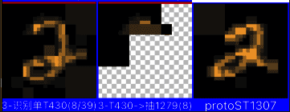
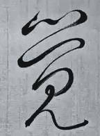
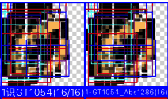

# 加权求和切图法 & 规模化高清图视觉训练 & 视觉注意力递归实现 & 视觉注意力吸引机制

**一、高清图性能小结：**
* 旧做法：我把高清图识别：从900像素到60000像素，是爆炸式的。
* 新做法：改成无论多高清，只识别粗略1000像素，然后细节处哪块吸引到注意力了，再下轮识别思维里再传过来ProtoImage + CropRect，进入下轮1000像素识别。
* 相当于：把爆炸的，变成纯1=1加法了。

**二、关于视觉注意力机制目前有两种：**
1. 在工作记忆树上，有共同抽象的
      比如：我想在视野里找我的名字，结果视觉中好像有一个像文字的，我会着重去看一眼那里
      另外：这里涉及到视觉注意范围的反射反应到后天主动过度等细节，此处不展开。
2. 动体注意力，即前后帧变化的。
      比如：静止视野中突然有一只小虫子动了一下。
      另外：这个涉及到动体程度竞争等，此处不展开。
3. 目前主要做第一种视觉注意力机制。

***

<!-- TOC -->

- [加权求和切图法 & 规模化高清图视觉训练 & 视觉注意力递归实现 & 视觉注意力吸引机制](#加权求和切图法--规模化高清图视觉训练--视觉注意力递归实现--视觉注意力吸引机制)
  - [n37p01 自举匹配数太低问题：方案制定与理论契合](#n37p01-自举匹配数太低问题方案制定与理论契合)
  - [n37p02 自举匹配数太低问题：实践-加权求和切图法](#n37p02-自举匹配数太低问题实践-加权求和切图法)
  - [n37p03 自举匹配数太低问题：测试-加权求和切图法](#n37p03-自举匹配数太低问题测试-加权求和切图法)
  - [n37p03 特征识别：调配参数（一）](#n37p03-特征识别调配参数一)
  - [n37p04 特征识别优化（一）：连续视觉-专注循环](#n37p04-特征识别优化一连续视觉-专注循环)
  - [n37p05 特征识别：调配参数（二）](#n37p05-特征识别调配参数二)
  - [n37p05 训练一、从绝对准度转向 -> 竞争浮现为准](#n37p05-训练一从绝对准度转向---竞争浮现为准)
  - [n37p07 训练二、整理系统流程 -> 为规模训练准备](#n37p07-训练二整理系统流程---为规模训练准备)
  - [n37p08 训练三、高清图测性能 -> 为规模训练准备](#n37p08-训练三高清图测性能---为规模训练准备)
  - [n37p09 训练四、摄像头彩图 -> 为规模训练准备](#n37p09-训练四摄像头彩图---为规模训练准备)
  - [n37p10 特征识别优化（二）：视觉注意力递归](#n37p10-特征识别优化二视觉注意力递归)
  - [n37p11 特征识别优化（三）：常规优化收尾](#n37p11-特征识别优化三常规优化收尾)
  - [n37p12 视觉注意力递归：迭代特征表征 与 识别（废弃）](#n37p12-视觉注意力递归迭代特征表征-与-识别废弃)
  - [n37p13 加权求和切图法：改为依据原图内容计算（废弃）](#n37p13-加权求和切图法改为依据原图内容计算废弃)
  - [n37p14 视觉注意力递归：改为在整个思维上实现](#n37p14-视觉注意力递归改为在整个思维上实现)
  - [n37p15 视觉注意力递归：保证多轮思维的良性循环螺旋](#n37p15-视觉注意力递归保证多轮思维的良性循环螺旋)
  - [n37p16 训练五、强训工具 -> 为规模训练准备](#n37p16-训练五强训工具---为规模训练准备)
  - [n37p17 特征识别优化（四）：动体注意力](#n37p17-特征识别优化四动体注意力)
  - [n37p18 训练六、具身环境 -> 为规模训练准备](#n37p18-训练六具身环境---为规模训练准备)
  - [n37p19 视觉注意力递归：思维循环反射反应聚焦行为实践](#n37p19-视觉注意力递归思维循环反射反应聚焦行为实践)

<!-- /TOC -->

***

## n37p01 自举匹配数太低问题：方案制定与理论契合
`CreateTime 2026.04.06`

上n36147末尾，调整特征识别的竞争配置参数，结果发现：用2与2自举匹配时，匹配数也很低，本节先查下这个。如果最基本的自举匹配都有BUG，那后面的特征准确度自然是怎么调都不可能提上来。

| 37011 | 自举匹配数太低的问题（上节测得） |
| --- | --- |
| 示图 |  |
| 日志 | 03. 单特征识别结果:T430 (08/39) 匹配度:0.89 匹配数:8 = 总分:7.12（稳定性:26.75） |
| 说明 | 如上图和日志，明明是ProtoST2识别到AssST2，但识别结果的匹配数只有8/39。 |
| 分析 | 两个2只是有一些倾斜不同，别的还是非常相似的。 |
| 思路 | 先调整自举算法：1、相邻rect影响锚点计算。2、另外要用偏移量尝试找附近更准的下个rect。 |
| 方案1 | **自举支持平移**：现在的单纯scales自举匹配不够用，至少得支持平移。 |
| 方案2 | **相邻影响锚点**：另外支持下相邻rect支持影响锚点计算。 |
| 抉择 | 以上两个方案各是各的，都需要推进，但此处两方案都显得不够深入，需继续深入分析下，见下： |

**小结：上表初步分析自举匹配数太低问题。**

| 37012 | 上表初步分析，本表继续深入。 |
| --- | --- |
| 深入 | 将这两个方案结合一下，因为锚点即需要各种计算，又会影响缩放偏移，下面深入分析下锚点的细则梳理。 |
| 锚点 | 1、怎么做锚点？ST有锚点，里面的GV也各有描点。 |
|  | 2、必须借助这些ST和GV的rect来计算锚点。 |
|  | 3、借助整体不太准，要照顾相邻才对，不然徒有整体观却无准确。 |
|  | 4、所以：找出上下左右四个方向的rect，分别计算一个锚点（如果只有一两个方向有，则只计算一两个。 |
|  | 5、将原本的nextItem.rect，被这些锚点影响后的rect计算出来，做为切图区域。 |
|  | 6、每个锚点加上抖动范围（替代原来的scales），在这个抖动范围上进行缩放偏移等。 |
|  | 总结：现在就是以整体（和相邻一帧）来推测nextItem.切图rect的，根据上方案改进下，步骤如下： |
| 步骤 | 1、找出四周相邻的Rect（GV找GV，ST找ST）。 |
|  | 2、对找到的分别计算锚点。 |
|  | 3、每个锚点加上抖动范围。 |
|  | 4、在抖动范围上进行缩放偏移。 |
|  | 5、从这些切图中，找出最匹配的。 |
| 方案3 | 根据以上梳理的步骤：先根据相邻rect算锚点，再根据锚点加抖动范围实现缩放偏移，找出最佳匹配。 |
| 结果 | 确定用锚点可以闭眼从proto切图找到一样吗？不一定吧？下表分析。 |

**小结：上表继续深入通过锚点分析自举匹配上的方法细节。**

| 37013 | 疑点：四个方向各一个锚点也不够用。 |
| --- | --- |
| 说明 | 锚点想通过缩放偏移找准确的切图rect，但肯定是不够的，且scales和deltas越多就越费算力。 |
| 示例 | 比如书法里的草书，写的鬼画符一样，但还是有不少字我们能认出来的。 |
|  | 草书觉字：，顶上明显是三点学字头。 |
| 反方 | 用锚点+缩放+平移肯定不够，你再缩放也是周正的，无法匹配上那个各种变形旋转混乱的草书。 |
| 思路 | 1、像这个三个点，肯定是识别到三折后抽象关联到三点。 |
|  | 2、但抽象的三点ST肯定不是bestGVs出来的，而是源自别处抽象来，到这儿也能勉强自举对应上。 |
|  | 3、这个觉字必须被识别成大致如：“学字头+盖+见”，而不是：“左上一个点+右上一个弯...”这种。 |
|  | 4、即激活到的GT也是稳定解（现在就是），稳定解才会有“学字头+盖+见”这样的构成。 |
|  | 5、学字头，应该慢慢浮现成一整个ST，可以统一进行自举。 |
| 发现1 | 即：浮现之初可以是“零左上+零右下”这种混乱的ST组合，但浮现成熟时，必然变成“一个瘦圈”来表示0。 |
|  | 而：这个浮现过程要随着训练，可见其慢慢浮现的进展。 |
|  | 6、可如果变形太严重，是万万自举不到的。 |
|  | 7、此时就要依赖：当初识别的assT的有效抽象，有指向现在的assGT.itemST了。 |
| 发现2 | 所以：看这意思，并不能依赖自举，还是得依赖更丰富的抽具象关联来。 |
|  | 8、那到底是assST自举切proto找匹配，还是assST向抽象与assGT.itemST找匹配。 |
|  | 9、看起来不断找稳定结果，不断丰富抽具象关联，是可以不依赖自举，单纯从微到宏求交识别到结果的。 |
| 发现3 | 所以：正因为有自举，才能匹配到很多混乱不像的以往结果。 |
|  | 10、有了这些不像的匹配，才能抽象出更抽象的抽象，亦因此才有机会丰富抽具象关联。 |
|  | 11、这些更抽象和更丰富的抽具象关联，又反过来使自举更能匹配上。 |
| 发现4 | 稳定抽象和丰富关联很重要，但自举也一样重要，二者相对如兄弟递进走路。 |
| 结果 | 四个锚点确实不够应对草书这种，但四锚点慢慢浮现出的稳定抽象和丰富关联，能反过来使它支持匹配到草书。 |
| 总结 | 相对：四锚点为动，浮现出丰富关联稳定的抽象解为静。 |

**小结：上表通过草书示例，分析锚点切图自举必要性，以及稳定丰富关联的抽象解与之相对，也一样重要。**

| 37014 | “左自举与右稳定”的步骤梳理。 |
| --- | --- |
| 步骤1 | assST限于性能不可能太广，能切入就好（向性右）。 |
| 步骤2 | 有效抽象absST即稳定又抽具象关联丰富，但需要自举才能补齐步骤1的结果太窄问题（向性左）。 |
| 步骤3 | 步骤2的结果匹配率更高，抽象后得到更准确的稳定抽象结果（向性右）。 |
| 步骤4 | 这个更稳定的抽象结果，又反过来帮助自举更准确有效，甚至识别到草书（向性左）。 |
| 示例 | 若从小见的都是正体字，那永远无法识别草书，但只要草字见多，自然就能识别草书了。 |
| 总结 | 即：见草与识草形成一个动静相对成长的循环，使识别系统可自适应性成长。 |

**小结：上表将“左自举”与“右稳定”的相对，梳理成步骤。**
**总结：本节不仅分析方案，还不断深入直至契合到螺旋论理论基础为止。在做视觉这一年，确实理论上靠的少了，单纯做实验难免心里没底，容易苍蝇乱撞，所以以后还是要先思后行，避免这种思不足而行多的情况。**

****

## n37p02 自举匹配数太低问题：实践-加权求和切图法
`CreateTime 2026.04.07`

上节重点制定了方案，以及深入分析，直至契合理论，确保其具备一定正确性。

**名词：加权求和切图法，又名：吸附切图算法，因为个体受环境影响挤占区域，就像互相吸附在一起一样。**

| 37021 | 性能分析：对草书这种奇异性很大的情况，锚点也切不对地方。 |
| --- | --- |
| 说明 | 比如式字的长勾，可能写很长，记忆里没见过这么长的怎么办？要试多少回才能准确的从proto上切到它？ |
| 思路 | 我们要尽可能的用上自己的牌，来把算法优化的更好。 |
| 选手1 | assGT里的各个itemGV之间有位置关系（且能表达高亮）。 |
|  | 缺点：选手1算的锚点再好，也难以单独应对“草书式”字的长勾这种情况。 |
| 选手2 | protoST的各个itemGV之间也有位置关系（且能表达高亮）。 |
|  | 优点：protoGV的位置关系绝对准确。 |
|  | 缺点：各个protoGV的rect切图组合，与长宽，与assGV之间有错位问题。 |
| 所以 | 把选手1和选手2结合起来。 |
|  | 1、选手1负责用锚点算出大致的切图方向范围（比如两个锚点规定可左不可右，两个规定>20之外切多远都行）。 |
|  | 2、选手2负责在选手1指定的方向范围内，找出高亮的点（意在告诉选手1这个范围能有效切到内容）。 |
| 总结 | 即Ass告诉Proto我大致要切哪，Proto再告诉Ass你切的范围内哪里有内容，哪里是空白的切不到内容。 |

**小结：上表大致制定了“Ass与Proto合作来实现准确切图”：Ass表明自己要切哪个范围，Proto表明哪块有的切哪块切不到。**
**问题：可是切不到的位置就没意义吗？未必。没有白，单纯用黑是计算不出渐变的。**

```md
37022-计算标准锚点的位置。
回顾: 原来的锚点是根据olds_Proto和new_Proto来计算的，现在改为从四个方向分别计算锚点，来计算newGV能挤占到的空间范围。
思路1：所有oldBestGVs中的元素都是已知其所占空间，而未收集过的都是预估其空间。
  说明：每个已知都是占了空间的，未知是不一定的，在已知与未知之间找到能挤占的空间范围。
  1、如果某方向上，有oldBestGV了，则成为一条已知空间证据。
  2、如果某方向上，没有oldBestGV，但有未知gv，则这个预估空间也会约束newGV的空间。
  3、如果某方向上，即没有oldBestGV，又没有未知gv，那就相当于直至收集到colorDic的边缘，都算它的可用空间。
思路2：根据距离计算：根据距离来估算实际切图大小。
  比如：newGV宽10，ass中与左oldLeftGV距离为25，但实际proto上与oldLeftGV距离为50，则计算newGV实际切图宽为20。
  1、本来newGV与四个方向最近的oldGV本来的距离根据各自的gv_Ass能算出，得到：gv_AssDistance。
  2、而newGV实际的newProto，与oldGV两个gv_Proto也能计算出距离，得到：gv_ProtoDistance。
  3、gv_AssDistance与gv_ProtoDistance本来是有一个比例的。
  4、但这个比例随着proto中新的切图元素，会互相挤占空间。
  5、所以newGV_Proto并不是单纯的不变，而是会被这四个方向上的锚点挤占空间：得到挤占后的new_Proto。
  6、这些挤占，也只是给了一个范围，在这个范围内我们分成十等份，从这些等份里，找出最准的bestItem。
思路3：根据minX,maxX,minY,maxY，四个新的从OldGV中找对齐，计算出4个锚点。
  1、以maxY为准，向左右找oldGV，找到对齐后，计算自身的标准锚点位置（另外三条类似）。
  2、比如根据newGV的maxY，从左右分别找到对齐的oldGV，结果找到三个同样最近的，三者实际在Proto中的Y值分别为3、5、7。
  2.2、不能只找最近的，如果最近的当时匹配度很低呢？也不能被它一颗老鼠屎带歪。
  2.3、所以应该是离的近的权重更大反之权重小。另外匹配度高的权重更大反之权重小。
  3、根据oldGV在Proto中的实际Y值3、5、7，可平均得出newGV实际的maxY切图位置为5。
思路4：根据四个角的xy两个值分别对齐来找4个锚点(x,y共八个值)。
  1、先根据四个角找对齐，以下以找LB点（左下）为准（别的点类似）。
  2、比如根据newGV的LB分别在x和y方向找已知oldGV，根据ass中newGV.LB点与oldGV对齐位置。
  3、然后根据oldGV在Proto中的位置，估计出newGV在的LB在Proto中的锚点位置。
抉择：分析哪个思路更好。
  1、思路2和思路3是类似的，只是思路3简单直观更好。
  2、思路1和思路3其实都是找已知为标，只是思路3更具体不是虚无缥缈的挤占空间而是实实在在的计算锚点位置。
  3、思路3和思路4的区别在于，思路4更细，可以切出不规则四边形，优点是能切图更准，缺点是切到图后得计算下平铺，目前思路3就够用了，先选定思路3。
  所以：思路3最好最简单直观具体可计算可编码，比之思路4也不至于多不刊用。
方案：根据minX,maxX,minY,maxY四个值，分别在此方向上找已知参照物，来计算锚点。
```

**小结：上表分析了：标准锚点的计算方式。**

```md
37023-计算锚点的抖动范围。
说明：上表计算了锚点的标准位置，但锚点并非绝对的，是可以邻近试探更准确的。本表则分析这个试探范围怎么计算。
思路1：参考37022上表中的思路1。
  1、明确已挤占的是100%不能动的。
  2、可能会挤占的只能挤掉它50%，不能全挤掉。
  3、绝对空白不挤的，可以外延到Proto边缘为止。
思路2、对每个方向上min和max分别计算。
  1、有明确挤占的，据此得到封顶max值。
  2、有可能挤占的，据此+50%得到max值。
  3、空间不挤占的，据此+150%得到max值。
  4、每个方向都是：减自身-50%得到min值。
```

**小结：上表分析了：锚点抖动范围的计算方式。**

| 37024 | TODOLIST实践规划 |
| --- | --- |
| 说明 | TODO1：是提升匹配率的关键，这条是广入，结果的竞争(与只保留best)是窄出。 |
|  | TODO2-10：里的各种锚点抖动计算只是为了提升匹配度。 |
| TODO1 | 先把自举best保留的匹配度阈值，由0.8改成全收集，然后竞争 `T`。 |
|  | 说明：因为婴儿期本来匹配度全不高，卡死的话，会导致匹配率必然很低。 |
| TODO2 | 离的近的权重更大反之权重小（参考37022-思路3-2.3）`转TODO7`。 |
| TODO3 | 匹配度高的权重更大反之权重小（参考37022-思路3-2.3）`转TODO7`。 |
|  | 说明：避免附近有了一个匹配度比别的都低，结果还把锚点带歪了，导致后面切图更不准确。 |
| TODO4 | 根据当前总assRect和总protoRect的比例，及curGV_Ass，预计出curGV_Proto `T`。 |
|  | 补充：根据已收集的bests来计算这个比例即可，至于newItem会切多大范围由锚点计算算法决定。 |
|  | 补充：GV锚点仅在ST内计算，ST锚点也仅在GT内计算，嵌套着各算各的，但都可以独立起作用。 |
| TODO5 | 写个ZiJvUtil，专门做自举相关的计算 `T`。 |
| TODO6 | 第一步：对curGV在各个方向上找对齐otherGVs `T`。 |
| TODO7 | 第二步：otherGVs每一个元素，根据其距离和匹配度计算出综合权重 `T`。 |
| TODO8 | 第三步：根据otherGVs权重，对当前curGV_Proto的minX/Y,maxX/Y分别计算最小锚点 `T`。 |
| TODO9 | 第四步：根据otherGVs权重，对当前curGV_Proto的minX/Y,maxX/Y分别计算最大锚点 `T`。 |
| TODO10 | 从最小到最大分成十份，分别切图判匹配，取最高的进行最终收集 `T`。 |
| TODO11 | 根据本表小结和重点：来调整这三个竞争因子的值代码 `T`。 |
| 重点 | **即：位置符合度天然为1，匹配率是竞争淘汰率决定的，真正各种算法优化只是为了提升匹配度。** |

37025-改完了总结下：
1. 匹配率低的原因是阈值太高（matchValue<0.8的全过滤了），把阈值去掉了（参考37024-TODO1）。
2. 匹配度阈值去掉后，就容易有不准确的干扰，越不准确的错位干扰越严重。所以最终其实主要是解决这个问题：
3. 通过改进锚点吸附计算切图范围找出更匹配度高的解。
4. 并且重构了切图算法，ST算ST的约束范围Rect，GV算GV的最终切图Rect，前者决定切的范围抖动，后者决定切图的具体及抖动。
**问题原因、本节问题说白了，并不是因为匹配率问题，而是匹配度不行，进尔导致匹配率也错判阈值变低，也导致一条不准的切图范围错了会连锁反应导致全不匹配的问题。**

**核心矛盾、矛盾在于，匹配度阈值高，匹配率就低。匹配度阈值低，一条不准导致后面更不准。**

**解决1、匹配率阈值彻底废弃，让它广入窄出。**

**解决2、用新的“加权求和切图法”来保障在更多附近找准的以及错了也有机会全局计算锚点找补回来。**

**总结：最终还是通过改进锚点计算“加权求和切图法”，来更准确的切图尝试找出更匹配度高的结果。**

****

## n37p03 自举匹配数太低问题：测试-加权求和切图法
`CreateTime 2026.04.11`

37031-初步测试有效。
01. 组特征识别结果:T1054 	匹配度:0.38 匹配率:1.00 完整性:0.62 = 综合得分:0.235（稳定性:1.00）（209/209） {Mnist0 = 1.00;}
02. 组特征识别结果:T944 	匹配度:0.36 匹配率:0.98 完整性:0.15 = 综合得分:0.054（稳定性:3.00）（51/52） {Mnist0 = 1.00;}
* 如上：虽然识别到的组特征太少（待查），但匹配率达到近于100%，匹配度也有40%，两个不太一样的0，也能识别的非常完整，如下图。
* 
* 结果：如上图，识别的209/209，此时ProtoImg是一个比较圆的0，不是这种长的，但匹配率100%。

| 37032 | BUG：查下为什么识别的GT结果那么少 |
| --- | --- |
| 调试 | 单纯训练手写0：加权求和切图法之前，ST匹配数在第10张0时为4-13，之后成了13-23。 |
| 原因 | 因为加权求和切图法，让匹配率大量提升，导致组成ProtoGT的absST长度变长，对撞率变低。 |
| 所以 | 现在的absST几乎只能索引到ProtoGT本身，激活不到别的以往GT，一共就识别了一条左右。 |
| 思路 | 1、也很简单，要么GT识别放开交层试一下。 |
|  | 2、要么就改通路，把bro加回来。 |
|  | 3、要么就加训，让ST抽具象树丰富起来。 |
| 方案1 | 放开bro，本来就允许部分匹配，然后抽象时抽象掉即可，这样抽具象才能更丰富进来，激活通路出能更多。 |
|  | 分析：虽然取bro是熵增，但本来GT识别最终会落到GV切图，是可以完全把bro中的非GV匹配部分剔除掉的。 |
|  | 而且：现在的GT识别结果的模型也是支持这个的（落到GV层）。 |
|  | 而且：现在的GT类比也是支持这个的（落到GV层，先类比ST再类比GT）。 |
|  | 所以：从上可见，现在把ST的ass->abs->bro通路拿回来，其实是有利而无害的。 |
| 动前 | 验证一下，通过加bro通路，确实可以激活到更多GT。 |
|  | 经验证：加上bro通路后，无效。 |
|  | 原因：因为是ST的抽象对撞不上导致的，加bro也得经过abs，abs都对撞不上，bro就只有protoST那一条。 |
|  | 即：**对撞不上，青城增加bro层通路一样对撞不上。** |
| 结果 | **方案1实践经查无效，转向下方继续分析。** |
| 思路 | 现在的问题是：似层ST再抽象也总是太具象了。 |
|  | 1、如果ST只识别似层，那它的交层就永远不可能丰富起来。 |
|  | 2、如果没有丰富的交层，就不可能对撞上。 |
| 方案2 | 当protoST抽象成新的absST时，把所有针对absST的有效抽象，也建立抽具象关联。 |
|  | 问题：protoST都是独一无二的，它压根就是新建的没任何abs关联，更没有有效抽象。 |
|  | 所以：除非抽象上对撞，不然指望从似层 + 有效抽象 => 来替代丰富抽具象的想法都是不成立的。 |
| 结果 | 所以还是得识别交层，提升类比抽象程度（转方案3）。 |
| 方案3 | 说白了：ST抽象度不够，看来得考虑把ST允许识别交层打开。 |
|  | 然后：竞争的时候，把防过抽加进去。 |
|  | 实践：把ST识别交层打开，把竞争因子加上匹配率（防止过具）。 |
| 结果 | 方案3实践后，回测，发现GT识别太少问题ok了 `T`。 |

****

## n37p03 特征识别：调配参数（一）
`CreateTime 2026.04.11`

```java
37033-测加权求和切图法 的 准确性：
前期准备：先把ST识别仅具层，然后竞争因子只保留匹配度，然后把cBestsFilter竞争也关掉。
测得问题：前期准备后，跑下先扔5张0，然后扔一张1，此时把1识别成0，并且匹配数竟然有38/39这么高（见下日志）。
01. 单特征识别结果:T0141 匹配度:0.65 (38/39) 稳定性:1.00 = 总分:0.65 {Mnist0 = 1.00;}
02. 单特征识别结果:T0099 匹配度:0.61 (34/36) 稳定性:1.00 = 总分:0.61 {Mnist0 = 1.00;}
03. 单特征识别结果:T0141 匹配度:0.59 (38/39) 稳定性:1.00 = 总分:0.59 {Mnist0 = 1.00;}
04. 单特征识别结果:T0099 匹配度:0.56 (35/36) 稳定性:1.00 = 总分:0.56 {Mnist0 = 1.00;}
05. 单特征识别结果:T0099 匹配度:0.56 (24/36) 稳定性:1.00 = 总分:0.56 {Mnist0 = 1.00;}
06. 单特征识别结果:T0141 匹配度:0.54 (37/39) 稳定性:1.00 = 总分:0.54 {Mnist0 = 1.00;}
07. 单特征识别结果:T0141 匹配度:0.54 (36/39) 稳定性:1.00 = 总分:0.54 {Mnist0 = 1.00;}
08. 单特征识别结果:T0066 匹配度:0.50 (43/45) 稳定性:1.00 = 总分:0.50 {Mnist0 = 1.00;}
09. 单特征识别结果:T0141 匹配度:0.50 (38/39) 稳定性:1.00 = 总分:0.50 {Mnist0 = 1.00;}
10. 单特征识别结果:T0066 匹配度:0.47 (43/45) 稳定性:1.00 = 总分:0.47 {Mnist0 = 1.00;}
11. 单特征识别结果:T0099 匹配度:0.46 (33/36) 稳定性:1.00 = 总分:0.46 {Mnist0 = 1.00;}
12. 单特征识别结果:T0099 匹配度:0.46 (35/36) 稳定性:1.00 = 总分:0.46 {Mnist0 = 1.00;}
分析：可见，加权求和切图法有点太宽松了，能把1识别成近乎全匹配的0，并且匹配度还高达平均65%。
思路：记忆里只有0当然会把1识别成0，加训两张1，如果1激活到1后的正确结果，还是敌不过激活到0的错误结果，才是有问题。
方案1、先调整跑5张0后，再跑2张1，然后再扔1，识别结果中1应该比0综合竞争分明显更高才对。
    结果：先选定这个方案边跑边观察问题 `转STEP1 & STEP2`。
方案2、挤占50%有点太多了，调整试下（如30%）。
    结果：这个是先测明白后，大样子都ok了，再调这个50%或30%，现在还没到这一步呢，不急调整。
方案3、匹配度没有阈值要求，如果全是0也能匹配上，还是加点基础要求（如>20%）。
    结果：让它匹配，最后竞争力下降就行了，合理。
方案4、或者把cBestFilter打开。
    结果：应该不能开，优缺点都要综合考虑才是公平竞争，如果都遮丑，竞争就没法公平了。
抉择：方案1最重要，不管用再试方案2-4。
```

```java
37033B-上表方案1推进：边跑跑扔0和1，边分析这里面的问题，边找思路边修细节边调整参数配置边测试。

STEP1、跑0x5+1x2后，再扔1，应激活到的有1也有0才对。
STEP2、扔1识别1，综合竞争分，应该比扔1识别0的更高才对（转下方调试分析下是否如此）。

1调试：需要两个竖1（不要倾斜）先试下并把具体匹配情况详情打出来观察分析下。
    经测：用两个竖1，得出的匹配度为70%，匹配率为40%，匹配度还行，匹配率较低。
    说明：准的并没有比不准的：得到更高更准的竞争评分，感觉时高时低的，并不太稳定。
    结果：感觉总是有不确定性在干扰匹配度和匹配率，得深入细节探查一下原因，转下方疑点和思路。
2疑点：把吸附力，改为用冷却曲线，别用线性，即0距离绝对匹配权重为1时，占很大作用，而远离或不匹配时极速冷却。
    问题：任一条偏差都会带来连锁影响，什么样的下一条可以接受，什么样的下一条绝对不可接受。
    说明：到最后收集完bestGVs再竞争就晚了，因为这个过程中就会影响走偏。
    解答：但收集过程中，有加权求和切图算法，不准确的影响会削弱（可以加上冷却曲线，使不准的影响更弱）。
    经测：现在还没到这一步，不是说对齐的不够准，而是压根就有很多不准的bestGV被匹配上了。
    结果：那就先不到这一步的问题先解决后，再回来测这个冷却曲线的必要性，转下方思路。
    追加：顺手把冷却曲线加上了 `T`。
3思路：有不少匹配度不高的多余bestGV（比如1识别成0的右方竖线，还把顶上的圆拱带了一部分）。
    思路：把所有assSTs结果调到同一个匹配度，把这些不准确的bestGV滤掉，剩下的比匹配率（健全性）即可。
    总结：即以第一名匹配度为标准，把后面名次的低匹配度的bestGVs全过滤掉，剩下的再对比匹配率。
4思路：GV的三个值：GV的方向和色值这些，现在似乎对外形表达的不够准确。
    比如：以一串为例来表达相似的意思：145和226，这两个值的diff和jun值都是一样的，其方向也是同样从小到大。
    但是：上面的145和226在外形上很不相同。
    所以：外形和内征可以分开，外形另引入一个叫隔点的概念。
    比如：隔点说明，表示在方向上的一个点，其两端的色值之和相等）145的中间隔点1+4刚好=5，而226的隔离点在22再+1才等于6-1，所以其隔点更靠后。
    方案：即 “外形” 不应该被 “内征” 强干扰，二者各论各的，如下展开：
      1、外形：由方向（指现在的方向）+ 隔点（指在方向上的分隔色值的中点：其两端色值之和相等）= 表示ST外形。
      2、内征：由均色（现jun）+ 色差（现diff）= 表示色值内征。
    总结：将GV的三个值迭代为四个值，其中：方向+隔点=外形，均色+色值=内征。
5思路：外形 与 内征 处理方式的不同。外形表达proto和ass之间的对比（即外形是否一样）而内征表达图内相邻一致性（即单纯ass内不能变化太大）。
    比如：画布是四个区间不同颜色组成，在上面画一个0，这个0由四种反背景色共同组成，但此时一样可以识别出0。
TODO1：在计算GVIndex时，有大区小区，直接用小区占9宫的占比，来表达分隔点（简单但精度低先这么用） `T`。
TODO2：在gv自举算法中，外形（方向和分隔点）需要protoT与assT一致（作用：表达外形匹配）`T`。
TODO3：在gv自举算法中，内征（色差和色均值）需要在assT的各bestGV间保持过滤平缓（公式：用平均平缓度）`T`。
    小结：改外形内征后，有效但不多（效果15%）。
6思路：提升准确度的竞争力让不准的机会更少：别用gv准确度的平均了 直接用乘法乘积（避免有任何不准确的细节）`T`。
    小结：改乘积后，效果较明显，但不够百分百确定（效果45%）。
7思路：assST是为了找出稳定的抽象局部特征，那它匹配率就不能低吧？在同一个匹配率的基础上，对比匹配度？
    说明：是按思路3来，统一匹配度，pk匹配率？还是按思路7来，统一匹配率，pk匹配度？
    分析：感觉哪个也别统一，就都当竞争因子，不要互相之间影响，竞争不过的就自然淘汰。
8实测细节：还是得多观察下实测效果，多跑跑，观察下细节分析。
    测试点1、看每一个gv匹配度 和 相应rect，有没明显问题
    测试点2、是不是2疑点冷却曲线也可以支持下？ `T`
    测试点3、内征是不是也参与下竞争（求平均内征值不是乘积，不过当前也没啥用，diff可以测试下加到外征上跑跑看）。
9切合理论：深入分析下切合理论，实测和切合理论二者都重要。
    回顾：按以前的想法做法就是匹配度 防抽防具 竞争浮现稳定层，但以前这块的的做法也并未很切合理论。
    思路：任何都是优胜劣汰来竞争的，不是绝对的阈值。竞争强度怎么调到合理的值？
    方式1、可以结果导向，比如我就要多少条结果，剩下的全淘汰。
    方式2、可以竞争淘汰一定比例，比如末尾淘汰，或仅保留20%最准部分。
    原则1：**尽可能的优胜劣汰，每一步都广入窄出。**
    原则2：**直面问题，不要只识别具层，匹配度充分竞争（乘积），防抽防具，竞争浮现稳定层。**
    原则3：**规模效应，多训练十几张，观察稳定ST的浮现过程，观察竞争因子匹配度等越发明显。**
10结果：把上面的8和9未完成部分，总结一下，转37051继续。
```

**小结：上表做了：1、加权求和切图法加冷却曲线 2、加了分隔点 3、细分了外形和内征 4、特征匹配度改为乘积**
**小结：8继续实测细节和9切合理论原则，未完成，转37051继续。**

| 37034 | 配置：边路边改GT识别竞争因子，使之简单准确。 |
| --- | --- |
| 总结 | 上表搞了一些，37051继续搞。 |

| 37035 | 示例：通过“倾斜1和垂直1的切图匹配”的示例分析当前切图法是否够用。 |
| --- | --- |
| 示例 | 如果一个垂直1，一个倾斜1，中间和下方rect都匹配上了，那上方rect该怎么切图？ |
| 设想 | 这种情况要加权求和切图，那新的gv吸附力不该是0.5-1，该是1-1.5才对，否则很难匹配上。 |
| 思路 | 因为：倾斜后，如果是加权求和，那只能向着拉回垂直的趋势来拉回来切图。 |
|  | 但：其实这个是倾斜的，应该预测顶端更斜过去一些才对。 |
|  | 矛盾：有时会修正回垂直，有时会顺着倾斜下去，这要看Proto，即不可预测。 |
| 分析 | Proto相当于答案，而Ass相当于自举者。 |
|  | 疑问：自举者应该适应变形吗？如果适应，会不会导致识别错误？本来不准确，结果被你变形成准确了。 |
|  | 白话：瞎猫多强行通过变形碰到死耗子，但瞎猫就是瞎猫，不会变成抓耗子的好猫，反而识别到不准确结果。 |
| 所以 | 最多就是给点吸附算法就不错了，旋转变形这些就别想了，加上反而把识别不准的臆想成准的。 |
| 结果 | 倾斜的1，除非通过一条条rect吸附匹配上也是可以的，但通过变形旋转什么的就算了。 |

**小结：37035的设想没实施没什么用。**

| 37036 | 测得BUG：加权求和切图的吸附现在是右吸右，上吸上...这样有BUG。 |
| --- | --- |
| 方案 | 加权求和切图的吸附应该是右吸左，左右吸，上吸下，下吸上 `T`。 |

****

## n37p04 特征识别优化（一）：连续视觉-专注循环
`CreateTime 2026.04.16`

| 37201 | 连续视觉性能优化之：专注 |
| --- | --- |
| 简述 | 思维专注的地方，可以通过连续视觉来实现更好的持续更精准的识别。 |
| 思路 | 只要把思维专注的那些概念特征等，能更容易激活到即可。只要更容易激活到，即可触发识别算法细跑它。 |
| TODO1 | 即工作记忆中，激活的那些，更容易在被视觉ref的时候激活到。 |
| TODO2 | 从refPorts里把工作记忆里有的取交出来，然后根据工作记忆中的评分来排序。 |
| TODO3 | 排序前几名就能激活了，这样可以持续的专注识别。 |
| TODO4 | 工作记忆越认为它更匹配了更评分高，就更能专注识别它。 |
| 总结 | 这样形成一个工作记忆思维专注，与识别总激活更准确全面，的识别良性循环。 |
| 主观 | 思维主观感受上，就是我专注于哪里，哪里就更能识别准确全面清晰。 |

| 37202 | 问题：随着成长，旧的稳定了浮现了，那新的就没机会了（参考37052-TEST3）。 |
| --- | --- |
| 说明 | 37052-TEST3最终一辈子只用那几个直角ST，那新的永远没机会了？。 |
| 解答 | 可以单独对新的做一条激活通路（稳定的和新的平行可激活即可）。 |
| 所以 | 加上新的平行激活，避免总是只有旧的抽象的，没有新生的机会。 |
| 实践 | 可以直接把fromMem记上，从mem来的不根据稳定性末尾淘汰，且竞争时不判断稳定性即可。 |
| 暂停 | 现在不做这个也行，等竞争浮现这个大任务训练完成后，再来做这个“新的fromMem可平行激活”。 |

**小结：其实37201和37202都是类似问题，即：任务树的，fromMem的，这些有更好的激活机会，更细致的识别机会。**
**总结：本节优化想法并未实践，后面在n37p10会做一些类似的，不过与本节还是不太一样，本节的等需求迫切成熟后，再做。**

****

## n37p05 特征识别：调配参数（二）
`CreateTime 2026.04.20`

在37033B中，已完成4条，未完成2条，本节继续。
* 已完成：1、加权求和切图法加冷却曲线 2、加了分隔点 3、细分了外形和内征 4、特征匹配度改为乘积
* 未完成：1、第8条继续实测细节 2、第9条切合理论原则

| 37051 | 调整配置参数：调试项 |
| --- | --- |
| 调试项1 | 回顾保持：打开交层，主因子+防抽防具。 |
| 调试项2 | 熵减原则：尽可能充分竞争每步都广入窄出。 |
| 调试项3 | 规模浮现：规模效应加训观察稳定ST竞争浮现。 |
| 调试项4 | 回顾补齐：平均内征值做为竞争因子。 |
| 总结1 | 上表说白了，原来的竞争浮现原则不变，单纯进行加训而已。 |
| 总结2 | 竞争因子大概不变，充分竞争，并随着加训可竞争浮现（转下表继续）。 |

**小结：上表思考和回顾配置参数调试项，最终还是：综合竞争+充分竞争+竞争浮现，三大条活变化，而不是绝对达到多准的死指标。**

****

## n37p05 训练一、从绝对准度转向 -> 竞争浮现为准
`CreateTime 2026.04.21`

| 37052 | 训练由追求绝对值，转变为：追求越来越好的变化本身。 |
| --- | --- |
| 关键 | **上表最终重在变化本身，不要追求任何多准的指标，而是追求能训练越来越好的那个循环。** |
| 思路 | **主要是随着训练，一次次广入窄出充分竞争，可使之趋向于更准确的结果能竞争浮现。** |
| 解释 | **即不再追求绝对的准确，而是追求在变化中，可以越来越好。** |
| TEST1 | 竞争保留更好的，且随着训练可留到更好的。 |
|  | 示例：比如起初最好的是0.3，后面最好的就有0.8的。 |
| TEST2 | 匹配数也可以随着训练趋向更好的。 |
|  | 示例：比如起初匹配数高的只有3/38，后面可以有8/15的。 |
| TEST3 | 在更宏观视角上，训练动静转换，从量变到质变。 |
|  | 示例：比如开始一堆直角ST，浮现到最终优胜的，能用一辈子的就那几个直角ST。 |
| 结果 | 既然是训练浮现：只要越来越准即可，那只要： |
|  | **配上能越来越好的流程，然后加大规模训练即可（转下表继续）** |

**小结：上表彻底由追求死的:“硬性的那个达到多少准确值指标”，变成追求活的:“良性循环越来越好的变化本身”。**
**计划：所以后面，配好能越来越好的流程，然后加训练规模。**
**结果：确保系统流程能保证越来越好的能随着训练竞争浮现即可。**

****

## n37p07 训练二、整理系统流程 -> 为规模训练准备
`CreateTime 2026.04.22`

上表彻底从求准转向求浮现，本节继续找下浮现流程问题，为加大规模训练做好准备。

| 37071 | 整理训练流程问题，为加大规模训练做准备 |
| --- | --- |
| TODO1 | 把固定末尾淘汰20%，改成定责淘汰，避免最后稳定后还要继续淘汰 `T`。 |
|  | 说明：现在按固定末尾淘汰，会导致明明已经稳定了，还在淘汰，而定责淘汰，会在稳定后不再淘汰。 |

****

## n37p08 训练三、高清图测性能 -> 为规模训练准备
`CreateTime 2026.04.22`

上表彻底从求准转向求浮现，本节继续找下浮现流程问题，为加大规模训练做好准备。

| 37081 | 整理训练流程问题，为加大规模训练做准备 |
| --- | --- |
| TODO | 训练下高清图，看现在的特征算法性能怎么样 `T`。 |
| 经测 | 用摄像头拍6561像素图，喂给系统时，就有严重内存问题真机内存超额闪退了。 |
| 结果 | 转下表调试查原因，并优化修复。 |

| 37082 | 高清图内存爆满闪退问题：制定方案。 |
| --- | --- |
| 调试 | 经查，在dotSize粒度从粗到细展开时，要从最粗执行到最细，全跑完整个while循环。 |
| 线索 | 1、从recognitionFeatureV2_Step0()收集到16w条allRefPorts。 |
|  | 2、收集了16w条allRefPorts时，占用内存1.1G。 |
|  | 3、此时虽然跑完while循环了，但带着这么多allRefPorts，内存爆满闪退是迟早的事。 |
| 分析 | 这么多allRefPorts都有用吗？显然不是。 |
| 思路 | 1、现在的GT已经实现全面自举了，那么每一个gv是不是可以进入直达refST，然后refGT。 |
|  | 2、只要直达refST和refGT就不必等整个while循环完，每while循环一圈就调用一次特征识别。 |
|  | 3、也许循环只要进入几十次就找到识别结果了，压根没必要把上万次while全跑完。 |
| 原因 | 1、说到底，以前是微观全跑，宏观判交集，来做为识别结果匹配度保证的。 |
|  | 2、而现在全面改了自举后，早就不依赖微观全跑完了。 |
|  | 3、事实上微观全跑完也是不现实的，一个高清图，全跑任何微观都是算力和内存的灾难。 |
| 方案 | dotSize的while循环每进一次就直接把整个特征识别自举跑完（以后再扩展到概念时序）。 |
| 结果 | 本表制定方案，下表代码实践。 |

| 37083 | 高清图内存爆满闪退问题：TODOLIST |
| --- | --- |
| TODO1 | 直接dotSize的while循环每轮循环都调用识别 `T`。 |
| TODO2 | 按识别过的区域覆盖来防重，只要识别过区域覆盖了，就不再进行切入识别了 `T`。 |
|  | 进阶：一次就防重掉也太严格了，可考虑每个区域可以被覆盖2次（或更多次）。 |
| TODO3 | 在while循环的每个dotSize层，单独进行区域覆盖防重，避免粗细度极易把细粒度全防重掉 `T`。 |
| TODO4 | 把识别 和 竞争类比 分开做（又可以照顾识别性能，又可以照顾全面竞争）`T`。 |
|  | 原因：st竞争&类比，gt竞争&类比，这些只有整个while各粒度全识别完后才能充分竞争到的。 |
|  | 步骤1. 要不在while循环中：做st识别、gt识别、和区域覆盖防重。 |
|  | 步骤2. 到最后while结束后：再做st竞争，st类比，构建protogt，gt竞争，gt类比，这些。 |
| 结果 | 识别和竞争已经分开了，不过仍然有很严重的性能问题，转n37p10继续。 |

****

## n37p09 训练四、摄像头彩图 -> 为规模训练准备
`CreateTime 2026.04.22`

| 37091 | 摄像头实时采图 => 规模训练准备 |
| --- | --- |
| TODO | 启用摄像头，采集几万像素图像实时训练 `T`。 |

****

## n37p10 特征识别优化（二）：视觉注意力递归
`CreateTime 2026.04.29`

* 承上1、在37083改了while内部识别，最终while完再统一竞争后，发现内存还是爆涨，本节进行分析优化。
* 承上2、在37201点明了专注的识别优势，但未深入，本节继续深入下。

```java
37101: 特征识别性能问题：方案分析规划。
// ====== 说明、下方日志为：dotSize的while循环，防重命中率。
// 当前粒度层：4.50 识别st数：458 防重命中率：0.00 (0/16)
// 当前粒度层：3.46 识别st数：418 防重命中率：0.20 (5/25)
// 当前粒度层：2.66 识别st数：642 防重命中率：0.59 (38/64)
// 当前粒度层：2.05 识别st数：234 防重命中率：0.89 (108/121)
// 当前粒度层：1.58 识别st数：262 防重命中率：0.90 (203/225)
// 当前粒度层：1.21 识别st数：275 防重命中率：0.96 (386/400)
// 1. 不过识别到2289条st结果，需要这么多么？显然不需要。调试一下这些数据，看怎么做补全设计防重。
for (AIFeatureJvBuModel *stModel in itemResults) {
    [stModel run4BestGvsAtProtoTRect];
    NSLog(@"stModel:ST%ld 匹配数:%03ld AtProto:%@",stModel.assT.pId,stModel.bestGVs.count,Rect2Str(stModel.bestGVsAtProtoTRect));
}
// ====== 说明、下方日志为：一次循环识别结果。
// stModel:ST502 匹配数:019 AtProto:<x0 y0 w27 h28>
// stModel:ST502 匹配数:048 AtProto:<x-4 y-2 w31 h31>
// stModel:ST502 匹配数:006 AtProto:<x0 y0 w24 h24>
// stModel:ST502 匹配数:008 AtProto:<x0 y0 w26 h24>
// stModel:ST502 匹配数:010 AtProto:<x-4 y0 w31 h26>
// stModel:ST502 匹配数:003 AtProto:<x0 y0 w19 h23>
// ====== 说明、下方为整个while循环中，要识别好多次，防重不够，并且即使防重也很难控制好这个识别量，导致内存爆涨。
// 1. 有些匹配数太低的，可以提前竞争淘汰掉。
// 2. 现在是第二眼视觉，识别的全是第一眼时的ST502，各种平铺可以有非常多种铺法，这显然是不合适的。
//  方案1、可针对类似的预计平铺rect，做防重。
//  方案2、或者同一个refST和同一个refRect做防重。
//  方案3、或者相近切入点的同一个gv识别结果做防重（以前有过）。
// 3. 必须极端考虑了，每一次识别仅取有数的几条结果，不能这么发散下去，一旦发散，性能必不可控。
//  方案4、那就先模糊识别个大概，再对大概中优胜的注意力展开二次识别（目前只做两三次，后续再考虑更多次识别）。
//      步骤1、每次仅循环三个dotSize粒度，再细的不管了（比如我们仅识别到某块可能是个数字）。
//      步骤2、剩下的更细粒度的识别，用专注来解决（比如在可能是数字的一块会获取关注）。
//      步骤3、专注这一块时，这一帧专门针对这一小块切出来去识别（比如对可能是数字的这一块切出来，对它做步骤1三个dotSize粒度识别）。
//      最终：识别到数字的，并不是那一眼，而是连续视觉，专注来做到，每一眼仅做一点点，通过转移专注块，来实现最终识别结果。
//      进阶1、既然是连续视觉，持续专注，那就是会：1、经过“工作记忆”与反馈 2、经过决策来做专注哪一块的切图（比如找物品）。
//      进阶2、即：把步骤3切哪一块图，当成一个反射行为isOut进入输入，让它在可以随着学习决策，最终变成主动行为来调整专注点。
//      进阶3、比如：转运脖子眼珠，从场景中寻找当前需求里想要的物品如食物等，这不仅是连续视觉，也是从大致视觉到细致专注查找一整套流程。
//  抉择、方案1、2、3都治标不治本的，只有方案4最彻底，理应选用。
总结：选定方案4：视觉注意力递归（起初最粗，慢慢收束，从识别更准中找更更准）。
结果：选定方案4：进阶的较为全面等后续再做，当下可以先简单些做把直接每粒度层都计为一个专注层 `转下表进行实践规划 T`。
```

| 37102 | 上表方案4：视觉注意力递归->实践规划 |
| --- | --- |
| 说明 | 目前只做简单的：先识别粗粒度，粗粒度有大致结果的Rect范围，再切出来做二次嵌套识别。 |
| TODO1 | 把每个dotSize.while改成最多做三个粗粒度层，然后把识别结果竞争 `T`。 |
| TODO2 | 竞争后的识别结果，继续递归调用dotSize.while三个粒度层，再竞争结果 `T`。 |
| TODO3 | 最多递归两三次即可，将所有递归调用中的结果全收集起来 `T`。 |
| TODO4 | 最后把所有结果进行竞争和类比 `T`。 |
| 回测 | 改完经回测有效，识别4万像素的鸡图内存也没爆到闪退，且可以20s左右识别完。 |
| 结果 | 虽然有效，但20s显然是不行的，下节继续优化。 |

**总结：本节其实分两种注意力循环：**
1. 简：单帧视觉的识别中先粗后细的注意力rect递归（本文主要涉及此条）。
2. 繁：单帧识别找不到结果（比如一群人堆里找熟人），必须随着边决策边行为脖子眼珠调整再找。
3. 本文虽然对二者都会分析，不过先仅实现第1条简版（见37101-方案4）。

****

## n37p11 特征识别优化（三）：常规优化收尾
`CreateTime 2026.04.30`

上节做了主要的`视觉注意力递归`优化，本节对收尾候选数，防重等这些常规优化再收下尾。争取把高清图也能做到秒级识别。

| 37111 | 继续优化特征识别过程中的候选数 |
| --- | --- |
| TODO | 看把识别算法里的GV.refPort候选集减少一些，不要一次识别两百多条，太浪费没必要 `T`。 |
| 结果 | 结果：修改为保留50条左右了，但这个治标不治本，效果有限，改为50条只是广入变少了。 |

| 37112 | 视觉注意力递归：可根据切图范围复用 |
| --- | --- |
| 问题 | depthRect2时，有重复<x0 y0 w122 h122>的情况，这种情况应该不需要多次调用了。 |
| 说明 | 粗粒度调用depthRect()还好，细粒度时，多次调用其实都是很类似的<0,0,122,122>，性能浪费。 |
| TODO | 把重叠率高的，直接并一下一次调用得了 `T`。 |
| 结果 | 改了，当交集>80%时，会直接return跳过。 |

| 37113 | 切图优化 |
| --- | --- |
| 方案1 | 切图直接从img原图切rect，切完直接缩放成每dotSize为一像素，这样切图计算超简单。 |
|  | 说明：不用多像素点求和了，直接取一个像素就是色值。 |
| 方案2 | 其实把切图性能优化好，或能用GPU计算，和切img原图也没区别。 |
|  | 缺点：但显然更开发繁琐（需要protoImgDic不变变化重新计算等）。 |
|  | 优点：可以针对某块求和，某范围求和，等进行计算复用，自己掌控开发灵活性高。 |
| 抉择 | 偏向方案2，方案1再面对更大的图时，性能也会受限，方案2则更灵活计算复用等。 |
| 暂停 | 等后面需要实际改代码时，再继续，现在还在优化切图识别等，这个生成imgDic的代码更靠前，现在不需要改。 |

| 37114 |  |
| --- | --- |
| TODO1 | 把dotSize.while循环从3次循环改为仅循环一个粒度层 `T`。 |
|  | 总结说明：一层层向细粒度展开，别急。 |
| TODO2 | 把“视觉注意力递归”从递归2层改为5层 `T`。 |
|  | 追加说明：越多层越能一眼看到更细节（比如看到白墙上的污点），随后边测性能允许的话可再加到7甚至9。 |

****

## n37p12 视觉注意力递归：迭代特征表征 与 识别（废弃）
`CreateTime 2026.05.02`

起因：测得6w像素的鸡，竟然表征了6000多条gv，自举就会因此卡死。
思路：这恐怕得改特征的表征了，现在的三层40多条gv，四层200条，五层就6000条，这表征gv数在爆炸，必须改。

```java
37121-性能问题：高清图的protoST长度过长
复现：20260502: 测到有6000多条gv的protoST，扔个鸡（6w像素左右）就能复现。
思考：以下思考一下这个问题的代码流程，用于制定解决方案。
  1. 首先，不能全图压缩表征成protoST，这样本身就是不现实的，不细看的图其实都是很粗略的。
  2. 其实可以比如只展开最多4层粒度层，表征200个左右的gv，就是极限了。
  3. 如果要表征细节，可以在注意力专注细节时，再为细节生成protoST。
  4. 那么：在视觉注意力递归过程中各自生成一个protoST也是ok的。
方案:
  方案1：即注意力在哪，就给哪生成protoST（默认注意力为全图）。但所有protoST都只展开三四层粒度层收集gv。
  方案2：本方案更激进，是每次注意力范围的protoST仅收集一层粒度层，收集一个protoST/gv。
对比:
  1. 方案1是随着注意力，切三四层粒度层，生成protoST。
  2. 方案2是随着注意力，切一层粒度层，生成protoST/GV。
抉择: 不得不承认，方案2更简要灵活，拆的散，但耦合度更低，性能上也必能更优，暂选定方案2转下表。
```

| 37122 | 方案2展开分析之：表征 |
| --- | --- |
| 表征 | 特征表征分析步骤如下： |
| 步骤1 | 方案2，实则就是一个个从粗粒度到细粒度嵌套的gv。 |
| 步骤2 | 每两层之间，都是1对9的映射。 |
| 步骤3 | 多层之间，可以形成一个树，单枝能形成一个序，这样还可以预测，如下： |
|  | 示例：这模糊图看着像数字，但具体看不清是哪个数字。 |
|  | 单枝：只要有gv开头，后面每一层都是一到九的pid，所有层为一枝，可排成一个序列。 |
|  | 多层：多层是一整颗树，肯定不能全表征到一起，耦合太高且复杂度太高不容易控制判断等。 |
|  | 两层：可将每两层间表征用1条映射9条，计为一个局部特征。 |
| 步骤4 | 从粗到细粒度层，怎么判断是否要继续细化下去？ |
|  | 正之：展开的9宫之中，diff差异性大的才继续展开到细粒度层。 |
|  | 反之：展开的9宫之中，diff差异性很小，就没必要再展开到细粒度层了。 |
|  | 说明：当然这个差异性：取决于ProtoImgDic。 |
| 步骤5 | 把整个从粗到细粒度层的表征树，表征成一个GT。 |
| 总结 | 这种新的表征方式，浑然一体，和原来的自适合多粒度表征，完全是质变的进化。 |

| 37123 | 方案2展开分析之：识别 |
| --- | --- |
| 识别 | 特征识别步骤规划如下： |
| 步骤1 | 每两层1对9先表征成ST。 |
| 步骤2 | 再往细粒度层怎么做呢？如下分析： |
|  | 方案1、识别到结果不明确时，继续向细粒度展开1对9再表征ST，再识别。 |
|  | >>> 识别到结果明确时，就不再继续向细粒度展开，直接输出最终识别结果。 |
|  | >>> 否掉，判断是否明确？不能横加的固定阈值，应该由竞争来决定。 |
|  | 方案2、应该由assGT的自举来决定，因为gt已经表征了这颗树应该从粗到细有多少层。 |
|  | >>> 那么：只需要用AssGT自举展开，即可知道我们应当展开到多少细粒度层。 |
| 步骤3 | 把整个从粗到细粒度层的识别结果树，综合计算出匹配度等。 |
| 步骤4 | 整个从粗到细的识别结果相当于树的一个从根到叶的分枝，是一个曲线，最终进行多维曲线对比匹配度。 |
| 回顾 | 旧识别方式是每个粒度层，都进行单独识别。 |
| 总结 | 而本表新识别方式，把原来的dotSize.while递归 和 自举识别算法，流程完全并为一体性很强了。 |

**总结：其实这种表征和识别方式，相当于把原来的特征表征，自举识别，dotSize.while循环，都浑然一体了。**

| 37124 | 新特征表征识别：细则分析 |
| --- | --- |
| ProtoGT表征 | ProtoGT构建要独立运行，输入图就表征一个，与AssGT识别互不干扰。 |
| ProtoST表征 |  |

| 37125 | 新特征表征识别也有：错位问题，变形问题。 |
| --- | --- |
| 思路 | 现在的加权求和切图法应该还可以用，至少思路是一样的。 |

```csharp
37125-继续分析37121的方案1和方案2的比较：

方案回顾：
  方案1：即注意力在哪，就给哪生成protoST（默认注意力为全图）。但所有protoST都只展开三四层粒度层收集gv。
  方案2：本方案更激进，是每次注意力范围的protoST仅收集一层粒度层，收集一个protoST/gv。

PK分析：以下简称方案2为新方案，方案1为现方案。
  1. 新方案改动很大表征和识别都得改（参考37122 & 37123）。
  2. 新方案也有错位等问题，整体变形一些后，细粒度层九宫可能完全对不上，但应该也能大致对上才对（参考37125）。
  3. 现方案不怕变形后，细粒度层上的九宫完全对不上，它的表征是哪有信息表征哪，现在的Rect切图计算比起方案2严格的切细粒度层来说，要宽松且适应性强的多。
  4. 现方案保留了ProtoT构建的主权，新方案则没有这层主权ProtoT完全由粗到细的粒度规则来构建。
  5. 事实上，现实世界哪有那么规则的输入，都是各种变形混乱熵增。
  6. 现方案似乎更对，新方案虽然看起来很浑然一体，是牺牲了现方案的ProtoT的主权来的（新方案定死了细粒度九宫切图，且只切一层相当于只是一个GV）。
  7. 现方案其实相当于新方案 和 现方案的组合（它也具备新方案的优点）：
     7.1 新方案所追求的每层粒度层构建一个ST，组合起来的树是一个GT（更要求整颗树的连续性）。
     7.2 其实现方案的每三四层构建一次ST，这些ST再有机结合成一个GT（如粗看像刘一飞，细看下巴更尖）。
  8. 三四层构建一个ST，其实才表达了真正的ST，一层ST其实只是一个GV，它无法真正表达一个ST。
     8.1 说白了，新方案太完美化，从简到繁的连续性线性。
     8.2 事实上，旧方案实际可行，在有效信息的粗到细粒度间，找任何可能的区域扩散几层找出局部特征的更多个gv，然后整体再把显著的组合成一个整体特征。
抉择1：由上PK分析可见，还是旧方案更实际可用，方案2虽是好的想法但方案1仍够用，且方案2改动太大。

PK示例：三四层几乎可以稳定下来，识别到一个物品的大概了（我们识别一只鸡的时候，也不会完全把每根羽毛都细节到位）。
  那么：从这个角度看，方案1和2哪个好？
  相同：方案1和2都能达到表征和识别，自举，加权求和解决错位等。
  不同：方案2优点是：更加解耦灵活性能好。 方案1优点是：更加直观易读易表征（哪个粒度层有信息表征哪层 & 把树拍平成了序列）。
抉择2：从上对比，还是选保持方案1。

所以：目前不彻底改为方案2，仍保持用方案1，只是方案1应继续尽量吸取方案2带来的思路及优点。
```

****

## n37p13 加权求和切图法：改为依据原图内容计算（废弃）
`CreateTime 2026.05.05`

```java
37131：设想用色值等本来的原图内容，去影响做“加权求和切图法”
设想：不用几宫格均匀分布，然后根据gv来计算加权求和的切图范围，而是用内容来决定几宫格的尺寸，内容本身的色值等分布来计算加权求和的切图范围。
说明：相当于加权求和切图法的迭代，只是不再以GV为单位，而是以色值分布等来计算权重。
疑问：我们不能在原图上就假设它是什么“概念结果”，从而去用色值分布决定切图范围。因为原图并不绝对说明它该是哪个概念，而是识别到概念后它才是那个概念。
所以：不能本末倒置，就单纯的表征，让它去识别（自举）结果，让概念去勾原图，勾到结果发现匹配，它就是那个概念结果。
比如：如果一个不干净的纸上，写了一个字，我们不能因为纸本身的色值分布，就把字切歪切变形。
中断：本节设想中止，先不这么做。
```

****

## n37p14 视觉注意力递归：改为在整个思维上实现
`CreateTime 2026.05.05`

本节设想“视觉注意力递归”不要单纯在Input和识别算法处实现，而是放到整个Think循环上去实现。

```csharp
37141-疑问：如果你不想知道这个是什么，还会去细看吗？
说明：我的意思是，如果没有Demand的参与，我们还需要“视觉注意力递归”吗？
正据：在Input和识别算法处实现，缺点是性能肯定不佳，一张图事无巨细的去看，肯定性能差，人类玩找不同游戏也是盯了好久的。
流程："Input -> 切原图的默认全Rect范围 -> 只识别三层粒度层 -> 需求注意力在哪块 -> 输出Rect到视觉 -> Input -> 切原图的注意力Rect范围 -> 只识别三层粒度层 ..."。
方案1、0%：按原来的识别期递归来。
  缺点：性能有问题，不建议。
方案2、50%：识别期别做递归了，使用输入的Rect来切图，然后做识别。
方案3、100%：完全使用上面的流程来，整个思维都参与进来。
  缺点：方案3虽然正确，但测试范围太广了，现在HE也没有那么丰富的需求（如好奇心等都没有），要向饥饿和疼痛两个Demand靠，也不容易，毕竟现在的坚果Demo和Minst图的Demo没打通，挺麻烦的。
抉择：如上分析，方案1性能有问题，方案3又太完善不适合当前阶段，那就先退一步择中做方案2。
实践：
  1. 比如写个死任务“找数字”，或直接识别结果后，直接调用TCInput+传参CropRect进行下一轮细节识别。
  2. 识别结果直接判定能不能识别到像数字。
  3. 如果像（抽象）数字又不确定，再根据识别结果的Rect去进行下一轮Input的切图识别。
TODO1：把原来的"在singleTonDao上实现的视觉注意力递归"废弃掉，改为仅识别一轮 `T`。
TODO2：把Input图片切图时，都只输入27x27的三层粒度层 `T`。
  说明：每次输入识别仅识别三层，更多层，用整个思维上实现（细节范围的识别，通过再次TCInput输入cropRect来实现）。
TODO3：把Input图片切图时，支持cropRect(归一化传入) `T`。
TODO4：判断结果像数字，或像什么，再展开识别（可以在纸上写个2，然后用摄像头拍整张纸来测试）。
```

**至此：高清图性能应该是没问题了，其实核心问题就几点：**  
**1、太多粒度层导致一个st的gv太多。**  
**2、太高像素导致图像可视化工具超卡内存。**  
**结果：改为每次仅输入27x27，高清图时，通过嵌套粗27加细27，来解决细节表征和识别问题。**  
**总结：这样就避免越高清越算力和存储都爆炸的问题，高清图变成了低清图的嵌套，成了粗+细=2，而不是粗x细=爆炸。**

****

## n37p15 视觉注意力递归：保证多轮思维的良性循环螺旋
`CreateTime 2026.05.06`

回顾：在37141中，分析了：如果不想知道细节是什么，还想去细看吗？  
本节：继续探求另一个问题：我得先知道大概是什么，再去细看。

```java
37151-疑问：那你怎么知道这个大概是什么呢？
说明：总得先知道大概有什么，我再去细看。
本质：这是一个先有鸡还是先有蛋的问题。
思路：螺旋论的解是相对良性循环，所以必须前一轮循环主动给，后一轮循环主动接。
举例：你扫一页书一眼，知道上面有字儿，但并不知道（没有细节识别）具体是什么字儿。
方案1：把粗视野 和 细节粒度，加上视觉包含的关联 `5%`。
  缺点：粗视野 与 细节粒度，并非真正稳定对应的，这个关联带来的熵增也不会少。
方案2：把粗视野下的有细节的地方，都识别一下，不过只识别“个数条”ST候选集，大致判断一下（抽象）是什么就行 `95%`。
  优点：即不太废性能，还能探索一下细节上大致有什么感兴趣的。
抉择：如上优缺点分析，选定方案2 `T`。
```

```java
37152-方案2-流程步骤。
步骤：顺着思路理一下方案2的流程步骤如下：
  步骤1、方案2这么略识别到的结果，肯定是个准确率极低的结果。
  步骤2、与工作记忆树中ActWait状态的枝叶，判断有共同抽象即可（如都是字儿）。
  步骤3、把这个准确率低的结果的AssGT_ProtoRect输出“视觉注意力”寻找动作（反射动作）。
  步骤4、调用视觉Input，传AssGT_ProtoRect参数。
  步骤5、下轮注意力范围识别，并反馈识别到更准确的结果。
  步骤6、把“视觉注意力输出” -> “再识别” -> “更准确结果”，记录为时序（并随着成长抽象之）。
  步骤7、把今后的解，迁移过来这个“注意力输出”，由反射动作 演变 成主动行为（并可主动修正AssGT_ProtoRect，及眼珠转动，脖子转动等参数）。
用途：以上步骤，可用于像寻物，射击，读书，等等日常任务。
实践：先把这个代码写上吧，现在正了解此处代码，并且马上进行高清图训练了，很有必要现在就实践 `转n37p19`。
```

**小结：至此，整个应对高清图的视觉，完全融入到整个思维的良性循环螺旋中了，本节主要保证了这个循环是良性的，不是恶性的。**

****

## n37p16 训练五、强训工具 -> 为规模训练准备
`CreateTime 2026.05.06`

| 37161 | 强训工具 => 规模训练准备 |
| --- | --- |
| TODO1 | 把自动训练工具用起来，用来训练几十上百张图。 |
| TODO2 | 从本地图库采图，做批量训练。 |
| TODO3 | 从摄像头自动采图，做批量训练。 |

****

## n37p17 特征识别优化（四）：动体注意力
`CreateTime 2026.05.07`

**37171-示例分析：在动的物体吸引注意力**
* 示例：在动的可能是很小一只小虫子，或者与杂草背景很相似的捕猎动物。
* 说明：在动的物体会优先吸引注意力。
* 回顾：这个肯定与37151-方案2的从粗找大致感兴趣的，投细节注意力不一样。
* 思路：比如有两张图片有几处小细节不同，我们把两张图重叠放着。
  1. 然后切换，一切换就能看出哪里有变化，没变化的地方是不会注意的。
  2. 很显然用到了两帧变化，是变化的细节rect处，吸引了注意力，并着重进行了识别。
  3. 这个哪怕前一帧什么都没识别（其实它也不是依赖识别结果来对比的）。
  4. 用途：用于发现危险猎物等。
* 方案：可以直接对比两帧图像，把有变化的rect圈出来，然后调用下轮思维视觉Input并传这个rect参数过去。
* 细节：两帧图像上，有可能有多处都动了，此时涉及到动的程度区域竞争。
* 结果：先不做，目前还没做连续视觉，更没必要现在就做动体注意力。

****

## n37p18 训练六、具身环境 -> 为规模训练准备
`CreateTime 2026.05.07`

如果不接洽具体的任务，很难测到“视觉注意力”，所以本节分析具身机器人方案，让它随着具体需求任务，去做视觉训练。

**37181-具身机器人 DIY 方案对比表 (手机载体版)**

| 对比项 | **曼波小狗** | **StackChan (小栈板)** | **4-DOF 四足狗** | **DC 智能小车 (三轮/四轮)** |
|:--- |:--- |:--- |:--- |:--- |
| **核心定位** | 机械动力模型 | 桌面 AI 交互终端 | 仿生运动入门平台 | **移动开发底座 (最推荐)** |
| **参考价格** | 50 - 100 元 | 150 - 250 元 | 150 - 250 元 | **60 - 120 元** |
| **动力系统** | 直流减速电机 (1-2个) | 舵机 (2个) | 舵机 (4个) | 直流马达 + 驱动板 |
| **动作控制** | **极差**。物理锁死，难转向 | **一般**。仅原位转头/点头 | **中等**。可转向，需步态算法 | **极佳**。精准控制速度与方向 |
| **载重能力** | **无法承载手机** | 勉强托举 (需加固结构) | 较弱 (容易压坏舵机) | **极强**。稳固托举大屏幕手机 |
| **蓝牙控制参数** | 仅控制开关，无法传参 | 支持角度参数传递 | 支持每条腿的角度传参 | **支持速度/方向/坐标传参** |
| **作为“手机腿”** | 不合格 (带不动) | 不合格 (无法位移) | 趣味性高，但容易摔机 | **最理想**。稳定、快速、易调控 |

**37182-具身方案结论**

1. **曼波小狗**：虽然便宜，但结构太弱，带不动手机，且无法通过代码灵活控制动作。
2. **StackChan**：适合做“桌面摆件”，但由于没有轮子，不能带手机移动。
3. **4-DOF 四足狗**：虽然酷炫，但入门级舵机力矩不足，放上手机后重心难稳，容易摔机。
4. **DC 智能小车**：**最佳选择**。底盘稳、动力足、开发门槛低。通过蓝牙发送 PWM 参数即可控制手机精准移动。

**37183-推荐购买清单 (自建“手机腿”)**
* **底座**：4驱智能小车底盘 (带 TT 马达)。
* **主控**：ESP32-DevKit (内置蓝牙)。
* **驱动**：L298N 或 TB6612FNG 驱动模块。
* **配件**：手机支架 (车载粘接型)、18650 电池盒。

**37184-实践**
* 手机支持无线充电，正好用于训练视觉，后置摄像头（1200w像素）自己在家找无线充电板，然后跑过去充电。

****

## n37p19 视觉注意力递归：思维循环反射反应聚焦行为实践
`CreateTime 2026.05.07`

在37152中，对方案2，整个思维循环上实现视觉注意力，做了流程步骤整理，本节做代码实践部分。

**37191-实践前准备**
* TODO: 实践前，先回测下竞争浮现：实测Minst低像素图，可以逐步随着训练竞争因子变越来越好 `T`。
* 强训工具好了，并实测了下0-9x9轮，测得以下37191A问题。

**37191A-问题：特征识别候选结果太多，卡一下保留10%也足够了。**
* 日志：特征识别ST数:216 GT数:649
* 线索: 视觉注意力递归已经放到整个思维循环上实现了，所以粒度层循环这里不存在递归了，有些调用识别的逻辑可以改回原来了。
* 方案1: 在识别时，每个ref可以提前判否，提前过滤掉。
  - 缺点: 治标不治本，现在有切图复用池了，此方案如果不想误杀，也就过滤30%左右，从200多条变成140条仍然太多。
* 方案2: 还是得调广入窄出: 所有gv识别完再综合竞争保留二十条refST。所有st识别完，竞争完保留二十条refGT。
  1. 在粒度层循环里，只识别GV。
  2. 到所有粒度层跑完，再识别ST。
  3. ...
  4. 总结：把各块识别、竞争、类比、构建，这些都构建成一个个模块，用模块化方法来流程化统一调用。
* 抉择: 选定方案2，实践TODOLIST如下：
* TODO1: 模块化调用方法用commitInputWithSplitV2_SingleTonDao即可 `T`。
* TODO2: 流程为: GV识别->GV竞争->ST识别->ST竞争->ST类比->GT识别->GT竞争->GT类比->构建ProtoST->构建ProtoGT `T`。
* TODO3: GV识别单独封装成commitInput4GV()，在三四个粒度层内调用GV识别 `T`。
* TODO4: 把每次广入窄出的竞争收窄调下参数，GV、ST、GT的窄出都仅保留20多条，保证候选数别那么多 `T 广入多少条，需要展开分析解决下，转下表`。

**39191B-广入有失控问题导致性能差: 必须限制好每一次能广入多少条。**
* 说明: 最终能广入多少条，必须能控制，不能像GV或ST时，随意能ref广入多少就收多少，这样肯定性能不稳定。
* 方案1: 要么就优化即使广入激活的多，也没性能问题 `5%`。
  - 分析: 切入点只要变多，自举肯定是很耗能的（但没办法，又没法准确切到它的下一帧rect，自举已经是目前最节能的做法了）。
  - 结果: 所以方案1不成，自举是肯定要的，必须限制广入数。
* 方案2: 要么就限制广入数，广入激活的量不爆炸，自然性能就ok `95%`。
* 抉择: 根据以上分析，选定方案2。
* 子问题1: 有多个微观识别结果，都有多条refPorts，所以最后一共有多少条refPorts是失控的。
  - 解步骤1. 所以需要把目标定成：限制总refPorts的数量。
  - 解步骤2. 即把refPorts必须提前全收集起来，做个竞争。
  - 比如: 现在GV识别结果就是这么限的（识别并竞争后，把所有refPorts收集到一块竞争一下，限制limit数）。
  - TODO11: 把ST识别结果的refPorts也全收集起来，做个竞争。
* 子问题2: 另外，限制太狠了，又没法保证激活的里面就有准确的结果，所以：
  - 解步骤1: 实现不行，只能先识别出其抽象absT（对应37192-TODO1）。
  - 解步骤2: 然后再顺着具象，自举出它到底是个啥（对应37192-TODO3）。
  - 比如: 先识别出是个猫，再细致分辨它是个什么品种的猫。
  - 另外: 37192-TODO2正好要根据抽具象关联，判断吸引注意力，这里识别抽象正好对应上。
  - TODO21: 特征识别不限制具层，交层亦可，且公平竞争 `T 本就如此`。
  - 结果: 子问题2的实践转37192-TODO1-3来完成 `T 转37192-TODO1-3`。

**37192-视觉注意力在思路循环的代码实践**
* TODO1: 视觉感官：视觉输入是默认isOut=false，识别结果自带AssT_ProtoRect参数。
  - 回顾说明: 粗略识别（每次输入仅识别三四层）（现做法就是这样）。
  - 比如: 大概识别到是一只抽象猫的样子（对应37191B-子问题2-解步骤1）。
* TODO2: 判断吸引注意力：如判断共同抽象，如工作记忆中wait需要的和粗略识别到的大概都是字儿。
  - 判断依据：正常进行识别，工作记忆树反馈，规划综合竞争，任务生成，时序识别预测，价值预测，新任务生成竞争等即可。
  - 比如: 正好喜欢猫，那就吸引到注意力，且有想看清楚是什么品种猫的意向性（对应37191B-子问题2-解步骤2）。
* TODO3: 反射反应：根据识别结果，触发一个转向细节CropRect的反射反应，输出聚焦行为。
  - 回顾说明: 参考当时的吸吮和抓握反射（乌鸦的吃和飞反射反应），代码可复用。
  - 比如: 顺着TODO2的注意力，向具象看下这个CropRect处到底是什么猫品种（对应37191B-子问题2-解步骤2）。
* TODO4: 聚焦行为：注意力盯哪里这个行为是isOut=true，且带CropRect参数。
* TODO5: 下帧仍是isOut=false输入，识别结果自带AssT_ProtoRect参数。
