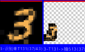
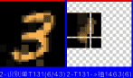

# 强训Mnist竞争浮现

***

<!-- TOC -->

- [强训Mnist竞争浮现](#强训mnist竞争浮现)
  - [n38p01 强训Mnist图库的：竞争->浮现->稳定](#n38p01-强训mnist图库的竞争-浮现-稳定)
  - [n38p02 废弃GT模块](#n38p02-废弃gt模块)

<!-- /TOC -->

***

## n38p01 强训Mnist图库的：竞争->浮现->稳定
`CreateTime 2026.04.12`

上37191B末尾，指出需要先跑好Mnist图库的竞争浮现，再跑摄像头视觉（参考37192）。

**38011-规划训练：竞争->浮现->稳定**
1. 第一阶段、从竞争到浮现：看能不能随着训练，识别到的ST和GT结果越来越有型（与Proto形状类似）。
   * 说明：我不知道是什么，到感觉识别到的这个应该就是这个Proto。
   * 示例：6可能由任何数字的局部构成，只要它构成的像6。
2. 第二阶段、从浮现到稳定：在形状成型后，再跑一段时间，“识别结果总结”的logDesc也开始准确了，即稳定。
   * 说明：我知道它是这个，且明确坚信它就是这个。
   * 示例：在输入各种Proto6时，总是最终能识别到稳定的那几个AssGT。

**38012-跑训练：第一阶段：从竞争到浮现**
* 训练Minst0-9多跑一些，比如x40轮，观察一下整理竞争浮现效果。
* 如果效果不佳，观察下竞争因子是否合理，分析下具体哪项竞争因子未达标，导致无法浮现。
* BUG1：训练40轮后，，，扔个0识别。
  01. 单特征识别结果:T0104 外形:0.53 内征:0.43 匹配率:0.95 (20/21) 稳定性:0.98 = 总分:4.26
  02. 单特征识别结果:T0220 外形:0.41 内征:0.65 匹配率:0.84 (16/19) 稳定性:0.77 = 总分:2.77
  03. 单特征识别结果:T0099 外形:0.43 内征:0.45 匹配率:0.81 (34/42) 稳定性:0.49 = 总分:2.59
  04. 单特征识别结果:T0059 外形:0.18 内征:0.92 匹配率:0.79 (19/24) 稳定性:0.65 = 总分:1.64
  05. 单特征识别结果:T0171 外形:0.39 内征:0.82 匹配率:0.65 (20/31) 稳定性:0.40 = 总分:1.63
  06. 单特征识别结果:T0103 外形:0.30 内征:0.78 匹配率:0.56 (10/18) 稳定性:0.88 = 总分:1.16
  - 问题：全是T50-T220之间的很早期的T，甚至像T59这种外形只有18%匹配的，也能战胜（因为`匹配数`高）。
  - 可能的解1、因为没有归一化，所以不行？
    - TODO1：计算匹配数的归一化值（可以类似`稳定性`用排名来计算）`T`。
  - 可能的解2、因为`匹配数`最具象层永远值很大，影响到准确性了，那么就可以降低它的权重或者机制，比如：改成末尾淘汰，不能喧宾夺主。
    - 回顾：原来的末尾淘汰前面刚取消掉（当时的原因是多项都淘汰时淘汰率就太高了）。
    - TODO2：改为把前80%竞争分全设为1，末尾20%竞争分保持原状，然后继续正常进行综合T结果竞争淘汰即可 `T`
  - TODO3：经测两种效果都不怎么样，还是得给各个竞争因子加权重，写个权重方法，允许给每个竞争因子加不同的权重 `T`。
  - 问题2：感觉具现程度不够，训练很久了，assGT和absGT都很具现杂乱。
  - 回顾：一共就五个竞争因子:outerShapeMatchValue、innerEigenMatchValue、modelMatchRatio、bestsCountScoreByRank、averageContentStrongScore;
  - 经测：把内征外形设为最重要，另外三个削弱至20%后，跑0-9x9轮后，发现识别结果普遍是很小的匹配数。
  - TODO4：所以，把匹配数的权重由0.2改回1再测下 `T`。
  - 结果：问题2的很具象杂乱问题，还是没修好 `转38013继续 T`。

**小结：38012是在强训的基础上调整参数，边调边重训练跑效果总结，并且明确加了每个竞争因子的权重。**

**38013-AssGT和AbsGT依然很具象杂乱有重影问题。**
* 说明：表现为：可视化时，总是有重影，其实就是各种AbsSTs拼凑出来很难免的问题。
* 疑点：问题的根在ProtoGT上，因为ProtoGT本来就是由各个AbsST拼起来的，它的一致性就很差，像一个四不像，各块拼起来的杂乱。
* 然后：要从这样的ProtoGT中找出规律的AbsGT来，还得很特征清晰，当然就很难。
* 方案1：ProtoGT不能由AbsSTs来构建，改为在protoImgDic的基础上构建出来。
* TODO1A：从protoImgDic上把识别到的absSTs的bestGVs分别切图，切出来后，构建成一个个ProtoST `T`。
* TODO2B：再把这些ProtoSTs构建成ProtoGT `T`。
* 问题：经实践方案1，发现无效：
  - 1、生成的一个个protoST，本身很抽象（全是比较暗黑的色块组成），因为前期识别并不准。
  - 2、这些protoST又这么大批量的构建，影响到整个系统一直在各种识别这种st结果。
* 矛盾：本身AbsSTs前期就是不太准的，而ProtoGT又想要表达的很准（表达最初的本图），这二者天然矛盾。
  - 补充说明：无论AbsSTs本身，还是根据AbsSTs的bestGVs到ProtoImgDic切图，都是不准确的。
* 思路：ProtoST准确是因为它从未脱离ProtoImgDic，ProtoGT只要脱离原图必须不准确，不脱离原图找线索，就压根没法构建ProtoGT。
* 方案2：找到构建ProtoGT的线索，又不脱离原图，又能把ProtoGT的元素st收集到。
  - 方式1、AbsSTs是脱离原图的（它更贴近AssST）`已验证过有重影杂乱`。
  - 方式2、根据AbsSTs来切原图，切出一个个ProtoST也是脱离原图的，因为它的切图范围，和准确度，都会使切图受到影响 `已验证过全是暗黑色块组成`。
  - 反据、只要gt的元素是st，就绝对需要先借助st为线索，才能构建成gt，但原图起初只有一个整图st，多个st又必须从ass找，找ass就脱离原图了。
  - 总结、这反据，看起来是无解死局，可以考虑方案3了。
* 方案3：把整个GT模块废弃掉 `转n38p02 T`。
* 抉择：去掉所有的可能，那个最不可能的就是最可能的解，方案3改动超大，转下节分析 `转n38p02 T`。

***

## n38p02 废弃GT模块
`CreateTime 2026.04.15`

在上节中，测得GT总是具象杂乱有重影等问题，经分析，ProtoGT本身就构建在熵混乱之上，它脱离了原图，而后最终的方案3为：废弃GT模块，但这个改动太大了，必须展开多想想再说。

***

**38021-先用开关来把所有的GT关掉，关掉后没什么大问题，再彻底删代码废弃。**
* 说明：先伪废弃关掉，留后路。
* TODO1：直接不构建ProtoGT即可关掉，只要没有任何一个ProtoGT被构建，它就不可能识别到GT，也不可能GT类比 `T`。
* TODO2：边训练边调权重，测试ST识别 `T`。
* TODO3：最终发现GT关掉后，也没什么问题 `T`。

***

**38022-BUG: 训练0-9十轮后，再扔两个0，发现识别结果中有下图这种。**
* 示图：
* 说明：识图0时，如果只是左下角，匹配上3，但匹配数却有37。
* 问题：如上图0的左下角，一共也没37条，怎么能匹配到37条呢？
* 原因：经调试：
  1. 当assST的27x27对应上protoRect的14x14(甚至更小时)。
  2. assST.item假如是3x3时，再去ProtoRect切连3x3都切不到。
  3. 此时可能只切到一两个像素，生成的gvIndex就四个值默认就为0,0,0,0。
  4. 这样容易导致很多误判为匹配，其实只是切图太小返回了默认罢了。
* 修复：在切图算法里，把width或height<3的直接返回nil，切不到九宫的直接判否。
* 回测：修后再跑，如图：。
* 结果：如图除了匹配上的部分（匹配数降为6条了），多余的3的弯匹配不到0了。

***

**38023-各竞争因子，分别制定竞争淘汰机制。**
* *起因：本表主要还是为了各种竞争因子，以往经历及今日问题及思路方案如下：*
  - 回顾：以往竞争因子各种加加减减，最终发现，太过简单的减去，和太多复杂的加太多，都并非好方法。
  - 调参：所以在38021中边训练训调参了目前的五个竞争因子权重，不过发现无论怎么调，有的还是不够强，有的还是不够弱。
  - 不足：所以本表，需要加强强的强度，降低弱的弱度，但weight最多就是0-1的范围，看来单纯用权重是不够的。
  - 思路：即然权重不够用了，那只好制定不同的竞争机制了，用更大而全的策略机制，来尝试解决此问题。
  - 方案：所以本表针对不同竞争因子，分别尝试制定更合理的策略机制。
* *方案细节：分析各个竞争因子的特性，如下：*
  - 1、高：外形内征必须达标80%（原因：因为不达标的它完全就不是这个东西）。
  - 2、中：匹配数总数进行自由竞争（原因：匹配范围越大肯定越好，不然只是局部匹配）。
  - 3、低：稳定性进行末尾淘汰（原因：太新的不稳定的，不能抢占资源，有了基础成长之后才有资格激活）。
* *实践规划：现在ST一共有五个竞争因子，以下分别按高中低排其重要性，并根据重要性制定竞争淘汰机制。*
  - TODO1、cOuterShapeWeight // 高：头部保留（大于80%匹配保留）。
  - TODO2、cInnerEigenWeight // 高：头部保留（大于80%匹配保留）。
  - TODO3、cTotalCountWeight // 中：越高越好（中间部分自由竞争）。
  - TODO4、cBestsCountWeight // 中：越高越好（中间部分自由竞争）。
  - TODO5、cAverStrongWeight // 低：末尾淘汰（小于20%强度淘汰）。
