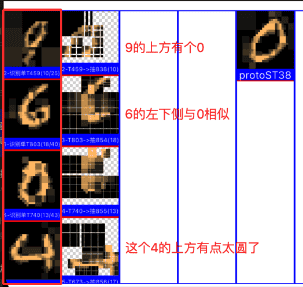
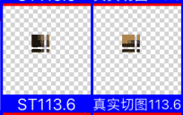

# 强训Mnist竞争浮现

***

<!-- TOC -->

- [强训Mnist竞争浮现](#强训mnist竞争浮现)
  - [n38p01 强训Mnist图库的：竞争->浮现->稳定](#n38p01-强训mnist图库的竞争-浮现-稳定)
  - [n38p02 废弃GT模块](#n38p02-废弃gt模块)
  - [n38p03 ST竞争之：递进淘汰法（主辅先后+每层权重）](#n38p03-st竞争之递进淘汰法主辅先后每层权重)

<!-- /TOC -->

***

## n38p01 强训Mnist图库的：竞争->浮现->稳定
`CreateTime 2026.04.12`

上37191B末尾，指出需要先跑好Mnist图库的竞争浮现，再跑摄像头视觉（参考37192）。

**38011-规划训练：竞争->浮现->稳定**
1. 第一阶段、从竞争到浮现：看能不能随着训练，识别到的ST和GT结果越来越有型（与Proto形状类似）。
   * 说明：我不知道是什么，到感觉识别到的这个应该就是这个Proto。
   * 示例：6可能由任何数字的局部构成，只要它构成的像6。
2. 第二阶段、从浮现到稳定：在形状成型后，再跑一段时间，“识别结果总结”的logDesc也开始准确了，即稳定。
   * 说明：我知道它是这个，且明确坚信它就是这个。
   * 示例：在输入各种Proto6时，总是最终能识别到稳定的那几个AssGT。

**38012-跑训练：第一阶段：从竞争到浮现**
* 训练Minst0-9多跑一些，比如x40轮，观察一下整理竞争浮现效果。
* 如果效果不佳，观察下竞争因子是否合理，分析下具体哪项竞争因子未达标，导致无法浮现。
* BUG1：训练40轮后，，，扔个0识别。
  01. 单特征识别结果:T0104 外形:0.53 内征:0.43 匹配率:0.95 (20/21) 稳定性:0.98 = 总分:4.26
  02. 单特征识别结果:T0220 外形:0.41 内征:0.65 匹配率:0.84 (16/19) 稳定性:0.77 = 总分:2.77
  03. 单特征识别结果:T0099 外形:0.43 内征:0.45 匹配率:0.81 (34/42) 稳定性:0.49 = 总分:2.59
  04. 单特征识别结果:T0059 外形:0.18 内征:0.92 匹配率:0.79 (19/24) 稳定性:0.65 = 总分:1.64
  05. 单特征识别结果:T0171 外形:0.39 内征:0.82 匹配率:0.65 (20/31) 稳定性:0.40 = 总分:1.63
  06. 单特征识别结果:T0103 外形:0.30 内征:0.78 匹配率:0.56 (10/18) 稳定性:0.88 = 总分:1.16
  - 问题：全是T50-T220之间的很早期的T，甚至像T59这种外形只有18%匹配的，也能战胜（因为`匹配数`高）。
  - 可能的解1、因为没有归一化，所以不行？
    - TODO1：计算匹配数的归一化值（可以类似`稳定性`用排名来计算）`T`。
  - 可能的解2、因为`匹配数`最具象层永远值很大，影响到准确性了，那么就可以降低它的权重或者机制，比如：改成末尾淘汰，不能喧宾夺主。
    - 回顾：原来的末尾淘汰前面刚取消掉（当时的原因是多项都淘汰时淘汰率就太高了）。
    - TODO2：改为把前80%竞争分全设为1，末尾20%竞争分保持原状，然后继续正常进行综合T结果竞争淘汰即可 `T`
  - TODO3：经测两种效果都不怎么样，还是得给各个竞争因子加权重，写个权重方法，允许给每个竞争因子加不同的权重 `T`。
  - 问题2：感觉具现程度不够，训练很久了，assGT和absGT都很具现杂乱。
  - 回顾：一共就五个竞争因子:outerShapeMatchValue、innerEigenMatchValue、modelMatchRatio、bestsCountScoreByRank、averageContentStrongScore;
  - 经测：把内征外形设为最重要，另外三个削弱至20%后，跑0-9x9轮后，发现识别结果普遍是很小的匹配数。
  - TODO4：所以，把匹配数的权重由0.2改回1再测下 `T`。
  - 结果：问题2的很具象杂乱问题，还是没修好 `转38013继续 T`。

**小结：38012是在强训的基础上调整参数，边调边重训练跑效果总结，并且明确加了每个竞争因子的权重。**

**38013-AssGT和AbsGT依然很具象杂乱有重影问题。**
* 说明：表现为：可视化时，总是有重影，其实就是各种AbsSTs拼凑出来很难免的问题。
* 疑点：问题的根在ProtoGT上，因为ProtoGT本来就是由各个AbsST拼起来的，它的一致性就很差，像一个四不像，各块拼起来的杂乱。
* 然后：要从这样的ProtoGT中找出规律的AbsGT来，还得很特征清晰，当然就很难。
* 方案1：ProtoGT不能由AbsSTs来构建，改为在protoImgDic的基础上构建出来。
* TODO1A：从protoImgDic上把识别到的absSTs的bestGVs分别切图，切出来后，构建成一个个ProtoST `T`。
* TODO2B：再把这些ProtoSTs构建成ProtoGT `T`。
* 问题：经实践方案1，发现无效：
  - 1、生成的一个个protoST，本身很抽象（全是比较暗黑的色块组成），因为前期识别并不准。
  - 2、这些protoST又这么大批量的构建，影响到整个系统一直在各种识别这种st结果。
* 矛盾：本身AbsSTs前期就是不太准的，而ProtoGT又想要表达的很准（表达最初的本图），这二者天然矛盾。
  - 补充说明：无论AbsSTs本身，还是根据AbsSTs的bestGVs到ProtoImgDic切图，都是不准确的。
* 思路：ProtoST准确是因为它从未脱离ProtoImgDic，ProtoGT只要脱离原图必须不准确，不脱离原图找线索，就压根没法构建ProtoGT。
* 方案2：找到构建ProtoGT的线索，又不脱离原图，又能把ProtoGT的元素st收集到。
  - 方式1、AbsSTs是脱离原图的（它更贴近AssST）`已验证过有重影杂乱`。
  - 方式2、根据AbsSTs来切原图，切出一个个ProtoST也是脱离原图的，因为它的切图范围，和准确度，都会使切图受到影响 `已验证过全是暗黑色块组成`。
  - 反据、只要gt的元素是st，就绝对需要先借助st为线索，才能构建成gt，但原图起初只有一个整图st，多个st又必须从ass找，找ass就脱离原图了。
  - 总结、这反据，看起来是无解死局，可以考虑方案3了。
* 方案3：把整个GT模块废弃掉 `转n38p02 T`。
* 抉择：去掉所有的可能，那个最不可能的就是最可能的解，方案3改动超大，转下节分析 `转n38p02 T`。

***

## n38p02 废弃GT模块
`CreateTime 2026.04.15`

在上节中，测得GT总是具象杂乱有重影等问题，经分析，ProtoGT本身就构建在熵混乱之上，它脱离了原图，而后最终的方案3为：废弃GT模块，但这个改动太大了，必须展开多想想再说。

***

**38021-先用开关来把所有的GT关掉，关掉后没什么大问题，再彻底删代码废弃。**
* 说明：先伪废弃关掉，留后路。
* TODO1：直接不构建ProtoGT即可关掉，只要没有任何一个ProtoGT被构建，它就不可能识别到GT，也不可能GT类比 `T`。
* TODO2：边训练边调权重，测试ST识别 `T`。
* TODO3：最终发现GT关掉后，也没什么问题 `T`。

***

**38022-BUG: 训练0-9十轮后，再扔两个0，发现识别结果中有下图这种。**
* 示图：
* 说明：识图0时，如果只是左下角，匹配上3，但匹配数却有37。
* 问题：如上图0的左下角，一共也没37条，怎么能匹配到37条呢？
* 原因：经调试：
  1. 当assST的27x27对应上protoRect的14x14(甚至更小时)。
  2. assST.item假如是3x3时，再去ProtoRect切连3x3都切不到。
  3. 此时可能只切到一两个像素，生成的gvIndex就四个值默认就为0,0,0,0。
  4. 这样容易导致很多误判为匹配，其实只是切图太小返回了默认罢了。
* 修复：在切图算法里，把width或height<3的直接返回nil，切不到九宫的直接判否。
* 回测：修后再跑，如图：。
* 结果：如图除了匹配上的部分（匹配数降为6条了），多余的3的弯匹配不到0了。

***

**38023-各竞争因子，分别制定竞争淘汰机制。**
* *起因：本表主要还是为了各种竞争因子，以往经历及今日问题及思路方案如下：*
  - 回顾：以往竞争因子各种加加减减，最终发现，太过简单的减去，和太多复杂的加太多，都并非好方法。
  - 调参：所以在38021中边训练训调参了目前的五个竞争因子权重，不过发现无论怎么调，有的还是不够强，有的还是不够弱。
  - 不足：所以本表，需要加强强的强度，降低弱的弱度，但weight最多就是0-1的范围，看来单纯用权重是不够的。
  - 思路：即然权重不够用了，那只好制定不同的竞争机制了，用更大而全的策略机制，来尝试解决此问题。
  - 方案：所以本表针对不同竞争因子，分别尝试制定更合理的策略机制。
* *方案细节：分析各个竞争因子的特性，如下：*
  - 1、高：外形内征必须达标80%（原因：因为不达标的它完全就不是这个东西）。
  - 2、中：匹配数总数进行自由竞争（原因：匹配范围越大肯定越好，不然只是局部匹配）。
  - 3、低：稳定性进行末尾淘汰（原因：太新的不稳定的，不能抢占资源，有了基础成长之后才有资格激活）。
* *实践规划：现在ST一共有五个竞争因子，以下分别按高中低排其重要性，并根据重要性制定竞争淘汰机制。*
  - TODO1、cOuterShapeWeight // 强：头部保留（大于80%匹配保留）`T`。
    - 代码：按冷却曲线，略小时就能很小竞争力，只有很大时才能保证竞争力 `T`。
  - TODO2、cInnerEigenWeight // 强：头部保留（大于80%匹配保留）`T 代码同上`。
  - TODO3、cTotalCountWeight // 中：自由竞争（中间部分越高越好）`T`。
    - 代码：用现有的竞争权重线性算法即可 `T 代码不变`。
  - TODO4、cBestsCountWeight // 中：自由竞争（中间部分越高越好）`T 代码同上`。
  - TODO5、cAverStrongWeight // 弱：末尾淘汰（小于20%强度淘汰）`T`。
    - 代码：用现有的广入时的末尾淘汰即可 `T 代码不变`。

***

**38024-BUG：常有匹配数过低的ST识别结果。**
* 分析：现在有两个竞争因子TotalCount和BestsCount是在用排名，计算竞争分。
* 问题：但如果匹配数全是1条，2条，排出来也只是全是屎里挑花，因为最多就2条而已。
* 方案：可以把protoST.count传进来做基准，不自己选max（有可能选出2）`T`。

**小结：上表修了一个ST竞争的小问题，其实ST竞争还有很多问题，下节展开来细细考详一下。**

***

## n38p03 ST竞争之：递进淘汰法（主辅先后+每层权重）
`CreateTime 2026.04.15`

测得外形内征无论怎么竞争，二者的竞争分值总是只有0.5左右，这显然ST识别结果就准确不起来，本节展开细致入微分析此题。

**38031-BUG：外形内征的浮现不足。**
* 问题：训练10-50个0-9，最终外形或内征也总在低竞争分值。
* 说明：按道理来说，随着竞争，应该能越来越准，直至达到80%以上才对。
* **思路1：从各个竞争因子间分析：**
  - 因为：四五个竞争因子互相影响，导致坏的外形内征也有机会竞争优胜，好的也可以被顶掉。
  - 所以：因此而制定方案如下。
  * 方案1：在好的里面排数量：`95%`
    - 说明：即给匹配度加阈值，淘汰多少，阈值就等于多少。
    - 即：在识别竞争前，先把外形内征的做一轮竞争，只保留20%最好的，再进行“元素数匹配数”的常规竞争。
  * 方案2：在数量不差的里面排好的：`5%`
    - 即：“元素数匹配数”仅做为末尾淘汰，先淘汰30%左右，剩下的进行外形内征竞争和最终竞争淘汰。
  * 抉择1：外形内征这两个强竞争因子是必须保证的，然后再说别的竞争。
  * 抉择2：我们是在准确里面挑数量高的，而不是在数量高里挑准确的，所以准确为主，数量为辅。
  * **结果：选定方案1，先过滤出准确的，再从中找数量高的。**
* **思路2：从外形内征对比来分析：**
  - 方案1：外形内征有一个值大即可：即二者取或（否掉，外形和内征是不一样的，展开来分析二者见下）`5%`。
  - 回顾：外形表示“方向和分隔点”，内征表示“色差和色均值”。
  - 外形：即使没内征也应该看着像。
    - 比如：用两种颜色拼成的汉字，也能识别出来是这个字。
  - 内征：没外形则可能完全不是一个东西。
    - 比如：竖1和横一，这两个色值色差是一样的，但完全不是一个东西。
  - 方案2：从上分析可得：外形为前提为主，内征为后求为辅，即外形为主内征为辅 `95%`。
  - **结果：从上分析可得：外形为主，内征为辅，二者并非同等位置。**
* 总结：
  - 1、由思路1得到：准确为主数量为辅。
  - 2、由思路2得到：外形为主内征为辅。
* **原则：为主即强规则，超出规则范围直接淘汰，为辅就是在为主的规则范围内再去竞争。**
* **引典：人法地，地法天，天法道，道法自然。**
* 结果：本表得出：准确为主数量为辅 & 外形为主内征为辅，这两个关键结论，实践转下表。

**38032-主辅竞争实践之：准确为主数量为辅 & 外形为主内征为辅**
* TODO1：外形为主内征为辅，计算出综合匹配度公式outinScore = outerShapeMatchValue * (1 + 0.2 * innerEigenMatchValue) `T`。
* TODO2：准确为主数量为辅，计算出综合得分公式finalScore = outinScore * (1 + 0.2 * bestsCount / totalCount) `T`。
* 转折：这个公式不太对，如果仅仅80%取前者，20%后者加成，那与现在的算法没什么区别了。改为：
  - 1、按外形直接淘汰80%，剩下的按内征来排序 => 计为准确度序列。
  - 2、然后再按准确度淘汰80%，剩下的按匹配数来排序 => 计为最终识别结果序列。
  - 实践方案1：以前代码里有过这个二段过滤的filter算法，找一找继续用 `5%`。
  - 实践方案2：或者直接重写得了，写法简单，没必要复杂化 `95%`。
* 总结：本节有转折，转折结果为：外形淘汰80%，内征再淘汰80%，再下一个辅层再淘汰80%... `转下表来实践`。

**38033-主辅竞争实践之：递进式竞争：主前辅后层层嵌套**
* TODO1：1、外形过滤80% 2、内征过滤80% 3、最后按匹配数排序 => 得到最终识别结果 `T`。
  - 即：主在前辅在后层层嵌套。
* TODO2：但每层过滤80%，并不能保证最后一层剩下多少条，所以用幂提前计算出每层过滤百争之多少 `T`。
* 结果：实践完成了，下表回测训练下。

**38034-回测与细节调整**
* 方案1、调整下，前面的少筛选些，后面的多筛选些，或者给这三项主辅过滤，加上权重。每项权重自定义。
  * 缺点：本表是来测试的，不是直接否认的。
  * 暂停：在三层过滤同样的力度不行时，再来考虑加权重，每层力度不同的事 `T 暂停`。
* 方案2、用不用先末尾淘汰，再主辅层层淘汰。
  * 优点：避免一下子太武断。
  * 缺点：本表是来测试的，不是直接否认的。
  * 暂停：在单轮进行层层过滤不行后，再想这个从轻到重，多循环几轮各进行多层过滤的事 `T 暂停`。
* 方案3、单纯边训练边观察哪个竞争因子重要，设为主，哪个不重要设为辅，甚至先关掉 `95%`。
  * 数量第一、数量少的太多了，外形后20%，几乎全是只有1-2条的，所以数量最重要 `T`。
  * 外形第二、数量最低的20%，全是只有1-2条的，所以降为第二 `T`。
  * 内征关掉、现在内征不那么重要，且内征应该是计算相邻的GV间，其相对内征是否连续，对内征来说这个连续性才重要 `T`。
  * **总结：所以改为了数量为主，外形次之，内征暂弃。**
* 实践结果：方案1和2太激进，以后再考虑，方案3边测边调参，最终改为：数量为主，外形次之，内征先关掉 `T`。
* 初步回测：经回测，在原有记忆基础上直接识别0，识别效果初步看起来还不错。
  * 示图：
* 深入回测：不过需要重跑下0-9训练再深入观察下，转下表。

**38035-测得BUG-上表中，像4其实和0并不太像**
* 调试：加调试工具，点击jvBuModel时，可以展开显示每个GV的匹配度（外形&内征）。
* 分析：显示出每个GV后，发现如下两个问题：
* 问题1：GV的可视化，只显示了三个码（色差，色值，方向），没显示第四个（sep分隔点）。
  - 解答：把第四个sep显示出来，看有没线索。
  - 中断：sep其实不太重要，因为显示三个码，当前可视化已经显示的很准确了。
* 问题2：有多个bestGV和实际切图可视化差异很大，其外形内征匹配多少？得核实着对比查下。
  - 原因：经调试主要是外形，尤其是方向，有一点不一样，就会有很大不同，但它在乘积里。
  - 解答：方向只占其中一个（四个乘积中的一个值），不够重，得加强。
  - 结果：转下表，对加强`方向`进行具体的方案和实践规划 `T 转下表`。
* **本质：在整条串联的层层竞争中，只要任何一层出现问题，都会导致木桶效应，所以GV识别层也必须做好。**

**38036-加强`方向`的权重：方案规划**
* 方案1：简单的加权 `5%`。
  - 问题：加权有各种被别的因子拉高回来的情况，还是递进式竞争淘汰是较成熟新方案 `转方案3 T`。
* 方案2：加阈值 `5%`。
  - 分析：加阈值是下策，中策是ST竞争，上策是借助ST的慢慢抽象稳定浮现，以提升整体的平均匹配度值。
  - 尝试：经尝试，这个阈值也不好一刀切，类比算法中已经有定责淘汰机制，此处不建议重复做这个。
  - 转折：还是放到ST竞争中，对方向、色均值、色差值、分隔点这些分别递进淘汰。
  - 结果：`转为方案3递进式竞争淘汰 T`。
* 方案3：也用层层递进式竞争，相当于把外形内征细致一层，直接改为用方向、色均值、色差值、分隔点四个值来递进淘汰。
  - 优点：这么细致展开的进行递进淘汰，好处就是控制到位，因方向不准确的问题就能解决到位。
  - 结果：转下表进行实践 `T`。

**38037-加强`方向`权重：TODOLIST**
* TODO1：在GV识别竞争时，用层层递进式竞争 `T`。
* TODO2：在ST识别竞争时，也把外形内征改为用：方向、色均值、色差值、分隔点，四个匹配度分别递进式淘汰 `T`。
* TODO3：加强`方向`在层层递进淘汰中的权重（不仅是先后顺序，这个主要指过滤率系数的权重） `T`。
* TODO4：把原来的外形内征废弃掉，没什么用了 `T`。
* 回测：再回测训练识别结果中方向偏差大的问题，看好了没，虽然算法改了递进淘汰法，但应该还需要调参，转下表。

**38038-方向还是有不准确的情况，0.76相近值，但方向显然还是不太准确。**
* 示图：
* 如图：右上，和左上，两个方向相邻但还是差90度左右。
* 思路：在上表已经改了GV层层递进淘汰，继续回去ST识别竞争处：调权重和主辅次序即可。
