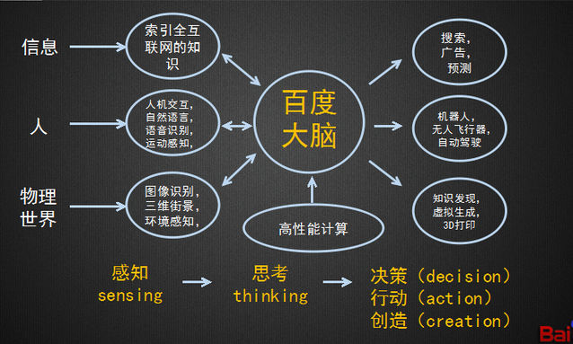

***

- 2010年吴恩达入googleX在Eric Teller的代领下参与开发谷歌大脑;
- 2013贾扬清caffe开源;
- 2014年吴恩达正式入百度;开发百度大脑;并将百度大脑作成平台;
- 2015.8Facebook_caffe2开源;
- 2015.11谷歌开源TensorFlow;
- 2016.1谷歌alphaGo打败李世石;
- 2017.1谷歌收购Deep Mind(意识开发)及多家机器人与人工智能公司;
- 2017.3吴恩达加入Device.ai;参与自动驾驶方面,欲推进自动驾驶实用化
- 2017.4百度开源自动驾驶代码;并且战略重点在百度大脑开放平台上;

### 总结:
- 百度谷歌fackbook
	- 缺点
		1. 缺少Mind的研究(GoogleX已经收购DeepMind,有望开发出下一代学习系统)
		2. 深度学习未真正的从线到面;即Understand不够聪明;
	- 改进方式
		1. 真正的deepLearning是基于整个大脑及Mind与Understand的;
		2. 唯一性判断不应分多层,应该直接由一个Controller来生成判断唯一性的动态策略;

- vicarious
	- 图式网络

- OpenAI
	- PPO

